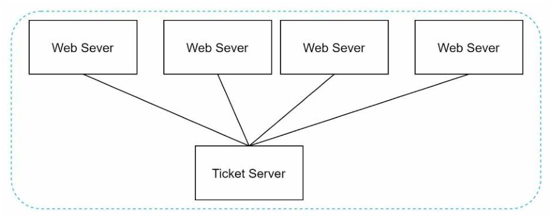

# 在分布式系统中设计唯一ID生成器

在本章中，你被要求设计一个分布式系统中的唯一 ID 生成器。你的第一个想法可能是在传统的数据库中使用一个带有自动递增属性的主键。然而，自动递增在分布式环境中是行不通的，因为一个单一的数据库服务器是不够大的。单个数据库服务器不够大，而且在多个数据库中以最小延迟生成唯一的 ID 是一个挑战。在多个数据库中以最小延迟生成唯一的 ID 是一个挑战。

下面是几个唯一 ID 的例子：

​																图 7-1

## 第1步--理解问题和建立设计范围

设计一个分布式唯一 ID 生成器，要求如下：

- ID 必须是唯一的。
- ID 只能是数值。
- ID 适合 64 位。
- ID 按日期排序。
- 每秒钟能产生超过 10,000 个独特的 ID。

## 第2步--提出高层次的设计

在分布式系统中，可以使用多种方案来生成唯一的 ID。我们考虑的方案选项是：

- 多主机复制
- 通用唯一标识符(UUID)
- 票据服务器（Ticket server）
- Twitter 的雪花 ID

让我们来看看他们每个方法，他们是如何工作的，以及每个选项的利弊。

### 多主复制

下图展示的是多主复制：

​															图 7-2

这种方法使用了数据库的自动递增功能。与其说是将下一个 ID 自增，不如说是自增 k，其中 k 是使用中的数据库服务器的数量。如图 7-2 所示，要生成的下一个 ID 等于同一服务器的上一个 ID 加 2。这解决了一些可扩展性问题，因为 ID 可以随着数据库服务器的数量而扩展。
然而，这种策略有一些主要的缺点：

- 很难在多个数据中心中进行扩展
- 在多个服务器上，ID 不会随着时间而上升。
- 当一个服务器被添加或删除时，它不能很好地扩展。

### UUID

UUID 是另一种获得唯一 ID 的简单方法。UUID 是一个 128 位的数字，用于识别计算机系统中的信息。UUID 获得重复的概率非常低。

[引自维基百科](https://en.wikipedia.org/wiki/Universally_unique_identifier)，"在每秒钟产生 10 亿个 UUIDs，大约 100 年后，创建一个重复的概率将达到 50%"。

这里有一个 UUID 的例子：`09c93e62-50b4-468d-bf8a-c07e1040bfb2`。UUID 可以独立生成，不需要服务器之间的协调。图 7-3 展示了 UUID 的设计。

​															图 7-3

在这种设计中，每个网络服务器都包含一个 ID 生成器，而一个网络服务器则负责独立生成 ID。

**优点：**

- 生成 UUID 很简单。服务器之间不需要协调，所以不会有任何同步的问题。
- 该系统很容易扩展，因为每个网络服务器都负责生成他们所使用的 ID。他们生成的 ID 都是独自生成消费的，可以很容易地与网络服务器一起扩展。

**缺点：**

- ID 的长度是 128位，但我们的要求是 64 位。
- ID 不会随着时间的推移而增加。
- ID 可以是非数字性的。
- ID 是无序的

### 票据服务

票据服务器是产生唯一 ID 的另一种有趣的方式。[Flicker 开发了票据服务来生成分布式主键](https://code.flickr.net/2010/02/08/ticket-servers-distributed-unique-primary-keys-on-the-cheap/)。该生成方式的工作原理值得一提。

​															图 7-4

这个想法是在一个单一的数据服务器（也称票据服务器）中使用一个集中的自动增量功能。要了解更多这方面的信息，请参考 [flicker 的工程博客文章](https://code.flickr.net/2010/02/08/ticket-servers-distributed-unique-primary-keys-on-the-cheap/)。

**优点：**

- 数值化的 ID。
- 它很容易实现，而且适用于中小规模的应用。

缺点：

- 单点故障。单一的票务服务器意味着如果票务服务器发生故障，所有依赖它的系统都将面临问题。为了避免单点故障，我们可以设置多个票务服务器。然而，这将引入新的分布式问题挑战，如数据同步。

### Tweeter 雪花 ID

上面提到的方法给了我们一些关于不同 ID 生成系统的想法。然而，它们都不符合我们的具体要求；因此，我们需要另一种方法。Twitter 的独特的 ID 生成系统 -- [雪花（snowflake）ID](https://blog.twitter.com/engineering/en_us/a/2010/announcing-snowflake.html)很有启发性，可以满足我们的要求。分而治之是我们的朋友。我们不是直接生成一个 ID，而是将一个 ID 分成不同的部分。图 7-5 显示了一个 64 位 ID 的布局。

​															图 7-5

下面介绍每个部分：

- 签名位：1 位。它总是 0，这是保留给未来使用的。它有可能被用来区分有符号和无符号的数字。
- 时间戳：41 位。自纪元或自定义纪元以来的毫秒。我们使用 Twitter snowflake 的默认纪元 1288834974657，相当于 2010年11月4日，01:42:54 UTC。
- 数据中心 ID：5 位，这给了我们 2 ^ 5 = 32 个数据中心。
- 机器ID：5 位，每个数据中心有 2 ^ 5 = 32 台机器。
- 序列号：12 位。对于在该机器/进程上产生的每一个 ID，序列号都会增加 1。该号码每隔一毫秒就被重置为 0。

## 第3步深入详解

在高层设计中，我们讨论了在分布式系统中设计唯一 ID 生成器的各种方案。我们确定了一种基于 Twitter 雪花 ID 生成器的方法。让我们深入了解一下这个设计。

数据中心 ID 和机器 ID 是在启动时选择的，一般来说，一旦系统开始运行就会固定下来。数据中心 ID 和机器 ID 的任何变化都需要仔细审查，因为这些数值的意外变化会导致 ID冲突。时间戳和序列号是在 ID 生成器运行时生成的。

### 时间戳

最重要的 41 位组成了时间戳部分。由于时间戳随时间增长，ID 可按时间排序。图 7-7 显示了一个二进制表示法转换为 UTC 的例子。你也可以用类似的方法将 UTC 转换回二进制表示法。

​														图 7-7

可以用 41 位表示的最大时间戳是`2 ^ 41 - 1 = 2199023255551（ms）`，这给我们带来了：`~ 69年=2199023255551毫秒/1000秒/365天/24小时/3600秒`。这意味着 ID 生成器将工作 69 年，有一个接近今天日期的自定义纪元时间可以延迟溢出时间。69 年后，我们将需要一个新的纪元时间或采用其他技术来迁移 ID。

### 序列号

序列号是 12 位，这给我们提供了`2 ^ 12 = 4096`种组合。这个字段是 0，除非在同一台服务器上一毫秒内产生一个以上的 ID。理论上，一台机器每毫秒最多可以支持 4096 个新ID。

## 总结

在这一章中，我们讨论了设计唯一 ID 生成器的不同方法：多主复制、UUID、票据服务器和 Twitter 雪花 ID 生成器。我们选择了雪花 ID，因为它支持我们所有的用例，并且在分布式环境中是可扩展的。

如果在本篇结束时，这里有一些额外的谈话要点：

- 时钟同步。在我们的设计中，我们假设 ID 代服务器有相同的时钟。当一个服务器在多个核心上运行时，这个假设可能并不真实。这种情况 在多机器的情况下也存在同样的挑战。时钟同步的解决方案是本书范围之外；但是了解这个问题的存在是很重要的。[网络时间协议（NTP）](https://en.wikipedia.org/wiki/Network_Time_Protocol)是解决这个问题最流行的方案。对于感兴趣的 读者可以参考参考资料[4]。
- 节段长度的调整。例如，较少的序列号但较多的时间戳位对低并发性和长期应用是有效的。
- 高可用性。由于 ID 生成器是一个关键任务的系统，它必须是高可用性。