# 设计一致性哈希

为了实现水平扩展，有效而均衡地分布请求/数据到各个服务器非常重要。一种常用的技术是**一致性哈希算法**。但首先，让我们深入探讨这个问题。 

## 重哈希问题

如果您有n个缓存服务器，平衡负载的常用方法是使用以下哈希方法： `serverIndex = hash(key) % N`，其中 N 是服务器池的大小。 让我们用一个例子来说明它是如何工作的。如表 5-1 所示，我们有 4 个服务器和 8 个字符串键及其哈希值。

| key  | hash     | hash % 4 |
| ---- | -------- | -------- |
| key0 | 18358617 | 1        |
| key1 | 26413584 | 0        |
| key2 | 18131146 | 2        |
| key3 | 35863496 | 0        |
| key4 | 34085809 | 1        |
| key5 | 27581703 | 3        |
| key6 | 38164978 | 2        |
| key7 | 22530351 | 3        |

​															表 5-1

为了找到存储一个键的服务器，我们执行模运算 `f(key) % 4`。例如，`hash(key0) % 4 = 1` 表示客户端必须联系服务器 1 来获取缓存的数据。图 5-1 根据表 5-1 显示了键的分布。

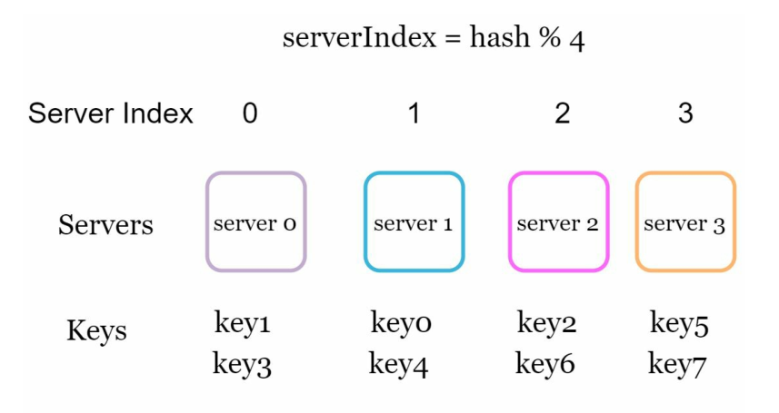

​															图 5-1

当服务器池的大小是固定的，并且数据分布是均匀的时，这种方法工作得很好。但是，当添加新服务器或删除现有服务器时，就会出现问题。例如，如果服务器 1 下线了，那么服务器池的大小就变成了 3。使用相同的哈希函数，我们得到相同的键值。但是应用模运算时，我们得到不同的服务器索引，因为服务器数量减少了 1。我们通过应用 hash % 3 得到表 5-2 中显示的结果：

| key  | hash     | hash % 3 |
| ---- | -------- | -------- |
| key0 | 18358617 | 0        |
| key1 | 26413584 | 0        |
| key2 | 18131146 | 1        |
| key3 | 35863496 | 2        |
| key4 | 34085809 | 1        |
| key5 | 27581703 | 0        |
| key6 | 38164978 | 1        |
| key7 | 22530351 | 0        |

​															表 5-2

根据表 5-2 修改后的 key 分配如图 5-2所示：

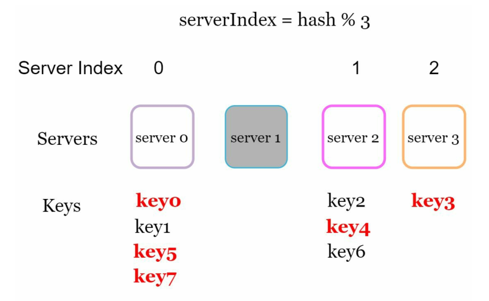

​															图 5-2

大多数键都会重新分配，而不仅仅是最初存储在离线服务器（服务器 1）上的键。这意味着当服务器 1 下线时，大多数缓存客户端将连接到错误的服务器来获取数据。这会导致大量的缓存未命中。一致性哈希是一种有效的技术，可以缓解这个问题。

## 一致性哈希

[一致性哈希](https://en.wikipedia.org/wiki/Consistent_hashing)引用维基百科的话：“一致性哈希是一种特殊的哈希，它使得当一个哈希表被重新调整大小并使用一致性哈希时，平均只需要重新映射 k/n 个键，其中 k 是键的数量，n 是槽的数量。相比之下，在大多数传统的哈希表中，数组槽的数量变化会导致几乎所有的键被重新映射。

## 哈希空间和哈希环

现在我们理解了一致性哈希的定义，让我们看看它是如何工作的。假设 SHA-1 被用作哈希函数 f，并且该哈希函数的输出范围是：x0, x1, x2, x3, …, xn。在密码学中，SHA-1 的哈希空间从 0 到 2^160 - 1。这意味着 x0 对应于 0，xn 对应于 2^160 – 1，以及中间的所有其他哈希值都落在 0 和 2^160 - 1 之间。图 5-3 显示了哈希空间。

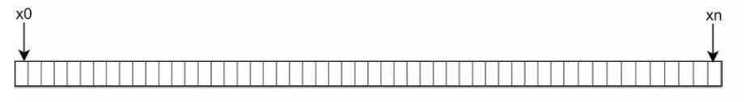

​														图 5-3

通过收集两端，得到一个哈希环，如图5-4所示：

​														图 5-4

## 哈希服务器

**使用相同的哈希函数 f，我们根据服务器 IP 或名称将服务器映射到环上**。如图 5-5 所示，哈希环上映射了 4 个服务器。

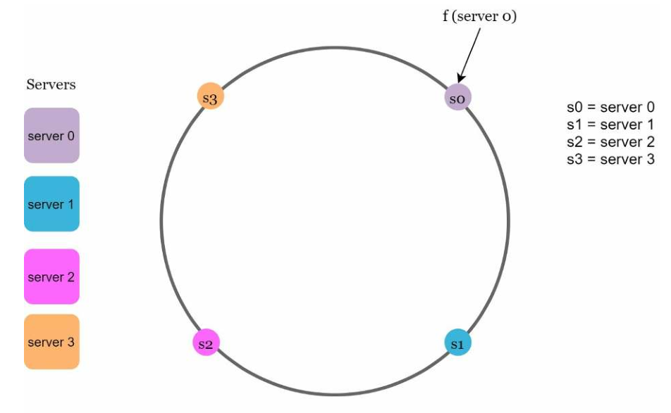

​															图 5-5

## 哈希键

值得一提的是，这里使用的哈希函数与“重哈希问题”中的哈希函数不同，并且没有模块化操作。如图 5-6 所示，将 4 个缓存键(key0, key1, key2, key3)哈希到哈希环上。

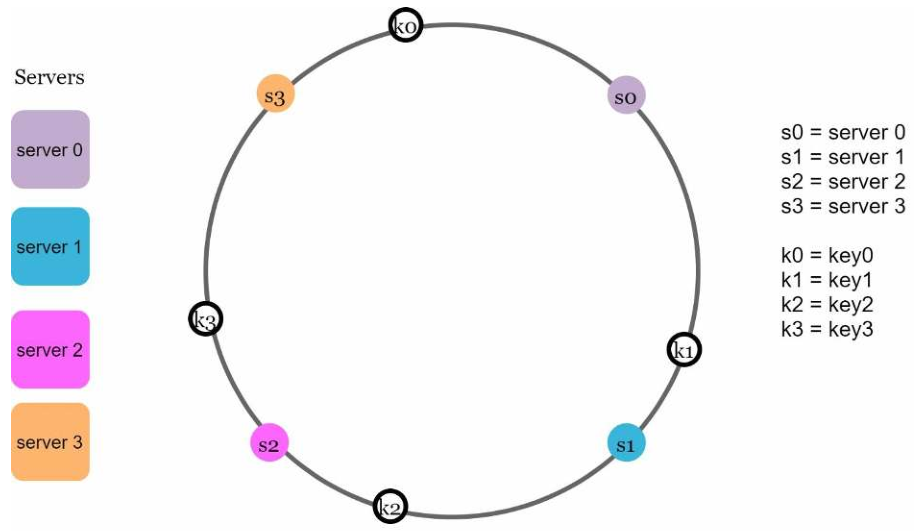

​															图 5-6

## 查找服务器

**为了确定 key 存储在哪个服务器上，我们从环上的 key 位置顺时针移动，直到找到服务器**。具体流程如图 5-7 所示。顺时针方向，k0 存储在服务器 0 上;k1 存储在服务器 1上;k2 存储在服务器 2 上，k3 存储在服务器 3 上。

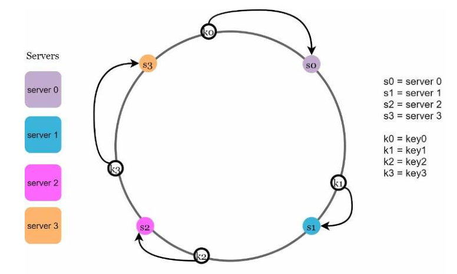

​															图 5-7

## 添加一个服务器

使用上面描述的逻辑，增加一个新的服务器只需要重新分配一小部分的 key。

在图 5-8 中，在增加了一个新的服务器 s4 之后，只有 k0 需要重新分配，k1、k2 和 k3 仍然在相同的服务器上。让我们仔细看一下这个逻辑。s4 被添加之前。现在 k0 将被存储在 s4 上，因为 s4 是 k0 顺时针方向遇到的第一个服务器。因为 s4 是它从 k0 在环上的位置顺时针移动所遇到的第一个服务器。其他的 key 是没有根据一致性哈希算法进行重新分配。

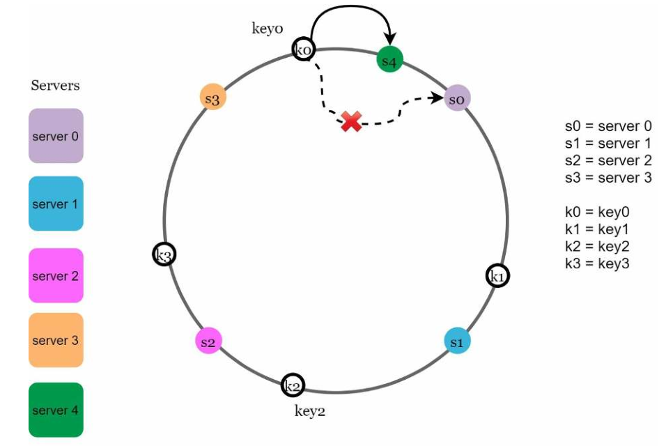

​															 	图 5-8

## 删除一个服务器

同理，当一个服务器被移除时，只有一小部分 key 需要用一致性哈希算法重新分配散列。在图 5-9 中，当 s1 被移除时，只有 k1 必须被重新映射到 s2。其余的 key 不受影响。

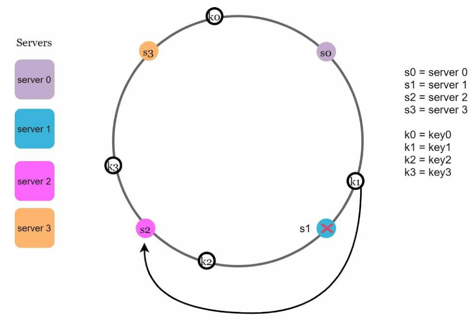

​																图 5-9

## 这种基本方法的两个问题

一致性哈希算法是由麻省理工学院的 Karger 等人提出的。其基本步骤是：
- 使用一个均匀分布的散列函数将服务器和钥匙映射到环上。
- 要想知道一个 key 被映射到哪个服务器上，从 key 的位置顺时针走，直到找到环上的第一个服务器。

这种方法有两个问题。首先，考虑到一个服务器可以被添加或删除，不可能在环上为所有服务器保持相同大小的分区。分区是相邻服务器之间的哈希空间。分配给每个服务器的环上分区的大小有可能非常小，也有可能相当大。在图 5-10 中，如果 s1 被移除，s2 的分区（用双向箭头突出显示）是 s0 和 s3 的分区的两倍大。

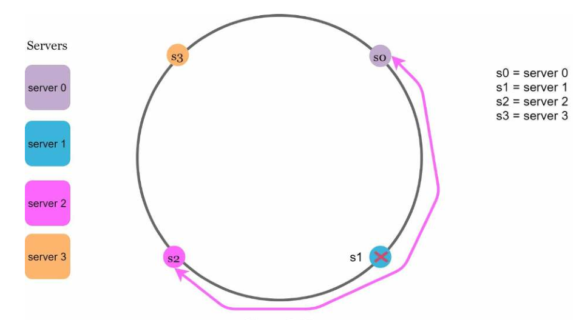

​																	图 5-10

第二，在环上有可能出现非均匀的 key 分布。例如，如果服务器被映射到图 5-11 中所列的位置，大部分的钥匙都存储在 s2 上。然而，s1 和 s3 没有数据。

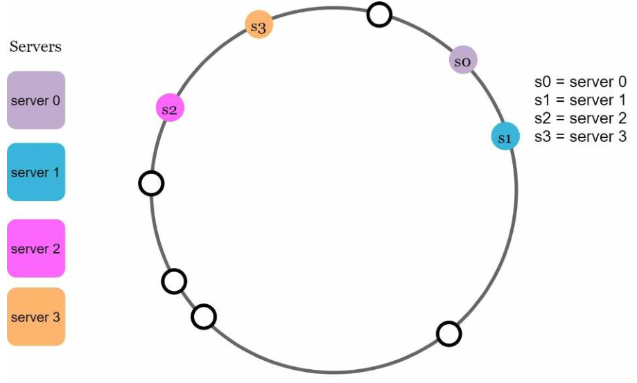

​																	图 5-11

一种称为**虚拟节点**或**副本**的技术用于解决这些问题。

## 虚拟节点

在图 5-12 中，s0 和 s1 都有 3 个虚拟节点，3 是任意选择的；在现实世界的系统中，虚拟节点的数量要大得多。我们用 s0_0、s0_1 和 s0_2 来代表环上的 s0，而不是用s0。同样，s1_0、s1_1 和 s1_2 代表环上的 s1。有了虚拟节点，每个服务器负责多个分区。

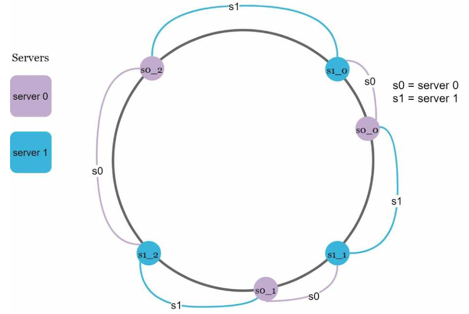

​																	图 5-12

要想知道一个 key 存放在哪个服务器上，我们从 key 的顺时针走，找到环上遇到的第一个虚拟节点。在图 5-13 中，要想知道 k0 存放在哪个服务器上，我们从 k0 的顺时针走，找到虚拟节点 s1_1，它指的是 s1。

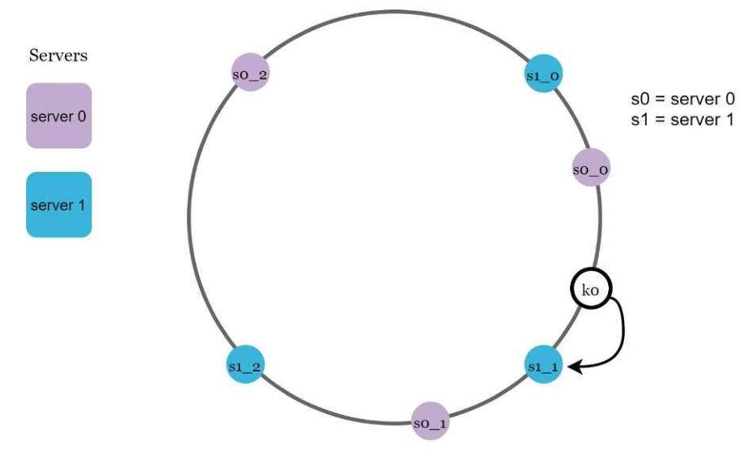

​																		图 5-13

随着虚拟节点数量的增加，key 的分布变得更加平衡。这是因为标准差随着虚拟节点的增加而变小，导致数据分布平衡。标准差衡量数据的分布情况。[在线研究](https://tom-e-white.com/2007/11/consistent-hashing.html)[进行的实验结果表明，在一两百个虚拟节点的情况下，标准差在平均值的 5%（200 个虚拟节点）和 10%（100 个虚拟节点）之间。当我们增加虚拟节点的数量时，标准差会更小。然而，需要更多的空间来存储虚拟节点的数据。

这是一种权衡，我们可以调整虚拟节点的数量以适应我们的系统要求。

## 找到受影响的 keys

在图 5-14 中，s4 被添加到环上。受影响的范围从 s4（新添加的节点）开始，围绕环逆时针移动，直到找到一个服务器（s3）。因此，位于 s3 和 s4 之间的 key 需要重新分配到 s4。

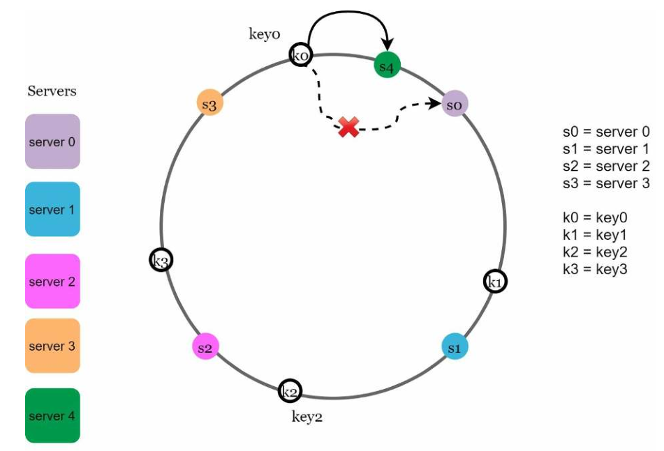

​																图 5-14

如图 5-15 所示，当一个服务器 s1 被移除时，受影响的范围从 s1（被移除的节点）开始，并围绕环形结构逆时针移动，直到找到一个 s0。 因此，位于 s0 和 s1 之间的 key 必须被重新分配到 s2。

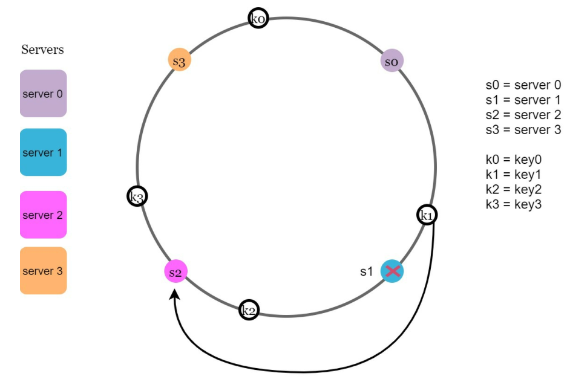

## 总结

在本章中，我们深入讨论了一致性哈希，包括为什么需要它以及它是如何工作的。一致性哈希的好处包括。
- 当服务器被添加或删除时，最小化的 key 被重新分配。
- 易于横向扩展，因为数据的分布更加均匀。
- 缓解热点 key 问题。对一个特定分片的过度访问可能导致服务器超载。想象一下，Katy Perry、Justin Bieber 和 Lady Gaga 的数据最后都在同一个分片上。一致性哈希有助于缓解这个问题，因为数据分布地更均匀。

