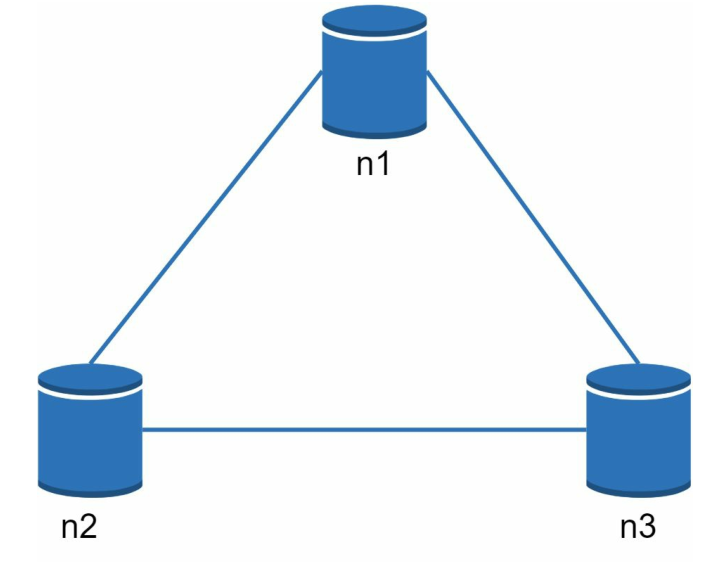
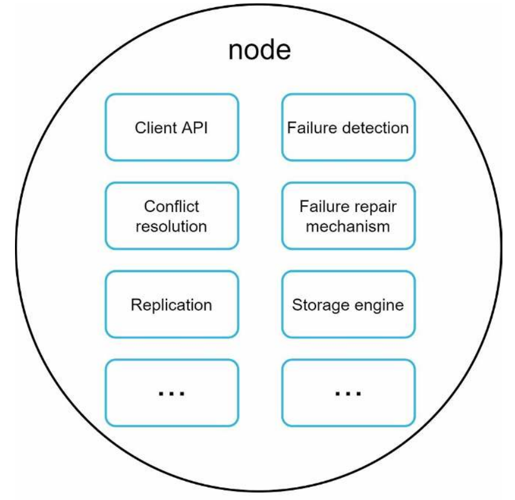
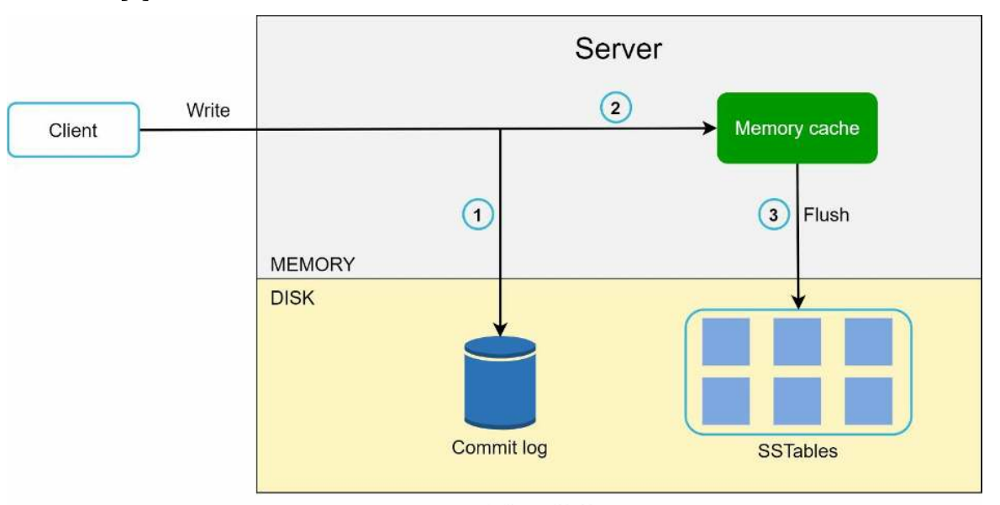

# 设计一个 Key/Value 存储器

键值存储，也被称为键值数据库，是一个非关系型数据库。每个唯一的标识符被存储为一个键，并有其相关值。这种数据配对被称为"键-值"对。

在一个键值对中，键必须是唯一的，与键相关的值可以通过键来访问。键（key）可以是纯文本或散列值。出于性能的考虑，短的 key 效果更好。key 是什么样子的？这里有几个例子。

- 普通文本密钥："last_logged_in_at"
- 散列键：253DDEC4

键值对中的值可以是字符串、列表、对象，等等。在键值存储中，值通常被视为不透明的对象，如 [Amazon dynamo](),[Memcached](), [Redis]()等。

下面是键值存储中的一个数据片段：

| key  | value |
| ---- | ----- |
| 145  | john  |
| 147  | bob   |
| 160  | Julia |

在这节，你会问如何设计一个 k-v 存储器，它具有如下行为：

- `put(key, value)`
- `get(key)`

## 理解问题并确定设计范围

没有完美的设计。每个设计都要在读、写和内存使用的权衡上达到一个特定的平衡。另一个必须要在一致性和可用性做出权衡。在本章中，我们设计了一个包含以下特征的键值存储：

- 一个键值对的大小很小：小于 10KB。
- 有能力存储大数据。
- 高可用性。系统响应迅速，即使在故障期间也是如此。
- 高可扩展性。系统可以被扩展以支持大型数据集。
- 自动扩展。基于流量的自动进行服务器的增加/删除。
- 可调整的一致性。
- 低延迟。

## 单服务器 k/v 存储

开发一个单个服务器的键值存储是很容易的。一个直观的方法是将键值对存储在一个哈希表中，这样可以将所有的东西都保存在内存中。即使内存访问速度很快，但由于空间的限制，将所有的东西都放在内存中可能是不可能的。有两种优化方法可用于在单个服务器中容纳更多的数据。

- 数据压缩
- 只在内存中存储经常使用的数据，其余的存储在磁盘上 即使有这些优化，单个服务器也会很快达到其容量。为了支持大数据，就需要一个分布式的键值存储。

## 分布式 K/V 存储

分布式键值存储也被称为分布式哈希表，它将键值对分布在许多服务器上。当设计一个分布式系统时，理解[CAP（一致性、可用性、分区容忍度）定理](https://en.wikipedia.org/wiki/CAP_theorem)是很重要的。

### CAP 定理

CAP 定理指出，一个分布式系统不可能同时提供这三种保证中的两种以上：一致性、可用性和分区容忍度。让我们先建立几个定义。

**一致性（Consistency）**：一致性意味着所有客户在同一时间看到相同的数据，无论他们连接到哪个节点。

**可用性（Availablity）：**可用性意味着任何请求数据的客户端都能得到响应，即使有些节点发生故障。

**分区容错性（Partition Tolerance）**：分区表示两个节点之间的通信中断。分区容忍度意味着尽管网络分区，系统仍能继续运行

CAP 定理指出，必须牺牲三个属性中的一个来支持三个属性中的两个。
如图 6-1 所示。

​																图 6-1

现在，键值存储是根据它们支持的两个 CAP 特性来分类的。

CP（一致性和分区容忍）系统：CP 键值存储支持一致性和分区容忍，同时牺牲了可用性。
AP（可用性和分区容忍度）系统：一个 AP 键值存储支持可用性和分区容忍度，同时牺牲了一致性。
CA（一致性和可用性）系统：CA 键值存储支持一致性和可用性，同时牺牲了分区容忍。分布式系统必须容忍网络分区。因此，CA 系统不适合目前的目的。

### 理想状况

在理想的世界里，网络分区永远不会发生。写入 n1 的数据会自动复制到 n2 和 n3。一致性和可用性都得以实现。

​																	图 6-2

### 真实世界的分布式系统

**在一个分布式系统中，分区是无法避免的**，当分区发生时，我们必须在一致性和可用性之间做出选择。在图 6-3 中，n3 发生故障，无法与 n1 和 n2 通信。如果客户端向 n1 或 n2 写数据，数据就不能传播到 n3. 如果数据被写入 n3，但还没有传播到 n1 和 n2，n1 和 n2 就会有过时的数据。

​																	图 6-3

如果我们选择一致性大于可用性（CP 系统），我们必须阻止所有对 n1 和 n2 的写操作，以避免这三个服务器之间的数据不一致，因为这使得系统不可用。银行系统通常有极高的一致性要求。例如，对于银行系统来说，显示最新的余额信息是至关重要的。如果由于网络分区而发生不一致，在不一致问题解决之前，银行系统会返回一个错误。

然而，如果我们选择可用性而不是一致性（AP 系统），系统就会继续接受读取，即使它可能返回陈旧的数据。对于写，n1 和 n2 将继续接受写，当网络分区被解决时，数据将被同步到 n3。

选择适合你使用情况的正确的 CAP 是保证建立一个分布式键值存储的重要步骤。

### 系统组件

在这节，我们将会讨论构建分布式存储所用到的核心组件和技术：

- 数据分区
- 数据复制
- 一致性
- 解决不一致性问题
- 错误处理
- 系统架构图
- 写路径
- 读路径

下面的内容主要是基于三个流行的键值存储系统。[Dynamo](https://www.allthingsdistributed.com/files/amazon-dynamo-sosp2007.pdf)，[Cassandra](https://cassandra.apache.org/)，以及 [BigTable](https://static.googleusercontent.com/media/research.google.com/en//archive/bigtable-osdi06.pdf)。

#### 数据分区

对于大型应用来说，将完整的数据集装入一台服务器是不可行的。最简单的方法是将数据分割成较小的分区，并将其存储在多个服务器中。在对数据进行分区时，有两个挑战：

- 将数据均匀地分布在多个服务器上。
- 当节点被添加或移除时，最大限度地减少数据移动。

这两点在[一致性哈希算法](Design-Consistent-Hashing.md)就是解决这些问题的一个解决方案。让我们来简单的回顾一下：

- 首先，服务器被放置在一个哈希环上。在图 6-4中，8 个服务器，由 s0,s1,...,s7 代表，被放在哈希环上。
- 接下来，一个 key 被散列在同一个环上。在顺时针方向移动的过程中，它被存储在第一个遇到的服务器上。例如，使用这种逻辑，k0 被存储在 s1。

​																	图 6-4

使用一致性哈希进行数据分区有如下几个优势：

**自动拓展：**服务器可以根据负载的情况自动添加或删减服务器

**异质性（Heterogeneity）：**一台服务器的虚拟节点数量与服务器容量成正比。例如，具有较高容量的服务器被分配有更多的虚拟节点。

#### 数据复制

为了实现高可用性和可靠性，数据必须在 N 个服务器上进行异步复制。其中 N 是一个可配置的参数。这 N 个服务器是通过以下方式选择逻辑：当一个 key 被映射到哈希环上的某个位置后，从该位置开始顺时针方向行走，并选择环上的前 N 个服务器来存储数据副本。在图 6-5（N=3）中，k0 被复制到 s1、s2 和 s3。

​																	图 6-5

对于虚拟节点，环上的前 N 个节点可能由少于 N 个的物理服务器。为了避免这个问题，我们在执行顺时针行走逻辑时只选择唯一的服务器。

由于停电、网络、自然灾害等原因，同一数据中心的节点经常在同一时间发生故障。为了提高可靠性，复制体被放置在不同的数据中心并通过高速网络连接。

#### 一致性

由于数据是在多个节点上复制的，因此必须在各复制体之间进行同步。[法定人数共识（选举，Quorum）](https://github.com/MarsonShine/MS.Microservice/blob/master/docs/patterns-of-distributed-systems/Quorum.md)可以保证读和写操作的一致性。让我们首先建立几个定义。

**N** = 副本的数量

**W** = 写操作必须得到 W 个副本的确认

**R** = 有 R 法定人数读取确认。为了使读操作被认为是成功的，读操作必须等待至少 R 个副本的响应。

考虑以下图 6-6 所示的例子，N=3。

​																图 6-6

W = 1 并不意味着数据被写在一台服务器上。例如，在图 6-6 的配置中，数据在 s0、s1 和 s2 进行复制。**W = 1意味着协调器必须在写操作被认为是成功之前收到至少一个确认**。例如，如果我们从 s1 得到一个确认，我们就不再需要等待 s0 和 s2 的确认了。协调器在客户端和节点之间充当代理。

W、R 和 N 的配置是一个典型的延迟和一致性之间的权衡。如果 W=1 或 R=1，一个操作会被快速返回，因为协调者只需要等待任何一个副本的响应。如果 W 或 R>1，系统提供更好的一致性。然而，查询会更慢，因为协调者必须等待来自最慢副本的响应。

如果 W+R>N，强一致性就得到了保证，因为至少要有一个重叠的节点拥有最新的数据以确保一致性。

如何配置 N、W 和 R 以适应我们的用例？下面是一些可能的设置：

- 如果 R=1，W=N，系统被优化为快速读取。
- 如果 W=1，R=N，系统被优化为快速写入。
- 如果 W + R > N，强一致性得到保证（通常 N = 3，W = R = 2）。
- 如果 W + R <= N，强一致性就得不到保证。

根据需求，我们可以调整 W、R、N 的值，以达到所需的强一致性的水平。

#### 一致性模型

一致性模型是设计键值存储时需要考虑的其他重要因素。一个一致性模型定义了数据的一致性程度，存在着广泛的可能的一致性模型：

- **强一致性：**任何读操作都会返回一个与最新的写数据项的结果相对应的值。客户端永远不会看到过时的数据。
- **弱一致性：**后续的读操作可能看不到最新的值。
- **最终一致性：**这是弱一致性的一种特殊形式。只要有足够的时间，所有的更新都会被传播，所有的副本都是一致的。

强一致性通常是必须等到每个副本都同意当前的写入之前，都不接受新的处理。这种方法对于高可用系统来说并不理想，因为它可能会阻塞新的操作。Dynamo 和 Cassandra 采用最终一致性，这也是我们推荐的键值存储的一致性模型。从并发写入来看，最终一致性允许不一致的值进入系统，并迫使客户端读取这些值来进行调节。下一节将解释如何与版本管理一起工作的。

#### 不一致解决方案：版本化

复制提供了高可用性，但会导致副本之间的不一致。[版本矢量](https://github.com/MarsonShine/MS.Microservice/blob/master/docs/patterns-of-distributed-systems/Version-Vector.md)被用来解决不一致问题。**版本化意味着把每一个数据修改都当作一个新的不可更改的数据版本**。在我们谈论版本控制之前，让我们先用一个例子来解释不一致是如何发生的。

如图 6-7 所示，两个复制节点 n1 和 n2 都有相同的值。让我们把这个值称为原始值。服务器 s1 和服务器 s2 在 `get("name")` 操作中得到相同的值。

​														图 6-7

下一步，s1 更改名称为 "johnSanFrancisco"，s2 改名为 "johnNewYork"，如图 6-8。这两个变化是同时进行的。现在，我们有相互冲突的值，称为版本 v1 和 v2。

​														图 6-8

在这个例子中，原始值可以被忽略，因为修改是基于它的。然而，没有明确的方法来解决最后两个版本的冲突。为了解决这个问题，我们需要一个可以检测冲突和解决冲突的版本系统。矢量钟(vector clock)是解决这个问题的一个常用技术。让我们来看看矢量钟是如何工作的。

矢量钟是一个与数据项相关的如`[服务器，版本]`对。它可以用来检查一个版本是否在前，是否成功，是否与其他版本冲突。

假设一个矢量时钟由 D([S1, v1], [S2, v2], ..., [Sn, vn]) 表示，其中 D 是一个数据项，v1 是一个版本计数器，S1 是一个服务器编号等等。如果数据项 D 被写入到服务器 Si，系统必须执行以下任务之一。

- 如果 [Si, vi] 存在，则递增 vi。
- 否则，创建一个新条目 [Si, 1]。

如图 6-9 所示，用一个具体的例子来解释上述的抽象逻辑。

​																图 6-9

1. 一个客户向系统写了一个数据项 D1，该写被服务器 Sx 处理，它现在有一个向量时钟 D1[(Sx, 1)]。
2. 另一个客户端读取最新的 D1，将其更新为 D2，并将其写回。D2 从 D1 向下，所以它覆盖了 D1。假设这个写是由同一个服务器 Sx 处理的，它现在有矢量时钟 D2([Sx, 2])。
3. 另一个客户端读取最新的 D2，将其更新为 D3，并将其写回。假设这个写是由服务器 Sy 处理的，它现在有向量时钟 D3([Sx, 2], [Sy, 1])。
4. 另一个客户端读取最新的 D2，将其更新为 D4，并将其写回。假设这个写是由服务器 Sz 处理的，它现在有 D4([Sx, 2], [Sz, 1])）。
5. 当另一个客户端读取 D3 和 D4 时，它发现了一个冲突，这是由于数据项 D2 同时被 Sy 和 Sz 修改造成的。项目 D2 被 Sy 和 Sz 修改所导致。该冲突由客户端解决，并将更新的数据发送到服务器。假设写入是由 Sx 处理的，它现在有 D5([Sx, 3], [Sy, 1], [Sz, 1])。我们将很快解释如何检测冲突。

使用矢量时钟，如果 Y 的矢量时钟中每个参与者的版本计数器大于或等于版本 X 中的计数器，就很容易知道版本 X 是版本 Y 的祖先（即没有冲突）。例如，矢量时钟 D（[s0, 1], [s1, 1]）] 是 D（[s0, 1], [s1, 2]）的祖先。因此，没有冲突被记录下来。

同样地，如果在 Y 的向量时钟中有任何参与者的计数器小于 X 中的相应计数器，你就可以知道一个版本 X 是 Y 的兄弟姐妹（即存在冲突）。D([s0, 1], [s1,2]) 和 D([s0, 2], [s1, 1])。尽管矢量时钟可以解决冲突，但有两个明显的缺点。首先，矢量时钟增加了客户端的复杂性，因为它需要实现冲突解决逻辑。

第二，矢量时钟中的[服务器：版本]对可能会迅速增长。为了解决这个问题，我们为长度设置了一个阈值，如果超过了这个阈值，最老的对就会被删除。这可能导致和解的效率低下，因为子孙关系不能准确地确定。然而，根据 [Dynamo 论文]()，亚马逊还没有在生产中遇到这个问题；因此，对于大多数公司来说，这可能是一个可以接受的解决方案。

#### 故障处理

与任何大规模的系统一样，故障不仅是不可避免的，而且是常见的。处理故障情况是非常重要的。在本节中，我们首先介绍检测故障的技术。然后，我们将介绍常见的故障解决策略。

#### 失败预测

在一个分布式系统中，仅仅因为另一台服务器说故障了，就认为这台服务器故障了是不够的。通常情况下，至少需要两个独立的信息来源来标记一个服务器停机。

如图 6-10 所示，全组播（all-to-all multicasting）是一个直接的解决方案。然而，当许多服务器都在一个地方时，当系统中存在许多服务器时，这就显得这种方法效率很低。

> All-to-all multicasting 是一种通信模式，用于在多个参与者之间广播消息，使每个参与者都能够接收到消息。在这种通信模式下，每个参与者都可以发送消息，同时也能够接收到其他参与者发送的消息。
>
> 与点对点通信不同，其中只有一个发送者和一个接收者之间进行通信，所有到所有的通信需要将消息从一个节点传输到所有其他节点。这通常需要使用一些特殊的算法或协议，如广播或全局点对点通信协议。
>
> 在计算机网络和分布式系统中，all-to-all multicasting 是一种常见的通信模式，它可以用于许多应用程序，如数据共享、任务协作、并行计算等。

​																  图 6-10

一个更好的解决方案是使用分散的故障检测方法，如[瘟疫协议（gossip protocol）](https://github.com/MarsonShine/MS.Microservice/blob/master/docs/patterns-of-distributed-systems/Gossip-Dissemination.md)。瘟疫协议的工作方式如下。
- 每个节点维护一个节点成员列表，其中包含成员 ID 和心跳计数器。
- 每个节点周期性地增加其心跳计数器。
- 每个节点定期向一组随机节点发送心跳，这些随机节点又向另一组节点传播。
- 一旦节点收到心跳，成员列表就会更新到最新的信息。
- 如果心跳没有增加超过预定的时间，该成员就被认为是离线的。

​																图 6-11

如图 6-11 所示：

- 节点 s0 维护着左侧所示的节点成员列表。
- 节点 s0 注意到节点 s2（成员 ID=2）的心跳计数器已经很长时间没有增加了。
- 节点 s0 向一组随机节点发送包括 s2 的信息的心跳。一旦其他节点确认 s2 的心跳计数器长时间没有更新，节点 s2 就会被标记下来，这个信息会传播给其他节点。

#### 处理临时故障

在通过[瘟疫协议](https://github.com/MarsonShine/MS.Microservice/blob/master/docs/patterns-of-distributed-systems/Gossip-Dissemination.md)检测到故障后，系统需要部署某些机制来确保可用性。在严格的法定人数方法中，读和写操作可能会被阻止，正如在[法定人数共识](https://github.com/MarsonShine/MS.Microservice/blob/master/docs/patterns-of-distributed-systems/Quorum.md)部分所说明的。

一种叫做["草率的法定人数（sloppy quorum）"](https://www.allthingsdistributed.com/files/amazon-dynamo-sosp2007.pdf)的技术被用来提高可用性。系统不强制执行法定人数要求，而是在哈希环上选择前 W 个健康的服务器进行写操作，前 R 个健康的服务器进行读操作。离线服务器被忽略。

如果一个服务器由于网络或服务器故障而不可用，另一个服务器将临时处理请求。出现故障的服务器恢复正常后，会将之前发生的变化同步回去，以保证数据的一致性。这个过程被称为暗示交接（hinted handoff）。由于图 6-12 中的 s2 是不可用的，所以读和写将暂时由 s3 处理。当 s2 重新上线时，s3 将数据同步给 s2。

> sloppy quorum 是一种分布式系统中的一种策略，用于在网络分区或节点故障的情况下，保证数据的可用性和持久性。它的原理是，当一个节点要向其他 N 个节点写入或读取数据时，只要有 W 个或 R 个节点参与成功，就认为操作完成。如果无法达到 N 个节点，就会将数据暂时存储在其他备份节点上，并在网络恢复后重新同步。
>
> hinted handoff 是一种分布式系统中的一种技术，用于在节点之间传递数据，以保证最终一致性。
>
> 它的原理是，当一个节点要向另一个节点发送数据时，如果发现目标节点不可用，就会将数据和目标节点的信息存储在一个队列中，并在目标节点恢复后重新发送。这样可以避免数据丢失或不同步的问题
>
> sloppy quorum 和 hinted handoff 是一种配合使用的技术，用于在分布式系统中提高写入可用性和数据一致性。hinted handoff 的作用是，在使用 sloppy quorum 时，如果无法将数据写入或读取原本负责的节点，就会将数据暂时存储在其他备份节点上，并记录下原节点的信息。当原节点恢复正常后，备份节点就会将数据重新发送给原节点，完成同步。

​																	图 6-12

#### 永久故障处理

暗示交接（hinted handoff）是用来处理临时故障的。如果一个副本永久地不可用呢？为了处理这种情况，我们实施了一个反熵协议来保持复制体保持同步。反熵（Anti-entropy）包括比较副本上的每一条数据，并将每个副本更新为最新版本。Merkle 树被用于不一致探测和最大限度地减少传输的数据量。

引自[维基百科](https://en.wikipedia.org/wiki/Merkle_tree)。"散列树或 Merkle 树是一棵树，其中每个非叶子的节点都标有子节点的标签或值（如果是叶子的话）的哈希值。哈希树允许对大型数据结构的内容进行有效和安全的验证"。

假设 key 空间从 1 到 12，下面的步骤显示了如何建立一棵 Merkle 树。高亮的方框表示不一致的地方。

步骤1：如图 6-13 所示，将 key 空间划分为桶（在我们的例子中为 4）。一个桶被用作根节点，以保持树的有限深度。

​															图 6-13

步骤2：一旦桶被创建，使用统一的散列方法对桶中的每个键进行散列（图6-14）。

​															图 6-14

第3步：为每个桶创建一个哈希节点（图6-15）。

​														 	图 6-15

第4步：通过计算子节点的哈希值，向上建立树，直到根（图6-16）。

​																图 6-16

要比较两个 Merkle 树，首先要比较根哈希值。如果根哈希值匹配，就说明两个服务器有相同的数据。如果根哈希值不一致，那么就比较左边的子哈希值，然后是右边的子哈希值。你可以遍历这棵树，找到哪些桶没有被同步的桶，并只同步这些桶。

使用 Merkle 树，需要同步的数据量与两个副本之间的差异成正比，而不是它们包含的数据量。在现实世界的系统中，桶的大小是相当大的。例如，一个可能的配置是每 10 亿个键有 100 万个桶，所以每个桶只包含 1000 个键。

#### 处理数据中心断电

数据中心的中断可能是由于停电、网络中断、自然灾害等原因造成的。为了建立一个能够处理数据中心断电的系统，重要的是在多个数据中心之间进行数据复制。即使一个数据中心完全脱机，用户仍然可以通过其他数据中心访问数据。

#### 系统架构图

现在我们已经讨论了设计键值存储的不同技术考虑。我们可以把注意力转移到架构图上，如图 6-17 所示。

​																	图 6-17

该架构的主要特点如下：

- 客户端通过简单的 API 与键值存储通信：`get(key)` 和 `put(key.value)`。
- 协调器是一个节点，在客户端和键值存储之间充当代理。
- 节点使用一致的散列法分布在一个环上。
- 该系统是完全去中心化的，所以添加和移动节点可以是自动的。
- 数据在多个节点上进行复制。
- 没有单点故障，因为每个节点都有相同的责任。

由于设计是分散的，每个节点执行许多任务，如图 6-18 所示。

​																图 6-18

#### 写路径

图 6-19 解释了写请求被引导到一个特定节点后发生的情况。请注意，拟议的写/读路径设计主要是基于 [Cassandra 的架构](https://cassandra.apache.org/doc/latest/architecture/)。

1. 写请求持久化到提交日志中
2. 数据是保存到内存缓存中
3. 当缓存满或达到了预设的阈值时，数据会闪存到磁盘的 SSTable 中。注意：这个有序字符串表（SSTable）是一个有序的 <key,value> 集合。对于有兴趣了解更多关于 SStable 的读者，请参阅[参考资料](https://www.igvita.com/2012/02/06/sstable-and-log-structured-storage-leveldb/)

#### 读路径

当一个读取请求被引导到一个特定的节点后，它首先检查数据是否在内存缓存中。如果是，数据就会被返回给客户端，如图 6-20 所示。

​																图 6-20

如果数据不在内存中，就会从磁盘中检索出来代替。我们需要一种有效的方法来找出包含 key 的 SSTable。[布隆过滤器]()通常被用来解决这个问题。当数据不在内存中时，其读取路径如图 6-21 所示。

​															图 6-21

1. 如果数据在内存中，系统首先就会检查这个数据。如果没有，就跳第 2 步。
2. 系统通过布隆过滤器检查到如果数据不在内存中。
3. 布隆过滤器用于找出哪些 sstable 可能包含该键。
4. sstable 返回数据集的结果。
5. 数据集的结果返回给客户端。

## 总结

本章涵盖了许多概念和技术。为了提醒您，下表总结了分布式键值存储的特性和相应的技术。

| 目标/问题               | 技术点                               |
| ----------------------- | ------------------------------------ |
| 可以存储大数据          | 使用一致性哈希将负载分散到多个服务器 |
| 高可用读                | 设置多数据中心的数据复制             |
| 高可用写                | 通过矢量时钟来版本化和解决冲突       |
| 数据分区                | 一致性哈希                           |
| 增量可伸缩性            | 一致性哈希                           |
| 异质性（Heterogeneity） | 一致性哈希                           |
| 可调的一致性            | 法定人数共识                         |
| 临时故障处理            | 草率的法定人数和暗示交接             |
| 永久故障处理            | Merkle 树                            |
| 数据中心断电处理        | 跨中心数据复制                       |

