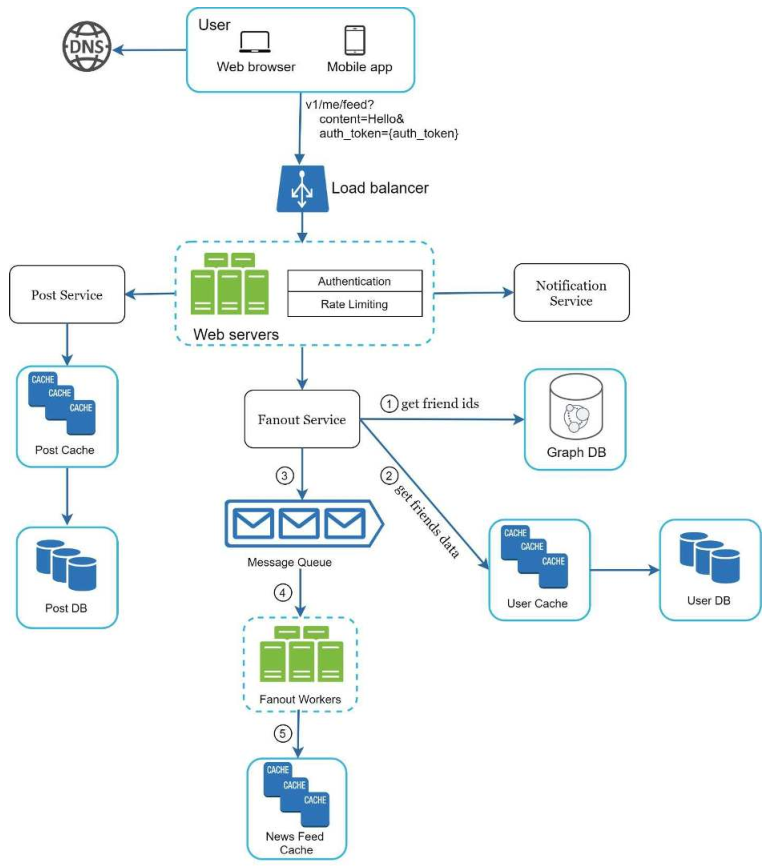

# 设计一个新闻提要系统

在本章中，你被要求设计一个新闻提要系统。什么是新闻提要（news feed）？根据 Facebook 的帮助页面，"新闻提要是在你的主页中间不断更新的故事列表。你的主页上的故事列表。新闻提要包括状态更新、照片、视频、链接、应用程序活动和来自你在 Facebook 上关注的人、网页和团体的喜欢"[1]。这是一个流行的面试问题。经常被问到的类似问题有：设计 Facebook 新闻提要、 Instagram 提要, Twitter timeline 等等。

​																	图 11-1

## 理解问题并确定设计范围

第一组澄清问题是为了了解当面试官要求你设计一个新闻提要系统时，她心里想的是什么？当她要求你设计一个新闻提要系统时，你要了解面试官的想法。最起码，你应该弄清楚要支持哪些功能。下面是一个候选人与面试官互动的例子：

候选人：这是移动 app 还是 web，还是说两个都是？

面试官：都是

候选人：最重要的特性是什么？

面试官：用户可以发布帖子，并在新闻提要页面上看到她朋友的帖子。

候选人：新闻提要是按逆时针顺序排序还是按任何特定顺序排序？如主题得分？例如，你的亲密朋友的帖子有更高的分数。

采访者：为了简单起见，让我们假设新闻提要是按逆时针顺序排序的。

候选人：一个用户可以有多少个朋友？

面试官：5000

考生：流量是多少？

面试官：1000万 DAU

应聘者：饲料可以包含图片、视频，还是只有文字？

面试官：可以，它可以包含媒体文件，包括图片和视频。

现在你已经收集了需求，我们把重点放在设计系统上。

## 高层设计

该设计分为两个流程：Feed 发布和新闻提要构建。

- 消息发布：当一个用户发布了一个帖子，相应的数据被写入缓存和数据库。一个帖子被填充到她朋友的新闻提要中。
- 新闻源构建：为简单起见，我们假设新闻源是通过聚合 朋友的帖子，按时间顺序倒置。

> 新闻提要的主要用途是在网站上列出新发布的内容。最终用户可以通过订阅网站的新闻提要来接收网站上新内容的推送更新。提要被设计为机器可读的，因此它们可以在不需要人工干预的情况下在计算机之间传输信息。此外，新闻提要还可以根据用户的兴趣和互动来预测用户最感兴趣的内容，并按照用户的兴趣和互动程度对内容进行排序。

### 新闻提要 APIs

新闻提要 AP I是客户端与服务器通信的主要方式。这些 API 基于 HTTP，允许客户端执行操作，包括发布状态、检索新闻提要、添加好友等。我们讨论了两个最重要的 API：**提要发布 API** 和**新闻提要检索 API**。

#### 提要发布 API

为了发布一个帖子，一个 HTTP POST 请求会发送给服务器。API 如下：

POST /v1/me/feed

参数：

- content: 帖子的内容
- auth_token: 用来对 API 鉴权的

#### 新闻提要检索 API

这个 API 主要用来检索内容：

GET /v1/me/feed

参数：

- auth_token: 用来对 API 鉴权的

### 提要发布

图 11-2 显示了提要发布流程的高层设计。

​																	图 11-2

- 用户：一个用户可以在浏览器或移动应用程序上查看新闻提要。一个用户通过 API 发布内容为"你好"的帖子：

  /v1/me/feed?content=Hello&auth_token={auth_token}。

- 负载均衡：将流量分配给网络服务器。

- 网络服务器：网络服务器将流量重定向到不同的内部服务。

- 帖子服务：在数据库和缓存中持久保存帖子。

- 扇出服务：将新内容推送到朋友的新闻提要。新闻提要数据存储在缓存中，以便快速检索。

- 通知服务：通知朋友有新的内容，并发送推送通知。

### 提要构建

在这一节中，我们讨论新闻提要是如何在幕后建立的。图 11-3显示了高层设计：

​																	图 11-3

- 用户：一个用户发送了一个请求来检索她的新闻提要。该请求看起来像这样：`/v1/me/feed`。
- 负载均衡：负载均衡将流量重定向到网络服务器。
- 网络服务器：网络服务器将请求路由到新闻提要服务。
- 新闻提要服务：新闻源服务从缓存中获取新闻源。
- 新闻提要缓存：存储渲染新闻源所需的新闻源 ID。

## 深入研究

高层设计的好处覆盖两个方面：提要发布和新闻提要构建。

这里我们就针对这两个问题深入的探讨。

### 深入研究提要发布

图 11-4 概述了提要发布的详细设计。我们已经讨论了大部分的组件，我们将重点讨论两个组件：网络服务器和扇出服务。

​																	图 11-4

### Web 服务器

除了与客户进行通信外，网络服务器还执行认证和速率限制。

只有用有效的 `auth_token` 登录的用户才被允许发帖。该系统限制一个用户在一定时期内可以发的帖子数量，这对防止垃圾邮件和滥用内容。

### 扇出服务

扇出是向所有朋友传递一个帖子的过程。两种类型的扇出模式是：写时扇出（也叫推模式）和读时扇出（也叫拉模式）。这两种模式都有优点和缺点。我们解释它们的工作流程，并探索最佳方法来支持我们的系统。

**写时扇出**：通过这种方法，新闻提要在写的时候就被预先计算了。一个新的帖子发布后立即传递到朋友的缓存中。

**优点：**

- 新闻提要是实时生成的，可以立即推送给朋友。
- 获取新闻源的速度很快，因为新闻源是在写的时候预先计算的。

**缺点：**

- 如果一个用户有很多朋友，获取朋友列表并为所有的朋友生成新闻源是缓慢和耗时的。这被称为热键问题。
- 对于不活跃的用户或那些很少登录的用户，预先计算新闻源会浪费计算资源。

**读时扇出：**新闻提要是在阅读时间内产生的。这是一种按需模式。当用户加载她的主页时，会拉出最近的帖子。

**优点：**

- 对于不活跃的用户或那些很少登录的用户，阅读时的扇出效果更好，因为它不会在他们身上浪费计算资源。
- 数据不会被推送给朋友，所以没有热键问题。

**缺点：**

- 获取新闻源的速度很慢，因为新闻源不是预先计算的。

我们采用了一种混合方法，以获得两种方法的好处并避免其中的陷阱。由于快速获取新闻提要至关重要，我们对大多数用户使用推送模式。对于名人或有许多朋友/追随者的用户，我们让追随者按需提取新闻内容以避免系统过载。[一致性哈希](Design-Consistent-Hashing.md)是一种有用的技术，可以缓解热键问题，因为它有助于更均匀地分配请求/数据。

让我们仔细看看图 11-5 中所示的扇出服务。

​																	图 11-5

扇出服务的工作方式如下：
1. 从图数据库（graph database）中获取好友 ID。图数据库适用于管理朋友关系和朋友推荐。有兴趣的读者如果想了解更多关于这个概念，请参考资料[2]。
2. 从用户缓存中获取朋友信息。然后系统根据用户设置。例如，如果你把某人调成静音，她的帖子将不会出现在你的新闻提要中，即使你们仍然是朋友。帖子可能不显示的另一个原因是，一个用户可以有选择地与特定的朋友分享信息或对其他人隐藏信息。
3. 将好友列表和新帖子 ID 发送到消息队列中。
4. 扇出工作者从消息队列中获取数据，并将新闻源数据存储在新闻提要缓存中。你可以把新闻提要缓存看作是一个 `<post_id, user_id>` 的映射表。每当有新的帖子，它将被追加到新闻源表中，如图 11-6 所示。如果我们在缓存中存储整个用户和帖子对象，内存消耗会变得非常大。因此，只有 ID 被存储。为了保持较小的内存大小，我们设置了一个可配置的限制。用户在新闻提要中滚动浏览数千个帖子的机会很小。大多数用户只对最新的内容感兴趣，所以缓冲区的失误率很低。
5. 将 `<post_id, user_id>` 存储在新闻源缓存中。图 11-6 显示了新闻源在缓存中的样子的一个例子。

​																	图 11-6

### 消息提要检索深入研究

图 11-7 分析了消息提要检索的详细设计

​																	图 11-7

如图 11-7 所示，媒体内容（图片、视频等）被存储在 CDN 中，以便快速检索。让我们看看客户端如何检索新闻提要。
1. 一个用户发送一个请求来检索她的新闻提要。该请求看起来像这样：`/v1/me/feed`

2. 负载均衡器将根据各个服务器资源占用情况来重新分配到网络服务器。

3. 网络服务器调用新闻提要服务以获取新闻提要。

4. 新闻提要服务从新闻提要缓存中获得一个列表的帖子 ID。

5. 用户的新闻提要不仅仅是一个提要 ID 的列表。它包含用户名、个人资料图片、帖子内容、帖子图片等。因此，新闻提要服务从缓冲区（用户缓冲区和帖子缓冲区）获取完整的用户和帖子对象，以构建完全水化的新闻源。

   > "水化（hydrated）"是一个计算机科学术语，指的是将数据填充到对象中，以便在客户端上显示完整的数据。这个术语的来源是因为在化学中，水化是指将水分子添加到物质中，以便使其变得更加稳定和可操作。同样，在计算机科学中，"水化"也是指将数据添加到对象中，以便使其更加稳定和可操作。

6. 完全水合的新闻源以 JSON 格式返回给客户端进行渲染。

### 缓存架构

缓存架构对于消息提要系统来说非常重要。在图 11-8 所示，我们将缓存分成 5 层

​																	图 11-8

- 新闻提要：存储新闻提要的 ID
- 内容：存储发表的每个帖子内容。填充内容并存储热点缓存中
- 社会图谱：存储用户关系数据
- 行为：存储关于用户是否喜欢一个帖子，回复一个帖子，或对一个帖子采取其他行动的信息。
- 计数器：存储喜欢、回复、粉丝、关注等计数

## 总结

在本章中，我们设计了一个新闻提要系统。我们的设计包含两个流程：feed  发布和新闻源检索。

像任何系统设计的面试问题一样，没有完美的方法来设计一个系统。每个公司都有其独特的约束，你必须设计一个系统来适应这些约束。了解你的设计和技术选择的权衡是很重要的。如果还有几分钟的时间，你可以谈谈可扩展性问题。为了避免重复讨论，下面只列出高层次的谈话要点。

扩展数据库：

- 横向拓展与竖向扩展
- SQL vs NoSQL
- 主从复制
- 读副本
- 一致性模型
- 数据分片

其它要谈的点：

- 保持网络层的无状态
- 尽可能地缓存数据
- 支持多个数据中心
- 丢掉有消息队列的几个组件
- 监测关键指标。例如，在高峰期的 QPS 和用户刷新他们的新闻提要时的延迟是值得监测的。

