# 通知系统设计

近年来，通知系统已经成为许多应用程序的一个非常流行的功能。通知提醒用户重要的信息，如突发新闻、产品更新、事件、报价等。它已经成为我们日常生活中不可缺少的一部分。

在本章中，你被要求设计一个通知系统。 一个通知不仅仅是移动推送通知。三种类型的通知格式是：移动推送通知、SMS 消息和电子邮件。图 10-1 显示了这些通知中的每一种的例子。

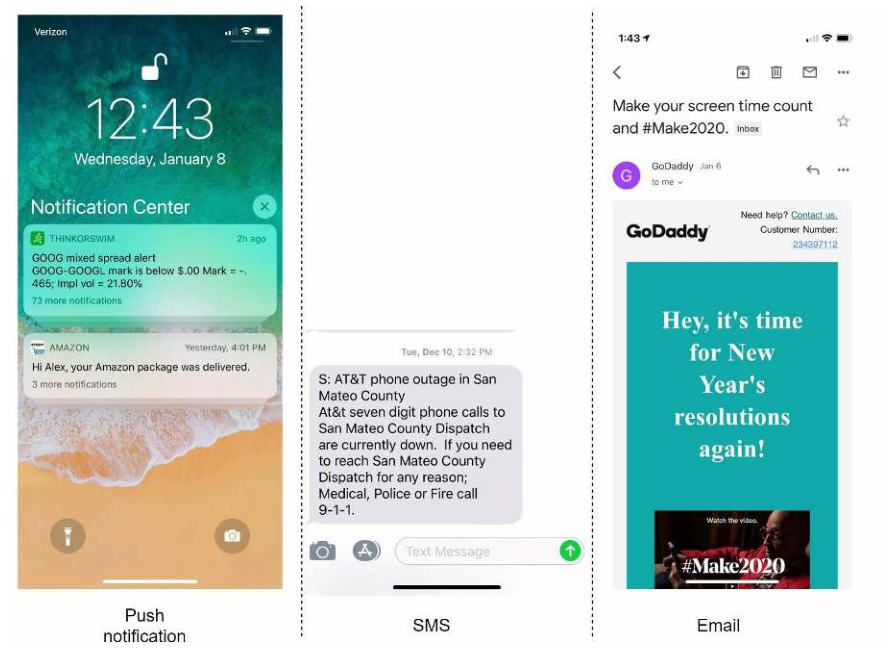

​															图 10-1

## 第1步-理解问题和确定设计范围

建立一个每天发送数百万条通知的可扩展系统并不是一件容易的事。它需要对通知生态系统有深入的了解。

Q:系统一般支持哪几种通知类型？

A：推送通知，SMS 消息以及邮件通知

Q：是否需要实时系统？

A：我们想让用户尽可能的接收到通知。然而这样的系统是需要在高负载之下，有一点延迟也是可接收的。

Q：需要支持什么设备？

A：Ios 设备，安卓设备以及笔记本/PC

Q：怎么触发通知？

A：通知一般是通过客户端触发的。他们也可以在服务端调用。

Q：用户可以选择退出么？

A：当用户选择退出的时候就不会再接收到通知了。

Q：每天发送多少通知？

A：1000 万条移动推送通知、100 万条短信和 500 万封电子邮件。

## 第2步-高层次设计

本节展示了支持各种通知类型的高层设计：iOS 推送通知、Android 推送通知、短信和电子邮件。安卓推送通知、短信和电子邮件。它的结构如下：
- 不同类型的通知
- 联系信息收集流程
- 通知的发送/接收流程

### 不同类型通知

我们先来看下在高层次下的每个通知类型

#### iOS 推送通知

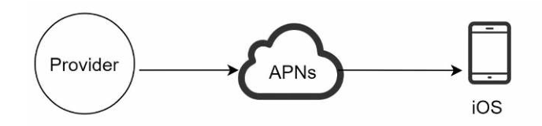

​															图 10-2

我们发送一个 iOS 推送消息主要需要三个组件：

- **供应商：**供应商建立并向苹果推送通知服务（APNS）发送通知请求。为了构建一个推送通知，提供者提供以下内容数据：

  - 设备码：这是一个唯一标识符，用来发送推送消息

  - 负载：这是一个 JSON 字典，它包含通知的内容。下面是一个例子：

    ```json
    {
    	"aps":{
    		"alert":{
    			"title":"Game Request",
    			"body":"Bob wants to play chess",
    			"action-loc-key": "PLAY"
    		},
    		"badge":5
    	}
    }
    ```

- **APNS：**远程服务，Apple 设备用来传播消息推送给 iOS 设备的

- **iOS 设备：**这是客户端，用来接收推送消息。

#### 安卓推送

Android 也采用了类似的通知流程。不使用 APN，而是使用 [Firebase Cloud Messaging（FCM）](https://en.wikipedia.org/wiki/Firebase_Cloud_Messaging)。(FCM) 通常被用来向安卓设备发送推送通知。

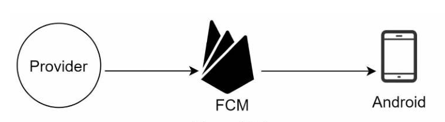

​															图 10-3

#### SMS 消息

对于短信通知，像第三方 SMS 服务如 Twilio[1]，Nexmo[2] 以及其它商业服务。大多数他们的公共服务如下图所示：

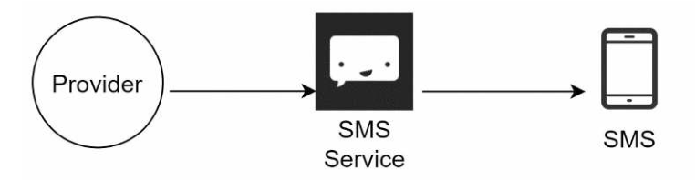

​															图 10-4

#### Email 消息

虽然公司可以建立自己的电子邮件服务器，但许多公司选择了商业性的电子邮件服务。Sendgrid[3] 和 Mailchimp[4] 是最受欢迎的电子邮件服务之一、 它们提供了更好的发送率和数据分析。

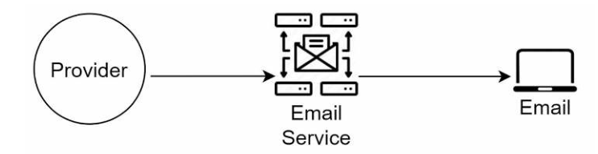

​															图 10-5

图 10-6 展示了所有第三方服务的设计

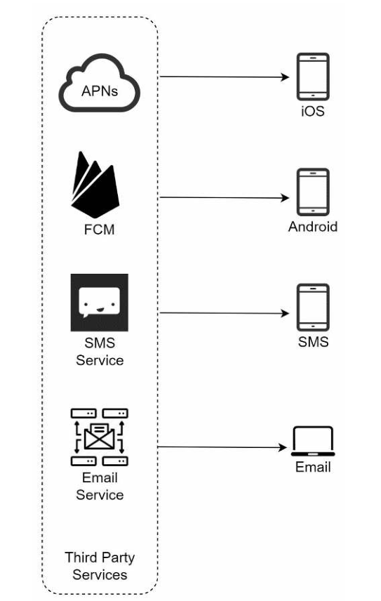

​															图 10-6

### 联系信息收集流程

为了发送通知，我们需要收集移动设备令牌、电话号码或电子邮件地址。如图 10-7 所示，当用户安装我们的应用程序或首次注册时、 API 服务器会收集用户的联系信息并将其存储在数据库中。

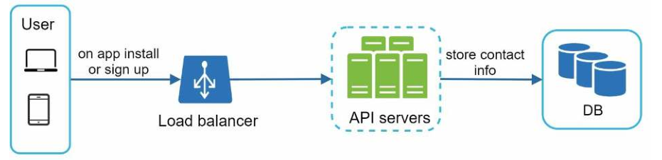

​															图 10-7

图 10-8 简单的展示了数据库表存储联系信息。Email 地址和手机号存储在 `user` 表中，因此设备码（device token）存储在 `device` 表中。一个用户可以有多个设备，即对宋消息的时候可以发送给一个用户的所有设备。

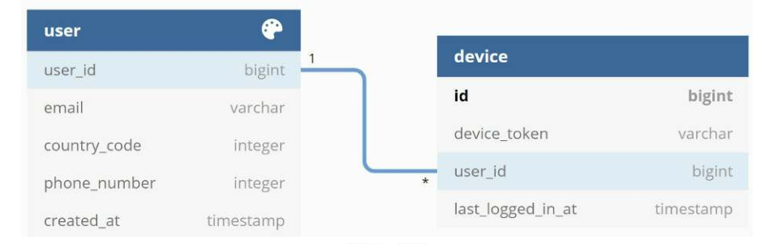

​															图 10-8

### 通知发送与接收流程

我们将首先介绍初始设计；然后，提出一些优化方案。

#### 高层次设计

图 10-9 设计图如下，介绍了每个系统组件。

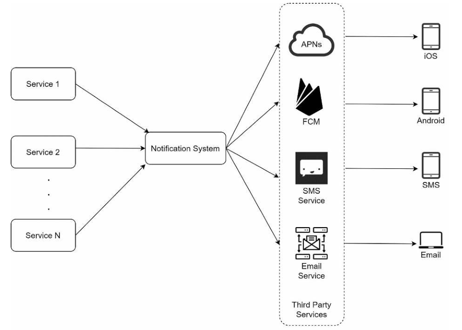

​															图 10-9

**服务 1 对 N：**一个服务可以是一个微服务，一个 cron job，或者一个分布式系统，它可以触发通知发送事件。例如，一个计费服务发送电子邮件，提醒客户到期付款。账单服务发送电子邮件以提醒客户到期付款，或者一个购物网站通过短信告诉客户他们的包裹将在明天送达。通过短信告诉客户他们的包裹明天将被送达。

**通知系统：**通知系统是发送/接收通知的核心。从简单的东西开始，只使用一个通知服务器。它提供为服务 1 到 N 提供 API，并为第三方服务建立通知有效载荷。

**第三方服务：**第三方服务负责将通知传递给用户。在与第三方服务集成时，我们需要特别注意可扩展性。良好的可扩展性意味着一个灵活的系统，可以很容易地可插拔第三方服务。另一个重要的考虑是，第三方服务可能在新市场或未来无法使用。例如，FCM 是在中国无法使用。因此，替代的第三方服务，如 Jpush、PushY 等，在那里被使用。

**iOS,Android,SMS,Email：**用户在他们的设备上收到通知。

在这个设计中发现了三个问题：

- 单点故障（SPOF）：单一的通知服务器意味着 SPOF。
- 难以扩展：通知系统在一台服务器上处理所有与推送通知有关的事情。要独立扩展数据库、缓存和不同的通知处理组件是很有挑战性的。
- 性能瓶颈：处理和发送通知可能是资源密集型的。例如，构建 HTML 页面和等待第三方服务的响应可能需要时间。在一个系统中处理所有事情可能会导致系统过载，特别是在高峰时段。

#### 高层次设计（优化）

在列举了最初设计中的问题后，我们对设计进行了如下改进：

- 将数据库和缓存从通知服务器中移出。
- 增加更多的通知服务器并设置自动横向扩展。
- 引入消息队列来解耦系统组件。

图 10-10 展示了优化后的设计

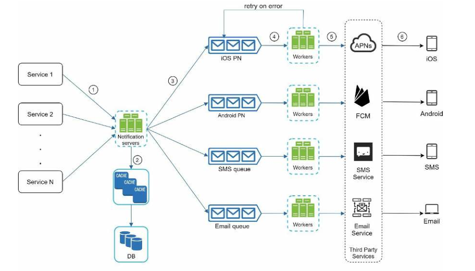

​															图 10-10

理解上图最好的方式，就是从左到右

**服务 1 到 N：**它们代表不同的服务，通过通知服务器提供的 API 发送通知。

**通知服务器：**它们提供以下功能：

- 为服务提供发送通知的 API。这些 API 只能由内部或经过验证的客户访问，以防止垃圾邮件。
- 进行基本验证，以验证电子邮件、电话号码等。
- 查询数据库或缓存以获取渲染通知所需的数据。
- 将通知数据放到消息队列中进行并行处理。

下面是发送 API 的一个例子：

```
POST https://api.example.com/v/sms/send
Request body
{
	"to":[{
		"userId":123456
	}],
	"form":{
		"email": "form_address@email.com"
	},
	"subject":"hello, world",
	"content":[{
		"type": "text/plain",
		"value": "Hello, World!"
	}]
}
```

**缓存：**用户信息，设备信息，通知模板。

**数据库：**存储关于用户数据，通知，配置等。

**消息队列：**它们消除了组件之间的依赖性。消息队列作为缓冲器，当大量的通知被发送出去时。每种通知类型都有一个独立的消息队列，所以一个第三方服务的中断不会影响到其他通知类型。

**工作者：**工作者是一个服务器列表，它从消息队列中提取通知事件，并将其发送给相应的第三方服务。将它们发送到相应的第三方服务。

**三方服务：**在初始设计当中已经说到了。

**iOS,Android,SMS,Email：**在初始设计当中已经说到了。

下一步，我们来解释一下每个组件是如何一起工作并发送消息通知的：

1. 一个服务调用通知服务器提供的 API 来发送通知。
2. 通知服务器从缓存或数据库中获取元数据，如用户信息、设备码和通知设置。
3. 通知事件被发送到相应的队列中进行处理。例如，一个 iOS 推送通知事件被发送到 iOS PN 队列中。
4. 工作者从消息队列中提取通知事件。
5. 工作者向第三方服务发送通知。
6. 第三方服务向用户设备发送通知。

## 第3步-深入研究

在高层设计中，我们讨论了不同类型的通知、联系人信息收集流程，以及通知发送/接收流程。我们将深入探讨以下问题：

- 可靠性。
- 额外的组件和考虑因素：通知模板、通知设置、限流限制、重试机制、推送通知的安全性、监控排队的通知和事件跟踪。
- 更新的设计。

### 可靠性

在设计分布式环境的通知系统时，我们必须回答几个重要的可靠性问题。

#### 如何防止数据丢失？

通知系统中最重要的要求之一是**不能丢失数据**。通知通常可以被延迟或重新排序，但绝不会丢失。为了满足这一要求，通知系统将通知数据持久化在数据库中，并实现重试机制。通知日志数据库包括数据持久化，如图 10-11 所示

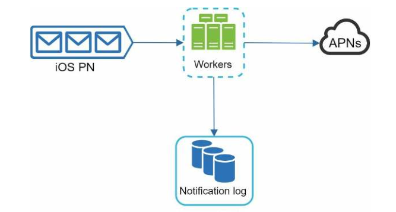

​															图 10-11

#### 收件人会正好收到一次通知吗？

答案是**不会**。尽管大多数时候通知都是准确地传递一次，但由于分布式的特点，可能会导致重复通知。分布式的性质可能会导致重复的通知。为了减少重复推送发生，我们引入了一个删除机制，并仔细处理每一个故障案例。下面是一个简单的重复计算逻辑：

当一个通知事件第一次到达时，我们通过检查事件的 ID 来检查它是否以前被推送。如果它是重复信息，它就被丢弃。否则，我们将发送通知。对于感兴趣的有兴趣的读者可以参考参考资料[5]，了解为什么我们不能精确地发送一次消息。

### 额外的组件和注意事项

我们已经讨论了如何收集用户的联系信息，发送和接收通知。通知系统远不止这些。这里我们讨论了额外的组件，包括模板重复使用，通知设置，事件跟踪，系统监控，限流等。

#### **通知模板**

一个大型的通知系统每天会发出数百万条通知，其中许多通知都遵循类似的格式。通知模板的引入是为了避免从头开始建立。通知模板是一个预先格式化的通知，可以通过自定义参数、样式、跟踪链接等来创建你独特的通知。下面是一个推送通知的例子模板。

```
BODY:
You dreamed of it. We dared it. [ITEM NAME] is back — only until [DATE].
CTA:
Order Now. Or, Save My [ITEM NAME]
```

使用通知模板的好处是维护了一致的格式，减少了偏移错误，节省了时间。

#### 通知设置

用户通常每天收到太多的通知，他们很容易感到被淹没了。因此，许多网站和应用程序为用户提供了对通知设置的精细化控制。这些信息被存储在通知设置表中，有以下字段：

| userId  | bigInt  |                        |
| ------- | ------- | ---------------------- |
| channel | varchar | 推送通知，email 或短信 |
| opt_in  | boolean | 接收通知的可选项       |

在给用户发送通知之前，我们首先检查了该用户的可选项推送配置。

#### 限流

为了避免用户被过多的通知所淹没，我们可以限制一个用户可以收到的通知数量。这一点很重要，因为如果我们发送得太频繁，接收者可能会完全关闭。如果我们发送得太频繁，接收者可能会完全关闭通知。

#### 重试机制

当第三方服务发送通知失败时，该通知需要加进重试的消息队列中。如果该问题一旦存在，就会弹出警告给开发者。

#### 安全推送

对于 iOS 或安卓设备，appKey 和 appSecret 是用来确保安全的推送消息[6]。只有经过鉴权或验证的客户端才允许发送推送消息。有兴趣的查看参考资料[6]

#### 监控队列通知

要监控的一个关键指标是排队通知的总数量。如果这个数字很大、通知事件的处理速度就不够快。为了避免在通知交付的延迟，需要更多的工作者。图 10-12 显示了一个 要处理的排队消息的例子。

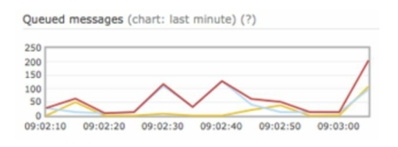

​															图 10-12

#### 事件跟踪

通知指标，如打开率、点击率和参与度，对了解客户行为非常重要。了解客户的行为。分析服务实现了事件跟踪。通常需要在通知系统和分析服务之间进行整合。通常需要在通知系统和分析服务之间进行整合。图 10-13 显示了一个为分析目的可能被跟踪的事件的例子。

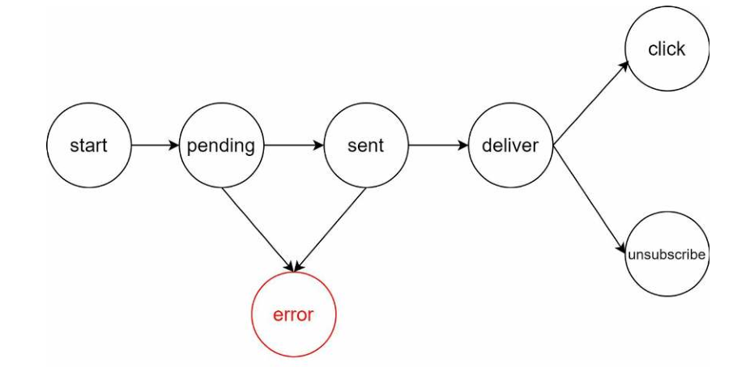

​															图 10-13

最后我将前面讲到的所有内容用一张图来表明

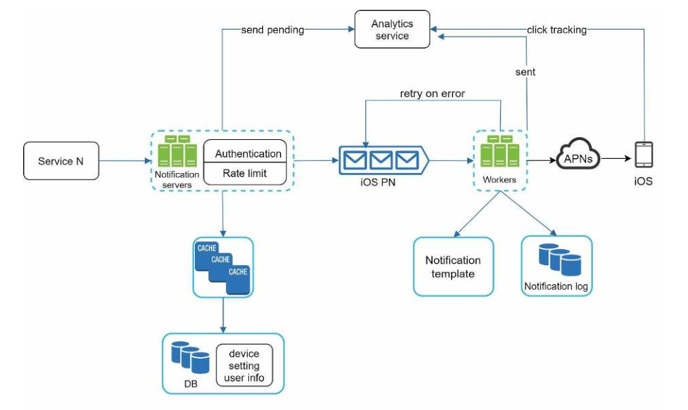

​															图 10-14

在这个设计中，与之前的设计相比，增加了许多新的组件。

- 通知服务器配备了两个更重要的功能：认证和限流。
- 我们还增加了一个重试机制来处理通知失败。如果系统不能发送通知，它们就会被放回消息队列中，工作人员会重试一定数量的预定的次数。
- 此外，通知模板在创建过程中提供了一个一致和有效的通知。
- 最后，监测和跟踪系统被添加到系统健康检查和未来的改进。

## 第4步-总结

通知是不可缺少的，因为它能让我们了解重要的信息。它可能是关于你在 Netflix 上最喜欢的电影的推送通知，关于新产品折扣的电子邮件，或者是关于你的在线购物付款确认的消息。

在本章中，我们描述了一个可扩展的通知系统的设计，它支持多种通知格式：推送通知、SMS 消息和电子邮件。我们采用了消息队列来解耦系统组件。

除了高层次的设计，我们还深入挖掘了更多的组件和优化。

- 可靠性：我们提出了一个强大的重试机制，以尽量减少故障率。

- 安全性：AppKey/AppSecret 对用于确保只有经过验证的客户才能发送通知。
- 跟踪和监控：这些都是在通知流程的任何阶段实现的，以便捕获重要的统计信息。
- 尊重用户设置：用户可以选择退出接收通知。我们的系统发送通知之前会首先检查用户的设置。
- 速率限制：用户会喜欢对他们收到的通知的数量设置频率上限。

