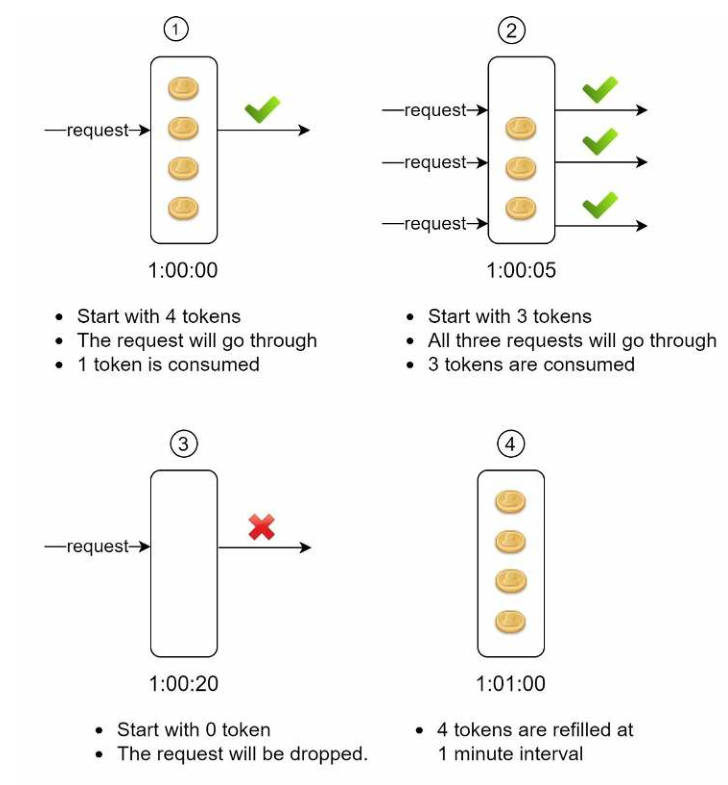

# 设计一个限流器

在网络系统中，限流器用于控制客户端或服务发送的流量速率。在HTTP世界中，限流器限制客户端请求在指定时间内允许发送的数量。如果API请求计数超过限流器定义的阈值，则所有多余的调用将被阻止。以下是一些例子：

- 用户每秒钟只能写入不超过2篇帖子。 
- 您可以从同一个IP地址每天创建最多10个帐户。
- 您每周最多可以从同一设备领取5次奖励。

首先来看下限流器的好处：

- 防止由拒绝服务（DoS）攻击引起的资源饥饿。几乎所有大型技术公司发布的API都强制执行某种形式的限流。例如，Twitter 将推文数量限制为每 3 小时 300 条。Google 文档 API 的默认限制如下：每个用户每60秒钟最多为 300 个读请求。限流器通过阻止超量调用来防止 DoS 攻击，无论是故意的还是无意的。
- 减少成本。限制超量请求意味着减少服务器数量，并将更多资源分配给高优先级的 API。限流对于使用付费第三方 API 的公司非常重要。例如，对于以下外部 API：检查信用，进行付款，检索健康记录等，您按每个调用收费。限制调用次数对于降低成本至关重要。
- 防止服务器过载。为了减少服务器负载，使用限流器过滤由机器人或用户行为不当引起的超量请求。

## 限流器应该放在哪里？

直观地说，你可以在客户端或服务器端实现一个限流器。
- 客户端实施。一般来说，客户端是一个不可靠的地方来执行限流，因为客户端的请求很容易被恶意行为者伪造。此外。我们可能无法控制客户端的实现。
- 服务器端的实现。下图显示了一个放在服务器上的限流器端。

除了客户端和服务器端的实现，还有另一种方法。我们不在 API 服务器上设置限流器，而是创建一个限流器的中间件，它可以对你的 API 的请求进行节流，如下图所示。

让我们用下图中的一个例子来说明限流在这种设计中是如何工作的。

假设我们的 API 允许每秒2个请求，而一个客户在一秒钟内向服务器发送了 3个请求。前两个请求被路由到 API 服务器。然而，限流器中间件会对第三个请求进行节流，并返回HTTP 状态代码 429。HTTP 429 响应状态代码表明用户发送了太多的请求。

云微服务已经广泛流行，限流通常在一个叫做 API 网关的组件中实现。API 网关是一个完全可管理的服务，支持限流、SSL 终止、认证、IP 白名单、服务静态内容等。现在，我们只需要知道，API 网关是一个支持限流的中间件。

在设计限流器时，要问自己的一个重要问题是：限流器应该在哪里实现，在服务器端还是在网关中？这没有绝对的答案。这取决于你公司目前的技术栈、工程资源、优先级、目标等。这里有一些一般的指导方针:

- 评估你目前的技术栈，如编程语言，缓存服务等。确保你目前的编程语言能够有效地在服务器端实现限流。
- 确定适合你的业务需求的限流算法。 当你实施一切都在服务器端实现，你可以完全控制算法。一切都在服务器端实现的话，你可以完全控制算法。然而，如果你使用的是第三方网关，你的选择可能是有限的。
- 如果你已经使用了微服务架构，并在设计中包含了一个 API 网关，以执行认证、IP 白名单等。你可以在 API 网关上添加一个限流器。
- 建立你自己的限流服务需要时间。如果你没有足够的工程资源来实现一个限流器，商业 API 网关是一个更好的选择。

## 限流算法

速率限制可以使用不同的算法实现，每种算法都有其独特的优缺点。尽管本章不专注于算法，但对其进行高层次的理解有助于选择适合我们使用情况的正确算法或算法组合。以下是一些流行算法的列表：

- 令牌桶（Token bucket）
- 漏桶算法（Leaking bucket）
- 固定窗口计数（Fixed window counter）
- 滑动窗口日志（Sliding window log）
- 滑动窗口计数（Sliding window counter）

### 令牌桶算法

令牌桶算法广泛用于速率限制。它是简单、易于理解的，被许多互联网公司广泛采用。AWS 和 Stripe 都使用这个算法来限制其 API 请求。

​							(图4)

令牌桶算法的工作方式如下：

- 令牌桶是一个预定义容量的容器。令牌以固定的速率定期放入桶中。一旦桶满了，就不再添加令牌。如图4所示，令牌桶容量为 4。填充器（refiller）每秒向桶中放入 2 个令牌。一旦桶满了，额外的令牌就会溢出。

- 每个请求消耗一个令牌。当一个请求到达时，我们检查桶中是否有足够的令牌。图5解释了它是如何工作的。

  - 如果有足够的令牌，我们为每个请求取出一个令牌，然后请求通过。
  - 如果没有足够的令牌，则请求被抛弃。

  

  ​								(图5)

  图6说明了令牌消耗、补给和速率限制逻辑是如何工作的。在这个例子中，桶的大小是4，补给率是每1分钟4个。

  

  ​							（图7）

令牌桶算法需要两个参数： 

- 桶的大小（bucket size）：桶中允许的最大令牌数。

- 补充速率（refill rate）：每秒放入桶中的令牌数量。 

我们需要多少个桶？这取决于限速规则，以下是一些例子： 

  - 通常需要为不同的 API 端点使用不同的令牌桶。例如，如果允许用户每秒发1篇帖子、每天添加150个好友和每秒点赞5个帖子，则每个用户需要3个桶。

- 如果我们需要根据IP地址限制请求速率，则每个IP地址需要一个桶。

- 如果系统允许每秒最多10,000个请求，则有一个全局桶供所有请求共享是有意义的。

优点：
- 该算法易于实现。

- 内存高效。

- 令牌桶允许短时间内的流量突发。只要有剩余的令牌，请求就可以通过。

缺点：

- 算法中的两个参数是桶的大小和令牌填充率。然而，适当地调整它们可能是一个挑战。

### 漏桶算法

漏桶算法类似于令牌桶算法，但请求是以固定速率进行处理的。它通常使用先进先出（FIFO）队列实现。算法的工作方式如下：

- 当请求到达时，系统会检查队列是否已满。如果队列未满，则将请求添加到队列中。
- 否则，请求将被丢弃。
- 请求将定期从队列中拉出并进行处理。
- 图8 解释了该算法的工作原理。

  漏桶算法有两个参数：

- **桶大小（bucket size）**：等于队列大小。队列保留要以固定速率处理的请求。
- **流出速率（outflow rate）**：定义了在固定速率下可以处理多少个请求，通常以秒为单位。

电商公司 Shopify 使用漏桶算法进行限流。

**优点：**

- 鉴于队列大小有限，内存效率高。
- 请求以固定速率处理，因此适用于需要稳定流出速率的用例。

**缺点：**

- 突发的流量会填满队列，导致旧请求未能及时处理，而最近的请求会受到速率限制。
- 算法有两个参数。可能不容易正确地调整它们。

### 固定窗口计数算法

固定窗口计数器算法的工作原理如下：

- 算法将时间轴分成固定大小的时间窗口，并为每个窗口分配一个计数器。

- 每个请求将计数器加一。

- 一旦计数器达到预定义的阈值，新请求将被丢弃，直到开始一个新的时间窗口。

让我们使用一个具体的例子来看看它是如何工作的。在图9中，时间单位为1秒，系统允许每秒最多3个请求。在每个秒窗口中，如果收到超过3个请求，则额外的请求将被丢弃，如图9所示。

  这个算法的一个主要问题是，**在时间窗口的边缘出现大量的流量可能会导致超过允许配额的请求数量通过**。考虑以下情况：

在上图中，系统每分钟允许最多5个请求，并且可用配额在以人类友好的整分钟为单位重置。如图所示，在`2:00:00`和`2:01:00`之间有五个请求，在`2:01:00`和`2:02:00`之间又有五个请求。对于`2:00:30`到`2:01:30`之间的一分钟窗口，有10个请求通过。这是允许请求数量的两倍。

**优点：**

- 内存高效
- 易理解
- 在一个时间窗口结束时重置可用配额适用于某些使用情况

**缺点：**

- 时间窗口的边缘出现流量激增可能会导致超出允许配额的请求被执行。

### 滑动窗口日志算法

正如之前讨论的，固定时间窗口计数器算法存在一个重大问题：**它允许更多的请求在时间窗口的边界通过**。滑动时间窗口日志算法解决了这个问题。它的工作原理如下：

- 该算法跟踪请求的时间戳。时间戳数据通常存储在缓存中，如 Redis 的排序集合。
- 当新的请求到来时，删除所有过时的时间戳。过时的时间戳被定义为早于当前时间窗口开始的时间戳。
- 将新请求的时间戳添加到日志中。
- 如果日志的大小与允许的计数相同或更低，则接受请求。否则，将其拒绝。
- 我们通过下图中的示例来解释算法。

在这个例子中，速率限制器每分钟允许2个请求。通常情况下，日志中存储的是 Linux 时间戳。然而，在这个例子中，我们使用人类可读的时间表示来提高可读性。

- 当一个新的请求在`1:00:01`到达时，日志是空的。因此，该请求被允许。

- 一个新请求在`1:00:30`到达，时间戳`1:00:30`被插入日志中。插入后，日志大小为2，小于允许的请求数量。因此，该请求被允许。

- 一个新请求在`1:00:50`到达，时间戳被插入到日志中。插入后，日志大小为3，大于允许的大小2。因此，即使时间戳仍然存在于日志中，此请求被拒绝。

- 一个新请求在`1:01:40`到达。在`[1:00:40,1:01:40)`范围内的请求仍处于最新时间框架内，但在`1:00:40`之前发送的请求已过期。日志中删除了两个过期的时间戳，`1:00:01`和`1:00:30`。删除操作后，日志大小变为2；因此，该请求被接受。

优点：

- 该算法实现的速率限制非常准确。在任何滚动时间窗口中，请求都不会超过速率限制。

缺点：

- 该算法消耗大量内存，因为即使一个请求被拒绝，它的时间戳仍然可能存储在内存中。

### 滑动窗口计数算法

滑动窗口计数算法是一种混合方法，将固定窗口计数器和滑动窗口日志相结合。该算法可以通过两种不同的方法实现。本节将解释一种实现方法，并在本节末尾提供另一种实现方法的参考资料。图4-11说明了该算法的工作原理。

假设速率限制器每分钟允许最多7个请求，上一分钟有5个请求，当前分钟有3个请求。对于一个到达当前分钟的30％位置的新请求，滚动窗口中的请求数量可以使用以下公式计算：

- 当前窗口中的请求 + 上一个窗口中的请求 * 滚动窗口和上一个窗口的重叠百分比
- *使用这个公式，我们得到 3 + 5 * 0.7% = 6.5个请求。根据用例不同，数字可以向上或向下取整。在我们的例子中，它向下取整为6。

由于速率限制器每分钟最多允许7个请求，所以当前请求可以通过。但是，再接收一个请求后，限制将被达到。

由于空间限制，我们将不在此处讨论其他实现方法。有兴趣的读者可以参考参考资料。该算法并不完美。它有优点和缺点。

**优点：**

- 它平滑了流量峰值，因为速率基于前一个窗口的平均速率。
- 内存使用效率高。

**缺点：**

- 它仅适用于不太严格的回溯窗口。它是实际速率的近似值，因为它假设前一个窗口中的请求均匀分布。然而，这个问题可能没有看起来那么糟糕。根据 Cloudflare 进行的实验，在4亿个请求中，只有0.003％的请求被错误地允许或限制速率。

## 高维度架构

