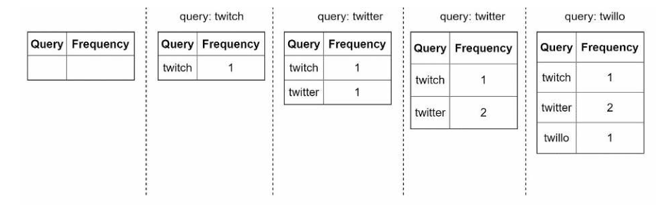

# 设计一个查询自动补全的系统

在谷歌上搜索或在亚马逊购物时，当你在搜索框中输入时，会有一个或多个与搜索词相匹配的内容呈现给你。这一功能被称为自动完成、提前输入、边输入边搜索或增量搜索。图 13-1 展示了一个当在搜索框中输入"晚餐"时，谷歌搜索显示了一个自动完成的结果列表。搜索自动完成是许多产品的一个重要功能。这将我们引向的问题是：设计一个搜索自动完成系统，也称为"设计top k"或"设计最多搜索的 k 个查询"。


​																图 13-1

## 理解问题和确定设计范围

首先**要求**如下：

- **响应时间要快：**当用户输入一个搜索查询时，自动完成的建议必须显示得足够快。一篇关于 [Facebook 的自动完成系统的文章](https://www.facebook.com/notes/facebook-engineering/the-life-of-a-typeahead-query/389105248919/)显示，该系统需要在 100 毫秒内返回结果。否则会造成卡顿。
- **相关性：**自动完成的建议应该与搜索词相关。
- **排序：**系统返回的结果必须按照流行度或其他排名模式进行排序。
- **可扩展性：**系统可以处理高流量。
- **高可用性：**当系统的一部分脱机、速度减慢或遇到意外的网络错误时，系统应保持可用和可访问性。系统脱机、速度减慢或出现意外的网络错误时，系统应保持可用和可访问。

**粗略估计**：

- 假设有 1000 万用户量日活。
- 平均一个用户每天执行 10 次查询。
- 每次查询的数据占 20 字节：
  - 假设我们使用的 ASCII 编码格式。1 字符等于 1 字节
  - 假设每次查询包含 4 个单词，平均每个单词包含 5 个字符
  - 即每次查询大约 20 字节

对于在搜索框中输入的每一个字符，客户端都会向后端发送一个请求以获得自动完成的建议。平均而言，每个搜索查询会发送 20 个请求。例如，在你完成输入时，以下 6 个请求被发送到后端"晚餐"。

```
search?q=d
search?q=di
search?q=din
search?q=dinn
search?q=dinne
search?q=dinner
```

- 大约 24,000 每秒查询请求(QPS) = 10,000,000 用户量 * 10 查询/天 * 20 字节/24 小时/3600 秒
- QPS 峰值 = QPS * 2 = ~48,000
- 假设每天有 20% 的查询是新的。1000 万 *10 次查询/天 * 20 字节/次查询 * 20% = 0.4 GB。这意味着每天有 0.4 GB的新数据被添加到存储中。

## 高层设计

在高层次上，该系统被分解成两个：
- 数据收集服务：它收集用户的输入查询，并实时汇总它们。实时处理对于大型数据集来说是不实际的；但是，它是一个很好的起点。我们将在深入研究中探索一个更现实的解决方案。
- 查询服务：给定一个搜索查询或前缀，返回 5 个最常搜索的术语。

### 数据收集服务

让我们用一个简化的例子来看看数据收集服务是如何工作的。假设我们有一个频率表，存储查询字符串和其频率，如图 13-2 所示。在开始时，频率表是空的。后来，用户输入查询 "twitch"、"twitter"、"twitter"和"twillo"的顺序。图 13-2 显示了频率表的更新情况。



​																图 13-2

### 查询服务

假设我们有一个频率表，如表 13-1 所示。它有两个字段。

- Query：存储查询字符串
- Frequency：它表示已经出现的查询次数。


​																表 13-1

当用户在搜索框中输入"tw"时，会显示以下前 5 个搜索的查询结果 (图 13-3），假设频率表是基于表 13-1。


​																图 13-3

查询前 5 个高频率的查询，执行的 SQL 如下：

```sql
SELECT * FROM frequency_table 
WHERE query LIKE `prefix%`
ORDER BY frequency DESC
LIMIT 5
```

这个解决方案当查询数据集很小的时候是可以接收的。当数据集非常大的时候，数据库访问就成为了性能瓶颈。我们接下来就要深入分析优化方案。

## 深入研究

在高层设计中，我们讨论了数据收集服务和查询服务。高层设计并不是最佳的，但它是一个很好的起点。在这一节中，我们将深入研究几个组件，并探讨以下优化措施：
- Trie 数据结构
- 数据收集服务
- 查询服务
- 缩放存储
- Trie 操作

### Trie 数据结构

在高层设计中，关系型数据库被用于存储。然而，从关系型数据库中获取前 5 个搜索查询的效率很低。数据结构 trie（前缀树）被用来克服这个问题。由于 trie 数据结构对系统至关重要，我们将用大量的时间来设计一个定制的 trie。请注意，其中的一些想法是[来自](https://medium.com/@prefixyteam/how-we-built-prefixy-a-scalable-prefix-search-service-for-powering-autocomplete-c20f98e2eff1)[文章](https://people.eecs.berkeley.edu/~sylvia/papers/pht.pdf)。

了解基本的 tree 数据结构对于这个面试问题来说是至关重要的，这更像是一个数据结构问题，而不是一个系统设计问题。此外，许多在线材料解释了这个概念。在本章中，我们将只讨论 trie 数据结构的概述，并着重讨论如何优化基本的 trie 数据结构。并集中讨论如何优化基本的 tree 来提高响应时间。

Trie（发音为"try"）是一种树状的数据结构，可以紧凑地存储字符串。它的名字来自于检索一词。这表明它是为字符串的检索操作。trie 的主要思想包括以下内容：
- trie 是一个树状的数据结构。
- 根代表一个空字符串。
- 每个节点存储一个字符，有 26 个子节点，每个子节点代表一个可能的字符。为了节省空间，我们不画空链接。
- 每个树节点代表一个单词或一个前缀字符串。

图 13-5 显示了一个带有搜索查询 "tree", "try", "true", "toy", "wish", "win "的 trie。搜索查询以较粗的边框突出显示。


​																图 13-5

基本的 Trie 数据结构在节点中存储字符。为了支持按频率排序，频率信息需要包含在节点中。假设我们有以下频率表。


​																表 13-2

在添加频率信息至节点之后，trie 数据结构更新如图 13-6


​																图 13-6

自动完成是如何在 Trie 中工作的？在深入研究算法之前，让我们定义一些术语。

- p：前缀的长度
- n：trie 中的节点总数
- c：一个给定节点的子节点的数量

获得前 k 个最多搜索的查询的步骤如下：

1. 找到前缀。时间复杂度：O(p)。
2. 从前缀节点遍历子树，得到所有有效的子节点。一个子节点是有效的，如果它可以形成一个有效的查询字符串。时间复杂度：O(c)
3. 对子代进行排序，得到前 k 名：O(clogc)

让我们用一个如图 13-7 所示的例子来解释这个算法。假设 k 等于 2，用户在搜索框中输入"tr"。该算法的工作原理如下：

- 步骤1：找到前缀节点"tr"。
- 第2步：遍历子树，得到所有有效的子节点。在这种情况下，节点[tree: 10], [true： 35], [try: 29]是有效的。
- 第3步：对子节点进行排序，得到前两名。[true: 35]和[try: 29] 是前 2 个带有前缀为"tr"的查询。


​																图 13-7

这个算法的时间复杂度是上述每个步骤所花费的时间之和：`O(p) + O(c) + O(clogc)`

上述算法直截了当。然而，它太慢了，在最坏的情况下，我们需要遍历整个 trie 来获得前 k 个结果。下面是两个优化方案：

1. 限制前缀的最大长度
2. 缓存每个节点的顶级搜索查询

让我们逐一来看看这些优化措施。

#### 限制前缀的最大长度

用户很少在搜索框中输入一个长的搜索查询。因此，可以说 p 是一个小的整数，例如 50。如果我们限制前缀的长度，那么"查找前缀"的时间复杂度就可以从 O(p) 降低到 O(小常数)，也就是O(1)。

#### 缓存每个节点的顶级搜索查询

为了避免遍历整个三角形，我们在每个节点上存储前 k 个最常用的查询。由于 5 到 10 个自动完成的建议对用户来说已经足够了，所以 k 是一个相对较小的数字。在我们的具体案例中，只有前 5 个搜索查询被缓存。

通过在每个节点上缓存顶级搜索查询，我们大大降低了检索前 5 个查询的时间复杂性。然而，**这种设计需要大量的空间来存储每个节点上的顶级查询**。每个节点都需要大量的空间。用空间换取时间是非常值得的，因为快速响应时间非常重要。

图 13-8 显示了更新后的 trie 数据结构。前 5 个查询被存储在每个节点上。例如，前缀为"be"的节点存储以下内容：[best： 35, bet: 29, bee: 20, be： 15, beer： 10]。


​																图 13-8

让我们重新审视一下应用这两个优化后的算法的时间复杂性：

1. 寻找前缀节点。时间复杂度：O(1)
2. 返回 top k。由于 top k 的查询是缓存的，这一步的时间复杂度是 O(1)。

由于每个步骤的时间复杂度都降低到 O(1)，我们的算法只需要 O(1) 来获取前 k 个查询。

### 数据收集服务

在我们以前的设计中，每当用户键入一个搜索查询，数据就会实时更新。由于以下两个原因，这种方法并不实用：
- 用户每天可能会输入数十亿次的查询。在每次查询中更新 trie 显著降低了查询服务的速度。
- 一旦建立了 trie，顶级建议（top suggestions）可能不会有太大变化。因此，没有必要频繁更新 trie。

为了设计一个可扩展的数据收集服务，我们研究了数据的来源和数据的使用方式。数据是如何被使用的。像 Twitter 这样的实时应用需要最新的自动完成建议。然而，许多谷歌关键词的自动完成建议可能每天都不会有太大变化。

尽管用例不同，但数据收集服务的基础仍然是相同的，因为用于建立数据的数据。因为用于建立三角形的数据通常来自分析或记录服务。

图 13-9 显示了重新设计的数据收集服务。每个组件都被逐一检查。


​																图 13-9

#### **分析日志**

它存储的是查询的原始数据。日志是只读追加并且是不可索引的。表 13-3 展示了一个日志文件例子


​																表 13-3

#### **聚合器**

根据不同的用例，我们可能会以不同的方式聚合数据。对于实时应用程序，如 Twitter，我们在较短的时间间隔内聚集数据，因为实时结果很重要。另一方面，聚集数据的频率较低，例如每周一次，可能对许多用例来说已经很好了。在采访过程中，验证实时结果是否重要。我们假设 Trie 每周都会重建。

#### 数据聚合

表 13-4 显示了一个汇总的周数据的例子。"Time"字段表示一周的开始时间。"Frequency"字段是该周相应查询的出现次数的总和。


​																表 13-4

#### 工作者

工作者是一组服务器，以固定的时间间隔执行异步工作。他们建立 Trie 数据结构并将其存储在 Trie DB 中。

#### Trie 缓存

Trie 缓存是一个分布式的缓存系统，将 Trie 保存在内存中，以便快速读取。它每周对数据库进行一次快照。

#### Trie 数据库

Trie 数据库是持久性存储。有两个选项可用于存储数据：

1. 文件存储：由于每周都会建立一个新的 trie，我们可以定期对其进行快照、将其序列化，并将序列化的数据存储在数据库中。像 [MongoDB](https://en.wikipedia.org/wiki/MongoDB) 这样的文档存储是很适合序列化数据的。
2. 键值存储：一个 trie 可以用哈希表的形式表示，通过应用下面的逻辑：
   - trie 中的每个前缀都被映射到哈希表的一个键。
   - 每个 trie 节点上的数据被映射到哈希表中的一个值。

图 13-10 显示了 trie 和哈希表之间的映射。


​																图 13-10

在图 13-10 中，左边的每个 trie 节点被映射到右边的 `<key, value>`。如果你不清楚键值存储是如何工作的，请参阅[第6章：设计一个键值存储](Design-KV-Store.md)。

### 查询服务

在高层设计中，查询服务直接调用数据库来获取前 5 个结果。 图 13-11 显示了改进后的设计，因为之前的设计效率很低。


​																图 13-11

1. 一个搜索查询被发送到负载均衡器。
2. 负载平衡器将请求路由到 API 服务器。
3. API 服务器从 Trie Cache 获得 Trie 数据，并为客户端构建自动完成的建议。
4. 如果数据不在 Trie Cache 中，我们将数据补充回缓存。这样一来，所有对同一前缀的后续请求都从缓存中返回。缓存缺失可能发生在，当缓存服务器没有内存或脱机时，就会发生缓存缺失。

查询服务需要快如闪电的速度。我们建议进行以下优化：

- AJAX 请求。对于网络应用，浏览器通常发送 AJAX 请求来获取自动完成的结果。AJAX 的主要好处是，发送/接收一个请求/响应而不会刷新整个网页。
- 浏览器缓存。对于许多应用程序，自动完成搜索建议可能不会在短时间内变化。因此，自动完成的建议可以被保存在浏览器的缓存，以允许后续请求直接从缓存中获得结果。谷歌搜索引擎也使用同样的缓冲机制。图 13-12 显示了当你在浏览器上输入"系统设计面试"时的响应头。正如你所看到的，Google 将结果在浏览器中缓存了 1 小时。请注意：`cache-control` 中的"private"意味着结果只针对单个用户，不能被共享缓存所缓存。"max-age=3600"意味着缓存的有效期为 3600 秒，也就是一个小时。


​																图 13-12

- 数据采样：对于一个大规模的系统，记录每个搜索查询需要大量的处理能力和存储。数据采样很重要。例如，每 N 个请求中只有 1 个被系统记录下来。

### Trie 相关操作

这是自动完成系统的核心组件。我们来看一下 trie 如何操作（创建，更新，删除）的。

#### 创建

Trie 是由工人使用汇总的数据创建的。数据的来源是来自分析日志/数据库。

#### 更新

有两种方法来更新 trie

1. 每周更新 trie。一旦创建了一个新的 trie，新的 trie 将取代旧的。
2. 直接更新单个 trie 节点。我们尽量避免这种操作，因为它是缓慢。然而，如果 trie 的大小较小，它是一个可以接受的解决方案。当我们更新一个 trie 节点时，它的祖先一直到根都必须被更新，因为祖先存储了子节点的顶级查询。图 13-13 显示了一个更新操作的例子。在左边，搜索查询"啤酒"的原始值是 10。在右边，它被更新为 30。正如你所看到的，该节点和它的祖先的"啤酒"值被更新为30。


​																图 13-13

#### 删除

我们必须删除仇恨的、暴力的、色情的或危险的自动完成建议。我们在 Trie Cache 前面添加一个过滤层（图 13-14）来过滤掉不需要的建议。有了过滤层，我们就可以根据不同的过滤规则灵活地删除结果。不需要的建议被从数据库中物理删除，非同步地删除，因此正确的数据集将在下一个更新周期被用于建立 Trie。


​																图 13-14

### 扩大存储规模

现在我们已经开发了一个系统来为用户提供自动完成的查询，现在是时候解决当 trie 增长到足以容纳一台服务器时的可扩展性问题了。

由于英语是唯一被支持的语言，一个简单的分片方法是基于字符。这里有一些例子。

- 如果我们需要两台服务器来存储，我们可以将以'a'到'm'开头的查询存储在第一台服务器上，而'n'到'z'在第二台服务器上。
- 如果我们需要三台服务器，我们可以把查询分成'a'到'i'，'j'到'r'，'s'到'z'。

按照这个逻辑，我们可以将查询分成 26 个服务器，因为英语中有 26 个字母。让我们把基于第一个字符的分片定义为第一层分片。要存储超过 26 个服务器的数据，我们可以在第二层甚至第三层进行分片。例如，以'a'开头的数据查询可以被分成4个服务器：'aa-ag'、'ah-an'，'ao-au'，和'av-az'。

乍一看，这种方法似乎很合理，直到你意识到还有很多以字母"c"开头的单词比以"x"开头的多得多。这就造成了分布不均。

为了缓解数据不平衡的问题，我们分析了历史数据的分布模式，并应用更智能的分片逻辑，如图 13-15 所示。应用更智能的分片逻辑，如图 13-15 所示。**分片映射管理器**维护一个查找数据库，以确定应将行存储在何处。例如，如果有一个"s"和"u"、"v"、"w"、"x"、"y "和"z"的历史查询数量相近，我们可以维护两个分片：一个是 "s "的分片，一个是 "u "的分片。


​																图 13-15

## 总结

除了这些之外，可能还会有很多待解决的问题。

**如何支持多语言的查询，这次内容只讲了英文？**

为了支持其他非英语的查询，我们在 trie 节点中存储 Unicode 字符。如果你对 Unicode 不熟悉，[这里有一个定义](https://www.unicode.org/faq/basic_q.html)："一个编码标准涵盖了世界上所有的书写系统的字符，无论是现代的还是古代的"[5]。

**如果一个国家的顶级搜索查询与其他国家不同怎么办？**

在这种情况下，我们可能会为不同国家建立不同的尝试。为了提高响应时间，我们可以将尝试存储在 CDN 中。

**如何支持趋势性（实时）的搜索查询？**

假设一个新闻事件爆发了，一个查询搜索突然变得很流行。我们原来的设计将无法工作，因为：

- 离线工人还没有被安排更新数据库，因为这被安排为每周运行。
- 即使它被安排了，也需要太长的时间来构建 trie。

构建实时搜索自动完成系统很复杂，超出了本书的范围，所以我们只给出一些想法：

- 通过分片减少工作数据集。

- 改变排名模型，给最近的搜索查询分配更多的权重。
- 数据可能会以流的形式出现，所以我们不能一下子访问所有的数据。流动的数据意味着数据是连续产生的。流处理需要一组不同的系统：[Apache Hadoop MapReduce](https://hadoop.apache.org/), [Apache Spark Streaming](https://spark.apache.org/streaming/), [Apache Storm](https://storm.apache.org/)、[Apache Kafka](https://kafka.apache.org/documentation/)等。因为所有这些主题都需要特定的领域知识，所以我们在此不做详述。