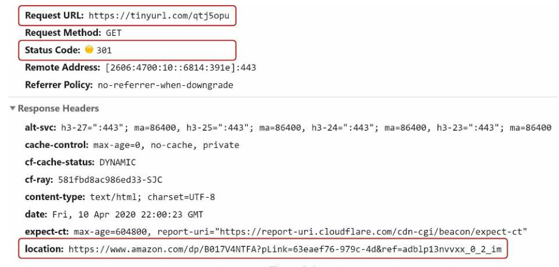
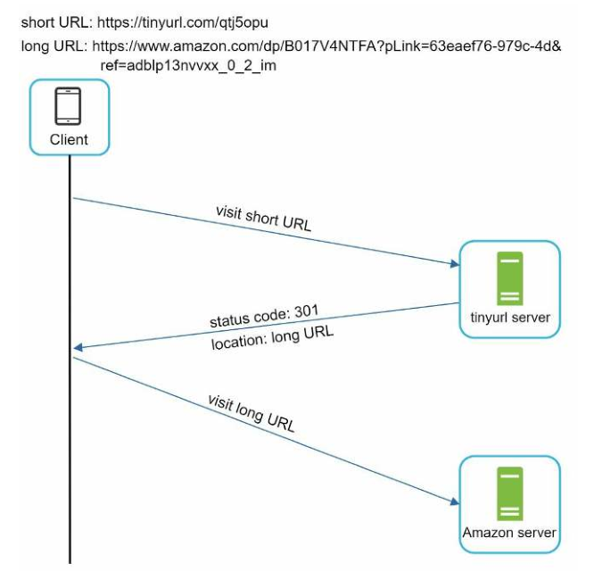
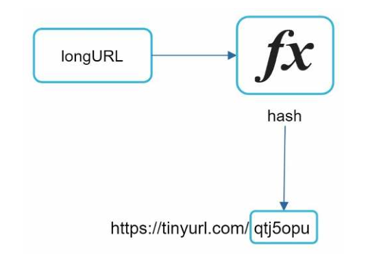
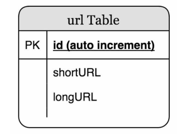
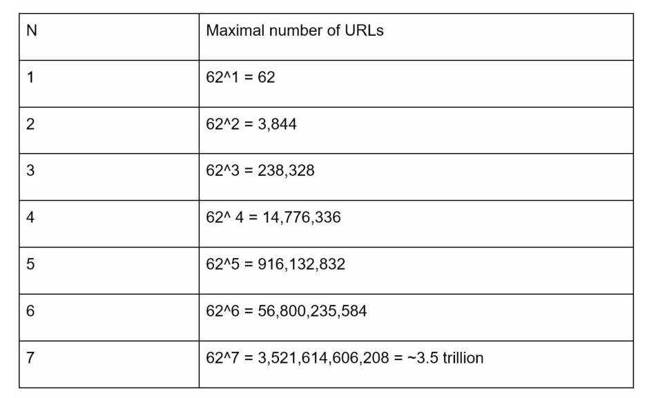

# 设计一个短链接系统

在这一章中，我们将解决一个有趣而经典的系统设计面试问题：设计一个像 tinyurl 一样的短 URL 服务。

## 第1步-理解问题并确定设计范围

一个短链接服务应该要有什么样的特征？首先是使用特征：

1. 生成短链接：给定一个原始链接，服务器会返回一个短链接。
2. 链接重定向：输入一个短链接，重定向到原始链接。
3. 高可用、可扩展性和容错性考虑。

### 信封背面估计（粗略估算）

- 写操作： 每天产生 1 亿个 URL。
- 每秒写操作：1亿/24/3600=1160
- 读取操作：假设读操作与写操作的比例为 10:1，则每秒读操作：1160 * 10 = 11,600
- 假设 URL 短链接服务将运行 10 年，这意味着我们必须支持 1亿 * 365 * 10=365 亿条记录。
- 假设平均 URL 长度为 100。
- 10 年内的存储需求： 365亿 * 100字节 * 10年=365 TB

## 第2步-提出高层次的设计

这节我们讨论 API 终结点，URL 重定向以及 URL 缩短的流程。

### API 终结点

API 端点促进了客户和服务器之间的通信。我们将设计 APIs 的 REST 风格。如果你不熟悉 restful API，你可以参考外部资料、 如参考资料[1]中的资料。一个 URL 短链接服务要需要两个 API 终结点。

1. URL 缩短：为了缩短一个链接，客户端发送一个 POST 请求，它只包含一个参数：原始长链接。API 看起来像下面这样：

   POST api/v1/data/shorten

   请求参数：{longUrl: longURLString}

   返回短链接

2. URL 重定向。为了将一个短的 URL 重定向到相应的长的 URL，客户端发送一个 GET 请求。该 API 看起来像这样：

   GET api/v1/shortUrl

   返回重定向的原始长链接

### URL 重定向

图 8-1 展示了当你在浏览器上输入一个短链接发生的事情。一旦服务器接收到一个短链接请求，它会通过 301 重定向将短链接更改为长链接。

​															图 8-1

客户端与服务器端的具体交互如图 8-2 所示。

​															图 8-2

这里面值得讨论的就是 301/302 重定向。

**301 重定向**：表明请求的 URL 被"永久"地移到了长的URL。由于它是永久重定向的，浏览器会缓存响应，并且对同一 URL 的后续请求将不会被发送到 URL 短链接服务器。相反，请求被直接重定向到长网址服务器。

**302重定向：**表明请求的 URL 被"暂时"移到长 URL 上、意味着对同一 URL 的后续请求将继续被发送到 URL 服务器的。然后，它们会被重定向到长链接服务器。

每种重定向方法都有其优点和缺点。如果优先考虑的是减少服务器负载、使用 301 重定向是有意义的，因为只有同一 URL 的第一个请求被发送到 URL 短链接服务器。然而，如果分析是重要的，302 重定向是一个更好的选择，因为它可以更容易跟踪点击率和点击来源。

实现 URL 重定向的最直观的方法是使用哈希表。假设哈希表存储`<shortURL, longURL>` 键值对，URL 重定向可以通过以下方式实现：

- 获取长 URL：`longURL = hashTable.get(shortURL)`
- 一旦你得到长 URL，就执行 URL 重定向。

### URL 缩短

让我们假设短网址看起来像这样 `www.tinyurl.com/{hashValue}`。为了支持缩短 URL 的用例，我们必须找到一个哈希函数 fx，将一个长的 URL 映射到 hashValue，如图 8-3 所示。

​															图 8-3

哈希函数必须满足以下要求：
- 每个 longURL 必须被散列到一个 hashValue。
- 每个 hashValue 都可以被映射回 longURL。

哈希函数的详细设计将在深入研究中讨论。

## 第3步-深入研究

到目前为止，我们已经讨论了 URL 缩短和 URL 重定向的高层设计。在本节中，我们将深入探讨以下内容：数据模型、哈希函数、URL 缩短和 URL 重定向。

### 数据模型

在高层设计中，所有的东西都存储在一个哈希表中。这是一个很好的起点；然而，这种方法在现实世界的系统中是不可行的，**因为内存资源是有限的和昂贵的**。一个更好的选择是将`<shortURL, longURL>` 映射存储在一个关系型数据库中。图 8-4 显示了一个简单的数据库表设计。该表的简化版本包含 3 个列：ID、shortURL、longURL。

​															图 8-4

### 哈希函数

哈希函数用于将一个长的 URL 散列成一个短的 URL，也被称为 hashValue。

#### 哈希值的长度

哈希值由[0-9, a-z, A-Z]中的字符组成，包含 10+26+26=62 个可能的字符。要计算 hashValue 的长度，请找出最小的 n，使 62^n ≥ 365 亿。根据背面估计，系统必须支持多达 365 亿个 URLs。粗略的估计。下表显示了 hashValue 的长度和相应的它可以支持的最大的 URL 数量。

​															表 8-1

