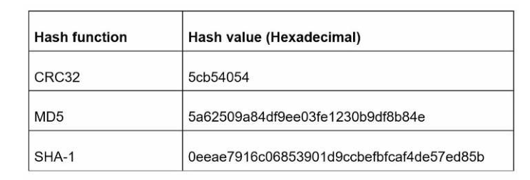
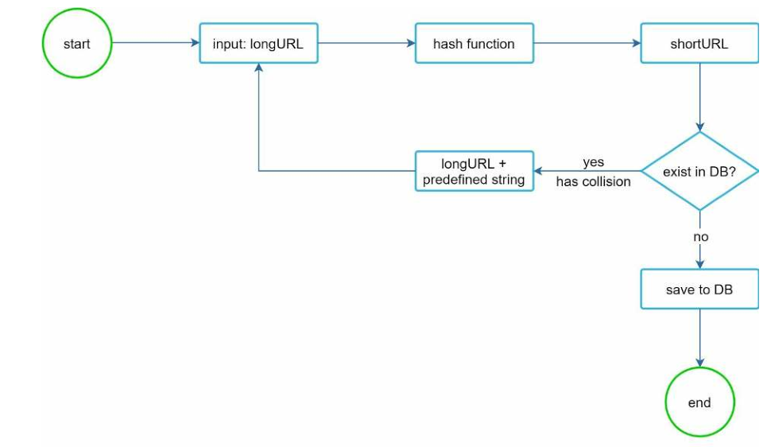
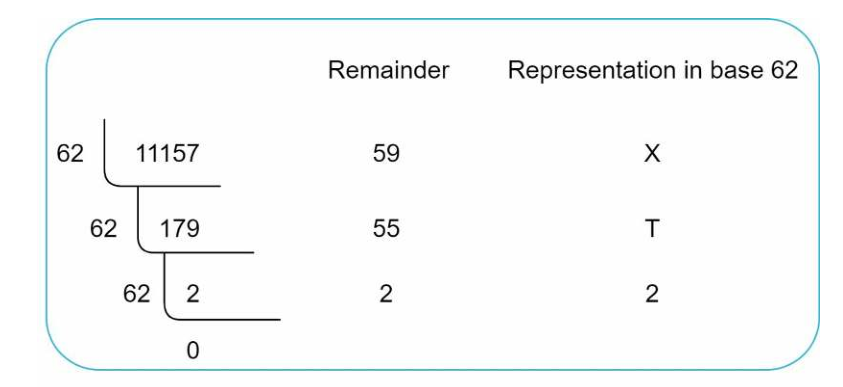
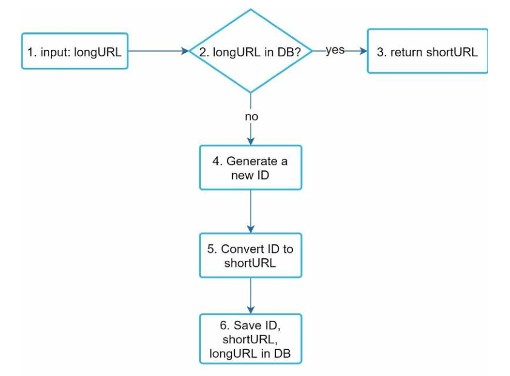
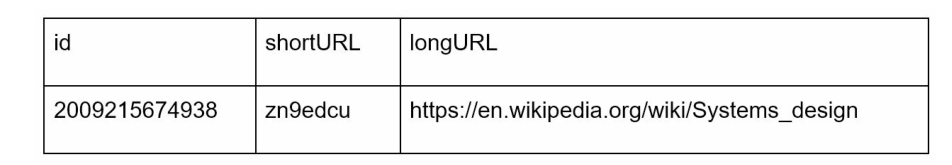
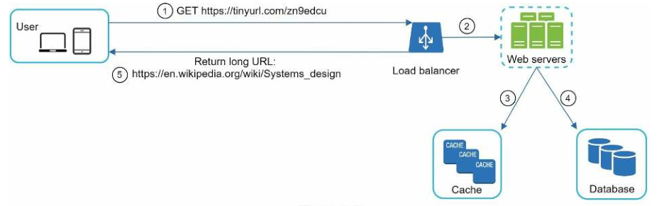

# 设计一个短链接系统

在这一章中，我们将解决一个有趣而经典的系统设计面试问题：设计一个像 tinyurl 一样的短 URL 服务。

## 第1步-理解问题并确定设计范围

一个短链接服务应该要有什么样的特征？首先是使用特征：

1. 生成短链接：给定一个原始链接，服务器会返回一个短链接。
2. 链接重定向：输入一个短链接，重定向到原始链接。
3. 高可用、可扩展性和容错性考虑。

### 信封背面估计（粗略估算）

- 写操作： 每天产生 1 亿个 URL。
- 每秒写操作：1亿/24/3600=1160
- 读取操作：假设读操作与写操作的比例为 10:1，则每秒读操作：1160 * 10 = 11,600
- 假设 URL 短链接服务将运行 10 年，这意味着我们必须支持 1亿 * 365 * 10=365 亿条记录。
- 假设平均 URL 长度为 100。
- 10 年内的存储需求： 365亿 * 100字节 * 10年=365 TB

## 第2步-提出高层次的设计

这节我们讨论 API 终结点，URL 重定向以及 URL 缩短的流程。

### API 终结点

API 端点促进了客户和服务器之间的通信。我们将设计 APIs 的 REST 风格。如果你不熟悉 restful API，你可以参考外部资料、 如参考资料[1]中的资料。一个 URL 短链接服务要需要两个 API 终结点。

1. URL 缩短：为了缩短一个链接，客户端发送一个 POST 请求，它只包含一个参数：原始长链接。API 看起来像下面这样：

   POST api/v1/data/shorten

   请求参数：{longUrl: longURLString}

   返回短链接

2. URL 重定向。为了将一个短的 URL 重定向到相应的长的 URL，客户端发送一个 GET 请求。该 API 看起来像这样：

   GET api/v1/shortUrl

   返回重定向的原始长链接

### URL 重定向

图 8-1 展示了当你在浏览器上输入一个短链接发生的事情。一旦服务器接收到一个短链接请求，它会通过 301 重定向将短链接更改为长链接。

​															图 8-1

客户端与服务器端的具体交互如图 8-2 所示。

​															图 8-2

这里面值得讨论的就是 301/302 重定向。

**301 重定向**：表明请求的 URL 被"永久"地移到了长的URL。由于它是永久重定向的，浏览器会缓存响应，并且对同一 URL 的后续请求将不会被发送到 URL 短链接服务器。相反，请求被直接重定向到长网址服务器。

**302重定向：**表明请求的 URL 被"暂时"移到长 URL 上、意味着对同一 URL 的后续请求将继续被发送到 URL 服务器的。然后，它们会被重定向到长链接服务器。

每种重定向方法都有其优点和缺点。如果优先考虑的是减少服务器负载、使用 301 重定向是有意义的，因为只有同一 URL 的第一个请求被发送到 URL 短链接服务器。然而，如果分析是重要的，302 重定向是一个更好的选择，因为它可以更容易跟踪点击率和点击来源。

实现 URL 重定向的最直观的方法是使用哈希表。假设哈希表存储`<shortURL, longURL>` 键值对，URL 重定向可以通过以下方式实现：

- 获取长 URL：`longURL = hashTable.get(shortURL)`
- 一旦你得到长 URL，就执行 URL 重定向。

### URL 缩短

让我们假设短网址看起来像这样 `www.tinyurl.com/{hashValue}`。为了支持缩短 URL 的用例，我们必须找到一个哈希函数 fx，将一个长的 URL 映射到 hashValue，如图 8-3 所示。

​															图 8-3

哈希函数必须满足以下要求：
- 每个 longURL 必须被散列到一个 hashValue。
- 每个 hashValue 都可以被映射回 longURL。

哈希函数的详细设计将在深入研究中讨论。

## 第3步-深入研究

到目前为止，我们已经讨论了 URL 缩短和 URL 重定向的高层设计。在本节中，我们将深入探讨以下内容：数据模型、哈希函数、URL 缩短和 URL 重定向。

### 数据模型

在高层设计中，所有的东西都存储在一个哈希表中。这是一个很好的起点；然而，这种方法在现实世界的系统中是不可行的，**因为内存资源是有限的和昂贵的**。一个更好的选择是将`<shortURL, longURL>` 映射存储在一个关系型数据库中。图 8-4 显示了一个简单的数据库表设计。该表的简化版本包含 3 个列：ID、shortURL、longURL。

​															图 8-4

### 哈希函数

哈希函数用于将一个长的 URL 散列成一个短的 URL，也被称为 hashValue。

#### 哈希值的长度

哈希值由[0-9, a-z, A-Z]中的字符组成，包含 10+26+26=62 个可能的字符。要计算 hashValue 的长度，请找出最小的 n，使 62^n ≥ 365 亿。根据背面估计，系统必须支持多达 365 亿个 URLs。粗略的估计。下表显示了 hashValue 的长度和相应的它可以支持的最大的 URL 数量。

​															表 8-1

当 n = 7 时，62 ^ n = ~3.5 万亿，3.5 万亿足以容纳 3650 亿个 URL，所以 hashValue 的长度为 7。

我们将探索两种类型的 URL 缩短器的哈希函数。第一种是"哈希 + 碰撞解决"，第二种是 "62 进制转换"。让我们逐一看看。

### 哈希 + 碰撞解决

为了缩短长的 URL，我们应该实现一个哈希函数，将长的 URL 哈希成一个 7 个字符的字符串。一个直接的解决方案是使用知名的哈希函数，如 CRC32、MD5 或 SHA-1。下表比较了对这个 URL `https://en.wikipedia.org/wiki/Systems_design` 应用不同的哈希函数后的哈希结果：

​															表 8-2

如表 8-2 所示，即使是最短的哈希值（来自 CRC32）也太长了（超过 7 个字符）。我们怎样才能使它更短呢？

第一种方法是收集哈希值的前 7 个字符；但是，这种方法会导致哈希值的碰撞。为了解决哈希碰撞，我们可以递归地追加一个新的预定义字符串，直到不再发现碰撞。这个过程在图 8-5 中解释

​															图 8-5

这种方法可以消除碰撞；但是，查询数据库以检查每个请求是否存在短网址的成本很高。一种叫做 Bloom filter 的技术可以提高性能。布隆过滤器是一种空间有效的概率技术，用于测试一个元素是否是一个集合的成员。更多细节请[参考资料](https://en.wikipedia.org/wiki/Bloom_filter)。

### 62 进制转换

进制转换是另一种常用于 URL 缩短器的方法。进制转换有助于在不同的数字表示系统之间转换同一数字。使用 62 进制转换，因为有 62 个可能的字符用于 hashValue。让我们用一个例子来解释转换是如何进行的：将 11157（10 进制）转换成 62 进制表示法。

- 从它的名字来看，62 进制是一种使用 62 个字符进行编码的方式。其映射方式为：： 0-0，...，9-9，10-a，11-b，...，35-z，36-A，...，61-Z，其中'a'代表10，'Z' 代表61 等。

- 11157 = 2 x 62^2 + 55 x 62^1 + 59 x 62^0 = [2, 55, 59] -> [2, T, X] 以 62 进制表示。图 8-6 显示了对话的过程。

  

  ​															图 8-6

- 因此，这个短链接为 `https://tinyurl.com/2TX`

### 比较两个方法

表 8-3 展示了这两种方法的不同

| 哈希 + 碰撞                                       | 62 进制转换                                                  |
| ------------------------------------------------- | ------------------------------------------------------------ |
| 固定的短 URL 长度                                 | 短 URL 长度不是固定的                                        |
| 不需要一个唯一 ID 生成器                          | 依赖于唯一 ID 生成器                                         |
| 碰撞是可能发生的，但可以解决                      | 不会发生碰撞                                                 |
| 它不可能找出下一个可用的短 URL，因为它不依赖于 ID | 如果 ID 为一个新条目增加 1，则很容易找出下一个可用的短 URL。这可能是一个安全问题 |

​															表 8-3

### 深入研究 URL 缩短器

作为系统的核心部分之一，我们希望 URL 缩短的流程在逻辑上是简单和实用的。在我们的设计中使用了 62 进制转换。我们建立了以下图表（图 8-7）来演示这个流程。

​															图 8-7

1. longURL 是输入
2. 系统检查如果 langURL 是否存在于数据库
3. 如果存在，这意味着 longURL 之前被转换为 shortURL。在这种情况下，从数据库中获取 shortURL 并将其返回给客户端。
4. 如果不是，则 longURL 是新的。一个新的唯一ID（主键）是由唯一 ID 生成器生成的。
5. 用 62 进制转换将 ID 转换为 shortURL。
6. 用 ID、shortURL 和 longURL 插入一条新的记录。

为了使这个流程更容易理解，让我们看一个具体的例子。

假设输入的longURL是：https://en.wikipedia.org/wiki/Systems_design
- 唯一 ID 生成器返回 ID：`2009215674938`。
- 使用 62 进制转换将 ID 转换为 shortURL。ID（2009215674938）被转换为 `"zn9edcu"`。
- 将 ID、shortURL 和 longURL 保存到数据库中，如表 8-4 所示。

​															表 8-4

值得一提的是，分布式唯一 ID 生成器。它的主要功能是生成全局唯一的 ID，这些 ID 用于创建 shortURLs。在一个高分布式的环境中，实现一个唯一的 ID 生成器是具有挑战性的。幸运的是，我们已经在["第7章：在分布式系统中设计一个唯一的ID生成器"](Design-A-Unique-ID-Generator-In-Distributed-Systems.md)中讨论了一些解决方案。系统中设计一个唯一的 ID 生成器"。

### 深入研究 URL 重定向

图 8-8 显示了 URL 重定向的详细设计。由于读的次数多于写，`<shortURL, longURL>` 映射被存储在一个缓存中以提高性能。

​															图 8-8

URL重定向的流程总结如下：
1. 一个用户点击一个短 URL 链接：https://tinyurl.com/zn9edcu
2. 负载均衡器将请求转发给 web 服务器。
3. 如果短 URL 已经在缓存中，直接返回长 URL。
4. 如果短 URL 不在缓存中，从数据库中获取长 URL。如果它不在数据库中，很可能是用户输入了一个无效的短 URL。
5. 将 longURL 返回给用户。

## 第4步-总结

在这一章中，我们谈到了 API 设计、数据模型、哈希函数、URL 缩短和 URL 重定向。这里有几个额外的谈话要点。

- 限流器： 我们可能面临的一个潜在的安全问题是，恶意用户发送大量的 URL 缩短请求。限流器有助于根据 IP 地址或其他过滤规则来过滤掉请求。如果你想复习一下关于限流的知识，请参考["第四章：设计一个限流器"](Design-Rate-Limiter.md)。
- 网络服务器的扩展： 由于网络层是无状态的，所以很容易通过添加或删除网络服务器来扩展网络层。
- 数据库的扩展：数据库复制和分片是常见的技术。
- 分析：数据对商业成功越来越重要。将一个分析的解决方案可以帮助回答一些重要的问题，例如有多少人点击了一个链接？有多少人点击了一个链接？他们何时点击链接？等等。
- 可用性、一致性和可靠性。这些概念是任何大型系统成功的核心。