# 设计网络爬虫

在这一章中，我们重点讨论网络爬虫设计：一个有趣的、经典的系统设计面试问题。

网络爬虫被称为机器人或蜘蛛。它被搜索引擎广泛用于发现网络上新的或更新的内容。内容可以是一个网页、一张图片、一段视频、一个 PDF 文件等等。网络爬虫从收集一些网页开始，然后跟踪这些网页上的链接来收集新内容。图 9-1 显示了爬行过程的一个直观例子。

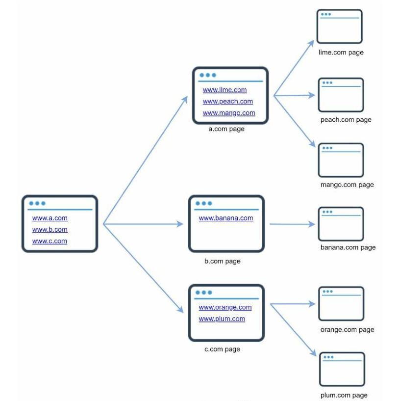

​																	图 9-1

爬虫有许多用途：
- 搜索引擎的索引：这是最常见的使用情况。爬虫收集网页，为搜索引擎创建一个本地索引。例如，Googlebot 是 Google 搜索引擎背后的网络爬虫。
- 网络归档：这是一个从网络上收集信息的过程，以保存数据供将来使用。例如，许多国家图书馆运行爬虫来存档网站。著名的例子是[美国国会图书馆](https://www.loc.gov/websites/)和[欧盟的网络档案](http://data.europa.eu/webarchive)。
- 网络挖掘：网络的爆炸性增长为数据挖掘提供了前所未有的机会。网络挖掘有助于从互联网上发现有用的知识。例如，顶级金融公司使用爬虫下载股东会议和年度报告，以了解公司的关键举措。
- 网络监控。爬虫有助于监测互联网上的版权和商标侵权行为。例如，[Digimarc](https://www.digimarc.com/products/digimarc-services/piracy-intelligence) 利用爬虫来发现盗版作品和报告。

开发一个网络爬虫的复杂性取决于我们打算支持的规模。它可以是一个小型的学校项目，只需要几个小时就能完成，也可以是一个巨大的项目，需要一个专门的工程团队不断地改进。因此，我们将在下面探讨要支持的规模和功能。

## 理解问题和确定设计范围

网络爬虫的基本算法很简单：
1. 给定一组 URLs，下载所有由 URLs 寻址的网页。
2. 从这些网页中提取 URLs
3. 将新的 URL 添加到要下载的 URL 列表中。重复这3个步骤。

网络爬虫的工作是否真的像这种基本算法一样简单？并非如此。设计一个巨大的可扩展的网络爬虫是一项极其复杂的任务。任何人都不可能在面试时间内设计出一个大规模的网络爬虫。在进入设计之前，我们必须提出问题以了解需求并确定设计范围：

候选者：爬虫的主要目的是什么？它是用于搜索引擎的索引、数据挖掘，还是别的什么？

面试官：搜索引擎索引。

候选者：网络爬虫每月收集多少个网页？

面试官：10 亿个网页。

候选者：包括哪些内容类型？只有 HTML 还是其他内容类型，如 PDF 和图片？

面试官：只包括HTML。

候选者：我们应该考虑新添加的或编辑过的网页吗？

面试官：是的，我们应该考虑新添加或编辑过的网页。

候选者：我们是否需要存储从网上抓取的 HTML 网页？

面试官：是的，最多可保存 5 年。

候选者：我们如何处理有重复内容的网页？

面试官：有重复内容的页面应该被忽略。

以上是一些你可以问面试官的样本问题。理解需求并澄清模糊之处非常重要。即使你被要求设计一个简单的产品，如网络爬虫，你和你的面试官也可能有不同的假设。
除了与面试官澄清功能外，记下一个好的网络爬虫的以下特点也很重要：
- 可扩展性：网络是非常大的。那里有数十亿的网页。网络爬行应该使用并行化技术，效率极高。
- 稳健性：网络中充满了陷阱。坏的 HTML，无反应的服务器，崩溃、恶意链接等等都是常见的。爬行器必须处理所有这些边缘情况。
- 礼貌性：爬虫不应该在很短的时间间隔内向一个网站发出太多的请求。
- 可扩展性：该系统是灵活的，因此需要最小的变化来支持新的内容类型。例如，如果我们想在将来抓取图像文件，我们应该不需要重新设计整个系统。

### 粗略估算

下面的估计是基于许多假设，与面试官沟通以保持一致是很重要的。
- 假设每个月有 10 亿个网页被下载。
- QPS：1,000,000,000/30天/24小时/3600秒=~400页/秒。
- 峰值 QPS = 2 * QPS = 800
- 假设平均网页大小为 500k。
- 10亿页 x 500k = 每月 500TB 的存储量。如果你对数字存储单位不清楚，可以再看一下第二章的["粗略估算的力量"]()部分。
- 假设数据存储 5 年，500TB * 12个月 * 5年= 30PB。存储五年的内容需要一个 30PB 的存储。

## 高层设计

一旦需求明确，我们就会进入高层设计。受以前关于网络抓取的研究[4](Heydon A., Najork M. Mercator: A scalable, extensible web crawler World Wide Web, 2
(4) (1999), pp. 219-229)[5](http://infolab.stanford.edu/~olston/publications/crawling_survey.pdf)的启发，我们提出了一个高层设计，如图 9-2 所示。

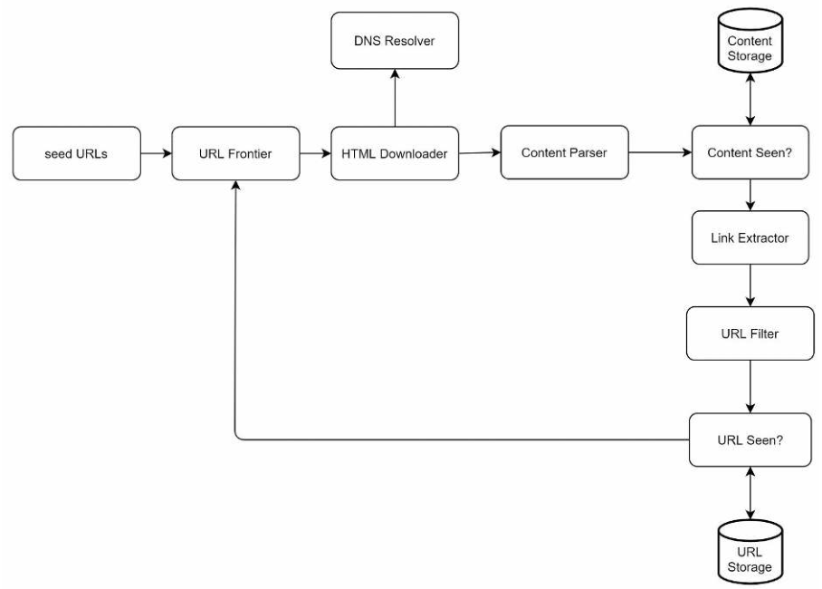

​																	图 9-2

首先，我们探索每个设计组件以了解它们的功能。然后，我们逐步考察爬虫的工作流程。

### 种子网址

网络爬虫使用种子 URL 作为爬行过程的起点。例如，要抓取一所大学网站的所有网页，选择种子 URL 的一个直观方法是使用该大学的域名。

要抓取整个网络，我们需要创造性地选择种子网址。一个好的种子网址可以作为一个好的起点，爬虫可以利用它来遍历尽可能多的链接。一般的策略是将整个网址空间划分为较小的空间。第一种建议的方法是基于地域性，因为不同的国家可能有不同的流行网站。另一种方法是基于主题选择种子 URL；例如，我们可以将 URL 空间分为购物、体育、医疗保健等。种子网址的选择是一个开放式的问题。不指望你能给出完美的答案。只要大声思考就可以了。

### URL Frontier

大多数现代网络爬虫将爬行状态分为两种：待下载和已下载。存储待下载的 URL 的组件被称为 URL Frontier。你可以把它称为先进先出（FIFO）队列。关于 URL Frontier 的详细信息，请参考深入研究。

> "URL Frontier"是一个计算机科学术语，指的是一个 URL 队列，它被爬行进程赋予一个 URL（或者来自于其他爬虫进程的主机分离器）。它维护了一个包含大量 URL 的队列，并且每当有爬虫线程寻找 URL 的时候，它都会按照某种顺序重新排序。

### HTML 下载器

HTML下载器从互联网上下载网页。这些 URL 是由 URL Frontier 提供的。

### DNS 解析器

要下载一个网页，必须将一个 URL 翻译成一个 IP 地址。HTML 下载器调用 DNS 解析器来获取 URL 的相应 IP 地址。例如，截至 2019年5月3日，URL `www.wikipedia.org` 被转换为 IP 地址 198.35.26.96。

### 内容解析器

在下载网页后，必须对其进行解析和验证，因为畸形的网页可能引发问题并浪费存储空间。在抓取服务器中实施内容解析器会减慢抓取过程。因此，内容解析器是一个独立的组件。

### 可视内容？

[在线研究](https://tinyurl.com/y6tmh55y)显示，29% 的网页是重复的内容，这可能导致同一内容被多次存储。我们引入了"可视内容"数据结构，以消除数据的冗余，缩短处理时间。它有助于检测以前存储在系统中的新内容。为了比较两个 HTML 文档，我们可以逐个字符进行比较。然而，这种方法既慢又费时，特别是当涉及到数十亿的网页时。完成这项任务的一个有效方法是比较两个网页的哈希值[7](Rabin M.O., et al. Fingerprinting by random polynomials Center for Research in Computing Techn., Aiken Computation Laboratory, Univ. (1981))。

### 内容存储

它是一个用于存储 HTML 内容的存储系统。存储系统的选择取决于诸如数据类型、数据大小、访问频率、寿命等因素。磁盘和内存都被使用。
- 大多数内容被存储在磁盘上，因为数据集太大，无法装入内存。
- 受欢迎的内容被保存在内存中，以减少延时。

### URL 提取器

URL 提取器解析并提取 HTML 页面的链接。图 9-3 显示了一个链接提取过程的例子。通过添加"https://en.wikipedia.org"前缀，相对路径被转换为绝对 URLs。

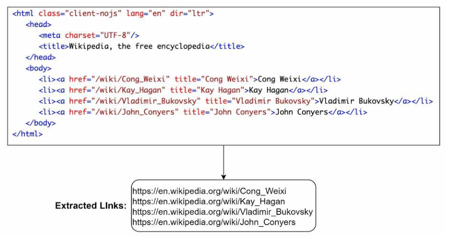

​																	图 9-3

### URL 过滤器

URL 过滤器排除了某些内容类型、文件扩展名、错误链接和"黑名单"网站的 URL。

### 可视 URL？

"URL Seen?"是一个数据结构，用于跟踪之前被访问过的或已经在 Frontier 中的 URL。"URL Seen?"有助于避免多次添加相同的 URL，因为这可能会增加服务器负载并导致潜在的无限循环。

布隆过滤器和哈希表是实现"URL Seen?"组件的常用技术。我们不会在这里介绍布隆过滤器和哈希表的详细实现。欲了解更多信息，请参考参考资料[4](Heydon A., Najork M. Mercator: A scalable, extensible web crawler World Wide Web, 2(4) (1999), pp. 219-229)[8](B. H. Bloom, "Space/time trade-offs in hash coding with allowable errors,"Communications of the ACM, vol. 13, no. 7, pp. 422–426, 1970.)。

### URL 存储

URL 存储可以存储已经访问过的 URL。

到目前为止，我们已经讨论了每个系统组件。接下来，我们把它们放在一起，解释工作流程。

### 网络爬虫工作流

为了更好地一步步解释工作流程，在设计图中加入了序列号，如图 9-4 所示。

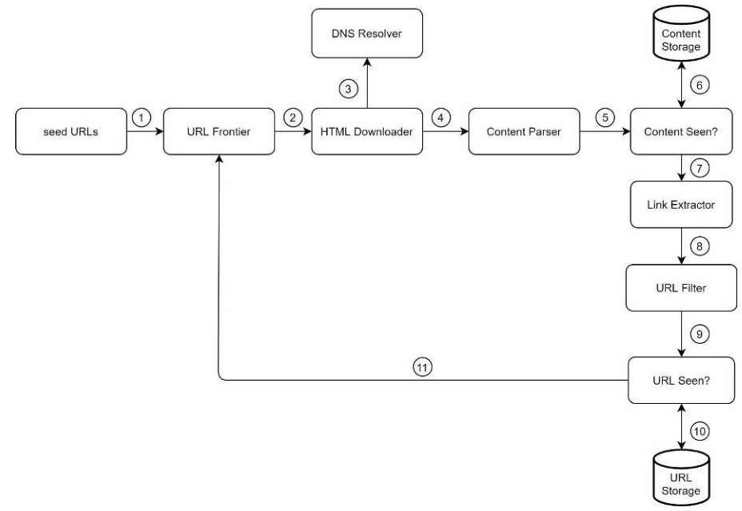

​																	图 9-4

1. 在 URL Frontier 上添加种子 URLs
2. HTML 下载器从 URL Frontier 获取 URLs 列表。
3. HTML 下载器从 DNS 解析器中获取 URL 的 IP 地址并开始下载。
4. 内容解析器解析 HTML 页面并检查页面是否畸形。
5. 在内容被解析和验证后，它被传递给"可视内容？"组件。
6. "可视内容"组件检查 HTML 页面是否已经在存储器中。
   - 如果它在存储器中，这意味着不同 URL 中的相同内容已经被处理过了。在这种情况下，该 HTML 页面被丢弃。
   - 如果它不在存储器中，系统以前没有处理过相同的内容。该内容被传递给链接提取器。
7. 链接提取器从 HTML 页面中提取链接。
8. 提取的链接被传递给 URL 过滤器。
9. 在链接被过滤后，它们被传递给"可视 URL"组件。
10. "可视 URL"组件检查一个 URL 是否已经在存储中，如果是，它将被提前处理，不需要做什么。
11. 如果一个 URL 之前没有被处理过，它将被添加到 URL Frontier 中。

## 深入研究

到现在为止，我们已经讨论了高层设计。接下来，我们将深入研究最重要的构建组件和技术：
- 深度优先搜索（DFS）与广度优先搜索（BFS）的对比
- URL 边界（URL frontier）
- HTML 下载器
- 稳健性
- 可扩展性
- 检测并避免有问题的内容

### DFS vs BFS

你可以把网络想象成一个有向图，其中网页是节点，超链接（URL）是边。抓取过程可以被视为从一个网页到其他网页的有向图的遍历。两种常见的图形遍历算法是 DFS 和 BFS。然而，DFS 通常不是一个好的选择，因为 DFS 的深度可能很深。

BFS 通常被网络爬虫使用，由先进先出（FIFO）队列实现。在先进先出队列中，URL 是按照它们被排队的顺序进行排队的。然而，这种实现方式有两个问题：

- 来自同一网页的大多数链接都被链接回同一主机。在图 9-5 中，wikipedia.com 的所有链接都是内部链接，使得爬虫忙于处理来自同一主机（wikipedia.com）的URL。当爬虫试图平行下载网页时，维基百科服务器将被请求淹没。这被认为是"不礼貌的"。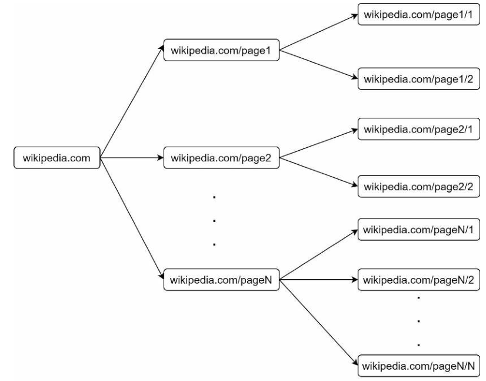

  ​																图 9-5

- 标准的 BFS 没有考虑到 URL 的优先级。网络很大，不是每个页面都有相同的质量和重要性。因此，我们可能希望根据页面排名、网络流量、更新频率等来确定 URL 的优先级。

### URL Frontier

URL Frontier 有助于解决这些问题。URL Frontier 是一个数据结构，存储要下载的 URL。URL Frontier 是确保礼貌性、URL 优先性和新鲜度的一个重要组成部分。在参考资料中提到了一些关于 URL Frontier 的值得注意的论文[5](http://infolab.stanford.edu/~olston/publications/crawling_survey.pdf)[9](https://www.ics.uci.edu/~lopes/teaching/cs221W12/slides/Lecture05.pdf)。这些论文的结论如下：

#### 礼貌性（Politeness）

一般来说，网络爬虫应避免在短时间内向同一主机服务器发送太多的请求。发送过多的请求被认为是"不礼貌的"，甚至被视为拒绝服务（DOS）攻击。例如，在没有任何约束的情况下，爬虫每秒可以向同一个网站发送成千上万的请求。这可能使网络服务器不堪重负。

**执行礼貌的一般想法是，每次从同一主机下载一个页面。在两个下载任务之间可以增加一个延迟**。礼貌性约束是通过维护网站主机名到下载（工作者）线程的映射来实现的。每个下载者线程有一个单独的 FIFO 队列，只下载从该队列中获得的 URL。图 9-6 显示了管理礼貌的设计。

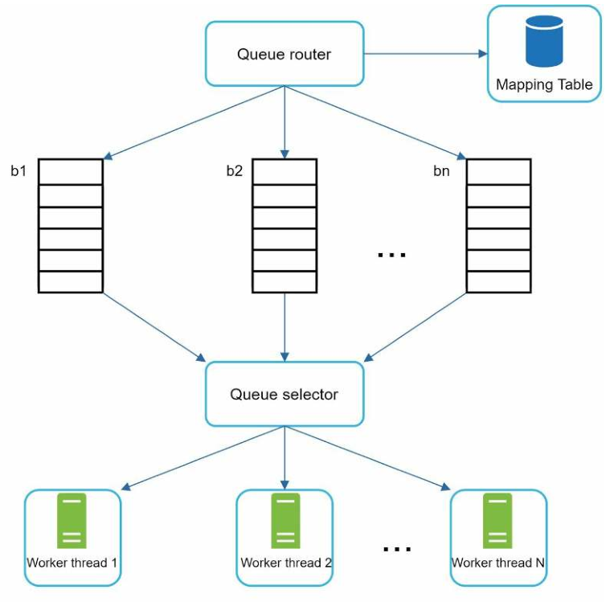

​																图 9-6

- 路由队列：它确保每个队列（b1，b2，...bn）只包含来自同一主机的 URLs。

- 映射表：它将每个主机映射到一个队列。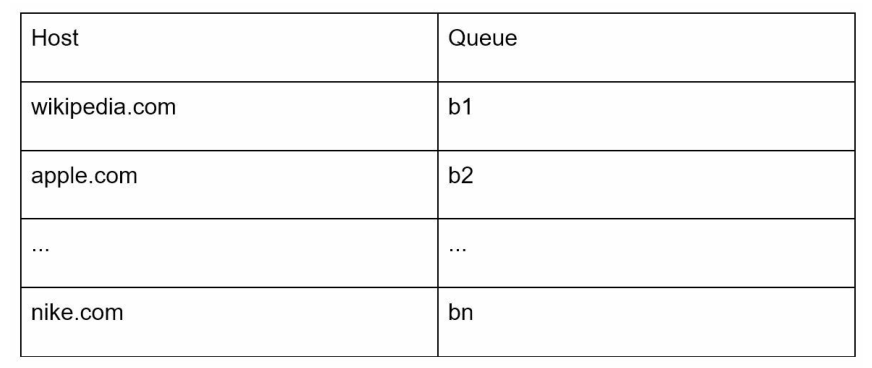

  ​															表 9-1

- FIFO 队列 b1、b2 至 bn：每个队列包含来自同一主机的 URL。

- 队列选择器：每个工作者线程都被映射到一个先进先出队列，它只从该队列下载 URL。队列选择逻辑是由队列选择器完成的。

- 工作线程 1 至 N。一个工作者线程从同一主机逐一下载网页。在两个下载任务之间可以添加一个延迟。

#### 优先级

一个关于苹果产品的讨论论坛上的随机帖子与苹果主页上的帖子具有非常不同的权重。尽管它们都有"苹果"这个关键词，但爬虫首先抓取苹果主页是明智之举。

我们根据有用性来确定 URL 的优先级，有用性可以通过 [PageRank](L. Page, S. Brin, R. Motwani, and T. Winograd, "The PageRank citation
ranking: Bringing order to the web," Technical Report, Stanford University,1998.)、网站流量、更新频率等来衡量。"Prioritizer"是处理 URL 优先级的组件。关于这个概念的深入信息，请参考参考资料[5][10]。

图 9-7 显示了管理 URL 优先权的设计。

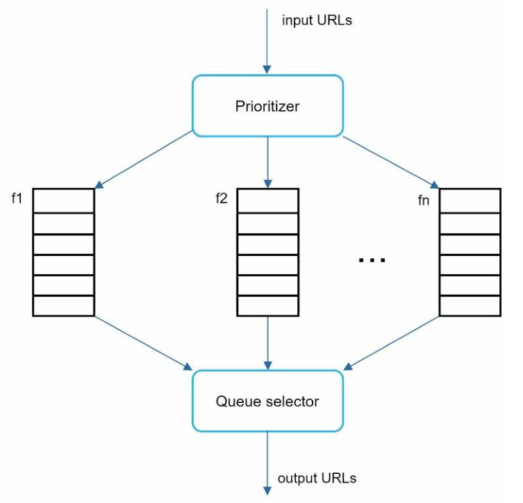

​																图 9-7

- 优先排序器：它将 URL 作为输入并计算出优先级。
- 队列 f1 至 fn：每个队列都有一个分配的优先级。具有高优先级的队列以更高的概率被选中。
- 队列选择器：随机选择一个队列，偏向于具有较高优先级的队列。

图 9-8 展示了 URL Frontier 设计，它包含两个模块：
- 前队列：管理优先次序
- 后队列：管理礼貌性

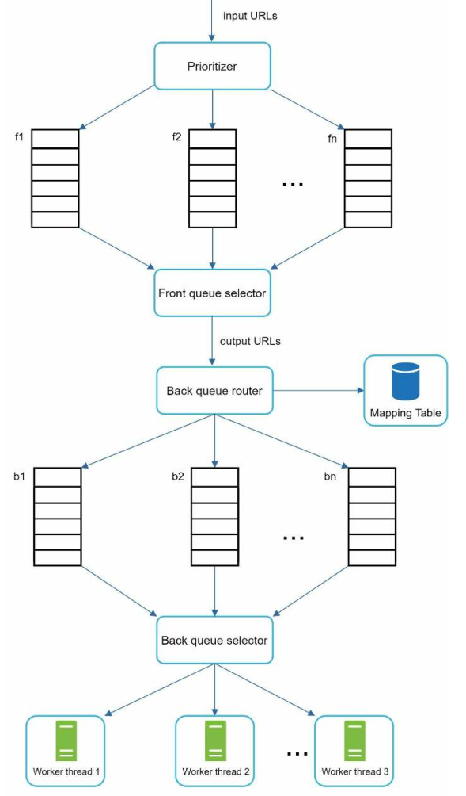

​																图 9-8

#### 新鲜感（Freshness）

网页在不断被添加、删除和编辑。网络爬虫必须定期重新抓取下载的网页，以保持我们的数据集的新鲜。重新抓取所有的 URL 是非常耗时和耗资源的。以下是一些优化新鲜度的策略：
- 根据网页的更新历史重新抓取。

  > 可以通过在下载 URL 时记录当前时间戳，或者是哈希值比较

- 对 URL 进行优先排序，首先更频繁地重新抓取重要网页。

#### 存储 URL Frontier

在现实世界的搜索引擎抓取中，URL Frontier 中的 URL 数量可能是数以亿计的[4]。把所有的东西都放在内存中既不耐用也不可以扩展。把所有东西都放在磁盘里也不可取，因为磁盘的速度很慢；而且它很容易成为爬虫的瓶颈。

我们采用了一种混合方法。大部分的 URL 都存储在磁盘上，所以存储空间不是问题。为了减少从磁盘读取和向磁盘写入的成本，我们在内存中维护缓冲区，用于 enqueue/dequeue 操作。缓冲区中的数据会定期写入磁盘。

### HTML 下载器

HTML 下载器使用 HTTP 协议从互联网上下载网页。在讨论 HTML 下载器之前，我们先看看 Robots Exclusion 协议。

#### Robots.txt

Robots.txt，称为 Robots 排除协议，是网站用来与爬虫沟通的标准。它规定了允许爬虫下载哪些页面。在尝试爬行一个网站之前，爬虫应首先检查其相应的 robots.txt，并遵守其规则。

为避免重复下载 robots.txt 文件，我们对该文件的结果进行了缓存。该文件被定期下载并保存到缓存中。下面是取自 `https://www.amazon.com/robots.txt` 的一段 robots.txt 文件。一些目录如 creatorhub 是不允许谷歌机器人访问的。

```
用户代理： 谷歌机器人
不允许： /creatorhub/*
不允许： 禁用: /rss/people/*/reviews
不允许： 拒绝接受: /gp/pdp/rss/*/reviews
不允许： 严禁使用/gp/cdp/member-reviews/ 术语。
不允许： 禁止：/gp/aw/cr/
```

除了 robots.txt，性能优化是我们将为 HTML 下载器介绍的另一个重要概念。

### 性能优化

下面是 HTML下 载器的性能优化列表。

1. ##### 分布式爬虫

   为了实现高性能，抓取作业被分配到多个服务器中，每个服务器运行多个线程。URL 空间被分割成更小的部分；因此，每个下载器负责 URL 的一个子集。图 9-9 显示了一个分布式抓取的例子。

   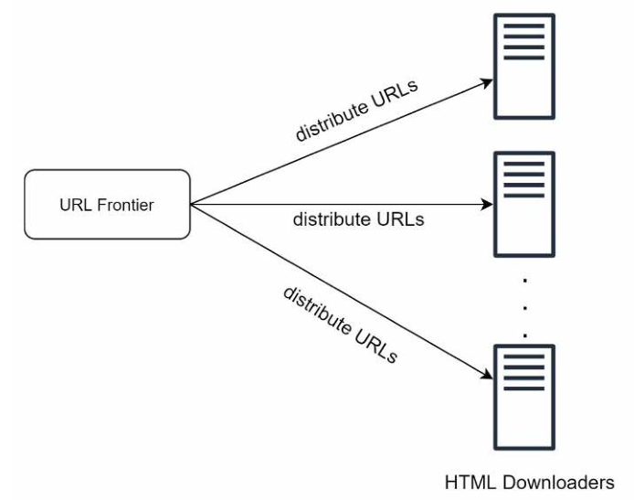

   ​																图 9-9

2. ##### 缓存 DNS 解析器

   DNS 解析器是爬虫的一个瓶颈，因为由于许多 DNS 接口的同步性质，DNS 请求可能需要时间。DNS 响应时间从 10ms 到 200ms 不等。一旦爬虫线程对 DNS 进行了请求，其他线程就会被阻断，直到第一个请求完成。维护我们的 DNS 缓存以避免频繁调用 DNS 是一种有效的速度优化技术。我们的 DNS 缓存保持域名到 IP 地址的映射，并通过 cron 作业定期更新。

3. ##### 本地化

   将爬虫服务器地理分布。当爬虫服务器靠近网站主机时，爬虫程序的下载时间更快。设计本地化适用于大多数系统组件：爬虫服务器、缓存、队列、存储等。

4. ##### 短暂超时

   有些网络服务器响应缓慢，或者根本不响应。为了避免漫长的等待时间，指定了一个最大的等待时间。如果一个主机在预定的时间内没有反应，爬虫将停止工作并抓取一些其他的网页。

### 健壮性

除了性能优化，健壮性也是一个重要的考虑因素。我们提出一些方法来提高系统的健壮性：
- 一致性哈希：这有助于在下载者之间分配负载。一个新的下载器服务器可以使用一致性哈希法添加或删除。更多细节请参考[第五章：设计一致性哈希](Design-Consistent-Hashing.md)。
- 保存抓取状态和数据：为了防止故障，爬行状态和数据被写入一个存储系统。通过加载保存的状态和数据，可以很容易地重新启动被破坏的爬行。
- 异常处理：在一个大规模的系统中，错误是不可避免的，而且很常见。爬虫必须优雅地处理异常，而不会使系统崩溃。
- 数据验证：这是防止系统错误的一个重要措施。

### 拓展性

由于几乎每个系统都在不断发展，设计目标之一是使系统足够灵活，以支持新的内容类型。抓取器可以通过插入新的模块来扩展。图 9-10 显示了如何添加新模块。

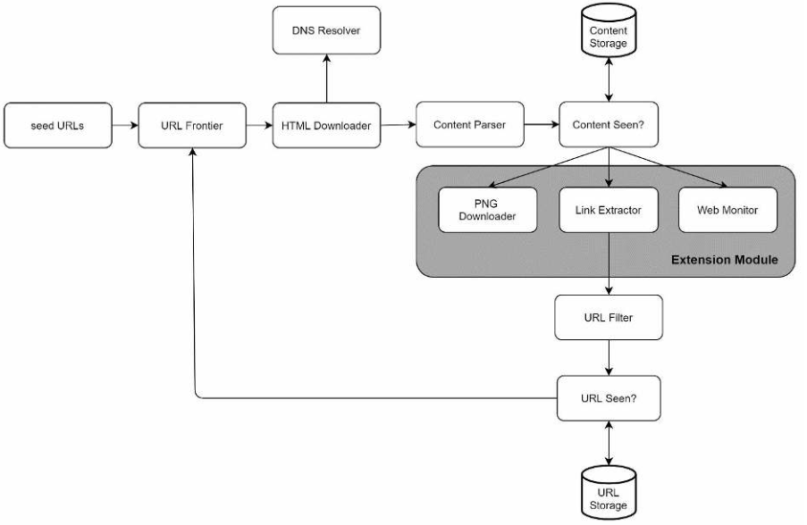

​																图 9-10

- PNG 下载器模块用于下载PNG文件，是一个插件化的。
- 增加了网络监控模块，以监控网络，防止版权和商标侵权。

### 检测并避免有问题的内容

本节讨论了检测和预防冗余、无意义或有害内容的问题。

1. #### 冗余的内容

  如前所述，近 30% 的网页是重复的。哈希值或校验和有助于检测重复内容[11](Burton Bloom. Space/time trade-offs in hash coding with allowable errors.Communications of the ACM, 13(7), pages 422--426, July 1970.[)。

2. #### 蜘蛛陷阱（Spider traps）

  蜘蛛陷阱是一个导致爬虫处于无限循环的网页。例如，一个无限深的目录结构被列举如下：
  www.spidertrapexample.com/foo/bar/foo/bar/foo/bar/...

  这种蜘蛛陷阱可以通过为 URLs 设置最大长度来避免。然而，没有一个放之四海而皆准的解决方案来检测蜘蛛陷阱。含有蜘蛛陷阱的网站很容易被识别，因为在这类网站上发现的网页数量异常多。很难开发出避免蜘蛛陷阱的自动算法；然而，用户可以手动验证和识别蜘蛛陷阱，并将这些网站从爬虫中排除，或应用一些定制的 URL 过滤器。

3. #### 数据噪音

  有些内容几乎没有价值，如广告、代码片段、垃圾网址等。这些内容对爬虫没有用处，如果可能的话，应该被排除。

## 总结

在这一章中，我们首先讨论了一个好的爬虫的特征：可扩展性、礼貌性和健壮性。然后，我们提出了一个设计方案，并讨论了关键的组成部分。建立一个可扩展的网络爬虫并不是一件小事，因为网络是非常大的，而且充满了陷阱。尽管我们已经涵盖了许多主题，但我们仍然错过了许多相关的话题：
- 服务器端渲染：众多网站使用 JavaScript、AJAX 等脚本来产生链接。如果我们直接下载和解析网页，我们将无法检索动态生成的链接。为了解决这个问题，我们在解析网页之前先进行[服务器端的渲染（也叫动态渲染）](https://developers.google.com/search/docs/guides/dynamic-rendering)。

  > 这点可以通过可以执行 Javascript 的组件，如 [Selenium](https://www.selenium.dev/)

- 过滤掉不需要的页面：在有限的存储容量和抓取资源下，反垃圾邮件组件有利于过滤掉低质量和垃圾邮件的页面[13](T. Urvoy, T. Lavergne, and P. Filoche, "Tracking web spam with hidden stylesimilarity," in Proceedings of the 2nd International Workshop on Adversarial Information
  Retrieval on the Web, 2006.[) [14](H.-T. Lee, D. Leonard, X. Wang, and D. Loguinov, "IRLbot: Scaling to 6 billion pagesand beyond," in Proceedings of the 17th International World Wide Web Conference, 2008.[)。

- 数据库复制和分片：复制和分片等技术被用来提高数据层的可用性、可扩展性和可靠性。

- 横向扩展：对于大规模的抓取，需要数百甚至数千台服务器来执行下载任务。关键是要保持服务器的无状态。

- 可用性、一致性和可靠性：这些概念是任何大型系统成功的核心。我们在第1章中详细讨论了这些概念。刷新你对这些主题的记忆。

- 分析：收集和分析数据是任何系统的重要组成部分，因为数据是进行微调的关键成分。


