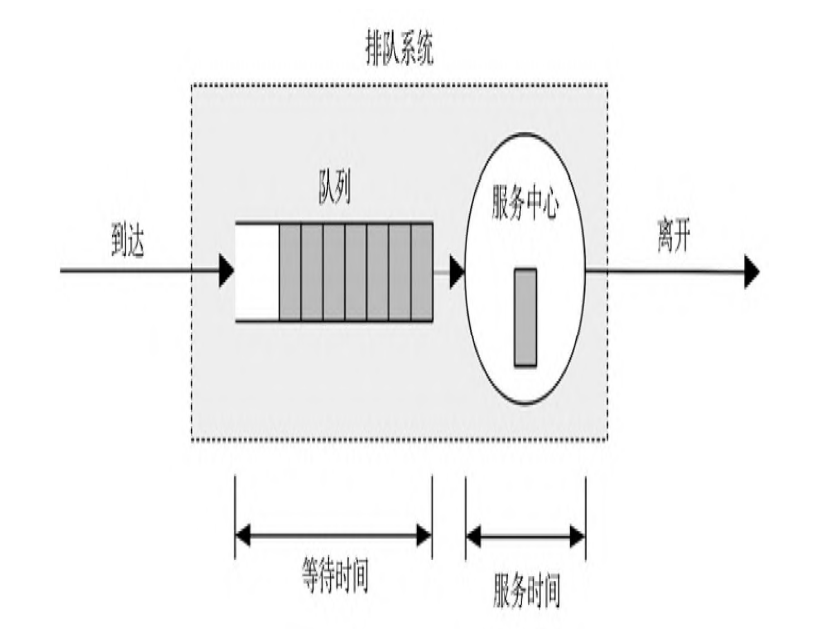
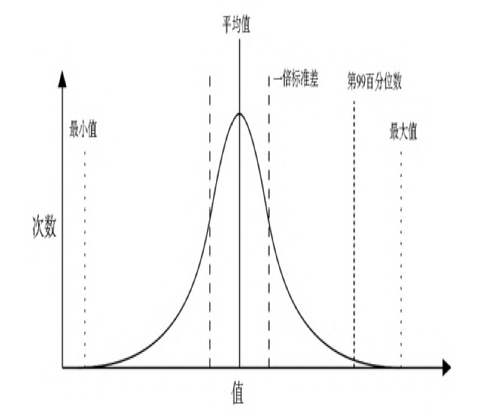
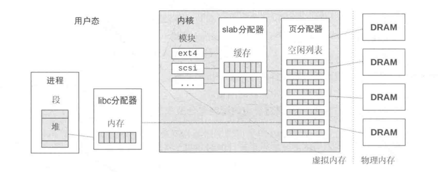
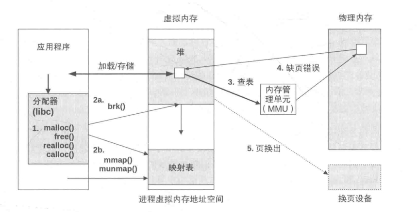
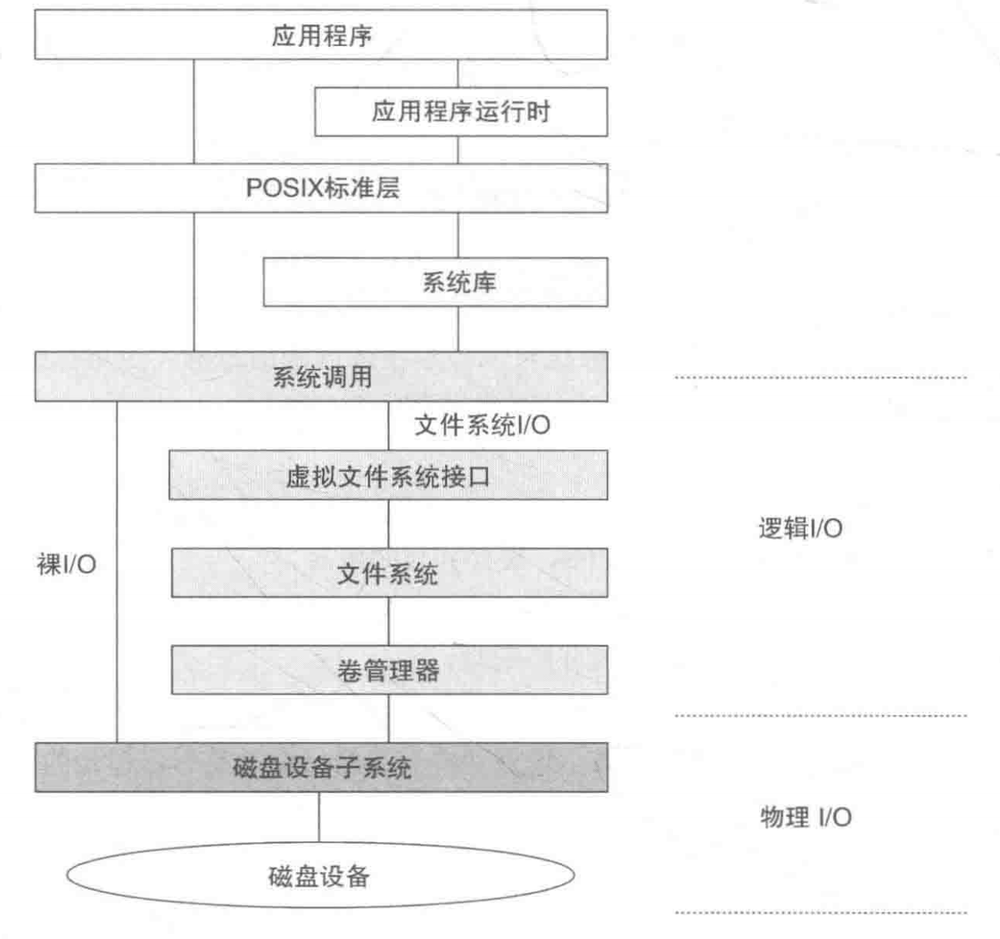
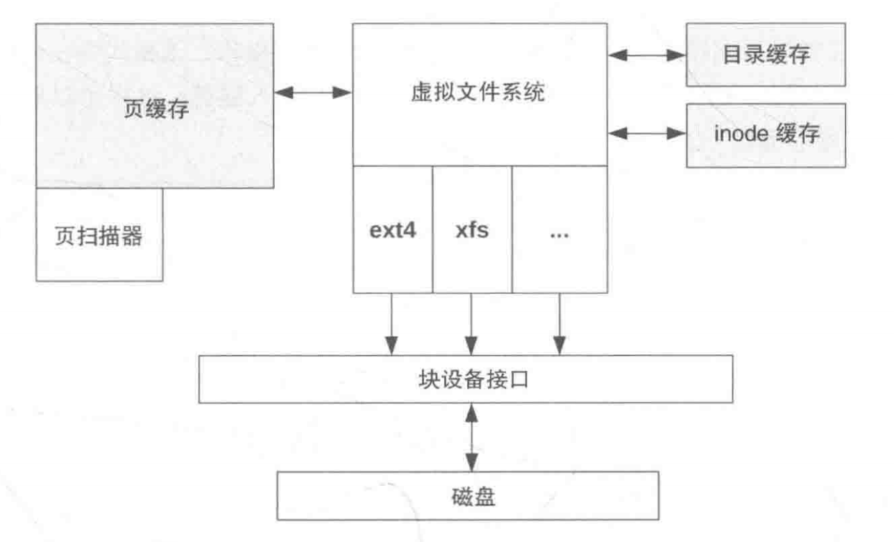
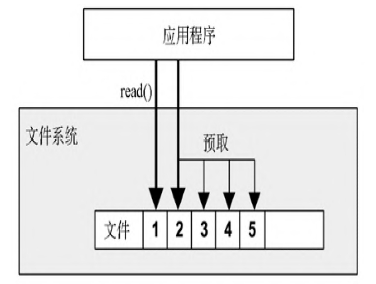
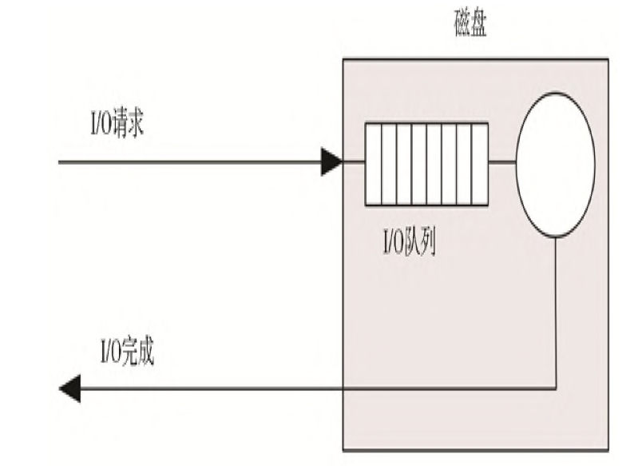
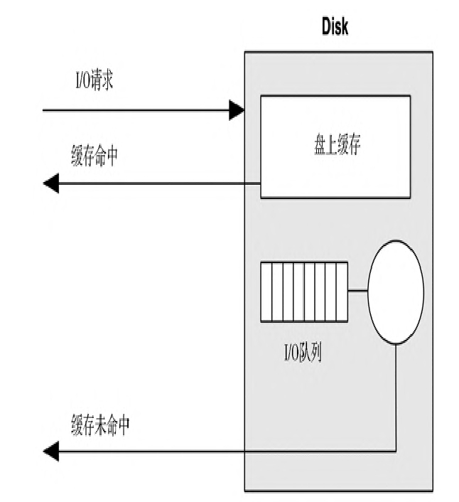
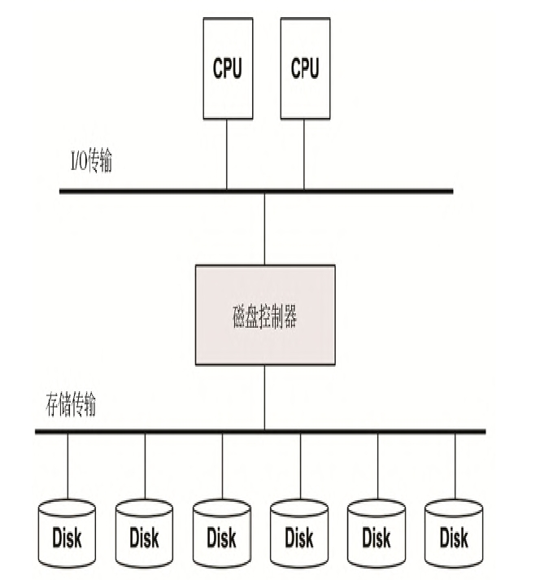

## 性能分析的 **USE** 方法

简而言之，**USE（utilization、saturation、errors）**就是对所有的资源，查询它的使用率、饱和度和错误。

- **资源**：所有服务器物理元器件（CPU、总线...）。依赖的软件也都包括算内，提供有用的指标。
- **使用率**：在规定的时间范围内，资源用于服务工作的时间百分比。
- **饱和度**：资源不能再服务更多额外的工作的程度，通常指等待队列。
- **错误**：错误事件的个数。

## 5 Why

在分析问题的时候，要用到**”5 Why“**的技巧：问自己”为什么“，然后作答，以此重复5遍。以下是一个例子：

1. 查询多了数据库性能就开始变差。为什么？
2. 由于内存换页磁盘I/O延时。为什么？
3. 数据库内存用量变得太大了。为什么？
4. 分配器消耗的内存比应该用的多。为什么？
5. 分配器存在内存碎片问题。为什么？

## 排队系统的性能分析

Little's 定律可以体现：
$$
L = λW
$$
L = 系统请求的平均数目。

λ = 平均到达速率。

W = 平均服务时间。

一个排队系统的模型如下：



## 微基准测试

对于未来的系统，可以用微基准测试或者负载生成工具在测试环境里仿真要施加的请求，同时测量资源的使用情况。给予充足的客户负载，你能够通过实验的方式找到极限。要监视的资源如下：

- **硬件**：CPU 使用率、内存使用、磁盘IOPS、磁盘吞吐量、磁盘容量（使用率）、网络吞吐量。
- **软件**：虚拟内存使用情况、进程/任务/线程、文件描述符。

比如，你现在正在看的系统当前每秒执行 1000 个请求。最繁忙的资源是 16 个CPU，平均使用率是40%，你预测当CPU处于100%使用情况时会成为工作负载的瓶颈。问题就变成了：在那时每秒的请求率是多少？

> 每个请求的 CPU% = 总的 CPU% / 请求总数 = 16 x 40% / 1000 = 每个请求消耗 0.64% CPU。
>
> 每秒请求最大值 = 100% x 16 CPU / 每个请求消耗的 CPU% = 1600 / 0.64 = 每秒 2500 个请求。

## 统计数据

### 平均值

在性能分析的时候，我们在采集数据时会经常用到平均值作为性能参考点。平均值也分多种计算方式，它们都适合不同的测量场景：

- 几何平均值，是数值乘积的 n 次方根（n 是数值的个数）。

- 调和平均值，是数值的个数除以所有数值的倒数之和。

  例如，计算传输800 MB 数据的平均速率，当第一个100 MB 以50 MB/s 传输，剩下的700MB按10 MB/s 的门限传输时，答案是采用调和平均值，800/(100/50 + 700/10) = 11.1MB/s。

- 随着时间变化的平均值，在性能度量中，很多我们研究的指标都是随着时间变化的平均值。

- 衰退均值，衰退均值偶尔会在系统性能中使用。

### 标准方差、百分位数、中位数

**标准方差**和**百分位数**（例如，第99百分位数）是提供分布数据信息的统计技术。**标准方差度量的是数据的离散程度**，更大的数值表示着数据偏离均值（算术平均值）的程度越大。第99百分位数显示的是该点在分布上包含了99%的数值。

**中位数**就是第50百分位数，用以显示数据的大部分分布在哪。



## CPU

### 时钟频率

每个 CPU 指令都可能会花费一个或者多个**时钟周期**（称为CPU 周期）来执行。CPU 以一个特定的时钟频率执行，例如，一个 5GHz 的 CPU 每秒运行五十亿个时钟周期。

更快的时钟频率并不一定会提高性能——它取决于快速 CPU 周期里到底在做些什么。如果它们大部分时间是停滞等待内存访问，那更快的执行实际上并不能提高 CPU 指令的执行效能或者负载吞吐量。

### 指令执行

CPU 执行指令步骤：

- 取指
- 译码/解码
- 执行
- 内存访问
- 寄存器写回

上面的每一步都只至少需要一个时钟周期。内存访问时最慢的，通常需要几十个周期执行。在这个期间 CPU 会陷入停滞状态，这称为停滞周期。这也是 CPU 缓存如何重要的原因，极大的缩短了时钟周期。

> 关于指令执行过程和流水线设计可见：[处理器架构](https://github.com/MarsonShine/Books/blob/master/CSAPP/docs/processor-architecture.md)

### 指令宽度

**指令宽度**描述了同时处理的目标指令数量。现代处理器一般为宽度 3 或者宽度 4，意味着它们可以在**每个周期里最多完成 3～4 个指令**。如何取得这个结果取决于处理器本身，每个环节都有不同数量的功能单元处理指令。

### CPI/IPC

每指令周期数（CPI）：每执行一个指令需要多少个时钟周期数。这个指标同样可以用 IPC 表示；

每周期指令数（PIC）：每个周期执行了多少个指令数。

CPI 越高表示 CPU 停滞周期就越长，问题点就很有可能发生在内存访问上。CPI 越低就说明停滞周期就越短，吞吐量就越大。

### 字长

处理器是围绕最大字长设计的——32 位或者64 位——这是整数大小和寄存器宽度。**字长也普遍使用，表示地址空间大小和数据通路宽度（有时也称为位宽）**，取决于不同的处理器实现。

更宽的字长意味着更好的性能。但更宽的字长可能会在某些数据类型下因未使用的位而导致额外的内存开销（如内存对齐）。数据的大小也会因为指针大小的增加而增加，导致需要更多的内存 I/O。

### 绑定 CPU

我们可以通过 `taskset` 给指定的进程绑定运行的 CPU（CPU 亲和性），这样可以通过提高缓存温度和内存本地性来提高性能。

```
taskset -pc 7-10 10790
```

上面的设置限定了 PID 为 10790 的进程只能跑在 CPU 7 到 CPU 10之间。

### 独占 CPU 组

Linux 提供了 CPU 组，允许编组 CPU 并为其分配进程。这和进程绑定类似，可以提高性能，但还可以通过使得 CPU 组独占 —— 不允许其他进程使用，进一步提高性能。这种权衡另一方面减少了系统其他部分的可用 CPU 数量。

具体步骤如下：

```
1. mkdir /dev/cpuset
2. mount -t cpuset cpuset /dev/cpuset
3. cd /dev/cpuset/
4. mkdir prodset			# 创建一个名为 “prodset” 的 cpu 组
5. cd prodset
6. echo 7-10 > cpus			# 分配 CPU7-10
7. echo 1 > cpu_exclusive	# 设置 cpu 组 prodset 互斥
8. echo 1559 > tasks		# 将进程 1159 分配给 prodset
```

### CPU 分析

CPU分析工具详见：[性能分析工具](performance-analysis-tool.md)

## 内存

进程的地址空间是由虚拟内存子系统映射到内存主存和物理交换设备。内核会按需在它们之间移动内存页，这个过程称作**交换**。它允许内核超额订购主内存。

内存分配器：



### 换页

换页是将页面换入和调出主存，即**在主存与存储设备间交换页**。它们分别被称为页面换入和页面换出。它允许：

- 运行部分载入的程序
- 运行大于主存的程序
- 高效地在主存和存储设备间迁移

虚拟内存换页分为两种类型：文件系统换页和匿名换页。

内存页的生命周期流程图：



### 交换

交换是在主存与物理交换设备或者交换文件（文件系统文件）之间移动整个进程。

交换出一个进程，要求进程的所有私有数据必须被写入交换设备，包括线程结构和进程堆（匿名数据）。

交换严重影响性能，因为已交换出的进程需要许多磁盘 I/O 才能重新运行。

> Linux 系统完全不交换进程而仅仅依赖于换页。Linux 中交换这个术语特指换页到交换文件或者设备（匿名换页）。

### 内存访问延时

主内存的访问时间可以用 CAS（列地址控制器）计量：**从发送需要读取的地址（列）给一个内存模块，到数据可以被读取之间的时间**。这个数值取决于内存的类型（DDR3 大约是 10ns）。对于内存I/O 传输，内存总线（例如64b 宽）为了传输一个缓存行（例如64B 宽）会发生多次此类延时。CPU 和 MMU 读取新数据时也可能涉及其他延时。

### 总线

物理上主存如何连接系统取决于主存架构。实际的实现可能会涉及额外的CPU与内存之间的控制器和总线。

总线访问的方式也有不同，对应速度也有快慢。

- **共享系统总线**：单个或多个处理器，通过一个共享的系统总线、一个内存桥控制器以及内存总线。
- **直连**：单个处理器通过内存总线直接连接内存。
- **互联**：多处理器中的每一个通过一条内存总线与各自的内存直连，并且处理器之间通过一个 CPU 互联连接起来。

### DDR SDRAM

对于任何架构，内存总线速度常常取决于处理器和主板支持的**内存接口标准**。现今一个通用的标准是**双倍速率同步动态随机访问内存（DDR SDRAM）**

> **双倍数据速率**指在时钟信号的上升沿和下降沿都传输数据（也称作双泵）。
>
> **同步**指内存的时钟与CPU同步。

也就是平常电脑主存显示的 DDR3/DDR4 这几类内存接口标准。

#### 多通道

**系统架构可能支持并行使用多个内存总线来增加带宽**。常见的倍数为双、三或者四通道。例如，Intel Core i7 处理器支持最大四通道 DDR3-1600，其最大内存带宽为 51.2GB/s。

> Intel Core i7支持四通道DDR3-1600,最大内存带宽51.2GB/s的计算方式如下:
>
> 内存带宽计算公式：带宽 = 内存核心频率 × 倍增系数 × ( 内存总线位数 / 8 )。
>
> 通用的计算公式：带宽 ＝ 频率 * 位宽／8。
>
> 我们可以从厂家的内存规格中得知 DDR3 1600 的内存物理频率是 200MHz，预读 8bit。
>
> 那么根据公式我们可以得知 DDR3-1600 单通道：200MHz × 8 × 64/8 = 12.8 GB/s，那么四通道就是 51.2GB/s
>
> 参考资料：[内存条带宽的换算方法、DDR4内存理论带宽以及目前的内存标准（JEDEC标准及XMP标准） - 知乎 (zhihu.com)](https://zhuanlan.zhihu.com/p/443104177)

## 文件系统

首先来看下从应用程序到底层磁盘设备的整条 IO 路径：



其中的文件系统的访问接口称为虚拟文件系统层（VFS），这是一套通用的内核接口。可以用同样的系统调用对接不同的文件系统实现，这样就可以很容易添加新的文件系统支持。如该接口提供的 `read`、`write`、`open`、`close` 等方法，这些操作最终会映射到具体的文件系统中对应的实现函数。

### 文件系统延时

**文件系统延时**指的是一个文件系统逻辑请求从开始到结束的时间。它包括了消耗在文件系统、内核磁盘 I/O 子系统以及等待磁盘设备——物理 I/O 的时间。应用程序的线程通常在请求时阻塞，等待文件系统请求的结束。这种情况下，文件系统的延时与应用程序的性能有着直接和成正比的关系。

### 缓存

文件系统使用**缓存（cacheing）**提高读性能，而用**缓冲（buffering）**提高写性能。



文件系统缓存又包括如下几部分：

- 页缓存：虚拟内存页，包括文件的内容，以及 I/O 缓冲的信息，该缓冲主要作用就是提高文件性能和目录 I/O 性能。
- inode 缓存：inode（文件索引节点）是文件系统用来描述所存对象的一个数据结构。VFS 层有一个通用版本的 inode，Linux 维护这个缓存，是因为检查权限以及读取其它元数据的时候，由于频繁访问，缓存可以提高性能。
- 目录缓存：也叫 dcache，这个缓存包括目录元素名到 VFS inode 之间的映射信息，以提高查找文件的速度。

### 随机/顺序IO

**顺序IO**是指每个 I/O 都开始于上一个 I/O 的结束偏移位置。**随机IO**则找不到这种关系，偏移量是随机变化的。

由于存储设备的某些性能特征的缘故，**文件系统一直以来在磁盘上顺序和连续地存放文件数据**，以努力减小随机I/O的数目。当文件系统未能达成这个目标时，文件的摆放变得杂乱无章，顺序的逻辑I/O 被分解成随机的物理I/O，这种情况我们称为**碎片化**。

顺序IO可以通过**预读/预取**，执行效率要比随机IO快很多。因为顺序IO存在多种优化手段

### 预取

在进行文件读取时，往往数据量非常大，不好一次性将数据加载缓存里。这种情况下就会导致缓存命中率降低（因为缓存策略），性能下降。

在这种情况下**预取**就可以缓解这个问题。通常做法是：

通过检查当前和上一个 I/O 的文件偏移量，可以检测出当前是否是顺序读负载，并且做出预测，在**应用程序请求前向磁盘发出读命令，以填充文件系统缓存**。这样如果应用程序真的发出了读请求，就会命中缓存（需要的数据已经在缓存里）。举个例子：

1. 一个应用程序对某个文件调用 `read()`，把控制权交给内核。
2. 文件系统发起磁盘读请求。
3. 将上一次文件偏移量指针和当前地址进行比对，如果发现是顺序的，文件系统就会发起额外的读请求。
4. 第一次的读取结束返回，内核把数据和控制权交还给应用程序。
5. 额外的读请求也结束返回，并填进缓存，以备将来应用程序的读取。

过程如下图所示：



### 写回缓存

**写回缓存**表示当应用程序的数据写入主存后，就认为写入成功并立即返回，这样会提高性能。之后再异步的将主存的数据刷新到磁盘中。再刷新数据的期间，数据是可靠的。主存会在断电的情况下丢失数据，这就会导致应用程序数据不一致的问题。举个例子：

1. 应用程序发起一个文件的 `write()` 请求，把控制权交给内核。
2. 数据从应用程序地址空间复制到内核空间。
3. `write()` 系统调用被内核视为已经结束，并把控制权交还给应用程序。
4. 一段时间后，一个异步的内核任务定位到要写入的数据，并发起磁盘的写请求。

### 裸IO和直接IO

**裸IO**和**直接IO**都是用于提高磁盘IO性能的技术手段。

裸IO指的是：

- 绕过文件系统缓存，直接对磁盘进行读写操作。
- 减少内存复制，提高IO处理效率。
- 适用于需要高速连续读写的场景，如多媒体处理。

直接IO指的是

- 绕过页缓存（Page Cache），直接在应用程序和磁盘设备之间传输数据。
- 避免不必要的内存复制，减少上下文切换。
- 需要以对齐的块形式读写，适用于大规模顺序IO。

> 请注意，直接IO有对齐要求。
>
> - 直接IO要跳过页缓存，所以这需要按照页大小对齐，才能实现。页大小一般为 4KB，所以 IO 请求大小和偏移量需要以 4KB 对齐。
> - 直接IO是通过 DMA（直接内存访问）方式传输数据的，DMA 也要求数据对齐。如果不对齐，需要额外的中断来处理不连续的内存，会降低效率。

### 逻辑IO和物理IO

逻辑IO:

- 是应用程序请求的IO操作。

- 指应用程序的读写请求及大小。

- 与应用程序的访问方式相关。

物理IO:

- 是实际发生在磁盘上的IO传输。 

- 指磁盘完成的实际数据传输量。

- 与磁盘的参数相关,如扇区大小、磁头移动等。

两者的区别在于:

- 逻辑IO面向应用程序,物理IO面向磁盘。

- 逻辑IO操作次数可能会被合并或拆分为多个物理IO。

- 逻辑IO大小可能会被 padded 至物理IO的整数倍。

  > 假设磁盘以扇区(通常512字节)为物理IO读写单位，但是应用程序的逻辑IO大小可以是任意字节数。如果逻辑IO大小不是扇区大小的整数倍,那么在物理IO时,磁盘会读写额外的字节,将IO大小 padding 至扇区大小的整数倍。举个例子：
  >
  > 4. 例如逻辑IO为100字节,少于512字节扇区,那么物理IO会读写一个完整扇区,磁盘实际传输是512字节。
  >
  > 5. 如果逻辑IO为520字节,大于扇区大小,物理IO会读写两个扇区,传输1024字节。
  >
  > 6. 所以物理IO大小是逻辑IO大小的天花板取整。多出的字节是 padding。
  >
  > 7. padding 会增加额外的磁盘开销,降低效率。
  >
  > 所以对齐逻辑IO大小可以避免 padding,提高磁盘IO效率。

- 逻辑IO顺序可能会被重排,进行物理IO优化。

- 物理IO次数通常会大于逻辑IO次数。

- 逻辑IO代表应用需求,物理IO代表实际磁盘工作量。

综上,逻辑IO和物理IO表示的不同抽象层次,合理分析两者差异很重要。

### 内存映射文件

还可以通过**内存映射文件**的方式，将文件映射到进程地址空间，并直接取内存地址的方法来提高文件系统I/O性能。

这样就可以避免调用 `read()` 和 `write()` 存取文件数据时产生的系统调用和上下文切换开销。**如果内核支持直接复制文件数据缓冲到进程地址空间，那么还能避免复制数据两次。**

内存映射通过系统调用 `mmap()` 创建，通过 `munmap()` 销毁，还可以通过 `madvise()` 调整。

### 目录项缓存

**目录项缓存（Dcache）**记录了从目录项（struct dentry）到 VFS inode 的映射关系。它提高了路径名查找（例如通过open()）的性能：当遍历一个路径名时，查找其中每一个名字都可以先检查 Dcache，直接得到 inode 的映射，而不用到目录里一项项地翻查。Dcache 中的缓存项存在一张哈希表里，以进行快速的、可扩展的查找（以父目录项加上目录项名作为键值）。

inode 对象也是会缓存的，称为 **inode 缓存**。

### 内存分析

#### /proc/meminfo

Linux 的 `/proc/meminfo` 文件提供了内存使用状况的分解，如 `free` 的一些工具也读这个文件，它包括了缓冲区高速缓存（Buffers）和页缓存（Cached）等其它系统内存的使用情况。

内存分析工具详见：[性能分析工具](performance-analysis-tool.md)

## 磁盘

### 磁盘模型

一个带队列的简单磁盘模型图：



这里的消费算法有多种：旋转磁盘的电梯寻道算法、读写IO分开处理的算法等。

带有缓存模型的结构图：



### 磁盘控制器

把 CPU **I/O 传输总线**和**存储总线**以及相连的**磁盘设备**桥接起来的就叫**磁盘控制器**，结构图如下：



### 随机IO/顺序IO

随机 I/O 带来的**磁头寻道**和 I/O 之间的**盘片旋转**导致额外的延时。那么调优工作就是要尽量的识别并排除随机IO，例如缓存、分离随机 I/O 到不同的磁盘，以及以减少寻道距离为目的的数据摆放。

### 读写占比

理清这个读写占比对于优化很重要，一个**读频率较高的系统**可以通过**增加缓存**来获得性能提升，而**一个写频率较高的系统**则可以通过**增加磁盘**来提高最大吞吐量和IOPS。并且读请求可能是随机的，而写请求可能是连续的。

### 磁性旋转盘（硬盘驱动器，HDD）

磁性旋转盘由一个磁臂、磁头、盘片组成。读写数据通过**寻道**和**旋转**这里先决操作。

磁性旋转磁盘的慢 I/O 通常由**磁头寻道时间**和**盘片旋转时间**构成，这二者通常需要花费数毫秒。最好的情况是下一个请求的 I/O 正好位于当前服务 I/O 的结束位置，这样，磁头就不需要寻道或者额外等待盘片旋转。这就是**连续 I/O**，而需要磁头寻道或者等待盘片旋转的 I/O 被称为**随机 I/O**。

### 磁盘缓存

磁盘上有一个共有的小部件，是一个缓冲区内存（RAM），用来缓存读取结果和缓冲写入的数据。这块内存还允许 I/O（命令）在设备上排队，以更高效的方式重新排序。

### 电梯寻道

电梯算法（又名电梯寻道）是提高命令队列效率的一种方式。**它根据磁盘位置把 I/O 重新排序，最小化磁头的移动**。结果类似大楼的电梯，不根据楼层请求的顺序提供服务，而是在大楼里上上下下扫一遍，并在当前请求的楼层停靠。

### 虚拟磁盘下的100%使用率和 IO 等待

对于基于硬件的虚拟磁盘（如磁盘控制器），操作系统可能只知道虚拟磁盘的使用率，但是不清楚虚拟磁盘底下的物理磁盘的使用率。所以这在某些情况下的结果会导致很大的误差。

- 写回缓存的虚拟磁盘可能在写负载的时候看上去并不是很忙，因为磁盘控制器马上返回了写完成。但是底下的磁盘可能在之后的某个时间会很忙。
- 一块100%占用的虚拟磁盘是建立在多块物理磁盘之上的，可能还可以接受更多的工作。在这种情况下，100%可能意味着有些磁盘一直都很忙，但并不是所有的磁盘在所有的时间内都忙，有一些磁盘仍然有空闲时间。

而 IO 等待指标是因为这个指标含义本身很模糊，不同类型的等待含义不同。

- 等待时间不能全部反映 IO 性能。
  - 等待时间长,可能是因为I/O量大,但吞吐量也高。
  - 等待时间短,可能是因为I/O量小,但不代表吞吐量高。
- 不同类型的等待含义不同。
  - 用户I/O等待反映应用程序等待（与软件应用程序有关，而与磁盘本身无关系）。
  - 系统I/O等待反映内核等待。

I/O等待指标并不能准确反映磁盘子系统的性能,它会受到CPU调度、应用程序效率等其它因素的影响。需要结合各项指标才能进行全面的系统诊断。