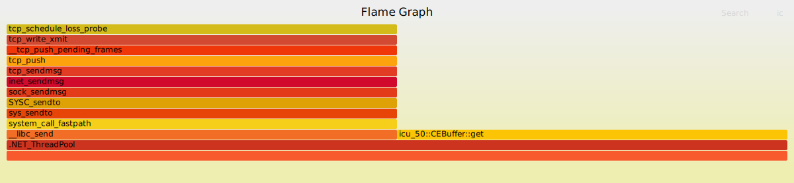

# 性能分析工具

| Linux       | Solaris | 描述                          |
| ----------- | ------- | ----------------------------- |
| uptime      | uptime  | 平均负载                      |
| vmstat      | vmstat  | 包括系统范围的平均负载        |
| mpstat      | mpstat  | 单个CPU统计信息               |
| sar         | sar     | 历史统计信息                  |
| ps          | ps      | 进程状态                      |
| top         | prstat  | 监控每个进程/线程CPU用量      |
| pidstat     | prstat  | 每个进程/线程CPU用量分解      |
| time        | ptime   | 给一个命令计时，带CPU用量分解 |
| DTrace/perf | DTrace  | CPU剖析和跟踪                 |
| perf        | cpustat | CPU性能计数器分析             |

> 提示：
>
> 要想知道每个工具返回的各项参数含义，可以执行：man tool。这里面含有每个项代表的意思。

## uptime

```
[root ~]# uptime
 10:39:57 up 254 days,  8:53,  2 users,  load average: 0.00, 0.01, 0.05
```

这是 `uptime` 命令的执行结果，它提供了关于系统运行时间、当前用户数、负载平均值等的信息。下面是对每个字段的解释：

- `up 254 days`：这表示系统已经连续运行了 254 天。
- `8:53`：这是当前的系统时间。
- `2 users`：这表示当前有 2 个用户登录到系统中。
- `load average: 0.00, 0.01, 0.05`：这表示系统的负载平均值有三个值，分别是 0.00、0.01 和 0.05。负载平均值是指在一段时间内，平均有多少个进程在等待 CPU 资源。这些值的具体含义需要根据上下文来确定，但通常情况下，它们代表了过去一分钟内、五分钟内和十五分钟内的平均负载情况。

## vmstat

```
[root ~]# vmstat 1 3
procs -----------memory---------- ---swap-- -----io---- -system-- ------cpu-----
 r  b   swpd   free   buff  cache   si   so    bi    bo   in   cs us sy id wa st
 1  0      0 3922172   2108 10658816    0    0     0     0    0    0  0  0 100  0  0
 0  0      0 3920092   2108 10658824    0    0     0     0 1138  672  1  1 98  0  0
 0  0      0 3920888   2108 10658824    0    0     0    36  617  458  0  0 99  0  0
```

这是 `vmstat` 命令的输出结果，各项含义如下：

- `procs`: 显示进程相关信息。
- `memory`: 显示内存相关信息。
- `swap`: 显示交换分区相关信息。
- `io`: 显示输入/输出设备相关信息。
- `system`: 显示系统相关信息。
- `cpu`: 显示 CPU 相关信息。

以第一行数据为例解释各项的含义：

- `r`: 运行队列中的进程数，即正在运行或等待 CPU 的进程数。
- `b`: 不可中断的睡眠进程数，即在等待某个事件（如 I/O）时进入睡眠状态的进程数。
- `swpd`: 使用的虚拟内存量，包括已使用的和未使用的。
- `free`: 可用的空闲内存量。
- `buff`: 用作缓冲的内存量。
- `cache`: 用作缓存的内存量。
- `si`: 从磁盘读取的块数。
- `so`: 写入磁盘的块数。
- `bi`: 从块设备读取的块数。
- `bo`: 写入块设备的块数。
- `in`: 每秒中断次数。
- `cs`: 每秒上下文切换次数。
- `us`: 用户空间占用的 CPU 时间百分比。
- `sy`: 内核空间占用的 CPU 时间百分比。
- `id`: 空闲 CPU 时间的百分比。
- `wa`: 由于等待 I/O 而暂停的时间百分比。
- `st`: 被虚拟机偷走的 CPU 时间的百分比。

上面这些数值，除了 r 列代表所有等待的加上正在运行的线程总数，其它的都是平均数。

## mpstat

多处理器统计信息工具，能报告每个 CPU 的统计信息。

```
[root ~]# mpstat -P ALL 1 1
Linux 3.10.0-693.el7.x86_64  2023年09月18日  _x86_64_        (8 CPU)

15时54分15秒  CPU    %usr   %nice    %sys %iowait    %irq   %soft  %steal  %guest  %gnice   %idle
15时54分16秒  all    0.25    0.00    0.38    0.00    0.00    0.00    0.00    0.00    0.00   99.37
15时54分16秒    0    0.00    0.00    0.00    0.00    0.00    0.00    0.00    0.00    0.00  100.00
15时54分16秒    1    1.00    0.00    1.00    0.00    0.00    0.00    0.00    0.00    0.00   98.00
15时54分16秒    2    0.99    0.00    0.00    0.00    0.00    0.00    0.00    0.00    0.00   99.01
15时54分16秒    3    0.00    0.00    0.00    0.00    0.00    0.00    0.00    0.00    0.00  100.00
15时54分16秒    4    0.00    0.00    0.00    0.00    0.00    0.00    0.00    0.00    0.00  100.00
15时54分16秒    5    1.00    0.00    1.00    0.00    0.00    0.00    0.00    0.00    0.00   98.00
15时54分16秒    6    0.00    0.00    0.00    0.00    0.00    0.00    0.00    0.00    0.00  100.00
15时54分16秒    7    0.00    0.00    0.00    0.00    0.00    0.00    0.00    0.00    0.00  100.00

平均时间:  CPU    %usr   %nice    %sys %iowait    %irq   %soft  %steal  %guest  %gnice   %idle
平均时间:  all    0.25    0.00    0.38    0.00    0.00    0.00    0.00    0.00    0.00   99.37
平均时间:    0    0.00    0.00    0.00    0.00    0.00    0.00    0.00    0.00    0.00  100.00
平均时间:    1    1.00    0.00    1.00    0.00    0.00    0.00    0.00    0.00    0.00   98.00
平均时间:    2    0.99    0.00    0.00    0.00    0.00    0.00    0.00    0.00    0.00   99.01
平均时间:    3    0.00    0.00    0.00    0.00    0.00    0.00    0.00    0.00    0.00  100.00
平均时间:    4    0.00    0.00    0.00    0.00    0.00    0.00    0.00    0.00    0.00  100.00
平均时间:    5    1.00    0.00    1.00    0.00    0.00    0.00    0.00    0.00    0.00   98.00
平均时间:    6    0.00    0.00    0.00    0.00    0.00    0.00    0.00    0.00    0.00  100.00
平均时间:    7    0.00    0.00    0.00    0.00    0.00    0.00    0.00    0.00    0.00  100.00
```

这是 `mpstat` 命令的输出结果。选项 `-P ALL` 用来打印每个 CPU 的报告。`mpstat` 默认只打印系统级别的总结信息（所有）。各项含义如下：

- `CPU`：逻辑CPU ID，或者all 表示总结信息。
- `%usr`：用户态时间。
- `%nice`：以 nice 优先级运行的进程用户态时间
- `%sys`：系统态时间（内核）。
- `%iowait`：I/O 等待。
- `%irq`：硬件中断 CPU 用量。
- `%soft`：软件中断 CPU 用量。
- `%steal`：耗费在服务其他租户的时间。
- `%guest`：花在访客虚拟机的时间。
- `%idle`：空闲。

> nice 值通常范围为 -20~-1。默认为0；
>
> nice 值较小的进程，优先级较高，可获得更多 CPU 的时间。

## sar

系统活动报告器，可以用来观察当前的活动，以及配置用以归档和报告历史统计信息。

```
[root ~]# sar 1
Linux 3.10.0-693.el7.x86_64  2023年09月18日  _x86_64_        (8 CPU)

16时17分10秒     CPU     %user     %nice   %system   %iowait    %steal     %idle
16时17分11秒     all      0.50      0.00      0.25      0.00      0.00     99.25
16时17分12秒     all      0.50      0.00      0.38      0.00      0.00     99.12
16时17分13秒     all      0.63      0.00      0.75      0.00      0.00     98.62
16时17分14秒     all      0.25      0.00      0.38      0.00      0.00     99.37
```

还可以指定时间段的统计信息：

```
[root ~]# sar -u -s 16:00:00 -e 16:27:00
Linux 3.10.0-693.el7.x86_64  2023年09月18日  _x86_64_        (8 CPU)

16时00分01秒     CPU     %user     %nice   %system   %iowait    %steal     %idle
16时10分01秒     all      0.44      0.00      0.52      0.00      0.00     99.04
16时20分01秒     all      0.43      0.00      0.53      0.00      0.00     99.04
平均时间:     all      0.44      0.00      0.52      0.00      0.00     99.04
```

## ps

进程状态命令，列出了所有进程的细节信息，包括 CPU 用量统计信息。

```
[root ~]# ps aux
USER       PID %CPU %MEM    VSZ   RSS TTY      STAT START   TIME COMMAND
root         1  0.0  0.0 193700  6932 ?        Ss   1月07   2:49 /usr/lib/systemd/systemd --switched-root --system --deserialize 21
root         2  0.0  0.0      0     0 ?        S    1月07   0:10 [kthreadd]
root         3  0.0  0.0      0     0 ?        S    1月07   0:36 [ksoftirqd/0]
root         5  0.0  0.0      0     0 ?        S<   1月07   0:00 [kworker/0:0H]
root         7  0.0  0.0      0     0 ?        S    1月07   0:27 [migration/0]
```

上面的结果各项含义如下：

- `USER`: 当前用户的用户名。
- `PID`: 进程的ID号。
- `%CPU`: 进程使用的CPU百分比。
- `%MEM`: 进程使用的内存百分比。
- `VSZ`: 虚拟内存大小（以KB为单位）。
- `RSS`: 常驻内存集大小（以KB为单位）。
- `TTY`: 终端类型。
- `STAT`: 进程状态。
- `START`: 进程启动时间。
- `TIME`: CPU时间总计（以分钟为单位）。
- `COMMAND`: 进程的命令行。

## top

`top` 命令监控了运行得最多的进程，以一定间隔刷新屏幕。

```
top - 16:58:20 up 254 days, 15:11,  2 users,  load average: 0.00, 0.02, 0.05
Tasks: 162 total,   1 running, 161 sleeping,   0 stopped,   0 zombie
%Cpu(s):  0.4 us,  0.6 sy,  0.0 ni, 99.0 id,  0.0 wa,  0.0 hi,  0.0 si,  0.0 st
KiB Mem : 16267564 total,  3908164 free,  1686432 used, 10672968 buff/cache
KiB Swap:  8257532 total,  8257532 free,        0 used. 13901192 avail Mem 

  PID USER      PR  NI    VIRT    RES    SHR S  %CPU %MEM     TIME+ COMMAND                                                                                                    
 6884 root      20   0  146020   5656   4016 S   0.7  0.0   0:01.96 sshd                                                                                                       
    9 root      20   0       0      0      0 S   0.3  0.0  57:02.75 rcu_sched
```

上面的结果各项含义如下：

- `load average`: 0.00, 0.02, 0.05 : 1分钟、5分钟、15分钟内的平均负载,表示负载很低
- `Tasks: 162 total, 1 running, 161 sleeping, 0 stopped, 0 zombie`: 当前进程总数 162,运行 1 个,睡眠 161 个,停止 0 个,僵尸进程 0 个
- `%Cpu(s):  0.4 us,  0.6 sy,  0.0 ni, 99.0 id,  0.0 wa,  0.0 hi,  0.0 si,  0.0 st`: 
  - `us` 用户空间占用CPU百分比
  - `sy` 系统空间占用CPU百分比
  - `ni` 改变过优先级的进程占用 CPU 的百分比
  - `id` CPU 空闲时间百分比
  - `wa`（io wait）CPU 等待 IO 时间百分比
  - `hi`（hardware interrupt）CPU处理硬中断时间百分比
  - `si`（software interrupt）CPU处理软中断时间百分比
  - `st`（steal time）管理程序占用虚拟 CPU 时间百分比
- KiB Mem: 内存总量、空闲量、使用量、缓存量
- KiB Swap: 交换分区总量、空闲量、使用量
- `PID`: 进程ID
- `USER`: 进程owner
- `PR`: 进程优先级
- `NI`: nice值,越小优先级越高  
- `VIRT`: 进程占用的虚拟内存总量
- `RES`: 进程占用的物理内存大小
- `SHR`: 共享内存大小
- `S`: 进程状态(S sleeping, R running)
- `%CPU`:进程占用CPU百分比
- `%MEM`:进程占用内存百分比
- `TIME+`: 进程累计占用的CPU时间
- `COMMAND`: 进程名称

## pidstat

pidstat 工具按进程或线程打印 CPU 用量，包括用户态和系统态时间的分解。默认情况下，仅循环输出活动进程的信息。

```
[root ~]# pidstat 1
Linux 3.10.0-693.el7.x86_64  2023年09月19日  _x86_64_        (8 CPU)

11时48分31秒   UID       PID    %usr %system  %guest    %CPU   CPU  Command
11时48分32秒     0      3033    0.00    0.99    0.00    0.99     5  pidstat
11时48分32秒     0      6884    0.00    0.99    0.00    0.99     3  sshd
```

各项参数含义如下：

- `UID`: 进程的用户ID。
- `PID`: 进程的进程ID。
- `%usr`: 用户空间占用的百分比。
- `%system`: 任务在系统级(内核)执行时使用的 CPU 百分比。
- `%guest`: 任务在虚拟机(运行虚拟处理器)中占用的 CPU 百分比。
- `%CPU`: CPU使用率的百分比。
- `CPU`: 物理CPU的使用率。
- `Command`: 进程的命令名称。

## perf

Linux 性能计数器（Performance Counters for Linux，PCL），是一整套剖析和跟踪的工具，现名为 Linux 性能事件（Linux Performance Events，LPE）。

perf 有一系列的命令，具体可以执行 `man perf` 查看。

perf 可以分析以下场景

### 剖析

`perf record` 可以用来剖析 CPU 调用路径，对 CPU 时间如何消耗在内核和用户空间进行概括总结。该命令以一定时间间隔取样，并导出一个 perf.data 文件:

```
[root ~]# perf record -a -g -F 997 sleep 10
[ perf record: Woken up 10 times to write data ]
[ perf record: Captured and wrote 4.705 MB perf.data (31470 samples) ]
```

- `-a` 选项表示记录所有事件（包括 CPU 周期、缓存失效等）。
- `-g` 选项表示记录调用图（函数调用关系）
- `-F 997` 选项表示设置采样频率为每秒 997 次。
- `sleep 10` 是要执行的命令，即让进程休眠 10 秒钟。

然后使用 `report` 命令查看文件：

```
[root ~]# perf report --stdio

Samples: 31K of event 'cpu-clock', Event count (approx.): 31564693230                                                                                                          
# Children      Self  Command          Shared Object                 Symbol                                                      
# ........  ........  ...............  ............................  ............................................................
#
    97.77%     0.01%  swapper          [kernel.kallsyms]             [k] cpu_startup_entry
            |          
             --97.76%--cpu_startup_entry
                       |          
                        --97.70%--arch_cpu_idle
                                  |          
                                   --97.69%--default_idle
```

上述内容只是结果中的一小部分，展示了 CPU 开销的去处。

### 调度器延时

```
perf sched record sleep 10
```

查看延

```
perf sched latency
```

```
 -----------------------------------------------------------------------------------------------------------------
  Task                  |   Runtime ms  | Switches | Average delay ms | Maximum delay ms | Maximum delay at       |
 -----------------------------------------------------------------------------------------------------------------
  ksoftirqd/5:33        |      0.195 ms |        9 | avg:    1.800 ms | max:    4.809 ms | max at: 22078331.433877 s
  kworker/4:1:58        |      0.459 ms |        9 | avg:    1.370 ms | max:   10.001 ms | max at: 22078337.473938 s
  ksoftirqd/4:28        |      0.046 ms |        1 | avg:    1.005 ms | max:    1.005 ms | max at: 22078337.476961 s
  ksoftirqd/6:38        |      0.032 ms |        3 | avg:    0.804 ms | max:    1.979 ms | max at: 22078331.172063 s
  kworker/6:1:1954      |      0.757 ms |       21 | avg:    0.744 ms | max:    5.474 ms | max at: 22078334.186481 s
  ksoftirqd/1:13        |      0.082 ms |        9 | avg:    0.351 ms | max:    2.725 ms | max at: 22078331.406783 s
  kworker/2:1:27027     |      0.195 ms |       12 | avg:    0.338 ms | max:    2.393 ms | max at: 22078337.476373 s
 [...]
```

### stat

查看 CPU 的周期和指令计数，以及 IPC。这是一个对判断周期类型以及其中有多少个停滞周期非常有用的概要指标。

```
[root ~]# perf stat gzip file1.zip

 Performance counter stats for 'gzip file1.zip':

              3.51 msec task-clock                #    0.857 CPUs utilized          
                 0      context-switches          #    0.000 K/sec                  
                 1      cpu-migrations            #    0.285 K/sec                  
               215      page-faults               #    0.061 M/sec                  
   <not supported>      cycles                                                      
                 0      stalled-cycles-frontend                                     
                 0      stalled-cycles-backend    #    0.00% backend cycles idle    
   <not supported>      instructions                                                
   <not supported>      branches                                                    
   <not supported>      branch-misses                                               

       0.004096722 seconds time elapsed

       0.002156000 seconds user
       0.002156000 seconds sys
```

这里显示 ipc 计数目前的系统不支持。

perf 还自带了很多计数器，可以调用 `perf list` 查看。

这样我们就可以用选项 `-e` 来指定事件：

```
[root ~]# perf stat -e instructions,cycles,L1-dcache-load-misses gzip file1.zip.gz
```

## 可视化

### 火焰图

通过 `perf` 工具捕获的信息巨大，有成百上千万的输出记录。我们可以通过**火焰图**将栈帧的剖析信息可视化，这样可以非常直观的查看 CPU 各种开销。

火焰图有如下特征：

- 每个框代表栈里的一个函数（一个“栈帧”）。
- Y 轴表示栈深度（栈上的帧数）。顶部的框表示在 CPU 上执行的函数。下面的都是它的祖先调用者。函数下面的函数即是其父函数，正如前面展示过的栈回溯。
- X 轴横跨整个取样数据。它并不像大多数图那样，从左到右表示时间的流逝，其左右顺序没有任何含义（按字母排序）。
- **框的宽度**表示函数在 CPU 上运行，或者是它的上级函数在 CPU 上运行的时间（基于取样计数）。更宽的函数框可能比窄框函数慢，也可能是因为只是很频繁地被调用。调用计数不显示（通过抽样也不可能知道）。
- 如果是多线程运行，而且抽样是并发的情况，抽样计数可能会超过总时间。

> 如何生成火焰图：
>
> 可以通过 [Flamegraph](https://github.com/brendangregg/FlameGraph) 生成火焰图，以 centos7 为例，具体步骤如下：
>
> 1. 安装 flamegraph：git clone https://github.com/brendangregg/FlameGraph
> 2. perf 生成数据源
>    1. perf record -F 99 -p 8643 -g -- sleep 10
>    2. perf script > out.perf
> 3. 分析堆栈信息 ./stackcollapse-perf.pl out.perf > out.folded
> 4. 生成火焰图 ./flamegraph.pl out.folded > kernal-flamegraph.svg

最后生成的demo火焰图如下



