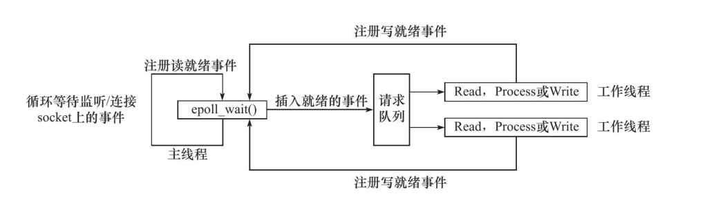
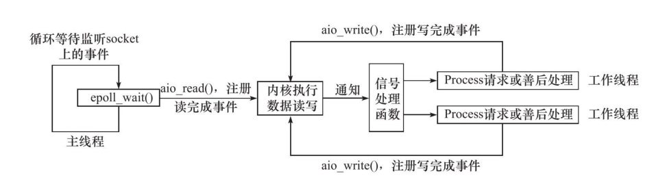

# Linux 高级 I/O

除了 Linux 提供的基础 I/O 函数（`open`、`read`）之外，还提供了一些高级 API。

这些函数大致分为三类：

- 用户创建文件描述符的函数，包括 `pipe`、`dup/dup2` 函数。
- 用户读写数据的函数，包括 `readv/writev`、`sendfile`、`mmap/munmap`、`splice`、`tee` 函数。
- 用户控制 I/O 行为和属性的函数，包括 `fcntl` 函数。

## pipe

创建一个管道（单向和双向）实现进程间通信。

```c
int pipe(int fd[2]);
```

管道传输的是字节流，这与 TCP 字节流的概念相同。但两者有一点区别。

应用程序往一个 TCP 连接中写入数据的多少是受对方设置的**窗口大小**和本端的**拥塞窗口**的大小决定的。而管道本身设置了一个限制值，它规定如果应用程序数据不走管道，该管道最多能被写入多少个字节数据。Linux 2.6.11 设置的默认值是 65536。我们也可以通过 `fcntl` 函数修改默认值。

## dup/dup2

把标准输入重定向到一个文件，或者把标注输出重定向到一个网络连接（比如 CGI 编程）。

```c
#include＜unistd.h＞
int dup(int file_descriptor);
int dup2(int file_descriptor_one,int file_descriptor_two);
```

dup 函数创建一个新的文件描述符，该新文件描述符和原有文件描述符 file_descriptor 指向相同的文件、管道或者网络连接。返回值是当前系统可用的最小整数值。

而 dup2 跟 dup 一样，只是返回值是返回第一个不小于 file_descriptor_two 的整数值。

## readv/writev

readv 是将数据从文件描述符读到分散的数据块中。

writev 是将分散的数据块中合并写入文件描述符中。

```c
#include＜sys/uio.h＞
ssize_t readv(int fd,const struct iovec* vector,int count)；
ssize_t writev(int fd,const struct iovec* vector,int count);
```

## sendfile

**sendfile** 函数在两个文件描述符之间直接传递数据（都是在内核中操作的），从而避免了数据从内核态到用户态的数据拷贝，效率很高，这被称为零拷贝。

```c
#include＜sys/sendfile.h＞
ssize_t sendfile(int out_fd,int in_fd,off_t* offset,size_t count);
```

## mmap、munmap

mmap 函数用于申请一段内存空间。**我们可以将这段内存作为进程间通信的共享内存，也可以将文件直接映射到内存中。**

munmap 函数则是释放 mmap 创建的这段内存空间。

```c
#include＜sys/mman.h＞
void*mmap(void* start,size_t length,int prot,int flags,int fd,off_t offset);
int munmap(void* start,size_t length);
```

## splice

**splice** 函数用于两个文件描述符之间移动数据的，此操作是**零拷贝操作**。

```c
#include＜fcntl.h＞
ssize_t splice(int fd_in,loff_t* off_in,int fd_out,loff_t* off_out,size_t len,unsigned int flags);
```

splice 返回移动字节的数量。返回 0 表示没有数据移动。

## tee

**tee** 函数用于两个管道文件描述符之间的复制数据，此操作是**零拷贝操作**。

它不消耗数据，因此源文件描述符上的数据仍然可以用于后续的读操作。

```c
#include＜fcntl.h＞
ssize_t tee(int fd_in,int fd_out,size_t len,unsigned int flags);
```

# IO 模型

I/O 复用是一个常用得 I/O 通知机制。它指的是，**应用程序通过I/O 复用函数向内核注册一组回调事件，内核通过这个I/O 复用函数把其中就绪的事件通知给应用程序。**

Linux上常用的 I/O 复用函数是 `select`、`poll` 和 `epoll_wait`。**请注意：I/O 复用函数本身是阻塞的，它们能提高程序效率的原因在于它们具有同时监听多个I/O 事件的能力。**

**阻塞I/O、I/O 复用和信号渠道I/O 都是同步I/O**。

所谓的同步 I/O，都是在 I/O 事件发生后，由应用程序来完成的。而异步I/O，用户可以直接对 I/O 执行读写操作，这些操作告诉内核用户读写缓冲区的位置，以及I/O 操作完成之后内核通知应用程序的方式。**异步I/O的读写操作总是立即返回，而不论I/O是否是阻塞的，因为真正的读写操作已经由内核接管。**也就是说，**同步I/O模型要求用户代码自行执行I/O操作（将数据从内核缓冲区读入用户缓冲区，或将数据从用户缓冲区写入内核缓冲区），而异步I/O机制则由内核来执行I/O操作（数据在内核缓冲区和用户缓冲区之间的移动是由内核在“后台”完成的）。**

并发编程的目的是让程序“同时”处理多个任务。如果程序是**计算密集型**，并发编程就没有优势，反而由于任务切换使效率降低。如果程序是I/O密集型，比如经常读写文件、访问数据库等就会有所不同了。CPU 执行速度要比I/O的处理速度快得多，所以在I/O阻塞的情况下，必须要让出 CPU 时间片，给到其它线程执行来充分利用 CPU。

## 高性能事件处理模式

### Reactor 模式

Reactor 要求主线程（I/O处理单元）只负责监听文件描述上是否有事件发生，有的话就立即将该事件通知工作线程（逻辑单元）。除此之外，主线程不做任何其他实质性的工作。读写数据，接受新的连接，以及处理客户请求均在工作线程中完成。

使用同步I/O模型，实现的 Reactor 模式的工作流程如下：

1. 主线程往 epoll 内核事件表中注册 socket 上的**读就绪事件**。
2. 主线程调用 epoll_wait 等待 socket 上有数据可读。
3. 当 socket 上有数据可读时，epoll_wait 通知主线程。主线程则将 **socket 可读事件放入请求队列**。
4. 在请求队列上的某个工作线程唤醒，然后从请求队列上读取数据，并处理客户请求，然后让 epoll 内核事件表中注册该 socket 上的**写就绪事件**。
5. 主线程调用 epoll_wait 等待 socket 可写。
6. 当 socket 上有数据可写时，epoll_wait 通知主线程，主线程将 **socket 可写事件放入请求队列。**
7. 请求队列的工作线程唤醒，读取可写数据往服务器写入数据处理客户的请求结果。



关于 Reactor 模式更多内容移步：[了解 Reactor 模式：基于线程和事件驱动](../blogs/2024/understanding-reactor-pattern-thread-based-and-event-driven.md)

### Proactor 模式

与 Reactor 模式不同，**Proactor 模式将所有I/O操作都交给主线程和内核来处理，工作线程仅仅负责业务逻辑。**

使用异步I/O模型（以 `aio_read` 和 `aio_write` 为例）实现的 Proactor 模式的工作流程是：

1. 主线程调用 `aio_read` 函数向内核注册 socket 上的**读完成事件**，并告诉内核用户读缓冲区的位置，以及读操作完成时如何通知应用程序。
2. 主线程继续处理其它业务。
3. 当 socket 上的数据被读入用户缓冲区后，内核将向应用程序发送一个信号，以通知应用程序数据已经可用。
4. 应用程序预先定义好的信号处理函数选择一个工作线程来处理客户请求。工作线程处理完客户请求之后，调用 `aio_write` 函数向内核注册 socket 上的**写完成事件**，并告诉内核用户写缓冲区的位置，以及写操作完成时如何通知应用程序。
5. 主线程继续处理其他逻辑。
6. 当用户缓冲区的数据被写入 socket 之后，内核将向应用程序发送一个信号，以通知应用程序数据已经发送完毕。
7. 应用程序预先定义好的信号处理函数选择一个工作线程来做善后处理，比如决定是否关闭 socket。



