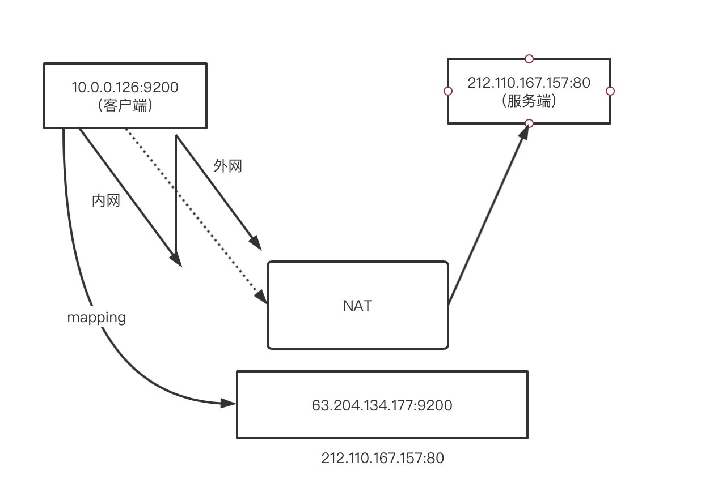

# DHCP 和自动控制

名次介绍：

LDRA：DHCP 中继代理

RAIO：中继代理信息选项

DHCP 认证：确定 DHCP 消息是否来自一个授权的发送方

地理空间 LC1：地理空间位置配置信息，可用于一系列目的，包括紧急服务，如使用 IP 电话请求援助，Le1 可以指示发送紧急情况的位置，缺点就是存在隐私问题。

采用高层协议：启用 HTTP 的位置投递（HELD）协议，可以提供位置信息到服务转换 Lost 框架：通过使用位置相关的 URI 访问的应用层协议来实现此功能

移动计算机网络之间的切换：

1. Mos：IEEE802.21 移动服务发现
2. ANDSF：接入网发现和选择功能

> 3GPP：一个标准化组织，主要是制定以 GSM 核心网为基础，UTRA（FDD 为 W-CDMA 技术，TDD 为 TD-SCDMA 技术）为无限接口的第三代技术规范
>
> GSM：Global Systen For Mobile Communications，俗称 2G

其中 Mos 有三种服务：1.信息服务。2.命令服务。3.事件服务

无状态 DHCPv6：允许一台主机获得除自己地址以外的其他信息

有状态 DHCPv6：用于主机更精准的分配地址

## DAD 重复地址检测

DAD 执行过程：

- 一个节点加入临时地址的**所有节点组播地址**和**请求节点的组播地址**。
- 如何检查重复：节点发送一个或多个 ICMPv6 邻居请求消息
- 检查有重复地址（未完成 DAD 检测），则当作特殊请求舍弃当前的临时地址，并 DAD 失败

## TCP/IP

TCP/IP 是互联网络协议/传输控制协议

TCP/IP 是协议族，两个提供不同的功能。

IP：提供命令机制和递送机制。它是不可靠的，因为数据在传递过程中可以丢失而不会恢复。

UDP：是拓展 IP，它是在 IP 之上的一个协议，提供一个可靠的双工通信。

TCP/IP 解决了什么？

因特网之间的主机有不同的主机字节顺序，但是 TCP/IP 为任意的整数数据项定义了一个统一的网格字节顺序（大端字节顺序），以数据包的包头传输。

IP 地址是以 16 进制表示，如  0x8002c2f2，用点十进制表示为：128.2.194.242。

由于 16 进制和点十进制很难记，所有就有了域名。

一个套接字是连接的一个端点与之对应的一个地址，是由**因特网地址和 16 位整数端口**组合而成。这个套接字地址是内核自动分配的。

套接字创建连接的过程：

1. 客户端与服务端通过 socket 函数创建一个 “Socket 描述符”
2. 与服务器建立连接（客户端通过使用 connect 函数），返回套接字描述符给客户端，此时客户端可以与服务器进行通信
3. 绑定服务器套接字地址和套接字描述符
4. 监听套接字：将前面创建的主动套接字转为监听套接字继而生成监听描述符

> 监听描述符：作为客户端连接请求的一个端点，创建了一次并存在于服务器整个生命周期中。
>
> 已连接描述符：表示客户端和服务端建立连接时的一个端点，每次接受请求都会创建一次

## NAT 网络地址转换

本质上是一种允许互联网的不同地方重复使用相同 IP 地址集的机制。

使用场景：唯一与 Internet 连接的站点仅被分配了很少的几个 IP（甚至只有一个 IP），但是内部多端要同时上网。这种场景就需要用到 NAT。当所有进出流量均通过一个单独的 NAT时，该设备会将**内部系统的地址空间和全球互联网地址空间分隔开**。所以在内部系统可以使用本地分配的私有 IP 地址访问互联网。

NAT 工作原理：**通过重写路由器的数据包的识别信息**

由内往 IP 地址 10.0.0.126:9200 发出请求外网地址 212.110.167.157:80。经由 NAT 将数据包由内网 IP 转换为外网地址 63.204.134.177:9200 请求网络 212.110.167.157:80。

回复过程一样，因为映射关系已经前面请求时缓存了。所以可以直接由外网 212.110.167.157:80回复响应包给 IP 63.204.134.177:9200，经由 NAT 将外网地址转换为内往地址 10.0.0.126:9200。

NAT 大大增加了设计其他协议的复杂性。因为 NAT 出现的目的是为了解决网络 IP 地址不够用的问题，这个问题在 IPv6 下是不存在的，所以在 IPv6 下，不要设置 NAT。

IPv6 通过 ULA（IPv6 单播地址）代替 NAT 的部分功能（如过滤）、IP 数据包重写的功能。ULA 是通过一种算法，基于前缀将一个 IPv6 地址转换为其他不同的 IPv6 地址，它不必像 NAT 那样维护每个连接的状态，该算法不需要修改地址来保证通用传输协议（TCP、UDP）的 “校验和”计算值保持不变，因为不需要修改网络层上的（TCP/IP）的数据包和数据，也不需要访问传输层的端口号。降低了 NAT 的复杂度。

NAT 地址和端口转换行为：

- 独立于端点的
- 依赖于地址
- 依赖于地址:端口的

如何使跨域多个 NAT 系统之间的通信称为可能？

1. NAT 会话穿越工具（Session Traversal Utilities for NAT，STUN）

   好处：STUN 无需修改网络路由器，应用协议或者服务器，它仅需要客户端实现 STUN 请求协议以及至少一台在适当位置可用的 STUN 服务器

   缺点：NAT 的中继的穿越（Traversal Using Relays around，NAT，TURN），流量必须通过 TRUN 服务器进行中继，这可能会导致低效的路由，此外请求 TURN 的客户端必须实现 STUN 长期信任机制，并有由 TURN 服务器操作员分配的登陆凭证或账户，增加了配置的复杂度