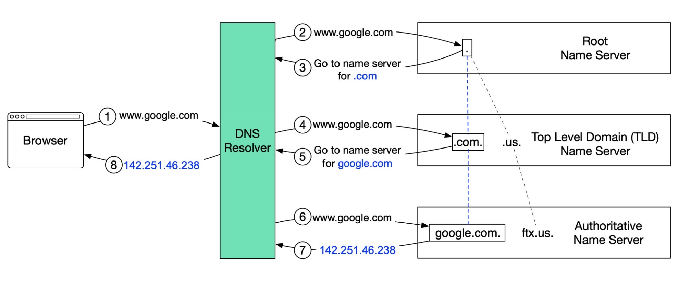
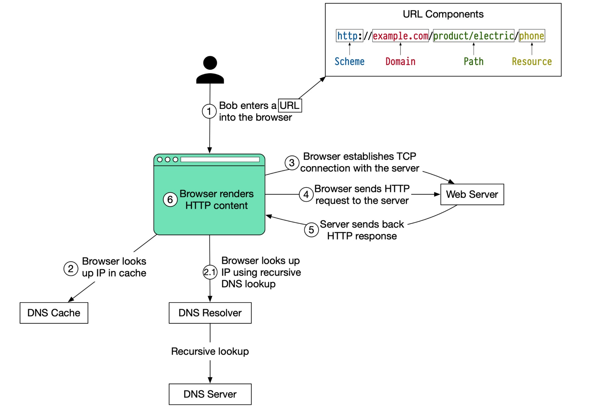

# DNS

域名系统（Domain Name System）充当一个地址簿的角色。它将人类可读的域名（如 `google.com`）翻译成机器可读的IP地址（`142.251.46.238`）。
为了实现更好的可伸缩性，DNS 服务器采用**分层树状结构组织**。
DNS服务器有三个基本级别：

1. 根名称服务器（.）。它存储**顶级域（Top Level Domain,TLD）名称服务器**的 IP 地址。全球共有 13 个逻辑根名称服务器。

2. TLD 名称服务器。它存储权威名称服务器的 IP 地址。有几种类型的 TLD 名称。例如，通用 TLD（.com、.org）、国家代码 TLD（.us）、测试 TLD（.test）等。

3. 权威名称服务器。它提供 DNS 查询的实际答案。您可以向域名注册机构（如 GoDaddy、Namecheap 等）注册权威名称服务器。


下面的图示说明了 DNS 查询的内部工作原理：



1. 在浏览器中键入 google.com，浏览器将域名发送给 **DNS 解析器**。
2. 解析器向 DNS **根名称服务器**发出查询。
3. 根服务器用**顶层 DNS 服务器**的地址响应解析器。在这种情况下，它是 `.com`。
4. 解析器随后向 `.com` TLD 发出请求。
5. TLD 服务器用域名名称服务器（`google.com` 的权威名称服务器）的 IP 地址响应。
6. DNS 解析器向域名的名称服务器发送查询。
7. google.com 的 IP 地址随后从名称服务器返回给解析器。
8. DNS 解析器用最初请求的域名的IP地址（142.251.46.238）响应 Web 浏览器。

根据 YSlow 的说法，DNS 查询平均需要 20-120 毫秒才能完成。

所以我们可以看到一个正常的 DNS 查询过程是非常占据网络数据传输的，所以为了提高 DNS 的查询效率，又引入了 **DNS 缓存机制**。

## DNS 缓存机制

缓存机制有点类似 CPU 的多级缓存一样：

首先，浏览器和操作系统会缓存 DNS 的查询结果，这样就能避免查询同一个网址。这样就能在用户在一段时间内重复访问该网址，DNS 服务器可以直接返回缓存的结果，而不需要重新查询。

其次，如果本地浏览器和操作系统没有缓存结果，那么其**网络供应商（Internet Service Provider, ISP）**和 **DNS 服务器**也会进行缓存，将常用的 DNS 查询结果存储在本地，以提高查询效率。这样，在同一网络中，如果有其他用户已经访问过了这个网站，DNS 服务器就会直接返回缓存结果。

最后，如果 ISP 和 DNS 都没有缓存结果，那么在查询前会根据请求方的地理位置和负载均衡原则选择最近或最合适的 DNS 服务器进行查询，以减少网络延迟和提高查询效率。

要注意，有缓存就必定会有数据一致性的问题。DNS 缓存失效问题一般只有等到 TTL 失效之后重新获取才能保持数据一致。

> 所以我们结合缓存机制，来完整的描述一下 DNS 的解析过程：
>
> 1. 客户端首先会检查本地的 DNS 缓存，查看是否存在该域名的地址记录；如果本地 DNS 服务器已经缓存了这个网址的 DNS 解析结果，那么它会直接返回缓存的结果，否则它会从**根域名服务器开始进行递归查询**。**后续的每一级 DNS 查询过程都有类似的缓存查询操作。**
> 2. 首先，本地 DNS 服务器向根域名服务器发送一个请求，询问 ".com" 域名的权威 DNS 服务器的 IP 地址。
> 3. 根域名服务器会响应本地 DNS 服务器的查询，告诉它 ".com" 域名的权威 DNS 服务器的 IP 地址。
> 4. 本地 DNS 服务器再向 ".com" 域名的权威 DNS 服务器发送一个请求，询问 "google.com" 域名的权威 DNS 服务器的 IP 地址。
> 5. ".com" 域名的权威 DNS 服务器会响应本地 DNS 服务器的查询，告诉它 "google.com" 域名的权威 DNS 服务器的 IP 地址。
> 6. 本地 DNS 服务器再向 "google.com" 域名的权威 DNS 服务器发送一个请求，询问 "[www.google.com](http://www.google.com)" 域名的 IP 地址。
> 7. "google.com" 域名的权威 DNS 服务器会响应本地 DNS 服务器的查询，告诉它 "[www.google.com](http://www.google.com)" 域名对应的 IP 地址。
> 8. 本地 DNS 服务器将最终的 DNS 解析结果返回给您的计算机，并在本地缓存中保存查询结果，以便下次再次访问该网站时可以更快地响应 DNS 解析请求。
>
> 我们可以看到这都是从各级权威 DNS 服务器到本地 DNS 服务器交互的过程。

## 思考题：当你向浏览器输入网址时会发生什么？



1. 当Bob在浏览器中输入URL并按下回车键时，该URL由4个部分组成：
   - **协议(scheme)** - `https://`。这告诉浏览器使用 HTTPS 协议向服务器发送连接请求。
   - **域名(domain)** - `example.com`。这是该站点的域名。
   - **路径(path)** - `/product/electric`。这是请求的资源在服务器上的路径。
   - **资源(resource)** - `phone`。这是 Bob 要访问的资源的名称。

2. 浏览器使用域名系统（DNS）查找该域名的 IP 地址。为了使查找过程更快，数据会被缓存在不同的层级：浏览器缓存、操作系统缓存、本地网络缓存和 ISP 缓存。
  2.1. 如果 IP 地址无法在任何缓存中找到，浏览器将转到 DNS 服务器执行递归 DNS 查找，直到找到 IP 地址（这上面 DNS 的内容已经介绍）。

3. 现在我们有了服务器的 IP 地址，浏览器与服务器建立 TCP 连接

4. 浏览器向服务器发送 HTTP 请求。请求的格式如下：

  ```
  GET /phone HTTP/1.1
  Host: example.com
  ```

5. 服务器处理请求并返回响应。对于成功的响应（状态码为 200），HTML 响应如下所示：

   ```
   HTTP/1.1 200 OK
   Date: Sun, 30 Jan 2022 00:01:01 GMT
   Server: Apache
   Content-Type: text/html; charset=utf-8

   <!DOCTYPE html>
   <html>
   <head>
   <title>Hello world</title>
   </head>
   <body>
   Hello world
   </body>
   </html>
   ```

6. 最后，浏览器呈现 HTML 内容。


