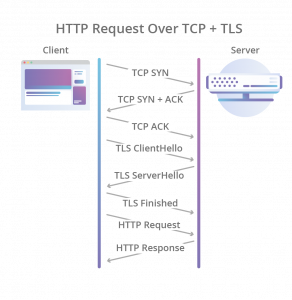

# HTTP/3

HTTP3 的出现肯定是为了解决 HTTP/2 的一些不足的。那么 HTTP2 有哪些不足呢？

HTTP2 的出现是也是为了解决 HTTP/1.1 的一些不足。

首先 HTTP2 采用了二进制协议，增加了传输效率。HTTP/1.1 **还是以文本的方式靠 CPU 压缩计算传输**，并且每次传输都携带头部信息。这就导致传输的成本大。并且每请求一个资源 HTTP/1.1 都会打开一个连接（如一个网站请求了 css、js、html 文件，这就会打开三个 HTTP/1.1 的连接），这样开销很大。所以在 **HTTP/2 就增加了I/O 的多路复用，一个 TCP 连接可以并发请求多个 HTTP 请求**。并且 HTTP/2 会压缩头，如果发送多个请求，其头部是一样或类似的，这个时候 **HTTP/2 就通过某种算法 `HPACK` 来消除重复的部分**。除此之外 **HTTP/2 还接受服务端将一个请求所依赖的请求连带返回**，如假设一个请求 X 依赖请求 Y，那么当客户端想服务端请求 X 时，服务端会把 Y 和 X 一同返回给客户端缓存起来。

那么 HTTP/2 除了这些好处之外，那有什么缺陷呢？

因为 I/O 复用，多个 HTTP 请求共一个 TCP 连接，底层协议是不知道这个 TCP 通道上有多少个 HTTP 请求的，所以一旦发生丢包，那么就会导致其他所有的 HTTP 请求都要等待这个丢包的请求重新发送，即使丢包的那个请求跟其他的 HTTP 请求没有任何关系。这个阻塞过程被称为 “[对头阻塞（Head-of-Line Blocking）](https://en.wikipedia.org/wiki/Head-of-line_blocking)”

回到 HTTP/1.1，如果一个管道中有一个请求被阻塞了，那么后面的请求都会阻塞（因为串行）。

而 HTTP/2 如果发生丢包，就会阻塞这个通道里的所有 HTTP 请求。

本质上这个问题还是没有解决。

而 HTTP/3 就是为了解决这个问题的

HTTP/3 直接从 UDP 协议上入手，把之前的 **TCP 协议改成了 UPD 协议（QUIC 协议**）。

为什么一换成 UDP 就可以解决这个问题呢？因为 UDP 只管发包，不管这个包的顺序以及是否丢弃。那么要解决这个问题，所以就必须自己实现一套**丢包重出传和拥塞控制**（这里是通过新型的 TCP 拥塞控制算法，以 BBR 为代表的测量模型）。

然后就开始建立 HTTPS 连接，原来 TCP 协议建立连接需要三次握手，然后再与 TLS 进行三次握手。而在 UDP 中也要实现这个目的。于是 QUIC 直接将 TCP 和 TLS 合并成了三次握手

HTTP/3 还带来了什么问题呢？因为 TCP 在通信的时候还有个很重要的辅助信息即四元组（源，目标地址以及源，目标端口），而 UDP 是没有这些信息，所以 QUIC 又引入了 connection id 来做映射（有一点要知道的是，因为没有了这些 IP 与端口，所以当我们的设备在于 wifi 与流量切换时，connection id 是不会变的）。所以这也就带来另一个问题，那就是在现阶段非常常用的代理，负载等中间件是不知道 connection id 的（因为它们只认 IP 和端口），所以就还需要解决这个问题。其解决方案可以了解 FaceBook 的 [Katran](https://github.com/facebookincubator/katran)。

HTTP/3 还要解决 HTTP/2 的 HPACK 的头部压缩，所以 QUIC 提出了 QPACK 来处理头部压缩问题。通过两个附加的 QUIC stream，一个用来发送这个字典集的更新给对方，另一个用来接受并 ack 对方发过来的更改。

# 关于 BBR 算法

- [TCP-BBR](TCP-BBR.md)

# 参考资料

1. https://coolshell.cn/articles/19840.html#HTTP3
2. https://medium.com/google-cloud/tcp-bbr-magic-dust-for-network-performance-57a5f1ccf437