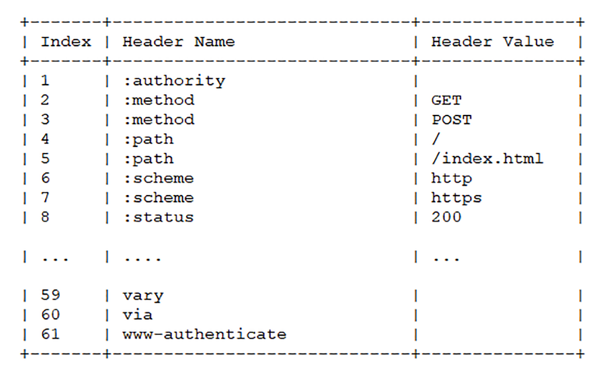

# HTTP1/2/3

HTTP3 的出现肯定是为了解决 HTTP/2 的一些不足的。那么 HTTP2 有哪些不足呢？

HTTP2 的出现是也是为了解决 HTTP/1.1 的一些不足。

那么我们先了解下HTTP/1.1有什么不足？

## HTTP/1.1

首先 HTTP1 的协议非常简单；它是一个纯文本协议，并且拓展性极强。主要由三个部分组成：

1. 起始行：描述请求和响应的基本信息，如（`GET / HTTP1.1`)
2. 头部字段集合（header）：key-value 形式的描述说明
3. 消息正文（entity）：实际传输的数据，可以是文本、视频、文件、表单等

为什么说 HTTP1 协议非常灵活？因为我们的头部字段集合可以添加任意的 k-v 键值对进行拓展。除此之外，还体现在 HTTP 的“可靠传输”上。因为它不限制下层具体使用哪个协议，如可以使用TCP、UNIX Domain Socket、SSL/TLS以及后续 HTTP3 的基于UDP的QUIC协议。

HTTP在传输的时候是明文的，这对于开发者来说调试问题是非常方便的。但是伴随而来的就是安全问题了，明文会暴露很多敏感信息，当黑客截获了HTTP请求就能很轻而易举的获取到了里面的明文信息。

二是HTTP在端与端之间建立连接没有任何校验的；黑客可以冒充其中一个端与之通信；虽然可以通过加密、摘要的手段传输，但是由于前一点明文的特性，黑客在截获请求时也替换自己的加密和摘要，这样客户端还是无法知道对方的真假。

三是在目前流量越来越多的时代，HTTP1.1的性能已经越来越捉襟见肘了。像这种“请求-应答”模式，在高并发下，特别是网络不稳定的情况下非常容易出现“对头阻塞”的问题，导致整个HTTP通信有延时，严重可导致失去连接。

针对上面的几个问题，HTTP2就有针对性的进行了优化。

## HTTP2

首先如果要用 HTTP2，那么就必须强制实施 TCP+TLS 的交互方式。所以这在安全方案较于 HTTP1.1 来说有了基本的保障。初次之外，它还删除了目前已经不安全的加密算法（如DES、RC4、CBC、SHA-1等）

其次 HTTP2 采用了专用与 HTTP1.1 的 Header 的压缩算法 HPACK，减轻了两端之间的传输压力以及带宽。

> HPACK：采用了哈夫曼编码来压缩整数和字符串，可以达到 50%-90% 的压缩率。
>
> 简单来讲其实就是通过字段映射 key-value 来完成压缩的；具体映射过程如下：
>
> 首先 HTTP2 将 Header 的字段与值都存储在一个只读的静态表中，这样就能把重复的 key-value 的值只用存储一个。而有些请求的 header 值是不一样的，这个情况下就会动态将值插入这个表的尾部。下次在请求的时候就能直接取表的索引即可。这样就将一串 key-value 用索引值替换即可，极大的压缩了传输内容。
>
> 
>
> ​													(图引自《透视HTTP协议》)
>
> 所以这个表需要在两端都需要维护。

在传输报文格式方面，HTTP2 采用了二进制协议，增加了传输效率。HTTP/1.1 **是以文本的方式靠 CPU 压缩计算传输**，并且每次传输都携带头部信息。这就导致传输的成本大。并且每请求一个资源 HTTP/1.1 都会打开一个连接（如一个网站请求了 css、js、html 文件，这就会打开三个 HTTP/1.1 的连接），这样开销很大。所以在 **HTTP/2 就增加了I/O 的多路复用，一个 TCP 连接可以并发请求多个 HTTP 请求**。并且 HTTP/2 会压缩头，如果发送多个请求，其头部是一样或类似的，这个时候 **HTTP/2 就通过某种算法 `HPACK` 来消除重复的部分**。除此之外 **HTTP/2 还接受服务端将一个请求所依赖的请求连带返回**，如假设一个请求 X 依赖请求 Y，那么当客户端想服务端请求 X 时，服务端会把 Y 和 X 一同返回给客户端缓存起来（这就叫**服务推送，充分体现出TCP双工通信的特点**）。

> HTTP2数据报文格式：HTTP2 将 HTTP1.1 的 Header+Body 的形式拆成了帧（Frame）的形式：头部帧（Frame Header）和数据帧（Frame Payload）。如下图
>
> 
>
> 关于 Frame Header 各个类型的意思可详见[rfc7540](https://datatracker.ietf.org/doc/html/rfc7540#section-4.1)。
>
> **流与多路复用**
>
> HTTP2 为了提高传输性能，提出了流（Stream）的的概念，它是**二进制帧的双向传输序列**，同一个消息往返的帧会分配唯一的流 ID。**可以想象成这是一个流管道，所以这里面的数据肯定都是有序的（但是对于HTTP连接来说，发送出去的帧是乱序的）**。这些数据帧按照次序组装起来就是HTTP/1.1中的请求报文和响应报文。
>
> 并且HTTP2中的流有如下特点：
>
> 1. 流并发；一个HTTP2连接可以同时发送多个流传输数据，也就是并发请求，实现了多路复用。
> 2. 客户端和服务端都可以各种创建流；
> 3. 流是双向的，两个端都可以发送/接收数据帧；
> 4. 每个流内部一定是有序的；
> 5. 流可以设置优先级，如让服务器优先处理（如先传输 HTML/CSS，后传图片，优化用户体验）
> 6. 流ID是唯一的，只能顺序递增；**客户端发起的ID是奇数，服务端发起的ID是偶数**；
> 7. 在流上发送“RST_STREAM”帧可以随时终止流，取消接收或发送；
> 8. 第 0 号流为**控制流**，比较特殊，不能关闭，也不能发送数据帧，只能发送控制帧，用于流量控制。
>
> 

**流状态转换**

流状态的过程有点像HTTP的挥手过程，在建立连接的时候，双方都会从`idle`状态转换成`open`状态。这个时候双方可以发送/接收数据帧。当数据发送完了，主动发起方会主动发送一个`END_STREAM`标志位的帧，这个时候流就进入了半关闭`half-closed`的状态。在这个状态下客户端就会意识请求数据已经发送完毕，需要接受响应数据；而服务端也知道请求数据完毕，之后要内部处理之后再进行响应数据。

响应数据发完之后，也要带上`END_STREAM`标志位的帧，表示数据发送完毕，这样两端就都进入关闭`closed`状态。整个流就结束了。

**之前说到流ID是自增的，所以等下一次新的请求进来时，就会发起新的流。这样就会导致流ID不断增长，最后导致达到上限。这个时候就会发送`GOAWAY`帧开一个新的TCP连接，流ID又重新开始计算。**

那么 HTTP/2 除了这些好处之外，那有什么缺陷呢？

因为 I/O 复用，多个 HTTP 请求共一个 TCP 连接，底层协议是不知道这个 TCP 通道上有多少个 HTTP 请求的，所以一旦发生丢包，那么就会导致其他所有的 HTTP 请求都要等待这个丢包的请求重新发送，即使丢包的那个请求跟其他的 HTTP 请求没有任何关系。这个阻塞过程被称为 “[对头阻塞（Head-of-Line Blocking）](https://en.wikipedia.org/wiki/Head-of-line_blocking)”

回到 HTTP/1.1，如果一个管道中有一个请求被阻塞了，那么后面的请求都会阻塞（因为串行）。

而 HTTP/2 如果发生丢包，就会阻塞这个通道里的所有 HTTP 请求。

本质上这个问题还是没有解决。

而 HTTP/3 就是为了解决这个问题的

## HTTP3

HTTP/3 直接从 UDP 协议上入手，把之前的 **TCP 协议改成了 UPD 协议（QUIC 协议**）。

为什么一换成 UDP 就可以解决这个问题呢？因为 UDP 只管发包，不管这个包的顺序以及是否丢弃。那么要解决这个问题，所以就必须自己实现一套**丢包重出传和拥塞控制**（这里是通过新型的 TCP 拥塞控制算法，以 BBR 为代表的测量模型）。

然后就开始建立 HTTPS 连接，原来 TCP 协议建立连接需要三次握手，然后再与 TLS 进行三次握手。而在 UDP 中也要实现这个目的。于是 QUIC 直接将 TCP 和 TLS 合并成了三次握手

HTTP/3 还带来了什么问题呢？因为 TCP 在通信的时候还有个很重要的辅助信息即四元组（源，目标地址以及源，目标端口），而 UDP 是没有这些信息，所以 QUIC 又引入了 connection id 来做映射（有一点要知道的是，因为没有了这些 IP 与端口，所以当我们的设备在于 wifi 与流量切换时，connection id 是不会变的）。所以这也就带来另一个问题，那就是在现阶段非常常用的代理，负载等中间件是不知道 connection id 的（因为它们只认 IP 和端口），所以就还需要解决这个问题。其解决方案可以了解 FaceBook 的 [Katran](https://github.com/facebookincubator/katran)。

HTTP/3 还要解决 HTTP/2 的 HPACK 的头部压缩，所以 QUIC 提出了 QPACK 来处理头部压缩问题。通过两个附加的 QUIC stream，一个用来发送这个字典集的更新给对方，另一个用来接受并 ack 对方发过来的更改。

# 关于 BBR 算法

- [TCP-BBR](TCP-BBR.md)

# 参考资料

1. https://coolshell.cn/articles/19840.html#HTTP3
2. https://medium.com/google-cloud/tcp-bbr-magic-dust-for-network-performance-57a5f1ccf437