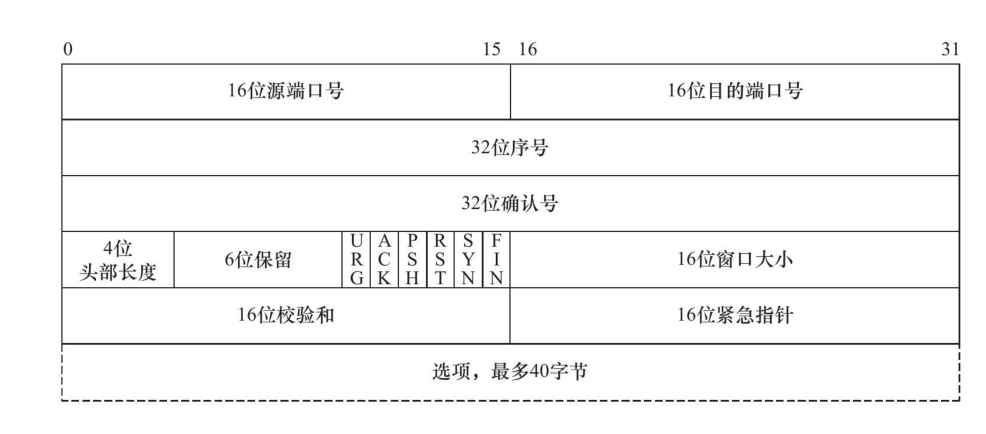
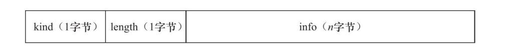
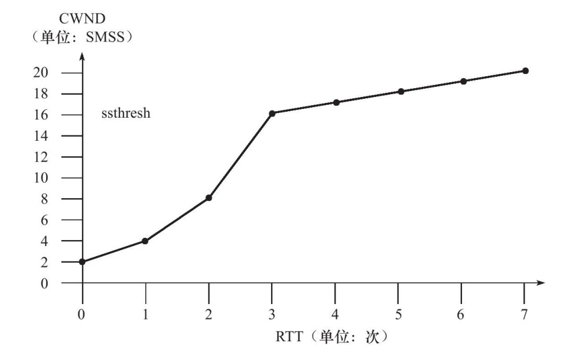

## TCP

TCP 是面向连接、字节流的，内部采用了可靠传输机制；是属于传输层。

TCP 协议采用发送应答机制，每发一个请求之后，必须要等待请求的响应应答，才会认为这个 TCP 报文段传输成功。并且在等待应答期间，会有设置一个 TTL 超时参数，超过设定的阈值就会进入**超时重传**阶段。最后，因为 TCP 报文最终是以 IP 数据报发送的，而 IP 数据包到达接收端时可能会发生乱序、重复。所以 TCP 协议还需要要对接收到的 TCP 报文进行重排整理之后再返回给应用层。

上述提到的可靠传输能力，与 TCP 结构是密不可分的：

32 位源端口号和目的端口号：告诉主机该报文段是从哪里发出，发送到哪里。

32 位序号：这个就是 TCP 协议用来保证报文段有序不重复的原因；在一次会话中，A 给 B 发送第一个 TCP 报文，序号被设置为某个值 Seq。那么在后续的相同传输方向的请求中（A -> B），其序号值就会被设置为初始值 Seq + 该报文段所携带的报文段中的第一个字节在整个字节流中的偏移量。例如，一个 TCP  报文段传输的数据是整个数据流的第 1025-2048 字节，那么该报文段的序号值为：Seq + 1025。

32 位确认号：对另一方发送来的 TCP 报文段的响应确认。其值就是确认的请求报文段的序号值 +1。

16 位窗口大小：这是 TCP 实现流量控制的重要部分。它告诉对方本端的 TCP 接收缓冲区还能容纳多少字节的数据，这样对方就能控制发送数据的速度了。

16 位校验和：校验发送的数据是否完整。

16 位紧急指针：向对方发送紧急数据，用来做一些特殊（优先）处理。

TCP 头部选项是变长的，其结构如下：

kind 字段总共有 7 种值：

| kind | description                                                  |
| ---- | ------------------------------------------------------------ |
| 0    | 结束选项                                                     |
| 1    | 空（nop）操作，没有特殊含义。                                |
| 2    | 最大报文段长度选项，协商 MSS 的值                            |
| 3    | 窗口扩大因子选项                                             |
| 4    | 选择性确认（SACK）选项                                       |
| 5    | SACK 实际工作的选项                                          |
| 8    | 时间戳选项，提供了较为准确的计算通信双方之间的回路时间（RTT） |

客户端之间的 TCP 连接首先从建立连接（Connection）开始，成功建立连接之后，两个端在应用层上就属于两个会话（Session）。

### TCP的握手与挥手

首先先说明下 TCP 几个核心操作：

- SYN；请求同步，即客户端A与客户端B建立连接，A会发起一个连接请求到B，这个过程称为 SYN；
- PSH；发送数据，一个端向另一个端发送数据包；
- FIN；一个端主动断开请求，称为 FIN，此时请求完成；
- ACK；反馈确认，对上面的三个操作，所达端都要发送一个ACK回去响应。

### 三次握手

端到端的 TCP 连接是通过三次握手建立的，以客户端A与客户端B建立TCP连接为例：

1. 一次握手

   - 客户端A向B发出建立连接请求，即SYN；

2. 二次握手

   - 客户端B针对SYN返回一个ACK作为响应，表示准备好建立连接；

   - **同时发送一个SYN给客户端A**

3. 第一次握手后，双方已经做好建立连接的准备了。三次握手

   - 客户端A针对B的SYN作出响应，即向B发送一次ACK。

4. 至此A，B成功建立连接

### 四次挥手

断开连接由一方主动发起断开连接请求，下面是四次挥手的过程与 TCP 的状态转移，以客户端 A 主动向服务器 B 发送关闭请求为例：

1. 一次挥手
   - 客户端 A 向 服务器 B 发出断开连接请求，即FIN，此时客户端A 进入 FIN_WAIT_1；
2. 二次挥手
   - 服务器 B 针对 A 的 FIN 请求返回 ACK 响应，表示准备断开连接，此时状态转变成 CLOSE_WAIT；
   - 此时客户端 A 接收到服务器 B 对于 FIN 的 ACK 确认，会进入 FIN_WAIT_2；
3. 三次挥手
   - 服务器 B 向 A 发出断开连接确认请求，即 FIN_ACK，此时状态为 LAST_ACK；
   - 客户端 A 收到服务器 B 发出的 FIN_ACK 请求时，也会进入 TIME_WAIT，并回复一个 ACK 给服务器 B；
4. 四次挥手
   - 服务器 B 接收到 A 的 FIN-ACK 请求则会进入 CLOSE 状态；
   - 客户端 A 会确保服务器 B 收到了 ACK 之后会进入 CLOSE 状态；

**那么在断开连接的过程中，还有网络请求包因为各种原因（如网络延时）没有接收到，这种情况会怎么处理呢？**

上面提到了客户端连接在收到服务器的 FIN_ACK 报文段时并没有立即 CLOSE 状态，而是先转移到 TIME_WAIT。在这个状态，客户端连接要等待一段长为 2MSL（Maximum Segment Life，报文段最大生存时间） 的时间，才能完全关闭。其目的是：

- 可靠的终止 TCP 连接。
- 保证了让因为迟来的 TCP 报文段有足够的时间被处理并丢弃。

在双方进入 CLOSE 之后是不会处理未达的 TCP 报文。否则会继续处理网络请求包，等双方没有后续报文了就会进入关闭状态。如果网络包迟迟没有达到，则会达到一个约定好的超时时间值，linux 内核最终会让该连接进入关闭状态。以 linux 为例：`/proc/sys/net/ipv4/tcp_fin_timeout`

### 为什么TCP连接需要三次握手和四次挥手？

首先要知道的是 TCP 是面向连接（connection-oriented）的协议；并且 TCP 连接提供的是全双工服务（full-duplex service）：如果客户端A与另一个端B存在一条TCP连接，那么应用层数据就可以在A进程流向B进程的同时，也可以从进程B流向进程A。TCP连接 也是点对点（point-to-point）的，即存在单个发送方与单个接收方之间的连接。

所以当一个进程向另一个进程发送数据之前，这两个进程必须要建立连接，“互相握手”。

### TCP的保活机制

有这么两种情况：

1. 客户端和服务器需要直到什么时候要断开连接。
2. 双方之间不需要传输任何数据，只需要一个空的连接即可。

一种不影响双方数据传输，探测对方的方式。由一个保活计时器实现的。计时器被激活，连接一端需要发送一个保活探测报文，另一端接收报文的同时会发送一个ACK响应。

坏处：

1. 出现短暂的网络波动，会引起原本健康的连接断开。
2. 会占用不必要的贷款，特别现在是流量计费的时代。
3. 成本也会相应更高。

## 拥塞控制

如何准确判断何时需要减缓且减缓TCP传输？又是如何恢复的？

流量控制机制是通过 TCP 的拥塞控制窗口大小字段控制的，在网络传输中会将这个字段信息传递出去。

**慢启动算法**：短时间有大量的数量传输。慢启动算法的理由是，刚开始不知道网络的具体情况，需要用一种试探性的方式平滑的增加 cwnd 的大小。但是如果对这种情况不加以限制的话，那么慢启动势必会引起网络拥塞（cwnd 达到最大值）。因此 TCP 拥塞控制中定义了另一个变量：慢启动门限（slow start threshold size，ssthresh）。当 cwnd 的大小超过这个阈值时，TCP 拥塞控制将进入拥塞避免阶段。

**拥塞避免算法：**该算法其实是将慢启动的指数上升的 cwnd 变成了线性增长，如下图所示：

**FACK（转发确认）**= overdamping（过度衰减） + rampdowm(缓慢衰减)。还有一种叫`带参数界定的速率减半(Rate-Halving with Bounding Parameters)`：在一个 RTT 内，重复收到两个 ACK，TCP 即可发送一个新的数据包。

### 专业术语

RTO(Retransmission Timeout)：重传超时。

ssthresh(slow start threshold)：慢启动阈值。

cwnd(Congestion windows)：拥塞窗口。

Eifel 算法包括两个部分：

- Eifel 响应算法：处理重传超时计时器和重传计时器超时后的拥塞控制
- Eifel 检测算法：通过一定的算法来检测 RTO 的真实性

CWR(Congestion Window Reduce): 拥塞窗口缩减，发送方每接收两个 ACK，就将 cwnd 减 1，直到 cwnd 等于新的 ssthresh 值或是由于其它原因结束的 cwr（如丢包）。

