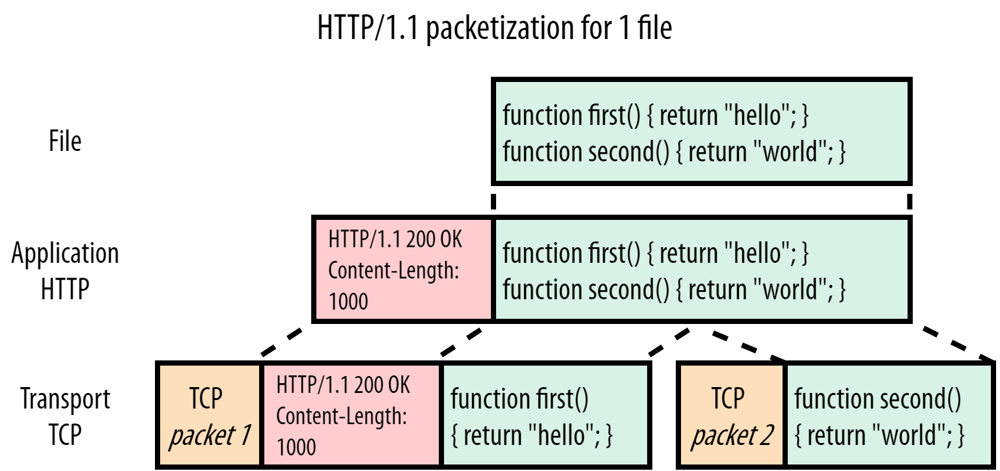
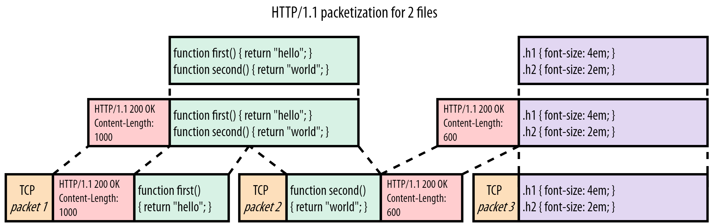
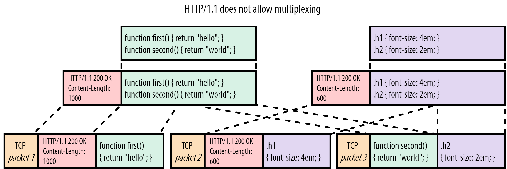
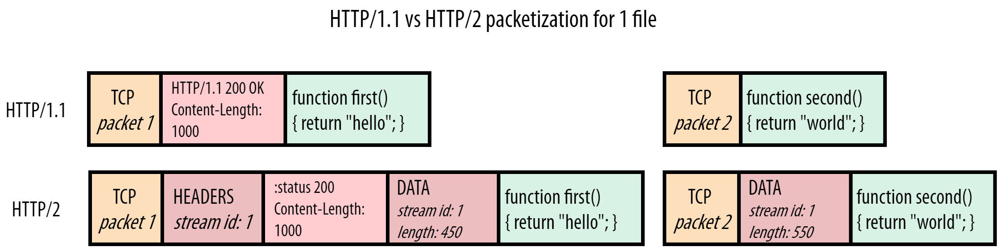
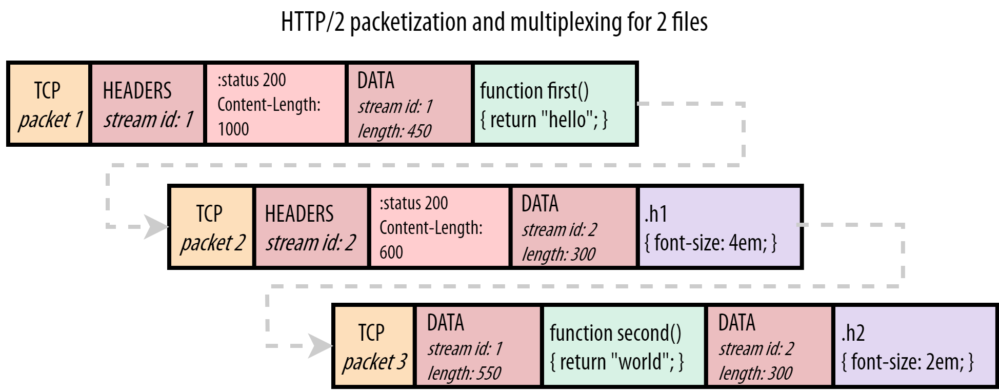
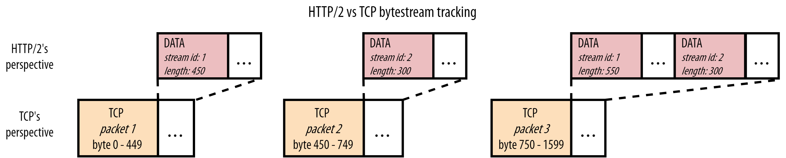

# QUIC 和 HTTP/3 中的队头阻塞:细节

与 HTTP/2 相比，HTTP/3 有望在性能上有重大改进，**主要是因为它（QUIC）将其底层传输协议从 TCP 改为 UDP**。在这篇文章中，我们将深入研究这些改进之一，即消除 "队头阻塞"（HOL阻塞）问题。这很有用，因为我读到过很多关于这些误解，以及它在实践中有多大的帮助。解决 HOL 阻塞问题不仅是 HTTP/3 和 QUIC 的主要动机之一，也是 HTTP/2 的主要动机之一，所以它对协议演进的原因也给出了一个很好的见解。

## 什么是队头阻塞（Head-of-Line Blocking）

很难给你一个关于 HOL 阻塞的技术定义，因为仅这篇博文就描述了它的四种不同变化。然而，一个简单的定义是。

> 当一个单一的（缓慢的）对象阻止其他/跟随的对象取得进展时

一个很好的现实生活中的比喻是一家只有一个结账柜台的杂货店。一个买了很多东西的顾客最终会耽误他们后面的人，因为顾客是以先进先出的方式来服务的。另一个例子是一条只有一条车道的高速公路。在这条路上，一辆车的碰撞最终会使整个通道堵塞很长时间。因此，即使是"头(Head)"上的一个问题也会"堵(Blocking)"住整条"线(Line)"。

这个概念一直是最难解决的网络性能问题之一。为了理解这一点，让我们从它在我们信任的工作机中的化身开始：HTTP 1.1

## HTTP/1.1 中的队头阻塞

HTTP/1.1 是一个比较简单的协议。那时，协议仍然是基于文本的，在网络上是可读的。如下图1所示:



​				图1：server HTTP/1.1 响应 script.js

在这种情况下，浏览器通过 HTTP/1.1 请求简单的 script.js 文件（图中绿色部分），图1显示了服务器对该请求的响应。我们可以看到，HTTP 本身是很简单的：它只是在纯文本文件内容或"有效载荷"前面直接添加了一些文本"头"（图中红色部分）。然后，头信息+有效载荷被传递给底层的 TCP（橙色部分），以便实际传输到客户端。在这个例子中，让我们假设我们无法将整个文件装入一个TCP数据包，它必须被分成两部分。

注意：实际上，在使用 HTTPS 时，在 HTTP 和 TCP 之间还有一个安全层，通常使用 TLS 协议。然而，为了清楚起见，我们在这里省略了这一点。我确实在结尾处包括了一个额外的部分，详细介绍了针对 TLS 的 HOL 阻塞变体以及 QUIC 如何防止它。在阅读完正文后，请随意阅读它（以及其他补充部分）

现在让我们看看当浏览器也请求图2中的 style.css 时会发生什么：



​				图2: server *HTTP/1.1* 响应 script.js 和 style.css

在这种情况下，我们在传送完 script.js 的响应后发送 style.css（紫色部分）。style.css 的头信息和内容被简单地附加在 JS 文件之后。接收者使用 Content-Length 头来知道每个响应的结束和另一个响应的开始（在我们的简化例子中，script.js 有 1000 字节大，而 style.css 只有 600 字节）。

在这个有两个小文件的简单例子中，所有这些似乎都很合理。然而，想象一下 JS 文件比 CSS 大得多的情况（比如1MB 而不是 1KB）。在这种情况下，CSS 将不得不在下载整个 JS 文件之前等待，尽管它要小得多，因此可以提前解析/使用。更直接地观察这个问题，用数字1表示 large_script.js，用2表示 style.css，我们会得到这样的结果。

```
11111111111111111111111111111111111111122
```

你可以看到这就是一个队头阻塞问题的例子。现在你可能会想：这很容易解决! 只要让浏览器在 JS 文件之前请求 CSS 文件就可以了。然而，在请求时，浏览器没有办法预先知道这两个文件中哪一个最终会成为大文件。这是因为没有办法在 HTML 中指出一个文件有多大（HTML 工作组，这样做很好。``）。

这个问题的"真正"的解决方案是采用**多路复用（multiplexing）**。如果我们能将每个文件的有效载荷切割成更小的片段或"块(chunks)"，我们就能在线路上混合或"交错 "这些块：为 JS 发送一个块，为 CSS 发送一个块，然后再为 JS 发送一个块，等等，直到这些文件被下载。通过这种方法，较小的 CSS 文件将更早地被下载（并可使用），而较大的 JS 文件只被推迟一点。用数字表示，我们会得到。

```
12121111111111111111111111111111111111111
```

但遗憾的是，由于协议假设的一些基本限制，这种复用在 HTTP/1.1 中是不可能的。要理解这一点，我们甚至不需要一直查看大资源 vs 小资源场景，因为它已经在我们的示例中显示了两个较小的文件。考虑到图3，我们为两个资源只交错了 4 个块。



​				图3: server *HTTP/1.1* 多路复用 script.js 和 style.css

这里的主要问题是，HTTP/1.1 是一个纯粹的文本协议，只在有效载荷的前面附加了头信息。它没有做任何事情来进一步区分各个（块）资源的不同。让我们用一个例子来说明，如果我们尝试这样做会发生什么。在图3中，浏览器开始解析 script.js 的头信息，并期望接下来有 1000 字节的有效载荷（Content-Length）。然而，它只收到 450 个 JS 字节（第一块），然后开始读取 style.css 的头文件。它最终将 CSS 头文件和第一个 CSS 块解释为 JS 的一部分，因为这两个文件的有效载荷和头文件都只是纯文本。更糟糕的是，它在读取 1000 个字节后就停止了，最后在第二个 script.js 块的某个地方停止了读取。在这一点上，它没有看到有效的新头信息，不得不放弃 TCP 数据包3的其余部分。然后，浏览器将它认为是 script.js 的东西传给 JS 解析器，解析器失败了，因为它不是有效的 JavaScript：

```
function first() { return "hello"; }
HTTP/1.1 200 OK
Content-Length: 600

.h1 { font-size: 4em; }
func
```

同样，你可以说有一个简单的解决方案：让浏览器寻找 `HTTP/1.1 {statusCode}{statusString}\n` 模式，看看新的头块何时开始。这可能对 TCP 数据包2有效，但在数据包3中会失败：浏览器怎么会知道绿色的 script.js 块在哪里结束，紫色的 style.css 块在哪里开始？

这是 HTTP/1.1 协议设计方式的一个基本限制。如果你有一个单一的 HTTP/1.1 连接，资源响应总是必须在你切换到发送新的资源之前被完整地交付。如果早期的资源创建得很慢（例如，动态生成的 index.html 是由数据库查询填充的），或者如上所述，如果早期的资源很大，这可能会导致严重的 HOL 阻塞问题。

这就是为什么浏览器开始在 HTTP/1.1 上为每个页面加载打开多个并行 TCP 连接(通常是 6 个)。这样一来，请求就可以分布在这些单独的连接上，而不再有 HOL阻塞。也就是说，除非你每个页面有超过 6 个资源...这当然是很常见的。这就是在多个域（img.mysite.com、static.mysite.com 等）和内容交付网络（CDN）上"分片"你的资源的做法的来源。由于每个单独的域有 6 个连接，浏览器在每个页面加载时将总共打开 30 个左右的 TCP 连接。这很有效，但有相当大的开销：建立一个新的 TCP 连接可能很昂贵（例如在服务器的状态和内存方面，以及设置 TLS 加密的计算），并需要一些时间（特别是对于 HTTPS 连接，因为 TLS 需要自己的握手）。

由于这个问题无法用 HTTP/1.1 来解决，而且并行 TCP 连接的补丁解决方案随着时间的推移也没有太好的扩展，显然需要一个全新的方法，这就是 HTTP/2。

注意：读到这里的守旧派读者可能会对 HTTP/1.1 的管道化感到好奇。我决定不在这里讨论这个问题，以保持整个故事的流畅性，但对更多技术深度感兴趣的人可以阅读最后的补充部分

## HTTP/2 over TCP 的 HOL 阻塞

所以，让我们来回顾一下。HTTP/1.1 有一个 HOL 阻塞的问题，**一个大的或慢的响应会延迟后面的其他响应。这主要是因为该协议在本质上是纯文本的，在资源块之间不使用分隔符。作为一种变通方法，浏览器会打开许多平行的 TCP 连接，这并不高效，也无法扩展。**

因此，HTTP/2 的目标非常明确：通过解决 HOL阻塞的问题，使我们能够重新回到单一的 TCP 连接。换句话说：我们要实现资源块的适当复用。这在 HTTP/1.1 中是不可能的，因为没有办法辨别一个块属于哪个资源，或者它在哪里结束，另一个在哪里开始。**HTTP/2 很好地解决了这个问题，它在资源块之前预留了小的控制信息，称为帧**。这可以在图4中看到：



​				*图4: server HTTP/1.1 vs HTTP/2 响应 script.js*

HTTP/2 在每个块的前面放一个所谓的 DATA 帧。这些 DATA 帧主要包含两个关键的元数据。第一：下面的块属于哪个资源。每个资源的 "bytestream" 都被分配了一个唯一的数字，即流ID。第二：下面的块有多大。该协议还有许多其他的帧类型，其中图5还显示了 HEADERS 帧。这又是用流ID来表示这些头信息属于哪个响应，所以头信息甚至可以从其实际的响应数据中分割出来。

使用这些帧，可以得出 HTTP/2 确实允许在一个连接上正确地多路复用多个资源，见图5:



​				图5: *多路复用的 server HTTP/2 响应 script.js 和 style.css*

与我们图3的例子不同，浏览器现在可以完美地处理这种情况。它首先处理 script.js 的 HEADERS 帧，然后处理第一个 JS 块的 DATA 帧。从 DATA 帧中包含的块的长度来看，浏览器知道它只延伸到了 TCP 包1的末端，它需要从 TCP 包2开始寻找一个全新的帧。在那里，它确实找到了 style.css 的 HEADERS。下一个数据帧的流ID（2）与第一个 DATA 帧（1）不同，所以浏览器知道这属于一个不同的资源。同样的情况也发生在 TCP 数据包3中，其中的 DATA 帧流ID被用来"多路复用"响应块，使其成为正确的资源"流"。

通过“帧化”单个消息，HTTP/2 比 HTTP/1.1 灵活得多。它允许多个资源在单个 TCP 连接上以多路复用的方式发送，方法是将它们的块交织在一起。它还解决了第一个资源速度慢的情况下的 HOL阻塞问题：与其等待数据库支持的 index.html 生成，服务器可以在等待 index.html 的同时简单地开始为其他资源发送数据。

HTTP/2 方法的一个重要结果是，我们突然还需要一种方法，让浏览器向服务器传达它希望单个连接的带宽如何在资源之间分配。换句话说：资源块应该如何被"安排"或交错使用。如果我们再次用 1 和 2 来描述这个问题，我们会发现，对于 HTTP/1.1 来说，唯一的选择是 11112222（我们称之为顺序）。然而，HTTP/2 有更多的自由:

- 公平的多路复用(例如两个渐进式 jpeg): 12121212
- 加权多路复用(2 比 1 重要两倍):221221221
- 反向顺序调度(例如2 是一个关键的服务器推送资源):22221111
- 局部调度(流1被中止，没有全部发送):112222

使用哪种方式是由 HTTP/2 中所谓的"优先级"系统驱动的，所选择的方式会对网络性能产生很大影响。然而，这本身就是一个非常复杂的话题，你并不需要在这篇博文的其余部分了解它，所以我在这里就不说了（尽管我在 [YouTube 上有一个关于这个问题的广泛讲座](https://www.youtube.com/watch?v=nH4iRpFnf1c)）。

我想你会同意，通过 HTTP/2 的帧和它的优先级设置，它确实解决了 HTTP/1.1 的 HOL 阻塞问题。这意味着我在这里的工作已经完成，我们都可以回家了。对吗？嗯，没有那么快，bucko。**我们已经解决了HTTP/1.1 的 HOL 阻塞问题，是的，但是 TCP 的 HOL 阻塞问题呢？**

## TCP HOL 阻塞

事实证明，HTTP/2 只解决了 HTTP 级别的 HOL 阻塞，我们可以称之为“应用层” HOL 阻塞。然而，在典型的网络模型中，还有其他层次需要考虑。在图6中可以清楚地看到这一点:


​					图6: *典型网络模型中的前几个协议层*。

HTTP 处于顶层，但首先由安全层的 TLS 支持（见补充 TLS 部分），而 TLS 又由传输层的 TCP 承载。这些协议中的每一个都用一些元数据来包装来自上面那一层的数据。例如，TCP 数据包头被添加到我们的HTTP(S)数据中，然后被放到 IP 数据包中等等。这使得协议之间有一个相对整洁的分离。这反过来又有利于它们的重复使用：像 TCP 这样的传输层协议不必关心它所传输的数据类型（可能是 HTTP，可能是 FTP，可能是 SSH，谁知道呢），而 IP 对 TCP 和 UDP 都能正常工作。

然而，如果我们想在一个 TCP 连接上复用多个 HTTP/2 资源，这确实有重要的影响。请看图7：



​					图7: HTTP/2 和 TCP 的不同之处

虽然我们和浏览器都知道我们在获取 JavaScript 和 CSS 文件，但即使是 HTTP/2 也不（需要）知道这些。它所知道的是，它正在处理来自不同资源流ID的块。**然而，TCP甚至不知道它正在传输 HTTP！**它所知道的是它已经被传送了。所有 TCP 知道的是，它已经得到了一系列的字节，它必须从一台计算机到另一台计算机。为此，它使用一定的最大尺寸的数据包，通常是 1450 字节左右。每个数据包只是跟踪它所携带的数据的哪一部分（字节范围），所以原始数据可以按照正确的顺序进行重建。

换句话说，这两层之间的视角不匹配：**HTTP/2 看到的是多个独立的资源字节流，但 TCP 看到的只是一个单一的、不透明的字节流。**图7的 TCP 数据包3就是一个例子：TCP 只知道它在传输 750 字节到 1599 字节的东西。另一方面，HTTP/2 知道在数据包3中实际上有两个独立资源的两个块。(注：实际上，每个 HTTP/2 帧（如 DATA 和 HEADERS）的大小也是几个字节。为了简单起见，我在这里没有计算那个额外的开销或 HEADERS 帧，以使数字更直观）。

所有这些可能看起来是不必要的细节，直到你意识到互联网是一个根本不可靠的网络。数据包在从一个端点到另一个端点的传输过程中可能会丢失和延迟。这正是 TCP 如此受欢迎的原因之一：它在不可靠的 IP 之上确保可靠性。它很简单地通过**重发丢失数据包的副本**来做到这一点。

我们现在可以理解这如何导致传输层的 HOL 阻塞。再考虑一下图7，问问自己：如果 TCP 数据包2在网络中丢失了，但数据包1和数据包3确实到达了，会发生什么？请记住，TCP 并不知道它正在传输 HTTP/2，只是知道它需要按顺序传输数据。因此，它知道数据包1的内容可以安全使用，并将其传递给浏览器。然而，它发现数据包1中的字节与数据包3中的字节（数据包2的位置）之间有一个缺口，因此还不能将数据包3传给浏览器。TCP 将数据包3保留在接收缓冲区中，直到它收到数据包2的重传副本（这至少需要往返服务器一次），之后它可以按正确的顺序将这两个数据包传给浏览器。换句话说：**丢失的数据包2是 HOL 阻塞了数据包3!**

我们可能不清楚这为什么是个问题，所以让我们更深入地研究一下图7中 HTTP 层的 TCP 数据包里到底有什么。我们可以看到，TCP 数据包2只携带了流ID 2（CSS文件）的数据，数据包3携带了流1（JS 文件）和流2的数据。在 HTTP 层面上，我们知道这两个数据流是独立的，并由 DATA 帧明确划分。因此，理论上我们可以完美地将数据包3传递给浏览器，而不需要等待数据包2的到来。浏览器会看到流ID 1的 DATA 帧，并能够直接使用它。只有流2必须被暂停，等待数据包2的重传。这将比我们从 TCP 的方法中得到的更有效，因为后者最终会阻塞流1和流2。

另一个例子是，数据包1丢失了，但 2 和 3 被收到。TCP 会再次保留2和3号数据包，等待1号。然而，我们可以看到，在 HTTP/2 层面，流2（CSS文件）的数据完全存在于数据包2和3中，不必等待数据包1的重传。浏览器本可以完美地解析/处理/使用 CSS 文件，但却被困在了等待 JS 文件的重传中。

总之，TCP 不知道 HTTP/2 的独立流的事实意味着 TCP 层 HOL 阻塞(由于丢失或延迟数据包)也最终导致 HOL 阻塞 HTTP!

现在，你可能会问自己：那么这有什么意义呢？如果我们仍然有 TCP HOL 阻塞，为什么还要做 HTTP/2？嗯，主要原因是，虽然网络上确实会发生丢包，但它仍然是相对罕见的。特别是在高速的有线网络上，丢包率在 0.01% 左右。即使是在最差的蜂窝网络上，你也很少看到实际的丢包率高于2%。再加上丢包和抖动（网络中的延迟变化），往往是突发性的。2%的丢包率并不意味着每100个数据包中总有2个被丢失（例如第42和第96个数据包）。在实践中，它可能更像是在总共 500 个数据包中连续丢失10个（例如数据包nr 255至265）。这是因为数据包丢失通常是由网络路径中的路由器的内存缓冲区暂时溢出造成的，它们开始丢弃它们无法存储的数据包。不过，这些细节在这里并不重要（但如果你想知道更多，可以在其他地方找到）。重要的是：是的，TCP HOL 阻塞是真实存在的，但它对网络性能的影响比 HTTP/1.1 HOL 阻塞小得多，因为你几乎保证每次都会遇到 HTTP HOL 阻塞，而且它也受到 TCP HOL 阻塞的影响。

然而，这主要是在单一连接上的 HTTP/2 与单一连接上的 HTTP/1.1 进行比较时才会如此。正如我们之前所看到的，实际情况并不是这样的，因为 HTTP/1.1 通常会打开多个连接。这使得 HTTP/1.1 不仅在一定程度上缓解了 HTTP 层面的问题，而且也缓解了 TCP 层面的 HOL 阻塞。因此，在某些情况下，单个连接上的 HTTP/2 很难比 6 个连接上的 HTTP/1.1 快，甚至和 HTTP/1.1 一样快。这主要是由于TCP的"拥堵控制"机制。然而，这又是一个非常深刻的话题，不是我们讨论 HOL 阻塞的核心，所以我把它移到了最后的另一个补充部分，供有兴趣的人参考。

总而言之，在实践中，我们看到（也许是出乎意料的），目前在浏览器和服务器中部署的 HTTP/2 在大多数情况下通常和 HTTP/1.1 一样快或稍快。在我看来，这部分是因为网站在为 HTTP/2 进行优化方面做得更好，部分是因为浏览器仍然经常打开多个平行的 HTTP/2 连接（因为网站仍然在不同的服务器上分散资源，或者因为与安全有关的副作用），从而获得了两个世界的最佳状态。

然而，也有一些情况（尤其是在丢包率较高的较慢网络上），6 个连接上的 HTTP/1.1 仍然会胜过一个连接上的 HTTP/2，这往往是由于 TCP 级别的 HOL 阻塞问题。正是这一事实是开发新的 QUIC 传输协议作为 TCP 的替代品的一大动力。


## 原文链接

