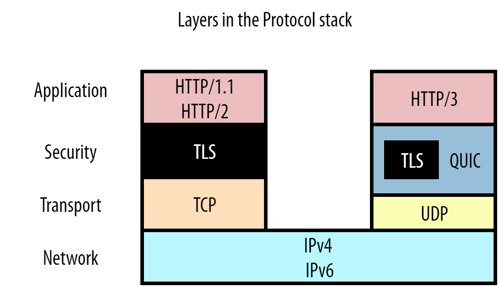

# QUIC 和 HTTP/3 中的队头阻塞:细节

与 HTTP/2 相比，HTTP/3 有望在性能上有重大改进，**主要是因为它（QUIC）将其底层传输协议从 TCP 改为 UDP**。在这篇文章中，我们将深入研究这些改进之一，即消除 "队头阻塞"（HOL阻塞）问题。这很有用，因为我读到过很多关于这些误解，以及它在实践中有多大的帮助。解决 HOL 阻塞问题不仅是 HTTP/3 和 QUIC 的主要动机之一，也是 HTTP/2 的主要动机之一，所以它对协议演进的原因也给出了一个很好的见解。

## 什么是队头阻塞（Head-of-Line Blocking）

很难给你一个关于 HOL 阻塞的技术定义，因为仅这篇博文就描述了它的四种不同变化。然而，一个简单的定义是。

> 当一个单一的（缓慢的）对象阻止其他/跟随的对象取得进展时

一个很好的现实生活中的比喻是一家只有一个结账柜台的杂货店。一个买了很多东西的顾客最终会耽误他们后面的人，因为顾客是以先进先出的方式来服务的。另一个例子是一条只有一条车道的高速公路。在这条路上，一辆车的碰撞最终会使整个通道堵塞很长时间。因此，即使是"头(Head)"上的一个问题也会"堵(Blocking)"住整条"线(Line)"。

这个概念一直是最难解决的网络性能问题之一。为了理解这一点，让我们从它在我们信任的工作机中的化身开始：HTTP 1.1

## HTTP/1.1 中的队头阻塞

HTTP/1.1 是一个比较简单的协议。那时，协议仍然是基于文本的，在网络上是可读的。如下图1所示:


​				图1：server HTTP/1.1 响应 script.js

在这种情况下，浏览器通过 HTTP/1.1 请求简单的 script.js 文件（图中绿色部分），图1显示了服务器对该请求的响应。我们可以看到，HTTP 本身是很简单的：它只是在纯文本文件内容或"有效载荷"前面直接添加了一些文本"头"（图中红色部分）。然后，头信息 + 有效载荷被传递给底层的 TCP（橙色部分），以便实际传输到客户端。在这个例子中，让我们假设我们无法将整个文件装入一个TCP数据包，它必须被分成两部分。

注意：实际上，在使用 HTTPS 时，在 HTTP 和 TCP 之间还有一个安全层，通常使用 TLS 协议。然而，为了清楚起见，我们在这里省略了这一点。我确实在结尾处包括了一个额外的部分，详细介绍了针对 TLS 的 HOL 阻塞变体以及 QUIC 如何防止它。在阅读完正文后，请随意阅读它（以及其他补充部分）

现在让我们看看当浏览器也请求图2中的 style.css 时会发生什么：


​				图2: server *HTTP/1.1* 响应 script.js 和 style.css

在这种情况下，我们在传送完 script.js 的响应后发送 style.css（紫色部分）。style.css 的头信息和内容被简单地附加在 JS 文件之后。接收者使用 Content-Length 头来知道每个响应的结束和另一个响应的开始（在我们的简化例子中，script.js 有 1000 字节大，而 style.css 只有 600 字节）。

在这个有两个小文件的简单例子中，所有这些似乎都很合理。然而，想象一下 JS 文件比 CSS 大得多的情况（比如1MB 而不是 1KB）。在这种情况下，CSS 将不得不在下载整个 JS 文件之前等待，尽管它要小得多，因此可以提前解析/使用。更直接地观察这个问题，用数字1表示 large_script.js，用2表示 style.css，我们会得到这样的结果。

```
11111111111111111111111111111111111111122
```

你可以看到这就是一个队头阻塞问题的例子。现在你可能会想：这很容易解决! 只要让浏览器在 JS 文件之前请求 CSS 文件就可以了。然而，在请求时，浏览器没有办法预先知道这两个文件中哪一个最终会成为大文件。这是因为没有办法在 HTML 中指出一个文件有多大（HTML 工作组，这样做很好。``）。

这个问题的"真正"的解决方案是采用**多路复用（multiplexing）**。如果我们能将每个文件的有效载荷切割成更小的片段或"块(chunks)"，我们就能在线路上混合或"交错 "这些块：为 JS 发送一个块，为 CSS 发送一个块，然后再为 JS 发送一个块，等等，直到这些文件被下载。通过这种方法，较小的 CSS 文件将更早地被下载（并可使用），而较大的 JS 文件只被推迟一点。用数字表示，我们会得到。

```
12121111111111111111111111111111111111111
```

但遗憾的是，由于协议假设的一些基本限制，这种复用在 HTTP/1.1 中是不可能的。要理解这一点，我们甚至不需要一直查看大资源 vs 小资源场景，因为它已经在我们的示例中显示了两个较小的文件。考虑到图3，我们为两个资源只交错了 4 个块。


​				图3: server *HTTP/1.1* 多路复用 script.js 和 style.css

这里的主要问题是，HTTP/1.1 是一个纯粹的文本协议，只在有效载荷的前面附加了头信息。它没有做任何事情来进一步区分各个（块）资源的不同。让我们用一个例子来说明，如果我们尝试这样做会发生什么。在图3中，浏览器开始解析 script.js 的头信息，并期望接下来有 1000 字节的有效载荷（Content-Length）。然而，它只收到 450 个 JS 字节（第一块），然后开始读取 style.css 的头文件。它最终将 CSS 头文件和第一个 CSS 块解释为 JS 的一部分，因为这两个文件的有效载荷和头文件都只是纯文本。更糟糕的是，它在读取 1000 个字节后就停止了，最后在第二个 script.js 块的某个地方停止了读取。在这一点上，它没有看到有效的新头信息，不得不放弃 TCP 数据包3的其余部分。然后，浏览器将它认为是 script.js 的东西传给 JS 解析器，解析器失败了，因为它不是有效的 JavaScript：

```
function first() { return "hello"; }
HTTP/1.1 200 OK
Content-Length: 600

.h1 { font-size: 4em; }
func
```

同样，你可以说有一个简单的解决方案：让浏览器寻找 `HTTP/1.1 {statusCode}{statusString}\n` 模式，看看新的头块何时开始。这可能对 TCP 数据包2有效，但在数据包3中会失败：浏览器怎么会知道绿色的 script.js 块在哪里结束，紫色的 style.css 块在哪里开始？

这是 HTTP/1.1 协议设计方式的一个基本限制。如果你有一个单一的 HTTP/1.1 连接，资源响应总是必须在你切换到发送新的资源之前被完整地交付。如果早期的资源创建得很慢（例如，动态生成的 index.html 是由数据库查询填充的），或者如上所述，如果早期的资源很大，这可能会导致严重的 HOL 阻塞问题。

这就是为什么浏览器开始在 HTTP/1.1 上为每个页面加载打开多个并行 TCP 连接(通常是 6 个)。这样一来，请求就可以分布在这些单独的连接上，而不再有 HOL阻塞。也就是说，除非你每个页面有超过 6 个资源...这当然是很常见的。这就是在多个域（img.mysite.com、static.mysite.com 等）和内容交付网络（CDN）上"分片"你的资源的做法的来源。由于每个单独的域有 6 个连接，浏览器在每个页面加载时将总共打开 30 个左右的 TCP 连接。这很有效，但有相当大的开销：建立一个新的 TCP 连接可能很昂贵（例如在服务器的状态和内存方面，以及设置 TLS 加密的计算），并需要一些时间（特别是对于 HTTPS 连接，因为 TLS 需要自己的握手）。

由于这个问题无法用 HTTP/1.1 来解决，而且并行 TCP 连接的补丁解决方案随着时间的推移也没有太好的扩展，显然需要一个全新的方法，这就是 HTTP/2。

注意：读到这里的守旧派读者可能会对 HTTP/1.1 的管道化感到好奇。我决定不在这里讨论这个问题，以保持整个故事的流畅性，但对更多技术深度感兴趣的人可以阅读最后的补充部分

## HTTP/2 over TCP 的 HOL 阻塞

所以，让我们来回顾一下。HTTP/1.1 有一个 HOL 阻塞的问题，**一个大的或慢的响应会延迟后面的其他响应。这主要是因为该协议在本质上是纯文本的，在资源块之间不使用分隔符。作为一种变通方法，浏览器会打开许多平行的 TCP 连接，这并不高效，也无法扩展。**

因此，HTTP/2 的目标非常明确：通过解决 HOL阻塞的问题，使我们能够重新回到单一的 TCP 连接。换句话说：我们要实现资源块的适当复用。这在 HTTP/1.1 中是不可能的，因为没有办法辨别一个块属于哪个资源，或者它在哪里结束，另一个在哪里开始。**HTTP/2 很好地解决了这个问题，它在资源块之前预留了小的控制信息，称为帧**。这可以在图4中看到：


​				*图4: server HTTP/1.1 vs HTTP/2 响应 script.js*

HTTP/2 在每个块的前面放一个所谓的 DATA 帧。这些 DATA 帧主要包含两个关键的元数据。第一：下面的块属于哪个资源。每个资源的 "bytestream" 都被分配了一个唯一的数字，即流ID。第二：下面的块有多大。该协议还有许多其他的帧类型，其中图5还显示了 HEADERS 帧。这又是用流ID来表示这些头信息属于哪个响应，所以头信息甚至可以从其实际的响应数据中分割出来。

使用这些帧，可以得出 HTTP/2 确实允许在一个连接上正确地多路复用多个资源，见图5:


​				图5: *多路复用的 server HTTP/2 响应 script.js 和 style.css*

与我们图3的例子不同，浏览器现在可以完美地处理这种情况。它首先处理 script.js 的 HEADERS 帧，然后处理第一个 JS 块的 DATA 帧。从 DATA 帧中包含的块的长度来看，浏览器知道它只延伸到了 TCP 包1的末端，它需要从 TCP 包2开始寻找一个全新的帧。在那里，它确实找到了 style.css 的 HEADERS。下一个数据帧的流ID（2）与第一个 DATA 帧（1）不同，所以浏览器知道这属于一个不同的资源。同样的情况也发生在 TCP 数据包3中，其中的 DATA 帧流ID被用来"多路复用"响应块，使其成为正确的资源"流"。

通过“帧化”单个消息，HTTP/2 比 HTTP/1.1 灵活得多。它允许多个资源在单个 TCP 连接上以多路复用的方式发送，方法是将它们的块交织在一起。它还解决了第一个资源速度慢的情况下的 HOL阻塞问题：与其等待数据库支持的 index.html 生成，服务器可以在等待 index.html 的同时简单地开始为其他资源发送数据。

HTTP/2 方法的一个重要结果是，我们突然还需要一种方法，让浏览器向服务器传达它希望单个连接的带宽如何在资源之间分配。换句话说：资源块应该如何被"安排"或交错使用。如果我们再次用 1 和 2 来描述这个问题，我们会发现，对于 HTTP/1.1 来说，唯一的选择是 11112222（我们称之为顺序）。然而，HTTP/2 有更多的自由:

- 公平的多路复用(例如两个渐进式 jpeg): 12121212
- 加权多路复用(2 比 1 重要两倍):221221221
- 反向顺序调度(例如2 是一个关键的服务器推送资源):22221111
- 局部调度(流1被中止，没有全部发送):112222

使用哪种方式是由 HTTP/2 中所谓的"优先级"系统驱动的，所选择的方式会对网络性能产生很大影响。然而，这本身就是一个非常复杂的话题，你并不需要在这篇博文的其余部分了解它，所以我在这里就不说了（尽管我在 [YouTube 上有一个关于这个问题的广泛讲座](https://www.youtube.com/watch?v=nH4iRpFnf1c)）。

我想你会同意，通过 HTTP/2 的帧和它的优先级设置，它确实解决了 HTTP/1.1 的 HOL 阻塞问题。这意味着我在这里的工作已经完成，我们都可以回家了。对吗？嗯，没有那么快，bucko。**我们已经解决了HTTP/1.1 的 HOL 阻塞问题，是的，但是 TCP 的 HOL 阻塞问题呢？**

## TCP HOL 阻塞

事实证明，HTTP/2 只解决了 HTTP 级别的 HOL 阻塞，我们可以称之为“应用层” HOL 阻塞。然而，在典型的网络模型中，还有其他层次需要考虑。在图6中可以清楚地看到这一点:



​					图6: *典型网络模型中的前几个协议层*。

HTTP 处于顶层，但首先由安全层的 TLS 支持（见补充 TLS 部分），而 TLS 又由传输层的 TCP 承载。这些协议中的每一个都用一些元数据来包装来自上面那一层的数据。例如，TCP 数据包头被添加到我们的HTTP(S)数据中，然后被放到 IP 数据包中等等。这使得协议之间有一个相对整洁的分离。这反过来又有利于它们的重复使用：像 TCP 这样的传输层协议不必关心它所传输的数据类型（可能是 HTTP，可能是 FTP，可能是 SSH，谁知道呢），而 IP 对 TCP 和 UDP 都能正常工作。

然而，如果我们想在一个 TCP 连接上复用多个 HTTP/2 资源，这确实有重要的影响。请看图7：


​					图7: HTTP/2 和 TCP 的不同之处

虽然我们和浏览器都知道我们在获取 JavaScript 和 CSS 文件，但即使是 HTTP/2 也不（需要）知道这些。它所知道的是，它正在处理来自不同资源流ID的块。**然而，TCP甚至不知道它正在传输 HTTP！**它所知道的是它已经被传送了。所有 TCP 知道的是，它已经得到了一系列的字节，它必须从一台计算机到另一台计算机。为此，它使用一定的最大尺寸的数据包，通常是 1450 字节左右。每个数据包只是跟踪它所携带的数据的哪一部分（字节范围），所以原始数据可以按照正确的顺序进行重建。

换句话说，这两层之间的视角不匹配：**HTTP/2 看到的是多个独立的资源字节流，但 TCP 看到的只是一个单一的、不透明的字节流。**图7的 TCP 数据包3就是一个例子：TCP 只知道它在传输 750 字节到 1599 字节的东西。另一方面，HTTP/2 知道在数据包3中实际上有两个独立资源的两个块。(注：实际上，每个 HTTP/2 帧（如 DATA 和 HEADERS）的大小也是几个字节。为了简单起见，我在这里没有计算那个额外的开销或 HEADERS 帧，以使数字更直观）。

所有这些可能看起来是不必要的细节，直到你意识到互联网是一个根本不可靠的网络。数据包在从一个端点到另一个端点的传输过程中可能会丢失和延迟。这正是 TCP 如此受欢迎的原因之一：它在不可靠的 IP 之上确保可靠性。它很简单地通过**重发丢失数据包的副本**来做到这一点。

我们现在可以理解这如何导致传输层的 HOL 阻塞。再考虑一下图7，问问自己：如果 TCP 数据包2在网络中丢失了，但数据包1和数据包3确实到达了，会发生什么？请记住，TCP 并不知道它正在传输 HTTP/2，只是知道它需要按顺序传输数据。因此，它知道数据包1的内容可以安全使用，并将其传递给浏览器。然而，它发现数据包1中的字节与数据包3中的字节（数据包2的位置）之间有一个缺口，因此还不能将数据包3传给浏览器。TCP 将数据包3保留在接收缓冲区中，直到它收到数据包2的重传副本（这至少需要往返服务器一次），之后它可以按正确的顺序将这两个数据包传给浏览器。换句话说：**丢失的数据包2是 HOL 阻塞了数据包3!**

我们可能不清楚这为什么是个问题，所以让我们更深入地研究一下图7中 HTTP 层的 TCP 数据包里到底有什么。我们可以看到，TCP 数据包2只携带了流ID 2（CSS文件）的数据，数据包3携带了流1（JS 文件）和流2的数据。在 HTTP 层面上，我们知道这两个数据流是独立的，并由 DATA 帧明确划分。因此，理论上我们可以完美地将数据包3传递给浏览器，而不需要等待数据包2的到来。浏览器会看到流ID 1的 DATA 帧，并能够直接使用它。只有流2必须被暂停，等待数据包2的重传。这将比我们从 TCP 的方法中得到的更有效，因为后者最终会阻塞流1和流2。

另一个例子是，数据包1丢失了，但 2 和 3 被收到。TCP 会再次保留2和3号数据包，等待1号。然而，我们可以看到，在 HTTP/2 层面，流2（CSS文件）的数据完全存在于数据包2和3中，不必等待数据包1的重传。浏览器本可以完美地解析/处理/使用 CSS 文件，但却被困在了等待 JS 文件的重传中。

总之，TCP 不知道 HTTP/2 的独立流的事实意味着 TCP 层 HOL 阻塞(由于丢失或延迟数据包)也最终导致 HOL 阻塞 HTTP!

现在，你可能会问自己：那么这有什么意义呢？如果我们仍然有 TCP HOL 阻塞，为什么还要做 HTTP/2？嗯，主要原因是，虽然网络上确实会发生丢包，但它仍然是相对罕见的。特别是在高速的有线网络上，丢包率在 0.01% 左右。即使是在最差的蜂窝网络上，你也很少看到实际的丢包率高于2%。再加上丢包和抖动（网络中的延迟变化），往往是突发性的。2%的丢包率并不意味着每100个数据包中总有2个被丢失（例如第42和第96个数据包）。在实践中，它可能更像是在总共 500 个数据包中连续丢失10个（例如数据包nr 255至265）。这是因为数据包丢失通常是由网络路径中的路由器的内存缓冲区暂时溢出造成的，它们开始丢弃它们无法存储的数据包。不过，这些细节在这里并不重要（但如果你想知道更多，可以在其他地方找到）。重要的是：是的，TCP HOL 阻塞是真实存在的，但它对网络性能的影响比 HTTP/1.1 HOL 阻塞小得多，因为你几乎保证每次都会遇到 HTTP HOL 阻塞，而且它也受到 TCP HOL 阻塞的影响。

然而，这主要是在单一连接上的 HTTP/2 与单一连接上的 HTTP/1.1 进行比较时才会如此。正如我们之前所看到的，实际情况并不是这样的，因为 HTTP/1.1 通常会打开多个连接。这使得 HTTP/1.1 不仅在一定程度上缓解了 HTTP 层面的问题，而且也缓解了 TCP 层面的 HOL 阻塞。因此，在某些情况下，单个连接上的 HTTP/2 很难比 6 个连接上的 HTTP/1.1 快，甚至和 HTTP/1.1 一样快。这主要是由于TCP的"拥堵控制"机制。然而，这又是一个非常深刻的话题，不是我们讨论 HOL 阻塞的核心，所以我把它移到了最后的另一个补充部分，供有兴趣的人参考。

总而言之，在实践中，我们看到（也许是出乎意料的），目前在浏览器和服务器中部署的 HTTP/2 在大多数情况下通常和 HTTP/1.1 一样快或稍快。在我看来，这部分是因为网站在为 HTTP/2 进行优化方面做得更好，部分是因为浏览器仍然经常打开多个平行的 HTTP/2 连接（因为网站仍然在不同的服务器上分散资源，或者因为与安全有关的副作用），从而获得了两个世界的最佳状态。

然而，也有一些情况（尤其是在丢包率较高的较慢网络上），6 个连接上的 HTTP/1.1 仍然会胜过一个连接的 HTTP/2，这往往是由于 TCP 级别的 HOL 阻塞问题。正是这一事实是导致开发新的 QUIC 传输协议作为 TCP 的替代品的一大动力。

## HTTP/3 基于 QUIC 的 HOL 阻塞

现在我们终于准备好开始谈论新的东西了！但首先，让我们总结一下到目前为止我们学到了什么：

- HTTP/1.1 存在 HOL 阻塞，因为它需要完整地发送响应，而不能复用它们
- HTTP/2 通过引入”帧“来解决这个问题，该”帧“表示每个资源块属于哪个”流“
- 但是 TCP 不知道这些单独的“流”，只是将所有内容视为一个大流
- 如果一个 TCP 丢包了，后面所有的包都需要等待重传，即使它们包含来自不同流的不相关数据。TCP 有传输层 HOL 阻塞。

我敢肯定，你现在可以预测我们如何解决 TCP 的这个问题，对吗？毕竟，解决方案很简单：**我们"只"需要让传输层意识后续的包是不同的、独立的数据流！**这样，如果一个数据流的数据丢失，传输层就知道它不需要保留其他数据流。这样，如果一个流的数据丢失了，传输层本身就知道它不需要保留其他的流。

尽管这个解决方案在概念上很简单，但在实践中却很难实现。由于[各种原因](https://www.snia.org/educational-library/quic-%E2%80%93-will-it-replace-tcp-ip-2020)，不可能改变 TCP 本身以使其具有流感知能力。所选择的替代方法是**以 QUIC 的形式实现一个全新的传输层协议**。为了使 QUIC 能够在互联网上实际部署，它运行在不可靠的 UDP 协议之上。然而，非常重要的是，这并不意味着 QUIC 本身也是不可靠的! 在许多方面，QUIC 应该被看作是TCP 2.0。因为它包含 TCP 所有的功能（可靠性、拥塞控制、流量控制、排序等）以及更多其它功能。QUIC 还完全集成了 TLS（见图6），不允许未加密的连接。由于 QUIC 与 TCP 有很大不同，这也意味着我们不能在它上面运行 HTTP/2，这也是 HTTP/3 诞生的原因（我们稍后会更多地讨论这个问题）。如果不对 QUIC 进行更详细的讨论，这篇博文已经够长了（见[其他](https://www.youtube.com/watch?v=BazWPeUGS8M)[资料](https://www.youtube.com/watch?v=mDc2kHPtavE)[来源](https://www.youtube.com/watch?v=B1SQFjIXJtc)），所以我将只关注我们需要了解目前 HOL 阻塞讨论的几个部分。这些在图8中显示：


​								图8：*server HTTP/1.1 vs HTTP/2 vs HTTP/3 响应 script.js*

我们观察到，让 QUIC 意识到不同的流是非常简单的。QUIC 受到 HTTP/2 的“帧”方法的启发，也增加了自己的”帧“；在这种情况下，就是 STREAM 帧。以前在 HTTP/2 的 DATA 框架中的流ID，现在被下移到 QUIC 的 STREAM 框架中的传输层。这也说明了为什么我们需要一个新版本的 HTTP，如果我们想使用 QUIC 的原因之一：如果我们只是在 QUIC 上面运行 HTTP/2，我们将有两个（潜在的冲突）"流层(stream layers)"。而 HTTP/3 则从 HTTP 层中删除了流的概念（它的 DATA 帧中没有流 id），而是重新使用底层的QUIC 流。

> 注意：这并不意味着 QUIC 突然知道 JS 或 CSS 文件，甚至知道它在传输 HTTP；像 TCP 一样，QUIC 应该是一个通用的、可重复使用的协议。它只是知道有一些独立的流，它可以单独处理，而不必知道其中到底有什么。

现在我们已经了解了 QUIC 的 STREAM 帧，在图9中也很容易看到它们是如何帮助解决传输层 HOL阻塞的：


​											图9:TCP 和 QUIC 之间的差异

与 HTTP/2 的 DATA 帧非常相似，QUIC 的 STREAM 帧单独跟踪每个流的字节范围。这与 TCP 形成鲜明对比，后者只是将所有流数据附加在一个大对象中。像以前一样，让我们考虑一下如果 QUIC 数据包2丢失但1和3到达会发生什么。与 TCP 类似，数据包1中的数据流1可以直接传递给浏览器。然而，对于数据包3，QUIC 可以比 TCP 更聪明。它查看数据流1的字节范围，发现这个 STREAM 帧完全跟随数据流ID为1的第一个 STREAM 帧（第450字节跟随第449字节，因此数据中没有字节间隙）。它也可以立即将该数据交给浏览器处理。然而，对于流ID 2，QUIC 确实看到了一个缺口（它还没有收到0-299字节，这些是在丢失的 QUIC 数据包2中）。它将保留该 STREAM 帧，直到 QUIC 数据包2的重传到达。再对比一下 TCP，它也在包3中保留了流1的数据。

在另一种情况下也会发生类似情况，即数据包1丢失，但 2 和 3 到达。QUIC 知道它已经收到了流2的所有预期数据，并刚刚将其传递给浏览器，只保留了流1。我们可以看到，在这个例子中，QUIC 确实解决了 TCP 的 HOL阻塞问题！

但这种方法有几个重要的后果。最有影响的是，**QUIC 数据可能不再以与发送时完全相同的顺序传递给浏览器**。对于 TCP 来说，如果你发送数据包 1、2 和 3，它们的内容将完全按照这个顺序传递给浏览器（这就是首先导致 HOL 阻塞的原因）。但对于 QUIC 来说，在上面的第二个例子中，数据包1丢失了，浏览器首先看到的是数据包2的内容，然后是数据包3的最后一部分，然后是数据包1的（重传），然后是数据包3的第一部分。换句话说：**QUIC 保留了单个资源流中的排序，但不再保留单个流中的排序**。

这是需要 HTTP/3 的第二个，也可以说是最重要的原因，因为 HTTP/2 中的几个系统非常依赖 TCP 完全确定的跨流排序。例如，HTTP/2 的优先级系统通过传输改变树状数据结构布局的操作来工作（例如，将资源5作为资源6的一个子节点）。如果这些操作的应用顺序与它们的发送顺序不同（现在可以通过 QUIC 来实现），客户端和服务器最终可能会有不同的优先级状态。类似的情况也发生在 HTTP/2 的头压缩系统 HPACK 上。了解这里的具体细节并不重要，只是结论：事实证明，将这些 HTTP/2 系统直接适用于 QUIC 是非常困难的。因此，对于 HTTP/3，一些系统使用了完全不同的方法。例如，QPACK 是 HTTP/3 的 HPACK 版本，[允许在潜在的 HOL 阻塞和压缩性能之间进行自我选择的权衡](https://blog.litespeedtech.com/tag/quic-header-compression-design-team/)。HTTP/2 的优先级系统甚至被完全删除，可能会被 [HTTP/3 的一个简化版本](https://tools.ietf.org/html/draft-ietf-httpbis-priority-02)所取代。所有这些都是因为，与 TCP 不同，QUIC 并不能完全保证先发送的数据也能先收到。

因此，在 QUIC 上所做的所有工作和重新设计的 HTTP 版本只是为了消除传输层 HOL 阻塞。我当然希望这是值得的...

### QUIC 和 HTTP/3 真的完全消除了 HOL 阻塞吗？

如果你允许我说一些不好的话，我想引用几段话：

> QUIC 保留了单一资源流中的顺序（**QUIC retains ordering within a single resource stream**）

仔细想想，这是很符合逻辑的。它基本上是说：如果你有一个 JavaScript 文件，该文件需要完全按照开发者（或者，说实话，由 webpack）创建的方式重新组装，否则代码将无法工作。任何类型的文件都是如此：把一张图片以随机的顺序重新组合起来，将意味着你的姑姑会给你一些相当奇怪的数字圣诞卡（甚至是更奇怪的）。**这意味着我们仍然有一种 HOL 阻塞的形式，即使在 QUIC 中也是如此**：如果在一个单一的流内有一个字节的间隙，流的后面部分仍然停留在等待，直到这个间隙被填补。

这有一个重要的含义。**QUIC 的 HOL 阻塞去除功能只有在有多个资源流同时活动时才起作用**。这样一来，如果其中一个流出现丢包，其他流仍能取得进展。这就是我们在上面图9的例子中看到的情况。然而，如果在某一时刻只有一个流在活动，任何损失都会影响到那个孤独的流，我们仍然会被 HOL 阻塞，即使是在 QUIC 中。因此，真正的问题是：**我们有多少次处于同时有多个数据流的情况？**

[正如对 HTTP/2 所解释的那样](#HTTP/2 over TCP 的 HOL 阻塞)，这是可以通过使用适当的资源调度器/多路复用方法来配置的。流1和流2可以发送 1122、2121、1221 等，浏览器可以使用优先级系统指定它希望服务器遵循的方案（这对 HTTP/3 来说仍然如此）。因此，浏览器可以说。嘿！我注意到这个连接上有严重的数据包丢失。我要让服务器以 121212 的模式向我发送资源，而不是111222。这样一来，如果1号的单个数据包丢失，2 号仍然可以取得进展。然而，这样做的问题是，**121212 模式（或类似模式）往往不是资源加载性能的最佳选择**。

这又是一个复杂的话题，我现在不想太深究（我确实在 [YouTube 上有一个关于这个问题的展开演讲](https://www.youtube.com/watch?v=nH4iRpFnf1c)，供有兴趣的人参考）。然而，通过我们的 JS 和 CSS 文件的简单例子，基本概念是很容易理解的。你可能知道，浏览器需要接收整个 JS 或 CSS 文件，然后才能真正执行/应用它（虽然有些浏览器已经可以开始编译/解析部分下载的文件，但它们仍然需要等待它们完成后才能真正使用它们）。然而，对这些文件的资源块进行大量的多路复用，最终会使它们都被延迟：

```
With multiplexing (slower):
---------------------------
                              流1只有到了这里才能使用
                              ▼	
12121212121212121212121212121212
                               ▲
                               流2在这里下载完毕

Without multiplexing/sequential (faster for stream 1):
------------------------------------------------------
                 流1在这里下载完毕，可以更早的使用
                 ▼			   
11111111111111111122222222222222
                               ▲
                               流2还是在这里下载完毕
```

现在，这个话题有很多细微的差别，当然也有多路复用方法更快的情况（例如，如果其中一个文件比另一个文件小得多，正如本帖早期讨论的那样）。然而，一般来说，对于大多数页面和大多数资源类型，我们可以说顺序的方法是最好的（再次，见上面的 YouTube 链接，了解更多相关信息）。

现在，这意味着什么呢？**这意味着我们有两个相互冲突的建议来实现最佳性能：**

1. 从 QUIC 的 HOL 阻塞移除中获利：发送多路复用资源(12121212)
2. 为了确保浏览器能够尽快处理核心资源：按顺序发送资源(11112222)

哪一个是正确的？或者至少是：其中哪一个应该优先于其他？遗憾的是，我现在不能给你一个明确的答案，因为这是我正在研究的一个课题。造成这种困难的主要原因是，**丢包模式很难预测。**

如我们上面所讨论的，数据包丢失往往是突发性的，而且是分组的。这意味着我们上面的 121212 的例子已经过于简化。图10 给出了一个更现实一点的概述。在这里，我们假设我们在下载两个数据流（绿色和紫色）时，有 8 个丢失的数据包的突发情况：


​			图10:流复用对 HTTP/3 over QUIC 中的 HOL 阻塞预防的影响。每个方块是一个单独的 QUIC 数据包，携带一个流的数据。红叉表示丢失的数据包。

在图10的最上面一行，我们看到的是对资源加载性能（通常）更好的顺序情况。在这里，我们看到 QUIC 的 HOL 阻塞消除确实没有什么帮助：损失后收到的绿色数据包不能被浏览器处理，因为它们属于发生损失的同一个流。第二个（紫色）数据流的数据还没有被收到，所以不能被处理。

这与中间一行不同，其中（偶然！）8 个丢失的数据包都来自绿色流。这意味着，最后收到的紫色数据包现在可以被浏览器处理。然而，正如之前所讨论的，如果是一个 JS 或 CSS 文件，如果有更多的紫色数据到来，浏览器可能不会从中受益太多。因此，在这里，我们从 QUIC 的 HOL 阻塞消除中得到了一些好处（因为紫色没有被绿色阻塞），但可能会牺牲整体的资源加载性能（因为多路复用导致文件较晚完成）。

最下面一行几乎是最糟糕的情况。8 个丢失的数据包分布在两个数据流中。这意味着两个流现在都被 HOL 阻塞了：不是因为它们在互相等待，就像 TCP 的情况一样，而是因为每个流仍然需要自己排序。

注意：这也是为什么大多数 QUIC 实现很少同时创建包含 1 个以上数据流的数据包。如果其中一个数据包丢失，会立即导致单个数据包中所有流的 HOL 阻塞

因此，因此，我们看到可能存在某种最佳点(中间一行)，，在这里，防止 HOL 阻塞和资源加载性能之间的权衡可能是值得的。然而，正如我们所说，损失模式是很难预测的。它不会永远是 8 个数据包。他们不会总是相同的 8 个数据包。如果我们弄错了，丢失的数据包只是向左移动了一个，我们突然也有一个紫色的数据包丢失，这基本上使我们降级到类似于底层行的东西...

我想你会同意我的看法，这听起来相当复杂，甚至可能太复杂。即使如此，问题是它会有多大帮助。正如之前所讨论的，在许多网络类型上，数据包丢失通常是相对罕见的，可能（可能？）太罕见了，以至于 QUIC 的 HOL 阻塞功能无法产生太大的影响。另一方面，[已经有充分的证据表明](https://blog.cloudflare.com/better-http-2-prioritization-for-a-faster-web/)，无论你使用的是 HTTP/2 还是 HTTP/3，逐个包复用资源（图10的第三行）对资源加载性能是相当糟糕的。

因此，人们可能会说，虽然 QUIC 和 HTTP/3 不再遭受应用或传输层 HOL 阻塞，但这在实践中可能并不那么重要。我不能肯定地说，因为我们还没有完全完成 QUIC 和 HTTP/3 的实现，所以我没有最终的测量结果。然而，我个人的直觉（这是由我的几个早期实验的结果支持的）说，**QUIC 的 HOL 阻塞去除可能实际上不会对网络性能有太大的帮助**，因为理想情况下，为了资源加载性能，无论如何都不希望许多流被多路复用。而且，如果你确实希望它运行良好，你必须非常聪明地根据连接类型调整你的多路复用方法，因为你肯定不希望在丢包率很低的快速网络上进行大量的多路复用（因为它们无论如何都不会遭受很多 HOL 阻塞）。就个人而言，我不认为会发生这种情况。

注意：在这里，在最后，你可能已经注意到我的故事有点不一致。在开头，我说 HTTP/1.1 的问题是它不允许复用。到了最后，我又说复用在实践中并不那么重要。为了帮助解决这个明显的矛盾，我又增加了一个[补充部分]()

## 归纳与总结

在这篇（很长，我知道）文章中，我们通过时间追踪了 HOL 阻塞。我们首先讨论了为什么 HTTP/1.1 受到应用层 HOL 阻塞的影响。这主要是因为 HTTP/1.1 没有办法识别单个资源的块。HTTP/2 使用帧来标记这些块，并启用多路复用。这解决了 HTTP/1.1 的问题，但遗憾的是，HTTP/2 仍然受到底层 TCP 的限制。因为 TCP 将 HTTP/2 数据抽象为一个单一的、有序的、但不透明的数据流，如果数据包在网络上丢失或严重延迟，它将遭受一种 HOL 阻塞的形式。QUIC 通过将 HTTP/2 的一些概念下放到传输层来解决这个问题。这反过来又产生了严重的影响，因为跨流的数据不再是完全有序的。这最终导致需要一个全新的 HTTP/3，它只在 QUIC 之上运行（而 HTTP/2 只在 TCP 之上运行，也见图6）。

我们需要所有这些背景来批判性地思考 QUIC（以及 HTTP/3）中的 HOL 阻塞移除在实践中对网络性能有多少帮助。我们看到，它可能只对有大量数据包丢失的网络有很大影响。我们还讨论了为什么，即使这样，您也需要多路复用资源，以及损失是如何影响多路复用的。我们看到了为什么这实际上是弊大于利，因为资源复用通常不是网络性能的最佳主意。我们的结论是，虽然现在确定还有点早，**但在大多数情况下，QUIC 和 HTTP/3 的 HOL 阻塞移除可能不会对网络性能有什么影响。**

那么...这让我们这些网络性能爱好者情何以堪？忽略 QUIC 和 HTTP/3，坚持使用 HTTP/2+TCP？我当然希望不会！**我仍然相信 HTTP/3 总体上会比 HTTP/2 快**。我仍然相信 HTTP/3 总体上会比 HTTP/2 快，因为 QUIC 还包括其他性能改进。例如，它在线路上的开销比 TCP 少，在拥塞控制方面更灵活，最重要的是，有 0-RTT 连接建立功能。**我觉得，特别是 0-RTT 将提供最多网络性能的好处，尽管那里也有很多挑战**。我将在将来再写一篇关于 0-RTT 的博文，但如果你迫不及待地想知道更多关于防止放大、重放攻击、初始拥塞窗口大小等问题，请观看[我的另一个 YouTube 讲座](https://youtu.be/pq_xk_Pecu4?t=1335)或阅读我[最近的论文](https://qlog.edm.uhasselt.be/epiq/files/QUICImplementationDiversity_Marx_final_11jun2020.pdf)。

## 补充：HTTP/1.1 管道化

HTTP/1.1 包括一个叫做"管道"的功能，在我看来，它经常被误解。我见过很多帖子，甚至是书，人们声称 HTTP/1.1 的管道解决了 HOL 阻塞的问题。我甚至看到一些人说，管道与适当的复用是一样的。这两种说法都是[错误](https://theofficeanalytics.files.wordpress.com/2017/11/dwight.jpeg?w=1200)的。

我发现用一个图1中的插图来解释 HTTP/1.1 管道是最简单的：


​														补图1：*HTTP/1.1 管道*

如果没有管道（补图1的左侧），浏览器就必须等待发送第二个资源请求，直到完全收到第一个请求的响应（同样使用内容长度）。这就为每个请求增加了一个往返时间（RTT）的延迟，这对网络性能是不利的。

有了管道（补图1的中间部分），浏览器不需要等待任何响应数据，现在可以连续发送请求。这样，我们在连接过程中节省了一些 RTT，使加载过程更快。顺便提一下，回头看看图2：你看到那里实际上也使用了管道，因为服务器在 TCP 包2中捆绑了来自 `script.js` 和 `style.css` 响应的数据。当然，这只有在服务器同时收到这两个请求时才有可能。

然而，最重要的是，这种管道化只适用于来自浏览器的请求。正如 [HTTP/1.1规范][h1spec] 所说：

> 服务器必须按照收到请求的相同顺序发送其对这些[管道化]请求的响应。

因此，我们看到响应块的实际多路复用（在补图1的右侧说明）在 HTTP/1.1 管道中仍然是不可能的。换句话说：**管道解决了请求的 HOL 阻塞问题，但没有解决响应的问题**。遗憾的是，可以说是响应的 HOL 阻塞是导致 Web 性能的最大问题。

更糟糕的是，大多数浏览器在实践中并不使用 HTTP/1.1 管道，因为在多个并行 TCP 连接设置中，它可以使 HOL 阻塞更加不可预测。为了理解这一点，让我们想象一下这样的设置：三个文件A（大）、B（小）和 C（小）正在通过两个 TCP 连接从服务器上被请求。A 和 B 分别在一个不同的连接上被请求。现在，浏览器应该在哪个连接上对 C 的请求进行处理？正如我们之前所说，它事先并不知道 A 或 B 会是最大/最慢的资源。

如果它猜对了（B），它可以在传输 A 的时间内同时下载 B 和 C，从而获得不错的速度。但是，如果猜错了（A），B 的连接就会空闲很长时间，而 C 则被 A 后面的 HOL 阻塞了。这是因为 HTTP/1.1 也没有提供一种方法来"中止"已经发送的请求（HTTP/2 和 HTTP/3 确实允许这样做）。因此，一旦发现 B 的连接会更快，浏览器不能简单地在 B 的连接上请求 C，因为它最终会请求 C 两次。

为了解决这些问题，现代浏览器不采用管道，甚至会主动推迟对某些已发现的资源（例如图像）的请求，看是否找到了更重要的文件（例如 JS 和 CSS），以确保高优先级的资源不会被 HOL 阻塞。

很明显，HTTP/1.1 管道化的失败是 HTTP/2 完全不同的方法的另一个动机。然而，由于 HTTP/2 引导多路复用的优先级系统在实践中经常失败，一些浏览器甚至采取了延迟 HTTP/2 资源请求的方式来获得最佳性能。

## 补充：TLS HOL 阻塞

如上所述，TLS 协议为应用层协议（如HTTP）提供加密（和其他东西）。它通过将从 HTTP 获得的数据包装成 TLS 记录来实现这一点，TLS 记录在概念上类似于 HTTP/2 帧或 TCP 数据包。例如，它们在开始时包括一点元数据，以表明记录有多长。这个记录和它的 HTTP 内容被加密，并传递给 TCP 进行传输。

由于加密在 CPU 的使用方面可能是一个昂贵的操作，一次加密大量数据通常是个好主意，因为这样通常效率更高。在实践中，TLS 可以对高达 [16KB 的数据块](https://blog.cloudflare.com/optimizing-tls-over-tcp-to-reduce-latency/)进行加密，这足以填满大约 11 左右的个典型的 TCP 数据包。

然而，至关重要的是，TLS 只能完整地解密一条记录，这就是为什么会出现一[种TLS HOL阻塞的形式](https://www.igvita.com/2013/10/24/optimizing-tls-record-size-and-buffering-latency/)。想象一下，TLS 记录分布在 11 个 TCP 数据包中，而最后一个 TCP 数据包丢失了。由于 TLS 记录是不完整的，它不能被解密，因此被卡住了，等待最后一个 TCP 数据包的重传。请注意，在这个特定的情况下，没有 TCP HOL 阻塞：11 号之后没有数据包被卡住等待重传。换句话说，如果我们在这个例子中使用的是纯 HTTP 而不是 HTTPS，那么前10个数据包中的 HTTP 数据可能已经被转移到浏览器中进行处理。然而，由于我们需要整个 11 个包的 TLS 记录才能解密，所以我们有一种新的 HOL 阻塞形式。

虽然这是一个非常特殊的情况，在实践中可能不会经常发生，但在设计 QUIC 协议时仍然考虑到了这一点。由于目标是一劳永逸地消除所有形式的 HOL阻塞（或至少是尽可能地消除），即使是这种边缘情况也必须被消除。这就是为什么 QUIC 集成了 TLS，但它总是在每个数据包的基础上加密数据，而不直接使用 TLS 记录的部分原因。正如我们所看到的，与使用较大的块相比，这效率较低，需要更多的 CPU，这[也是 QUIC 在当前实现中仍可能比 TCP 慢的主要原因之一](https://www.fastly.com/blog/measuring-quic-vs-tcp-computational-efficiency)。

## 补充：传输拥塞控制

像 TCP 和 QUIC 这样的传输层协议包括一个叫做拥塞控制的机制。拥塞控制器的主要工作是确保网络不会因为同时有太多的数据而过载。如果发生这种情况，路由器的缓冲区就会开始溢出，导致它们丢弃不适合的数据包，我们就会出现数据包丢失。因此，它的典型做法是开始时只发送一点数据（通常约 14KB），看看是否能通过。如果数据到达了，接收方会向发送方发送确认信息。只要所有发送的数据都被确认，发送方就会在每个 RTT 上将其发送速率提高一倍，直到观察到丢包事件（意味着网络过载（一点），它需要减少（一点））。这就是 TCP 连接"探测"其可用带宽的方式。

注意：上面的描述只是进行拥塞控制的一种方法。现在，其他的方法也越来越受欢迎，其中主要是 [BBR 算法](https://research.google/pubs/pub45646/)。BBR 不是直接看丢包，而是大量考虑 RTT 的波动来确定网络是否过载，这意味着它通常通过探测带宽来减少丢包。

最重要的是：**拥塞控制机制对每个 TCP（和 QUIC）连接都是独立工作的**！这对 HTTP 层的网络性能也有影响。反过来也会影响 HTTP 层的 Web 性能。首先，这意味着 HTTP/2 的单一连接最初只发送 14KB。然而，HTTP/1.1 的 6 个连接在他们的第一次传输时各自发送 14KB，这大约是 84KB! 这将随着时间的推移而加剧，因为每个 HTTP/1.1 连接在每个 RTT 中的数据使用都会增加一倍。其次，一个连接只有在出现数据包丢失时才会降低其发送率。对于 HTTP/2 的单一连接，即使是单一的数据包丢失，也意味着它将放慢速度（除了导致 TCP HOL 阻塞！）。然而，对于 HTTP/1.1，在其中一个连接上的单个数据包丢失只会使该连接变慢：其他 5 个可以继续正常发送和增长。

这一切都说明了一个问题：**HTTP/2 的多路复用与 HTTP/1.1 的同时下载资源是不一样的**（我还看到一些人这么说）。单一的 HTTP/2 连接的可用带宽只是在不同的文件之间分配/共享，但各块仍然是按顺序发送。这与 HTTP/1.1 不同，后者是以真正的并行方式发送的。

现在，你可能想知道：那么 H**TTP/2 怎么可能比 HTTP/1.1 更快**？这是一个很好的问题，我也一直在不断地问自己，也问了很久。一个明显的答案是，在你有超过 6 个文件的情况下。这就是当年 HTTP/2 的营销方式：[将一张图片分割成小块，然后通过 HTTP/1.1 和 HTTP/2 加载这些图片](https://http2.golang.org/gophertiles)。这主要是展示了 HTTP/2 的 HOL 阻塞消除功能。然而，对于正常/真实的网站，事情很快就会变得更加微妙。这取决于资源的数量、大小、使用的优先级/多路复用方案、到服务器的 RTT、实际有多少损失以及何时发生、同一时间链接上有多少其他流量、使用的拥堵控制器逻辑等等。HTTP/1.1 可能会输的一个例子是在可用带宽有限的网络上：6 个 HTTP/1.1 连接各自增长他们的发送速率，导致他们相当快地网络过载，之后他们都不得不退缩，必须通过反复试验找到它们共存的带宽限制（在 HTTP/2 之前，[人们认为 HTTP/1.1 的并行连接可能是互联网上丢包的主要原因](https://a77db9aa-a-7b23c8ea-s-sites.googlegroups.com/a/chromium.org/dev/spdy/An_Argument_For_Changing_TCP_Slow_Start.pdf)）。单一的 HTTP/2 连接反而增长得更慢，但它在丢包事件后恢复得更快，并且更快地找到其最佳带宽。另一个更详细的例子，带有注释的拥堵窗口，其中 HTTP/2 更快，可以在[这张图片](https://github.com/rmarx/holblocking-blogpost/raw/master/images/bonus_H2vsH1_cwnd.png)中找到（不适合心脏不好的人）。

QUIC 和 HTTP/3 将看到类似的挑战，因为像 HTTP/2，HTTP/3 将使用一个单一的底层 QUIC 连接。你可以说，QUIC 连接在概念上有点像多个 TCP 连接，因为每个 QUIC 流可以被视为一个 TCP 连接，因为丢失检测是在每个流的基础上进行的。然而，最关键的是，QUIC 的拥塞控制仍然是在连接级别上完成的，而不是在每个流上。这意味着，即使流在概念上是独立的，他们仍然影响 QUIC 的单个的，每个连接的拥塞控制器，如果在任何流上有丢失，就会导致速度变慢。换句话说：单一的 HTTP/3 + QUIC 连接仍然不会像 6 个HTTP/1.1 连接那样快速增长，类似于 HTTP/2 + TCP 在一个连接上并不快。

## 补充：多路复用重要么？

正如上文在某种程度上所描述的，并在本报告中进行了深入的解释，通常建议以顺序而不是多路复用的方式发送大多数网页资源。换句话说，如果你有两个文件，你通常最好发送 1111222 而不是 12121212。这对于那些需要在应用前完全接收的资源来说尤其如此，比如 JS、CSS 和字体。

如果是这样的话，我们可能会想，为什么我们会需要多路复用？并推而广之。HTTP/2 甚至 HTTP/3，因为多路复用是它们拥有的 HTTP/1.1 没有的主要功能之一。首先，一些可以增量处理/呈现的文件确实受益于多路复用。例如，渐进式图像就是这种情况。其次，正如上面所讨论的，如果其中一个文件比其他文件小得多，它可能是有用的，因为它将被提前下载，而不会使其他文件延迟太多。第三，多路复用允许改变响应的顺序，并中断一个低优先级的响应，换成一个高优先级的。

在实践中出现的一个很好的例子是在源服务器前面使用 CDN 缓存。第一个文件（1）没有被缓存，需要从源服务器获取，这将需要一段时间。然而，第二个资源（2）在 CDN 上有缓存，因此可以直接传回给浏览器。

在一个连接上使用 HTTP/1.1，由于 HOL 阻塞，我们将不得不等待原服务器完全发送（1），然后才能开始发送（2）。这将给我们带来 11112222，但前期的等待时间很长。然而，使用 HTTP/2，我们可以立即开始发送（2），利用 CDN 和原服务器之间的"思考时间"，同时也"预热"连接的拥堵控制器。重要的是，如果(1)在(2)完成之前开始到达，我们现在可以简单地开始将(1)的数据注入到响应流中。这将给我们带来 22111122，等待时间大大缩短。这甚至可以在连接开始时使用服务器推送或 103 早期提示等功能。

因此，虽然像 12121212 这样的完全“循环”多路复用很少是您想要的 Web 性能，但多路复用在一般情况下绝对是一个有用的特性。

## 谢谢

我要感谢所有提前看过这篇文章的人，包括：Andy Davies, Dirkjan Ochtman, Paul Reilly, Alexander Yu, Lucas Pardue, Joris Herbots 和 neko-suki。

所有图片都是使用 https://www.diagrams.net 定制的。字体是“Myriad Pro Condensed”。

## 原文链接

https://calendar.perfplanet.com/2020/head-of-line-blocking-in-quic-and-http-3-the-details/#sec_http3

[h1spec]: 