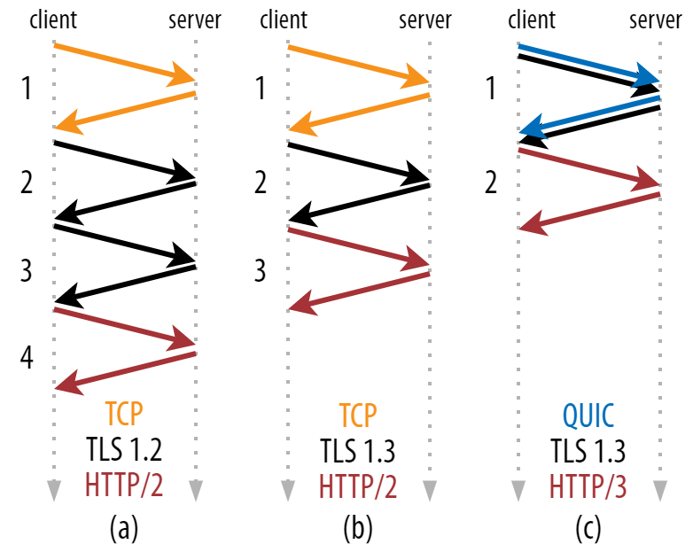
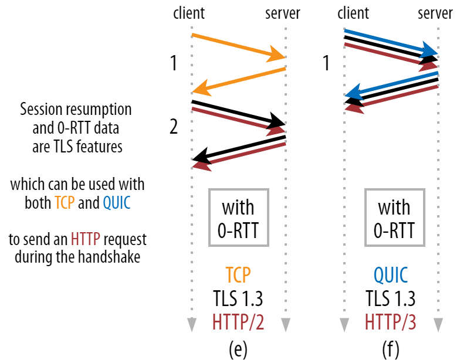
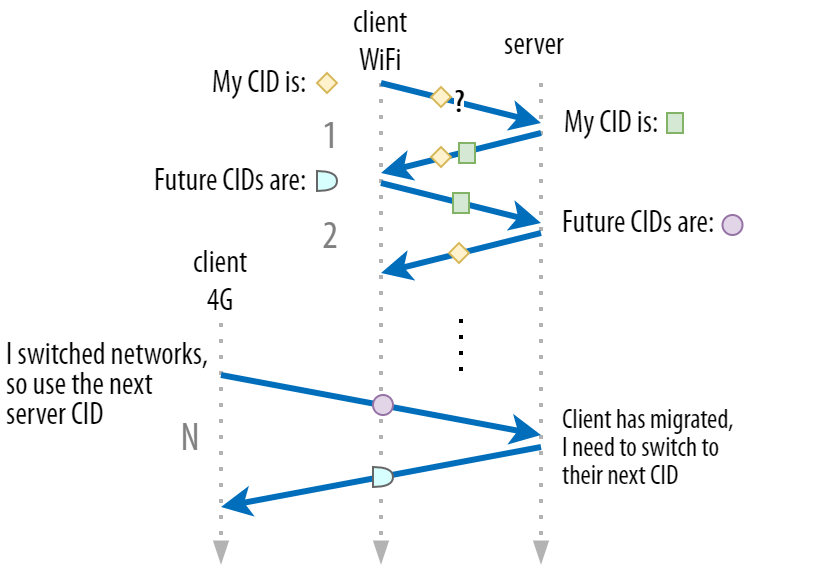
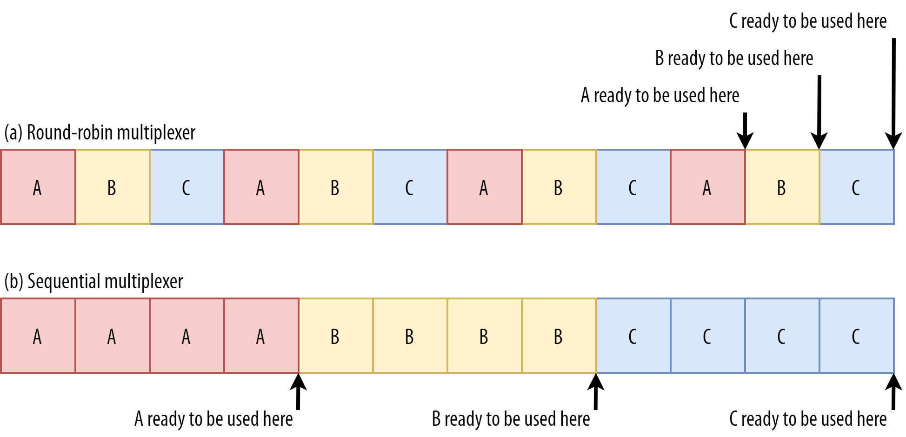
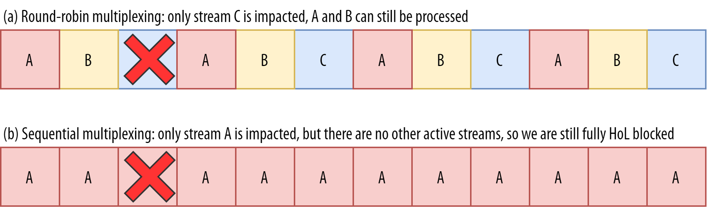
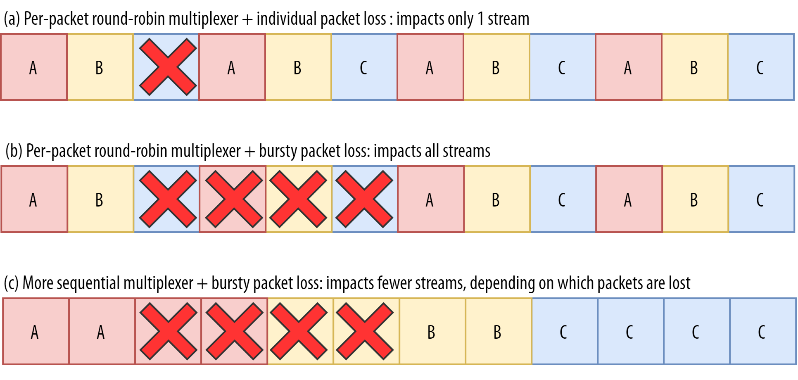
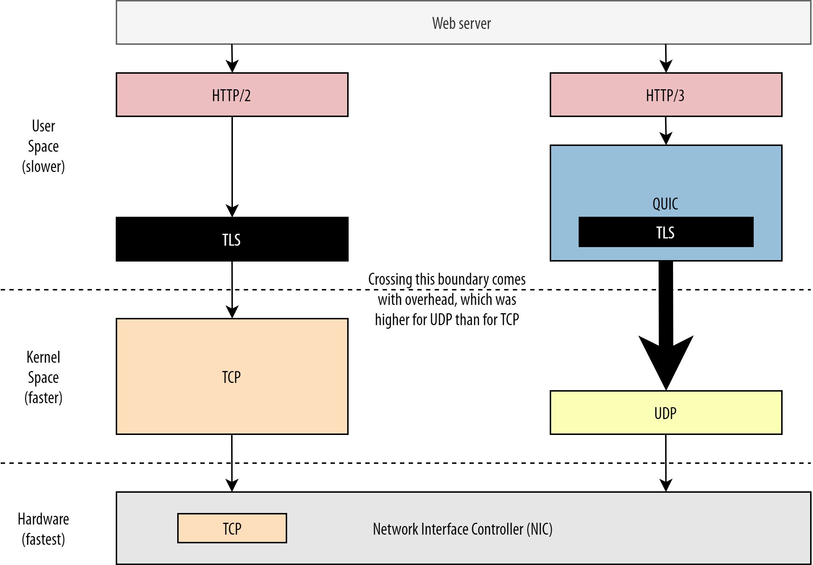

# HTTP3 的性能改进详解

> 快速总结：经过近五年的开发，新的 HTTP/3 协议已经接近最终形式。让我们仔细看看 HTTP/3 的性能改进、拥塞控制、队头阻塞和 0-RTT 连接设置。

在这第部分中，我们将放大 QUIC 和 HTTP/3 为网页加载带来的性能改进。然而，我们也将对这些新功能在实践中所产生的影响持某种怀疑态度。

正如我们将看到的，QUIC 和 HTTP/3 确实有很大的网络性能潜力，**但主要是针对慢速网络上的用户**。如果你的普通访问者是在一个快速的有线或蜂窝网络上，他们可能不会从新协议中受益太多。然而，要注意的是，即使在增长速度通常较快的国家和地区，最慢的 1% 到 10% 的用户(所谓的 p99 或 p90)仍然有可能获得很多收益。这是因为 HTTP/3 和 QUIC 主要是帮助处理当今互联网上可能出现的一些不常见但具有潜在高影响力的问题。

这一部分比第一部分更有技术性，尽管它把大部分真正有深度的东西都交给了外部资源，重点是解释为什么这些东西对普通 web 开发人员很重要。

## 关于速度入门知识

讨论性能和"速度"很快就会变得复杂，因为许多潜在的方面会导致网页加载"缓慢"。因为我们在这里处理的是网络协议，所以我们将主要关注网络方面，其中有两个方面是最重要的：延时和带宽。

延迟可以粗略地定义为从 A 点（例如客户端）向 B 点（服务器）发送一个数据包所需的时间。它在物理上受到光速的限制，或者说，实际上是信号在电线或空气中传播的速度。这意味着延迟往往取决于 A 和 B 之间的物理、现实世界的距离。

[实际上](https://www.youtube.com/watch?v=6bbN48zCNl8)，这意味着典型的延迟在概念上是很小的，大约在 10 到 200 毫秒之间。然而，这仅仅是一种方式。对数据包的回应也需要回来。双向的延迟通常被称为**往返时间（RTT）**。

由于拥塞控制等功能（见下文），我们往往需要相当多的往返次数来加载一个文件。因此，即使是低于 50 毫秒的低延迟也会造成相当大的延迟。这就是内容分发网络（CDN）存在的主要原因之一。他们把服务器放在离最终用户更近的地方，以尽可能地减少延迟，从而减少延迟。

带宽大致可以说是可以**同一时间能发送的数据包的数量**。这一点比较难解释，因为它取决于介质的物理特性（例如，使用的无线电波频率），网络上的用户数量，以及不同子网络之间的互联设备（因为它们通常每秒只能处理一定数量的数据包）。

一个经常使用的比喻是用于运输水的管道。管道的长度是延时，管道的宽度是带宽。然而，在互联网上，我们通常有一长串连接的管道，其中一些可能比其他的宽（导致在最窄的环节处出现所谓的瓶颈）。因此，A 点和 B 点之间的端到端带宽往往受限于最慢的子段。

虽然本文的其余部分不需要完全理解这些概念，但有一个共同的高层次的定义会更好。欲了解更多信息，我建议查看 Ilya Grigorik 在其《高性能浏览器网络》一书中关于[延迟和带宽的优秀章节](https://hpbn.co/primer-on-latency-and-bandwidth/)。

## 拥塞控制

性能的一个方面是关于一个传输协议如何有效地使用网络的全部（物理）带宽（即大约每秒可以发送或接收多少个数据包）。这反过来又影响到一个页面资源的下载速度。有些人声称， QUIC 在某种程度上比 TCP 做得更好，但这不是真的。

> **你知道吗？**
>
> 一个 TCP 连接不会以全带宽开始发送数据，因为这可能导致网络超载（或拥挤）。这是因为，正如我们所说，每个网络链接每秒只能处理一定量的数据（物理上）。如果再给它更多的数据，除了放弃过多的数据包外，没有其他选择，导致数据包丢失。
>
> 正如第一部分所讨论的那样，对于像 TCP 这样的可靠协议来说，从丢包中恢复的唯一方法是重新传输一份新的数据，这需要一个往返的过程。特别是在高延迟的网络上（例如， RTT 超过 50 毫秒），丢包会严重影响性能。

另一个问题是，我们事先不知道最大带宽会是多少。它往往取决于端到端连接中的某个瓶颈，但我们无法预测或知道这个瓶颈会在哪里。Internet 目前还没有机制将链路容量信号传回端点。

此外，即使我们知道可用的物理带宽，这也不意味着我们可以自己使用所有的带宽。一个网络上通常有几个用户在同时活动，他们每个人都需要一个公平的可用带宽的份额。

因此，一个连接不知道它能安全或公平地使用多少带宽，而且这个带宽会随着用户的加入、离开和使用网络而改变。为了解决这个问题，TCP 将不断尝试通过使用一种叫做**拥塞控制**的机制来发现一段时间内的可用带宽。

在连接开始时，它只发送几个数据包（在实践中，范围在 10 至 100 个数据包之间，或约 **14 至 140KB** 的数据），并等待一个往返，直到接收方发回这些数据包的确认。如果它们都被确认，这意味着网络可以处理这个发送率，我们可以尝试重复这个过程，但要用更多的数据（在实践中，发送率通常在每次迭代中翻倍）。

这样，发送率继续增长，直到一些数据包没有被确认（这表明数据包丢失和网络拥堵）。这个第一阶段通常被称为”慢启动“。检测到数据包丢失后，TCP 会降低发送速率，（一段时间后）开始再次提高发送速率，尽管增量要小得多。这种先减后增的逻辑在之后的每次丢包中都会重复出现。最终，这意味着 TCP 将不断尝试达到其理想的、公平的带宽份额。这一机制在图1中得到了说明：

​						图1：TCP 拥塞控制的简化示例，从 10 个数据包的发送速率开始(改编自 [hpbn.co](https://hpbn.co/building-blocks-of-tcp/#congestion-avoidance-and-control).))

这是对拥堵控制的一个极其简化的解释。在实践中，还有许多其他因素在起作用，如[缓冲区的膨胀](https://www.youtube.com/watch?v=ZeCIbCzGY6k)，由于[拥堵造成的 RTT 波动](https://blog.apnic.net/2017/05/09/bbr-new-kid-tcp-block/)，以及多个并发的发送者需要获得他们[公平的带宽](https://justinesherry.com/papers/ware-hotnets19.pdf)份额。因此，存在许多不同的拥塞控制算法，而且今天仍有许多算法被发明出来，但没有一种算法在所有情况下都能发挥最佳效果。

虽然 TCP 的拥塞控制使其健壮，但也意味着它需要一段时间才能**达到最佳发送率**，这取决于 RTT 和实际可用的带宽。对于网页加载来说，这种慢速启动的方法也会影响到诸如第一次内容丰富的绘画等指标，因为只有少量的数据（几十到几百 KB）可以在前几次往返中传输。(你可能听说过将你的[关键数据保持在小于 14KB 的建议](https://www.tunetheweb.com/blog/critical-resources-and-the-first-14kb/)）。

因此，选择一个更积极的方法可以在高带宽和高延迟的网络上获得更好的结果，特别是如果你不在乎偶尔的数据包丢失。这就是我再次看到的关于 QUIC 如何工作的许多误解的地方。

正如[第1部分](https://www.smashingmagazine.com/2021/08/http3-core-concepts-part1/)所讨论的那样，理论上，QUIC 受丢包（以及相关的队头（HOL）阻塞）的影响较小，因为它独立处理每个资源字节流上的丢包。此外，QUIC 在用户数据报协议（UDP）上运行，与 TCP 不同，UDP 没有内置的拥堵控制功能；它允许你尝试以任何你想要的速率发送，并且不重传丢失的数据。

这导致许多文章声称，QUIC 也不使用拥塞控制，QUIC 反而可以以比 UDP 高得多的速率开始发送数据（依靠消除 HOL 阻塞来处理数据包丢失），这就是为什么 QUIC 比 TCP 快得多。

在现实中，没有什么能比这更接近事实了。QUIC 实际上使用了与 TCP 非常相似的带宽管理技术。它也是从较低的发送速率开始，并随着时间的推移不断增长，使用确认作为衡量网络容量的关键机制。这（除其他原因外）是因为 QUIC 需要可靠，以便对像 HTTP 这样的东西有用，因为它需要对其他 QUIC（和 TCP！）连接是公平的，而且因为它的 HOL 阻塞消除实际上并不能很好地帮助防止数据包丢失（正如我们将在下面看到的）。

然而，这并不意味着 QUIC 在管理带宽方面不能比 TCP 更聪明（有点）。这主要是因为 QUIC 比 TCP 更灵活，更容易发展。正如我们所说，拥塞控制算法今天仍在大力发展，而且我们很可能需要，例如，[调整一些东西以获得 5G 的最大效益](https://dl.acm.org/doi/abs/10.1145/3387514.3405882)。

然而，TCP 通常是在操作系统（OS）的内核中实现的，这是一个安全和更受限制的环境，对于大多数操作系统来说，它甚至不是开放源代码。因此，调整拥塞逻辑通常只由少数开发人员完成，而且进化缓慢。

相比之下，大多数 QUIC 的实现目前是在"用户空间"（我们通常在那里运行本地应用程序）进行的，并且是[开源](https://github.com/quicwg/base-drafts/wiki/Implementations)的，明确地鼓励更多的开发者进行实验（例如，[Facebook 已经表明](https://research.fb.com/wp-content/uploads/2019/12/MVFST-RL-An-Asynchronous-RL-Framework-for-Congestion-Control-with-Delayed-Actions.pdf)）。

另一个具体例子是 QUIC 的[延迟确认频率](https://tools.ietf.org/html/draft-iyengar-quic-delayed-ack-02)扩展建议。默认情况下，QUIC 每收到 2 个数据包就会发送一个确认，而这个扩展允许终端确认，例如，每 10 个数据包确认一次。这已被证明在卫星和非常高的带宽网络上**有很大的速度优势**，因为传输确认数据包的开销降低了。为 TCP 增加这样的扩展需要很长时间才能被采用，而对于 QUIC 来说，它更容易部署。

因此，我们可以预期，QUIC 的灵活性将导致更多的实验和更好的拥塞控制算法，这反过来也可以反馈到 TCP，以改善它。

> **你知道吗？**
>
> 官方的 [QUIC Recovery RFC 9002](https://www.rfc-editor.org/rfc/rfc9002.html) 规定使用 NewReno 拥塞控制算法。虽然这种方法很稳健，**但它也有些过时了**，在实践中不再广泛使用。那么，为什么它出现在 QUIC RFC 中？第一个原因是，当 QUIC 开始时，NewReno 是最新的拥塞控制算法，它本身是标准化的。更先进的算法，如 BBR 和 CUBIC，要么仍未标准化，要么[最近](https://datatracker.ietf.org/doc/html/rfc8312)才成为 RFC。
>
> 第二个原因是，NewReno 是一个相对简单的设置。因为算法需要一些调整来处理 QUIC 与 TCP 的差异，所以在一个更简单的算法上解释这些变化更容易。因此，RFC 9002 更应该被理解为”如何使拥塞控制算法适应 QUIC“，而不是”这就是你应该为 QUIC 使用的东西“。事实上，大多数生产级别的 QUIC 实现都对 [Cubic](https://blog.cloudflare.com/cubic-and-hystart-support-in-quiche/) 和 [BBR](https://qlog.edm.uhasselt.be/epiq/files/QUICImplementationDiversity_Marx_final_11jun2020.pdf) 进行了定制实现。
>
> 值得重申的是，**拥塞控制算法不是 TCP 或 QUIC 特有的**；它们可以用于任何一种协议，而且希望 QUIC 的进展最终也能进入 TCP 协议栈中。

> **你知道吗？**
>
> 请注意，与拥塞控制相近的一个相关的概念，叫做[流量控制](https://www.rfc-editor.org/rfc/rfc9000.html#name-flow-control)。这两个功能在 TCP 中经常被混淆，因为它们都被称为使用”TCP 窗口“，尽管实际上有两个窗口：拥塞窗口和 TCP 接收窗口。然而，对于我们感兴趣的网页加载的使用情况来说，流量控制的作用要小得多，所以我们在这里跳过它。更深入的[信息](https://youtu.be/HQ1uIClmzkU?t=603)是[可用](https://blog.cloudflare.com/delivering-http-2-upload-speed-improvements/)的。

### 这有什么意义？

QUIC 仍然受到物理定律的约束，并且需要对互联网上的其他发送者友好。这意味着，它**不会**神奇地比 TCP 更快地下载你的网站资源。然而，QUIC 的灵活性意味着试验新的拥塞控制算法将变得更加容易，这应该会改善 TCP 和 QUIC 未来的情况。

## 0-RTT 连接设置

第二个性能方面是关于在一个新的连接上发送有用的 HTTP 数据（例如，页面资源）之前需要多少次往返。有些人声称 QUIC 比 TCP + TLS 快两到三个往返，但我们会看到它实际上只有一个。

> **你知道吗？**
>
> 如我们在[第一部分](https://www.smashingmagazine.com/2021/08/http3-core-concepts-part1/)所说，在 HTTP 请求和响应交换之前，一个连接通常要进行一次（TCP）或两次（TCP + TLS）握手。这些握手交换了客户端和服务器都需要知道的初始参数，以便对数据进行加密等。
>
> 正如你在下面的图 2 中所看到的，每个单独的握手至少需要一次往返才能完成（TCP + TLS 1.3，（b）），有时需要两次（TLS 1.2和之前的（a））。这是低效的，因为我们需要至少两个往返的握手等待时间（开销），然后才能发送我们的第一个 HTTP 请求，这意味着至少要等待三次往返才能接收第一个 HTTP 响应数据(返回的红色箭头)。在慢速网络中，这可能意味着 100 到 200 毫秒的开销。

​										图2：TCP + TLS 与 QUIC 连接设置

你可能想知道为什么 TCP+TLS 握手不能简单地结合起来，在同一个往返过程中完成。虽然这在概念上是可能的（QUIC 正是这样做的），但事情最初并不是这样设计的，因为我们需要能够在有 TLS 和没有 TLS 的情况下使用TCP。换句话说，**TCP 根本不支持在握手期间发送非 TCP 内容**。人们一直在努力通过 TCP 快速开放扩展来增加这一功能；然而，正如[第一部分](https://www.smashingmagazine.com/2021/08/http3-core-concepts-part1/#quic-is-flexible-and-evolvable)所讨论的，这被证明是[难以大规模部署](https://squeeze.isobar.com/2019/04/11/the-sad-story-of-tcp-fast-open)的。

幸运的是，QUIC 的设计从一开始就考虑到了 TLS，因此它将传输和加密握手结合在一个机制中。这意味着 QUIC 握手总共只需要一次往返就可以完成，这比 TCP + TLS 1.3 少了一次往返（见上图2 c）。

你可能会感到困惑，因为你可能读到 QUIC 比 TCP 快两个甚至三个往返，而不是只有一个。这是因为大多数文章只考虑了最坏的情况（TCP + TLS 1.2，(a)），没有提到现代的TCP + TLS 1.3 也"只"需要两个往返（(b)很少被显示）。虽然一个来回的速度提升是不错的，但这并不惊人。特别是在快速的网络上（例如，小于 50 毫秒的 RTT），**这几乎不会被注意到**，尽管慢速的网络和连接到遥远的服务器会有更多的收益。

这就是在实践中使用了一个巧妙的技巧。我们知道，用户经常在第一次访问后很短的时间内重访网页。因此，我们可以使用**最初的加密连接**来引导未来的第二个连接。简单地说，在其生命周期的某个时候，第一个连接被用来在客户端和服务器之间安全地传递新的加密参数。然后，这些参数可以从一开始就被用来**加密第二个连接**，而不必等待完整的 TLS 握手过程。这种方法被称为"会话恢复"。

它可以实现一个强大的优化。我们现在可以安全地将我们的第一个 HTTP 请求与 QUIC/TLS 握手一起发送，**从而节省了另一个往返过程**！至于 TLS 1.3，这有效地消除了 TLS 握手的等待时间。这种方法通常被称为 0-RTT（当然，HTTP 响应数据开始到达仍然需要一次往返）。

会话恢复和 0-RTT 都是我经常看到的、被错误地解释为 QUIC 特定功能的东西。实际上，这些实际上是 TLS 的功能，在 TLS 1.2 中已经以某种形式存在，现在在 [TLS 1.3](https://tools.ietf.org/html/rfc8446#section-2.3) 中已经完全成熟。

换句话说，正如你在下面的图3中看到的，我们也可以通过 TCP（因此也包括 HTTP/2 甚至 HTTP/1.1）获得这些功能的性能优势！我们看到，即使是 0-RTT，QUIC 仍然只比最佳运行的 TCP + TLS 1.3 协议栈快一个往返。声称 QUIC 快了三个来回的说法来自于比较图2的(a)和图3的(f)，正如我们所看到的，这并不真正公平。

​										图3：TCP + TLS 和 QUIC 0-RTT 连接设置

最糟糕的是，当使用 0-RTT 时，由于安全问题，QUIC 甚至不能真正使用那个获得的往返次数。为了理解这一点，我们需要理解 TCP 握手存在的原因之一。首先，它允许客户端在向服务器发送任何高层数据之前，确定服务器在给定的 IP 地址上确实可用。

其次，也是最关键的一点，它允许服务器在向其发送数据之前，确保打开连接的客户端确实是他们所说的人和地点。如果你还记得我们在[第一部分](https://www.smashingmagazine.com/2021/08/http3-core-concepts-part1/#quic-supports-connection-migration)中是如何用 4 元组定义连接的，你会知道客户端主要是通过其 IP 地址来识别的。而这正是问题所在：**IP 地址是可以被欺骗的**!

假设一个攻击者通过 QUIC 0-RTT 的 HTTP 请求一个非常大的文件。然而，他们欺骗了自己的 IP 地址，使其看起来像 0-RTT 请求来自受害者的计算机。这在下面的图4中显示。QUIC 服务器没有办法检测到 IP 是否被欺骗，因为这是它从该客户端看到的第一个数据包。

​				图4:攻击者在向 QUIC 服务器发送 0-RTT 请求时可以伪造他们的 IP 地址，从而触发对受害者的放大攻击。

如果服务器随后简单地开始向被伪造的 IP 发送大文件，最终可能会使受害者的网络带宽超载（特别是如果攻击者并行地做许多这样的假请求）。请注意，QUIC 响应会被受害者丢弃，因为它不希望有数据进入，但这并不重要。他们的网络仍然需要处理这些数据包！

这被称为[反射或放大攻击](https://www.f5.com/labs/articles/education/what-is-a-dns-amplification-attack-)，是黑客执行分布式拒绝服务（DDoS）攻击的一种重要方式。请注意，当使用 TCP+TLS 的 0-RTT 时，这种情况不会发生，正是因为在 0-RTT 请求与 TLS 握手一起发送之前，需要首先完成 TCP 握手。

因此，QUIC 在回复 0-RTT 请求时必须是保守的，限制其发送的数据量，直到客户被验证为真正的客户而不是受害者。对于 QUIC 来说，[这个数据量被设置为从客户端收到的数据量的三倍。](https://www.rfc-editor.org/rfc/rfc9000.html#name-address-validation)

换句话说，QUIC 的最大"放大系数"为 3，这被确定为是性能有用性和安全风险之间可接受的权衡（特别是与一些放大系数[超过 51,000 倍的事件](https://www.cloudflare.com/learning/ddos/memcached-ddos-attack/)相比）。因为客户端通常首先只发送一到两个数据包，QUIC 服务器的 0-RTT 回复将被**限制在仅仅 4 到 6KB**（包括其他 QUIC 和 TLS 开销！），这多少有点不尽人意。

此外，其他安全问题也会导致，例如"重放攻击"，它限制了你可以做的 HTTP 请求类型。例如，Cloudflare 只允许 0-RTT 中[没有查询参数的 HTTP GET 请求](https://blog.cloudflare.com/introducing-0-rtt/#whatsthecatch)。这些限制了 0-RTT 的作用，甚至更多。

幸运的是，QUIC 有一些选项可以使这种情况好一点。例如，服务器可以检查 0-RTT 是否来自一个[它以前有过有效连接的 IP](https://www.rfc-editor.org/rfc/rfc9000.html#name-address-validation-for-futu)。然而，这只有在客户端保持在同一网络上时才有效（这在一定程度上限制了 QUIC 的[连接迁移功能](https://www.smashingmagazine.com/2021/08/http3-performance-improvements-part2/#connection-migration)）。即使它起作用，QUIC 的响应仍然受到我们[上面讨论](#拥塞控制)的拥塞控制器的慢启动逻辑的限制；因此，**除了节省一个往返行程外，没有额外的大规模速度提升。**

> **你知道吗？**
>
> 可能是某些先进的设置能够缓解这些问题，足以使 0-RTT 更有用。例如，服务器可以记住一个客户在最后一次被看到时有多少可用的带宽，使其在重新连接（非欺骗）客户时不受拥塞控制的慢启动的限制。学术界已经对此进行了[研究](https://arxiv.org/pdf/1905.03144.pdf)，甚至还有人提议在 QUIC 中进行[扩展](https://tools.ietf.org/html/draft-kuhn-quic-0rtt-bdp-08)。一些公司已经做了这种事情来加快 TCP 的速度。
>
> 另一个选择是让客户**发送超过一个或两个数据包**（例如，多发送 7 个带填充的数据包），因此三倍的限制转化为更有趣的 12 至 14KB 的响应，即使在连接迁移之后。我已经在我的一篇[论文](https://qlog.edm.uhasselt.be/epiq/files/QUICImplementationDiversity_Marx_final_11jun2020.pdf)中写到了这一点。
>
> 最后，（行为不端的）QUIC 服务器也可以故意增加三倍的限制，如果他们觉得这样做在某种程度上是安全的，或者他们不在乎潜在的安全问题（毕竟没有[协议警察](https://tools.ietf.org/html/rfc8962)阻止）。

### 这有什么意义？

QUIC 的 **0-RTT 快速连接设置实际上更像是一种微优化**，而不是一种革命性的新功能。与最先进的 TCP + TLS 1.3 设置相比，它最多只能节省一个往返。在第一次往返中实际可以发送的数据量还受到一些安全因素的限制。

因此，如果你的用户是在**高延迟**的网络上（比如，RTT 超过 200 毫秒的卫星网络），或者你通常不发送很多数据，那么这个功能就会大放异彩。后者的一些例子是大量缓存的网站，以及通过 API 和其他协议（如 [DNS-over-QUIC](https://datatracker.ietf.org/doc/html/draft-ietf-dprive-dnsoquic)）定期获取小型更新的单页应用程序。[谷歌看到 QUIC 的 0-RTT 结果非常好](https://storage.googleapis.com/pub-tools-public-publication-data/pdf/8b935debf13bd176a08326738f5f88ad115a071e.pdf)的原因之一是，它在其已经大量优化的搜索页面上进行了测试，那里的查询响应相当小。

在其他情况下，你最多只能获得**几十毫秒**，如果你已经在使用 CDN（如果你关心性能，你应该这样做！），甚至更少。

## 连接迁移

第三个性能特征使 QUIC 在网络间传输时更快，因为它保持了**现有连接的完整性**。虽然这确实有效，但这种类型的网络变化并不经常发生，连接仍然需要重置其发送速率。

正如[第一部分](https://www.smashingmagazine.com/2021/08/http3-core-concepts-part1#quic-supports-connection-migration)所讨论的，QUIC 的连接ID（CIDs）允许它在**切换网络**时执行连接迁移。我们用一个客户端在进行大文件下载时从 Wi-Fi 网络移动到 4G 网络来说明这一点。在 TCP 上，该下载可能不得不中止，而对 QUIC 来说，它可能继续。

然而，首先要考虑这种情况实际发生的频率。你可能会认为，当在建筑物内的 Wi-Fi 接入点之间移动或在路上的蜂窝基站之间移动时，也会发生这种情况。然而，在这些设置中（如果他们做得正确），你的设备通常会保持其 IP 完整，因为无线基站之间的转换是在较低的协议层完成的。因此，只有当你在完全**不同的网络之间移动**时，它才会发生，而我认为这并不经常发生。

其次，我们可以问，除了大文件下载和实时视频会议和流媒体之外，这是否也适用于其他用例。如果你在切换网络的确切时刻加载一个网页，你可能确实要重新请求一些（后来的）资源。

然而，加载一个页面通常需要几秒钟的时间，因此，与网络切换相吻合的情况也不会很常见。此外，对于那些急需解决的用例，**其他的缓解措施通常已经到位了**。例如，提供大文件下载的服务器可以支持 [HTTP 范围请求](https://developer.mozilla.org/en-US/docs/Web/HTTP/Range_requests)，以允许可恢复的下载。

因为在网络1关闭和网络2可用之间通常有一些**重叠时间**，视频应用程序可以打开多个连接（每个网络一个），在旧网络完全消失之前同步它们。用户仍然会注意到切换，但它不会完全放弃视频信号。

第三，不能保证新网络会有和旧网络一样多的可用带宽。因此，即使概念上的连接保持不变，QUIC 服务器也不能一味地高速发送数据。相反，为了避免新网络过载，它需要**重置（或至少降低）发送速率**，并在拥堵控制器的[慢启动阶段](#拥塞控制)重新开始。

因为这个初始发送速率通常太低，无法真正支持诸如视频流的东西，所以即使在 QUIC 上，您也会看到一些**质量损失**或问题。在某种程度上，**连接迁移更多的是为了防止连接上下文的变化和服务器上的开销，而不是为了提高性能**。

> **你知道吗？**
>
> 请注意，就像上面讨论的 0-RTT 一样，我们可以设计一些高级技术来改善连接迁移。例如，我们可以再次**尝试记住上次在某个网络上有多少带宽**，并试图在新的迁移中更快地提升到这个水平。此外，我们可以设想不只是简单地在网络之间切换，而是同时使用两个网络。这个概念被称为多路径（multipath），[我们将在下面详细讨论](#未来发展值得关注)。

到目前为止，我们主要讨论了主动连接迁移，即用户在不同的网络之间移动。然而，也有[被动连接迁移](https://www.rfc-editor.org/rfc/rfc9000.html#name-connection-migration)的情况，即某个网络本身改变参数。这方面的一个很好的例子是[网络地址转换（NAT）](https://computer.howstuffworks.com/nat.htm)的重新绑定。虽然对 NAT 的全面讨论超出了本文的范围，但它的主要意思是连接的**端口号可以在任何给定时间更改**，而没有任何警告。在大多数路由器中，UDP 的这种情况也比 TCP 更经常发生。

如果发生这种情况，QUIC 的 CID 不会改变，大多数实现会认为用户仍在同一个物理网络上，因此不会重置拥塞窗口或其他参数。QUIC 还包括一些功能，如 [PING](https://www.rfc-editor.org/rfc/rfc9000.html#frame-ping) 和[超时指示器](https://www.rfc-editor.org/rfc/rfc9000.html#idle-timeout)，以防止这种情况发生，因为这种情况通常发生在长期空闲的连接中。

我们在[第一部分](https://www.smashingmagazine.com/2021/08/http3-core-concepts-part1/#quic-supports-connection-migration)中讨论过，出于安全考虑，QUIC 并不只是使用一个 CID。相反，它在执行主动迁移时改变 CID。在实践中，这甚至更加复杂，因为客户和服务器都有单独的 CID 列表，（称为 [QUIC RFC 中源和目的 CID](https://www.rfc-editor.org/rfc/rfc9000.html#name-connection-id)）。下图5对此进行了说明。

​										图5：QUIC 使用独立的客户端和服务器 cid

这样做是为了让**每个端点选择自己的 CID 格式和内容**，而这又是允许高级路由和负载平衡逻辑的关键。随着连接的迁移，负载均衡器不能再只看 4 元组来识别一个连接并将其发送到正确的后端服务器。然而，如果所有 QUIC 连接都使用随机 CID，这将严重增加负载均衡器的内存需求，因为它需要存储 CID 与后端服务器的映射。此外，这在连接迁移时仍然不可行，因为 CIDs 会变成新的随机值。

因此，部署在负载均衡器后面的 QUIC 后端服务器必须有一个**可预测的 CID 格式**，以便负载均衡器能够从 CID 中推导出正确的后端服务器，即使是在迁移之后。[IETF 的建议文档](https://datatracker.ietf.org/doc/html/draft-ietf-quic-load-balancers-06)中描述了一些这样做的方案。为了使这一切成为可能，服务器需要能够选择自己的 CID，如果连接发起者（对于 QUIC 来说，总是客户）选择 CID，这就不可能了。这就是为什么在 QUIC 中客户和服务器的 CID 是分开的。

### 这有什么意义？

因此，连接迁移是一个情景性的功能。例如，[谷歌的初步测试](https://github.com/quicwg/wg-materials/blob/main/ietf104/IETF_104_QUIC_Connection_Migration.pdf)显示，其用例的改进百分比很低。许多 QUIC 的实施还没有实现这一功能。即使是那些实现了的，通常也会将其限制在移动客户端和应用程序上，而不是其桌面上的对应物。有些人甚至认为不需要这个功能，因为在大多数情况下，用 0-RTT 打开一个新的连接应该有类似的性能特性。

不过，根据你的使用情况或用户配置文件，它可能有很大的影响。**如果你的网站或应用程序最常在移动中使用**（例如，像 Uber 或谷歌地图），那么你可能会比你的用户通常坐在桌子后面受益更多。同样，如果你**专注于持续的互动**（无论是视频聊天，协作编辑，还是游戏），那么你的最坏情况应该比你的新闻网站有更多改善。

## 队头阻塞移除

第四项性能特征旨在通过缓解队头（HoL）阻塞问题，使 QUIC 在具有**大量数据包丢失**的网络上更快。虽然这在理论上是正确的，但我们将看到，在实践中，这可能只会为网页加载性能提供微小的好处。

为了理解这一点，我们首先需要绕个弯子，谈谈流优先级和多路复用。

### 流优先级

正如[第1部分](https://www.smashingmagazine.com/2021/08/http3-core-concepts-part1/#why-do-we-need-http-3)所讨论的，一个 TCP 数据包的丢失可能会延迟多个正在传输的资源的数据，因为 TCP 的字节流抽象认为所有数据都是一个文件的一部分。另一方面，QUIC 密切意识到有多个并发的字节流，并可以在每个流的基础上处理丢失。然而，正如我们所看到的，这些数据流并不是真正的并行传输数据。相反，流数据被复用到一个单个连接上。这种复用可以以许多不同的方式发生。

例如，对于流A、B 和 C，我们可能会看到 ABCABCABCABCABCABCABC 的数据包序列，我们在每个数据包中更改活动流（让我们称之为循环）。然而，我们也可能看到 AAAAAABBBBBBCCCCCC 的相反模式，即每个数据流在开始下一个数据流之前全部完成（让我们称之为顺序式）。当然，在这些极端之间还有许多其他的选择（AAAABBCAAAAABBC...，AABBCCAABBCC...，ABABABCCCC...，等等）。多路复用方案是动态的，由 HTTP 级别的功能驱动，称为流优先级（在本文[后面讨论](#流优先级)）。

事实证明，你所选择的哪种复用方案会对网站的加载性能产生巨大影响。你可以在下面这个由 [Cloudflare](https://blog.cloudflare.com/better-http-2-prioritization-for-a-faster-web/) 提供的视频中看到，每个浏览器都使用不同的多路复用器。其中的原因相当复杂，我已经就这个话题写了[几篇](https://speeder.edm.uhasselt.be/www18/files/h2priorities_mwijnants_www2018.pdf)学术[论文](https://h3.edm.uhasselt.be/files/ResourceMultiplexing_H2andH3_Marx2020.pdf)，并在一次会议上[谈到了这个问题](https://www.youtube.com/watch?v=nH4iRpFnf1c)。[Webpagetest](https://www.webpagetest.org/) 的 Patrick Meenan，甚至有一个[三小时的教程](https://www.youtube.com/watch?v=ct5MvtmL1NM)就是关于这个主题的。

​					流多路复用的差异会对不同浏览器中的网站加载产生很大影响

幸运的是，我们可以相对容易地解释这些基础知识。正如你可能知道的那样，一些资源可能会阻塞渲染。对于 CSS 文件和 HTML head 元素中的一些 JavaScript 来说，就是这种情况。当这些文件正在加载时，浏览器无法绘制页面（例如，执行新的 JavaScript）。

更重要的是，CSS 和 JavaScript 文件需要全部下载才能使用（尽管它们通常可以被逐步解析和编译）。因此，这些资源需要尽快被加载，并具有最高的优先级。让我们思考一下，如果 A、B、C 都是阻塞渲染的资源，会发生什么。

​					图6: 流多路复用方法影响(渲染阻塞)资源完成时间。

如果我们使用一个循环多路复用器（图6中最上面一行），我们实际上会延迟每个资源的总完成时间，因为它们都需要与其他资源共享带宽。由于我们只有在它们完全加载后才能使用它们，这就产生了一个显著的延迟。但是，如果我们按顺序复用它们（图6中的最下面一行），我们会看到 A 和 B 更早地完成（并且可以被浏览器使用），而实际上没有延迟 C 的完成时间。

但是，这并不意味着顺序复用总是最好的，因为有些（主要是非渲染阻塞的）资源（如 HTML 和渐进式 JPEGs）实际上可以**增量处理和使用**。在这些（和其他一些）情况下，使用第一个选项是有意义的（或者至少是介于两者之间）。

不过，对于大多数网页资源来说，事实证明，**顺序多路复用的效果最好**。例如，这就是谷歌浏览器在上面的视频中所做的，而 IE 浏览器使用的是最坏情况下的循环复用器。

### 数据包丢失恢复

现在我们知道，所有的流并不总是在同一时间活动，而且它们可以以不同的方式多路复用，我们可以思考如果我们有数据包丢失会发生什么。正如[第一部分](https://www.smashingmagazine.com/2021/08/http3-core-concepts-part1/#why-do-we-need-http-3)所解释的，如果一个 QUIC 流出现丢包，那么其他活动的流仍然可以使用（而在 TCP 中，所有的流将被暂停）。

然而，正如我们刚才所看到的，有许多并发的活动流通常不是网络性能的最佳选择，因为它可能会延迟一些关键的（阻塞渲染的）资源，即使没有丢包！我们宁可使用顺序多路复用器，只让一个或两个同时活动。然而，这减少了 QUIC 的 HoL 阻塞消除的影响。

想象一下，例如，发送方可以在给定的时间内发送 **12 个数据包**（见下图 7）--记住，这是由[拥塞控制器](https://www.smashingmagazine.com/2021/08/http3-performance-improvements-part2/#congestion-control)限制的）。如果我们用流A的数据填满这 12 个包（因为它的优先级很高，而且会阻塞渲染--想想 `main.js`），那么在这 12 个数据包的窗口中，我们就只有一个活动流。

如果这些数据包中有一个丢失了，那么 QUIC 最终仍然会被完全 HoL 阻塞，因为除了A之外，根本就没有其他流可以处理：所有的数据都是为A准备的，所以所有的东西仍然需要等待（我们没有 B 或 C 的数据需要处理），类似于 TCP。

​			图7: 数据包丢失的影响取决于所使用的多路复用器。(注意，我们假设每个数据流比之前的类似图像有更多的数据要发送。)

我们看可以看到有一个矛盾点：顺序多路复用（AAAABBBBCCCC）通常对网络性能更好，但它不允许我们利用 QUIC 的 Hol 阻塞消除功能。循环多路复用（ABCABCABC）对 Hol 阻塞更有力，但对网络性能更不利。因此，**一种最佳实践或优化项可能会破坏另一个**。

更糟的是。到目前为止，我们一直认为单个数据包是一次丢失一个的。然而，这并不总是真实的，因为互联网上的数据包丢失往往是["突发的"](https://huitema.wordpress.com/2020/07/12/parsing-quic-logs-and-assessing-packet-losses/)，这意味着**多个数据包经常同时丢失。**

[如上所述](#拥塞控制)，丢包的一个重要原因是，网络因数据过多而过载，不得不丢弃多余的数据包。这就是为什么拥塞控制器开始时发送速度很慢。然而，它随后不断增加其发送速率，直到...出现丢包现象。

换句话说，旨在防止网络过载的机制实际上是使**网络过载**（尽管是以一种可控的方式）。在大多数网络中，当发送率增加到每个往返的数百个数据包时，这种情况就会发生。当这些数据包达到网络的极限时，通常会有几个数据包一起被丢弃，从而导致了突发性的丢失模式。

> **你知道吗？**
>
> 这也是我们为什么要在 HTTP/2 中使用单个 TCP 连接，而不是 HTTP/1.1 的 6～30 个连接的原因之一。因为每个单独的连接都以相同的方式提高其发送率，HTTP/1.1 在开始时可以得到很好的加速，但是这些连接实际上可能会因网络过载，导致大量的数据包丢失。
>
> 当时，[Chromium 开发者推测](https://a77db9aa-a-7b23c8ea-s-sites.googlegroups.com/a/chromium.org/dev/spdy/An_Argument_For_Changing_TCP_Slow_Start.pdf)，这种行为造成了互联网上的大部分数据包丢失。这也是 BBR 成为经常使用的拥堵控制算法的原因之一，因为它使用观察到的 RTT 的波动，而不是数据包丢失，来评估可用带宽。

> **你知道吗？**
>
> 丢包的其他原因可能导致较少或个别的数据包丢失（或无法使用），特别是在无线网络上。然而，在那里，损失往往是在较低的协议层检测到的，并在两个本地实体（例如，智能手机和 4G 蜂基站）之间解决，而不是通过客户端和服务器之间的重传。这些通常不会导致真正的端到端数据包损失，而是表现为**数据包延迟（或"抖动"）的变化**和数据包到达的重新排序。

因此，假设我们使用每个包的循环多用复用器（ABCABCABCABCABCABCABCABC...）来获得 HoL 阻塞消除的最大效果，而我们得到的突发损失只有 4 个数据包。我们看到，这总是会影响到所有 3 个数据流（见图8，中间一行）！在这种情况下，QUIC 的 HoL 阻塞消除没有提供任何好处，**因为所有流都必须等待自己的重传**。

​				图8: 根据所使用的多路复用器和数据包丢失模式，或多或少的流会受到影响

为了降低多个数据流被丢失突发影响的风险，我们需要为每个数据流串联更多的数据。例如，AABBCCAABBCCAABBCCAABBCC...是一个小的改进，而AAAABBBBCCCCAAAABBBBCCCC...（见上图8的底排）甚至更好。你可以再次看到，一个更有顺序的方法是更好的，尽管这减少了我们有多个并发活动流的机会。

最后，预测 QUIC 的 HoL 阻塞消除的实际影响是困难的，因为它取决于流的数量、丢失突发的大小和频率、流数据的实际使用方式等。然而，目前的[大多数结果](https://h3.edm.uhasselt.be/files/ResourceMultiplexing_H2andH3_Marx2020.pdf)表明，它对网页加载的使用情况**没有什么帮助**，因为在那里我们通常需要较少的并发流。

如果你想了解这个话题的更多细节，或者只是一些具体的例子，请查看我关于 [HTTP HoL 阻塞的深度文章](https://calendar.perfplanet.com/2020/head-of-line-blocking-in-quic-and-http-3-the-details/)。

> **你知道吗？**
>
> 与前几节一样，一些先进的技术在这里可以帮助我们。例如，现代拥堵控制器使用[数据包的步调](https://homes.cs.washington.edu/~tom/pubs/pacing.pdf)。这意味着他们不会在一次突发中发送例如 100 个数据包，而是将它们**分散**到整个 RTT 中。这在概念上降低了网络过载的几率，[QUIC 恢复 RFC 强烈建议使用它](https://www.rfc-editor.org/rfc/rfc9002.html#name-pacing)。作为补充，一些拥塞控制算法，如 [BBR](https://blog.apnic.net/2017/05/09/bbr-new-kid-tcp-block/)，不会一直增加其发送速率，直到导致数据包丢失，而是在这之前后退（back off）（例如，通过查看 RTT 的波动，因为当网络变得过载时，RTT 也会上升）。
>
> 虽然这些方法降低了丢包的总体几率，但它们不一定能降低其突发度。

### 这有什么意义

虽然 QUIC 的 HoL 阻塞去除意味着，在理论上，它（和 HTTP/3）应该在有损网络上表现得更好，但在实践中，这取决于很多的因素。因为网页加载的使用情况通常倾向于一个更连续的多路复用设置，并且因为数据包丢失是不可预测的，这个功能将再次**可能主要影响最慢的1%的用户**。然而，这仍然是一个非常活跃的研究领域，只有时间才能证明。

不过，在一些情况下，可能会看到更多的改进。这些情况主要是在第一次完整页面加载的典型使用情况之外--例如，当资源不是渲染阻塞时，当它们可以被增量处理时，当流是完全独立时，或者当同时发送的数据较少时。

这方面的例子包括对**重复访问已经缓存好的页面**，以及单页应用中的后台下载和 API 调用。例如，Facebook 在其本地应用中使用 HTTP/3 加载数据时，已经从 HoL 阻塞移除中看到一些好处。

## UDP 和 TLS 性能

QUIC 和 HTTP/3 的第五个性能方面是关于它们能够在网络上实际**创建和发送数据包**的效率和性能。我们将看到，QUIC 对 UDP 和重度加密的使用会使它比 TCP 慢很多（但情况正在改善）。

首先，我们[已经讨论](https://www.smashingmagazine.com/2021/08/http3-core-concepts-part1/#why-do-we-need-http-3)过，QUIC 使用 UDP 更多是为了灵活性和可部署性，而不是为了性能。直到最近，通过 UDP 发送 QUIC 数据包通常比发送 TCP 数据包慢得多，这一事实更加证明了这一点。这部分是由于这些协议的典型实施地点和方式造成的（见下图9）。

​						图9: TCP 和 QUIC 的不同实现

[如上所述](#用塞控制)，TCP 和 UDP 通常直接在操作系统的快速内核中实现。相比之下，TLS 和 QUIC 的实现大多在较慢的用户空间（注意，这对 QUIC 来说并不是真正需要的--这样做主要是因为它更灵活）。这使得 QUIC 已经比 TCP 慢了一些。

此外，当从我们的用户空间软件（例如浏览器和网络服务器）发送数据时，我们需要**将这些数据传递给操作系统内核**，然后使用 TCP 或 UDP 将其实际放到网络上。传递这些数据是通过内核API（系统调用）完成的，这涉及到每个API调用的一定量的开销。对于 TCP 来说，这些开销要比 UDP 低得多。

这主要是因为，从历史上看，TCP 的使用比 UDP 多得多。因此，随着时间的推移，许多优化被添加到 TCP 实现和内核API中，以将数据包的发送和接收开销降到最低。许多网络接口控制器（NIC）甚至为 TCP 内置了硬件卸载功能。然而，UDP 就没有那么幸运了，因为它的用途比较有限，不值得投资增加优化。在过去的五年里，这种情况幸运地发生了变化，**大多数操作系统也都为 UDP 增加了优化选项。**

其次，QUIC 有很多开销，因为它对**每个数据包进行单独加密**。这比在 TCP 上使用 TLS 要慢，因为在那里你可以[分块加密数据包](https://blog.cloudflare.com/optimizing-tls-over-tcp-to-reduce-latency/)（最多16KB或一次11个数据包），这样效率更高。这是在 QUIC 中做出的有意识的权衡，因为批量加密会导致其[自身形式的 HoL 阻塞](https://www.igvita.com/2013/10/24/optimizing-tls-record-size-and-buffering-latency/)。

与第一点不同的是，我们可以添加额外的 API 以使 UDP（从而使 QUIC）更快，在这里，QUIC 始终具有 TCP+TLS 固有的劣势。然而，这在实践中也是很好管理的，例如，[优化的加密库](https://github.com/h2o/picotls/pull/310)和允许 QUIC 数据包头被批量加密的巧妙方法。

因此，虽然谷歌最早的 QUIC 版本仍然比 [TCP + TLS 慢两倍](https://rjshade.com/work/files/papers/pdf/langley_et_al_sigcomm2017_quic.pdf)，但后来情况肯定有所改善。例如，在最近的测试中，微软[重点优化的 QUIC 协议栈](https://github.com/microsoft/msquic)能够获得7.85Gbps的速度，而在同一系统上，TCP+TLS 的速度为11.85Gbps（所以在这里，QUIC 的速度约为 TCP+TLS 的66%）。

这与最近的 Windows 更新有关，它使 UDP 更快（为了全面比较，该系统上的 UDP 吞吐量为19.5Gbps）。谷歌的 QUIC 协议栈的最优化版本目前比 TCP+TLS [慢20%左右](https://youtu.be/xxN4FfwaANk?t=3161)。Fastly 在一个不太先进的系统上进行的[早期测试](https://www.fastly.com/blog/measuring-quic-vs-tcp-computational-efficiency)，使用了一些技巧，甚至声称性能相当（约 450 Mbps），表明根据使用情况，QUIC 绝对可以与 TCP竞争。

然而，即使 QUIC 的速度要比 TCP+TSL 慢两倍，它也不是那么糟糕。首先，QUIC 和 TCP+TLS 处理通常不是服务器上最重要的事情，因为其他逻辑（例如 HTTP、缓存、代理等）也需要执行。因此，**你实际上不需要两倍的服务器来运行 QUIC**（虽然有点不清楚它在真正的数据中心会有多大影响，因为没有一家大公司发布这方面的数据）。

其次，未来仍有很多机会来优化 QUIC 的实施。例如，随着时间的推移，一些 QUIC 实现将（部分）转移到操作系统内核（很像 TCP）或绕过它（有些已经做到了，如[MsQuic](https://github.com/microsoft/msquic) 和 [Quant](https://github.com/NTAP/quant)）。我们还可以期待 [QUIC 特定的硬件](https://datatracker.ietf.org/meeting/104/materials/slides-104-quic-offloading-quic-00)变得可用。

然而，可能会有一些使用情况，TCP+TLS 仍将是首选。例如，Netflix 已经表示，它可能不会很快转向 QUIC，因为它已经[大量投资于定制的 FreeBSD 设置](https://www.youtube.com/watch?v=8NSzkYSX5nY)，以通过 TCP+TLS 传输视频。

同样，Facebook 表示，QUIC 可能主要用于**终端用户和 CDN 的边缘之间**，而不是数据中心之间或边缘节点和起源服务器之间，因为其开销较大。总的来说，非常高的带宽场景可能会继续支持 TCP+TLS，特别是在未来几年。

> **你知道吗？**
>
> 优化网络堆栈是一个很深的、技术性很强的兔子洞，上面的内容只是触及了表面（而且错过了很多细微之处）。如果你足够勇敢，或者你想知道 `GRO/GSO`、`SO_TXTIME`、`内核旁路`、`sendmmsg()` 和 `recvmmsg()` 等术语的含义，我可以推荐 [Cloudflare](https://blog.cloudflare.com/accelerating-udp-packet-transmission-for-quic/) 和 [Fastly](https://www.fastly.com/blog/measuring-quic-vs-tcp-computational-efficiency) 的一些关于优化 QUIC 的优秀文章，以及[微软的大量的代码演练](https://www.youtube.com/watch?v=Icskyw17Dgw)和[思科](https://archive.fosdem.org/2020/schedule/event/fast_quic_sockets_for_cloud_networking/)的深入讲座。最后，谷歌的一位工程师做了一个非常有趣的主题演讲，介绍了[随着时间推移优化他们的 QUIC 实现](https://www.youtube.com/watch?v=xxN4FfwaANk)。

### 这有什么意义？

QUIC 对 UDP+TLS 协议的特殊使用在历史上使其比 TCP+TLS 慢得多。然而，随着时间的推移，已经进行了一些改进（并将继续实施），这在一定程度上缩小了差距。不过，在网页加载的典型使用情况下，你可能不会注意到这些差异，但如果你维护大型服务器群，它们可能会让你头疼。

## HTTP3 特性

到目前为止，我们主要讨论了 QUIC 与 TCP 的新性能特征。然而，HTTP/3 与 HTTP/2 的关系如何？正如[第一部分](https://www.smashingmagazine.com/2021/08/http3-core-concepts-part1/#why-do-we-need-http-3)所讨论的，**HTTP/3 实际上是 HTTP/2-over-QUIC**，因此，在新版本中没有引入真正的、大的新功能。这与从HTTP/1.1到HTTP/2的变化不同，后者规模更大，并引入了新的功能，如头压缩，流优先级，和服务器推送。这些功能都仍然在 HTTP/3 中，但在它们的实现方式上有一些重要的区别。

这主要是因为 QUIC 消除了 HoL 阻塞的工作方式。正如我们所[讨论](#队头阻塞移除)的，流B的丢失不再意味着流A和流C必须等待B的重传，就像他们在 TCP 上一样。因此，如果 A、B 和 C 按照这个顺序各自发送一个 QUIC 数据包，他们的数据很可能以 A、C、B 的形式被传送到（并由）浏览器处理！换句话说，与 TCP 不同，**QUIC 在不同的数据流中不再是完全有序的!**

这对 HTTP/2 来说是个问题，它在设计许多功能时确实依赖于 TCP 的严格排序，这些功能使用穿插在数据块中的特殊控制信息。在 QUIC 中，这些控制信息可能以任何顺序到达（并被应用），甚至可能使特性做与预期相反的事情!技术细节对本文来说也是不必要的，但[在这个论文的前半部分](https://h3.edm.uhasselt.be/files/HTTP3_Prioritization_extended_3jul2019.pdf)应该让你了解这可以变得多么愚蠢的复杂。

因此，HTTP/3 的内部机制和功能的实现不得不改变。一个具体的例子是 **HTTP 头部压缩**，它降低了大量重复的 HTTP 头（例如，cookies 和 user-agent 字符串）的开销。在 HTTP/2 中，这是用 [HPACK](https://datatracker.ietf.org/doc/html/rfc7541) 设置完成的，而在 HTTP/3 中，这已经被重新设计为更复杂的 [QPACK](https://datatracker.ietf.org/doc/html/draft-ietf-quic-qpack)。这两个系统都提供了相同的功能（即头压缩），但以相当不同的方式。在 [Litespeed 博客](https://blog.litespeedtech.com/tag/quic-header-compression-design-team/)上可以找到一些关于这个主题的优秀的深入的技术讨论和图表。

对于驱动流多路复用逻辑的优先级功能也是如此，我们在[上面简单讨论过](#队头阻塞移除)。在 HTTP/2 中，这是用一个复杂的"依赖树"实现的，它明确地试图对所有页面资源及其相互关系进行建模（更多信息见"[HTTP 资源优先级终极指南](https://www.youtube.com/watch?v=nH4iRpFnf1c)"讲座）。直接在 QUIC 上使用这个系统会导致一些潜在的非常错误的树形布局，因为将每个资源添加到树上将是一个单独的控制信息。

此外，这种方法被证明是不必要的复杂，导致了[许多实施错误和低效率](https://blog.cloudflare.com/nginx-structural-enhancements-for-http-2-performance/)，以及在[许多服务器上的不合格性能](https://github.com/andydavies/http2-prioritization-issues)。这两个问题导致优先级系统以一种[更简单的方式为 HTTP/3 重新设计](https://blog.cloudflare.com/adopting-a-new-approach-to-http-prioritization/)。这种更直接的设置使得一些先进的方案难以实施或无法实施（例如，在单一连接上代理来自多个客户端的流量），但仍然能够为网页加载优化提供广泛的选择。

虽然，这两种方法提供了相同的基本功能（引导流多路复用），但希望 HTTP/3 的简单设置将使实施的错误减少。

最后，是**服务器推送（server push）**。这个功能允许服务器发送 HTTP 响应，而不需要先等待一个明确的请求。从理论上讲，这可以带来出色的性能提升。然而，在实践中，它被证明是[很难正确使用](https://calendar.perfplanet.com/2016/http2-push-the-details/)和[不一致的实现](https://jakearchibald.com/2017/h2-push-tougher-than-i-thought/)。因此，它甚至可能会被从[谷歌浏览器中删除](https://groups.google.com/a/chromium.org/g/blink-dev/c/K3rYLvmQUBY/m/vOWBKZGoAQAJ)。

尽管如此，它仍然[被定义为 HTTP/3 的一个功能](https://datatracker.ietf.org/doc/html/draft-ietf-quic-http)（尽管很少有实现支持它）。虽然它的内部工作原理没有像前两个功能那样改变，但它也被调整为围绕 QUIC 的非确定性排序工作。遗憾的是，这对解决其长期存在的一些问题没有什么作用。

### 这有什么意义？

正如我们之前所说的，HTTP/3 的大部分潜力来自底层的 QUIC，而不是 HTTP/3 本身。虽然该协议的内部实现与 HTTP/2 有*很大的不同*，但其高级性能特性以及它们可以和应该如何使用保持不变。

## 未来发展值得关注

在这个系列中，我经常强调，更快的进化和更高的灵活性是 QUIC（以及扩展到 HTTP/3）的核心方面。因此，人们已经在为协议的**新扩展**和应用而努力，这应该不足为奇。下面列出的是你可能会在某个地方遇到的主要协议：

- [正向纠错(Forward errorcorrection)](https://tools.ietf.org/html/draft-swett-nwcrg-coding-for-quic)

  这项技术的目的是，再次**提高 QUIC 对数据包丢失的恢复能力**。它通过发送数据的冗余副本来实现这一目的（尽管经过巧妙的编码和压缩，使它们不那么大）。然后，如果一个数据包丢失，但冗余数据到达，就不再需要重传了。

  这原本是谷歌 QUIC 的一部分（也是人们说 QUIC 对丢包有好处的原因之一），但它没有包括在标准化的 QUIC 第一版中，因为它的性能影响还没有被证明。不过，研究人员现在正在用它进行积极的实验，你可以通过使用 [PQUIC-FEC 下载实验](https://play.google.com/store/apps/details?id=org.pquic.pquic_fec_android)应用来帮助他们。

- [多路径 QUIC(Multipath QUIC)](https://tools.ietf.org/html/draft-liu-multipath-quic)

  我们之前就讨论过连接迁移，以及如何给从 Wifi 转移到 移动电话提供帮助。但是这不意味着我们能**同时使用 Wifi 和移动电话**？同时使用这两个网络会给我们带来更多的可用带宽和更强的稳定性！这就是多路径的主要概念。

  这也是谷歌实验过的东西，但由于其固有的复杂性，没有被纳入 QUIC 第一版。然而，研究人员[已经展示](https://multipath-quic.org/)了它的巨大潜力，它可能会被纳入 QUIC 第二版。请注意，[TCP 多路径](https://www.multipath-tcp.org/)也存在，但它花了近十年的时间才成为实际可用的。

- [基于 QUIC](https://tools.ietf.org/html/draft-ietf-quic-datagram) 和 [HTTP/3 的不可靠数据](https://datatracker.ietf.org/doc/html/draft-ietf-masque-h3-datagram)

  正如我们已经看到的，QUIC 是一个完全可靠的协议。然而，由于它在 UDP 上运行，而 UDP 是不可靠的，我们可以给 QUIC 增加一个功能，以便也能发送不可靠的数据。这在拟议的数据报扩展中有所概述。当然，你不会想用它来发送网页资源，但它对游戏和实时视频流等事情可能很方便。这样，用户将得到 UDP 的所有好处，但有 QUIC 级别的加密和（可选）拥堵控制。

- [WebTransport](https://web.dev/webtransport/)

  浏览器不会直接将 TCP 或 UDP 暴露给 JavaScript，这主要是出于安全考虑。相反，我们必须依靠 HTTP 级别的 API，如 Fetch 和更灵活的 [WebSocket](https://hpbn.co/websocket/) 和 [WebRTC](https://hpbn.co/webrtc/) 协议。这一系列选项中最新的一个叫做 WebTransport，它主要允许你以一种更低级的方式使用 HTTP/3（以及延伸的 QUIC）（尽管它也可以在需要时退回到 TCP 和 HTTP/2）。

  最重要的是，它将包括通过 HTTP/3 使用不可靠的数据的能力（见前一点），这应该使诸如游戏等事情在浏览器中更容易实现。对于正常的（JSON）API 调用，你当然还是会使用 Fetch，它也会在可能的情况下自动采用 HTTP/3。目前，WebTransport 仍在激烈的讨论中，所以还不清楚它最终会是什么样子。在这些浏览器中，只有 Chromium 目前正在开发一个[公开的概念验证实现](https://groups.google.com/a/chromium.org/g/web-transport-dev/c/6PwPFy9fVfw)。

- DASH 和 HLS 视频流

  对于非实时视频（YouTube 和 Netflix），浏览器通常使用 HTTP 动态自适应流（Dynamic Adaptive Stream over HTTP，DASH）或 HTTP 实时流（HTTP Live Streaming，HLS）协议。这两种协议基本上意味着你将视频编码为较小的块（2至10秒）和不同的质量水平（720p、1080p、4K 等）。

  在运行时，浏览器会估计你的网络可以处理的最高质量（或对特定的使用情况而言最理想的质量），并通过 HTTP 向服务器请求相关文件。由于浏览器不能直接访问 TCP 协议栈（因为这通常是在内核中实现的），它在这些估计中偶尔会犯一些错误，或者需要花一些时间来对变化的网络条件做出反应（导致视频停滞）。

  由于 QUIC 是作为浏览器的一部分来实现的，通过让[流媒体评估器访问低级别的协议信息](https://dl.acm.org/doi/abs/10.1145/3386367.3431901)（如损失率、带宽估计等），这一点可以得到相当大的改善。其他研究人员也一直在试验将[可靠和不可靠的数据混合用于视频流](https://www.researchgate.net/profile/Mirko-Palmer/publication/327930175_The_QUIC_Fix_for_Optimal_Video_Streaming/links/5f60ea97299bf1d43c063075/The-QUIC-Fix-for-Optimal-Video-Streaming.pdf)，并取得了一些有希望的结果。

- HTTP/3 以外的协议

  由于 QUIC 是一个通用的传输协议，我们可以期待现在通过 TCP 运行的许多应用层协议也能在 QUIC 之上运行。一些正在进行的工作包括 [DNS-over-QUIC](https://datatracker.ietf.org/doc/html/draft-ietf-dprive-dnsoquic)、[SMB-over-QUIC](https://techcommunity.microsoft.com/t5/itops-talk-blog/smb-over-quic-files-without-the-vpn/ba-p/1183449)，甚至 [SSH-over-QUIC](https://datatracker.ietf.org/doc/html/draft-bider-ssh-quic-09)。因为这些协议的要求通常与 HTTP 和网页加载非常不同，我们所讨论的 QUIC 的性能改进可能对这些协议更有效。

### 这有什么意义？

QUIC 第一版本才**刚开始**。谷歌之前试验过的许多面向性能的高级特性都没有出现在第一次迭代中。然而，我们的目标是快速发展协议，高频率地引入新的扩展和功能。因此，随着时间的推移，QUIC（和 HTTP/3）应该变得比 TCP（和 HTTP/2）明显更快、更灵活。

## 总结

在这个系列的第二部分中，我们讨论了 **HTTP/3，特别是 QUIC 的许多不同的性能特征和方面**。我们看到，虽然这些功能中的大多数看起来非常有影响，但实际上，在我们一直在考虑的网页加载的使用案例中，它们可能对普通用户没有什么作用。

例如，我们已经看到，QUIC 对 UDP 的使用并不意味着它可以突然比 TCP 使用更多的带宽，也不意味着它可以更快地下载你的资源。经常被称赞的 0-RTT 功能实际上是一种微观优化，它为你节省了一次往返，其中你可以发送大约 5KB（在最坏的情况下）。

如果有**突发性的数据包丢失**，或者当你正在加载阻塞渲染的资源时，HoL 阻塞移除工作并不顺利。连接迁移是高度情景化的，HTTP/3 没有任何主要的新功能，可以使它比 HTTP/2 更快。

因此，你可能希望我建议你跳过 HTTP/3 和 QUIC。何必呢，对吧？然而，我绝对不会做这样的事情 尽管这些新协议可能对快速（城市）网络的用户没有什么帮助，但这些新功能确实有可能对**高度移动的用户和慢速网络的人产生很大的影响**。

即使在西方市场，如我自己在的比利时，我们一般都有快速的设备和高速蜂窝网络，这些情况也会影响你的用户群的 1% 甚至 10%，这取决于你的产品。一个例子是，有人在火车上拼命想在你的网站上查找一个关键信息，但不得不等待 45 秒才能加载。我当然知道我曾经遇到过这种情况，希望有人能部署 QUIC 来让我摆脱这种情况。

然而，在其他国家和地区，情况要糟糕得多。在比利时，普通用户可能看起来更像最慢的 10%，而最慢的 1% 可能根本看不到加载的页面。在[世界的许多地方](https://infrequently.org/2021/03/the-performance-inequality-gap/)，网络性能是一个[可访问性和包容性的问题](https://hookedoncode.com/2020/07/performance-is-accessibility/)。

这就是为什么我们不应该只在自己的硬件上测试我们的网页（但也要使用像 [Webpagetest](https://www.webpagetest.org/) 这样的服务），也是为什么你一定要**部署 QUIC 和 HTTP/3**。特别是如果你的用户经常在移动中，或者不太可能使用快速的蜂窝网络，这些新协议可能会带来巨大的变化，即使你在你的有线 MacBook Pro 上没有注意到什么。关于更多细节，我强烈推荐 [Fastly 关于这个问题的文章](https://www.fastly.com/blog/how-http3-and-quic-help-long-tail-connections)。

如果这还不能完全说服你，那么考虑到 QUIC 和 HTTP/3 将继续发展，并在**未来几年内变得更快**。尽早获得一些协议的经验将在未来得到回报，使你能够尽快获得新功能的好处。此外，QUIC 在后台执行安全和隐私的最佳做法，这对所有用户都有好处。

## 原文地址

https://www.smashingmagazine.com/2021/08/http3-performance-improvements-part2/#future-developments-to-look-out-for