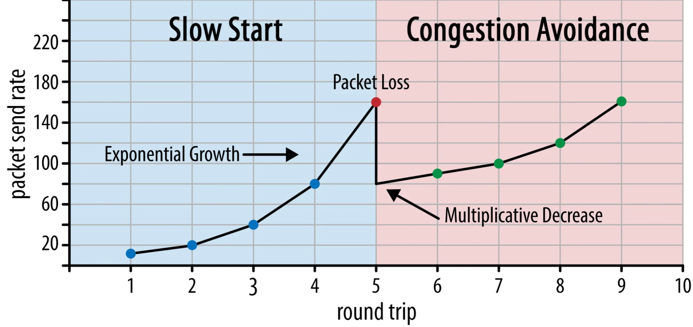
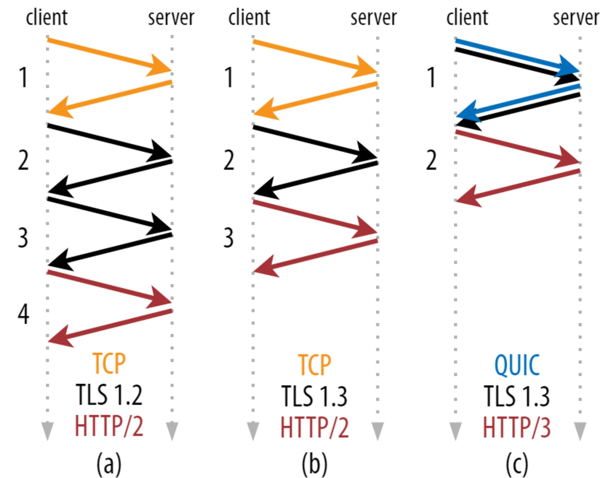
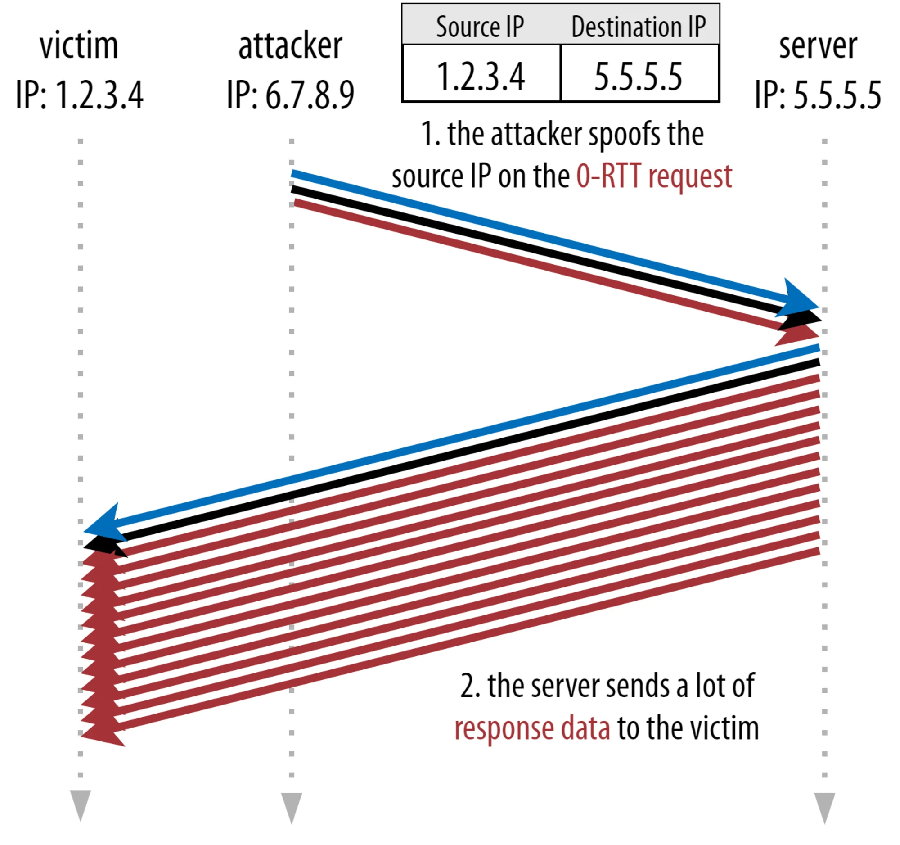

# HTTP3 的性能改进详解

> 快速总结：经过近五年的开发，新的 HTTP/3 协议已经接近最终形式。让我们仔细看看 HTTP/3 的性能改进、拥塞控制、队头阻塞和 0-RTT 连接设置。

在这第部分中，我们将放大 QUIC 和 HTTP/3 为网页加载带来的性能改进。然而，我们也将对这些新功能在实践中所产生的影响持某种怀疑态度。

正如我们将看到的，QUIC 和 HTTP/3 确实有很大的网络性能潜力，**但主要是针对慢速网络上的用户**。如果你的普通访问者是在一个快速的有线或蜂窝网络上，他们可能不会从新协议中受益太多。然而，要注意的是，即使在增长速度通常较快的国家和地区，最慢的 1% 到 10% 的用户(所谓的 p99 或 p90)仍然有可能获得很多收益。这是因为 HTTP/3 和 QUIC 主要是帮助处理当今互联网上可能出现的一些不常见但具有潜在高影响力的问题。

这一部分比第一部分更有技术性，尽管它把大部分真正有深度的东西都交给了外部资源，重点是解释为什么这些东西对普通 web 开发人员很重要。

## 关于速度入门知识

讨论性能和"速度"很快就会变得复杂，因为许多潜在的方面会导致网页加载"缓慢"。因为我们在这里处理的是网络协议，所以我们将主要关注网络方面，其中有两个方面是最重要的：延时和带宽。

延迟可以粗略地定义为从 A 点（例如客户端）向 B 点（服务器）发送一个数据包所需的时间。它在物理上受到光速的限制，或者说，实际上是信号在电线或空气中传播的速度。这意味着延迟往往取决于 A 和 B 之间的物理、现实世界的距离。

[实际上](https://www.youtube.com/watch?v=6bbN48zCNl8)，这意味着典型的延迟在概念上是很小的，大约在 10 到 200 毫秒之间。然而，这仅仅是一种方式。对数据包的回应也需要回来。双向的延迟通常被称为**往返时间（RTT）**。

由于拥塞控制等功能（见下文），我们往往需要相当多的往返次数来加载一个文件。因此，即使是低于 50 毫秒的低延迟也会造成相当大的延迟。这就是内容分发网络（CDN）存在的主要原因之一。他们把服务器放在离最终用户更近的地方，以尽可能地减少延迟，从而减少延迟。

带宽大致可以说是可以**同一时间能发送的数据包的数量**。这一点比较难解释，因为它取决于介质的物理特性（例如，使用的无线电波频率），网络上的用户数量，以及不同子网络之间的互联设备（因为它们通常每秒只能处理一定数量的数据包）。

一个经常使用的比喻是用于运输水的管道。管道的长度是延时，管道的宽度是带宽。然而，在互联网上，我们通常有一长串连接的管道，其中一些可能比其他的宽（导致在最窄的环节处出现所谓的瓶颈）。因此，A 点和 B 点之间的端到端带宽往往受限于最慢的子段。

虽然本文的其余部分不需要完全理解这些概念，但有一个共同的高层次的定义会更好。欲了解更多信息，我建议查看 Ilya Grigorik 在其《高性能浏览器网络》一书中关于[延迟和带宽的优秀章节](https://hpbn.co/primer-on-latency-and-bandwidth/)。

## 拥塞控制

性能的一个方面是关于一个传输协议如何有效地使用网络的全部（物理）带宽（即大约每秒可以发送或接收多少个数据包）。这反过来又影响到一个页面资源的下载速度。有些人声称， QUIC 在某种程度上比 TCP 做得更好，但这不是真的。

> **你知道吗？**
>
> 一个 TCP 连接不会以全带宽开始发送数据，因为这可能导致网络超载（或拥挤）。这是因为，正如我们所说，每个网络链接每秒只能处理一定量的数据（物理上）。如果再给它更多的数据，除了放弃过多的数据包外，没有其他选择，导致数据包丢失。
>
> 正如第一部分所讨论的那样，对于像 TCP 这样的可靠协议来说，从丢包中恢复的唯一方法是重新传输一份新的数据，这需要一个往返的过程。特别是在高延迟的网络上（例如， RTT 超过 50 毫秒），丢包会严重影响性能。

另一个问题是，我们事先不知道最大带宽会是多少。它往往取决于端到端连接中的某个瓶颈，但我们无法预测或知道这个瓶颈会在哪里。Internet 目前还没有机制将链路容量信号传回端点。

此外，即使我们知道可用的物理带宽，这也不意味着我们可以自己使用所有的带宽。一个网络上通常有几个用户在同时活动，他们每个人都需要一个公平的可用带宽的份额。

因此，一个连接不知道它能安全或公平地使用多少带宽，而且这个带宽会随着用户的加入、离开和使用网络而改变。为了解决这个问题，TCP 将不断尝试通过使用一种叫做**拥塞控制**的机制来发现一段时间内的可用带宽。

在连接开始时，它只发送几个数据包（在实践中，范围在 10 至 100 个数据包之间，或约 **14 至 140KB** 的数据），并等待一个往返，直到接收方发回这些数据包的确认。如果它们都被确认，这意味着网络可以处理这个发送率，我们可以尝试重复这个过程，但要用更多的数据（在实践中，发送率通常在每次迭代中翻倍）。

这样，发送率继续增长，直到一些数据包没有被确认（这表明数据包丢失和网络拥堵）。这个第一阶段通常被称为”慢启动“。检测到数据包丢失后，TCP 会降低发送速率，（一段时间后）开始再次提高发送速率，尽管增量要小得多。这种先减后增的逻辑在之后的每次丢包中都会重复出现。最终，这意味着 TCP 将不断尝试达到其理想的、公平的带宽份额。这一机制在图1中得到了说明：

​						图1：TCP 拥塞控制的简化示例，从 10 个数据包的发送速率开始(改编自 [hpbn.co](https://hpbn.co/building-blocks-of-tcp/#congestion-avoidance-and-control).))

这是对拥堵控制的一个极其简化的解释。在实践中，还有许多其他因素在起作用，如[缓冲区的膨胀](https://www.youtube.com/watch?v=ZeCIbCzGY6k)，由于[拥堵造成的 RTT 波动](https://blog.apnic.net/2017/05/09/bbr-new-kid-tcp-block/)，以及多个并发的发送者需要获得他们[公平的带宽](https://justinesherry.com/papers/ware-hotnets19.pdf)份额。因此，存在许多不同的拥塞控制算法，而且今天仍有许多算法被发明出来，但没有一种算法在所有情况下都能发挥最佳效果。

虽然 TCP 的拥塞控制使其健壮，但也意味着它需要一段时间才能**达到最佳发送率**，这取决于 RTT 和实际可用的带宽。对于网页加载来说，这种慢速启动的方法也会影响到诸如第一次内容丰富的绘画等指标，因为只有少量的数据（几十到几百 KB）可以在前几次往返中传输。(你可能听说过将你的[关键数据保持在小于 14KB 的建议](https://www.tunetheweb.com/blog/critical-resources-and-the-first-14kb/)）。

因此，选择一个更积极的方法可以在高带宽和高延迟的网络上获得更好的结果，特别是如果你不在乎偶尔的数据包丢失。这就是我再次看到的关于 QUIC 如何工作的许多误解的地方。

正如[第1部分](https://www.smashingmagazine.com/2021/08/http3-core-concepts-part1/)所讨论的那样，理论上，QUIC 受丢包（以及相关的队头（HOL）阻塞）的影响较小，因为它独立处理每个资源字节流上的丢包。此外，QUIC 在用户数据报协议（UDP）上运行，与 TCP 不同，UDP 没有内置的拥堵控制功能；它允许你尝试以任何你想要的速率发送，并且不重传丢失的数据。

这导致许多文章声称，QUIC 也不使用拥塞控制，QUIC 反而可以以比 UDP 高得多的速率开始发送数据（依靠消除 HOL 阻塞来处理数据包丢失），这就是为什么 QUIC 比 TCP 快得多。

在现实中，没有什么能比这更接近事实了。QUIC 实际上使用了与 TCP 非常相似的带宽管理技术。它也是从较低的发送速率开始，并随着时间的推移不断增长，使用确认作为衡量网络容量的关键机制。这（除其他原因外）是因为 QUIC 需要可靠，以便对像 HTTP 这样的东西有用，因为它需要对其他 QUIC（和 TCP！）连接是公平的，而且因为它的 HOL 阻塞消除实际上并不能很好地帮助防止数据包丢失（正如我们将在下面看到的）。

然而，这并不意味着 QUIC 在管理带宽方面不能比 TCP 更聪明（有点）。这主要是因为 QUIC 比 TCP 更灵活，更容易发展。正如我们所说，拥塞控制算法今天仍在大力发展，而且我们很可能需要，例如，[调整一些东西以获得 5G 的最大效益](https://dl.acm.org/doi/abs/10.1145/3387514.3405882)。

然而，TCP 通常是在操作系统（OS）的内核中实现的，这是一个安全和更受限制的环境，对于大多数操作系统来说，它甚至不是开放源代码。因此，调整拥塞逻辑通常只由少数开发人员完成，而且进化缓慢。

相比之下，大多数 QUIC 的实现目前是在"用户空间"（我们通常在那里运行本地应用程序）进行的，并且是[开源](https://github.com/quicwg/base-drafts/wiki/Implementations)的，明确地鼓励更多的开发者进行实验（例如，[Facebook 已经表明](https://research.fb.com/wp-content/uploads/2019/12/MVFST-RL-An-Asynchronous-RL-Framework-for-Congestion-Control-with-Delayed-Actions.pdf)）。

另一个具体例子是 QUIC 的[延迟确认频率](https://tools.ietf.org/html/draft-iyengar-quic-delayed-ack-02)扩展建议。默认情况下，QUIC 每收到 2 个数据包就会发送一个确认，而这个扩展允许终端确认，例如，每 10 个数据包确认一次。这已被证明在卫星和非常高的带宽网络上**有很大的速度优势**，因为传输确认数据包的开销降低了。为 TCP 增加这样的扩展需要很长时间才能被采用，而对于 QUIC 来说，它更容易部署。

因此，我们可以预期，QUIC 的灵活性将导致更多的实验和更好的拥塞控制算法，这反过来也可以反馈到 TCP，以改善它。

> **你知道吗？**
>
> 官方的 [QUIC Recovery RFC 9002](https://www.rfc-editor.org/rfc/rfc9002.html) 规定使用 NewReno 拥塞控制算法。虽然这种方法很稳健，**但它也有些过时了**，在实践中不再广泛使用。那么，为什么它出现在 QUIC RFC 中？第一个原因是，当 QUIC 开始时，NewReno 是最新的拥塞控制算法，它本身是标准化的。更先进的算法，如 BBR 和 CUBIC，要么仍未标准化，要么[最近](https://datatracker.ietf.org/doc/html/rfc8312)才成为 RFC。
>
> 第二个原因是，NewReno 是一个相对简单的设置。因为算法需要一些调整来处理 QUIC 与 TCP 的差异，所以在一个更简单的算法上解释这些变化更容易。因此，RFC 9002 更应该被理解为”如何使拥塞控制算法适应 QUIC“，而不是”这就是你应该为 QUIC 使用的东西“。事实上，大多数生产级别的 QUIC 实现都对 [Cubic](https://blog.cloudflare.com/cubic-and-hystart-support-in-quiche/) 和 [BBR](https://qlog.edm.uhasselt.be/epiq/files/QUICImplementationDiversity_Marx_final_11jun2020.pdf) 进行了定制实现。
>
> 值得重申的是，**拥塞控制算法不是 TCP 或 QUIC 特有的**；它们可以用于任何一种协议，而且希望 QUIC 的进展最终也能进入 TCP 协议栈中。

> **你知道吗？**
>
> 请注意，与拥塞控制相近的一个相关的概念，叫做[流量控制](https://www.rfc-editor.org/rfc/rfc9000.html#name-flow-control)。这两个功能在 TCP 中经常被混淆，因为它们都被称为使用”TCP 窗口“，尽管实际上有两个窗口：拥塞窗口和 TCP 接收窗口。然而，对于我们感兴趣的网页加载的使用情况来说，流量控制的作用要小得多，所以我们在这里跳过它。更深入的[信息](https://youtu.be/HQ1uIClmzkU?t=603)是[可用](https://blog.cloudflare.com/delivering-http-2-upload-speed-improvements/)的。

### 这有什么意义？

QUIC 仍然受到物理定律的约束，并且需要对互联网上的其他发送者友好。这意味着，它**不会**神奇地比 TCP 更快地下载你的网站资源。然而，QUIC 的灵活性意味着试验新的拥塞控制算法将变得更加容易，这应该会改善 TCP 和 QUIC 未来的情况。

## 0-RTT 连接设置

第二个性能方面是关于在一个新的连接上发送有用的 HTTP 数据（例如，页面资源）之前需要多少次往返。有些人声称 QUIC 比 TCP + TLS 快两到三个往返，但我们会看到它实际上只有一个。

> **你知道吗？**
>
> 如我们在[第一部分](https://www.smashingmagazine.com/2021/08/http3-core-concepts-part1/)所说，在 HTTP 请求和响应交换之前，一个连接通常要进行一次（TCP）或两次（TCP + TLS）握手。这些握手交换了客户端和服务器都需要知道的初始参数，以便对数据进行加密等。
>
> 正如你在下面的图 2 中所看到的，每个单独的握手至少需要一次往返才能完成（TCP + TLS 1.3，（b）），有时需要两次（TLS 1.2和之前的（a））。这是低效的，因为我们需要至少两个往返的握手等待时间（开销），然后才能发送我们的第一个 HTTP 请求，这意味着至少要等待三次往返才能接收第一个 HTTP 响应数据(返回的红色箭头)。在慢速网络中，这可能意味着 100 到 200 毫秒的开销。

​										图2：TCP + TLS 与 QUIC 连接设置

你可能想知道为什么 TCP+TLS 握手不能简单地结合起来，在同一个往返过程中完成。虽然这在概念上是可能的（QUIC 正是这样做的），但事情最初并不是这样设计的，因为我们需要能够在有 TLS 和没有 TLS 的情况下使用TCP。换句话说，**TCP 根本不支持在握手期间发送非 TCP 内容**。人们一直在努力通过 TCP 快速开放扩展来增加这一功能；然而，正如[第一部分](https://www.smashingmagazine.com/2021/08/http3-core-concepts-part1/#quic-is-flexible-and-evolvable)所讨论的，这被证明是[难以大规模部署](https://squeeze.isobar.com/2019/04/11/the-sad-story-of-tcp-fast-open)的。

幸运的是，QUIC 的设计从一开始就考虑到了 TLS，因此它将传输和加密握手结合在一个机制中。这意味着 QUIC 握手总共只需要一次往返就可以完成，这比 TCP + TLS 1.3 少了一次往返（见上图2 c）。

你可能会感到困惑，因为你可能读到 QUIC 比 TCP 快两个甚至三个往返，而不是只有一个。这是因为大多数文章只考虑了最坏的情况（TCP + TLS 1.2，(a)），没有提到现代的TCP + TLS 1.3 也"只"需要两个往返（(b)很少被显示）。虽然一个来回的速度提升是不错的，但这并不惊人。特别是在快速的网络上（例如，小于 50 毫秒的 RTT），**这几乎不会被注意到**，尽管慢速的网络和连接到遥远的服务器会有更多的收益。

这就是在实践中使用了一个巧妙的技巧。我们知道，用户经常在第一次访问后很短的时间内重访网页。因此，我们可以使用**最初的加密连接**来引导未来的第二个连接。简单地说，在其生命周期的某个时候，第一个连接被用来在客户端和服务器之间安全地传递新的加密参数。然后，这些参数可以从一开始就被用来**加密第二个连接**，而不必等待完整的 TLS 握手过程。这种方法被称为"会话恢复"。

它可以实现一个强大的优化。我们现在可以安全地将我们的第一个 HTTP 请求与 QUIC/TLS 握手一起发送，**从而节省了另一个往返过程**！至于 TLS 1.3，这有效地消除了 TLS 握手的等待时间。这种方法通常被称为 0-RTT（当然，HTTP 响应数据开始到达仍然需要一次往返）。

会话恢复和 0-RTT 都是我经常看到的、被错误地解释为 QUIC 特定功能的东西。实际上，这些实际上是 TLS 的功能，在 TLS 1.2 中已经以某种形式存在，现在在 [TLS 1.3](https://tools.ietf.org/html/rfc8446#section-2.3) 中已经完全成熟。

换句话说，正如你在下面的图3中看到的，我们也可以通过 TCP（因此也包括 HTTP/2 甚至 HTTP/1.1）获得这些功能的性能优势！我们看到，即使是 0-RTT，QUIC 仍然只比最佳运行的 TCP + TLS 1.3 协议栈快一个往返。声称 QUIC 快了三个来回的说法来自于比较图2的(a)和图3的(f)，正如我们所看到的，这并不真正公平。

​										图3：TCP + TLS 和 QUIC 0-RTT 连接设置

最糟糕的是，当使用 0-RTT 时，由于安全问题，QUIC 甚至不能真正使用那个获得的往返次数。为了理解这一点，我们需要理解 TCP 握手存在的原因之一。首先，它允许客户端在向服务器发送任何高层数据之前，确定服务器在给定的 IP 地址上确实可用。

其次，也是最关键的一点，它允许服务器在向其发送数据之前，确保打开连接的客户端确实是他们所说的人和地点。如果你还记得我们在[第一部分](https://www.smashingmagazine.com/2021/08/http3-core-concepts-part1/#quic-supports-connection-migration)中是如何用 4 元组定义连接的，你会知道客户端主要是通过其 IP 地址来识别的。而这正是问题所在：**IP 地址是可以被欺骗的**!

假设一个攻击者通过 QUIC 0-RTT 的 HTTP 请求一个非常大的文件。然而，他们欺骗了自己的 IP 地址，使其看起来像 0-RTT 请求来自受害者的计算机。这在下面的图4中显示。QUIC 服务器没有办法检测到 IP 是否被欺骗，因为这是它从该客户端看到的第一个数据包。

​				图4:攻击者在向 QUIC 服务器发送 0-RTT 请求时可以伪造他们的 IP 地址，从而触发对受害者的放大攻击。

如果服务器随后简单地开始向被伪造的 IP 发送大文件，最终可能会使受害者的网络带宽超载（特别是如果攻击者并行地做许多这样的假请求）。请注意，QUIC 响应会被受害者丢弃，因为它不希望有数据进入，但这并不重要。他们的网络仍然需要处理这些数据包！

这被称为[反射或放大攻击](https://www.f5.com/labs/articles/education/what-is-a-dns-amplification-attack-)，是黑客执行分布式拒绝服务（DDoS）攻击的一种重要方式。请注意，当使用 TCP+TLS 的 0-RTT 时，这种情况不会发生，正是因为在 0-RTT 请求与 TLS 握手一起发送之前，需要首先完成 TCP 握手。

因此，QUIC 在回复 0-RTT 请求时必须是保守的，限制其发送的数据量，直到客户被验证为真正的客户而不是受害者。对于 QUIC 来说，[这个数据量被设置为从客户端收到的数据量的三倍。](https://www.rfc-editor.org/rfc/rfc9000.html#name-address-validation)

换句话说，QUIC 的最大"放大系数"为 3，这被确定为是性能有用性和安全风险之间可接受的权衡（特别是与一些放大系数[超过 51,000 倍的事件](https://www.cloudflare.com/learning/ddos/memcached-ddos-attack/)相比）。因为客户端通常首先只发送一到两个数据包，QUIC 服务器的 0-RTT 回复将被**限制在仅仅 4 到 6KB**（包括其他 QUIC 和 TLS 开销！），这多少有点不尽人意。

此外，其他安全问题也会导致，例如"重放攻击"，它限制了你可以做的 HTTP 请求类型。例如，Cloudflare 只允许 0-RTT 中[没有查询参数的 HTTP GET 请求](https://blog.cloudflare.com/introducing-0-rtt/#whatsthecatch)。这些限制了 0-RTT 的作用，甚至更多。

幸运的是，QUIC 有一些选项可以使这种情况好一点。例如，服务器可以检查 0-RTT 是否来自一个[它以前有过有效连接的 IP](https://www.rfc-editor.org/rfc/rfc9000.html#name-address-validation-for-futu)。然而，这只有在客户端保持在同一网络上时才有效（这在一定程度上限制了 QUIC 的[连接迁移功能](https://www.smashingmagazine.com/2021/08/http3-performance-improvements-part2/#connection-migration)）。即使它起作用，QUIC 的响应仍然受到我们[上面讨论](#拥塞控制)的拥塞控制器的慢启动逻辑的限制；因此，**除了节省一个往返行程外，没有额外的大规模速度提升。**

> **你知道吗？**
>
> 可能是某些先进的设置能够缓解这些问题，足以使 0-RTT 更有用。例如，服务器可以记住一个客户在最后一次被看到时有多少可用的带宽，使其在重新连接（非欺骗）客户时不受拥塞控制的慢启动的限制。学术界已经对此进行了[研究](https://arxiv.org/pdf/1905.03144.pdf)，甚至还有人提议在 QUIC 中进行[扩展](https://tools.ietf.org/html/draft-kuhn-quic-0rtt-bdp-08)。一些公司已经做了这种事情来加快 TCP 的速度。
>
> 另一个选择是让客户**发送超过一个或两个数据包**（例如，多发送 7 个带填充的数据包），因此三倍的限制转化为更有趣的 12 至 14KB 的响应，即使在连接迁移之后。我已经在我的一篇[论文](https://qlog.edm.uhasselt.be/epiq/files/QUICImplementationDiversity_Marx_final_11jun2020.pdf)中写到了这一点。
>
> 最后，（行为不端的）QUIC 服务器也可以故意增加三倍的限制，如果他们觉得这样做在某种程度上是安全的，或者他们不在乎潜在的安全问题（毕竟没有[协议警察](https://tools.ietf.org/html/rfc8962)阻止）。

### 这有什么意义？

QUIC 的 **0-RTT 快速连接设置实际上更像是一种微优化**，而不是一种革命性的新功能。与最先进的 TCP + TLS 1.3 设置相比，它最多只能节省一个往返。在第一次往返中实际可以发送的数据量还受到一些安全因素的限制。

因此，如果你的用户是在**高延迟**的网络上（比如，RTT 超过 200 毫秒的卫星网络），或者你通常不发送很多数据，那么这个功能就会大放异彩。后者的一些例子是大量缓存的网站，以及通过 API 和其他协议（如 [DNS-over-QUIC](https://datatracker.ietf.org/doc/html/draft-ietf-dprive-dnsoquic)）定期获取小型更新的单页应用程序。[谷歌看到 QUIC 的 0-RTT 结果非常好](https://storage.googleapis.com/pub-tools-public-publication-data/pdf/8b935debf13bd176a08326738f5f88ad115a071e.pdf)的原因之一是，它在其已经大量优化的搜索页面上进行了测试，那里的查询响应相当小。

在其他情况下，你最多只能获得**几十毫秒**，如果你已经在使用 CDN（如果你关心性能，你应该这样做！），甚至更少。

## 连接迁移

第三个性能特征使 QUIC 在网络间传输时更快，因为它保持了**现有连接的完整性**。虽然这确实有效，但这种类型的网络变化并不经常发生，连接仍然需要重置其发送速率。

正如[第一部分](https://www.smashingmagazine.com/2021/08/http3-core-concepts-part1#quic-supports-connection-migration)所讨论的，QUIC 的连接ID（CIDs）允许它在**切换网络**时执行连接迁移。我们用一个客户端在进行大文件下载时从 Wi-Fi 网络移动到 4G 网络来说明这一点。在 TCP 上，该下载可能不得不中止，而对 QUIC 来说，它可能继续。

然而，首先要考虑这种情况实际发生的频率。你可能会认为，当在建筑物内的 Wi-Fi 接入点之间移动或在路上的蜂窝基站之间移动时，也会发生这种情况。然而，在这些设置中（如果他们做得正确），你的设备通常会保持其 IP 完整，因为无线基站之间的转换是在较低的协议层完成的。因此，只有当你在完全**不同的网络之间移动**时，它才会发生，而我认为这并不经常发生。

其次，我们可以问，除了大文件下载和实时视频会议和流媒体之外，这是否也适用于其他用例。如果你在切换网络的确切时刻加载一个网页，你可能确实要重新请求一些（后来的）资源。

然而，加载一个页面通常需要几秒钟的时间，因此，与网络切换相吻合的情况也不会很常见。此外，对于那些急需解决的用例，**其他的缓解措施通常已经到位了**。例如，提供大文件下载的服务器可以支持 [HTTP 范围请求](https://developer.mozilla.org/en-US/docs/Web/HTTP/Range_requests)，以允许可恢复的下载。

因为在网络1关闭和网络2可用之间通常有一些**重叠时间**，视频应用程序可以打开多个连接（每个网络一个），在旧网络完全消失之前同步它们。用户仍然会注意到切换，但它不会完全放弃视频信号。

第三，不能保证新网络会有和旧网络一样多的可用带宽。因此，即使概念上的连接保持不变，QUIC 服务器也不能一味地高速发送数据。相反，为了避免新网络过载，它需要**重置（或至少降低）发送速率**，并在拥堵控制器的[慢启动阶段](#拥塞控制)重新开始。

因为这个初始发送速率通常太低，无法真正支持诸如视频流的东西，所以即使在 QUIC 上，您也会看到一些**质量损失**或问题。在某种程度上，**连接迁移更多的是为了防止连接上下文的变化和服务器上的开销，而不是为了提高性能**。

> **你知道吗？**
>
> 请注意，就像上面讨论的 0-RTT 一样，我们可以设计一些高级技术来改善连接迁移。例如，我们可以再次**尝试记住上次在某个网络上有多少带宽**，并试图在新的迁移中更快地提升到这个水平。此外，我们可以设想不只是简单地在网络之间切换，而是同时使用两个网络。这个概念被称为多路径（multipath），[我们将在下面详细讨论](#未来发展值得关注)。

到目前为止，我们主要讨论了主动连接迁移，即用户在不同的网络之间移动。然而，也有[被动连接迁移](https://www.rfc-editor.org/rfc/rfc9000.html#name-connection-migration)的情况，即某个网络本身改变参数。这方面的一个很好的例子是[网络地址转换（NAT）](https://computer.howstuffworks.com/nat.htm)的重新绑定。虽然对 NAT 的全面讨论超出了本文的范围，但它的主要意思是连接的**端口号可以在任何给定时间更改**，而没有任何警告。在大多数路由器中，UDP 的这种情况也比 TCP 更经常发生。

如果发生这种情况，QUIC 的 CID 不会改变，大多数实现会认为用户仍在同一个物理网络上，因此不会重置拥塞窗口或其他参数。QUIC 还包括一些功能，如 [PING](https://www.rfc-editor.org/rfc/rfc9000.html#frame-ping) 和[超时指示器](https://www.rfc-editor.org/rfc/rfc9000.html#idle-timeout)，以防止这种情况发生，因为这种情况通常发生在长期空闲的连接中。

我们在[第一部分](https://www.smashingmagazine.com/2021/08/http3-core-concepts-part1/#quic-supports-connection-migration)中讨论过，出于安全考虑，QUIC 并不只是使用一个 CID。相反，它在执行主动迁移时改变 CID。在实践中，这甚至更加复杂，因为客户和服务器都有单独的 CID 列表，（称为 [QUIC RFC 中源和目的 CID](https://www.rfc-editor.org/rfc/rfc9000.html#name-connection-id)）。下图5对此进行了说明。

​										图5：QUIC 使用独立的客户端和服务器 cid

这样做是为了让**每个端点选择自己的 CID 格式和内容**，而这又是允许高级路由和负载平衡逻辑的关键。随着连接的迁移，负载均衡器不能再只看 4 元组来识别一个连接并将其发送到正确的后端服务器。然而，如果所有 QUIC 连接都使用随机 CID，这将严重增加负载均衡器的内存需求，因为它需要存储 CID 与后端服务器的映射。此外，这在连接迁移时仍然不可行，因为 CIDs 会变成新的随机值。

因此，部署在负载均衡器后面的 QUIC 后端服务器必须有一个**可预测的 CID 格式**，以便负载均衡器能够从 CID 中推导出正确的后端服务器，即使是在迁移之后。[IETF 的建议文档](https://datatracker.ietf.org/doc/html/draft-ietf-quic-load-balancers-06)中描述了一些这样做的方案。为了使这一切成为可能，服务器需要能够选择自己的 CID，如果连接发起者（对于 QUIC 来说，总是客户）选择 CID，这就不可能了。这就是为什么在 QUIC 中客户和服务器的 CID 是分开的。

## 原文地址

https://www.smashingmagazine.com/2021/08/http3-performance-improvements-part2/#future-developments-to-look-out-for