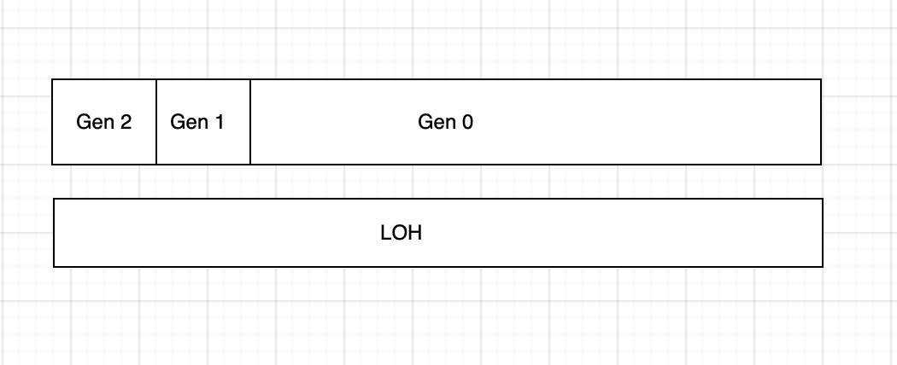
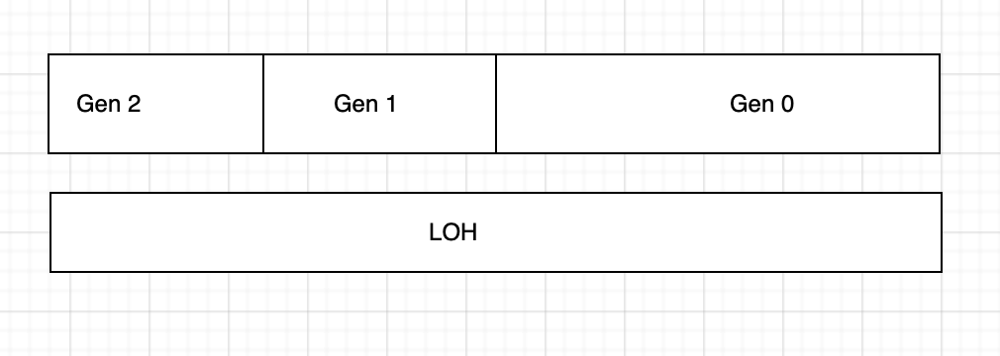
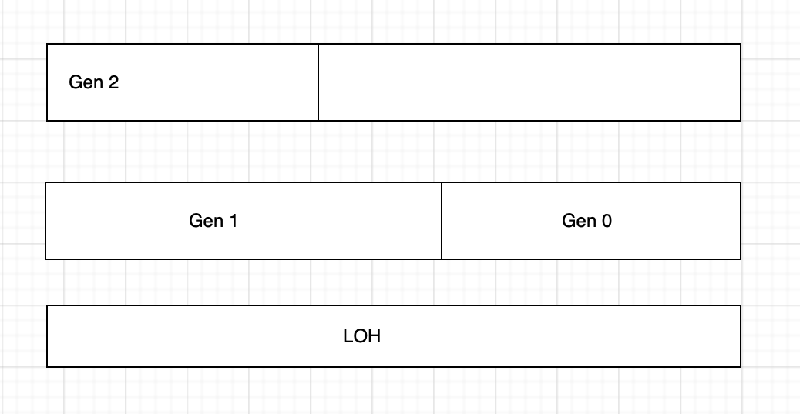

# 垃圾回收机制

在托管进程中的垃圾回收有两种模式

1. 本机内存堆（Native Heap），由 VirtualAlloc 这个 Windows API 分配的，是 OS 和 CLR 使用的，用于 **非托管代码所需的内存**，如 Windows API，操作系统数据结构以及 CLR 数据等。
2. 托管堆（Managed Heap），这个就是我们最常用的，用于所有 .NET 所有对象的内存分配，也被称为 **GC 堆**，因为其中的对象都要受垃圾回收机制的控制。

## 托管堆

托管堆又分两种

1. 小对象堆
2. 大对象堆，> 85000 字节的都是 LOH（大对象堆）

它们都有各自的内存段，并且都可能有多个内存段。小对象堆一般分为三代，分别是 0，1，2 代。其中 0，1 总是被分配在同一个内存段中的。在初始化阶段，各个阶段的内存分布情况如下图

内存地址从左到右是由小变大的。从图中也能看出 Gen 0 与 Gen 1 是分配在同一个内存段的。第 2 代和第 1 代堆只有占开始的一小部分。因为在初始化的时候它们都还是空的。

如果在应用程序运行过程中，不断的在分配对象内存。如果这个对象内存的大小是小于 85000 字节的，那么默认就会被分配到第 0 代，以及**紧挨着当前已用的内存空间往后分配**。因此整个分配过程与速度都是非常快的。但是一旦快速分配失败（一直内部分配机制，前面提到的紧挨着内存后分配的机制），对象就可能在第 0 代的任意位置存储。所以这就必然导致会浪费内存（内存碎片化），**一旦超过第 0 代所属的内存段边界，那么就会触发垃圾回收机制了**。

每次 GC 都会把第 0 代没有被引用的对象回收掉。并且都会把它提升一代。即第 0 代变为第 1 代，第 1 代升为第 2 代。在发生垃圾回收是，会触发 “碎片整理”（也叫内存压缩），是一种移动对象到新的位置，其目的是为了内存对象的连续性，提高访问效率（CPU 缓存）。在几次垃圾回收，并且没有做 “碎片整理” 的内存堆分布图由上图就会变为以下这样

对象的位置没有移动过，但是每个代的内存堆的边界发生了改变。

每一代内存发生压缩移动时，消耗的代价很大。因为 GC 要查找所有对象是否已经被回收（没有被引用），找到然后要把她们指向新的位置（终结队列），并还可能会暂停所有托管线程。所以垃圾回收会在 “划算” 时才会进行碎片整理。

> 这里提到的 “划算” 适时的进行垃圾回收，内部采用了类似标记法来临时标记某些对象已被 “释放” ，然后在某个时刻一次性把这些做了标记的对象全部回收并内存压缩。

那么垃圾回收器是如何知道哪些对象有没有被引用呢？

实际上是通过一种树形结构来一层层引用往下找得知的。有一点需要注意：有些对象可能没有受到 GC 根对象的引用，但如果是位于第 2 代内存堆中，那么第 0 代回收是不会清理这些对象的，必须得等到 Full GC 才会被清理。

如果第 0 代堆即将占满一个内存段，垃圾回收也无法通过内存压缩移动内存对齐来获取足够的空间内存，这个时候 GC 就会再分配一个新的内存段，容纳第 1 代和 第 0 代，老的内存段将会变为第 2 代堆。老的第 0 代所有对象都会被放入新的第  1 代堆中，老的 1 代堆同理将提升为第 2 代堆。内存分配图如下

## 垃圾回收的阶段

1. 挂起（Suspension）—— 在垃圾回收之前，所有托管线程都要被强制中止。
2. 标记（Mark）—— 从 GC 根节点开始，沿着所有对象引用遍历并标记
3. 碎片整理（Compact）—— 将对象重新紧挨着排放并更新引用，减少内存碎片化。在小对象堆中是按需进行的，无法控制。大对象堆碎片整理不会自动进行。
4. 恢复（Resume）—— 托管线程恢复