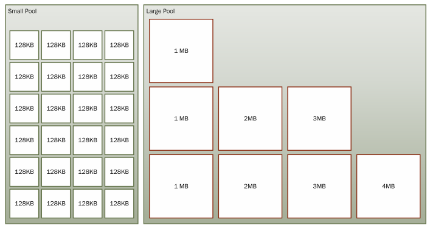

# 内存分配

## Class

类一般在堆中分配内存，并通过指针的间接引用进行访问，所以传递对象的代价很小，因为只需要复制其引用的（指针）即可（一般是 4 或 8 个字节）。

一个空对象有一些固定的开销，32 位系统进程需要 8 个字节，64 位系统进程需要 16 个字节。这部分开销包含了

- 指向访问表的指针（类型对象指针）
- 同步索引块字段

一个空对象分配具体的内存大小为 12 字节（32 系统）或 24 个字节（64 位系统）。因为 .NET 会进行内存对齐

## Struct

结构体不比类，没有引用的开销，就是结构对象内部的所有字段内存大小之和。如果结构体对象被申明在方法内部并作为局部变量，那么内存会在堆中分配。如果你把结构体当作参数传递，那么就会逐字节地复制进去。

## 内存计算

拿具体的例子说明问题。假定在一个 64 位系统中，有一个数据结构包含 16 个字节的数据，数组长度为 1000000。那么对象数组所占用的总空间为：

Class：16 字节数组开销 +（ 8 字节指针 * 1000000）+ （16 字节数据 + 16 字节开销）* 1000000 = 40 MB

Struct：16 字节数组开销 + （16 字节数据 * 1000000） = 16 MB

## 如何用 C# 代码计算一个对象的内存大小

首先以空对象为例

```c#
class Empty {
}

// program.cs
const int size = 1000 * 1000;
// var empty = new Empty();
var before = GC.GetTotalMemory(true);
var empty = new Empty();
var after = GC.GetTotalMemory(true);

var diff = after - before;

Console.WriteLine("空对象内存大小：" + diff);
GC.KeepAlive(empty);
```

“结构” 所占用的内存少。除了对象的额外开销，由于内存压力增大，就会发生更高频率的垃圾回收。并且我们要知道，**结构体的内存分配内部的地址是连续的。CPU 周边拥有多级缓存，对连续的内存顺序访问会有优化。**

## 结构体的 Equals 和 GetHashCode

在使用结构时，我们一定要注意就是要**重写 Equals 和 GetHashCode 方法**。如果只是单独重写 Equals 方法，性能还不能发挥极致，因为这个方法会对值类型进行装箱操作（类型转换）。因此还要实现范型版本 `Equals(T other)` 方法。`IE quatable<T>` 接口就是为此存在的。**所有的值类型都应该实现这个接口**。

```c#
public struct Vector : IEquatable<Vector> {
    public int X { get; set; }
    public int Y { get; set; }
    public int Z { get; set; }

    public int Magnitude { get; set; }

    // override object.Equals
    public override bool Equals(object obj) {
        if (obj == null || GetType() != obj.GetType()) {
            return false;
        }

        return this.Equals((Vector) obj);
    }

    public bool Equals([AllowNull] Vector other) {
        return this.X == other.X &&
            this.Y == other.Y &&
            this.Z == other.Z &&
            this.Magnitude == other.Magnitude;
    }

    // override object.GetHashCode
    public override int GetHashCode() {
        return X ^ Y ^ Z ^ Magnitude;
    }
}
```

## 接口分发（Dispatch）

当我们第一次通过接口调用方法时，.NET 必须找出是哪一个具体的类的方法来执行调用。**首先会调用一段存根代码（Stub），为实现了该接口的对象找到正确的方法。经过数次查找之后，CLR 会发现总是在调用同一个具体的类型，Stub 代码就会由间接调用简化为几条直接调用的汇编指令。**这几条指令被称为 Monomorphic Stub。

当然 Monomorphic Stub 也会检测到调用错误的方法。如果调用了其他类型的对象，那么 CLR 就会创建新类型的 Monomorphic Stub 替换掉 Stub 代码。

如果情况很复杂，需要调用很多类型，可预测性也不高（比如一个接口的实现类有多种类），**那么 Stub 代码会变成使用哈希表来选择方法的 Polymorphic Stub**。

如果上述情况对程序的确产生了性能影响，那么可以用以下两种方式优化：

- 避免通过公共接口调用对象方法
- 找出基础公共接口，然后用抽象基类替代

## 防止装箱

装箱是需要耗费 CPU 开销来进行对象分配、数据复制和强制类型转换的。严重的会导致 GC 的次数增加，增加 GC 堆的负担，从而导致大量的内存分配。

要尽量杜绝结构类型继承接口，然后引用接口调用。这样会发生装箱，增加 CPU 开销。

如果一个结构要以参数形式多次传递，那么这个结构类型应该改成引用类型。

最后，**传递值类型的引用是不会发生装箱操作，传给方法的是值类型的地址**。

## for vs foreach

对于数组和 List 集合来说，for 和 foreach 其实对于编译器来说都是一样的，.net 编译器会把 foreach 转换成 for 循环。

**但是要注意，IEnumerable 类型的 foreach 会有很大的性能开销**。

## is 操作符 vs as 操作符

is 操作符会对类型转换进行判断，并返回布尔类型值。

as 操作符会直接将类型转换成目标类型，失败会返回 null。

强制类型转换会造成性能损失，代价很大。我们可以用上面提到的 is，as 操作符转换。但千万要注意不要像下面一样转换：

```c#
if ( a is Foo) {
	Foo f = (Foo) a;
}
```

这样会执行两次类型转换。而是应该直接用 as 操作符转换，然后判断转换的对象是否为 null：

```c#
Foo f = a as Foo;
if( f != null) {
	// .. logic
}
```

## 委托的开销

委托是特殊的类，编译器会把委托类生成一个新的类。这里面有两个开销：**构造开销**和**调用开销**。调用开销在绝大多数情况下与普通方法调用差不多。前面说，委托会被编译器生成一个类对象，构造一个委托的开销要比方法调用高得多。我们在使用委托的时候应该只做**一次构造，并把对象缓存起来**。比如比较下面这段代码：

```c#
private delegate int MathOp(int x, int y);
private static int Add(int x, int y) => x + y;
private static int DoOperation(MathOp op, int x, int y) => op(x, y);

public static void Start() {
    // 1
    for (int i = 0; i < 10; i++) {
        DoOperation(Add, 1, 2);
    }

    // 2
    MathOp op = Add;
    for (int i = 0; i < 10; i++) {
        DoOperation(op, 1, 2);
    }
}
```

第二种虽然看起来只是把 Add 方法缓存到一个局部变量，但实际上里面细节牵扯到内存分配。这个通过查看 IL 即可知道。第一种在循环内部每次都会构造一个 Add 方法，而第二种会在循环外构造一次 Add 方法。这样第二种只会分配一次委托的对象内存。

```c#
// 第一种
// loop start (head: IL_001f)
IL_0005: nop
IL_0006: ldnull
IL_0007: ldftn int32 MomeryAllocation.DelegateOverhead::Add(int32, int32) /* 06000001 */
IL_000d: newobj instance void MomeryAllocation.DelegateOverhead/MathOp::.ctor(object, native int) /* 06000017 */
... 
  
// 第二种
// ldftn 先加载 add 到字段中，然后 new 一个委托对象，方法指向上一个字段
IL_0029: ldftn int32 MomeryAllocation.DelegateOverhead::Add(int32, int32) /* 06000001 */
IL_002f: newobj instance void MomeryAllocation.DelegateOverhead/MathOp::.ctor(object, native int) /* 06000017 */
IL_0034: stloc.0
IL_0035: ldc.i4.0
IL_0036: stloc.3
IL_0037: br.s IL_0048
// loop start (head: IL_0048)
  IL_0039: nop
  IL_003a: ldloc.0
  IL_003b: ldc.i4.1
  IL_003c: ldc.i4.2
  IL_003d: call int32 MomeryAllocation.DelegateOverhead::DoOperation(class MomeryAllocation.DelegateOverhead/MathOp, int32, int32) /* 06000002 */
```

> 我尝试使用 dotnet build --configuration Release 发现在 release 模式下针对这种情况像 `for(var i = 0; i <= GetEnumerable().Count(); i++)` 会自动优化的。结果发现与 debug 是一致的。

## 代码生成（ILGenerator）技术提升性能

以下内容来自《编写高性能 .NET 代码》

```c#
static bool CallMethodTemplate(object extensionObj, string argument)
{
	var extension = (DynamicLoadExtension.Extension)extensionObj;
	return extension.DoWork(argument);
}
```

现在我们要生成上面这段模板代码，首先我们看下 IL 代码：

```c#
.locals init {
	[0] class [DynamicLoadExtension]DynamicLoadExtension.Extension extension
}

IL_0000: ldarg.0
IL_0001: castclass [DynamicLoadExtension]DynamicLoadExtension.Extension
IL_0006: stloc.0
IL_0007: ldloc.0
IL_0008: ldarg.1
IL_0009: callvirt instance bool
[DynamicLoadExtension]DynamicLoadExtension.Extension::DoWork(string)
IL_000e: ret
```

用 IL 手动生成的代码为如下：

```c#
private static T GenerateMethodCallDelegate<T>(
	MethodInfo methodInfo,
	Type extensionObj,
	Type returnType,
	Type[] parameterTypes
) where T : class
{
	var dynamicMethod = new DynamicMethod("Invoke_" + methodInfo.Name, returnType, parameterTypes, true);
	var ilGenerator = dynamicMethod.GetILGenerator();
	ilGenerator.DeclareLocal(extensionType);
	// 第一个参数为 this 参数 
	ilGenerator.Emit(OpCodes.Ldarg_0);
	// 类型转换
	ilGenerator.Emit(OpCodes.Castclass, extensionType);
	// 方法参数
	ilGenerator.Emit(OpCodes.Stloc_0);
	ilGenerator.Emit(OpCodes.Ldloc_0);
	ilGenerator.Emit(OpCodes.Ldarg_1);
	ilGenerator.EmitCall(OpCodes.Callvirt, methodInfo, null);
	ilGenerator.Emit(OpCodes.Ret);
	
	object del = dynamicMethod.CreateDelegate(typeof(T));
	return (T)del;
}
```

解释一下上面 IL 操作：

1. 申明局部变量
2. 将 arg0（this 指针）压入堆栈（LdArg_0 指令）
3. 将 arg0 类型转换为右侧的类型，并将结果压入堆栈
4. 弹出栈顶数据并保存在局部变量中（Stloc_0 指令）
5. 将局部变量压入堆栈（Ldloc_0 指令）
6. 将 arg1（字符串参数）压入堆栈
7. 调用 DoWork 方法
8. 返回

优化点：我们可以把堆栈中经过类型转换的对象弹出，然后又马上压回堆栈。要把这种有关局部变量的操作都移除，这样就可以优化了。另外还有一点，上面方法调用的是 `Callvirt` ，我们知道这个方法不是虚方法，所以我们可以直接改为 `Call`。改版后的代码如下：

```c#
var ilGenerator = dynamicMethod.GetILGenerator();
// 对象的 this 参数
ilGenerator.Emit(OpCodes.Ldarg_0);
// 转换为正确的类型
ilGenerator.Emit(OpCodes.Castclass, extensionType);
// 实际的参数
ilGenerator.Emit(OpCodes.Ldarg_1);
ilGenerator.EmitCall(OpCodes.Call, methodInfo, null);
ilGenerator.Emit(OpCodes.Ret);
```

## 使用 RecyclableMemoryStream 代替  MemoryStream 

使用 `RecyclableMemoryStream` 代替 `MemoryStream` 能减少内存分配，我们之前一直在用的 `MemoryStream` 其实都是要临时开辟一个空间来存储我们的 IO 流的。这些对象在各个地方被分配和调整内存大小：入字符串编码，封送（marshall），解封（unmarshall），临时缓冲区等。这样会频繁导致应用程序需要花多部份的时间来执行 GC。

`RecyclableMemoryStream` 的出现就是为了解决这个问题，**这个内存流是被内部池化的，被池化的不是流本身，而是底层的缓冲字节**。提高了内存的重用性，减少内存碎片化。在使用 `RecyclableMemoryStream` 前，要先创建一个 `RecyclableMemoryStreamManager`。这个类它实际上就是管理的缓冲池和追踪资源使用情况。可以把它想象为 CLR 中的微堆。在这个类中，你可以设置所有关于流的配置，比如默认缓冲大小，堆的最大值等等。每个进程并在其生命周期内都会指定一个 manager 对象。

`RecyclableMemoryStream` 内部维护两类缓冲：SmallPool 和 LargePool。他们是由 `ConcurrentStack<byte[]>` 组成的。

SmallPool 是由许多相同大小的缓冲组成。“Small Pool” 中的 “Small” 指的是单个缓冲的大小，而不是 “Pool” 的大小。在里面的缓冲被称为块（因为他们由很长的流组合而成）。

LargePool 包含的是更大的缓冲区，但是很少，设计的初衷就是很少的使用它（只有在调用 `GetBuffer` 时使用）。这两个 pool 都使用统一的缓冲区大小来减小堆碎片化的可能性。



​																		(引用自《编写高性能.NET代码 第二版》)

> 从[块大小设定值](https://github.com/microsoft/Microsoft.IO.RecyclableMemoryStream/blob/master/src/RecyclableMemoryStreamManager.cs#L76)我们知道，small pool 是由多个相同大小的 128KB 的缓冲块组成，large pool [块大小设定值](https://github.com/microsoft/Microsoft.IO.RecyclableMemoryStream/blob/master/src/RecyclableMemoryStreamManager.cs#L84) 是由很少但容量大得多的最小 1MB ，最大 128M 的缓冲块组成。**注意，第二版写的时候时 2018 年，根据 github 上最新的代码看来，Large Pool 的最大缓冲块大小发生变化，最新的是 128MB。**

使用方法：

```c#
class Program
{
    private static readonly RecyclableMemoryStreamManager manager = new RecyclableMemoryStreamManager();
    static void Main(string[] args)
    {
        var sourceBuffer = new byte[] { 0, 1, 2, 3, 4, 5, 6, 7 };
        using (var stream = manager.GetStream())	// 也可以 using(var stream = manager.GetStream("anytag"))
        {
            stream.Write(sourceBuffer, 0, sourceBuffer.Length);
        }
    }
}
```

manager 是以默认配置创建的，获取了一个流，并向它写入字节，并在调用 `Dispose` 将流块返回给池。要注意的是 `var stream = manager.GetStream()` 这里传一个 tag 参数来构造流。这个 tag 可以不是唯一的，是用于在代码中标识其位置的，这样就能帮助更好的调试。不要求一定要传值，只是传的话更有用处。在内部，每个流都会生成一个 guid 来识别每个流，这样在使用多个 manager 并发追踪的情况下很有用。

在内部，` RecyclableMemoryStream ` 将从 manager 获取一个块。更多数据会写至这个流中，更多的块被链在一起，并且在这个流中的 API 就会把它们视为一个连续的内存块。随着流的长度增长，内存使用总量只会随着块大小的增长而增长（假设块没有被池化的情况下）。这与 `MemoryStream ` 的实现是相反的，后者在流增长时会，它的容量和会翻倍，这样就导致了潜在的内存浪费。

只要方法 `Read` 和 `Write` 被调用，那么块就会被使用。尽管如此，有时候也会需要获取一个连续的缓冲。因此，这里提供了 `GetBuffer` 方法调用，它集成自`MemoryStream `。当 `GetBuffer` 调用就会返回一个已连续的缓冲。如果这里只使用了一个块，则返回对它的引用。如果多个块被使用，则使用 Large Pool 来满足此请求，并将字节从块复制到更大的缓冲区。如果这个缓冲区的请求要比池中的最大缓冲块还要大，然后触发内存分配来满足请求。

值得注意的是，返回的缓冲区大小至少要比包含的数据的大小要一样大——实际它可能还要比这要大得多。要想知道具体得数据的大小，必须调用流的 `Length` 属性。库的本地用户有时候会忽略这个，并写入巨大的缓冲数据给网络或文件。之后再转换这个流为缓冲区，使用与数据相关联的 length，将它们包装再 ArrarySegment<byte> 结构中可能会很有用。

`ToArray` 方法在池化的场景中很少有用。它要求返回一个具有明确大小的数组，即就会发生分配（尽可能在大对象堆），就会发生内存复制。由于这些不高效的因素，`ToArray` 要尽量完全避免使用。

我建议你学习在本节前面提供的链接代码，因为这会对你理解这个库在均衡其他要求的同时是怎么样避免分配是有好处的。

我们在生产环境使用了这个库，我们看到大对象分配减少了 99%。担心昂贵的第二代垃圾回收已经称为过去。花费在垃圾回收的时间从 25% 下降到了不到 1%。

## JIT 对泛型的编译器优化

泛型参数的值类型参数不共享，拥有自己的方法标和EEClass，和自己的 JIT 代码。也就是说每个使用了值类型的泛型参数，CLR 都会为它们生成不同的代码片段。这就可能会导致 “代码膨胀” ，增加程序的内存占用。但这是无可避免的，因为编译器在编译的过程必须要确切的知道每个值类型的大小及其字段成员信息的布局。

引用类型的泛型参数拥有它们自己的方法表，我们可以说一个方法表是这个类型的唯一描述。但是所有的引用类型都共享一个 EEClass 和彼此之间共享它们方法的 JIT 代码。也就是说，对于作为泛型类型参数是引用类型时，CLR 将使用同一段代码。这是对内存的优化，极大的较少了内存占用。这也是因为引用类型有相同的 “字” 大小。`System.__Canno` 作为内部类并且充当一个占位符。它主要的目的就是为了让 JIT 在运行起能够发现这个类型。

所有的检查和类型查找都在 JIT 阶段完成。但是当你从一个泛型方法调用另一个泛型方法时，你就不知道具体的类型了，这就边得棘手了。引用类型的代码是共享的，在执行共享方法时，必须查找其主体中的任何泛型程序，来获得具体的运行时类型。CLR 将此过程称为 “运行时句柄查找”。这个过程是使共享泛型代码几乎和常规方法一样高效的重要原因。因为这些关键的性能特性，加上 JIT 和运行时协作，通过一系列复杂的技术来减少开销。

那么编译器对泛型的优化主要体现在哪？其实就在运行时查找这些具体的类型来 “替换” 泛型参数类（System.__Canon）,通过一系列缓存可以避免在运行时通过类转载器进入昂贵的类型查找。以下是泛型的类查找成本：

1. “类加载器” —— 这将便利对象及其方法的整个层次结构，并尝试找出匹配的应用程序的方法。显然，这种方法是非常慢的。（300 个时钟周期）
2. 全局缓存的类型层次遍历 —— 这是一个层次遍历，但它在全局缓存中使用声明类型（大约 50-60 时钟周期一次）
3. 全局缓存查找 ——这个查找使用了当前类型和声明的类型的全局缓存中查找（大约 30 个时钟周期）
4. 方法表插槽（slot）—— 向声明类型添加一个插槽，其中的代码序列可以在几个间接级别内查找准确的类型的（大约 10 时钟周期）

关于泛型更详细的资料详见：https://github.com/dotnet/runtime/issues/3877