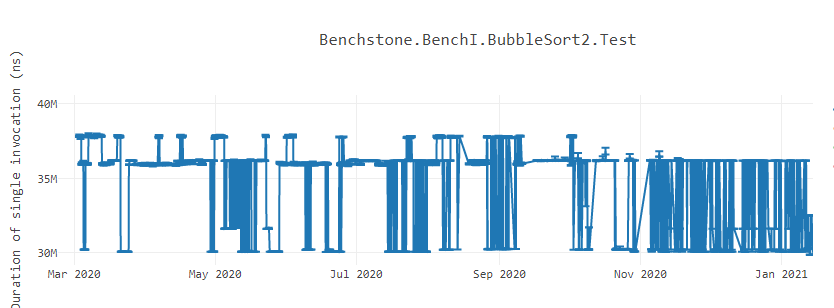

# 循环对齐

有时候我们会碰到很奇怪的程序行为表现差异的问题。比如 .NET 官方博客给出的冒泡排序再不同时间段的性能差异图：

要理解这种行为首先要先理解 CPU 在编译器执行生成的机器代码。CPU 获取需要执行的机器码（也称为指令流）。指令流是以一系列的操作码表示的。现在 CPU 以 16 字节块、32 字节块以及 64 字节块获取操作指令。CISC 架构体系具有可变长度编码，这意味着指令流中表示每条指令的操作码是可变长度的。所以当提取器（Fetcher）提取当个块，它并不知道指令在哪个点开始，哪个点结束。CPU 的预译码器（pre-decoder）从指令流块中识别出指令的边界和长度，而译码器则解码那些单独指令的操作码的含义，并为每条指令产生微操作（μops）。这些 μops 送至解码缓冲区（Decoder Stream Buffer，DSB），它是一个缓存，能把获取的实际指令索引在一起。在执行 fetch 之前，CPU 首先会检查 DSB 是否含有想要获取的 μops 指令。如果存在，那就不再需要循环获取指令，预解码以及解码操作。进而，这里还存在循环流缓检测器（Loop Stream Detector，LSD），它会检测如果 μops 指令流表示一个循环，那么它就会跳过前端的提取以及循环解码，继续执行 μops 指令直到这个循环发生意外。

## 代码对齐（Code Alignment）

假设我们正在一个 CPU 上执行一个应用程序，该 CPU 以 32字节 块的速度读取指令。应用程序内部有有一个热循环的方法。每次应用程序运行时，循环的机器代码都被放置在不同的偏移量上。有时，这个循环体它可能被放置在不越过 32 字节的地址边界。在这些情况下，指令获取器只需要在一轮中就获取整个循环的机器代码。相反，如果循环的机器代码的位置使循环体横跨了超过 32字节的边界，则获取器将不得不多次获取循环体。此时开发人员无法控制获取时间的变化，因为这取决于循环的机器码出现在何处。在这种情况下，就会发现方法的性能不稳定。**有时，该方法运行得更快，因为循环是在提取器（fetcher）有利的地址上对齐的，而其他时候，它可能会显示缓慢，因为循环是不对齐的，fetcher在获取循环体上花费了时间**。即使是与方法主体无关的微小改变（比如引入一个新的类级别变量，等等）也会**影响代码布局并使循环的机器代码不对齐**。这是可以在上面的冒泡排序基准中看到的模式。**由于指令的可变长度编码**，这个问题在 CISC 架构中最为明显。像 ARM 这样的RISC 架构 CPU 具有**固定长度编码**，因此可能不会在性能上看到如此大的差异。

为了解决这个问题，编译器会对热代码区域的执行对齐，以确保代码的性能保持稳定。**代码对齐是一种技术**，在生成的机器代码中，**编译器在代码的热点区域之前添加一个或多个 `NOP` 指令，从而将热点代码移动到一个地址为 mod(16)、mod(32) 或 mod(64)。**通过这样做，可以在更少的周期内获取最多的热代码。研究表明，通过执行这样的对齐，代码可以获得极大的好处。**此外，这类代码的性能是稳定的，因为它不受位于不对齐地址位置的代码的影响。**为了从细节上理解代码对齐的影响，我强烈建议大家看看英特尔工程师 Zia Ansari 在2016年 LLVM 开发者会议上发表的 [IA 演讲中关于代码位置导致性能波动的原因](https://www.youtube.com/watch?v=IX16gcX4vDQ&ab_channel=LLVM)。

在 .NET 5 中，我们开始在 32 字节边界对方法进行对齐。在 .NET 6 中，我们增加了一个特性来执行自适应循环对齐，在一个有循环的方法中添加 NOP 填充指令，这样循环代码可以从 mod(16) 或 mod(32) 内存地址开始。

https://devblogs.microsoft.com/dotnet/loop-alignment-in-net-6/

