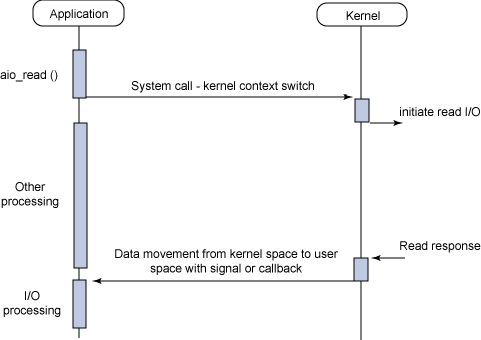

# 使用异步 I/O 提升应用程序性能

## 异步 I/O 简介

Linux 异步 I/O 是最近（指2006年，该文章2006年8月发表）才加入 Linux 内核的。它是 2.6 版内核的标准功能，但你也可以找到 2.4 版的补丁。异步 I/O 背后的基本思想是允许进程启动一系列 I/O 操作，而无需阻塞或等待任何操作完成。稍后，或在收到 I/O 完成的通知后，进程可以检索 I/O 的结果。

## I/O 模型

在深入研究 AIO API 之前，让我们先来了解一下 Linux 下可用的不同 I/O 模型。这并不是一个详尽无遗的回顾，而是旨在涵盖最常见的模型，以说明它们与异步 I/O 的区别。图 1 显示了同步和异步模型，以及阻塞和非阻塞模型。

图 1.基本 Linux I/O 模型的简化矩阵


每种 I/O 模式都有适合特定应用的使用模式。本节将对每种模式进行简要探讨。

### 同步阻塞 I/O

同步阻塞 I/O 模型是最常见的模型之一。在这种模式下，用户空间应用程序执行系统调用，导致应用程序阻塞。这意味着应用程序会阻塞，直到系统调用完成（数据传输或出错）。调用应用程序处于不消耗 CPU 的状态，只需等待响应即可，因此从处理角度看是高效的。

图 2 展示了传统的阻塞 I/O 模型，这也是目前应用程序中最常用的模型。它的行为很容易理解，对于典型的应用程序来说，它的使用也很高效。调用读取系统调用时，应用程序会阻塞，上下文切换到内核。然后开始读取，当响应返回时（从正在读取的设备返回），数据被移动到用户空间缓冲区。然后应用程序解除阻塞（读取调用返回）。

图 2.同步阻塞 I/O 模型的典型流程


从应用程序的角度看，读取调用的持续时间很长。但实际上，在读取操作与内核中的其他工作进行多路复用时，应用程序实际上是被阻塞的。

> I/O 绑定进程与 CPU 绑定进程
> I/O 绑定进程是指执行的 I/O 操作多于处理操作的进程。而 CPU 绑定进程的处理量大于 I/O。Linux 2.6 的调度程序实际上更倾向于 I/O 绑定进程，因为它们通常会启动 I/O 操作，然后阻塞，这意味着其他工作可以在它们之间有效地交错进行。

### 同步非阻塞 I/O

同步阻塞的一个效率较低的变种是同步非阻塞 I/O。在这种模式下，设备以非阻塞方式打开。如图 3 所示，这意味着读取时不会立即完成 I/O，而是会返回一个错误代码，表明无法立即执行命令（`EAGAIN` 或 `EWOULDBLOCK`）。

图 3.同步非阻塞 I/O 模型的典型流程


非阻塞的含义是，I/O 命令可能不会立即得到满足，应用程序需要多次调用以等待完成。这可能会导致效率极低，因为在很多情况下，应用程序必须忙于等待，直到数据可用，或者在内核执行命令时尝试执行其他工作。如图 3 所示，这种方法可能会在 I/O 中引入延迟，因为从数据在内核中可用到用户调用读取返回数据之间的任何间隙，都会降低整体数据吞吐量。

### 异步阻塞 I/O

另一种阻塞模式是带有**阻塞通知**的非阻塞 I/O。在这种模式下，先配置非阻塞 I/O，然后使用阻塞 `select` 系统调用来确定 I/O 描述符是否有任何活动。`select` 调用的有趣之处在于，它不仅能为一个描述符提供通知，还能为多个描述符提供通知。对于每个描述符，你都可以请求通知描述符写入数据的能力、读取数据的可用性以及是否发生了错误。

图 4.异步阻塞 I/O 模型的典型流程（`select`）


选择调用的主要问题是效率不高。虽然它是一种方便的异步通知模型，但不建议将其用于高性能 I/O。

### 异步非阻塞 I/O（AIO）

最后，异步非阻塞 I/O 模式是一种与 I/O 重叠处理的模式。读取请求会立即返回，表明读取已成功启动。然后，应用程序可以在后台读取操作完成时执行其他处理。当读取响应到达时，可生成信号或基于线程的回调，以完成 I/O 事务。

图 5 异步非阻塞 I/O 模型的典型流程



在单个进程中对潜在的多个 I/O 请求进行重叠计算和 I/O 处理的能力，利用了处理速度与 I/O 速度之间的差距。当一个或多个慢速 I/O 请求等待处理时，CPU 可以执行其他任务，或者更常见的是，在启动其他 I/O 的同时，对已经完成的 I/O 进行操作。

下一节将进一步研究这一模型，探索应用程序接口，然后演示一些命令。

## 异步 I/O 的动机

从前面的 I/O 模型分类中，我们可以看到 AIO 的动机。阻塞模式要求启动应用程序在 I/O 开始时阻塞。这意味着不可能同时重叠处理和 I/O。同步非阻塞模型允许处理与 I/O 重叠，但要求应用程序定期检查 I/O 的状态。剩下的就是异步非阻塞 I/O，它允许处理和 I/O 的重叠，包括通知 I/O 完成。

`select` 函数（异步阻塞 I/O）提供的功能与 AIO 类似，只是它仍然会阻塞。不过，它阻塞的是通知而不是 I/O 调用。

## Linux AIO 简介

本节将探讨 Linux 的异步 I/O 模型，以帮助您了解如何在应用程序中应用该模型。

在传统的 I/O 模型中，I/O 通道由唯一的句柄标识。在 UNIX® 中，这些句柄是文件描述符（文件、管道、套接字等都一样）。在阻塞式 I/O 中，您启动一次传输，当传输完成或发生错误时，系统调用就会返回。

> AIO for Linux
> AIO 在 2.5 版 Linux 内核中首次出现，现在已成为 2.6 版内核的标准功能。

在异步非阻塞 I/O 中，可以同时启动多个传输。这就需要为每次传输提供一个唯一的上下文，以便在传输完成时进行识别。在 AIO 中，这是一个 `aiocb`（AIO I/O 控制块）结构。该结构包含传输的所有信息，包括数据的用户缓冲区。当发生 I/O 通知时（称为 `completion`），`aiocb` 结构可用于唯一标识已完成的 I/O。API 演示展示了如何做到这一点。

### AIO API

AIO 接口应用程序接口非常简单，但它提供了通过几种不同的通知模式进行数据传输的必要功能。表 1 显示了 AIO 接口函数，本节稍后将对其做进一步解释。

表 1.AIO 接口应用程序接口

| API 函数      | 描述                                               |
| :------------ | :------------------------------------------------- |
| `aio_read`    | 请求执行异步读取操作                               |
| `aio_error`   | 检查异步请求的状态                                 |
| `aio_return`  | 获取已完成异步请求的返回状态                       |
| `aio_write`   | 请求执行异步写操作                                 |
| `aio_suspend` | 暂停调用进程，直到一个或多个异步请求完成（或失败） |
| `aio_cancel`  | 取消异步 I/O 请求                                  |
| `lio_listio`  | 启动 I/O 操作列表                                  |

每个 API 函数都使用 `aiocb` 结构来启动或检查。该结构有许多元素，但清单 1 仅显示了您需要（或可以）使用的元素。

清单 1.显示相关字段的 aiocb 结构

```c
struct aiocb {

  int aio_fildes;               // File Descriptor
  int aio_lio_opcode;           // Valid only for lio_listio (r/w/nop)
  volatile void ∗aio_buf;       // Data Buffer
  size_t aio_nbytes;            // Number of Bytes in Data Buffer
  struct sigevent aio_sigevent; // Notification Structure

  /∗ Internal fields ∗/
  ...

};
```

`sigevent` 结构会告诉 AIO 在 I/O 完成后要做什么。您将在 AIO 演示中了解这一结构。现在，我将向你展示 AIO 的各个 API 函数是如何工作的，以及如何使用它们。

#### aio_read

`aio_read` 函数请求对一个有效的文件描述符进行异步读取操作。文件描述符可以代表文件、套接字，甚至管道。aio_read 函数的原型如下：

```c
int aio_read( struct aiocb ∗aiocbp );
```

`aio_read` 函数在请求排队后立即返回。成功时返回 0，错误时返回-1，其中 errno 已定义。

要执行读取操作，应用程序必须初始化 `aiocb` 结构。下面的简短示例说明了如何填写 `aiocb` 请求结构并使用 `aio_read` 执行异步读取请求（暂时忽略通知）。该示例还展示了 `aio_error` 函数的使用，稍后我会对此进行说明。

清单 2.使用 `aio_read` 进行异步读取的示例代码

```c
#include <aio.h>

...

  int fd, ret;
  struct aiocb my_aiocb;

  fd = open( "file.txt", O_RDONLY );
  if (fd < 0) perror("open");

  /∗ Zero out the aiocb structure (recommended) ∗/
  bzero( (char ∗)&my_aiocb, sizeof(struct aiocb) );

  /∗ Allocate a data buffer for the aiocb request ∗/
  my_aiocb.aio_buf = malloc(BUFSIZE+1);
  if (!my_aiocb.aio_buf) perror("malloc");

  /∗ Initialize the necessary fields in the aiocb ∗/
  my_aiocb.aio_fildes = fd;
  my_aiocb.aio_nbytes = BUFSIZE;
  my_aiocb.aio_offset = 0;

  ret = aio_read( &my_aiocb );
  if (ret < 0) perror("aio_read");

  while ( aio_error( &my_aiocb ) == EINPROGRESS ) ;

  if ((ret = aio_return( &my_iocb )) > 0) {
    /∗ got ret bytes on the read ∗/
  } else {
    /∗ read failed, consult errno ∗/
  }
```

在清单 2 中，打开读取数据的文件后，将 `aiocb` 结构清零，然后分配一个数据缓冲区。数据缓冲区的引用被放入 `aio_buf`。随后，将缓冲区的大小初始化为 `aio_nbytes`。`aio_offset` 设置为零（文件中的第一个偏移量）。在 `aio_fildes` 中设置读取的文件描述符。设置这些字段后，调用 `aio_read` 请求读取。然后可以调用 `aio_error`，以确定 `aio_read` 的状态。只要状态是 `EINPROGRESS`，就需要忙于等待，直到状态发生变化。此时，您的请求要么成功，要么失败。

> 使用 AIO 接口构建程序
> 您可以在 aio.h 头文件中找到函数原型和其他必要的符号。在构建使用该接口的应用程序时，必须使用 POSIX 实时扩展库（librt）。

请注意，这与使用标准库函数从文件中读取数据非常相似。除了 `aio_read` 的异步性质外，另一个不同之处在于为读取设置偏移量。在典型的读取调用中，偏移量会保存在文件描述符上下文中。每次读取时，偏移量都会更新，以便后续读取能寻址到下一个数据块。异步 I/O 就不可能做到这一点，因为你可以同时执行多个读取请求，所以你必须为每个特定的读取请求指定偏移量。

#### aio_error

`aio_error` 函数用于确定请求的状态。其原型为

```c
int aio_error( struct aiocb ∗aiocbp );
```

该函数可以返回以下信息：

- `EINPROGRESS` 表示请求尚未完成
- `ECANCELLED`，表示请求已被应用程序取消
- -1，表示发生了错误，可查阅 `errno`

#### aio_return

异步 I/O 与标准阻塞 I/O 的另一个区别是，由于读调用不是阻塞的，因此无法立即访问函数的返回状态。在标准读调用中，返回状态是在函数返回时提供的。异步 I/O 则使用 `aio_return` 函数。该函数的原型如下:

```c
ssize_t aio_return( struct aiocb ∗aiocbp );
```

只有在 `aio_error` 调用确定请求已完成（成功或出错）后，才会调用该函数。`aio_return` 的返回值与同步情况下读取或写入系统调用的返回值相同（传输的字节数或错误为-1）。

#### aio_write

`aio_write` 函数用于请求异步写入。其函数原型为:

```c
int aio_write( struct aiocb ∗aiocbp );
```

`aio_write` 函数会立即返回，表明请求已被挂起（成功时返回 0，失败时返回 -1 并正确设置 `errno`）。

这与读取系统调用类似，但有一个行为差异值得注意。回想一下，在读取调用中，使用的偏移量很重要。但对于写入调用，偏移量只有在未设置 `O_APPEND` 选项的文件上下文中使用时才重要。如果设置了 `O_APPEND`，偏移量将被忽略，数据将被追加到文件末尾。否则，`aio_offset` 字段将决定数据写入文件的偏移量。

#### aio_suspend

您可以使用 `aio_suspend` 函数暂停（或阻塞）调用进程，直到异步 I/O 请求完成、信号触发或可选超时发生。调用者提供了一个 `aiocb` 引用列表，其中至少一个引用的完成将导致 `aio_suspend` 返回。`aio_suspend` 的函数原型是:

```c
int aio_suspend( const struct aiocb ∗const cblist[],
                  int n, const struct timespec ∗timeout );
```

使用 `aio_suspend` 非常简单。系统会提供一个 `aiocb` 引用列表。如果其中任何一个引用完成，调用返回 0，否则返回-1，表明发生了错误。参见清单 3。

清单 3.使用 `aio_suspend` 函数阻塞异步 I/O

```c
struct aioct ∗cblistMAX_LIST
/∗ Clear the list. ∗/
bzero( (char ∗)cblist, sizeof(cblist) );

/∗ Load one or more references into the list ∗/
cblist[0] = &my_aiocb;

ret = aio_read( &my_aiocb );

ret = aio_suspend( cblist, MAX_LIST, NULL );
```

请注意，`aio_suspend` 的第二个参数是 `cblist` 中元素的个数，而不是 `aiocb` 引用的个数。`aio_suspend` 会忽略 `cblist` 中的任何 NULL 元素。

如果向 `aio_suspend` 提供了超时，并且超时发生，则返回 -1，并且 `errno` 包含 `EAGAIN`。

#### aio_cancel

通过 `aio_cancel` 函数，可以取消给定文件描述符的一个或所有未执行的 I/O 请求。其原型为

```c
int aio_cancel( int fd, struct aiocb ∗aiocbp );
```

要取消单个请求，请提供文件描述符和 `aiocb` 引用。如果请求成功取消，函数将返回 `AIO_CANCELED`。如果请求完成，函数将返回 `AIO_NOTCANCELED`。

若要取消指定文件描述符的所有请求，请提供该文件描述符和 `aiocbp` 的 NULL 引用。如果所有请求都被取消，函数将返回 `AIO_CANCELED`；如果至少有一个请求无法取消，函数将返回 `AIO_NOT_CANCELED`；如果所有请求都无法取消，函数将返回 `AIO_ALDONE`。然后，可以使用 `aio_error` 评估每个 AIO 请求。如果请求被取消，`aio_error` 返回-1，errno 设置为 `ECANCELED`。

#### lio_listio

最后，AIO 提供了一种使用 `lio_listio` API 函数同时启动多个传输的方法。这个函数非常重要，因为它意味着你可以在单个系统调用的上下文中启动大量 I/O（即一次内核上下文切换）。从性能角度看，这是个很好的功能，因此值得一试。`lio_listio` API 函数的原型如下：

```c
int lio_listio( int mode, struct aiocb ∗list[], int nent,
                   struct sigevent ∗sig );
```

`mode` 参数可以是 `LIO_WAIT` 或 `LIO_NOWAIT`。`LIO_WAIT` 会阻止调用，直到所有 I/O 操作完成。`LIO_NOWAIT` 则在操作排队完成后返回。`list` 是一个 `aiocb` 引用列表，元素的最大数目由 `nent` 定义。请注意，`list` 中的元素可能是 NULL，而 `lio_listio` 会忽略这一点。`sigevent` 引用定义了所有 I/O 操作完成后的信号通知方法。

`lio_listio` 的请求与典型的读或写请求略有不同，因为必须指定操作。清单 4 对此进行了说明。

清单 4.使用 `lio_listio` 函数启动请求列表

```c
struct aiocb aiocb1, aiocb2;
struct aiocb ∗list[MAX_LIST];

...

/∗ Prepare the first aiocb ∗/
aiocb1.aio_fildes = fd;
aiocb1.aio_buf = malloc( BUFSIZE+1 );
aiocb1.aio_nbytes = BUFSIZE;
aiocb1.aio_offset = next_offset;
aiocb1.aio_lio_opcode = LIO_READ;

...

bzero( (char ∗)list, sizeof(list) );
list[0] = &aiocb1;
list[1] = &aiocb2;

ret = lio_listio( LIO_WAIT, list, MAX_LIST, NULL );
```

读操作在 `aio_lio_opcode` 字段中用 `LIO_READ` 表示。对于写操作，则使用 `LIO_WRITE`，但 `LIO_NOP` 也适用于无操作。

## AIO 通知

在了解了可用的 AIO 函数后，本节将深入探讨可以用于异步通知的方法。我将通过**信号**和**函数回调**来探讨异步通知。

### 信号异步通知

使用信号进行进程间通信（IPC）是 UNIX 的一种传统机制，AIO 也支持这种机制。在这种模式下，应用程序定义了一个信号处理程序，当指定的信号发生时，该处理程序就会被调用。然后，应用程序指定异步请求在请求完成后发出信号。作为信号上下文的一部分，提供了特定的 `aiocb` 请求，以跟踪多个可能未完成的请求。清单 5 演示了这种通知方法。

清单 5.使用信号通知 AIO 请求

```c
void setup_io( ... )
{
  int fd;
  struct sigaction sig_act;
  struct aiocb my_aiocb;

  ...

  /∗ Set up the signal handler ∗/
  sigemptyset(&sig_act.sa_mask);
  sig_act.sa_flags = SA_SIGINFO;
  sig_act.sa_sigaction = aio_completion_handler;


  /∗ Set up the AIO request ∗/
  bzero( (char ∗)&my_aiocb, sizeof(struct aiocb) );
  my_aiocb.aio_fildes = fd;
  my_aiocb.aio_buf = malloc(BUF_SIZE+1);
  my_aiocb.aio_nbytes = BUF_SIZE;
  my_aiocb.aio_offset = next_offset;

  /∗ Link the AIO request with the Signal Handler ∗/
  my_aiocb.aio_sigevent.sigev_notify = SIGEV_SIGNAL;
  my_aiocb.aio_sigevent.sigev_signo = SIGIO;
  my_aiocb.aio_sigevent.sigev_value.sival_ptr = &my_aiocb;

  /∗ Map the Signal to the Signal Handler ∗/
  ret = sigaction( SIGIO, &sig_act, NULL );

  ...

  ret = aio_read( &my_aiocb );

}


void aio_completion_handler( int signo, siginfo_t ∗info, void ∗context )
{
  struct aiocb ∗req;


  /∗ Ensure it's our signal ∗/
  if (info‑>si_signo == SIGIO) {

    req = (struct aiocb ∗)info‑>si_value.sival_ptr;

    /∗ Did the request complete? ∗/
    if (aio_error( req ) == 0) {

      /∗ Request completed successfully, get the return status ∗/
      ret = aio_return( req );

    }

  }

  return;
}
```

在清单 5 中，我们在 `aio_completion_handler` 函数中设置了信号处理器以捕获 `SIGIO` 信号。然后初始化 `aio_sigevent` 结构，以引发 `SIGIO` 通知（通过 `sigev_notify` 中的 `SIGEV_SIGNAL` 定义指定）。读取完成后，信号处理程序会从信号的 `si_value` 结构中提取特定的 `aiocb`，并检查错误状态和返回状态，以确定 I/O 是否完成。

就性能而言，完成处理程序是通过请求下一次异步传输来继续 I/O 的理想位置。这样，当一次传输完成后，就可以立即开始下一次传输。

### 回调异步通知

另一种通知机制是系统回调。这种机制不是发出信号进行通知，而是**调用用户空间的函数**进行通知。您需要将 `aiocb` 引用初始化到 `sigevent` 结构中，以唯一标识正在完成的特定请求；请参阅清单 6。

清单 6.使用线程回调通知 AIO 请求

```c
void setup_io( ... )
{
  int fd;
  struct aiocb my_aiocb;

  ...

  /∗ Set up the AIO request ∗/
  bzero( (char ∗)&my_aiocb, sizeof(struct aiocb) );
  my_aiocb.aio_fildes = fd;
  my_aiocb.aio_buf = malloc(BUF_SIZE+1);
  my_aiocb.aio_nbytes = BUF_SIZE;
  my_aiocb.aio_offset = next_offset;

  /∗ Link the AIO request with a thread callback ∗/
  my_aiocb.aio_sigevent.sigev_notify = SIGEV_THREAD;
  my_aiocb.aio_sigevent.notify_function = aio_completion_handler;
  my_aiocb.aio_sigevent.notify_attributes = NULL;
  my_aiocb.aio_sigevent.sigev_value.sival_ptr = &my_aiocb;

  ...

  ret = aio_read( &my_aiocb );

}


void aio_completion_handler( sigval_t sigval )
{
  struct aiocb ∗req;

  req = (struct aiocb ∗)sigval.sival_ptr;

  /∗ Did the request complete? ∗/
  if (aio_error( req ) == 0) {

    /∗ Request completed successfully, get the return status ∗/
    ret = aio_return( req );

  }

  return;
}
```

在清单 6 中，创建了 `aiocb` 请求后，使用 `SIGEV_THREAD` 作为通知方法，请求线程回调。然后指定特定的通知处理程序，并加载要传递给处理程序的上下文（在本例中，是对 `aiocb` 请求本身的引用）。在处理程序中，只需对传入的 `sigval` 指针进行转换，然后使用 AIO 函数来验证请求是否已完成。

## 针对 AIO 的系统调整

proc 文件系统包含两个虚拟文件，可针对异步 I/O 性能进行调整：

- `/proc/sys/fs/aio-nr` 文件提供当前全系统异步 I/O 请求数。
- `/proc/sys/fs/aio-max-nr` 文件是允许的最大并发请求数。最大值通常为 64KB，足以满足大多数应用的需要。

## 总结

使用异步 I/O 可以帮助您构建更快、更高效的 I/O 应用程序。如果您的应用程序可以重叠处理和 I/O，那么异步 I/O 可以帮助您构建一个更高效地使用可用 CPU 资源的应用程序。虽然这种 I/O 模式不同于大多数 Linux 应用程序中的传统阻塞模式，但异步通知模式概念简单，可以简化设计。

> 注意：
>
> 该文章于 2023-03-24 归档停止维护。

# 原文地址

[Boost application performance using asynchronous I/O - IBM Developer](https://developer.ibm.com/articles/l-async/)

