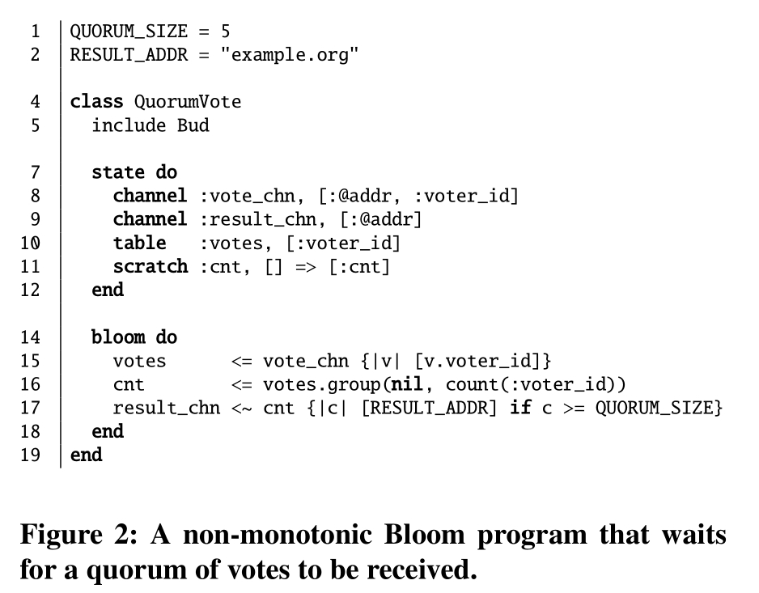

# 分布式编程的逻辑与网格

## 摘要

近年来，人们对于在不增加强一致性存储基础设施的延迟和可用性成本的情况下实现应用级一致性标准产生了兴趣。一种标准技术是采用可交换操作的词汇表；这避免了由于消息重新排序导致不一致性的风险。一个更强大的方法最近被 CALM 定理所捕获，该定理证明了逻辑单调程序保证最终一致性。在像 Bloom 这样的逻辑语言中，CALM 分析可以自动验证程序模块是否实现了无需协调的一致性。在本文中，我们介绍了 BloomL，这是 Bloom 的一个扩展，它从这两个传统中汲取灵感。BloomL 将 Bloom 泛化以支持格，并扩展了 CALM 分析的能力，使其能够覆盖包含任意格的整个程序。我们展示了如何将 Bloom 解释器泛化以支持使用来自逻辑编程的知名策略高效评估基于格的代码。最后，我们使用 BloomL 开发了几个实用的分布式程序，包括一个类似于亚马逊 Dynamo 的键值存储，并展示了 BloomL 如何鼓励将小的、易于分析的格安全地组合成更大的程序。

## 引言

随着云计算变得越来越普遍，分布式系统固有的困难——异步性、并发性和部分故障——正在影响着越来越多的开发者社区。传统上，事务和其他形式的强一致性在数据管理层封装了这些问题。但近年来，人们对于不增加强一致性存储的延迟和可用性成本的情况下实现应用级一致性标准产生了兴趣[^8][^17]。最近的研究中有两种不同的框架受到了显著关注：收敛模块和单调逻辑。

**收敛模块**：在这种方法中，程序员编写封装模块，其公共方法提供有关消息重新排序和重试的特定保证。例如，Statebox 是一个开源库，它合并键值存储中数据项的冲突更新；库的用户只需要注册可交换、结合和幂等的合并函数[^19]。该方法在数据库和系统的早期研究[^12][^14][^17][^27][^39]以及群体研究[^11][^37]中有其根源。Shapiro 等人最近提出了一个名为无冲突复制数据类型（CRDTs）的形式化方法，将这些思想纳入了半格的代数框架[^34][^35]。CRDTs 存在两个主要问题：(a) 程序员负责确保他们方法的格属性（交换性、结合性、幂等性），(b) CRDTs 仅对单个数据对象提供保证，而不是对整个应用程序逻辑提供保证。以下是一个例子：

**示例 1**：一个复制的、容错的课程软件应用程序将学生分配到学习小组中。它使用两个集合 CRDTs：一个用于学生，另一个用于团队。应用程序读取一个学生版本，并将派生的元素插入到团队中。同时，另一个应用程序副本将 Bob 从学生中移除。CRDTs 的使用确保所有副本最终都会同意 Bob 不在学生中，但这还不够：如果团队中的派生值未更新以反映 Bob 的移除，则应用程序级别的状态将不一致。这超出了 CRDT 保证的范围。

综上所述，收敛模块的问题呈现出一个范围困境：一个小模块（例如，一个集合）使格属性易于检查和测试，但只提供简单的语义保证。大型 CRDTs（例如，一个最终一致的购物车）提供更高级的应用程序保证，但要求程序员确保对大模块的格属性，这导致软件难以测试、维护和信任。

**单调逻辑**：在最近的研究中，我们观察到数据库理论文献中的单调逻辑为思考分布式一致性提供了一个强大的视角。直观地说，单调程序随着时间的推移而取得进展：它永远不会在面对新信息时“撤回”早期的结论。我们提出了 CALM 定理，该定理证明了所有单调程序都是可合流的（对消息重新排序和重试不变），因此最终一致。[^5][^18][^25]。Datalog 程序的单调性可以通过语法保守地确定，因此 CALM 定理为分析分布式程序的一致性提供了基础。我们在 Bloom 中实现了 CALM，Bloom 是一种基于 Datalog 的分布式编程语言[^2][^9]。CALM 和 Bloom 的最初形式仅验证了计算随时间增长的fact集合的程序的一致性（“集合单调性”）；即“前进”是根据集合包含关系定义的。实际上，这种方法过于保守：它排除了常见的单调递增构造的使用，例如时间戳和序列号。

**示例 2**：在一种法定投票服务中，协调员计算来自参与者节点的投票数；一旦投票数超过阈值，就达到了法定数。这显然是单调的：投票计数单调递增，阈值测试（count(votes) > k）也从 False 增长到 True。但这两个结构（向上移动的可变变量和聚合）都被原始 CALM 分析标记为非单调。

CALM 定理消除了收敛单调逻辑的任何范围问题，但它提出了一个类型困境(type dilemma)。集合是唯一适合 CALM 分析的数据类型，但程序员可能有更自然的表示单调递增现象的方式。例如，单调计数器更自然地表示为增长的整数而不是增长的集合。这个困境导致 CALM 分析出现假阴性和过度使用协调，或者导致特殊的基于集合的实现，这可能难以阅读和维护。

### 1.1 BloomL：逻辑和格

我们通过 BloomL 解决了上述两个困境，BloomL 是 Bloom 的一个扩展，它结合了类似于 CRDTs 的半格构造。我们下面将详细介绍这个构造，但直观地说，BloomL 程序可以在任意类型上定义 —— 不仅仅是集合 —— 只要它们具有可交换的、结合的、幂等的合并函数（“最小上界”）用于成对的项目。这样的合并函数为其类型定义了一个偏序。这泛化了 Bloom（和传统的 Datalog），后者假设了一个固定的合并函数（集合并）和偏序（集合包含）。BloomL 提供了三个方面的主要改进，这些改进是 Bloom 和 CRDTs 现有技术的延伸：

1. BloomL 解决了逻辑编程的类型困境：BloomL 中的 CALM 分析能够评估任意格的单调性，使其在测试一致性方面更加灵活。BloomL 可以验证诸如时间戳和序列号等常用构造的无需协调的使用。
2. BloomL 通过形态和单调函数提供的保持单调性的映射，解决了 CRDTs 的范围困境。通过使用这种映射，CRDTs 提供的每个组件的单调性保证可以扩展到多个格类型项。这一功能对于上述的 CALM 分析至关重要。它对于即使整个程序不是单调设计的情况下，建立子程序的单调性也非常有用。
3. 为了高效的增量执行，我们扩展了标准 Datalog 半朴素评估方案 [^7] 以支持任意格。我们还描述了如何通过相对较小的更改来扩展现有的 Datalog 风格引擎以支持格。


### 1.2 Outline

本文的其余部分如下所述。第 2 节提供了有关 Bloom 和 CALM 的背景。第 3 节我们介绍了 BloomL，包括跨格映射和单调函数。我们详细介绍了 BloomL 的内置格类型，并展示了开发人员如何定义新的格。我们还描述了 CALM 分析如何扩展到 BloomL。第 4 节，我们描述了如何修改 Bloom 运行时以支持 BloomL，包括我们对支持格和关系的半朴素评估的扩展。在第 5 和第 6 节中，我们展示了两个案例研究。首先，我们使用 BloomL 实现了一个分布式键值存储，它支持最终一致性、对象版本控制使用向量时钟，以及法定复制。其次，我们重新审视了 Alvaro 等人在简单电子商务场景中的案例，其中客户端与复制的购物车服务交互 [^2]。我们展示了如何使用 BloomL 使“结账”操作单调且一致，尽管它需要聚合分布式数据集。

## 2. 背景

在本节中，我们回顾了 Bloom 编程语言和 CALM 程序分析。我们突出了一个简单的分布式程序，其中 CALM 分析在集合上的应用产生了不满意的结果。

| 名称      | 行为                                                         |
| --------- | ------------------------------------------------------------ |
| table     | 持久化存储                                                   |
| scratch   | 瞬时/临时存储                                                |
| channel   | 异步通信。通过 channel 派生出 fact，会在远程 Bloom 实例的数据库中于一个非确定性未来时间出现。 |
| periodic  | 系统时钟接口                                                 |
| interface | 软件模块间的接口指针                                         |

表1：Bloom 集合类型

### 2.1 Bloom

Bloom 程序是关于 `facts` 集合（元组）的声明性语句的集合。Bloom 程序的一个实例通过评估其语句在其本地数据库的内容上执行计算。实例通过异步消息传递进行通信，如下所述。

Bloom 程序的一个实例通过一系列时间步进行，每个时间步包含三个阶段。在第一阶段，接收传入事件（例如，网络消息）并将其表示为集合中的fact。在第二阶段，程序的语句在本地状态上评估，以计算可以从当前集合内容派生出的所有附加fact。在某些情况下（下面描述），派生fact旨在实现“副作用”，例如修改本地状态或发送网络消息。这些效果在时间步的第二阶段被推迟；第三阶段专门用于执行它们。

Bloom 的最初实现，称为 Bud，允许在 Ruby 程序中嵌入 Bloom 逻辑。图 1 显示了一个表示为注释 Ruby 类的 Bloom 程序。需要少量的命令式 Ruby 代码来实例化 Bloom 程序并开始执行它；更多细节可在 Bloom 语言网站上找到[^9]。

#### 2.1.1 数据模型

Bloom 数据模型基于集合。集合是类似于 Datalog 中关系的一组无序 facts。Bud 原型采用了 Ruby 类型系统而不是发明自己的；因此，Bud 中的fact只是一个不可变的 Ruby 对象数组。每个集合都有一个模式，它声明了集合中 facts 的结构（列名）。集合中的一列子集形成它的键：与关系模型一样，键列功能上决定了其余列。Bloom 程序使用的集合在 `state` 块中声明。例如，图1的第5行声明了一个名为 `link` 的集合，它有三个列，其中两个列形成集合的键。Ruby 是一种动态类型语言，所以 Bud 中的键和值可以持有任意的 Ruby 对象。

Bloom 提供了五种集合类型来表示不同类型的状态（表1）。`table` 存储持久数据：如果一个 fact 出现在表中，它将在未来的时间步中保留在表中（除非显示删除）。`scratch` 包含临时数据 -  scratch 集合的内容在每个时间步的开始被清空。scratch 类似于 SQL 视图：它们通常被用作命名中间结果或作为“宏”构造来启用代码重用的有用方式。`channel` 集合类型启用了 Bloom 实例之间的通信。`channel` 的模式有一个特殊的地点指定符(location specifier)（以“@”为前缀）；当为 channel 集合推派生一个 fact 时，它将出现在由地点指定符给出地址的 Bloom 实例的数据库中。`periodic` 和 `interface` 集合类型没有在我们的讨论中出现；感兴趣的读者被引用到 Bloom 网站[^9]。

#### 2.1.2 语句

每个 Bloom 语句有一个或多个输入集合和一个输出集合。一个语句的形式是：`<collection-identifier> <op> <collection-expression>` 左手边（lhs）是输出集合的名称，右手边（rhs）是一个产生集合的表达式。一个语句定义了输入集合如何在被包含（通过合并集合）在输出集合之前进行转换。Bloom 允许在 rhs 上使用通常的关系运算符（选择、投影、连接、分组、聚合和否定），尽管它采用了一种旨在更熟悉命令式程序员的语法。在图1中，第11行展示了投影，第12-14行在 `link` 和 `path` 之间执行连接，使用连接谓词 `link.to = path.from`，然后投影到四个属性，第16行展示了分组和聚合。Bloom 语句出现在一个或多个 bloom 块中。Bloom 提供了几个操作符，用于确定 rhs 何时将合并到 lhs（表2）。`<=` 操作符执行标准的逻辑推理：即，lhs 和 rhs 在同一时间步是真实的。`<+` 和 `<-` 操作符表示 fact 将分别在下一个时间步的开始添加到或从 lhs 集合中删除。`<~` 操作符指定 rhs 将在某个非确定性的未来时间步合并到 lhs 集合中。使用`<~` 的语句的 lhs 必须是通道；`<~` 操作符捕获异步消息传递。

| 操作符 | 名称     | 解释                                                  |
| ------ | -------- | ----------------------------------------------------- |
| <=     | 合并     | lhs 包含当前 rhs 时间步的集合内容                     |
| <+     | 延时合并 | lhs 包含 rhs 下一个时间步的内容                       |
| <-     | 延时删除 | lhs 移除 rhs 下一个时间步的内容                       |
| <~     | 异步合并 | （远程）lhs 在未来的不确定的时间步里将会包含 rhs 内容 |

表2：Bloom 操作符

Bloom 允许递归 - 即，语句的 rhs 可以引用 lhs 集合，无论是直接还是间接。与 Datalog 一样，必须采用某些约束以确保具有递归语句的程序具有合理的解释。对于推理语句（`<=`操作符），我们要求程序在句法上是分层的[^6]：不允许通过否定或聚合进行循环（除非它们包含一个延期或异步操作符）[^3]。

### 2.2 CALM 分析

在演绎数据库方面的工作早就区分了单调和非单调逻辑程序。直观地说，单调程序只随时间计算更多的信息 - 它永远不会在面对更多证据时“撤回”先前的结论。在 Bloom（和 Datalog）中，基于程序语法的单调性的简单保守测试是：选择、投影和连接是单调的，而聚合和否定则不是。

CALM 定理将单调逻辑理论与分布式一致性的实际问题联系起来[^2][^ 18]。所有单调程序都是“最终一致的”或一致的：对于任何给定的输入，所有程序执行都会导致相同的最终状态，而不管网络的不确定性如何[^ 5][^25]。因此，单调逻辑是构建松散一致的分布式编程的有用构建块。

根据 CALM 定理，分布式不一致可能仅在排序点(points of order)发生：程序位置，其中异步派生的值被非单调操作符消耗[^2]。这是因为异步消息传递导致非确定性到达顺序，并且非单调操作符在评估它们输入的不同子集时可能会产生不同的结论。例如，考虑一个由两个集合 A 和 B 组成的 Bloom 程序（两者都由异步通道提供），以及每当到达一个不在 B 中的 A 中的元素时就发送消息的规则。这个程序是非单调的，并且表现出不一致的行为：程序发送的消息将取决于 A 和 B 元素到达的顺序。

我们已经在 Bloom 中实现了一个保守的静态程序分析，它直接遵循 CALM 定理。没有非单调结构的程序被“祝福”为一致的：在不同运行中产生相同的输出或在多个分布式副本上收敛到相同的状态。否则，程序被标记为可能不一致。为了实现一致性，程序员需要重写他们的程序以避免使用非单调性，或者引入一个协调协议以确保在程序的每个排序点上都同意一致的顺序。协调协议（Coordination protocols）会增加额外的延迟并在网络分区的情况下降低可用性，因此本文我们专注于无协调设计 - 即，单调程序。



#### 2.2.1 集合单调性的局限性

CALM 定理最初的公式只考虑了随着时间计算更多fact的程序——即集合随时间单调增长的程序。许多分布式协议随时间取得进展，但它们的“进展”概念通常难以表示为fact集合的增长。例如，考虑图 2 中的 Bloom 程序。该程序通过 `vote_chn` 通道从客户端程序（未显示）接收投票。一旦收到至少 `QUORUM_SIZE` 个投票，就会向远程节点发送消息以表示已达到法定数（第 17 行）。该程序类似于“仲裁投票”子例程，可用于 Paxos[^22]或仲裁复制[^16]的实现

从直观上讲，这个程序在语义上以单调的方式取得进展：收到的投票集增长，投票集合的大小只能增加，所以一旦达到法定数就永远不会撤回。不幸的是，当前的 CALM 分析会将此程序视为非单调的，因为它包含了一个顺序点：第 16 行的分组操作。

为解决这个问题，我们需要引入一种根据集合包含之外的部分顺序“增长”的程序值的概念。我们通过将 Bloom 扩展为操作任意格，而不仅仅是集合格来实现这一点。

## 3. 将格添加到 Bloom

本节介绍了 BloomL，这是 Bloom 的一个扩展，允许使用任意格编写单调程序。我们首先回顾 CRDTs 中使用的格的代数属性，并指出单调函数和形态在该背景下的适用性。然后，我们引入了 BloomL 的基本概念，并详细介绍了语言提供的内置格。我们还将展示用户如何定义自己的格类型。

在设计 BloomL 时，我们决定将 Bloom 扩展以包括对格的支持，而不是从头开始构建一个新语言。因此，BloomL 与 Bloom 向后兼容，并且通过相对少量的更改实现了与 Bud 运行时的集成。我们在第 3.5 节中描述了如何使用格编写的代码可以与传统的面向集合的 Bloom 规则互操作。

### 3.1 定义

有界结半格是一个三元组 ⟨S, ⊔, ⊥⟩，其中 S 是一个集合，⊔ 是一个二元运算符（称为“结合”或“最小上界”），⊥ ∈ S。运算符 ⊔ 是可交换的、可结合的和幂等的。⊔ 运算符在 S 的元素上引入了一个偏序 ≤S：如果 x ⊔ y = y，则 x ≤S y。注意，尽管 ≤S 仅是一个偏序，但对于所有 x, y ∈ S，最小上界是定义的。特定的元素 ⊥ 是 S 中的最小元素：对于每个 x ∈ S，x ⊔ ⊥ = x。为了简洁，我们在本文的其余部分中使用术语“格（lattice）”来指代“有界联结半格（bounded join semilattice）”。我们使用非正式术语“合并函数(merge function)”来指代“最小上界(least upper bound)”。

从偏序集 S（poset S） 到偏序集 T 的单调函数是一个函数 `f:S→T`，满足 `∀𝑎,𝑏∈𝑆:𝑎≤𝑆𝑏⇒𝑓(𝑎)≤𝑇𝑓(𝑏)`。也就是说，𝑓 将 𝑆 中的元素映射到 T 中的元素，并尊重两个偏序集的偏序关系。

> 公式解析：
>
> - **偏序集（poset）**：这是一个集合，其中的元素具有一种部分顺序关系。比如，集合 𝑆 中的元素可以用 ≤*S* 来表示它们之间的顺序关系。
> - **单调函数（monotone function）**：这是一个函数 𝑓，它将 *S* 中的元素映射到 *T* 中的元素，并保持它们的顺序关系。也就是说，如果在 *S* 中 *a* 小于等于 *b*，那么在 *T* 中 *f(𝑎)* 也必须小于等于 *f*(*b*)。
>
> 举个例子，假设 *S* 是一组数字，并且我们有一个函数 *f* 将这些数字加1。这个函数是单调的，因为如果 a*≤*b 在 *S* 中成立，那么 `𝑎+1≤𝑏+1` 在 *T* 中也成立。

从格 `⟨𝑋,⊔𝑋,⊥𝑋⟩` 到格 `⟨𝑌,⊔𝑌,⊥𝑌⟩`  的形态是一个函数 `𝑔:𝑋→𝑌`，满足 `∀𝑎,𝑏∈𝑋:𝑔(𝑎⊔𝑋𝑏)=𝑔(𝑎)⊔𝑌𝑔(𝑏)` 。也就是说，𝑔 允许 X 中的元素映射到 Y 中的元素，并保持格的属性。注意，形态是单调函数，但反之则不然。

> 公式解析
>
> - **格（lattice）**：这是一个特殊的偏序集，每对元素都有一个最小上界（称为“并”或“least upper bound”）和一个最大下界。
> - **形态（morphism）**：这是一个函数 *g*，它将格 *X* 中的元素映射到格 *Y* 中的元素，并保持格的结构。也就是说，*g* 保持了“并”运算的结果一致性。
>
> 假设 *X* 和 *Y* 是两个不同的集合，但它们都有某种共同的结构，比如两个元素的最小上界。形态 *g* 确保了如果我们在 *X* 中找到两个元素的最小上界并将其映射到 *Y*，结果与我们先将这两个元素分别映射到 *Y* 中再找到它们的最小上界是相同的。

### 3.2 语言概念

BloomL 允许使用格和集合来表示状态。格类似于 Bloom 中的集合类型，而格元素（lattice element）对应于特定的集合。例如，`lset` 格类似于 Bloom 提供的表集合类型；`lset` 格的元素是特定的集合。在面向对象编程的术语中，格是一个类，遵守某个接口，而格的元素是该类的一个实例。图 3 包含了一个示例 BloomL 程序。

与集合一样，BloomL 程序中使用的格在状态块中声明。更准确地说，`state` 声明引入了一个与格元素相关联的标识符；随着时间的推移，标识符和格元素之间的绑定会更新以反映程序中的状态变化。例如，图 3 的第 10 行声明了一个标识符 `votes`，它映射到 `lset` 格的一个元素上。随着收到更多的投票，与 `votes` 标识符相关联的格元素会改变（它在 `lset` 格中“向上”移动）。当声明一个格标识符时，它最初绑定到值 ⊥，格中的最小元素。例如，`lset` 格最初包含空集。


#### 3.2.1 BloomL中的语句

BloomL 中的语句形式在 Bloom 和 BloomL 中都是一样的：`<identifier> <op> <expression>`。lhs 的标识符可以引用集合导向的集合或格元素。rhs 的表达式可以包含传统关系运算符（应用于 Bloom 集合）和在格上调用的方法。格方法是类似于面向对象语言中的方法，并使用标准的 Ruby 方法调用语法进行调用。例如，图 3 的第 17 行在 `lset` 格的元素上调用了 `size` 方法。

如果 lhs 是一个格，那么语句的操作符必须是 <= 或 <+（即时或延期的推演）。这些操作符的含义是，无论是在当前时间步还是下一个时间步，lhs 标识符将承担将格的最小上界应用于 lhs 和 rhs 格元素的结果。这与 Bloom 中的直觉相同：rhs 值被“合并到” lhs 格中，只是合并操作的语义由格的最小上界操作符定义。我们要求 lhs 和 rhs 引用相同类型的格。BloomL 不支持格的删除（<- 操作符）。格不直接支持异步通信（通过 <~ 操作符），但格元素可以嵌入到通道中出现的元组中（第 3.5.2 节）。

#### 3.2.2 格方法

BloomL 语句通过在格元素上调用方法来计算格上的值。正如关系代数的一个子集是单调的，一些格方法也是单调函数（如第 3.1 节所定义）。单调格方法保证了，如果调用该方法的格按照格的部分顺序增长，那么该方法返回的值将增长（根据返回值的格类型）。例如，lset 格提供的 `size` 方法是单调的，因为向集合中添加更多元素时，集合的大小会增加。从 CRDT 的角度来看，一个格的单调方法构成了可以在分布式环境中安全调用的操作的“安全”接口，而不会有不一致的风险。

一个格方法的签名指示其单调性属性。BloomL 区分单调方法和一部分是形态的单调方法。第 3.1 节定义了形态（morphism）必须满足的属性，但直观上说，格 T 上的形态可以分布式地应用在 T 的最小上界上。例如，lset 格提供的大小方法不是一个形态。看为什么，考虑 lset 格的两个元素，{1, 2} 和 {2, 3}。`size` 不是一个形态，因为 size({1, 2} ⊔lset {2, 3}) 不等于 size({1, 2}) ⊔lmax size({2, 3})。形态可以比单调方法更有效地评估，正如我们在第 4.1 节中讨论的。

格也可以定义非单调方法。使用非单调格方法类似于在 Bloom 中使用非单调关系运算符：Bud 解释器将程序分层以确保在允许非单调方法被调用之前，输入值已经完全计算。BloomL 鼓励开发人员尽量减少非单调结构的使用：正如 CALM 分析所建议的，非单调推理可能需要通过协调来确保一致的结果。

每个格定义了一个非单调的 reveal 方法，该方法返回格元素的表示为普通 Ruby 值。例如，lset 格上的 reveal 方法返回一个包含集合内容的 Ruby 数组。这个方法是非单调的，因为在从集合中提取了底层 Ruby 值之后，BloomL 无法确保后续代码以单调方式使用该值。

### 3.3 内置格

表 3 列出了 BloomL 包含的格。内置格支持几种常见的“progress”概念：一个从 false 变为 true 的谓词（`lbool`）、严格增加或严格减少的数值（分别为 `lmax` 和 `lmin`），以及随时间增长的各种类型的集合（`lset`、`lpset`、`lbag` 和 `lmap`）。大多数格方法的行为应该不会令人意外，因此我们不会在这节中描述每种方法。


`lbool` 格表示一旦满足就保持满足的条件。例如，`lmax` 格上的 gt 形态接受一个数字参数 n，并返回一个 `lbool`；一旦 `lmax` 超过 n，它将保持大于 n。`when_true` 形态接受一个 Ruby 代码块；如果 `lbool` 元素的值为 true，`when_true` 返回评估代码块的结果。例如，见图 3 的第 19 行。`when_true` 类似于“if”语句。

集合类的格支持常见的操作，如并集、交集和测试集合中是否存在某个元素。`project`形态接受一个代码块，并通过将代码块应用于输入集合的每个元素来形成一个新集合。对于代码块返回`nil`的元素，将从输出集合中省略，这使得`project`可以用作过滤器。

`lmap` 格将键与值关联。键是不可变的 Ruby 对象，值是格元素。例如，一个 Web 应用程序可以使用`lmap`将会话 ID 与包含该会话访问的页面的`lset`关联。`lmap`的合并函数对其输入映射的键集合进行并集操作。如果一个键在两个输入中都出现，则使用适当的格合并函数合并两个对应的值。注意，`at(v)`形态返回与键`v`关联的格元素（如果`lmap`不包含`v`，则返回`⊥`）。

`lpset`格是 BloomL 如何对应用程序的领域特定知识进行编码的一个例子。如果开发人员知道一个集合只包含非负数，那么这些数字的和将随着集合的增长而单调增加。因此，`sum`是`lpset`的一个单调函数。

### 3.4 用户定义的格

内置格足以表达许多程序。然而，BloomL 还允许开发人员创建自定义格以捕获特定领域的行为。要定义一个新的格，开发人员创建一个 Ruby 类，该类符合特定的 API 契约。图 4 显示了使用 Ruby 数组进行存储的 `lset` 格的简单实现。

一个格类必须继承自内置的 `Bud::Lattice` 类，并且还必须定义两个方法：

- `initialize(i)`: 给定一个 Ruby 对象 i，这个方法构建一个新的格元素，该元素“wraps”i（这是定义构造函数的标准 Ruby 语法）。如果 i 是 nil（空引用），这个方法返回 ⊥，格的最小元素。
- `merge(e)`: 给定一个格元素 e，这个方法返回 self 和 e 的最小上界。这个方法必须满足第 3.1 节中总结的最小上界代数属性——特别是，它必须是可交换的、可结合的和幂等的。注意，e 和 self 必须是同一个类的实例。

格还可以定义任意数量的单调函数、形态和非单调方法。在图 4 的第 13-15 行和第 21-23 行，可以看到声明形态和单调函数的语法。注意，格元素是不可变的——也就是说，格方法（包括合并方法）必须返回新值，而不是破坏性地修改它们的任何输入。

自定义格必须定义一个关键字，可以在 BloomL 状态块中使用。这是通过 wrapper_name 类方法完成的。例如，图 4 的第 2 行意味着在状态块中的“lset :foo”将引入一个与 `Bud::SetLattice` 实例相关联的标识符 foo。


### 3.5 与面向集合的逻辑集成

BloomL 提供了两个功能，以便于将基于格的代码与使用面向集合的集合的 Bloom 规则集成。

#### 3.5.1 将集合转换为格

这个功能为将面向集合的集合的内容合并到格中提供了直观的语法。如果一个语句的 rhs 有一个 Bloom 集合，lhs 有一个格，那么集合将通过“折叠”格的合并函数转换为格元素。也就是说，集合的每个元素被转换为格元素（通过调用格构造函数），然后通过重复应用格的合并方法将得到的格元素合并在一起。根据我们的经验，这通常是用户预期的行为。

例如，图 3 的第 16 行右手边有一个 Bloom 集合，左手边有一个 `lset` 格。这个语句是通过为 lhs 集合中的每个 fact 构建一个单例 `lset`，然后将集合合并在一起来实现的。得到的 `lset` 随后与 `lhs` 引用的 `votes` 格合并。

#### 3.5.2 包含嵌入式格值的集合

BloomL 允许将格元素用作 Bloom 集合中元组的列。此功能允许 BloomL 程序根据需要使用 Bloom 风格的关系运算符和格方法调用的混合操作。Bloom 还提供了几种具有特殊语义的集合类型（例如，通道、持久存储）；将格元素嵌入集合中避免了为格创建一组冗余设施的需求。

考虑一个简单的 BloomL 语句，它派生带有嵌入式格元素作为列的元组：

```
t1 <= t2 {|t| [t.x, cnt]}
```

其中，t1 和 t2 是 Bloom 集合，cnt 是一个格，而 t1 的键是它的第一列。需要注意的是，cnt 可能在一个时间步长内发生变化（具体来说，cnt 可以根据格的部分顺序“向上”移动）。这可能会导致多个 t1 元组仅在第二列上有所不同，这将违反 t1 的键约束。

为了解决这个问题，BloomL 允许派生出多个仅在嵌入的格值上有所不同的 facts；这些 facts 将使用格的合并函数合并为一个单一的 fact。这类似于指定解决键约束冲突的过程，这是某些数据库支持的功能。出于类似的原因，格元素不能用作 Bloom 集合中的键。

### 3.6 BloomL中的一致性

我们现在描述如何将合流（消息重排序的不变性）的概念从 Bloom 泛化到 BloomL 程序。在最近的工作中，我们提供了基于 Dedalus（Bloom 所基于的形式语言）编写的程序的合流性模型理论表征[^25]。这些结果直接适用于 Bloom，其语义基于 Dedalus。在给定固定输入并有足够时间传递消息的情况下，Bloom 中执行的分布式计算的结果可以看作是程序的最终模型或最终状态的集合。如果一个程序对于每个输入只有一个最终模型，我们称其为合流的：所有消息传递顺序都导致相同的最终状态。

为了推理 BloomL 中的合流性，我们首先观察到格随着时间的推移保证具有膨胀行为：格值只会增加。因此，如果我们在一个原本合流的 BloomL 程序的输出中包含格，它们不会增加最终模型的数量。然而，仅仅具有格对象的这种局部属性是不够的：我们还必须证明 BloomL 程序对格值的所有操作都是单调的。单调格函数提供了一种机制来推理格的组合或格与集合之间的组合。通过将单调格函数包括在 Bloom 语言提供的“安全”单调构造中，我们可以轻松地将 CALM 分析扩展到 BloomL。

## 4. 实现

在本节中，我们描述了如何评估 BloomL 程序。首先，我们推广了半朴素评估以支持格。我们验证了我们的半朴素评估实现在性能上取得了显著提升，并且与传统面向集合的半朴素评估方案在 Bud 中具有竞争力。我们还描述了如何通过相对较少的更改扩展 Bud 以增加对 BloomL 的支持。

### 4.1 半朴素评估

朴素评估是一种简单但效率低下的评估递归 Datalog 程序的方法。评估过程以“轮次”进行。在每一轮中，程序中的所有规则都对整个数据库进行评估，包括在前几轮中进行的所有推导。当一轮没有产生新的推导时，这个过程就会停止。朴素评估效率低下是因为它进行了许多冗余的推导：一旦在第 i 轮推导出了一个 fact，在 i 轮之后的每一轮中都会重新推导这个 fact。

半朴素评估通过减少冗余推导来改进朴素评估[^7]。设 ∆0 表示初始数据库状态。在第一轮中，所有规则都在 ∆0 上进行评估；设 ∆1 表示在此轮中推导出的新 fact。在第二轮中，我们只需要计算依赖于 ∆1 的推导，因为纯粹从 ∆0 推导出的所有内容已经被计算出来了。

类似的评估策略适用于使用格形态的 BloomL 语句。对于给定的格标识符 l，设 $∆^0_l$ 表示当前时间步开始时与 l 关联的格元素。设 $∆^r_l$ 表示在评估轮 r 中为 l 做出的新推导。在第一轮中，程序的语句被评估，l 被映射到 $∆^0_l$；这计算出 $∆^1_l$。在第二轮中，l 现在被映射到 $∆^1_l$，并且评估程序的语句产生 $∆^2_l$。这个过程一直持续到 $∆^i_l = ∆^{i+1}_l$ 对所有标识符 l 都成立。l 的最终值由 $∑^i_{l:j}=0 ∆^j_l$ 给出。

这种优化不能用于不是形态的单调函数。这是因为半朴素评估要求我们对每一轮 k 中推导出的部分结果 $∆^k_l$ 应用函数，然后使用格的合并操作将它们结合起来——有效地将函数分布到合并中。例如，考虑计算 lset 格的大小方法，该方法返回一个 lmax 格。半朴素策略将计算 $∑^i_{lmax: j}=0^{size(∆^j_{lset})}$——即每一轮中产生的增量结果的最大大小。因此，它与朴素评估产生了不同的结果，朴素评估每一轮都针对完整的数据库状态评估大小函数。

为格实现半朴素风格的评估是直接的。对于每个格标识符 l，我们记录两个值：一个“总数”值（在所有先前轮次中为 l 做出的所有推导的最小上界），以及一个“增量”值（在上一轮中为 l 做出的所有推导的最小上界）。我们实现了一个程序重写，检查每个 BloomL 语句。如果一个语句只对格元素应用态射，重写将调整语句使用格的增量值而不是其总值。

### 4.2 性能验证

为了验证 BloomL 程序半朴素评估的有效性，我们编写了两个版本的程序来计算有向无环图的传递闭包。一个版本是用 Bloom 编写的，并使用了 Bloom 集合。另一个版本是用 BloomL 编写的，使用了 `lset` 格上的形态。对于 BloomL 版本，我们分别启用和禁用了半朴素评估。输入时，我们生成了各种大小的合成图——在有 n 个节点的图中，每个节点大致有 $log_2n$ 条出边。我们在一台 2.13 GHz Intel Core 2 Duo 处理器和 4GB RAM 上运行 Mac OS X 10.7.4 和 Ruby 1.9.3-p194 的机器上进行了实验。


我们运行了每个程序变体在每个图上五次，并报告平均经过的挂钟时间（wall-clock）。

图 5 显示了每个程序的运行时间如何随着图的大小变化。注意，我们只报告了小输入大小的朴素 BloomL 策略的结果，因为随着图的大小增加，这个变体运行得非常慢。朴素评估的糟糕表现并不令人惊讶：在推导出所有长度为 n 的路径之后，朴素评估将在每个后续的 fixpoint 计算轮次中重新推导出所有这些路径。相比之下，半朴素策略在计算长度为 n 的路径之后，将在下一轮只生成长度为 n + 1 的路径。Bloom 和半朴素 BloomL 取得了相似的结果。我们对 Bud 进行了工具化，以计算 Bloom 和半朴素格变体所做的推导数量——正如预期的那样，两个程序进行了相似数量的推导。这些结果表明，我们对 BloomL 的半朴素评估实现是有效的，并且与 Bud 中传统的集合面向半朴素评估实现具有可比性。

对于大输入，Bloom 开始优于半朴素格变体。我们怀疑这是因为格实现比 Bloom 在这个基准测试中复制了更多的数据。格元素是不可变的，所以 `lset` 合并函数为合并的结果分配了一个新的对象。相比之下，Bloom 集合是就地修改的。我们计划改进格代码，以避免在可以确定安全进行就地更新时进行复制。

### 4.3 修改 Bud

我们能够通过相对较少的更改扩展 Bud 以支持 BloomL。Bud 最初大约有 7200 行 Ruby 源代码（LOC）。核心格特性（`Bud::Lattice` 基类和从标识符到格元素的映射）需要大约 300 LOC。修改 Bud 的 fixpoint 逻辑以包括格仅需要 10 LOC，而启用半朴素评估所需的程序重写需要 100 LOC。修改 Bud 的集合类以支持嵌入格值的合并需要添加或修改大约 125 LOC。内置的格类(lattice classes)另外构成了 300 LOC。总的来说，添加对 BloomL 的支持需要少于 900 行的添加或修改代码，并花费了大约两个人月的工程时间。

[^8]: 
[^17]: 
[^12]: 
[^14]: 
[^27]: 
[^39]: 
[^37]: 
[^11]: 
[^34]: 
[^35]: 
[^19]: 
[^5]: 
[^18]: 
[^25]: 
[^7]: 
[^2]: 
[^9]: 
[^3]: 
[^6]: 
[^ 18]: 
[^ 5]: 
[^22]: 
[^16]: 