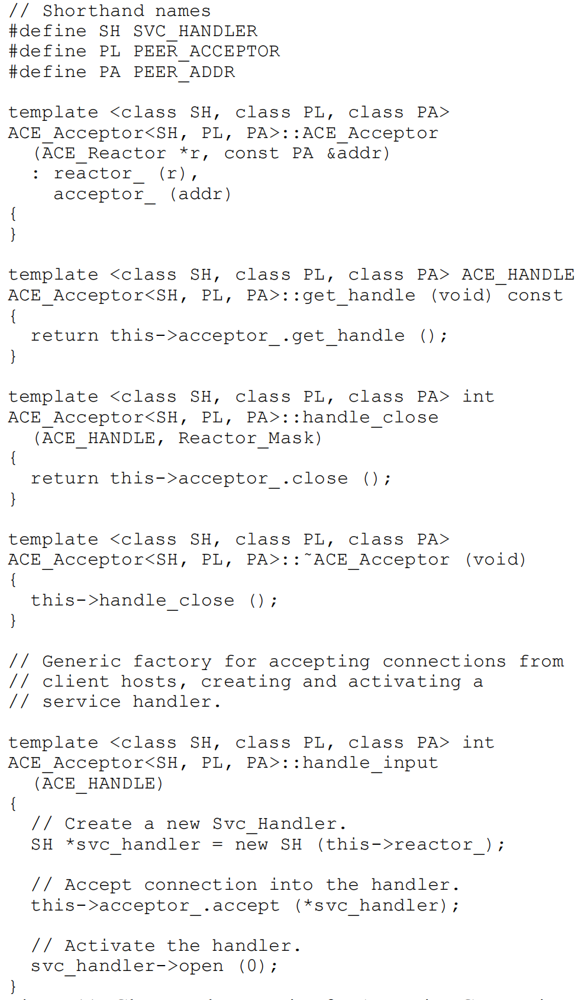

# Reactor 设计与实现：一个用于事件复用的面向对象框架（第二部分）

## 1 引言

这是描述使用面向对象（OO）C++ 包装器封装现有操作系统（OS）进程间通信（IPC）服务的系列文章的第三部分的下半部分。在本文的上半部分，我们介绍了一个客户端/服务器应用程序示例，以激发封装事件复用机制的包装器的实用性。事件复用对于开发能够同时接收和处理来自多个客户端的数据的事件驱动型网络服务器非常有用。上一篇文章还考察了几种替代的 I/O 复用方案的优缺点，如非阻塞I/O、多进程或线程创建，以及同步I/O复用（通过 `select` 和 `poll` 系统调用）。

本文重点介绍一个名为 Reactor 的面向对象框架的设计和实现。 Reactor 提供了一个可移植的接口，用于一组可扩展、可重用且类型安全的 C++ 类，这些类封装并增强了 `select` 和 `poll` 事件复用机制。为了帮助简化网络编程，Reactor 结合了基于同步 I/O 的事件复用和基于定时器的事件。当这些事件发生时， Reactor 会自动调度先前注册对象的方法来执行应用程序指定的服务。

本文的组织如下：第2节描述了 Reactor 框架提供的主要功能；第3节概述了框架的面向对象设计和实现；第4节提出了一个分布式日志记录示例，展示了 Reactor 如何简化并发、事件驱动型网络应用程序的开发；第5节讨论了结束语。

## 2 Reactor 的主要特性


Reactor 提供了一个面向对象的接口，简化了分布式应用程序的开发，这些应用程序利用基于I/O和/或基于定时器的复用机制。以下是 Reactor 框架提供的主要特点：

- **导出统一的面向对象接口**：使用 Reactor 的应用程序不会直接访问底层的 I/O 复用系统调用。相反，它们继承自一个共同的事件处理器（`Event_Handler`）抽象基类，以形成复合的具体派生类（如图1所示）。`EventHandler` 基类指定了一个统一的接口，由处理（1）同步输入、输出和异常以及（2）基于定时器的事件的虚拟方法组成。应用程序创建这些派生类的实例，并将它们与 Reactor 的实例注册。

- **自动化事件处理器调度**：当事件发生时，Reactor 会自动调用预先注册的派生类对象的适当虚拟方法事件处理程序。由于 C++ 对象被注册到 Reactor 中（而不是作为独立的子程序），所以与对象相关联的任何上下文信息在方法调用之间都会被保留。这对于开发保留客户端调用之间的信息的“有状态”服务特别有用。

- **支持透明的可扩展性**： Reactor 及其注册对象的功能可以在不修改或重新编译现有代码的情况下透明地扩展。为了实现这一点， Reactor 框架采用继承、动态绑定和参数化类型，将底层事件复用和服务调度机制与高层应用程序处理策略解耦。例如，低层机制包括（1）检测多个 I/O 句柄上的事件，（2）处理定时器到期，以及（3）响应事件调用适当的方法事件处理器。同样，应用程序指定的策略包括（1）建立连接，（2）数据传输和接收，以及（3）处理来自其他参与主机的服务请求。

- **增加复用**： Reactor 的复用和调度机制可以被许多网络应用程序重用。通过重用而不是重新开发这些机制，开发人员可以自由地集中精力处理更高层次的应用程序相关问题，而不是反复处理底层事件复用的细节。此外，后续的错误修复和增强将由使用 Reactor 组件的所有应用程序透明共享。相反，直接访问 `select` 和 `poll` 的开发人员必须为每个网络应用程序重新实现相同的复用和调度代码。而且，对这段代码的任何修改和改进都必须在所有相关应用程序中手动复制。

- **增强类型安全性**： Reactor 保护应用程序开发人员免受与编程现有 I/O 复用系统调用相关的错误倾向的低级细节的影响。这些细节涉及设置和清除位掩码、处理超时和中断，以及调度“回调”方法。特别是， Reactor 消除了由于滥用 I/O 句柄和 `fd_set` 位掩码而与 `poll` 和 `select` 相关的几个微妙的错误原因。

- **提高可移植性**： Reactor 还保护应用程序免受 `select` 和 `poll` 之间差异的影响，这些差异阻碍了可移植性。如图5所示，无论底层事件复用系统调用是什么， Reactor 都向应用程序导出相同的接口。此外， Reactor 的面向对象架构提高了其自身的内部可移植性。例如，将 Reactor 从基于 `select` 的操作系统平台移植到基于 `poll` 的平台，只需要对框架进行一些明确定义的更改。

除了简化应用程序开发之外， Reactor 还有效地执行其复用和调度任务。特别是，其事件调度逻辑改进了直接使用 `select` 的常见技术。例如，基于 `select` 的 Reactor 使用了一个 `ACE_Handle_Set` 类（在第3.2节中描述），该类在许多情况下避免了逐位检查 `fd_set` 位掩码。《C++ Report》的将来某期文章将实证评估 Reactor 的性能，并将其与直接访问 I/O 复用系统调用的非面向对象 C 语言解决方案进行比较。

## 3 Reactor 的面向对象设计与实现

本节总结了 reactor 框架主要类组件的面向对象设计，重点关注接口和战略设计决策。在适当的情况下，也会讨论战术设计决策和某些实现细节。第3.1节概述了与操作系统平台无关的组件；第3.2节涵盖了平台依赖的组件。Reactor 最初是模仿一个名为 `Dispatcher` 的 C++ 包装器设计的，该包装器用于 `select`，并且包含在InterViews发行版中[^3]。这里描述的 Reactor 框架包括几个额外的功能。例如，Reactor 可以透明地在 System V Release 4 的 `poll` 接口和 `select` 上运行，这些接口在 UNIX 和 PC 平台（通过 WINSOCK API）上都可用。此外，Reactor 框架还包含对多线程的支持。通常， Reactor 的单个实例在任何给定时间在线程中处于活动状态。然而，在一个进程中可能有多个不同的 Reactor 对象实例在单独的线程中运行。该框架提供了必要的同步操作以防止竞态条件[^4]。

### 3.1 与平台无关的类组件

以下段落总结了 Reactor 中的三个与平台无关的类的特点：`ACE_Time_Value`、`ACE_Timer_Queue` 和 `ACE_Event_Handler` 类：

- **ACE_Time_Value**：这个类提供了一个 C++ 包装器，封装了底层操作系统平台的日期和时间结构（例如 UNIX 和 POSIX 平台上的 `struct timeval` 数据类型）。`timeval` 结构包含两个字段，表示秒和微秒。然而，其他操作系统平台使用不同的表示方式，因此 `ACE_Time_Value` 类抽象了这些细节，提供了一个可移植的 C++ 接口。

  

  `ACE_Time_Value` 类中的主要方法在图 2 中进行了说明。`ACE_Time_Value` 包装器使用运算符重载来简化 Reactor 内基于时间的比较。重载允许使用标准算术语法进行涉及时间比较的关系表达式。例如，以下代码创建了两个 `ACE_Time_Value` 对象，通过将用户提供的命令行参数添加到当前时间，并显示两个对象之间的适当排序关系：

  ```c++
  int main (int argc, char *argv[]) {
      if (argc != 3) {
          cerr << "usage: " << argv[0] << " time1 time2" << endl;
          return 1;
      }
      ACE_Time_Value ct = ACE_OS::gettimeofday();
      ACE_Time_Value tv1 = ct + ACE_Time_Value(ACE_OS::atoi(argv[1]));
      ACE_Time_Value tv2 = ct + ACE_Time_Value(ACE_OS::atoi(argv[2]));
      if (tv1 > tv2) cout << "timer 1 is greater" << endl;
      else if (tv2 > tv1) cout << "timer 2 is greater" << endl;
      else cout << "timers are equal" << endl;
      return 0;
  }
  ```

  `ACE_Time_Value` 类中的方法是为了比较“标准化”的时间量而实现的。标准化调整 `timeval` 结构中的两个字段，使用一种规范的编码方案，确保准确的比较。例如，经过标准化后，`ACE_Time_Value(1, 1000000)` 将与 `ACE_Time_Value(2)` 比较得出相等的结果。请注意，直接对未标准化的类字段进行位比较是无法检测到这种相等性的。

- **ACE_Timer_Queue**：Reactor 的基于定时器的机制对于需要定时器支持的应用程序非常有用。例如，WWW 服务器需要看门狗定时器来释放资源，如果连接的客户端在特定时间间隔内没有发送 HTTP 请求。同样，某些守护进程配置框架（例如 Windows NT 中的服务控制管理器(Service Control Manager)）要求其控制的服务定期报告其当前状态。这些“心跳”消息用于确保服务没有异常终止。

  

  `ACE_Timer_Queue` 类提供了机制，允许应用程序注册基于时间的对象，这些对象派生自 `ACE_Event_Handler` 基类（在以下项目中描述）。`ACE_Timer_Queue` 确保在应用程序指定的未来时间调用这些对象的 `handle_timeout` 方法。`ACE_Timer_Queue` 类的方法在图 3 中进行了说明，使应用程序能够调度、取消和调用定时器对象。

  应用程序安排一个将在 `delay` 后到期的 `ACE_Event_Handler`。如果它到期，则将 `arg` 作为值传递给事件处理器的 `handle_timeout` 回调方法。如果 `interval` 不等于 `ACE_Time_Value::zero`，它用于自动重新安排事件处理器。`schedule` 方法返回一个句柄，该句柄在定时器队列的内部表中唯一标识此事件处理器。`cancel` 方法可以使用此句柄在事件处理器到期之前删除一个 `ACE_Event_Handler`。如果将非 NULL 的 `arg` 传递给取消，它将设置为应用程序在最初安排定时器时传入的异步完成令牌（Asynchronous Completion Token,ACT）。这使得可以释放动态分配的 ACT，以避免内存泄漏。

  默认情况下，`ACE_Timer_Queue` 实现为包含 `ACE_Time_Value`、`ACE_Event_Handler *` 和 `void *` 成员的元组的链表。这些元组按 `ACE_Time_Value` 字段的“执行时间”升序排序。`ACE_Event_Handler *` 字段是指向定时器对象的指针，该对象计划在 `ACE_Time_Value` 字段指定的时间运行。`void *` 字段是在最初安排定时器对象时提供的参数。当定时器到期时，此参数会自动传递给 `handle_timeout` 方法（在以下项目中描述）。

  链表中的每个 `ACE_Time_Value` 都以“绝对”时间单位存储（例如由 UNIX `gettimeofday` 系统调用生成的单位）。然而，由于类接口中使用了虚拟方法，应用程序可以重新定义 ACE_Timer_Queue 实现，以使用替代数据结构，如 delta-lists[^6] 或 heaps[^7]。delta-lists 以“相对”单位存储时间，表示为与列表前端最早的 `ACE_Time_Value` 的偏移量或“delta”。另一方面，堆使用“部分有序，几乎完整的二叉树”，而不是排序列表，以减少插入或删除条目的平均情况和最坏情况时间复杂度从 O(n) 降低到 O(lg n)。对于某些实时应用程序使用模式，堆表示可能更有效[^7]。

- **ACE_Event_Handler**：这个抽象基类指定了一个可扩展的接口，用于Reactor 类的部分控制和协调自动调度 I/O 和定时器机制。

  

  `ACE_Event_Handler` 接口中的虚拟方法在图 4 中进行了说明。Reactor 使用应用程序定义的 `ACE_Event_Handler` 基类的子类来实现其自动化的、事件驱动的回调机制。这些子类可以重新定义 `ACE_Event_Handler` 基类中的某些虚拟方法，以执行应用程序定义的处理，以响应各种类型的事件。这些事件包括（1）在一个或多个句柄上的不同类型的（例如，“读取”、“写入”和“异常”）同步 I/O，以及（2）定时器到期。从 `ACE_Event_Handler` 派生的对象通常提供一个 I/O 句柄。例如，以下 `Logging_Acceptor` 类片段封装了由 `SOCK_SAP` 套接字包装器提供的“被动模式”`ACE_SOCK_Acceptor` 工厂。

  ```c++
  class Logging_Acceptor : public ACE_Event_Handler {
  public:
      Logging_Acceptor(ACE_INET_Addr &addr) : acceptor_(addr) { /* ... */ }
      // 双重分派钩子。
      virtual ACE_HANDLE get_handle(void) const {
          return this->acceptor_.get_handle();
      }
      // 工厂，创建并激活一个
      // Logging_Handler
      virtual int handle_input(ACE_HANDLE) {
          ACE_SOCK_Stream peer_handler;
          // Create and activate a Logging_Handler..
          this->acceptor_.accept (peer_handler);
      }
      // ...
  private:
      // 被动模式套接字接受器。
      ACE_SOCK_Acceptor acceptor_;
  };
  
  int main (int argc, char *argv[])
  {
      // 事件复用器
      ACE_Reactor reactor;
      Logging_Acceptor acceptor
      ((ACE_INET_Addr) PORT_NUM);
      reactor.register_handler
      (&acceptor, ACE_Event_Handler::READ_MASK);
      // 循环“forever”接受连接并处理日志记录。
      for (;;)
      reactor.handle_events ();
      /* NOTREACHED */
  }
  ```

在内部，`Reactor::register_handler` 方法通过调用 `acceptor` 对象的 `get_handle` 虚拟方法来检索底层的 I/O 句柄。当调用 `Reactor::handle_events` 方法时，所有注册对象的句柄都会被聚合并传递给 `select`（或 `poll`）。这个操作系统级别的事件复用调用检测到这些句柄上的基于 I/O 的事件的发生。当输入事件发生或输出事件变得可能时，I/O 句柄变得“活跃”。此时，Reactor 通过调用处理事件的方法来通知适当的派生对象。例如，在上面的例子中，当一个连接请求到达时，Reactor 调用 `ACE_Acceptor` 类的 `handle_input` 方法。该方法接受新连接并创建一个 `Logging_Handler`（未显示），它读取客户端发送的所有数据并在标准输出流上显示它。上述描述的 `ACE_Timer_Queue` 类处理基于时间的事件。当此队列管理的定时器到期时，先前安排的 `ACE_Event_Handler` 派生对象的 `handle_timeout` 方法被调用。该方法传递当前时间，以及在最初安排派生对象时传入的 `void *` 参数。

当 `ACE_Event_Handler` 对象中的任何方法返回 -1 时， Reactor 自动调用该对象的 `handle_close` 方法。`handle_close` 方法可用于执行任何用户定义的终止活动（例如，删除对象分配的动态内存，关闭日志文件等）。在此回调函数返回后， Reactor 从其内部表中删除关联的派生类对象。

### 3.2 平台依赖的类组件

`ACE_Reactor` 类为 Reactor 框架提供了中心接口。在 UNIX 平台上，这个类是框架中唯一包含平台依赖代码的部分（`ACE_Time_Value` 类的私有表示在非 UNIX 平台上也可能不同）。


- **ACE_Reactor**：图 6 展示了 Reactor 类接口中的主要方法，该类封装并扩展了 `select` 和 `poll` 的功能。这些方法可以分为以下几类：

  - **管理方法** - 构造函数和 `open` 方法创建并初始化 `ACE_Reactor`，通过动态分配各种数据结构（在第 3.2.1 节和第 3.2.2 节中描述）。析构函数和 `close` 方法释放这些数据结构。

  - **基于 I/O 的事件处理器方法** - 从 `ACE_Event_Handler` 类的子类派生的实例可以通过 `register_handle` 方法与 Reactor 实例注册。事件处理器也可以通过 `remove_handler` 方法移除。

  - **基于定时器的事件处理器方法** - 传递给 `ACE_Reactor` 的 `schedule_timer` 方法的 `ACE_Time_Value` 参数是相对于当前时间“相对”的。例如，以下代码安排一个对象从 `delay` 秒数开始，每隔 `interval` 秒数打印“hello world”：

    ```c++
    class Hello_World : public ACE_Event_Handler {
    public:
        virtual int handle_timeout(const ACE_Time_Value &tv, const void *arg) {
            ACE_DEBUG((LM_DEBUG, "hello world\n"));
            return 0;
        }
        // ...
    };
    
    int main(int argc, char *argv[]) {
        if (argc != 3) ACE_ERROR_RETURN((LM_ERROR, "usage: %s delay interval\n", argv[0]), -1);
        Reactor reactor;
        Hello_World handler; // 定时器对象。
        ACE_Time_Value delay = ACE_OS::atoi(argv[1]);
        ACE_Time_Value interval = ACE_OS::atoi(argv[2]);
        reactor.schedule_timer(&handler, 0, delay, interval);
    
        for (;;) reactor.handle_events(); /* NOTREACHED */
    }
    ```

    然而，默认的 `ACE_Timer_Queue` 的实现将值存储在“绝对”时间单位中。也就是说，它将计划的时间与当前的日期时间相加。

    由于 `ACE_Reactor` 类的接口由虚拟方法组成，因此通过继承很容易扩展 `ACE_Reactor` 的默认功能。例如，修改 `ACE_Timer_Queue` 实现以使用第 3.1 节中描述的替代表示，不需要对 `ACE_Reactor` 的公共或私有接口进行任何可见的更改。

  - **事件循环方法** - 注册基于 I/O 和/或基于定时器的对象后，应用程序进入一个事件循环，连续调用两个 `Reactor::handle_events` 方法之一。这些方法阻塞一个应用程序指定的时间间隔，等待（1）一个或多个句柄上的同步 I/O 事件的发生和（2）基于定时器的事件。随着事件的发生，`ACE_Reactor` 调度应用程序注册来处理这些事件的对象的适当方法。

接下来的段落描述了基于 `poll` 的 Reactor 和基于 `select` 的 Reactor 之间的主要区别。尽管 `ACE_Reactor` 类的某些方法在不同的操作系统平台上的实现不同，但方法名称和整体功能保持不变。这种一致性源于 `ACE_Reactor` 的设计和实现的模块化，这增强了它的重用性、可移植性和可维护性。

#### 3.2.1 基于 select 的 Reactor 的类组件


如图 5（1）所示，基于 `select` 的 `ACE_Reactor` 的实现包含三个动态分配的 `ACE_Event_Handler *` 数组。这些数组存储处理读取、写入、异常和/或基于定时器的事件的注册 `ACE_Event_Handler` 对象的指针。`ACE_Handle_Set` 类为底层 `fd_set` 位掩码数据类型提供了一个高效的 C++ 包装器。`fd_set` 将 I/O 句柄名称空间映射到一个紧凑的位向量表示，并提供了几个操作，用于启用、禁用和测试对应于 I/O 句柄的位。一个或多个 `fd_set` 被传递给 `select` 调用。`ACE_Handle_Set` 类通过（1）使用“全字”比较来最小化不必要的位操作和（2）缓存某些值以避免在每次调用时重新计算位偏移量，从而优化了几个常见的 `fd_set` 操作。

#### 3.2.2 基于 poll 的 Reactor 的类组件

`poll` 接口比 `select` 更通用，允许应用程序等待更广泛的事件（例如“优先级带” I/O 事件）。因此，图 5（2）中显示的基于 `poll` 的 Reactor 实现比基于 `select` 的版本要小且不那么复杂。例如，基于 `poll` 的 `ACE_Reactor` 不需要三个 `ACE_Event_Handler *` 数组或 `ACE_Handle_Set` 类。相反，内部动态分配了一个单一的 `ACE_Event_Handler` 指针数组和一个 `pollfd` 结构体数组，用于存储注册的 `ACE_Event_Handler` 派生类对象。

## 4 使用和评估 Reactor

Reactor 框架旨在简化分布式应用程序的开发，特别是网络服务器。为了说明 Reactor 的典型用法，下面的部分将分析分布式日志记录应用程序的设计和实现[^1]。本部分描述了日志记录应用程序中的主要 C++ 类组件，将基于面向对象的 Reactor 解决方案与之前用 C 编写的版本进行了比较，并讨论了 C++ 对 Reactor 框架和分布式日志记录功能的影响。


图7：分布式日志记录设施中的运行时活动

### 4.1 分布式日志设施概述

这个分布式日志记录设施最初是为一个商业在线事务处理产品设计的。该日志记录设施使用客户端/服务器架构，为通过本地区域和/或广域网络连接的工作站和对称多处理器提供日志记录服务。日志记录设施结合了 Reactor 的事件复用和调度功能，以及 `IPC SAP` 封装库提供的 BSD 套接字和 System V 传输层接口（TLI）的面向对象接口。日志记录提供了一个“仅追加”的存储服务，记录从一个或多个应用程序发送的诊断信息。日志记录的主要单元是 `record`。传入的记录被追加到日志的末尾，并且禁止所有其他类型的写访问。


图8：日志记录格式

分布式日志记录设施由图 7 所示的以下三个主要组件组成：

- **应用日志接口**：客户端主机上运行的应用程序进程（例如 P1、P2、P3）使用 `Log_Msg` C++ 类生成各种类型的日志记录（例如 `LOG_ERROR` 和 `LOG_DEBUG`）。`Log_Msg::log` 方法提供了一个 `printf` 风格的接口。图 8 描述了应用程序接口和日志守护进程之间交换的记录的优先级级别和数据格式。当被应用程序调用时，日志接口格式化并时间戳这些记录，并将它们写入一个众所周知的命名管道（也称为 FIFO），在那里它们被客户端日志守护进程消费。

- **客户端日志守护进程**：客户端日志守护进程是一个单线程的、迭代的守护进程，运行在参与分布式日志记录服务的每个主机机器上。每个客户端日志守护进程连接到命名管道的读取端，用于从该机器上的应用程序接收日志记录。使用命名管道是因为它们是一种在本地主机上高效的进程间通信（IPC）形式。此外，System V Release 4 UNIX 中命名管道的语义已经扩展，允许“优先级带”消息，可以按“重要性顺序”接收，以及按“到达顺序”（这仍然是默认行为）[^9]。

  客户端日志守护进程和应用程序日志接口的完整设计将在后续的《C++ Report》文章中呈现，该文章介绍了用于多种“本地主机” IPC 机制（如System V Release 4 FIFOs、STREAMpipes、消息队列和 UNIX 域流套接字）的 C++ 包装器。通常情况下，客户端日志守护进程会连续从应用程序按优先级顺序接收日志记录，将多字节记录头字段转换为网络字节顺序，并将记录转发给服务器日志守护进程（通常在远程主机上运行）。

- **服务器日志守护进程**：服务器日志守护进程是一个并发的守护进程，不断收集、重新格式化并向各种外部设备显示传入的日志记录。这些设备可能包括打印机、持久存储库或日志管理控制台。本文的其余部分将重点介绍服务器日志守护进程。此外，本示例中还展示了几个 Reactor 和 `IPC SAP` 机制。

### 4.2 服务器日志守护进程

下面将讨论构建服务器日志守护进程的主要类使用的接口和实现。日志服务器是一个单线程的并发守护进程，运行在一个单独的进程中。并发性是通过让 Reactor 以轮询方式对每个活动客户端进行“时间分片”分配来实现的。具体来说，在每次调用 `Reactor::handle_events` 方法时，从每个 I/O 句柄在此期间变为活动的客户端读取单个日志记录。这些日志记录被写入服务器日志守护进程的标准输出。此输出可以重定向到各种设备，如打印机、持久存储库或日志管理控制台。

除了下面第 4.2.3 节中显示的主要驱动程序外，日志设施架构中还出现了几个其他 C++ 类组件。这些组件在图 9 中使用 Booch 符号[^10]展示了类继承和参数化关系。为了增强重用性和可扩展性，图中显示的组件被设计为解耦应用程序架构的以下方面：


图9：服务器日志守护进程的类组件

- Reactor 框架组件 - 第 3 节中讨论的 Reactor 框架组件封装了执行 I/O 复用和事件处理器调度的最低级别机制。
- 连接相关机制 - 第 4.2.1 节中讨论的组件代表了一组通用模板，提供了可重用的连接相关机制。具体来说，`ACE_Acceptor` 模板类是一个通用类，旨在标准化和自动化接受来自客户端的网络连接请求的步骤。同样，`ACE_Svc_Handler` 模板类是另一个通用类，旨在向/从连接的客户端发送和/或接收数据。
- 应用程序特定服务 - 第 4.2.2 节中讨论的组件代表了分布式日志记录设施的应用程序特定部分。具体来说，`Logging_Acceptor` 类为 `ACE_Acceptor` 提供了特定的参数化类型，创建了特定于日志应用程序的连接处理实例。同样，`Logging_Handler` 类被实例化以提供从远程客户端接收和处理日志记录所需的应用程序特定功能。

一般来说，通过采用这种高度解耦的面向对象分解，与原始方法相比，开发和维护服务器日志守护进程的工作量显著减少。

#### 4.2.1 连接相关机制

- **ACE_Acceptor** 类：提供了一个通用模板，用于一系列类的标准化和自动化步骤，这些类负责接受来自客户端的网络连接请求。图 10 展示了 `ACE_Acceptor` 类的类接口。这个类继承自 `ACE_Event_Handler`，使其能够与 Reactor 框架交互。此外，这个模板类由以下内容参数化：一个复合的 `PEER_HANDLER` 子类（必须知道如何与客户端执行 I/O），一个 `PEER_ACCEPTOR` 类（必须知道如何接受客户端连接），以及 `PEER_ADDR`（适当的地址族的 C++ 包装器）。

  

  从 `ACE_Acceptor` 模板实例化的类能够执行以下行为：

  1. 接受来自远程客户端的连接请求；
  2. 动态分配 `PEER_HANDLER` 子类的实例；
  3. 将此对象与 Reactor 实例注册。相应地，`PEER_HANDLER` 类必须知道如何处理与客户端交换的数据。

  

  图 11 展示了 `ACE_Acceptor` 类的实现。当一个或多个连接请求到达时，`handle_input` 方法由 Reactor 自动调度。此方法的行为如下：

  - 首先，它动态创建一个单独的 `PEER_HANDLER` 对象，负责处理从每个新客户端接收的日志记录。
  - 接下来，它接受传入的连接到该对象中。
  - 最后，它调用 `open` 钩子。这个钩子可以将新创建的 `PEER_HANDLER` 对象注册到 Reactor 实例，或者可以生成一个单独的控制线程等。

- **ACE_Svc_Handler 类**：这个参数化类型为处理从客户端发送的数据提供了一个通用的模板。例如，在分布式日志记录设施中，I/O 格式涉及日志记录。然而，不同的应用程序可以很容易地替换为不同的格式。通常情况下，从 `ACE_Svc_Handler` 实例化的类的对象会被动态创建并注册到 Reactor 中，由 `ACE_Acceptor` 类中的 `handle_input` 例程完成注册。`ACE_Svc_Handler` 类的接口如图12所示。与 `ACE_Acceptor` 类一样，这个类继承了 `ACE_Event_Handler` 基类的功能。

  图13展示了 `ACE_Svc_Handler` 类的实现。当分配该类的对象时，构造函数会缓存关联客户端的主机地址。如图7中的“console”窗口所示，这个主机的名称会与从*客户端日志守护进程*接收到的日志记录一起打印出来。

  `ACE_Svc_Handler::handle_input` 方法只是简单地调用纯虚方法 `recv`。这个 `recv` 函数必须由`ACE_Svc_Handler` 的子类提供，它负责执行特定于应用程序的 I/O 行为。注意继承、动态绑定和参数化类型的组合如何进一步将框架的通用部分（如连接建立）与应用程序特定功能（如接收日志记录）解耦。

  当 `ACE_Reactor` 从内部表中移除一个 `ACE_Svc_Handler` 对象时，对象的 `handle_close` 方法会自动被调用。默认情况下，这个方法会释放对象的内存（最初由 `ACE_Acceptor` 类的 `handle_input` 方法分配）。通常情况下，当客户端日志守护进程关闭或发生严重传输错误时，会将对象移除。为了确保 `ACE_Svc_Handler` 对象只能动态地分配和释放，析构函数在类的私有部分声明（如图12底部所示）。
  
  

图12：处理程序服务的类接口

#### 4.2.2 应用程序特定服务

- **Logging_Acceptor 类**：为了实现分布式日志记录应用程序，`Logging_Acceptor` 类是从通用 `ACE_Acceptor` 模板实例化的，如下所示：

  ```c++
  typedef ACE_Acceptor<Logging_Handler, ACE_SOCK_Acceptor, ACE_INET_Addr> Logging_Acceptor;
  ```

  `PEER_HANDLER` 参数使用 `Logging_Handler` 类实例化（在下面的项目中描述），`PEER_ACCEPTOR` 被 `ACE_SOCK_Acceptor` 类替换，`PEER_ADDR` 是 `ACE_INET_Addr` 类。

  `ACE_SOCK_*` 和 `ACE_INET_Addr` 实例化类型是称为 `SOCK_SAP`[^8] 的 C++ 包装器的一部分。`SOCK_SAP` 封装了 BSD 套接字接口，用于在可能在不同主机机器上运行的两个进程之间可靠地传输数据。然而，这些类也可能是任何其他符合参数化类中使用的接口的网络接口（例如，用于 System V 传输层接口（TLI）的 TLI_SAP 包装器）。例如，根据底层操作系统平台的某些属性（例如，它是 BSD 还是 System V 变体的 UNIX），日志应用程序可能会实例化 `ACE_Svc_Handler` 类来使用 `SOCK_SAP` 或 `TLI_SAP`，如下所示：

  ```c++
  // 日志应用程序。
  #if defined (MT_SAFE_SOCKETS)
  typedef ACE_SOCK_Stream PEER_STREAM;
  #else
  typedef ACE_TLI_Stream PEER_STREAM;
  #endif // MT_SAFE_SOCKETS.
  
  class Logging_Handler : public ACE_Svc_Handler<PEER_STREAM, ACE_INET_Addr> { // ... };
  ```

  这种基于模板的方法提供的灵活性程度在开发必须跨多个操作系统平台运行的应用程序时非常有用。事实上，通过传输接口参数化应用程序的能力在操作系统平台的变体中也很有用（例如，SunOS 5.2 不提供线程安全的套接字实现）。

- **Logging_Handler 类**：这个类是通过实例化 `ACE_Svc_Handler` 类来创建的，如下所示：

  ```c++
  class Logging_Handler : public ACE_Svc_Handler<ACE_SOCK_Stream, ACE_INET_Addr> {
  public:
      // 开启钩子。
      virtual int open (void) {
          // 注册我们自己到 Reactor，这样当来自客户端的 I/O 到达时，我们可以自动被调度。
          reactor_.register_handler(this, ACE_Event_Handler::READ_MASK);
      }
      // 复用钩子。
      virtual int handle_input (ACE_HANDLE);
  };
  ```

  `PEER_STREAM` 参数被 `ACE_SOCK_Stream` 类替换，`PEER_ADDR` 参数被 `ACE_INET_Addr` 类替换。当底层 `ACE_SOCK_Stream` 上有输入到达时，`handle_input` 方法会自动由 `ACE_Reactor` 调用。它的实现如下：

  ```c++
  // 处理来自客户端的远程日志传输的回调例程。
  int Logging_Handler::handle_input (ACE_HANDLE) {
      size_t len;
      ssize_t n = this->peer_stream_.recv(&len, sizeof len);
      if (n == sizeof len) {
          Log_Record lr;
          len = ntohl(len);
          n = this->peer_stream_.recv_n(&lr, len);
          if (n != len) ACE_ERROR_RETURN((LM_ERROR, "%p at host %s\n", "client logger", this->host_name), -1);
          lr.decode();
          if (lr.len == n) lr.print(this->host_name, 0, stderr);
          else ACE_ERROR_RETURN((LM_DEBUG, "error, lr.len = %d, n = %d\n", lr.len, n), -1);
          return 0;
      } else return n;
  }
  ```

  请注意，这个示例执行两次 `recv` 调用，以通过底层 TCP 连接模拟面向消息的服务（回想一下，TCP 提供的是字节流导向的服务，而不是记录导向的服务）。第一个 `recv` 读取了下一个日志记录的长度（存储为固定大小的整数）。第二个 `recv` 读取了“长度”字节以获取实际记录。自然地，发送此消息的客户端也必须遵循此消息框架协议。

#### 4.2.3 主驱动程序

以下事件循环驱动基于 Reactor 的日志服务器：

```c++
int main (int argc, char *argv[]) {
    // 事件复用器。
    ACE_Reactor reactor;

    const char *program_name = argv[0];
    ACE_LOG_MSG->open (program_name);

    if (argc != 2) ACE_ERROR_RETURN ((LM_ERROR, "usage: %n port-number\n"), -1);
    u_short server_port = ACE_OS::atoi (argv[1]);

    // 事件复用器的实现并不完全健壮，它处理“短读”的方式。
    Logging_Acceptor acceptor (&reactor, (ACE_INET_Addr) server_port);
    reactor.register_handler (&acceptor);

    // 循环“永远”接受连接和处理日志记录。
    for (;;) reactor.handle_events ();
    /* NOTREACHED */
    return 0;
}
```

主程序开始时打开一个日志通道，将服务器生成的任何日志记录导向其自身的标准错误流。图 11 和 13 中的示例代码展示了服务器如何使用应用程序日志接口记录其自身的诊断消息。请注意，由于这种安排没有递归地使用服务器日志守护进程，因此不会造成“无限日志循环”的危险。


图13：Svc_Hanlder 类实现

然后，服务器打开 Reactor 的一个实例，`实例化一个 Logging_Acceptor` 对象，并将此对象注册到 Reactor 。接下来，服务器进入一个无限循环，在该循环中，`handle_events` 方法会阻塞，直到从客户端日志守护进程接收到事件。图 14 展示了在两个客户端已经联系了 Reactor 并成为分布式日志服务的参与者之后，日志服务器守护进程的状态。如图中所示，为每个客户端动态实例化并注册了一个 `Logging_Handler` 对象。随着传入事件的到来， Reactor 通过自动调度以下内容来处理它们：(1) `Logging_Acceptor` 和 `Logging_Handler` 类的 `handle_input` 方法。当来自客户端日志守护进程的连接请求到达时，会调用 `Logging_Acceptor::handle_input` 函数。同样，当来自先前连接的客户端日志守护进程的日志记录或关闭消息到达时，会调用 `Logging_Handler::handle_input` 函数。图 7 描绘了整个系统在执行期间的情况。日志记录从应用程序日志接口生成，转发到客户端日志守护进程，通过网络传输到服务器日志守护进程，最后显示在服务器日志控制台上。所显示的日志信息指示了 (1) 应用程序接口生成日志记录的时间，(2) 应用程序运行的主机机器，(3) 应用程序的进程标识符，(4) 日志记录的优先级级别，(5) 应用程序的命令行名称（即，“`argv[0]`”），以及 (6) 包含日志消息文本的任意文本字符串。


图14：服务器日志守护进程运行时配置

### 4.3 评估替代的日志实现

本节将根据几个软件质量因素（如模块化、可扩展性、可重用性和可移植性）比较分布式日志设施的面向对象和非面向对象版本。

#### 4.3.1 非面向对象版本

基于 Reactor 的分布式日志设施是对早期功能等效的非面向对象日志设施的面向对象重新实现。原始版本是为基于 BSD UNIX 的商业在线事务处理产品开发的。它最初用 C 语言编写，并直接使用了 BSD 套接字和 `select`。后来，它被移植到了一个只提供基于 System V 的 TLI 和 `poll` 接口的系统。原始的 C 实现由于以下原因难以修改、扩展和移植：(1) 功能紧密耦合，以及 (2) 过度使用全局变量。例如，原始版本中的事件复用、服务调度和事件处理操作与接受客户端连接请求和接收客户端日志记录紧密耦合。此外，使用了几个全局数据结构来维护 (1) 每个客户端的上下文信息（如客户端主机名和当前处理状态）和 (2) 标识适当上下文记录的 I/O 句柄之间的关系。因此，对程序的任何增强或修改都直接影响现有源代码。

#### 4.3.2 面向对象版本

面向对象的基于 Reactor 的版本使用数据抽象、继承、动态绑定和模板来 (1) 最小化对全局变量的依赖，以及 (2) 将处理传入连接和数据的应用程序策略与执行复用和调度的底层机制解耦。基于 Reactor 的日志设施不包含全局变量。相反，每个与 Reactor 注册的 `Logging_Handler` 对象都封装了客户端地址和用于与客户端通信的底层 I/O 句柄。

通过解耦策略和机制，提高了多个软件质量因素。例如，系统组件的可重用性和可扩展性得到了改进，这简化了最初的开发工作和随后的修改。由于 Reactor 框架执行所有低级事件复用和服务调度，实现第 4.1 节中描述的服务器日志守护进程只需要少量的额外代码。此外，额外的代码主要涉及应用程序处理活动（如接受新连接和接收客户端日志记录）。此外，模板有助于将应用程序特定代码定位在少数几个定义良好的模块中。

 Reactor 架构中策略和机制的分离，便于在其公共接口的“上方”和“下方”进行可扩展性和可移植性。例如，扩展服务器日志守护进程的功能（例如，添加“认证日志”功能）是直接的。这些扩展只需继承 `ACE_Event_Handler` 基类并选择性地实现必要的虚拟方法。同样，通过实例化 `ACE_Acceptor` 和 `ACE_Svc_Handler` 模板，可以在不重新开发现有基础设施的情况下生产后续应用程序。另一方面，以这种方式修改原始的非面向对象 C 版本需要直接更改现有代码。

还可以修改 Reactor 的底层 I/O 复用机制，而不影响现有应用程序代码。例如，将基于 Reactor 的分布式日志设施从 BSD 平台移植到 System V 平台，不需要对应用程序代码进行可见更改。另一方面，将原始 C 版本的分布式日志设施从套接字/`select`移植到 TLI/`pool`是一项繁琐且耗时的工作。它还在源代码中引入了几个微妙的错误，这些错误直到运行时才显现出来。此外，在某些通信密集型应用程序中，数据总是立即在一个或多个句柄上可用。因此，通过非阻塞 I/O 轮询这些句柄可能比使用 `select` 或 `poll` 更有效率。如前所述，扩展 Reactor 以支持这种替代的复用实现不会修改其公共接口。

### 4.4 C++ 语言影响

几个 C++ 语言特性对 Reactor 的设计以及使用其功能的分布式日志设施至关重要。例如，C++ 类提供的数据隐藏能力通过封装和隔离 `select` 和 `pool` 之间的差异来提高可移植性。同样，将 C++ 类对象（而不是独立的子程序）注册到 Reactor 的技术有助于将应用程序特定的上下文信息与多个访问此信息的方法集成在一起。参数化类型通过允许使用除 `Logging_Handler` 和 `ACE_SOCK_Acceptor` 之外的 `PEER_HANDLER` 和 `PEER_ACCEPTOR` 来增加 `ACE_Acceptor` 类的可重用性。此外，继承和动态绑定通过允许开发人员在不修改现有代码的情况下增强 Reactor 及其相关应用程序的功能，从而促进了透明的可扩展性。

动态绑定在 Reactor 中得到了广泛使用。先前的 C++ Report 文章讨论了 `IPC_SAP` 包装器[^8]，在设计“瘦身” C++ 包装器时通常建议避免使用动态绑定。特别是，由间接虚表调度引起的开销可能会阻碍开发人员使用更模块化和类型安全的面向对象接口。然而，与 `IPC_SAP` 不同， Reactor 框架不仅仅提供了一个围绕底层操作系统系统调用的面向对象的外表。因此，清晰度、可扩展性和模块性的显著增加弥补了效率的轻微降低。此外， Reactor 通常用于开发分布式系统。仔细检查分布式系统的主要开销源会发现，大多数性能瓶颈来自于缓存、延迟、网络/主机接口硬件、表示级格式化、内存到内存复制和进程管理等活动。因此，由动态绑定引起的额外内存引用开销相比之下是微不足道的[^13]。

为了实证地证明这些论断，即将到来的 C++ Report 文章将展示一个基准测试实验的结果，该实验测量 `IPC_SAP` 和 Reactor 的性能。这些性能结果基于一个分布式系统基准测试工具，该工具测量分布式环境中的客户端/服务器性能。这个工具还指示了使用 IPC 机制的 C++ 包装器的开销。具体来说，有两个功能等效的基准测试工具版本：(1) 使用 `IPC_SAP` 和 Reactor  C++ 包装器的面向对象版本，以及 (2) 直接使用套接字、`select` 和 `poll` 系统调用的非面向对象的 C 语言版本。实验以受控的方式测量面向对象实现和非面向对象实现的性能。

## 5 结论性评论

Reactor 是一个面向对象的框架，它通过将现有的操作系统复用机制封装在一个面向对象的 C++ 接口中，简化了并发的、事件驱动的分布式系统的开发。它实现了这一点，总体上通过分离策略和机制，支持现有系统组件的重用，提高了可移植性，并提供了透明的可扩展性。基于 Reactor 的方法的一个缺点是，最初可能很难概念化应用程序的主控制线程的位置。这是像 Reactor 或更高层次的 X-windows 工具包这样的事件循环驱动的调度器所面临的典型问题。然而，围绕这种“间接事件回调”调度模型的混淆通常在编写了几个使用这种方法的应用程序后很快就会消失。 Reactor 和 `IPC_SAP` C++ 包装器的源代码和文档可在 http://www.cs.wustl.edu/~schmidt/ACE.html 在线获取。此次发布还包括一套测试程序和示例，以及许多其他封装命名管道、STREAM 管道、mmap 和 System V IPC 机制（即，消息队列、共享内存和信号量）的 C++ 包装器。即将在 C++ Report 中发表的文章将描述这些包装器的设计和实现。

## 参考文献

[^2]: W. R. Stevens, Advanced Programming in the UNIX Environment. Reading, Massachusetts: Addison Wesley, 1992.
[^6]: D. C. Schmidt, “The Reactor: An Object-Oriented Interface for Event-Driven UNIX I/O Multiplexing (Part 1 of 2),” C++ Report, vol. 5, February 1993.
[^7]: R. E. Barkley and T. P. Lee, “A Heap-Based Callout Implementation to Meet Real-Time Needs,” in Proceedings of the USENIX Summer Conference, pp. 213–222, USENIX Association, June 1988.
[^3]: M. A. Linton and P. R. Calder, “The Design and Implementation of InterViews,” in Proceedings of the USENIX C++ Workshop, November 1987.
[^4]: D. C. Schmidt, “Transparently Parameterizing Synchronization Mechanisms into a Concurrent Distributed Application,” C++ Report, vol. 6, July/August 1994.
[^5]: T. H. Harrison, D. C. Schmidt, and I. Pyarali, “Asynchronous Completion Token: an Object Behavioral Pattern for Efficient Asynchronous Event Handling,” in Proceedings of the 3rd Annual Conference on the Pattern Languages of Programs, (Monticello, Illinois), pp. 1–7, September 1996.
[^6]: D. E. Comer and D. L. Stevens, Internetworking with TCP/IP Vol II: Design, Implementation, and Internals. Englewood Cliffs, NJ: Prentice Hall, 1991.


[^1]: D. C. Schmidt, “The Reactor: An Object-Oriented Interface for Event-Driven UNIX I/O Multiplexing (Part 1 of 2),” *C++* *Report*, vol. 5, February 1993.
[^9]: UNIX Software Operations, UNIX System V Release 4 Programmer’s Guide: STREAMS. Prentice Hall, 1990.
[^10]: G. Booch, Object Oriented Analysis and Design with Applications (2nd Edition). Redwood City, California: Benjamin/Cummings, 1993.
[^11]: D. C. Schmidt, “Acceptor and Connector: Design Patterns for Initializing Communication Services,” in Proceedings of the 1st European Pattern Languages of Programming Conference, July 1996.
[^12]: D. C. Schmidt and T. Suda, “Transport System Architecture Services for High-Performance Communications Systems,” IEEE Journal on Selected Areas in Communication, vol. 11, pp. 489–506, May 1993.
[^8]: D. C. Schmidt, “IPC SAP: An Object-Oriented Interface to Interprocess Communication Services,” C++ Report, vol. 4, November/December 1992.
[^13]: A. Koenig, “When Not to Use Virtual Functions,” C++ Journal, vol. 2, no. 2, 1992.