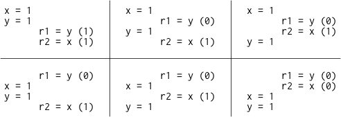
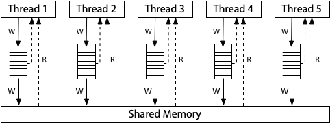

# 硬件内存模型

## 导言：童话，结局

很久以前，当每个人都在编写单线程程序时，让程序运行得更快的最有效方法之一就是坐视不管。因为下一代硬件和下一代编译器的优化会让程序运行得和以前一模一样，只是速度更快而已。在这个童话般的时期，有一个简单的方法来检验优化是否有效：如果程序员无法分辨出一个有效程序在未优化和优化后执行的区别（除了速度提升），那么这个优化就是有效的。也就是说，**有效的优化不会改变有效程序的行为。**

多年前的某一天，硬件工程师们用于让单个处理器变得越来越快的魔法咒语突然失效了。为此，他们找到了一个新的法宝，可以让他们创造出拥有越来越多处理器的计算机，而操作系统则以线程的抽象形式将这种硬件并行性展现给程序员。这个新法术--以操作系统线程的形式提供多个处理器--对硬件工程师来说好用多了，但却给语言设计师、编译器编写者和程序员带来了巨大的麻烦。

许多在单线程程序中不可见（因此有效）的硬件和编译器优化，在多线程程序中却产生了可见的变化。如果有效的优化不会改变有效程序的行为，那么这些优化或现有程序都必须宣布无效。究竟是哪种情况，我们又该如何决定呢？

下面是一个类似 C 语言的简单示例程序。在这个程序中，以及我们将要考虑的所有程序中，所有变量最初都设置为零。

```c
// Thread 1           // Thread 2
x = 1;                while(done == 0) { /* loop */ }
done = 1;             print(x);
```

如果线程 1 和线程 2 都在各自专用的处理器上运行，并且都运行完成，这个程序能打印 0 吗？

这要看情况。这取决于硬件，也取决于编译器。在 x86 多处理器上运行的汇编程序逐行直接翻译总是会打印 1。但在 ARM 或 POWER 多处理器上运行的逐行直接转换为汇编的程序可能会打印 0。此外，无论底层硬件如何，标准编译器优化都可能使该程序打印 0 或进入无限循环。

“视情况而定”并不是一个好的结局。程序员需要一个明确的答案，以确定程序是否能在新硬件和新编译器下继续运行。而硬件设计人员和编译器开发人员也需要一个明确的答案，即在执行特定程序时，硬件和编译后的代码可以有怎样的确定行为。由于这里的主要问题是存储在内存中的数据变化的可见性和一致性，因此该约定被称为**内存一致性模型**或**内存模型**。

最初，内存模型的目标是为编写汇编代码的程序员定义硬件保证。在这种情况下，编译器并不参与其中。25 年前，人们开始尝试编写内存模型，以定义 Java 或 C++ 等高级编程语言对编写该语言代码的程序员的保证。将编译器包含在模型中，使得定义合理模型的工作变得更加复杂。

这是分别关于硬件内存模型和编程语言内存模型的两篇文章中的第一篇。我写这两篇文章的目的是为讨论我们可能希望对 [Go 的内存模型](go-memory-model.md)进行的潜在修改积累背景知识。但是，要想了解 Go 的现状以及我们可能想要的方向，首先我们必须了解其他硬件内存模型和语言内存模型的现状，以及它们达到这一目标所走过的艰难道路。

再说一遍，这篇文章是关于硬件的。假设我们正在为多处理器计算机编写汇编语言。为了编写出正确的程序，程序员需要计算机硬件提供哪些保证？四十多年来，计算机科学家一直在寻找这个问题的答案。

## 顺序一致性

莱斯利-兰波特在 1979 年发表的论文[《如何制造能正确执行多进程程序的多处理器计算机》](https://www.microsoft.com/en-us/research/publication/make-multiprocessor-computer-correctly-executes-multiprocess-programs/)中提出了顺序一致性的概念：

> 为这种计算机设计和证明多进程算法正确性的惯常方法假定满足以下条件：任何执行的结果都与所有处理器的操作按某种顺序执行的结果相同，而且每个处理器的操作都按其程序指定的顺序出现在该顺序中。满足这一条件的多处理器被称为顺序一致处理器。

今天，我们不仅讨论计算机硬件，还讨论保证顺序一致性的编程语言。顺序一致性指的是程序的所有可能执行都对应着将线程操作交错到一个顺序执行中的某种方式。顺序一致性通常被认为是理想的模型，是程序员最自然的工作模式。它允许你假设程序按照页面上显示的顺序执行，而单个线程的执行只是按照某种顺序交错进行，但不会以其他方式重新排列。

我们有理由质疑顺序一致性是否应该是理想的模型，但这超出了本篇文章的讨论范围。我只想指出，考虑所有可能的线程交错，在今天和 1979 年一样，仍然是“设计和证明多进程算法正确性的常规方法”。在这四十年间，没有任何东西可以取代它。

刚才我问这个程序能否打印 0：

```c
// Thread 1           // Thread 2
x = 1;                while(done == 0) { /* loop */ }
done = 1;             print(x);
```

为了让程序更容易分析，让我们删除循环和打印，并询问读取共享变量可能产生的结果：

```c
Litmus Test: Message Passing
Can this program see r1 = 1, r2 = 0?

// Thread 1           // Thread 2
x = 1                 r1 = y
y = 1                 r2 = x
```

我们假设每个示例开始时所有共享变量都设置为零。因为我们试图确定硬件可以做什么，所以我们假设每个线程都在自己专用的处理器上执行，没有编译器对线程中发生的事情重新排序：列表中的指令就是处理器执行的指令。`rN` 表示线程本地寄存器，而不是共享变量，我们要问的是，在执行结束时，线程本地寄存器的特定设置是否可行。

这种关于示例程序执行结果的问题被称为 litmus 测试。因为它有一个二进制答案 —— 这种结果是否可能发生,所以 litmus 测试为我们提供了一种明确区分内存模型的方法：如果一个模型允许某种特定的执行，而另一个不允许，那么这两个模型显然是不同的。不幸的是，正如我们后面将看到的，特定模型对特定litmus测试的答复往往出乎意料。

如果这个 litmus 测试的执行是顺序一致的，那么只有六种可能的交错执行:



由于任何交织都不会导致 r1 = 1、r2 = 0，因此这种结果是不允许的。也就是说，在顺序一致的硬件上，litmus 测试的答案--这个程序能否看到 r1 = 1，r2 = 0？——是不行的。

顺序一致性的一个很好的心理模型是想象所有处理器直接连接到同一个共享内存，该共享内存可以同时满足一个线程的读取或写入请求。这里不涉及缓存，因此每次处理器需要读取或写入内存时，请求都会进入共享内存。一次性使用的共享内存对所有内存访问的执行都规定了顺序：顺序一致性。


(本帖中的三个内存模型硬件图改编自 Maranget 等人的[“ARM 和 POWER 宽松内存模型教程介绍”](https://www.cl.cam.ac.uk/~pes20/ppc-supplemental/test7.pdf)）。

本图是顺序一致机器的模型，而不是构建顺序一致机器的唯一方法。事实上，使用多个共享内存模块和缓存来帮助预测内存获取的结果，也可以构建顺序一致的机器，但顺序一致意味着机器的行为必须与此模型无异。如果我们只是想了解顺序一致执行的含义，我们可以忽略所有这些可能的复杂实现，只考虑这一个模型。

对于我们作为程序员来说，不严格遵守顺序一致性可以让硬件执行程序更快，因此所有现代硬件在各种方式上都与顺序一致性有所偏离。准确描述特定硬件的偏离方式事实上是相当困难的。本文以两个例子来说明当今广泛使用的硬件中存在的两种内存模型：x86 和 ARM、POWER 处理器系列的内存模型。

## x86 总顺序存储 (x86-TSO)

现代 x86 系统的内存模型与此硬件图相对应：



所有处理器仍连接到单个共享内存，但每个处理器都在本地写入队列中排队写入该内存。处理器在写入共享内存的同时继续执行新指令。一个处理器读取内存时，会先查阅本地写入队列，然后再查阅主内存，但它看不到其他处理器上的写入队列。这样做的结果是，处理器会比其他处理器先看到自己的写入。但是--这一点非常重要--所有处理器都同意写入（存储）到达共享内存的（总）顺序，因此该模型被命名为：总存储顺序，或 TSO。在写入到达共享内存的那一刻，任何处理器上的任何未来读取都会看到并使用该值（直到该值被后来的写入覆盖，或者被其他处理器的缓冲写入覆盖）。

写入队列是一个标准的先进先出队列：内存写入将按照处理器执行的顺序应用到共享内存。由于写入队列保留了写入顺序，而且其他处理器会立即看到写入共享内存的内容，因此我们之前考虑过的消息传递 litmus 测试结果与之前相同：r1 = 1，r2 = 0 仍然是不可能的。

```
Litmus Test: Message Passing
Can this program see r1 = 1, r2 = 0?

// Thread 1           // Thread 2
x = 1                 r1 = y
y = 1                 r2 = x
On sequentially consistent hardware: no.
On x86 (or other TSO): no.
```

写入队列保证了线程 1 在写入 y 之前将 x 写入内存，而全系统对内存写入顺序（总存储顺序）的一致保证了线程 2 在知道 y 的新值之前就知道了 x 的新值。因此，如果没有 r2 = x 也看到新的 x，r1 = y 就不可能看到新的 y。存储顺序在这里至关重要：线程 1 在写入 y 之前写入 x，因此线程 2 一定不会在写入 x 之前看到写入 y 的内容。

在这种情况下，顺序一致性模型和 TSO 模型达成了一致，但它们对其他 litmus 测试的结果存在分歧。例如，这是区分两种模型的常见例子：

```
Litmus Test: Write Queue (also called Store Buffer)
Can this program see r1 = 0, r2 = 0?

// Thread 1           // Thread 2
x = 1                 y = 1
r1 = y                r2 = x
On sequentially consistent hardware: no.
On x86 (or other TSO): yes!
```

在任何顺序一致的执行中，x = 1 或 y = 1 必须先发生，然后另一个线程的读取必须观察到它，因此 r1 = 0, r2 = 0 是不可能的。但在 TSO 系统中，线程 1 和线程 2 都会排队等待写入，然后在任何一个写入到达内存之前从内存中读取，这样两个读取都会看到 0。

这个例子看似人为，但在著名的同步算法（如 [Dekker 算法](https://en.wikipedia.org/wiki/Dekker%27s_algorithm)或 [Peterson 算法](https://en.wikipedia.org/wiki/Peterson%27s_algorithm)）以及特别方案中，确实存在使用两个同步变量的情况。如果一个线程没有看到另一个线程的所有写入，它们就会崩溃。

为了修复依赖于更强内存排序的算法，非顺序一致性硬件提供了称为**内存屏障(memory barriers)（或栅栏）**的显式指令，可用于控制排序。我们可以添加一个内存屏障，确保每个线程在开始读取之前，都会将上一次写入的内容刷新到内存中：

```
// Thread 1           // Thread 2
x = 1                 y = 1
barrier               barrier
r1 = y                r2 = x
```

增加屏障后，r1 = 0、r2 = 0 又是不可能的，这样 Dekker 或 Peterson 算法就能正确运行了。屏障有很多种，具体情况因系统而异，不在本文讨论范围之内。问题的关键在于，屏障的存在为程序员或语言实现者提供了一种在程序关键时刻强制执行顺序一致行为的方法。

最后再举一个例子，让大家明白为什么这个模型被称为总存储顺序。在该模型中，有本地写入队列，但读取路径上没有缓存。一旦写入内容到达主内存，所有处理器不仅会一致同意该值存在，还会一致同意该值相对于其他处理器写入内容的到达时间。考虑一下这个 litmus 测试：

```
Litmus Test: Independent Reads of Independent Writes (IRIW)
Can this program see r1 = 1, r2 = 0, r3 = 1, r4 = 0?
(Can Threads 3 and 4 see x and y change in different orders?)

// Thread 1    // Thread 2    // Thread 3    // Thread 4
x = 1          y = 1          r1 = x         r3 = y
                              r2 = y         r4 = x
On sequentially consistent hardware: no.
On x86 (or other TSO): no.
```

如果线程 3 在 y 之前看到 x 的变化，那么线程 4 能在 x 之前看到 y 的变化吗？对于 x86 和其他 TSO 机器，答案是否定的：所有存储（写入）到主内存的操作都有一个总的顺序，所有处理器都同意这个顺序，但有一个小问题，即每个处理器在写入到主内存之前都知道自己的写入操作。

## 通向 x86-TSO 的路径

x86-TSO 模型看起来相当简洁，但在实现这一目标的道路上却充满了障碍和弯路。20 世纪 90 年代，第一批 x86 多核处理器的使用手册几乎没有提及硬件提供的内存模型。

Plan 9 是第一批在 x86 处理器上运行的真正的多处理器操作系统（没有全局内核锁），这就是问题的一个例子。1997 年，在移植到多处理器奔腾 Pro 的过程中，开发人员偶然发现了一些意想不到的行为，归结起来就是写入队列 litmus 测试。一段微妙的同步代码假定 r1 = 0, r2 = 0 是不可能的，但它却发生了。更糟糕的是，英特尔手册对内存模型的细节含糊其辞。

针对邮件列表中提出的“与其相信硬件设计人员会按照我们的期望去做，不如对锁采取保守的态度”的建议，Plan 9 的一位开发人员很好地[解释了这个问题](https://web.archive.org/web/20091124045026/http://9fans.net/archive/1997/04/76)：

> 我欣然同意。我们将在多处理器中遇到更宽松的排序。问题是，硬件设计人员认为什么是保守的？在锁定部分的开头和结尾强制联锁在我看来是相当保守的，但我显然没有足够的想象力。专业手册详细描述了缓存和保持缓存一致性的方法，但似乎并不关心执行或读取顺序的细节。事实上，我们根本无法知道自己是否足够保守。

在讨论过程中，英特尔公司的一位架构师对内存模型作了非正式的解释，他指出，从理论上讲，即使是多处理器 486 和奔腾系统也可能产生 r1 = 0、r2 = 0 的结果，奔腾 Pro 只是拥有更大的流水线和写入队列，从而更频繁地暴露出这种行为。

英特尔架构师还写道：

> 从广义上讲，这意味着其他处理器观察到的来自系统中任何一个处理器的事件排序总是相同的。不过，不同的观察者可以对来自两个或多个处理器的事件的交错顺序产生分歧。
>
> 未来的英特尔处理器将采用相同的内存排序模型。

这个申明中“不同的观察者可以对来自两个或多个处理器的事件的交错顺序产生分歧”，就是说在 x86 上，IRIW litmus 测试的答案可以是“是”，尽管在上一节中我们看到 x86 的答案是“否”。这怎么可能呢？

答案似乎是，英特尔处理器实际上从未对这一 litmus 测试作出“是”的回答，但当时的英特尔架构师不愿对未来的处理器作出任何保证。架构手册中仅有的一点文字几乎没有做出任何保证，因此很难对其进行编程。

Plan 9 的讨论并非孤立事件。[从 1999 年 11 月底开始](https://lkml.org/lkml/1999/11/20/76)，Linux 内核开发人员在他们的邮件列表上花费了一百多条信息，对英特尔处理器提供的保证进行了类似的困惑。

在随后的十年中，越来越多的人遇到了这些困难，英特尔公司的一群架构师们为此承担了一项任务，那就是为当前和未来的处理器写下关于处理器行为的有用保证。第一份成果是 2007 年 8 月发布的[《英特尔 64 架构内存排序白皮书》](http://www.cs.cmu.edu/~410-f10/doc/Intel_Reordering_318147.pdf)，其目的是“让软件编写人员清楚地了解不同的内存访问指令序列可能产生的结果”。AMD 也于同年晚些时候在 [AMD64 架构程序员手册修订版 3.14](https://courses.cs.washington.edu/courses/cse351/12wi/supp-docs/AMD%20Vol%201.pdf) 中发布了类似的说明。这些描述基于一种称为“总锁顺序（total lock order）+因果一致性（causal consistency）”（TLO+CC）的模型，有意弱化了 TSO。在公开演讲中，英特尔架构师表示 TLO+CC 是“所需的强度，但没有更强”。特别是，该模型为 x86 处理器保留了在 IRIW litmus 测试中回答“是”的权利。遗憾的是，内存屏障的定义不够强大，即使在每条指令之后都设置了屏障，也无法重新建立顺序一致的内存语义。更糟糕的是，研究人员观察到实际的英特尔 x86 硬件违反了 TLO+CC 模型。例如：

```
Litmus Test: n6 (Paul Loewenstein)
Can this program end with r1 = 1, r2 = 0, x = 1?

// Thread 1    // Thread 2
x = 1          y = 1
r1 = x         x = 2
r2 = y
On sequentially consistent hardware: no.
On x86 TLO+CC model (2007): no.
On actual x86 hardware: yes!
On x86 TSO model: yes! (Example from x86-TSO paper.)
```

2008 年晚些时候，英特尔和 AMD 规范的修订保证了 IRIW 情况下的“否”，并加强了内存障碍，但仍允许出现意外行为，这些行为似乎不可能在任何合理的硬件上出现。例如：

```
Litmus Test: n5
Can this program end with r1 = 2, r2 = 1?

// Thread 1    // Thread 2
x = 1          x = 2
r1 = x         r2 = x
On sequentially consistent hardware: no.
On x86 specification (2008): yes!
On actual x86 hardware: no.
On x86 TSO model: no. (Example from x86-TSO paper.)
```

为了解决这些问题，Owens 等人在早期 [SPARCv8 TSO 模型](https://research.swtch.com/sparcv8.pdf)的基础上提出了 [x86-TSO 模型](https://www.cl.cam.ac.uk/~pes20/weakmemory/x86tso-paper.tphols.pdf)。当时他们声称：“据我们所知，x86-TSO 是合理的，足以在上面进行编程，而且与供应商的意图基本一致。”几个月后，英特尔和 AMD 发布了新的手册，广泛采用了这一模型。

看来，所有英特尔处理器确实从一开始就采用了 x86-TSO，尽管英特尔花了十年时间才决定致力于此。现在回过头来看，英特尔和 AMD 的架构师们显然都在苦苦思索，到底该如何编写一个内存模型，既能为未来的处理器优化留有余地，又能为编译器编写者和汇编语言程序员提供有用的保证。“尽可能强，但不能更强”是一种难以平衡的行为。

## ARM/POWER 宽松内存模型

现在，让我们看看 ARM 和 POWER 处理器上更为宽松的内存模型。在实现层面上，这两种系统在很多方面都有所不同，但保证内存一致性的模型却大致相似，而且比 x86-TSO 甚至 x86-TLO+CC 要弱得多。

ARM 和 POWER 系统的概念模型是，**每个处理器从自己的完整内存副本读取数据并向其写入，每个写入都会独立传播到其他处理器，写入传播时允许重新排序。**


这里没有总存储顺序。如上图所示，每个处理器还可以推迟读取，直到需要读取结果为止：读取可以推迟到后面的写入之后。在这个宽松的模型中，我们目前看到的所有 litmus 测试的答案都是：“是的，这种情况确实可能发生”。

对于最初的消息传递 litmus 测试，单个处理器对写入的重新排序意味着线程 1 的写入可能不会被其他线程以相同的顺序观测到：

```
Litmus Test: Message Passing
Can this program see r1 = 1, r2 = 0?

// Thread 1           // Thread 2
x = 1                 r1 = y
y = 1                 r2 = x
On sequentially consistent hardware: no.
On x86 (or other TSO): no.
On ARM/POWER: yes!
```

在 ARM/POWER 模型中，我们可以认为线程 1 和线程 2 各自拥有独立的内存副本，内存之间的写入传播顺序不限。如果线程 1 的内存先向线程 2 发送 y 的更新，然后再发送 x 的更新，如果线程 2 在这两个更新之间执行，那么它确实会看到 r1 = 1、r2 = 0 的结果。

这一结果表明，ARM/POWER 内存模型比 TSO 更弱：它对硬件的要求更少。ARM/POWER 模型仍然允许 TSO 所允许的重新排序：

```
Litmus Test: Store Buffering
Can this program see r1 = 0, r2 = 0?

// Thread 1           // Thread 2
x = 1                 y = 1
r1 = y                r2 = x
On sequentially consistent hardware: no.
On x86 (or other TSO): yes!
On ARM/POWER: yes!
```

在 ARM/POWER 上，对 x 和 y 的写入可能已写入本地内存，但在相反的线程上进行读取时尚未传播。

下面的 litmus 测试表明了 x86 拥有总存储顺序的含义：

```
Litmus Test: Independent Reads of Independent Writes (IRIW)
Can this program see r1 = 1, r2 = 0, r3 = 1, r4 = 0?
(Can Threads 3 and 4 see x and y change in different orders?)

// Thread 1    // Thread 2    // Thread 3    // Thread 4
x = 1          y = 1          r1 = x         r3 = y
                              r2 = y         r4 = x
On sequentially consistent hardware: no.
On x86 (or other TSO): no.
On ARM/POWER: yes!
```

在 ARM/POWER 上，不同线程可能以不同顺序了解不同写入。它们不能保证就写入主内存的总顺序达成一致，因此线程 3 可能在 y 之前看到 x 的变化，而线程 4 则在 x 之前看到 y 的变化。

另一个例子是，ARM/POWER 系统会对内存读取（加载）进行可见的缓冲或重新排序，这个 litmus 测试就证明了这一点：

```
Litmus Test: Load Buffering
Can this program see r1 = 1, r2 = 1?
(Can each thread's read happen after the other thread's write?)

// Thread 1    // Thread 2
r1 = x         r2 = y
y = 1          x = 1
On sequentially consistent hardware: no.
On x86 (or other TSO): no.
On ARM/POWER: yes!
```

任何顺序一致的交错操作都必须从线程 1 的 r1 = x 或线程 2 的 r2 = y 开始。不过，在 ARM/POWER 内存模型中，允许处理器将读取延迟到指令流后面的写入之后，这样 y = 1 和 x = 1 就会在两个读取之前执行。

虽然 ARM 和 POWER 内存模型都允许出现这种结果，但 Maranget 等人（2012 年）[报告](https://www.cl.cam.ac.uk/~pes20/ppc-supplemental/test7.pdf)说，他们只能在 ARM 系统上根据经验重现这种结果，而从未在 POWER 系统上重现过。在这里，模型与现实之间的分歧开始发挥作用，就像我们研究英特尔 x86 系统时一样：实施比技术上保证的更强模型的硬件鼓励了对更强行为的依赖，并意味着未来更弱的硬件将破坏程序，无论它们是否有效。

与 TSO 系统一样，ARM 和 POWER 也有屏障，我们可以在上述示例中插入这些屏障，以强制实现顺序一致的行为。但显而易见的问题是，没有屏障的 ARM/POWER 是否会排除任何行为。任何 litmus 测试的答案都可能是“不，这不可能发生吗”？当我们专注于单个内存位置时，答案是肯定的。

这里有一个 litmus 测试，即使在 ARM 和 POWER 上也无法实现：

```
Litmus Test: Coherence
Can this program see r1 = 1, r2 = 2, r3 = 2, r4 = 1?
(Can Thread 3 see x = 1 before x = 2 while Thread 4 sees the reverse?)

// Thread 1    // Thread 2    // Thread 3    // Thread 4
x = 1          x = 2          r1 = x         r3 = x
                              r2 = x         r4 = x
On sequentially consistent hardware: no.
On x86 (or other TSO): no.
On ARM/POWER: no.
```

线程 1 和 2 向 x 写入了相互冲突的值 1 和 2，而线程 3 和线程 4 都读取了两次 x。如果线程 3 看到 x = 1 被 x = 2 覆盖，那么线程 4 能否看到相反的情况？

答案是否定的，即使在 ARM/POWER 上也是如此：系统中的线程必须就写入单个内存位置的总顺序达成一致。也就是说，线程必须就哪些写入覆盖其他写入达成一致。这一特性被称为一致性。如果没有一致性，处理器要么会对内存的最终结果产生分歧，要么会报告内存位置从一个值翻转到另一个值，然后又回到第一个值。这样的系统很难编程。

我特意忽略了 ARM 和 POWER 弱内存模型中的许多微妙之处。如需了解更多细节，请参阅 [Peter Sewell 有关该主题的任何论文](https://www.cl.cam.ac.uk/~pes20/papers/topics.html#Power_and_ARM)。此外，ARMv8 通过使其成为“多副本原子性””来[加强内存模型](https://www.cl.cam.ac.uk/~pes20/armv8-mca/armv8-mca-draft.pdf)，但我不会在这里花太多篇幅来解释这到底意味着什么。

有两个要点值得注意。首先，这里有大量的微妙之处，是非常执着、非常聪明的人十多年学术研究的主题。我自己并不声称能理解其中的全部内容。这不是我们应该希望向普通程序员解释的东西，也不是我们可以希望在调试普通程序时保持正确的东西。其次，允许使用的功能与观察到的功能之间的差距会给未来带来不幸的意外。如果当前的硬件没有展示出全部允许的行为--尤其是在很难推理出允许的行为的情况下！--那么不可避免的是，编写的程序会意外地依赖于实际硬件中限制较多的行为。如果新芯片的行为限制较少，那么尽管硬件内存模型在技术上允许破坏你的程序的新行为--也就是说，从技术上讲，这个错误是你的错--但这并不能起到什么安慰作用。这不是编写程序的方式。

## 弱排序和无竞争数据顺序一致性

到目前为止，我希望您已经相信硬件细节是复杂而微妙的，不是您每次编写程序时都想要处理的内容。相反，找到一些简单规则的快捷方式会很有帮助，这些规则可以确保您的程序产生的结果只会像某种顺序一致的交错一样。（我们仍然在讨论硬件，所以我们仍然在讨论交错的单个汇编指令。）

Sarita Adve 和 Mark Hill 在他们 1990 年的论文“[弱序-一种新定义](http://citeseerx.ist.psu.edu/viewdoc/summary?doi=10.1.1.42.5567)”中提出了这种方法。他们将“弱序”定义如下。

> 让同步模型成为一组内存访问的约束条件，这些约束条件规定了同步的方式和时间。
>
> 当且仅当硬件与所有遵守同步模型的软件在顺序上一致时，硬件在同步模型方面才是弱有序的。

虽然他们的论文是关于捕捉当时的硬件设计（而不是 x86、ARM 和 POWER），但将讨论提升到特定设计之上的想法，使这篇论文至今仍具有现实意义。

我之前说过，“有效的优化不会改变有效程序的行为”。规则定义了有效的含义，然后任何硬件优化都必须保持这些程序在顺序一致的机器上正常运行。当然，有趣的细节在于规则本身，即定义程序有效含义的约束条件。

Adve 和 Hill 提出了一种同步模型，他们称之为无竞争数据（DRF）。该模型假定硬件具有独立于普通内存读写的内存同步操作。普通内存读写可以在同步操作之间重新排序，但不能在同步操作之间移动。(也就是说，同步操作也是重新排序的屏障）。如果在所有理想化的顺序一致执行中，不同线程对同一位置的任意两次普通内存访问要么都是读取，要么都被同步操作隔开，迫使其中一次先于另一次发生，那么这个程序就被称为无竞争数据程序。

> “普通内存读写可以在同步操作之间重新排序，但不能在同步操作之间移动” 意思是说在同步操作之间，普通内存读写操作的顺序可能会发生变化，但它们不能被移动到同步操作的另一侧。就如同内存屏障一样。

让我们来看看 Adve 和 Hill 论文中的一些例子（为便于演示而重新绘制）。下面是一个单线程，它在执行变量 x 的写入操作后，又执行了同一变量的读取操作。


垂直箭头表示单线程内的执行顺序：先写入，再读取。在这个程序中不存在竞争，因为一切都在单线程中进行。

相反，在这个双线程程序中却存在竞争：


在这里，线程 2 在写入 x 时没有与线程 1 协调。线程 2 的写入与线程 1 的写入和读取发生竞争。如果线程 2 读取 x 而不是写入，那么程序就只有一个竞争，即线程 1 的写入和线程 2 的读取之间的竞争。每次竞争都至少涉及一次写入：两个不协调的读取不会相互竞争。

为了避免竞争，我们必须添加同步操作，强制共享同步变量的不同线程之间的操作顺序。如果同步 S(a)（同步变量 a，用虚线箭头标记）迫使线程 2 的写操作在线程 1 完成后进行，那么竞争就会消除：


现在，线程 2 的写操作不能与线程 1 的操作同时进行。

如果线程 2 只进行读操作，我们只需与线程 1 的写操作同步即可。两个读操作仍可同时进行：


线程可以通过同步序列排序，甚至可以使用中间线程。这个程序没有竞争：


另一方面，使用同步变量本身并不能消除竞争：错误使用同步变量也是有可能的。这个程序确实存在竞争：


线程 2 的读取与其他线程的写入正确同步--读取肯定发生在两个线程之后，但两个写入本身并不同步。这个程序并非无数据竞争。

Adve 和 Hill 将弱排序表述为“软件与硬件之间的契约”，具体来说，如果软件避免了数据竞争，那么硬件的行为就好像是顺序一致的，这比我们在前面章节中研究的模型更容易推理。但是，硬件如何才能满足契约的要求呢？

Adve 和 Hill 证明了硬件“通过 DRF 弱排序”，这意味着只要满足一系列特定的最低要求，硬件就能像通过顺序一致的排序一样执行无数据竞赛程序。细节我就不多说了，重点是在 Adve 和 Hill 的论文发表后，硬件设计者就有了一份有证明支持的食谱：只要做到这些，你就可以断言你的硬件对无数据竞争程序来说是顺序一致的。而事实上，只要同步操作实现得当，大多数宽松的硬件都会表现出这种一致性，并且一直如此。Adve 和 Hill 最初关注的是 VAX，但 x86、ARM 和 POWER 当然也能满足这些约束。系统保证无数据竞争程序的外观顺序一致性，这一观点通常被缩写为 DRF-SC。

DRF-SC 标志着硬件内存模型的转折点，为硬件设计者和软件作者（至少是那些用汇编语言编写软件的作者）提供了明确的策略。我们将在下一篇文章中看到，高级编程语言的内存模型问题并没有那么整齐划一的答案。

本系列的下一篇文章将介绍[编程语言内存模型](programming-language-memory-models.md)。

## 致谢

与我有幸在谷歌共事的一长串工程师的讨论和他们的反馈让这一系列文章受益匪浅。在此向他们表示感谢。对于任何错误或不受欢迎的观点，我将承担全部责任。