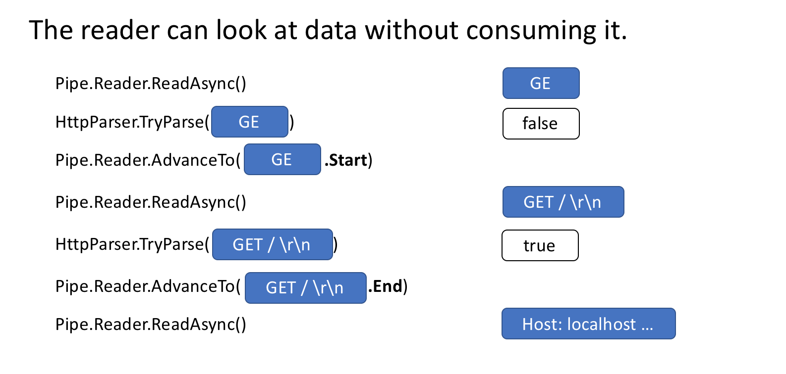

# System.IO.Pipelines：.NET中的高性能IO

[System.IO.Pipelines](https://www.nuget.org/packages/System.IO.Pipelines/) 是一个新库，旨在使.NET 中的高性能 IO 更容易实现。它是一个针对 .NET 标准的库，可在所有 .NET 实现上运行。

Pipelines 诞生于 .NET Core 团队为使 Kestrel 成为[业界最快的 Web 服务器之一](https://www.techempower.com/benchmarks/#section=data-r16&hw=ph&test=plaintext)所做的工作。最初，它只是 Kestrel 内部的一个实现细节，后来发展成为一个可重复使用的 API，并在 2.1 中作为第一类 BCL API (System.IO.Pipelines) 提供给所有 .NET 开发人员。

## 它能解决什么问题？

正确解析流或套接字中的数据主要靠模板代码，而且有很多死角，导致代码复杂且难以维护。既要实现高性能和正确性，又要处理这种复杂性是很困难的。管道旨在解决这种复杂性。

## 现在还有哪些额外的复杂性？

让我们从一个简单的问题开始。我们想编写一个 TCP 服务器，从客户端接收以行分隔的信息（以 n 分隔）。

### 使用 NetworkStream 的 TCP 服务器

*免责声明：与所有对性能敏感的工作一样，每个方案都应根据应用程序的实际情况来衡量。根据网络应用程序需要处理的规模，上述各种技术的开销可能并非必要。*

在 Pipelines 之前，您在 .NET 中编写的典型代码如下所示：

```c#
async Task ProcessLinesAsync(NetworkStream stream)
{
    var buffer = new byte[1024];
    await stream.ReadAsync(buffer, 0, buffer.Length);
    
    // 处理缓冲区中的一行
    ProcessLine(buffer);
}
```

在本地测试时，这段代码可能可以工作，但它有几个错误：

- 对 ReadAsync 的一次调用可能无法接收整条信息（行结束）。
- 它忽略了 `stream.ReadAsync()` 的结果，而该结果返回的是实际填入缓冲区的数据量。
- 它无法处理在一次 `ReadAsync` 调用中返回多行数据的情况。

这些都是读取流数据时常见的陷阱。为了解决这个问题，我们需要做一些改动：

- 我们需要缓冲接收到的数据，直到找到新行。
- 我们需要解析缓冲区中返回的所有行。

```c#
async Task ProcessLinesAsync(NetworkStream stream)
{
    var buffer = new byte[1024];
    var bytesBuffered = 0;
    var bytesConsumed = 0;

    while (true)
    {
        var bytesRead = await stream.ReadAsync(buffer, bytesBuffered, buffer.Length - bytesBuffered);
        if (bytesRead == 0)
        {
            // EOF
            break;
        }
        // 跟踪缓冲字节数
        bytesBuffered += bytesRead;
        
        var linePosition = -1;

        do
        {
            // 在缓冲数据中查找 EOL
            linePosition = Array.IndexOf(buffer, (byte)'\n', bytesConsumed, bytesBuffered - bytesConsumed);

            if (linePosition >= 0)
            {
                // 根据偏移量计算行长度
                var lineLength = linePosition - bytesConsumed;

                // 处理行
                ProcessLine(buffer, bytesConsumed, lineLength);

                // 移动 bytesConsumed 跳过我们已消费的行 (包括 \n)
                bytesConsumed += lineLength + 1;
            }
        }
        while (linePosition >= 0);
    }
}
```

同样，这在本地测试中可能有效，但有可能该行大于 1KiB（1024 字节）。我们需要调整输入缓冲区的大小，直到找到新行为止。

此外，在处理较长的行时，我们会在堆上分配缓冲区。我们可以通过使用 `ArrayPool<byte>` 来改善这种情况，从而避免在解析来自客户端的较长行时重复分配缓冲区。

```c#
async Task ProcessLinesAsync(NetworkStream stream)
{
    byte[] buffer = ArrayPool<byte>.Shared.Rent(1024);
    var bytesBuffered = 0;
    var bytesConsumed = 0;

    while (true)
    {
        // 计算缓冲区中剩余的字节数
        var bytesRemaining = buffer.Length - bytesBuffered;

        if (bytesRemaining == 0)
        {
            // 将缓冲区的大小增加一倍，并将之前缓冲的数据复制到新的缓冲区中
            var newBuffer = ArrayPool<byte>.Shared.Rent(buffer.Length * 2);
            Buffer.BlockCopy(buffer, 0, newBuffer, 0, buffer.Length);
            // 归还旧的缓冲区
            ArrayPool<byte>.Shared.Return(buffer);
            buffer = newBuffer;
            bytesRemaining = buffer.Length - bytesBuffered;
        }

        var bytesRead = await stream.ReadAsync(buffer, bytesBuffered, bytesRemaining);
        if (bytesRead == 0)
        {
            // EOF
            break;
        }
        
        // 跟踪缓冲字节数
        bytesBuffered += bytesRead;
        
        do
        {
            // 在缓冲数据中查找 EOL
            linePosition = Array.IndexOf(buffer, (byte)'\n', bytesConsumed, bytesBuffered - bytesConsumed);

            if (linePosition >= 0)
            {
                // 根据偏移量计算行长度
                var lineLength = linePosition - bytesConsumed;

                // 处理行
                ProcessLine(buffer, bytesConsumed, lineLength);

                // 移动 bytesConsumed 跳过我们已消费的行 (包括 \n)
                bytesConsumed += lineLength + 1;
            }
        }
        while (linePosition >= 0);
    }
}
```

这段代码可以工作，**但现在我们要调整缓冲区的大小，这将导致更多的缓冲区副本。由于逻辑不会在处理行后缩小缓冲区，因此也会占用更多内存**。为了避免这种情况，我们可以存储一个缓冲区列表，而不是每次超过 1KB 缓冲区大小时都调整其大小。

此外，在 1KiB 缓冲区完全清空之前，我们不会扩大它的大小。这意味着我们最终传递给 `ReadAsync` 的缓冲区会越来越小，从而导致对操作系统的调用次数增多。

为了减少这种情况，我们会在现有缓冲区剩余的字节数少于 512 字节时分配一个新缓冲区：

```c#
public class BufferSegment
{
    public byte[] Buffer { get; set; }
    public int Count { get; set; }

    public int Remaining => Buffer.Length - Count;
}

async Task ProcessLinesAsync(NetworkStream stream)
{
    const int minimumBufferSize = 512;

    var segments = new List<BufferSegment>();
    var bytesConsumed = 0;
    var bytesConsumedBufferIndex = 0;
    var segment = new BufferSegment { Buffer = ArrayPool<byte>.Shared.Rent(1024) };

    segments.Add(segment);

    while (true)
    {
        // 计算缓冲区中剩余的字节数
        if (segment.Remaining < minimumBufferSize)
        {
            // 分配一个新的内存段
            segment = new BufferSegment { Buffer = ArrayPool<byte>.Shared.Rent(1024) };
            segments.Add(segment);
        }

        var bytesRead = await stream.ReadAsync(segment.Buffer, segment.Count, segment.Remaining);
        if (bytesRead == 0)
        {
            break;
        }

        // 跟踪缓冲字节数
        segment.Count += bytesRead;

        while (true)
        {
            // 在分段列表中查找 EOL
            var (segmentIndex, segmentOffset) = IndexOf(segments, (byte)'\n', bytesConsumedBufferIndex, bytesConsumed);

            if (segmentIndex >= 0)
            {
                // 处理行
                ProcessLine(segments, segmentIndex, segmentOffset);

                bytesConsumedBufferIndex = segmentOffset;
                bytesConsumed = segmentOffset + 1;
            }
            else
            {
                break;
            }
        }

        // 从列表中删除已消费的区段，以便我们不再查看它们
        for (var i = bytesConsumedBufferIndex; i >= 0; --i)
        {
            var consumedSegment = segments[i];
            // 归还所有分段，除非这是当前分段
            if (consumedSegment != segment)
            {
                ArrayPool<byte>.Shared.Return(consumedSegment.Buffer);
                segments.RemoveAt(i);
            }
        }
    }
}

(int segmentIndex, int segmentOffest) IndexOf(List<BufferSegment> segments, byte value, int startBufferIndex, int startSegmentOffset)
{
    var first = true;
    for (var i = startBufferIndex; i < segments.Count; ++i)
    {
        var segment = segments[i];
        // 从正确的偏移量开始
        var offset = first ? startSegmentOffset : 0;
        var index = Array.IndexOf(segment.Buffer, value, offset, segment.Count - offset);

        if (index >= 0)
        {
            // 返回缓冲区索引和发现 EOL 的段内索引
            return (i, index);
        }

        first = false;
    }
    return (-1, -1);
}
```

代码变得更加复杂了。在寻找分隔符时，我们要跟踪已填满的缓冲区。为此，我们在这里使用 `List<BufferSegment>` 来表示缓冲数据，同时寻找新的行分隔符。因此，`ProcessLine` 和 `IndexOf` 现在接受 `List<BufferSegment>` 而不是 `byte[]`、`offset` 和 `count`。我们的解析逻辑现在需要处理一个或多个缓冲区段。

我们的服务器现在可以处理部分消息，并使用池化内存来减少整体内存消耗，但我们还需要做一些更改：

1. 我们从 `ArrayPool<byte>` 中使用的 `byte[]` 只是普通的托管数组。这意味着每当我们执行 `ReadAsync` 或 `WriteAsync` 操作时，这些缓冲区都会在异步操作期间被钉住(pinned)（以便与操作系统上的本地 IO API 交互）。这对垃圾回收器的性能有影响，因为钉住的内存不能移动，这会导致堆碎片。根据异步操作的等待时间，可能需要改变池的实现。
2. 通过解耦读取和处理逻辑，可以优化吞吐量。这将产生批处理效应，让解析逻辑消耗更大块的缓冲区，而不是在解析完一行后才读取更多数据。这带来了一些额外的复杂性：
   1. 我们需要两个独立运行的循环。一个负责从 `Socket` 读取数据，另一个负责解析缓冲区。
   2. 我们需要一种方法，在数据可用时向解析逻辑发出信号。
   3. 我们需要确定如果从 `Socket` 读取数据的循环“太快”会发生什么。如果解析逻辑跟不上，我们需要一种方法来节流读取循环。这通常被称为“流量控制”或“背压”。
   4. 我们需要确保线程安全。现在，我们在读取循环和解析循环之间共享一组缓冲区，它们在不同的线程上独立运行。
   5. 内存管理逻辑现在分散在两段不同的代码中，从缓冲池中租用的代码是从套接字中读取，而从缓冲池中返回的代码是解析逻辑。
   6. 我们需要非常小心地处理解析逻辑完成后如何返回缓冲区的问题。稍有不慎，我们返回的缓冲区很可能仍在被 `Socket` 的读取逻辑写入。

这样一来，复杂性就大增了（我们甚至还没有涵盖所有情况）。高性能网络通常意味着编写非常复杂的代码，以便从系统中获取更多性能。

`System.IO.Pipelines` 的目标就是让编写这类代码变得更简单。

### 使用 System.IO.Pipelines 的 TCP 服务器

让我们用 `System.IO.Pipelines` 来看看这个示例是什么样子的：

```c#
async Task ProcessLinesAsync(Socket socket)
{
    var pipe = new Pipe();
    Task writing = FillPipeAsync(socket, pipe.Writer);
    Task reading = ReadPipeAsync(pipe.Reader);

    return Task.WhenAll(reading, writing);
}

async Task FillPipeAsync(Socket socket, PipeWriter writer)
{
    const int minimumBufferSize = 512;

    while (true)
    {
        // 从 PipeWriter 中至少分配 512 字节
        Memory<byte> memory = writer.GetMemory(minimumBufferSize);
        try 
        {
            int bytesRead = await socket.ReceiveAsync(memory, SocketFlags.None);
            if (bytesRead == 0)
            {
                break;
            }
            // 告诉 PipeWriter 从 Socket 中读取了多少数据
            writer.Advance(bytesRead);
        }
        catch (Exception ex)
        {
            LogError(ex);
            break;
        }

        // 向 PipeReader 提供数据
        FlushResult result = await writer.FlushAsync();

        if (result.IsCompleted)
        {
            break;
        }
    }

    // 告诉 PipeReader 没有数据了
    writer.Complete();
}

async Task ReadPipeAsync(PipeReader reader)
{
    while (true)
    {
        ReadResult result = await reader.ReadAsync();

        ReadOnlySequence<byte> buffer = result.Buffer;
        SequencePosition? position = null;

        do 
        {
            // 在缓冲区中查找 EOL
            position = buffer.PositionOf((byte)'\n');

            if (position != null)
            {
                // 处理行
                ProcessLine(buffer.Slice(0, position.Value));
                
                // 跳过该行 + 换行符（\n）
                buffer = buffer.Slice(buffer.GetPosition(1, position.Value));
            }
        }
        while (position != null);

        // 告诉 PipeReader 我们消耗了多少缓冲区空间
        reader.AdvanceTo(buffer.Start, buffer.End);

        // 如果没有更多数据，请停止阅读
        if (result.IsCompleted)
        {
            break;
        }
    }

    // 将 PipeReader 标记为完成
    reader.Complete();
}
```

Pipeline 版本的行阅读器有 2 个循环：

- `FillPipeAsync` 从 `Socket` 读取数据并写入 `PipeWriter`。
- `ReadPipeAsync` 从 `PipeReader` 读取数据，并解析接收到的数据行。

与原始示例不同的是，没有在任何地方分配显式缓冲区。这是管道的核心功能之一。所有缓冲区管理都委托给 `PipeReader`/`PipeWriter` 实现。

**这使得消费代码更容易只关注业务逻辑，而不是复杂的缓冲区管理。**

在第一个循环中，我们首先调用 `PipeWriter.GetMemory(int)`，从底层写入器中获取一些内存；然后调用 `PipeWriter.Advance(int)`，告诉 `PipeWriter` 我们实际向缓冲区写入了多少数据。然后，我们调用 `PipeWriter.FlushAsync()` 向 `PipeReader` 提供数据。

在第二个循环中，我们将消耗 `PipeWriter` 写入的缓冲区数据，这些数据最终来自 `Socket`。当调用 `PipeReader.ReadAsync()` 返回时，我们会得到一个 `ReadResult`，其中包含两个重要信息，一个是以 `ReadOnlySequence<byte>` 形式读取的数据，另一个是让读者知道写入器是否完成写入（EOF）的 bool `IsCompleted`。找到行结束（EOL）分隔符并解析该行后，我们对缓冲区进行切分，跳过已经处理过的内容，然后调用 `PipeReader.AdvanceTo` 告诉 `PipeReader` 我们已经消耗了多少数据。

在每个循环结束时，我们都会完成读取器和写入器的工作。这样，底层管道就可以释放其分配的所有内存。

## System.IO.Pipelines

### 部分读

除了处理内存管理外，管道的另一个核心功能是可以偷看管道中的数据，而不实际消耗这些数据。

`PipeReader` 有两个核心 API：`ReadAsync` 和 `AdvanceTo`。`ReadAsync` 获取管道中的数据，`AdvanceTo` 告诉 `PipeReader` 阅读器不再需要这些缓冲区，因此可以将其丢弃（例如返回底层缓冲池）。

下面是一个 http 解析器的示例，它可以读取部分数据，并在收到有效起始行之前将数据缓冲到管道中。



### ReadOnlySequence<T>

`Pipe` 实现存储了在 `PipeWriter` 和 `PipeReader` 之间传递的缓冲区链表。`PipeReader.ReadAsync` 公开了一个 `ReadOnlySequence<T>`，它是一种新的 BCL 类型，表示对只读内存<T>的一个或多个片段的查看，类似于 `Span<T>` 和 `Memory<T>`，后者提供了对数组和字符串的查看。


`Pipe`在内部维护指向读写器在整个已分配数据集中所处位置的指针，并在写入或读取数据时对其进行更新。`SequencePosition` 表示缓冲区链表中的一个点，可用于有效地分割只读序列<T>。

由于 `ReadOnlySequence<T>` 可以支持一个或多个分段，因此高性能处理逻辑通常会根据单个或多个分段来划分快慢路径。

例如，下面是一个将 ASCII `ReadOnlySequence<byte>` 转换为字符串的例程：

```c#
string GetAsciiString(ReadOnlySequence<byte> buffer)
{
    if (buffer.IsSingleSegment)
    {
        return Encoding.ASCII.GetString(buffer.First.Span);
    }

    return string.Create((int)buffer.Length, buffer, (span, sequence) =>
    {
        foreach (var segment in sequence)
        {
            Encoding.ASCII.GetChars(segment.Span, span);
            span = span.Slice(segment.Length);
        }
    });
}
```

### 背压和流量控制

在一个完美的世界里，读取和解析工作是一个团队：读取线程从网络中读取数据并将其放入缓冲区，而解析线程则负责构建相应的数据结构。通常情况下，解析工作要比从网络中复制数据块花费更多时间。因此，读取线程很容易压倒解析线程。其结果是，读取线程将不得不放慢速度，或分配更多内存为解析线程存储数据。为了达到最佳性能，需要在频繁暂停和分配更多内存之间取得平衡。

为了解决这个问题，管道有两个设置来控制数据流，即暂停写入阈值（`PauseWriterThreshold`）和恢复写入阈值（`ResumeWriterThreshold`）。`PauseWriterThreshold` 决定了在调用 `PipeWriter.FlushAsync` 暂停之前应该缓冲多少数据。`ResumeWriterThreshold` 控制阅读器必须消耗多少数据才能继续写入。


当 `Pipe` 中的数据量超过 `PauseWriterThreshold` 时，`PipeWriter.FlushAsync` 会“阻塞”；当数据量低于 `ResumeWriterThreshold` 时，`PipeWriter.FlushAsync` 会“解除阻塞”。有两个值用于防止在限制范围内出现乱码。

### IO 调度

使用 async/await 时，通常会在线程池线程或当前 `SynchronizationContext` 上调用延续性。

在进行 IO 时，对 IO 的执行位置进行细粒度控制非常重要，这样可以更有效地利用 CPU 缓存，这对网络服务器等高性能应用程序至关重要。Pipelines 提供了一个 `PipeScheduler`，用于确定异步回调的运行位置。这样，调用者就能精确控制 IO 使用的线程。

在 Kestrel Libuv 传输中，IO 回调在专用事件循环线程上运行，这就是一个实际例子。

### PipeReader 模式的其他优点

- 有些底层系统支持“无缓冲区等待”，也就是说，在底层系统有可用数据之前，无需分配缓冲区。例如，在使用 epoll 的 Linux 系统上，可以在数据准备就绪后再提供缓冲区进行读取。这就避免了大量线程在等待数据时不需要立即预留大量内存的问题。
- 由于解析逻辑与网络代码是分开的，因此默认 `Pipe` 便于编写针对网络代码的单元测试，这样单元测试只需针对内存缓冲区运行解析逻辑，而无需直接从网络中消耗数据。这也使得测试那些发送部分数据的难以测试的模式变得容易。ASP.NET Core 使用它来测试 Kestrel http 解析器的各个方面。
- 允许将底层操作系统缓冲区（如 Windows 上的 Registered IO API）暴露给用户代码的系统自然适合管道，因为缓冲区总是由 `PipeReader` 实现提供。

## 其他相关类型

在制作 System.IO.Pipelines 的过程中，我们还添加了许多新的原始 BCL 类型：

- [MemoryPool<T>](https://docs.microsoft.com/en-us/dotnet/api/system.buffers.memorypool-1?view=netcore-2.1), [IMemoryOwner<T>](https://docs.microsoft.com/en-us/dotnet/api/system.buffers.imemoryowner-1?view=netcore-2.1), [MemoryManager<T>](https://docs.microsoft.com/en-us/dotnet/api/system.buffers.memorymanager-1?view=netcore-2.1) - .NET Core 1.0 添加了 [ArrayPool<T>](https://docs.microsoft.com/en-us/dotnet/api/system.buffers.arraypool-1?view=netcore-2.1)，而在 .NET Core 2.1 中，我们现在有了一个更通用的池抽象，它可以在任何 `Memory<T>` 上运行。这提供了一个可扩展性点，让您可以插入更高级的分配策略，并控制缓冲区的管理方式（例如，提供预钉式缓冲区，而不是纯托管数组）。
- [IBufferWriter<T>](https://docs.microsoft.com/en-us/dotnet/api/system.buffers.ibufferwriter-1?view=netcore-2.1) - 代表用于写入同步缓冲数据的汇。(`PipeWriter` 实现了此功能）
- [IValueTaskSource](https://docs.microsoft.com/en-us/dotnet/api/system.threading.tasks.sources.ivaluetasksource-1?view=netcore-2.1) - [ValueTask<T>](https://docs.microsoft.com/en-us/dotnet/api/system.threading.tasks.valuetask-1?view=netcore-2.1) 自 .NET Core 1.1 起就已存在，但在 .NET Core 2.1 中获得了一些超级能力，允许无分配等待的异步操作。详情请参见 https://github.com/dotnet/corefx/issues/27445。

## 我该如何使用 Pipelines？

这些 API 位于 [System.IO.Pipelines](https://www.nuget.org/packages/System.IO.Pipelines/) nuget 软件包中。

下面是一个 .NET Core 2.1 服务器应用程序的示例，它使用管道来处理基于行的消息（我们上面的示例）https://github.com/davidfowl/TcpEcho。它应使用 `dotnet run` 运行（或在 Visual Studio 中运行）。它监听 8087 端口上的套接字，并将收到的消息写入控制台。您可以使用 netcat 或 putty 等客户端与 8087 建立连接，并发送基于行的消息来查看其运行情况。

如今，Pipelines 为 Kestrel 和 SignalR 提供了支持，我们希望看到它成为 .NET 社区中许多网络库和组件的核心。

# 原文链接

https://devblogs.microsoft.com/dotnet/system-io-pipelines-high-performance-io-in-net/