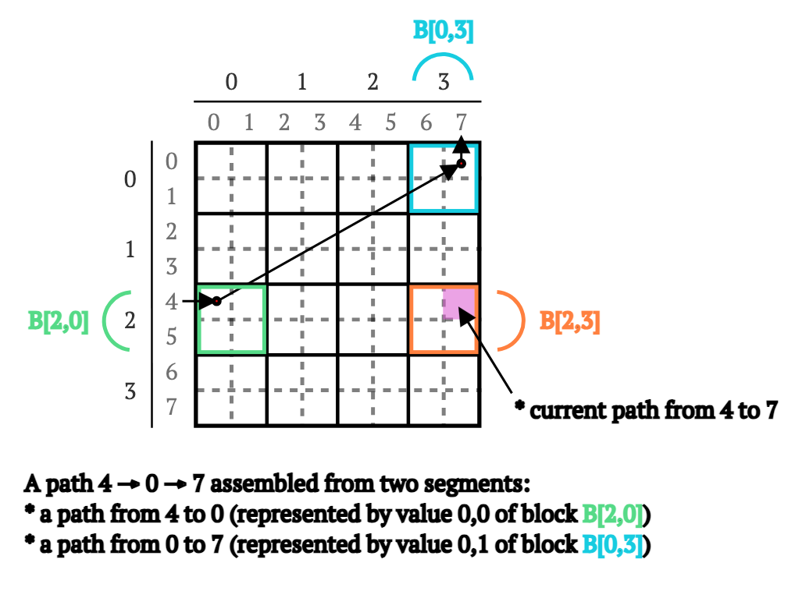

# 实现 Blocked Floyd-Warshall 用于解决所有对最短路径问题 C# 实现

##  介绍

在之前的帖子中，我们实现了[Floyd-Warshall（弗洛伊德-沃沙尔算法）](https://olegkarasik.wordpress.com/2021/04/25/implementing-floyd-warshall-algorithm-for-solving-all-pairs-shortest-paths-problem-in-c/)（四种变体）以及[路由重建算法](https://olegkarasik.wordpress.com/2022/05/11/routes-of-all-pairs-shortest-paths-with-floyd-warshall-algorithm/)。在这些帖子中，我们探讨了所有对最短路径问题的基本概念、内存中的数据表示、并行性、向量化以及如何将算法调整为适应数据特性。

在本帖中，我们将继续我们的旅程，探索一种更高效的方法来解决所有对最短路径问题。然而，这次，除了利用CPU的向量和并行能力外，我们还将利用L1、L2和L3缓存。

听起来有趣吗？那么让我们开始编写代码吧 🙂

在深入算法的理论和代码之前，我建议花几分钟时间回顾一下“CPU缓存”的基本信息。

> 如果你对这个主题有扎实的理解，可以自由跳过这一部分。如果你决定阅读（因为你只是好奇或者想复习基础知识），请注意以下信息是一个简化的概述。

## 什么是缓存？

你很可能在新的Intel或AMD芯片的广告中，或者在与朋友或同事的硬件讨论中听说过CPU缓存。在这里，我们不打算讨论CPU缓存究竟是什么，或者Intel、AMD和Apple在实现方面谁更优秀。

相反，我们将试着建立一个关于缓存的心理模型，并学习如何利用它来：

- 在使用 C# 和 .NET 编写高性能代码时，更好地了解我们可以或不能突破的极限。
- 更好地理解在不同平台、不同参数下应用程序在高性能场景中的表现。
- 在朋友面前自豪地谈论“缓存”。

那么，让我们从基础开始……缓存到底是什么？

想象一下，你坐在一个空荡荡的公寓里，面前是电脑。你正在开发一个新特性，进展顺利。你工作得飞快，没有错误和失误，进入了完美的状态。

你就是**CPU**。

你需要定期查阅文档，所有需要的文档都在马路对面的图书馆。

图书馆就是**主内存**。

你可以随时进入图书馆阅读所需的任何资料。然而，每次去图书馆都需要时间，阻碍了你的工作进展，这听起来并不高效。为了改善这种情况，你开始把一些文档的片段写在便利贴上，并把它们贴在显示器上。

显示器上的便利贴就是**一级缓存**。

现在，当你需要查找文档时，首先查看便利贴，只有在信息没有的情况下，才去图书馆。

如果在便利贴上找到了需要的信息，就称之为**缓存命中**；否则就是**缓存未命中**。

把便利贴放在显示器上减少了去“图书馆”的时间，但并没有完全消除这种情况，因为你无法提前知道需要哪些文档。你能从图书馆带回来的有用信息数量是有限的。

可以带回的有用信息量称为**缓存行**。

你不能在显示器上放置数百万个便利贴，因此，当空间不足时，你必须把其中一些扔掉。

当你因为空间限制而扔掉便利贴时，称为**缓存驱逐**。

为了不再扔掉有用的信息（并在需要时避免去图书馆），你为自己买了一个“小盒子”。现在，当你从图书馆带回“新”的便利贴，并需要为显示器腾出空间时，不是把“旧”的便利贴扔掉，而是把它们放进“小盒子”。这样，如果再次需要这些信息，你就可以从“小盒子”中取出并放回显示器，从而省去去图书馆的时间。

“小盒子”就是**二级缓存**。

“小盒子”可以容纳比显示器更多的便利贴，但它也不是无限的。因此，当一些便利贴放不下时，你仍然需要把它们扔掉。这就是你决定买一个“巨大盒子”的原因。现在，当你从图书馆带回新便利贴时，首先复制它们并把副本放入“巨大盒子”，然后再把原件放到显示器上。如果你需要更换显示器上的便利贴，像以前一样把它们放入“小盒子”，如果“小盒子”装满了，你就把它们扔掉。然而，这次如果再次需要这些信息，你只需从“巨大盒子”中复制便利贴并放回显示器上。

“巨大盒子”就是**三级缓存（又称LLC）**。

“巨大盒子”并不能消除去“图书馆”的次数，然而，如果“巨大盒子”的容量相当大，你将会在其中存放大量相关的文档片段，从而使你能够在不间断的情况下完成大量工作。

基本上就是这样。

上述模型并不完整，也不理想，但至少我希望它清楚地阐明了现代芯片拥有多个级别缓存的主要原因——以减少对主内存的往返访问次数，并尽可能保持CPU忙碌。

从模型中可能不太明显的是，所有缓存（L1“显示器上的便利贴”、L2“小盒子”和L3“巨大盒子”）具有不同的访问时间（即延迟）和大小。

以下是Intel i7-6700（Skylake）CPU的示例：

| 缓存 | 访问时间（即延迟） | 大小   |
| ---- | ------------------ | ------ |
| L1   | 4个周期            | 64 KB  |
| L2   | 12个周期           | 256 KB |
| L3   | 42个周期           | 8 MB   |

**表1. [Intel i7-6700（Skylake）](https://www.7-cpu.com/cpu/Skylake.html)处理器的L1、L2和L3缓存的访问时间和大小。**

> 请注意，上述数字仅是一个示例。不同的CPU有不同的特性。然而，总体关系大致相同——L1是最小但也是最快的，L2介于两者之间，L3是最大的但也是最慢的。

要真正理解这些数字，关键是要知道访问主内存需要多少时间。在同样的Intel i7-6700（Skylake）CPU上，访问主内存大约需要<u>42个周期加51纳秒</u>。你会注意到，除了周期外，这里还有一个固定的“51纳秒”时间。这不是错误，因为周期可以通过一个非常简单的公式（大致）转换为纳秒：

$t=\frac{1}f$

其中：

- t 是一个CPU周期的大致时间
- f 是CPU频率

在我们的例子中，计算结果为：

$t=\frac{1 cycle}{4∗10^{9}\frac{cycle}a}=0.25∗10^{−9}s=0.25ns$

将之前表格中的访问时间值从周期转换为访问时间，得到以下结果：

| 元素 | 访问时间（即延迟）        |
| ---- | ------------------------- |
| L1   | 1 ns                      |
| L2   | 3 ns                      |
| L3   | 10.5 ns                   |
| 内存 | 10.5 ns + 51 ns = 60.5 ns |

**表2. [Intel i7-6700（Skylake）](https://www.7-cpu.com/cpu/Skylake.html)处理器的L1、L2、L3缓存和主内存的近似访问时间（以纳秒计）。**

即使考虑到这只是一个非常近似的转换，忽略了许多细节，结果仍然令人惊讶——访问L1缓存的速度是访问主内存的60倍。

当然，在实际应用中，情况并没有那么简单，缓存相关的优化并不会直接导致60倍的性能提升。然而，正如我希望在本帖中所展示的，它们仍然可以显著改善应用程序性能。

> 熟悉这一主题的读者一定会注意到，我没有提到任何关于缓存模式（独占和包含）的内容，也没有涉及到指令缓存及内存对齐、硬件和软件预取等内容。我这样做是为了简化说明。
>
> 然而，如果你只是偶然看到这个注释并想了解更多，可以从[维基百科页面](https://en.wikipedia.org/wiki/CPU_cache)开始，如果你想思考低级性能，我推荐[Denis Bakhvalov的书](https://book.easyperf.net/perf_book)和Ulrich Drepper的[论文](https://people.freebsd.org/~lstewart/articles/cpumemory.pdf)。

## 阻塞式Floyd-Warshall算法

阻塞式Floyd-Warshall算法（又称为Blocked Floyd-Warshall）在[2]中被引入。该算法处理一个由顶点`V`组成的图`G`，用权重矩阵W表示。它将矩阵分割成相等大小的块（创建一个新的块矩阵`B`），并使用这些块来计算图中所有顶点对之间的最短路径。

这个定义听起来可能不太明显，所以这里有一个例子。

想象一个8×8的权重矩阵`W`（见图1a）。我们将矩阵分成2×2的块,创建一个新的4×4块矩阵B（见图1b）。


图1. 将8×8权重矩阵W（a）分割成4×4的2×2块矩阵B（b）的过程示意图。

矩阵`B`的每个块包含矩阵`W`中所有路径的一部分,例如（见图2）：

- `B[0,0]`包含从顶点0和1到0和1的路径
- `B[0,3]`包含从顶点0和1到6和7的路径
- `B[2,0]`包含从顶点4和5到0和1的路径
- ... `B[2,3]`包含从顶点4和5到顶点6和7的路径


图2. 4×4块矩阵中不同块所代表的路径示意图。

这些四个块所代表的所有顶点都紧密相关。仅看矩阵`B`就可以注意到，你可以从顶点4移动到0，然后从0移动到7，从而找到一条从4到7通过顶点0的路径，然后可以与现有的从4到7的路径进行比较，必要时可以更新为最短的路径（见图3）。



图3. 在块矩阵B上从顶点4到顶点7通过顶点0的路径示意图。

如果你还记得Floyd-Warshall算法，那么这些操作一定听起来非常熟悉，因为它们类似于该算法的操作：

```
algorithm FloydWarshall(W) do
  for k = 0 to N - 1 do
    for i = 0 to N - 1 do 
        for j = 0 to N - 1 do 
            // 在现有的从i到j的路径和
            // 从i到k再到j的新路径之间选择最短的,
            // 并用最小值替换现有路径
            W[i, j] = min(W[i, j], W[i, k] + W[k, j])
        end for
    end for
  end for
end algorithm
  
// 其中 W     - 是一个 N x N 大小的权重矩阵,
//      min() - 是一个返回其参数中较小值的函数
```

然而，Floyd-Warshall算法是使用矩阵`W`（而不是`B`）工作的。幸运的是，它可以很容易地重写为一个接受三个块`B1`、`B2`和`B3`而不是矩阵`W`的过程：

```
function Procedure(B1, B2, B3) do
  for k = 0 to L - 1 do
    for i = 0 to L - 1 do 
      for j = 0 to L - 1 do 
        B1[i, j] = min(B1[i, j], B2[i, k] + B3[k, j])
      end for
    end for
  end for
end function
 
// 其中 B1, B2 和 B3 - 是块矩阵B中的块,
//      L           - 是块的大小（B1, B2 和 B3 是 L x L 大小）
//      min()       - 是一个返回其参数中较小值的函数
```

如果我们以`B1 = B[2,3]`，`B2 = B[2,0]`和`B3 = B[0,3]`调用`Procedure`，它将重新计算从顶点4,5到顶点6,7通过顶点0,1的所有路径。

这里的重要一点是，虽然Procedure确实重新计算了从顶点4,5到顶点6,7的路径（通过0和1），但这些路径并不能保证是最短的，因为重新计算依赖于存储在块B[2,0]和B[0,3]中的现有路径。

幸运的是，在重新计算块B[2,3]中的路径之前，我们可以使用...相同的Procedure但使用不同的输入参数来重新计算块B[2,0]和B[0,3]中的路径（见图4）：

- 要重新计算B[2,0]，我们以`B1 = B[2,0]`，`B2 = B[2,0]`和`B3 = B[0,0]`调用`Procedure`。这重新计算了从顶点4,5到0,1通过0和1的所有路径。
- 要重新计算B[0,3]，我们以`B1 = B[0,3]`，`B2 = B[0,0]`和`B3 = B[0,3]`调用`Procedure`。这重新计算了从顶点0,1到6,7通过0和1的所有路径。


图4. 作为重新计算B[2,0]和B[0,3]块的一部分，计算通过顶点0的4 → 0路径（左）和通过顶点1的0 → 7路径的示意图。

你可能已经注意到 — `B[2,0]`和`B[0,3]`块的重新计算依赖于来自`B[0,0]`块的数据，就像`B[2,3]`块的重新计算依赖于`B[2,0]`和`B[0,3]`块一样。

幸运的是（再次）,在重新计算`B[2,0]`和`B[0,3]`块中的路径之前，我们可以使用...相同的`Procedure`但（再次）使用不同的输入参数来重新计算`B[0,0]`中的路径（见图5）：

- 要重新计算`B[0,0]`，我们以`B1 = B[0,0]`，`B2 = B[0,0]`和`B3 = B[0,0]`调用`Procedure`。这重新计算了从顶点0,1到0,1通过0和1的所有路径。


图5. 作为重新计算`B[0,0]`块的一部分,计算通过顶点0的0 → 1路径的示意图。

这可能看起来有点令人惊讶（用块本身重新计算块），但如果你记得，我们从Floyd-Warshall算法推断出`Procedure`的代码，这意味着，当所有输入参数设置为相同的块时，`Procedure`完全类似于Floyd-Warshall算法，并重新计算块内的路径：

```
function Procedure(B, B, B) do
  for k = 0 to L - 1 do
    for i = 0 to L - 1 do 
      for j = 0 to L - 1 do 
        B[i, j] = min(B[i, j], B[i, k] + B[k, j])
      end for
    end for
  end for
end function
```

综合起来，从顶点4，5到顶点6，7通过顶点0和1的路径重新计算过程如下：

1. 以`B1 = B[0,0]`，`B2 = B[0,0]`和`B3 = B[0,0]`调用`Procedure`，计算从顶点0,1到顶点0,1（由块`B[0,0]`表示）通过顶点0和1的所有路径（见图6a）。
2. 以`B1 = B[0,3]`，`B2 = B[0,0]`和`B3 = B[0,3]`调用`Procedure`，计算从顶点0,1到顶点6,7（由块`B[0,3]`表示）通过顶点0和1的所有路径（见图6b）。
3. 以`B1 = B[2,0]`，`B2 = B[2,0]`和`B3 = B[0,0]`调用`Procedure`，计算从顶点4,5到顶点0,1（由块`B[2,0]`表示）通过顶点0和1的所有路径（见图6c）。
4. 以`B1 = B[2,3]`，`B2 = B[2,0]`和`B3 = B[0,3]`调用`Procedure`，计算从顶点4,5到顶点6,7（由块`B[2,3]`表示）通过顶点0和1的所有路径（见图6d）。


图6. 通过顶点0计算4 → 7路径的示意图，首先计算通过0的0 → 1路径（a），然后通过顶点1的0 → 7路径（b），然后通过0的4 → 0路径（c），最后通过0的4 → 7路径（d）。

在代码中，这些步骤可以用四个连续的`Procedure`调用表示：

```
Procedure(B[0,0], B[0,0], B[0,0])
Procedure(B[0,3], B[0,0], B[0,3])
Procedure(B[2,0], B[2,0], B[0,0])
Procedure(B[2,3], B[2,0], B[0,3])
```

有趣的是,通过稍微调整上面的代码,我们可以重新计算从顶点4,5到2,3通过0和1的路径（我们需要做的就是用`B[0,1]`替换`B[0,3]`）：

```
Procedure(B[0,0], B[0,0], B[0,0])
Procedure(B[0,1], B[0,0], B[0,1])
Procedure(B[2,0], B[2,0], B[0,0])
Procedure(B[2,1], B[2,0], B[0,1])
```

...如果我们用`B[0,2]`替换`B[0,1]`...我想你已经明白了。我们可以继续计算通过顶点0和1的所有顶点之间的所有路径（见图7）：


图7. 通过顶点0和1重新计算矩阵中所有顶点之间所有路径的示意图。

在代码中,实现只是对不同块重复相同的步骤：

```
// 重新计算块B[0,0]（即“对角线”块）
//
Procedure(B[0,0], B[0,0], B[0,0])
//
// 重新计算块B[0,1], B[0,2]和B[0,3]（即"水平"块）
//
for i = 1 to 4 do 
  Procedure(B[0,i], B[0,0], B[0,i])
end
//
// 重新计算块B[1,0], B[2,0]和B[3,0]（即"垂直"块）
//
for i = 1 to 4 do
  Procedure(B[i,0], B[i,0], B[0,0])
end
//
// 重新计算块：
//   B[1,1], B[1,2], B[1,3], 
//   B[2,1], B[2,2], B[2,3], 
//   B[3,1], B[3,2], B[3,3]
// （即"外围"块）
//
for i = 1 to 4 do
  for j = 1 to 4 do
    Procedure(B[i,j], B[i,0], B[0,j])
  end
end
```

简单明了。这段代码重新计算了通过顶点0和1的所有顶点之间的所有路径。

要重新计算剩余的顶点组合，我们需要...重复上述算法，但从`B[1,1]`，`B[2,2]`和`B[3,3]`作为“对角线”块开始（见图8）：


图8. 通过顶点（从左到右）2和3、4和5、6和7重新计算所有顶点之间所有路径的示意图。

在代码中，完整的阻塞式Floyd-Warshall算法看起来出奇地简单：

```
algorithm BlockedFloydWarshall(B) do
  // 遍历所有“对角线”块
  //
  for m = 0 to M do
    // 重新计算“对角线”块
    //
    Procedure(B[m,m], B[m,m], B[m,m])
    //
    // 重新计算"水平"块
    //
    for i = 0 to M do
      //
      // 这里,我们跳过“对角线”块 
      //
      if i != m then
        Procedure(B[m,i], B[m,m], B[m,i])
      end
    end
    //
    // 重新计算"垂直"块
    //
    for i = 0 to M do 
      //
      // 这里,我们跳过“对角线”块
      //
      if i != m then
        Procedure(B[i,m], B[i,m], B[m,m])
      end
    end
    //
    // 重新计算"外围"块
    //
    for i = 0 to M do
      //
      // 这里,我们跳过所有"水平"块
      //
      if i != m then
        for j = 0 to 4 do
          //
          // 这里,我们跳过所有"垂直"块
          //
          if j != m then
            Procedure(B[i,j], B[i,m], B[m,j])
          end
        end
      end
    end
  end
end
 
// 其中 B - 是一个 M x M 大小的块矩阵
```

该算法遍历所有“对角线”块，并依次重新计算通过“对角线”块的顶点的所有顶点之间的所有路径。

最终，算法重新计算了通过所有顶点的所有顶点之间的所有路径。

> 这就是为什么两种算法具有相同的空间和时间复杂度，分别为O(n^2)和O(n^3)。

现在，当我们完成了理论部分，是时候在C#中实现它了。

## 实验环境

本文中的所有实验均在一个随机生成的4800个顶点的完全图上执行。

实验机器配备了2颗Intel Xeon CPU E5-2620 v4（2.10GHz，总共16个物理核心和32个逻辑核心），操作系统为Windows Server 2019。

我们使用的块大小为120×120，因为在实验硬件上该块大小展示了最佳性能特征。

代码使用.NET SDK 8.0和.NET Runtime 8.0（x64, AVX2）编译和执行。所有代码可在[GitHub](https://github.com/OlegKarasik/apsp-problems)仓库中找到。

本文中Floyd-Warshall算法的所有实现与前一篇文章中的实现相同（仅变量和方法名称略有不同）。

## 基本实现（即基线实现）

我们从以下的C#实现程序开始：

```c#
static void Procedure(
  Span<int> B1, 
  Span<int> B2, 
  Span<int> B3, 
  int block_size)
{
  for (var k = 0; k < block_size; ++k)
  {
    for (var i = 0; i < block_size; ++i)
    {
      for (var j = 0; j < block_size; ++j)
      {
        var distance = B2[i * block_size + k] + B3[k * block_size + j];
        if (B1[i * block_size + j] > distance)
        {
          B1[i * block_size + j] = distance;
        }
      }
    }
  }
}

```

这段代码几乎是将之前演示的伪代码逐字翻译为C#。唯一显著的区别是所有输入块的表示是由`Span<T>`和块的大小的组合构成。

> 如果你对如何通过乘法访问数组感到困惑，不用担心，我马上会解释清楚。

算法本身与伪代码相比略有不同（我们将此实现称为“基线”）：

```c#
private static void Baseline(
  int[] B, 
  int block_count, 
  int block_size)
{
  var lineral_block_size = block_size * block_size;
  var lineral_block_row_size = block_count * lineral_block_size;

  for (var m = 0; m < block_count; ++m) 
  {
    var offset_mm = m * lineral_block_row_size + m * lineral_block_size;

    var mm = new Span<int>(B, offset_mm, lineral_block_size);
    //
    // 计算“对角”块
    //
    Procedure(mm, mm, mm, block_size);
    //
    // 在同一循环中计算“横向”和“纵向”块
    //
    for (var i = 0; i < block_count; ++i) 
    {
      if (i != m) 
      {
        var offset_im = i * lineral_block_row_size + m * lineral_block_size;
        var offset_mi = m * lineral_block_row_size + i * lineral_block_size;

        var im = new Span<int>(B, offset_im, lineral_block_size);
        var mi = new Span<int>(B, offset_mi, lineral_block_size);

        Procedure(im, im, mm, block_size);
        Procedure(mi, mm, mi, block_size);
      }
    }
    //
    // 计算“外围”块
    //
    for (var i = 0; i < block_count; ++i) 
    {
      if (i != m) 
      {
        var offset_im = i * lineral_block_row_size + m * lineral_block_size;

        var im = new Span<int>(B, offset_im, lineral_block_size);

        for (var j = 0; j < block_count; ++j) 
        {
          if (j != m) 
          {
            var offset_ij = i * lineral_block_row_size + j * lineral_block_size;
            var offset_mj = m * lineral_block_row_size + j * lineral_block_size;

            var ij = new Span<int>(B, offset_ij, lineral_block_size);
            var mj = new Span<int>(B, offset_mj, lineral_block_size);

            Procedure(ij, im, mj, block_size);
          }
        }
      }
    }
  }
}
```

你一定注意到，`Baseline`和`Procedure`计算了大量偏移量，这些偏移量随后用于创建`Span`以及在`Span`内访问值。

这里是它的工作原理。假设一个8×8的方阵W（见图9a）。在我们脑海中，矩阵是一个正方形，但在内存中，我们可以将“方形”表示为一个8×8 = 64个值的数组（这被称为“行主序(row-major)”或“线性(lineal)”表示），其中每个值都可以使用一个简单的公式进行访问：

$i_{row}×8+i{column}$

其中：

- $i_{row}$ - 元素所在行的索引
- $i_{column}$ - 元素所在列的索引
- 8 - 单行中的元素数量

这正是我们在`Procedure`中访问块值时所做的（我们使用`block_size`代替`8`）。


图9. 矩阵W（来自前一篇文章）和当前文章中的矩阵B在内存中的线性表示。左侧是矩阵W的行依次放置在内存中，形成“行主序”表示。右侧是每个块依次在线性表示的矩阵B中，形成块的“行主序”表示。

当谈到块矩阵时，我们可以应用完全相同的思维。假设一个4×4块矩阵B，其中每个块是一个2×2的方阵（见图9b）。我们可以将这个矩阵表示为一个(2×2)x(4×4) = 4×16 = 64个值的数组（再次），其中每个块依次用相同的逻辑放入数组中。这样，我们可以使用以下公式找到任何块的“起始位置”：

$i_{row}×16+i_{column}×4$

其中：

- $i_{row}$ - 块的行索引
- $i_{column}$ - 块的列索引
- 16 - 单行中块的元素数量
- 4 - 单块中的元素数量

你可以看到，`16`和`4`在`Baseline`中被计算为`liner_block_row_size`和`liner_block_size`。

这些操作对算法的性能至关重要。线性表示在缓存友好性方面表现极佳（尤其是在我们大多数时间顺序访问元素的情况下）。它们还允许我们以常数时间访问矩阵B的任何块（以及任何块中的任何值），这对性能也有益。

现在让我们看看`Baseline`实现的运行情况。

### 实验结果

以下是“基线”实现的实验结果：

| 算法（基线）           | 图          | 平均时间（秒） | 误差（秒） | 标准差（秒） | LLC缺失/操作  |
| ---------------------- | ----------- | -------------- | ---------- | ------------ | ------------- |
| Floyd-Warshall         | 4800        | 172.881 秒     | 2.0421     | 1.9101       | 6,903,951,087 |
| Blocked Floyd-Warshall | 4800（120） | 200.075 秒     | 0.0578     | 0.0540       | 59,423,676    |

表 3. “Baseline”实现的 Floyd-Warshall 和 Blocked Floyd-Warshall 算法的实验结果。

令人惊讶的是，Blocked Floyd-Warshall 比 Floyd-Warshall 慢了约 15%。这并不是预期的结果……或许是意料之中的？

考虑这两种算法的代码，实际上很简单——从内存中读取三个值，求和两个值，比较两个值，并将一个值写回。

现代 CPU 在单线程执行方面进行了极大的优化。它们具有多级流水线，能够同时处理多个操作（在没有数据依赖的情况下）。它们可以检测线性内存访问模式（这就是我们在两种算法中使用它的原因），并自动将数据从主内存预加载到缓存中（硬件预取）。

所有这些因素结合在一起，导致了一个结果：在具有缓存友好的内存访问的算法中（如果查看 `LLC Miss/Op`这一列，可以看到 Blocked Floyd-Warshall 更加缓存友好），却没有性能提升，甚至表现得更慢，因为它在以正确的方式处理数据时需要额外的工作（例如，Span 的实例化、栈的推送-弹出、额外的循环等）。

我们可以在分析器下运行相同的代码（例如 Intel VTune），清楚地看到没有一个算法是“受限”的（即受到内存限制）：

| 算法（Baseline）       | 时钟周期        | 已退指令          | CPI 比率 | 内存绑定 |
| ---------------------- | --------------- | ----------------- | -------- | -------- |
| Floyd-Warshall         | 364,956,900,000 | 1,771,270,200,000 | 0.206    | 3.0%     |
| Blocked Floyd-Warshall | 449,603,700,000 | 1,925,290,500,000 | 0.234    | 0.0%     |

表 4. 来自 Intel VTune 分析器的“Baseline”实现的 Floyd-Warshall 和 Blocked Floyd-Warshall 算法的时钟周期、已退指令、CPI 比率和内存绑定参数。

我提取了四个参数（在众多参数中）：

- **时钟周期**——是执行我们算法时消耗的 CPU 时钟周期数。
- **已退指令(Instructions Retired)**——是 CPU 处理的指令数量。
- **CPI 比率**——是时钟周期数 / 已退指令。
- **内存绑定**——是一个高层的聚合指标，表示内存对执行的影响（当 CPU 等待数据从内存中提取时）。

可以看到，Blocked Floyd-Warshall 算法的已退指令数量略高于 Floyd-Warshall。这是预期的结果，因为它在安排计算时做了更多的工作。两者的 CPI 比率都较低，这意味着每个“周期”（即时钟周期）CPU 能够处理多达五条指令。

这两个观察结果结合低内存绑定基本上告诉我们，CPU 的工作达到了其最大能力，没有发生任何停顿。

接下来，让我们看看是否可以使 Blocked Floyd-Warshall 算法超越 Floyd-Warshall 的表现。

## 矢量化实现（又名 "矢量）

我们可以提高这个完全由 CPU 计算密集型算法性能的第一步是强制 CPU 同时进行更多操作。没错，我说的就是向量化。

在[上一篇文章](https://olegkarasik.wordpress.com/2021/04/25/implementing-floyd-warshall-algorithm-for-solving-all-pairs-shortest-paths-problem-in-c/)中，你已经看到了 Floyd-Warshall 算法的向量化实现，如果你没有看到，也不用担心，因为它几乎是过程的完整复制：

```c#
static void Procedure(
  Span<int> B1, 
  Span<int> B2, 
  Span<int> B3, 
  int block_size)
{
  for (var k = 0; k < block_size; ++k)
  {
    for (var i = 0; i < block_size; ++i)
    {
      // 从 B2 中读取值的向量
      // （获取“i -> k”的现有路径）
      var ik_vec = new Vector<int>(B2[i * block_size + k]);
      
      // 向量化循环
      var j = 0;
      for (; j < block_size - Vector<int>.Count; j += Vector<int>.Count)
      {
        // 从 B1 中读取值的向量
        // （获取“i -> j”的现有路径）
        var ij_vec = new Vector<int>(
          B1.Slice(i * block_size + j, Vector<int>.Count));
        
        // 从 B3 中读取值的向量
        // （获取“k -> j”的现有路径）
        // 并将其与 B2 的值相加
        // （获取新的路径“i -> k -> j”）
        var ikj_vec = new Vector<int>(
          B3.Slice(k * block_size + j, Vector<int>.Count)) 
          + ik_vec;

        // 将 B1 中现有路径的向量与新路径的向量进行比较
        var lt_vec = Vector.LessThan(ij_vec, ikj_vec);
        if (lt_vec == new Vector<int>(-1))
        {
          continue;
        }
        
        // 将所有小于现有“i -> j”路径的“i -> k -> j”路径
        // 复制回 B1 块
        var r_vec = Vector.ConditionalSelect(lt_vec, ij_vec, ikj_vec);
        r_vec.CopyTo(B1.Slice(i * block_size + j, Vector<int>.Count));
      }
      
      // 非向量化循环
      for (; j < block_size; ++j)
      {
        var distance = B2[i * block_size + k] + B3[k * block_size + j];
        if (B1[i * block_size + j] > distance)
        {
          B1[i * block_size + j] = distance;
        }
      }
    }
  }
}
```

与之前一样，我们使用 `Vector` 和 `Vector<T>` 类型来实现向量化。实现包含两个循环：一个是向量化的（用于计算大多数路径），另一个是非向量化的（用于计算当块的大小不能被向量的大小整除时的剩余路径）。

主算法中没有可以向量化的部分，并且由于 `Procedure` 的接口没有变化，我们可以直接插入新代码并进行实验。

### 实验结果

以下是向量化实现的实验结果：

| 算法（向量）           | 图          | 平均时间（秒） | 误差（秒） | 标准差（秒） | LLC 缺失/操作 |
| ---------------------- | ----------- | -------------- | ---------- | ------------ | ------------- |
| Floyd-Warshall         | 4800        | 73.251 秒      | 0.4993     | 0.4671       | 6,353,509,854 |
| Blocked Floyd-Warshall | 4800（120） | 64.792 秒      | 0.0318     | 0.0282       | 50,703,019    |

表 5. “向量”实现的 Floyd-Warshall 和 Blocked Floyd-Warshall 算法的实验结果。

这次，Blocked Floyd-Warshall 比 Floyd-Warshall 算法快了约 12%。

在分析器下运行相同的代码也展示了不同的结果：

| 算法（向量）           | 时钟周期        | 已退指令        | CPI 比率 | 内存绑定 |
| ---------------------- | --------------- | --------------- | -------- | -------- |
| Floyd-Warshall         | 161,668,500,000 | 490,026,600,000 | 0.330    | 6.8%     |
| Blocked Floyd-Warshall | 144,314,100,000 | 488,193,300,000 | 0.296    | 0.3%     |

表 6. 来自 Intel VTune 分析器的“向量”实现的 Floyd-Warshall 和 Blocked Floyd-Warshall 算法的时钟周期、已退指令、CPI 比率和内存绑定参数。

我们可以看到，两种算法的已退指令数量显著减少（这也是预期的结果，因为向量指令同时执行多个操作，CPU 在每个时钟周期内执行多个向量指令）。

我们还可以看到内存绑定的变化——Floyd-Warshall 的内存绑定翻倍，而 Blocked Floyd-Warshall 算法几乎没有变化。

尽管如此，CPI 比率依然较低，这再次说明 CPU 几乎没有停顿。因此，还有改进的空间。

接下来，让我们看看是否可以在这里应用并行性。

## 并行向量化实现（即“并行向量”）

对阻塞的 Floyd-Warshall 算法进行并行化是纯粹的“任务并行性”形式，其中“任务”是对单个块的重新计算（即单次调用 `Procedure`）。

实现的最简单方法是使用消息传递（即发送自定义消息）、`CountdownEvent` 和`ThreadPool`。

以下是自定义消息的代码：

```c#
private readonly struct ParallelMessage
{
  // 用于信号的倒计时事件，以指示消息何时被处理
  public readonly CountdownEvent Event;
  public readonly int[] Matrix;
  public readonly int OffsetB1;
  public readonly int OffsetB2;
  public readonly int OffsetB3;
  public readonly int BlockSize;
  public readonly int SpanLength;

  public ParallelMessage(
    CountdownEvent Event,
    int[] Matrix,
    int OffsetB1,
    int OffsetB2,
    int OffsetB3,
    int BlockSize,
    int SpanLength)
  {
    this.Event = Event;
    this.Matrix = Matrix;
    this.OffsetB1 = OffsetB1;
    this.OffsetB2 = OffsetB2;
    this.OffsetB3 = OffsetB3;
    this.BlockSize = BlockSize;
    this.SpanLength = SpanLength;
  }
}
```

消息是一个只读结构（出于性能考虑，避免分配），包含初始化 B1、B2 和 B3 块所需的所有信息，并调用 `Procedure`。

`ParallelMessage` 转换为 `Procedure` 调用的过程由 `ParallelProcedure` 处理：

```c#
static void ParallelProcedure(
  ParallelMessage message)
{
  var B1 = new Span<int>(message.Matrix, message.OffsetB1, message.SpanLength);
  var B2 = new Span<int>(message.Matrix, message.OffsetB2, message.SpanLength);
  var B3 = new Span<int>(message.Matrix, message.OffsetB3, message.SpanLength);
 
  Procedure(B1, B2, B3, message.BlockSize);
 
  // 指示消息已被处理
  message.Event.Signal();
}
```

除了块信息外，`ParallelMessage` 还包括对 `CountdownEvent` 的引用，`ParallelProcedure` 在计算完成时进行信号发送。

以下是代码：

```c#
private static void ParallelVectorOptimisations(
  int[] matrix, 
  int block_count, 
  int block_size)
{
  var iteration_sync = new CountdownEvent(0);
 
  var lineral_block_size = block_size * block_size;
  var lineral_block_row_size = block_count * lineral_block_size;
 
  for (var m = 0; m < block_count; ++m) 
  {
    var offset_mm = m * lineral_block_row_size + m * lineral_block_size;
 
    var mm = new Span<int>(matrix, offset_mm, lineral_block_size);
 
    Procedure(mm, mm, mm, block_size);
     
    // 计算我们期望收到的信号数量
    // （所有信号到达时，事件本身被标记为已信号）
    // 我们期望有一行块...
    // （“水平”块，除了对角块）
    //    
    // ...以及一列块
    // （“垂直”块，除了对角块）
    // 
    // 因此，2 * block_count - 2 = 2 * (block_count - 1)
    //
    iteration_sync.Reset(2 * (block_count - 1));
    for (var i = 0; i < block_count; ++i) 
    {
      if (i != m) 
      {
        var offset_im = i * lineral_block_row_size + m * lineral_block_size;
        var offset_mi = m * lineral_block_row_size + i * lineral_block_size;
 
        var message_x = new ParallelMessage(
          iteration_sync, matrix, offset_im, offset_im, offset_mm, 
          block_size, lineral_block_size);
 
        var message_y = new ParallelMessage(
          iteration_sync, matrix, offset_mi, offset_mm, offset_mi, 
          block_size, lineral_block_size);
 
        ThreadPool.QueueUserWorkItem(ParallelProcedure, message_x, false);
        ThreadPool.QueueUserWorkItem(ParallelProcedure, message_y, false);
      }
    }
    // 在移动到下一个迭代前等待所有“水平”和“垂直”块重新计算完成
    iteration_sync.Wait();
 
    // 现在我们期望除了一个列和一个行外，所有块都已重新计算
    // 这意味着如果我们有一个 4x4 的块矩阵
    // 我们期望重新计算 3x3 的块
    // 
    // 因此，(block_count - 1) * (block_count - 1)
    //
    iteration_sync.Reset((block_count - 1) * (block_count - 1));
    for (var i = 0; i < block_count; ++i) 
    {
      if (i != m) 
      {
        var offset_im = i * lineral_block_row_size + m * lineral_block_size;
        for (var j = 0; j < block_count; ++j) 
        {
          if (j != m) 
          {
            var offset_ij = i * lineral_block_row_size + j * lineral_block_size;
            var offset_mj = m * lineral_block_row_size + j * lineral_block_size;
 
            var message = new ParallelMessage(
              iteration_sync, matrix, offset_ij, offset_im, offset_mj, 
              block_size, lineral_block_size);
 
            ThreadPool.QueueUserWorkItem(ParallelProcedure, message, false);
          }
        }
      }
    }
    // 等待所有“外围”块重新计算完成
    iteration_sync.Wait();
  }
}
```

该实现很简单（也许使用 `CountdownEvent` 除外），并使用了 .NET 的并发原语。

让我们看看向量化和并行的组合如何影响性能。

### 实验结果

以下是执行结果：

| 算法（并行向量）      | 图形        | 平均时间（秒） | 误差（秒） | 标准差（秒） | LLC Miss / Op |
| --------------------- | ----------- | -------------- | ---------- | ------------ | ------------- |
| Floyd-Warshall        | 4800        | 32.311         | 0.0542     | 0.0480       | 4,277,045,385 |
| 阻塞的 Floyd-Warshall | 4800（120） | 3.396          | 0.0014     | 0.0013       | 90,435,311    |

表 7. Floyd-Warshall 算法和 Blocked Floyd-Warshall 算法的“并行向量”实施实验结果。

这并不是一个错误。将并行性引入阻塞的 Floyd-Warshall 算法使其性能提高了近 20 倍，而 Floyd-Warshall 的加速则相对温和，约为 2 倍。

在性能分析工具下运行代码揭示了原因：

| 算法（向量）          | 时钟周期          | 已退休指令      | CPI 率 | 内存限制 |
| --------------------- | ----------------- | --------------- | ------ | -------- |
| Floyd-Warshall        | 2,038,598,100,000 | 606,769,800,000 | 3.360  | 78.9%    |
| 阻塞的 Floyd-Warshall | 254,444,400,000   | 483,594,300,000 | 0.526  | 0.0%     |

表 8. 英特尔 VTune 分析器针对 Floyd-Warshall 和 Blocked Floyd-Warshall 算法的 “矢量”实现输出的时钟跳动、退役指令、CPI 速率和内存约束参数。

内存限制达到了 78.9%——这基本上意味着，CPU 大部分时间都在等待内存中的数据，而不是进行任何计算。

这看起来可能是意外的，因为之前两个算法的统计数据非常接近。但不要忘记一个重要部分——现代 CPU 在单线程执行方面非常出色，但在多线程方面则大相径庭。

看看并行（非向量化）版本的 Floyd-Warshall 算法的结果：

| 算法（并行）   | 图形 | 平均时间（秒） | 误差（秒） | 标准差（秒） | LLC Miss / Op |
| -------------- | ---- | -------------- | ---------- | ------------ | ------------- |
| Floyd-Warshall | 4800 | 27.629         | 0.0101     | 0.0094       | 4,571,752,038 |

表 9. Floyd-Warshall 算法“并行”实施的实验结果。

它比向量化版本（27.629 秒 vs 32.311 秒）更快，因为它对内存的压力较小：

| 算法（并行）   | 时钟周期          | 已退休指令        | CPI 率 | 内存限制 |
| -------------- | ----------------- | ----------------- | ------ | -------- |
| Floyd-Warshall | 1,907,472,000,000 | 2,449,542,900,000 | 0.779  | 30.5%    |

表 10. 英特尔 VTune 分析器针对 Floyd-Warshall 算法的“并行”实施输出的时钟跳动、退役指令、CPI 速率和内存约束参数。

Floyd-Warshall 算法受限于内存，其扩展性有限（即使使用更多核心也只会带来微小的加速）。但是，这并不适用于阻塞的 Floyd-Warshall，因为它实际上可以得到改善，因为目前它不受 CPU 或内存的限制。但这是完全不同的故事。

## 结论

在这篇文章中，我们实现了另一种解决所有点对最短路径问题的算法。在此过程中，我们学习了缓存的基本知识，重申了线性内存访问、向量化和.NET的基本并发能力。

我们还亲眼见证了缓存感知（即缓存友好）算法的高效，尤其是在并行执行时的表现。

希望您喜欢这篇文章，感谢您阅读到最后。

## 参考文献

1. 您可以在 [7-Zip LZMA 基准测试](https://www.7-cpu.com/)中找到提到的延迟值和更多信息。
2. [Venkataraman, G., Sahni, S., Mukhopadhyaya, S. "A Blocked All-Pairs Shortest Paths Algorithm" // Journal of Experimental Algorithmics (JEA). 第8卷, 2003年, 第857–874页。](https://dl.acm.org/doi/10.1145/996546.996553) 
3. [Karasik, O. N., 和 A. A. Prihozhy. "Tuning Block-Parallel All-Pairs Shortest Path Algorithm For Efficient Multi-Core Implementation." 系统分析与应用信息学 3 (2022): 57-65。](https://sapi.bntu.by/jour/issue/viewFile/44/44#page=57)