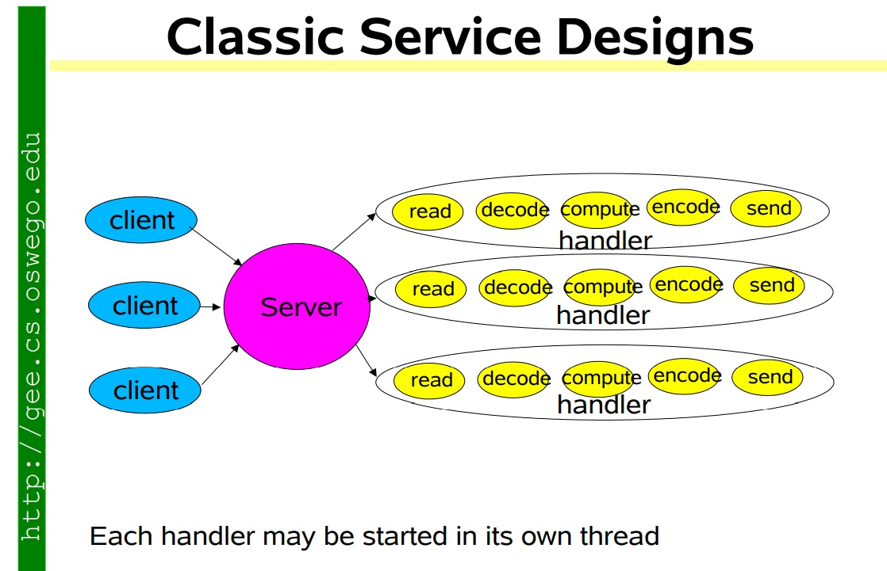
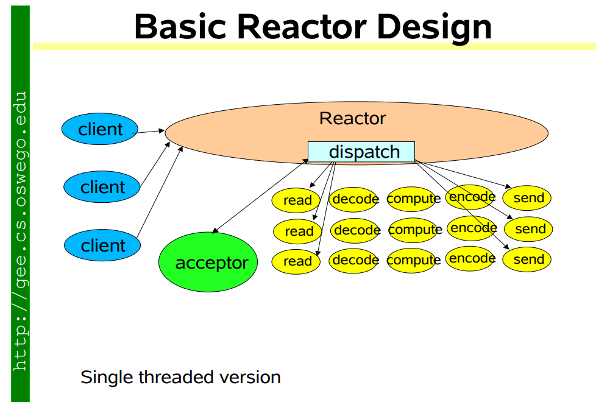
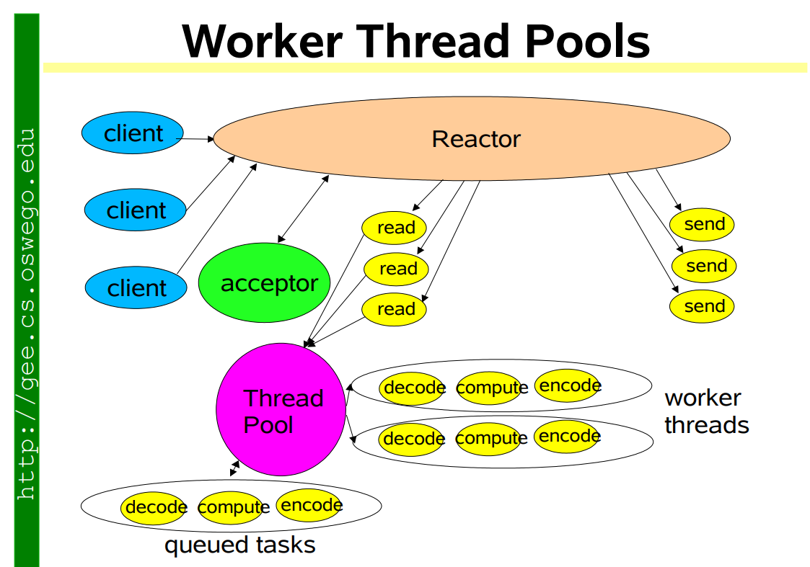

# 了解 Reactor 模式：基于线程和事件驱动

为了处理网络请求，有两种相互竞争的网络架构：基于线程的架构和事件驱动架构。

## 基于线程的架构

实现多线程服务器最直观的方法是遵循一个连接一个线程方法。它适用于需要避免使用线程以兼容非线程安全库的网站。

它还使用最佳的多处理模块来隔离每个请求，因此单个请求出现问题时不会影响其他请求。(文章图来自 https://blog.csdn.net/sinat_25295611/article/details/114339655)

进程太重，上下文切换较慢，内存消耗较大。因此，尽管使用线程编程容易出错且难以调试，但为了获得更好的可扩展性，我们采用了一个连接一个线程的方法。

为了调整线程数量以获得最佳整体性能并避免线程创建/销毁开销，通常的做法是在有界阻塞队列和线程池前放置一个单独的调度线程。调度线程在套接字上阻塞新连接，并将其提供给有界阻塞队列。超过队列限制的连接会被丢弃，但接受连接的延迟时间是可预测的。线程池会在队列中轮询传入的请求，然后对其进行处理和响应。

不幸的是，连接和线程之间总是一对一的关系。长连接（如 Keep-Alive 连接）会导致大量工作线程处于空闲等待状态，如文件系统访问、网络等。此外，数百甚至数千个并发线程会浪费大量内存堆栈空间。

## 事件驱动架构

事件驱动方法可将线程与连接分开，后者只使用线程处理特定回调或处理程序上的事件。

事件驱动架构由事件创建者和事件消费者组成。创建者是事件的源头，只知道事件已经发生。消费者是需要知道事件已发生的实体。它们可能参与处理事件，也可能仅仅受到事件的影响。

## Reactor 模式

Reactor 模式是事件驱动架构的一种实现技术。简单来说，它使用一个单线程事件循环来阻塞资源输出事件，并将其派发到相应的处理程序和回调程序。

只要为事件注册了处理程序和回调程序，就无需阻塞 I/O。事件指的是即将到来的新连接、读就绪、写就绪等实例。在多核环境中，这些处理程序/回调可以在多核环境中利用线程池。

这种模式将模块化应用级代码与可重用的 reactor 实现分离开来。

Reactor 模式的架构中有两个重要的参与者：

### 1. Reactor

Reactor 在单独的线程中运行，其工作是通过将工作分派给适当的**处理程序**来对 IO 事件做出响应。它就像公司里的电话接线员，负责接听客户来电，并将电话转接给相应的联系人。

### 2. 处理程序

处理程序执行 I/O 事件的实际工作，类似于客户希望与公司的实际负责人通话。

Reactor 通过派发适当的处理程序来响应 I/O 事件。处理程序执行非阻塞操作。

### Reactor 模式的目的

Reactor 架构模式允许事件驱动型应用程序对从一个或多个客户端发送到应用程序的服务请求进行**解复用(demultiplex)**和分派。

一个 reactor 将持续查找事件，并在事件触发后通知相应的事件处理程序进行处理。

**Reactor 模式是一种设计模式，用于在事件发生时同步解复用和排序。**

它接收来自多个并发客户端的消息、请求和连接，并使用事件处理程序按顺序处理这些帖子。Reactor 设计模式的目的是避免为每个消息、请求和连接创建一个线程的常见问题。然后，它从一组处理程序中接收事件，并按顺序将其分配给相应的事件处理程序。

[避免这个问题就是避免著名的问题：C10K。](http://www.kegel.com/c10k.html)

> 总结：服务器必须处理超过 10,000 个并发客户端，而线程无法使用 Tomcat、Glassfish、JBoss 或 HttpClient 扩展连接。

因此，使用 Reactor 的应用程序只需使用一个线程来处理同时发生的事件。

基本上，标准的 Reactor 模式允许一个主应用程序处理同时发生的事件，同时保持单线程的简单性。

解复用器是一个具有一个输入和多个输出的电路。当您希望将信号发送给多个设备之一时，可以使用解复用器。

这个描述听起来与解码器的描述相似，但解码器被用于在多个设备之间进行选择，而解复用器被用于在多个设备之间发送信号。

Reactor 允许使用单线程高效处理阻塞的多个任务。Reactor 还能管理一组事件处理程序。当调用它来执行任务时，它会连接到可用的处理程序，并将其设置为活动状态。

### 事件循环

1. 查找所有处于活动状态且已解锁的处理程序，或将其委托给调度程序实现。
2. 依次执行每个处理程序，直至完成或达到阻塞点。已完成的处理程序将被停用，事件循环得以继续。
3. 重复步骤 1

## 为什么 Reactor 重要？

因为 Node.js、Vert.x、Reactive Extensions、Jetty、Ngnix 等都使用了 Reactor 模式。所以如果你喜欢这种模式并且想要了解其背后的工作原理，关注这种模式是很重要的。