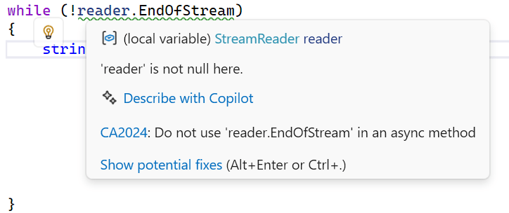

## JIT

在.NET的所有领域中，即时编译器（JIT）堪称最具影响力的组件之一。无论是小型控制台工具还是大型企业级服务，所有.NET应用程序最终都依赖JIT将中间语言(IL)代码转换为优化的机器代码。JIT生成的代码质量提升具有连锁效应，能在无需开发者修改代码甚至重新编译C#的情况下，全面提升整个生态系统的性能。而.NET 10版本中，此类性能优化可谓层出不穷。

## 去抽象化

与许多语言类似，.NET 历史上存在"抽象开销"——当使用接口、迭代器和委托等高级语言特性时，可能产生额外的内存分配和间接操作。每年，即时编译器（JIT）都在不断优化抽象层，使开发者能够编写简洁代码并获得卓越性能。.NET 10 延续了这一传统。其结果是：符合C#惯用的编程方式（使用接口、foreach循环、lambda表达式等）所编写的代码，其运行速度已逼近精心设计并手动调优的代码的原始速度。

### 对象栈分配

.NET 10 中最令人振奋的去抽象化进展之一，是通过扩展逃逸分析来实现对象的栈分配。逃逸分析是一种编译器技术，用于判断方法中分配的对象是否逃逸该方法——即确定该对象在方法返回后是否仍可被访问（例如存储在字段中或返回给调用方），或以运行时无法在方法内追踪的方式被使用（如传递给未知调用方）。若编译器能证明对象不存在逃逸，则该对象的生命周期仅限于方法内部，可直接在栈上分配而非堆上分配。栈分配成本更低（仅需指针递增分配，方法退出时自动释放），且能减轻垃圾回收压力——毕竟对象无需被垃圾回收器追踪。.NET 9已引入有限的逃逸分析与栈分配支持；.NET 10在此基础上实现了重大突破。

[dotnet/runtime#115172](https://github.com/dotnet/runtime/pull/115172) 教会 JIT 如何执行与委托相关的逃逸分析，特别是当委托的 Invoke 方法（由运行时实现）不会隐藏 this 引用时。若逃逸分析能证明委托的对象引用属于未逃逸的对象，该委托便可有效消失。请看这个基准测试：

```c#
// dotnet run -c Release -f net9.0 --filter "*" --runtimes net9.0 net10.0

using BenchmarkDotNet.Attributes;
using BenchmarkDotNet.Running;

BenchmarkSwitcher.FromAssembly(typeof(Tests).Assembly).Run(args);

[DisassemblyDiagnoser]
[MemoryDiagnoser(displayGenColumns: false)]
[HideColumns("Job", "Error", "StdDev", "Median", "RatioSD", "y")]
public partial class Tests
{
    [Benchmark]
    [Arguments(42)]
    public int Sum(int y)
    {
        Func<int, int> addY = x => x + y;
        return DoubleResult(addY, y);
    }

    private int DoubleResult(Func<int, int> func, int arg)
    {
        int result = func(arg);
        return result + result;
    }
}
```

如果我们直接运行这个基准测试并比较.NET 9和.NET 10，就能立刻发现有趣的变化正在发生。

| Method | Runtime   |      Mean | Ratio | Code Size | Allocated | Alloc Ratio |
| ------ | --------- | --------: | ----: | --------: | --------: | ----------: |
| Sum    | .NET 9.0  | 19.530 ns |  1.00 |     118 B |      88 B |        1.00 |
| Sum    | .NET 10.0 |  6.685 ns |  0.34 |      32 B |      24 B |        0.27 |

`Sum` 的 C# 代码背后隐藏着 C# 编译器的复杂代码生成过程。它需要创建一个 `Func<int, int>`，该函数会“闭包” `y` 这个局部变量。这意味着编译器需要将 y "提升" 为非实际局部变量，转而作为对象的字段存在；委托即可指向该对象上的方法，从而访问 `y`。以下是 C# 编译器生成的 IL 代码反编译为 C# 时的近似形态：

```c#
public int Sum(int y)
{
    <>c__DisplayClass0_0 c = new();
    c.y = y;

    Func<int, int> func = new(c.<Sum>b__0);

    return DoubleResult(func, c.y);
}

private sealed class <>c__DisplayClass0_0
{
    public int y;

    internal int <Sum>b__0(int x) => x + y;
}
```

由此可见，闭包导致了两次内存分配：一次是为`<>c__DisplayClass0_0`（C#编译器对这类闭包类型的称呼）分配内存，另一次是为指向该显示类实例上 `<Sum>b__0` 方法的委托分配内存。这正是.NET 9结果中88字节分配的来源：显示类占24字节，委托占64字节。但在.NET 10版本中，我们仅观察到24字节分配——这是因为JIT成功省略了委托分配。以下是生成的程序集代码：

```
; .NET 9
; Tests.Sum(Int32)
       push      rbp
       push      r15
       push      rbx
       lea       rbp,[rsp+10]
       mov       ebx,esi
       mov       rdi,offset MT_Tests+<>c__DisplayClass0_0
       call      CORINFO_HELP_NEWSFAST
       mov       r15,rax
       mov       [r15+8],ebx
       mov       rdi,offset MT_System.Func<System.Int32, System.Int32>
       call      CORINFO_HELP_NEWSFAST
       mov       rbx,rax
       lea       rdi,[rbx+8]
       mov       rsi,r15
       call      CORINFO_HELP_ASSIGN_REF
       mov       rax,offset Tests+<>c__DisplayClass0_0.<Sum>b__0(Int32)
       mov       [rbx+18],rax
       mov       esi,[r15+8]
       cmp       [rbx+18],rax
       jne       short M00_L01
       mov       rax,[rbx+8]
       add       esi,[rax+8]
       mov       eax,esi
M00_L00:
       add       eax,eax
       pop       rbx
       pop       r15
       pop       rbp
       ret
M00_L01:
       mov       rdi,[rbx+8]
       call      qword ptr [rbx+18]
       jmp       short M00_L00
; Total bytes of code 112

; .NET 10
; Tests.Sum(Int32)
       push      rbx
       mov       ebx,esi
       mov       rdi,offset MT_Tests+<>c__DisplayClass0_0
       call      CORINFO_HELP_NEWSFAST
       mov       [rax+8],ebx
       mov       eax,[rax+8]
       mov       ecx,eax
       add       eax,ecx
       add       eax,eax
       pop       rbx
       ret
; Total bytes of code 32
```

在.NET 9和.NET 10中，JIT都成功内联了 `DoubleResult`，使得委托不再逃逸，但到了.NET 10，它还能实现栈分配。太棒了！显然这里仍有优化空间，因为JIT并未省略闭包对象的分配操作，不过这应该能通过进一步努力解决，希望不久的将来就能实现。

由 @hez2010 提交的 [dotnet/runtime#104906](https://github.com/dotnet/runtime/pull/104906) 及 [dotnet/runtime#112250](https://github.com/dotnet/runtime/pull/112250) 提案，正致力于将此类分析与栈分配机制扩展至数组场景。你是否也曾多次编写过类似代码？

```c#
// dotnet run -c Release -f net9.0 --filter "*" --runtimes net9.0 net10.0

using BenchmarkDotNet.Attributes;
using BenchmarkDotNet.Running;
using System.Runtime.CompilerServices;

BenchmarkSwitcher.FromAssembly(typeof(Tests).Assembly).Run(args);

[MemoryDiagnoser(displayGenColumns: false)]
[HideColumns("Job", "Error", "StdDev", "Median", "RatioSD")]
public partial class Tests
{
    [Benchmark]
    public void Test()
    {
        Process(new string[] { "a", "b", "c" });

        static void Process(string[] inputs)
        {
            foreach (string input in inputs)
            {
                Use(input);
            }

            [MethodImpl(MethodImplOptions.NoInlining)]
            static void Use(string input) { }
        }
    }
}
```

我想调用的某个方法接受一个输入数组，并对每个输入执行操作。我需要分配一个数组来传递输入参数，无论是显式分配，还是通过 `params` 或集合表达式隐式分配。理想情况下，未来应提供此类 `Process` 方法的重载版本，使其接受 `ReadOnlySpan<string>` 而非 `string[]`，这样就能通过构造避免分配操作。但在所有必须创建数组的场景中，.NET 10提供了解决方案。

| Method | Runtime   |      Mean | Ratio | Allocated | Alloc Ratio |
| ------ | --------- | --------: | ----: | --------: | ----------: |
| Test   | .NET 9.0  | 11.580 ns |  1.00 |      48 B |        1.00 |
| Test   | .NET 10.0 |  3.960 ns |  0.34 |         – |        0.00 |

即时编译器能够内联 `Process` 函数，发现该数组从未离开调用栈帧，因此将其进行栈分配。

既然现已支持数组的栈分配，我们还需处理数组的常见使用方式：通过 `Span` 进行访问。[dotnet/runtime#113977](https://github.com/dotnet/runtime/pull/113977) 和 [dotnet/runtime#116124](https://github.com/dotnet/runtime/pull/116124) 通过逃逸分析扩展了对结构体字段的推理能力，其中包含 `Span<T>` 类型——毕竟它"本质上"就是存储 `ref T` 字段和 `int` 长度字段的结构体。

```c#
// dotnet run -c Release -f net9.0 --filter "*" --runtimes net9.0 net10.0

using BenchmarkDotNet.Attributes;
using BenchmarkDotNet.Running;
using System.Runtime.CompilerServices;

BenchmarkSwitcher.FromAssembly(typeof(Tests).Assembly).Run(args);

[MemoryDiagnoser(displayGenColumns: false)]
[HideColumns("Job", "Error", "StdDev", "Median", "RatioSD")]
public partial class Tests
{
    private byte[] _buffer = new byte[3];

    [Benchmark]
    public void Test() => Copy3Bytes(0x12345678, _buffer);

    [MethodImpl(MethodImplOptions.NoInlining)]
    private static void Copy3Bytes(int value, Span<byte> dest) =>
        BitConverter.GetBytes(value).AsSpan(0, 3).CopyTo(dest);
}
```

在此，我们使用了 `BitConverter.GetBytes` 方法，该方法会分配一个包含输入字节的 `byte[]` 数组（本例中，对于整型数据将生成一个四字节数组），随后从中截取三个字节，并将它们复制到目标 `span` 中。

| Method | Runtime   |      Mean | Ratio | Allocated | Alloc Ratio |
| ------ | --------- | --------: | ----: | --------: | ----------: |
| Test   | .NET 9.0  | 9.7717 ns |  1.04 |      32 B |        1.00 |
| Test   | .NET 10.0 | 0.8718 ns |  0.09 |         – |        0.00 |

在 .NET 9 中，我们获得了预期中 `GetBytes` 方法中 `byte[]` 的 32 字节分配（64 位系统上每个对象至少占用 24 字节，其中包含数组长度的 4 字节，数据部分的 4 字节位于第 24-27 个存储单元，大小会被补足至下一个字边界，从而达到 32 字节）。在 .NET 10 中，由于 `GetBytes` 和 `AsSpan` 被内联，JIT 能够识别该数组不逃逸特性，因此可使用栈分配版本为 `span` 提供初始值——这与通过其他栈分配方式（如 `stackalloc`）创建数组完全相同。（此案例还受益于[dotnet/runtime#113093](https://github.com/dotnet/runtime/pull/113093)的改进，该改进使JIT理解到某些 `span` 操作——如 `CopyTo` 内部使用的 `Memmove`——属于非逃逸操作。）

当然，以下是对您提供的英文技术文章的完整中文翻译：

------

### 去虚拟化（Devirtualization）

接口和虚方法是 .NET 的核心特性之一，也是它能够实现各种抽象能力的关键。而能够“解开”这些抽象、进行所谓的“去虚拟化”（Devirtualization），则是 JIT（即时编译器）的一项重要工作。在 .NET 10 中，JIT 在这方面的能力有了显著的提升。

虽然数组是 C# 和 .NET 提供的最基础、最核心的特性之一，而且 JIT 也在很多方面对数组做了大量优化工作，但有一个领域却一直让它头疼：**数组对接口的实现方式**。运行时为 `T[]`（泛型数组类型）动态生成了一系列接口的实现，但这些接口实现的方式与 .NET 中几乎所有其他接口实现都不同，因此 JIT 一直无法对其应用与其他地方相同的去虚拟化优化手段。而对于深入做过微基准测试的人来说，这可能会导致一些令人意外的观察结果。下面是一个性能对比：使用 `foreach`循环（通过枚举器）遍历一个 `ReadOnlyCollection<T>`，和使用 `for`循环（通过索引访问每个元素）之间的性能差异。

```c#
// dotnet run -c Release -f net9.0 --filter "*"
// dotnet run -c Release -f net9.0 --filter "*" --runtimes net9.0 net10.0

using BenchmarkDotNet.Attributes;
using BenchmarkDotNet.Running;
using System.Collections.ObjectModel;

BenchmarkSwitcher.FromAssembly(typeof(Tests).Assembly).Run(args);

[HideColumns("Job", "Error", "StdDev", "Median", "RatioSD")]
public partial class Tests
{
    private ReadOnlyCollection<int> _list = new(Enumerable.Range(1, 1000).ToArray());

    [Benchmark]
    public int SumEnumerable()
    {
        int sum = 0;
        foreach (var item in _list)
        {
            sum += item;
        }
        return sum;
    }

    [Benchmark]
    public int SumForLoop()
    {
        ReadOnlyCollection<int> list = _list;
        int sum = 0;
        int count = list.Count;
        for (int i = 0; i < count; i++)
        {
            sum += _list[i];
        }
        return sum;
    }
}
```

当被问到“哪一种方式会更快”时，大家的直观答案通常是：“`SumForLoop`（即 for 循环）会更快”。毕竟，`SumEnumerable`（即 foreach 循环）需要分配一个枚举器，并且每迭代一次需要进行两次接口调用（`MoveNext`+ `Current`），而 for 循环只需要一次索引访问（`this[int]`）。但事实证明，这个直观的答案竟然是**错误的**。下面是我机器上在 .NET 9 上跑出的时间数据：

| Method        |       Mean |
| ------------- | ---------: |
| SumEnumerable |   949.5 ns |
| SumForLoop    | 1,932.7 ns |

等等，什么？？？不过，如果我们将 `ToArray()`换成 `ToList()`，那么两者的性能数字就会更符合我们的预期了。

| Method        |       Mean |
| ------------- | ---------: |
| SumEnumerable | 1,542.0 ns |
| SumForLoop    |   894.1 ns |

那么，这到底是怎么回事呢？其实原因非常微妙。

首先，我们需要知道的是，`ReadOnlyCollection<T>`只是包装了一个任意的 `IList<T>`。其 `GetEnumerator()`方法返回的是 `_list.GetEnumerator()`（这里我们暂时忽略列表为空的特殊情况）。而它的索引器 `this[int index]`实际上就是直接调用底层 `IList<T>`的索引器。到目前为止，这一切听起来都应该是你预期的那样。但真正有趣的地方在于：**JIT 对 T[]（数组类型）的接口方法实现，难以进行去虚拟化**。在 .NET 9 中，JIT **无法对数组的接口方法调用进行去虚拟化**，这就导致它既不能对 `_list.GetEnumerator()`进行去虚拟化，也不能对 `_list[index]`（即索引访问）进行去虚拟化。

然而，返回的枚举器本身是一个普通类型，实现了 `IEnumerator<T>`接口，而 JIT **可以轻松地对它的 `MoveNext`和 `Current`成员进行去虚拟化**。

这意味着什么呢？实际上，通过索引器进行遍历时，我们为每个元素都要做一次接口调用（即 N 次），而通过枚举器进行遍历时，我们只需要一次 `GetEnumerator`的接口调用，之后就不再需要任何接口调用。

因此，在 .NET 9 中，使用 `for`循环（依赖索引访问）实际上比使用 `foreach`（依赖枚举器）**更慢**，这是很多人都没有预料到的。

好消息是，这个问题在 .NET 10 中得到了解决！相关改进包括：

- [dotnet/runtime#108153](https://github.com/dotnet/runtime/pull/108153)
- [dotnet/runtime#109209](https://github.com/dotnet/runtime/pull/109209)
- [dotnet/runtime#109237](https://github.com/dotnet/runtime/pull/109237)
- [dotnet/runtime#116771](https://github.com/dotnet/runtime/pull/116771)

这些改动让 JIT 终于可以对数组的接口方法实现进行去虚拟化了。当我们重新运行同样的基准测试（改回使用 `ToArray()`），结果就变得符合我们的预期了：两个基准测试在 .NET 10 中都有所提升，其中 `SumForLoop`（for 循环）成为了最快的那个。

| Method        | Runtime   |       Mean | Ratio |
| ------------- | --------- | ---------: | ----: |
| SumEnumerable | .NET 9.0  |   968.5 ns |  1.00 |
| SumEnumerable | .NET 10.0 |   775.5 ns |  0.80 |
|               |           |            |       |
| SumForLoop    | .NET 9.0  | 1,960.5 ns |  1.00 |
| SumForLoop    | .NET 10.0 |   624.6 ns |  0.32 |

这个案例特别有意思的一点是：**很多库的实现都基于这样一个假设——通过 `IList<T>`的索引器进行遍历，比通过 `IEnumerable<T>`的枚举器进行遍历要更快**。而 .NET 自带的 `System.Linq`就是这么做的：它为 `IList<T>`提供了专门优化的代码路径，以提升性能。

然而，在很多情况下（比如当实际的底层类型是 `ReadOnlyCollection<T>`时），这种“优化”实际上反而导致了性能下降。也就是说，多年以来，LINQ 中那些针对 `IList<T>`的特殊优化，在某些场景下非但没有起到加速作用，反而是帮了倒忙。

```c#
// dotnet run -c Release -f net9.0 --filter "*" --runtimes net9.0 net10.0

using BenchmarkDotNet.Attributes;
using BenchmarkDotNet.Running;
using System.Collections.ObjectModel;

BenchmarkSwitcher.FromAssembly(typeof(Tests).Assembly).Run(args);

[HideColumns("Job", "Error", "StdDev", "Median", "RatioSD")]
public partial class Tests
{
    private ReadOnlyCollection<int> _list = new(Enumerable.Range(1, 1000).ToArray());

    [Benchmark]
    public int SkipTakeSum() => _list.Skip(100).Take(800).Sum();
}
```

| Method      | Runtime   |     Mean | Ratio |
| ----------- | --------- | -------: | ----: |
| SkipTakeSum | .NET 9.0  | 3.525 us |  1.00 |
| SkipTakeSum | .NET 10.0 | 1.773 us |  0.50 |

而现在，修复了数组接口方法的去虚拟化问题，也间接地优化了 LINQ 的表现。

除了数组接口的去虚拟化外，.NET 10 还进一步改进了“受保护去虚拟化”（Guarded Devirtualization，简称 GDV）的能力，相关提交包括：

- [dotnet/runtime#116453](https://github.com/dotnet/runtime/pull/116453)
- [dotnet/runtime#109256](https://github.com/dotnet/runtime/pull/109256)

借助动态 PGO（Profile-Guided Optimization，基于性能分析数据的优化），JIT 能够在编译方法时插入检测代码，收集运行时的实际类型信息，然后利用这些数据来生成优化后的代码。

其中一个它可以收集的信息就是：**哪些类型在某个虚方法调用中占主导地位**。如果发现某一个类型的使用频率非常高，JIT 就可以专门为该类型生成一段定制化的代码路径，并在该路径上进行去虚拟化。这个过程是通过在代码中插入一个类型检查（type check）来“保护”这段特化代码的，因此称为“受保护去虚拟化”（GDV）。

但之前存在一个问题：**如果虚方法调用发生在共享的泛型上下文中（shared generic context），GDV 是不会触发的**。现在这个问题已经得到解决，GDV 也能在这些情况下生效了。

```c#
// dotnet run -c Release -f net9.0 --filter "*" --runtimes net9.0 net10.0

using BenchmarkDotNet.Attributes;
using BenchmarkDotNet.Running;
using System.Runtime.CompilerServices;

BenchmarkSwitcher.FromAssembly(typeof(Tests).Assembly).Run(args);

[HideColumns("Job", "Error", "StdDev", "Median", "RatioSD")]
public partial class Tests
{
    [Benchmark]
    public bool Test() => GenericEquals("abc", "abc");

    [MethodImpl(MethodImplOptions.NoInlining)]
    private static bool GenericEquals<T>(T a, T b) => EqualityComparer<T>.Default.Equals(a, b);
}
```

| Method | Runtime   |     Mean | Ratio |
| ------ | --------- | -------: | ----: |
| Test   | .NET 9.0  | 2.816 ns |  1.00 |
| Test   | .NET 10.0 | 1.511 ns |  0.54 |

另外，来自开发者 hez2010 的提交 [dotnet/runtime#110827](https://github.com/dotnet/runtime/pull/110827) 也带来了一项优化：在去虚拟化等优化阶段完成后，JIT 会再额外进行一轮内联机会的查找，从而发现更多可以内联的方法。

JIT 的优化是分多个阶段进行的，每个阶段都可能对代码做出改进，而这些改进又可能会暴露出新的优化机会。但有些优化机会，只有在后续阶段才能识别和利用。如果那些阶段已经执行过了，这些新暴露的机会就可能被错过了。

但对于一些成本比较低的优化阶段，比如“查找可以内联的方法”这一类操作，JIT 现在会在合适的时机**重新执行一遍**，以便捕捉到那些因前期优化而新暴露出来的内联机会，从而进一步提升性能。

## 边界检查

C# 是一种内存安全的语言，这是现代编程语言中一个重要的特性。其关键组成部分之一就是无法越界访问数组、字符串或 Span 的开头或结尾。运行时确保任何此类无效的访问尝试都会抛出异常，而不是允许执行非法的内存访问。我们可以通过一个小型的基准测试来观察这一机制的实际表现：

```c#
// dotnet run -c Release -f net10.0 --filter "*"

using BenchmarkDotNet.Attributes;
using BenchmarkDotNet.Running;

BenchmarkSwitcher.FromAssembly(typeof(Tests).Assembly).Run(args);

[DisassemblyDiagnoser]
[HideColumns("Job", "Error", "StdDev", "Median", "RatioSD")]
public partial class Tests
{
    private int[] _array = new int[3];

    [Benchmark]
    public int Read() => _array[2];
}
```

这是一个有效的访问：`_array` 包含三个元素，而 `Read` 方法读取的是它的最后一个元素。然而，JIT 编译器不能 100% 确定这个访问是在边界内的（比如 `_array` 字段可能被修改为指向一个更短的数组），因此它需要插入一个检查以确保我们没有越界访问数组。下面是 `Read` 方法生成的汇编代码：

```assembly
; .NET 10
; Tests.Read()
       push      rax
       mov       rax,[rdi+8]
       cmp       dword ptr [rax+8],2
       jbe       short M00_L00
       mov       eax,[rax+18]
       add       rsp,8
       ret
M00_L00:
       call      CORINFO_HELP_RNGCHKFAIL
       int       3
; Total bytes of code 25
```

`this` 引用在实例方法 `Read` 中通过 `rdi` 寄存器传入，而 `_array` 字段位于偏移量 8 处，所以 `mov rax,[rdi+8]` 指令是将数组的地址加载到 `rax` 寄存器中。然后 `cmp` 指令从该地址偏移 8 的位置加载值；恰好在数组对象中，数组的长度就存储在这个偏移处。因此，这条 `cmp` 指令就是边界检查；它将 2（我们要访问的索引）与数组的长度进行比较，以确保访问在合法范围内。如果数组长度不足以支持这次访问，那么接下来的 jbe 指令就会跳转到 `M00_L00` 标签，调用 `CORINFO_HELP_RNGCHKFAIL` 这个辅助函数，从而抛出一个 `IndexOutOfRangeException`。每当你在某个方法的末尾看到 `call CORINFO_HELP_RNGCHKFAIL / int 3` 这一对指令时，就说明该方法的代码中至少有一个由 JIT 生成的边界检查。

当然，我们不仅追求安全性，也追求卓越的性能。如果每次从数组（或字符串、Span）中读取数据都要附带这样一个额外的检查，那对性能的影响将是灾难性的。因此，JIT 尽力在可以证明访问安全、冗余的情况下避免生成这些检查。例如，让我稍微调整一下我的基准测试，将数组从一个实例字段移动到一个静态只读字段中：

```c#
// dotnet run -c Release -f net10.0 --filter "*"

using BenchmarkDotNet.Attributes;
using BenchmarkDotNet.Running;

BenchmarkSwitcher.FromAssembly(typeof(Tests).Assembly).Run(args);

[DisassemblyDiagnoser]
[HideColumns("Job", "Error", "StdDev", "Median", "RatioSD")]
public partial class Tests
{
    private static readonly int[] s_array = new int[3];

    [Benchmark]
    public int Read() => s_array[2];
}
```

现在我们得到的汇编代码是这样的：

```assembly
; .NET 10
; Tests.Read()
       mov       rax,705D5419FA20
       mov       eax,[rax+18]
       ret
; Total bytes of code 14
```

静态只读字段是不可变的，数组本身也无法调整大小，并且 JIT 可以保证该字段在生成 Read 方法的代码之前已经被初始化。因此，在生成 `Read` 方法的代码时，它可以确定数组的长度为 3，并且我们正在访问索引为 2 的元素。因此，所指定的数组索引保证在边界内，也就没有必要进行边界检查了。我们只需要两个 `mov` 指令：第一个 `mov` 用于加载数组的地址（得益于先前版本中的改进，该数组被分配在一个不需要压缩的堆上，因此数组始终位于固定地址），第二个 mov 用于读取索引为 2 的整数值（这些是整数，所以索引 2 的位置距离数组数据的起始位置为 2 * sizeof(int) = 8 个字节，而在 64 位系统上，数组引用本身的数据起始位置偏移为 16 个字节，因此总偏移量为 24 个字节，即十六进制的 0x18，因此在反汇编中我们看到了 rax+18）。

每一个版本的 .NET 都会发现并实现越来越多的机会，以消除以前会生成的边界检查。.NET 10 也延续了这一趋势。

我们的第一个例子来自 [dotnet/runtime#109900](https://github.com/dotnet/runtime/pull/109900)，该优化灵感来自于 BitOperations.Log2 的实现。该操作在许多架构上都有硬件内建指令支持，通常 `BitOperations.Log2` 会使用其中一个可用的硬件内建指令来实现非常高效的计算（例如 `Lscnt.LeadingZeroCount`、`ArmBase.LeadingZeroCount` 或 `X86Base.BitScanReverse`）。然而作为回退实现，它使用了一个查找表。该查找表包含 32 个元素，该操作会计算一个 uint 值，然后将其右移 27 位以获取最高 5 位。任何可能的计算结果都保证是一个非负数且小于 32，但使用该结果索引 Span 时仍然会产生一个边界检查。而且由于这是一个关键路径，“不安全”的代码（即绕过运行时默认提供的安全机制的代码）曾被用来避免这个边界检查。

```c#
// dotnet run -c Release -f net9.0 --filter "*" --runtimes net9.0 net10.0

using BenchmarkDotNet.Attributes;
using BenchmarkDotNet.Running;

BenchmarkSwitcher.FromAssembly(typeof(Tests).Assembly).Run(args);

[DisassemblyDiagnoser]
[HideColumns("Job", "Error", "StdDev", "Median", "RatioSD", "value")]
public partial class Tests
{
    [Benchmark]
    [Arguments(42)]
    public int Log2SoftwareFallback2(uint value)
    {
        ReadOnlySpan<byte> Log2DeBruijn =
        [
            00, 09, 01, 10, 13, 21, 02, 29,
            11, 14, 16, 18, 22, 25, 03, 30,
            08, 12, 20, 28, 15, 17, 24, 07,
            19, 27, 23, 06, 26, 05, 04, 31
        ];

        value |= value >> 01;
        value |= value >> 02;
        value |= value >> 04;
        value |= value >> 08;
        value |= value >> 16;

        return Log2DeBruijn[(int)((value * 0x07C4ACDDu) >> 27)];
    }
}
```

现在在 .NET 10 中，这个边界检查已经消失了（注意在 .NET 9 的汇编中存在 `call CORINFO_HELP_RNGCHKFAIL`，而在 .NET 10 的汇编中则不存在）。

```assembly
; .NET 9
; Tests.Log2SoftwareFallback2(UInt32)
       push      rax
       mov       eax,esi
       shr       eax,1
       or        esi,eax
       mov       eax,esi
       shr       eax,2
       or        esi,eax
       mov       eax,esi
       shr       eax,4
       or        esi,eax
       mov       eax,esi
       shr       eax,8
       or        esi,eax
       mov       eax,esi
       shr       eax,10
       or        eax,esi
       imul      eax,7C4ACDD
       shr       eax,1B
       cmp       eax,20
       jae       short M00_L00
       mov       rcx,7913CA812E10
       movzx     eax,byte ptr [rax+rcx]
       add       rsp,8
       ret
M00_L00:
       call      CORINFO_HELP_RNGCHKFAIL
       int       3
; Total bytes of code 74

; .NET 10
; Tests.Log2SoftwareFallback2(UInt32)
       mov       eax,esi
       shr       eax,1
       or        esi,eax
       mov       eax,esi
       shr       eax,2
       or        esi,eax
       mov       eax,esi
       shr       eax,4
       or        esi,eax
       mov       eax,esi
       shr       eax,8
       or        esi,eax
       mov       eax,esi
       shr       eax,10
       or        eax,esi
       imul      eax,7C4ACDD
       shr       eax,1B
       mov       rcx,7CA298325E10
       movzx     eax,byte ptr [rcx+rax]
       ret
; Total bytes of code 58
```

这一改进随后又使得 [dotnet/runtime#118560](https://github.com/dotnet/runtime/pull/118560) 能够简化真正的 `Log2SoftwareFallback` 中的代码，避免了手动使用不安全构造。

[dotnet/runtime#113790](https://github.com/dotnet/runtime/pull/113790) 实现了类似的场景，其中数学运算的结果被保证在边界内。在这个例子中，它是 `Log2` 的结果。该更改教会了 JIT 理解 `Log2` 可能产生的最大值，如果该最大值在边界内，那么任何结果也必然在边界内。

```c#
// dotnet run -c Release -f net9.0 --filter "*" --runtimes net9.0 net10.0

using BenchmarkDotNet.Attributes;
using BenchmarkDotNet.Running;

BenchmarkSwitcher.FromAssembly(typeof(Tests).Assembly).Run(args);

[DisassemblyDiagnoser]
[HideColumns("Job", "Error", "StdDev", "Median", "RatioSD", "value")]
public partial class Tests
{
    [Benchmark]
    [Arguments(12345)]
    public nint CountDigits(ulong value)
    {
        ReadOnlySpan<byte> log2ToPow10 =
        [
            1,  1,  1,  2,  2,  2,  3,  3,  3,  4,  4,  4,  4,  5,  5,  5,
            6,  6,  6,  7,  7,  7,  7,  8,  8,  8,  9,  9,  9,  10, 10, 10,
            10, 11, 11, 11, 12, 12, 12, 13, 13, 13, 13, 14, 14, 14, 15, 15,
            15, 16, 16, 16, 16, 17, 17, 17, 18, 18, 18, 19, 19, 19, 19, 20
        ];

        return log2ToPow10[(int)ulong.Log2(value)];
    }
}
```

我们可以看到在 .NET 9 的输出中存在边界检查，而在 .NET 10 的输出中则不存在：

```assembly
; .NET 9
; Tests.CountDigits(UInt64)
       push      rax
       or        rsi,1
       xor       eax,eax
       lzcnt     rax,rsi
       xor       eax,3F
       cmp       eax,40
       jae       short M00_L00
       mov       rcx,7C2D0A213DF8
       movzx     eax,byte ptr [rax+rcx]
       add       rsp,8
       ret
M00_L00:
       call      CORINFO_HELP_RNGCHKFAIL
       int       3
; Total bytes of code 45

; .NET 10
; Tests.CountDigits(UInt64)
       or        rsi,1
       xor       eax,eax
       lzcnt     rax,rsi
       xor       eax,3F
       mov       rcx,71EFA9400DF8
       movzx     eax,byte ptr [rcx+rax]
       ret
; Total bytes of code 29
```

我选择这个基准测试并非巧合。这种模式出现在 `FormattingHelpers.CountDigits` 内部方法中，该方法被核心基元类型在其 `ToString` 和 `TryFormat` 实现中使用，以确定渲染数字所需的存储空间大小。与前面的例子一样，这个例程被认为是足够核心的，以至于它曾使用不安全代码来避免边界检查。有了这个修复之后，代码得以改回使用简单的 `Span` 访问，而且即使代码变得更简单，它现在也变得更快了。

现在，考虑以下代码：

```c#
// dotnet run -c Release -f net9.0 --filter "*" --runtimes net9.0 net10.0

using BenchmarkDotNet.Attributes;
using BenchmarkDotNet.Running;

BenchmarkSwitcher.FromAssembly(typeof(Tests).Assembly).Run(args);

[DisassemblyDiagnoser]
[HideColumns("Job", "Error", "StdDev", "Median", "RatioSD", "ids")]
public partial class Tests
{
    public IEnumerable<int[]> Ids { get; } = [[1, 2, 3, 4, 5, 1]];

    [Benchmark]
    [ArgumentsSource(nameof(Ids))]
    public bool StartAndEndAreSame(int[] ids) => ids[0] == ids[^1];
}
```

我有一个方法，它接收一个 `int[]` 数组，并检查该数组是否以相同的值开头和结尾。JIT 无法知道该 `int[]` 是否为空，因此它确实需要进行边界检查；否则，访问 `ids[0]` 可能会越界访问数组。然而，这是在 .NET 9 上我们所看到的：

```assembly
; .NET 9
; Tests.StartAndEndAreSame(Int32[])
       push      rax
       mov       eax,[rsi+8]
       test      eax,eax
       je        short M00_L00
       mov       ecx,[rsi+10]
       lea       edx,[rax-1]
       cmp       edx,eax
       jae       short M00_L00
       mov       eax,edx
       cmp       ecx,[rsi+rax*4+10]
       sete      al
       movzx     eax,al
       add       rsp,8
       ret
M00_L00:
       call      CORINFO_HELP_RNGCHKFAIL
       int       3
; Total bytes of code 41
```

注意这里有两个跳转到处理失败边界检查的 `M00_L00` 标签……这是因为这里有两个边界检查，一个是对起始元素的访问，一个是对末尾元素的访问。但这其实是不必要的。`ids` 等同于 `ids[ids.Length - 1]`。如果代码已经成功访问了 `ids[0]`，那就意味着该数组至少有一个元素，而如果数组至少有一个元素，那么 `ids[ids.Length - 1]` 就一定是在边界内的。因此，第二个边界检查就不应该需要了。实际上，多亏了 [dotnet/runtime#116105](https://github.com/dotnet/runtime/pull/116105)，这正是我们在 .NET 10 上所得到的结果（只有一个跳转到 `M00_L00`，而不是两个）：

真正让我感兴趣的是，移除这个边界检查带来的连锁效应。它不仅仅消除了典型的边界检查所包含的 `cmp/jae` 指令对。在 .NET 9 版本的代码中，我们看到如下内容：

```assembly
lea edx,[rax-1]
cmp edx,eax
jae short M00_L00
mov eax,edx
```

此时，`rax` 寄存器保存着数组的长度。它正在计算 `ids.Length - 1` 并将结果存储到 `edx` 中，然后检查 `ids.Length-1` 是否在 `ids.Length` 的边界内（唯一不可能的情况是数组为空，导致 `ids.Length-1` 回绕为 `uint.MaxValue`）；如果不在边界内，就跳转到失败处理程序，如果在边界内，就将已经计算好的 `ids.Length - 1` 存储到 `eax` 中。通过移除边界检查，我们去掉了这两个中间指令，得到了如下代码：

```assembly
lea edx,[rax-1]
mov eax,edx
```

这看起来有点傻，因为这个指令序列仅仅是在做一次递减操作，而且只要允许修改标志寄存器，它其实可以直接写成：

```assembly
dec eax
```

而正如下图 .NET 10 的输出中所示，这正是 .NET 10 现在所做的。

[dotnet/runtime#115980](https://github.com/dotnet/runtime/pull/115980#115980) 则解决了另外一个案例。假设我有如下方法：

```c#
// dotnet run -c Release -f net9.0 --filter "*" --runtimes net9.0 net10.0

using BenchmarkDotNet.Attributes;
using BenchmarkDotNet.Running;

BenchmarkSwitcher.FromAssembly(typeof(Tests).Assembly).Run(args);

[DisassemblyDiagnoser]
[HideColumns("Job", "Error", "StdDev", "Median", "RatioSD", "start", "text")]
public partial class Tests
{
    [Benchmark]
    [Arguments("abc", "abc.")]
    public bool IsFollowedByPeriod(string start, string text) =>
        start.Length < text.Length && text[start.Length] == '.';
}
```

我们正在验证一个输入的长度是否小于另一个输入的长度，然后检查另一个输入中紧随其后的内容。我们知道 `string.Length` 是不可变的，因此这里的边界检查是多余的，但在 .NET 10 之前，JIT 编译器无法识别这一点。

```assembly
; .NET 9
; Tests.IsFollowedByPeriod(System.String, System.String)
       push      rbp
       mov       rbp,rsp
       mov       eax,[rsi+8]
       mov       ecx,[rdx+8]
       cmp       eax,ecx
       jge       short M00_L00
       cmp       eax,ecx
       jae       short M00_L01
       cmp       word ptr [rdx+rax*2+0C],2E
       sete      al
       movzx     eax,al
       pop       rbp
       ret
M00_L00:
       xor       eax,eax
       pop       rbp
       ret
M00_L01:
       call      CORINFO_HELP_RNGCHKFAIL
       int       3
; Total bytes of code 42

; .NET 10
; Tests.IsFollowedByPeriod(System.String, System.String)
       mov       eax,[rsi+8]
       mov       ecx,[rdx+8]
       cmp       eax,ecx
       jge       short M00_L00
       cmp       word ptr [rdx+rax*2+0C],2E
       sete      al
       movzx     eax,al
       ret
M00_L00:
       xor       eax,eax
       ret
; Total bytes of code 26
```

移除这个边界检查几乎将该函数的体积减少了一半。如果我们不需要进行边界检查，就可以省略 `cmp/jae` 指令对。没有了这个分支，就没有什么代码会跳转到 `M00_L01`，于是我们也就可以移除仅为了支持边界检查而存在的 `call/int` 对。而由于 `M00_L01` 中的 call 是整个方法中唯一的调用，没有了这个调用，方法的序言（prologue）和结尾（epilogue）也可以省略，这意味着我们同样不再需要开头的 push 和结尾的 pop 指令。

[dotnet/runtime#113233](https://github.com/dotnet/runtime/pull/113233) 改进了对“断言”（assertions，即 JIT 所声明并基于其进行优化的已知事实）的处理，使其对顺序的依赖性更低。在 .NET 9 中，以下代码：

```c#
static bool Test(ReadOnlySpan<char> span, int pos) =>
    pos > 0 &&
    pos <= span.Length - 42 &&
    span[pos - 1] != '\n';
```

成功地移除了对 Span 访问的边界检查，但下面这个变体——只是将前两个条件的顺序调换了一下——却仍然产生了边界检查。

```c#
static bool Test(ReadOnlySpan<char> span, int pos) =>
    pos <= span.Length - 42 &&
    pos > 0 &&
    span[pos - 1] != '\n';
```

注意，这两个条件都贡献了一个断言（即一个已知的事实），而这些断言需要被合并起来，才能知道可以避免边界检查。现在在 .NET 10 中，无论条件的顺序如何，边界检查都会被省略。

```c#
// dotnet run -c Release -f net9.0 --filter "*" --runtimes net9.0 net10.0

using BenchmarkDotNet.Attributes;
using BenchmarkDotNet.Running;

BenchmarkSwitcher.FromAssembly(typeof(Tests).Assembly).Run(args);

[DisassemblyDiagnoser]
[HideColumns("Job", "Error", "StdDev", "Median", "RatioSD")]
public partial class Tests
{
    private string _s = new string('s', 100);
    private int _pos = 10;

    [Benchmark]
    public bool Test()
    {
        string s = _s;
        int pos = _pos;
        return
            pos <= s.Length - 42 &&
            pos > 0 &&
            s[pos - 1] != '\n';
    }
}
```

```assembly
; .NET 9
; Tests.Test()
       push      rbp
       mov       rbp,rsp
       mov       rax,[rdi+8]
       mov       ecx,[rdi+10]
       mov       edx,[rax+8]
       lea       edi,[rdx-2A]
       cmp       edi,ecx
       jl        short M00_L00
       test      ecx,ecx
       jle       short M00_L00
       dec       ecx
       cmp       ecx,edx
       jae       short M00_L01
       cmp       word ptr [rax+rcx*2+0C],0A
       setne     al
       movzx     eax,al
       pop       rbp
       ret
M00_L00:
       xor       eax,eax
       pop       rbp
       ret
M00_L01:
       call      CORINFO_HELP_RNGCHKFAIL
       int       3
; Total bytes of code 55

; .NET 10
; Tests.Test()
       push      rbp
       mov       rbp,rsp
       mov       rax,[rdi+8]
       mov       ecx,[rdi+10]
       mov       edx,[rax+8]
       add       edx,0FFFFFFD6
       cmp       edx,ecx
       jl        short M00_L00
       test      ecx,ecx
       jle       short M00_L00
       dec       ecx
       cmp       word ptr [rax+rcx*2+0C],0A
       setne     al
       movzx     eax,al
       pop       rbp
       ret
M00_L00:
       xor       eax,eax
       pop       rbp
       ret
; Total bytes of code 45
```

[dotnet/runtime#113862](https://github.com/dotnet/runtime/pull/113862) 解决了一个类似的场景，其中断言没有被处理得如它们本应那样精确。考虑以下代码：

```c#
// dotnet run -c Release -f net9.0 --filter "*" --runtimes net9.0 net10.0

using BenchmarkDotNet.Attributes;
using BenchmarkDotNet.Running;

BenchmarkSwitcher.FromAssembly(typeof(Tests).Assembly).Run(args);

[DisassemblyDiagnoser]
[MemoryDiagnoser(displayGenColumns: false)]
[HideColumns("Job", "Error", "StdDev", "Median", "RatioSD")]
public partial class Tests
{
    private int[] _arr = Enumerable.Range(0, 10).ToArray();

    [Benchmark]
    public int Sum()
    {
        int[] arr = _arr;
        int sum = 0;

        int i;
        for (i = 0; i < arr.Length - 3; i += 4)
        {
            sum += arr[i + 0];
            sum += arr[i + 1];
            sum += arr[i + 2];
            sum += arr[i + 3];
        }

        for (; i < arr.Length; i++)
        {
            sum += arr[i];
        }

        return sum;
    }
}
```

`Sum` 方法尝试进行手动循环展开。它不是对每个元素都进行分支判断，而是每次迭代处理四个元素。然后，对于输入长度不能被四整除的剩余部分，它在单独的循环中处理。在 .NET 9 中，JIT 成功地省略了主展开循环中的边界检查：

```assembly
; .NET 9
; Tests.Sum()
       push      rbp
       mov       rbp,rsp
       mov       rax,[rdi+8]
       xor       ecx,ecx
       xor       edx,edx
       mov       edi,[rax+8]
       lea       esi,[rdi-3]
       test      esi,esi
       jle       short M00_L02
M00_L00:
       mov       r8d,edx
       add       ecx,[rax+r8*4+10]
       lea       r8d,[rdx+1]
       add       ecx,[rax+r8*4+10]
       lea       r8d,[rdx+2]
       add       ecx,[rax+r8*4+10]
       lea       r8d,[rdx+3]
       add       ecx,[rax+r8*4+10]
       add       edx,4
       cmp       esi,edx
       jg        short M00_L00
       jmp       short M00_L02
M00_L01:
       cmp       edx,edi
       jae       short M00_L03
       mov       esi,edx
       add       ecx,[rax+rsi*4+10]
       inc       edx
M00_L02:
       cmp       edi,edx
       jg        short M00_L01
       mov       eax,ecx
       pop       rbp
       ret
M00_L03:
       call      CORINFO_HELP_RNGCHKFAIL
       int       3
; Total bytes of code 92
```

你可以在 `M00_L00` 部分中看到这一点，其中有五个 `add` 指令（四个用于累加元素，一个用于索引）。然而，我们仍然在末尾看到了 `CORINFO_HELP_RNGCHKFAIL`，表明这个方法仍然存在一个边界检查。这是来自于最后的那个循环，因为 JIT 丢失了“i 保证是非负数”这一事实。现在在 .NET 10 中，这个边界检查也被移除了（同样，只需查看是否缺少 `CORINFO_HELP_RNGCHKFAIL` 调用即可）。

```assembly
; .NET 10
; Tests.Sum()
       push      rbp
       mov       rbp,rsp
       mov       rax,[rdi+8]
       xor       ecx,ecx
       xor       edx,edx
       mov       edi,[rax+8]
       lea       esi,[rdi-3]
       test      esi,esi
       jle       short M00_L01
M00_L00:
       mov       r8d,edx
       add       ecx,[rax+r8*4+10]
       lea       r8d,[rdx+1]
       add       ecx,[rax+r8*4+10]
       lea       r8d,[rdx+2]
       add       ecx,[rax+r8*4+10]
       lea       r8d,[rdx+3]
       add       ecx,[rax+r8*4+10]
       add       edx,4
       cmp       esi,edx
       jg        short M00_L00
M00_L01:
       cmp       edi,edx
       jle       short M00_L03
       test      edx,edx
       jl        short M00_L04
M00_L02:
       mov       esi,edx
       add       ecx,[rax+rsi*4+10]
       inc       edx
       cmp       edi,edx
       jg        short M00_L02
M00_L03:
       mov       eax,ecx
       pop       rbp
       ret
M00_L04:
       mov       esi,edx
       add       ecx,[rax+rsi*4+10]
       inc       edx
       cmp       edi,edx
       jg        short M00_L04
       jmp       short M00_L03
; Total bytes of code 102
```

另一个不错的改进来自 [dotnet/runtime#112824](https://github.com/dotnet/runtime/pull/112824)，它教会了 JIT 将其从早期检查中已经获知的断言转化为具体的数值范围，然后利用这些范围来折叠后续的关系测试和边界检查。考虑以下示例：

```c#
// dotnet run -c Release -f net9.0 --filter "*" --runtimes net9.0 net10.0

using BenchmarkDotNet.Attributes;
using BenchmarkDotNet.Running;
using System.Runtime.CompilerServices;

BenchmarkSwitcher.FromAssembly(typeof(Tests).Assembly).Run(args);

[DisassemblyDiagnoser]
[HideColumns("Job", "Error", "StdDev", "Median", "RatioSD")]
public partial class Tests
{
    private int[] _array = new int[10];

    [Benchmark]
    public void Test() => SetAndSlice(_array);

    [MethodImpl(MethodImplOptions.NoInlining)]
    private static Span<int> SetAndSlice(Span<int> src)
    {
        src[5] = 42;
        return src.Slice(4);
    }
}
```

我们必须为 `src[5]` 执行一次边界检查，因为 JIT 没有证据表明 src 至少有六个元素长。然而，当我们执行到 `Slice` 调用时，我们已经知道该 `Span` 的长度至少为六，否则写入 src[5] 就会失败。我们可以利用这一知识来移除 `Slice` 调用内部对长度的检查（注意移除了 `call qword ptr [7F8DDB3A7810] / int 3` 这一序列，这是手动进行长度检查并调用一个抛出异常的辅助方法）。

```assembly
; .NET 9
; Tests.SetAndSlice(System.Span`1<Int32>)
       push      rbp
       mov       rbp,rsp
       cmp       esi,5
       jbe       short M01_L01
       mov       dword ptr [rdi+14],2A
       cmp       esi,4
       jb        short M01_L00
       add       rdi,10
       mov       rax,rdi
       add       esi,0FFFFFFFC
       mov       edx,esi
       pop       rbp
       ret
M01_L00:
       call      qword ptr [7F8DDB3A7810]
       int       3
M01_L01:
       call      CORINFO_HELP_RNGCHKFAIL
       int       3
; Total bytes of code 48

; .NET 10
; Tests.SetAndSlice(System.Span`1<Int32>)
       push      rax
       cmp       esi,5
       jbe       short M01_L00
       mov       dword ptr [rdi+14],2A
       lea       rax,[rdi+10]
       lea       edx,[rsi-4]
       add       rsp,8
       ret
M01_L00:
       call      CORINFO_HELP_RNGCHKFAIL
       int       3
; Total bytes of code 31
```

让我们再看一个例子，它对边界检查有着非常好的影响，尽管从技术上讲，这个优化不仅仅局限于边界检查。[dotnet/runtime#113998](https://github.com/dotnet/runtime/pull/113998) 从 `switch` 的目标中创建断言。这意味着，`switch case` 语句的 body（主体）会根据所匹配的 case 继承关于被 switch 的变量的已知事实，例如，在 `switch(x)` 的 `case 3` 中，该 case 的 body 现在会“知道” x 的值是三。这对于涉及数组、字符串和 Span 的非常常见的模式非常有用，开发者通常会先 switch 判断长度，然后在适当的分支中索引到可用的索引位置。考虑以下代码：

```c#
// dotnet run -c Release -f net9.0 --filter "*" --runtimes net9.0 net10.0

using BenchmarkDotNet.Attributes;
using BenchmarkDotNet.Running;
using System.Runtime.CompilerServices;

BenchmarkSwitcher.FromAssembly(typeof(Tests).Assembly).Run(args);

[DisassemblyDiagnoser]
[HideColumns("Job", "Error", "StdDev", "Median", "RatioSD")]
public partial class Tests
{
    private int[] _array = [1, 2];

    [Benchmark]
    public int SumArray() => Sum(_array);

    [MethodImpl(MethodImplOptions.NoInlining)]
    public int Sum(ReadOnlySpan<int> span)
    {
        switch (span.Length)
        {
            case 0: return 0;
            case 1: return span[0];
            case 2: return span[0] + span[1];
            case 3: return span[0] + span[1] + span[2];
            default: return -1;
        }
    }
}
```

在 .NET 9 中，这六个 Span 的解引用操作每一个都产生了一个边界检查：

```assembly
; .NET 9
; Tests.Sum(System.ReadOnlySpan`1<Int32>)
       push      rbp
       mov       rbp,rsp
M01_L00:
       cmp       edx,2
       jne       short M01_L02
       test      edx,edx
       je        short M01_L04
       mov       eax,[rsi]
       cmp       edx,1
       jbe       short M01_L04
       add       eax,[rsi+4]
M01_L01:
       pop       rbp
       ret
M01_L02:
       cmp       edx,3
       ja        short M01_L03
       mov       eax,edx
       lea       rcx,[783DA42091B8]
       mov       ecx,[rcx+rax*4]
       lea       rdi,[M01_L00]
       add       rcx,rdi
       jmp       rcx
M01_L03:
       mov       eax,0FFFFFFFF
       pop       rbp
       ret
       test      edx,edx
       je        short M01_L04
       mov       eax,[rsi]
       cmp       edx,1
       jbe       short M01_L04
       add       eax,[rsi+4]
       cmp       edx,2
       jbe       short M01_L04
       add       eax,[rsi+8]
       jmp       short M01_L01
       test      edx,edx
       je        short M01_L04
       mov       eax,[rsi]
       jmp       short M01_L01
       xor       eax,eax
       pop       rbp
       ret
M01_L04:
       call      CORINFO_HELP_RNGCHKFAIL
       int       3
; Total bytes of code 103
```

你可以在 `M01_L04` 下面看到标志性的边界检查信号（`CORINFO_HELP_RNGCHKFAIL`），以及不少于六个跳转到该标签的分支，每个 span[...] 访问都对应一个。但在 .NET 10 中，我们得到的是：

```assembly
; .NET 10
; Tests.Sum(System.ReadOnlySpan`1<Int32>)
       push      rbp
       mov       rbp,rsp
M01_L00:
       cmp       edx,2
       jne       short M01_L02
       mov       eax,[rsi]
       add       eax,[rsi+4]
M01_L01:
       pop       rbp
       ret
M01_L02:
       cmp       edx,3
       ja        short M01_L03
       mov       eax,edx
       lea       rcx,[72C15C0F8FD8]
       mov       ecx,[rcx+rax*4]
       lea       rdx,[M01_L00]
       add       rcx,rdx
       jmp       rcx
M01_L03:
       mov       eax,0FFFFFFFF
       pop       rbp
       ret
       xor       eax,eax
       pop       rbp
       ret
       mov       eax,[rsi]
       jmp       short M01_L01
       mov       eax,[rsi]
       add       eax,[rsi+4]
       add       eax,[rsi+8]
       jmp       short M01_L01
; Total bytes of code 70
```

`CORINFO_HELP_RNGCHKFAIL` 以及所有跳转到它的指令都消失了。

## 内联（Inlining）

“内联（Inlining）”是一种通过用函数实现代码的副本直接替换函数调用来优化性能的关键技术。人们很容易简单地将内联的好处理解为仅仅是为了避免函数调用的开销，虽然这确实有一定意义（特别是在考虑诸如英特尔控制流强制技术（Control-Flow Enforcement Technology, CET）等安全机制时，这些机制会略微增加函数调用的成本），但通常来说，内联带来的最大收益其实来自于其连锁反应。举个简单的例子，假设你有如下代码：

```c#
int i = Divide(10, 5);

static int Divide(int n, int d) => n / d;
```

如果函数 `Divide`没有被内联，那么在调用 `Divide`时，实际需要执行 `idiv` 指令，这是一个相对昂贵的操作。而如果 `Divide` 被内联了，那么调用点就会变成：

```c#
int i = 10 / 5;
```

这个表达式可以在编译时就被求值，最终简化为：

```c#
int i = 2;
```

更令人信服的例子我们在之前讨论逃逸分析（escape analysis）和栈分配（stack allocation）时已经看到过，这些功能都高度依赖于方法内联的能力。鉴于内联的重要性日益提升，在 .NET 10 中它得到了更多的关注与优化。

.NET 在内联方面的一些工作旨在让更多的代码结构能够被内联。从历史上看，方法中存在的各种构造会阻止该方法甚至被考虑进行内联。其中最广为人知的就是异常处理：包含异常处理子句（例如 `try/catch` 或 `try/finally`）的方法通常不会被内联。举个例子，如下代码中的简单方法 `M`：

```c#
// dotnet run -c Release -f net9.0 --filter "*" --runtimes net9.0 net10.0

using BenchmarkDotNet.Attributes;
using BenchmarkDotNet.Running;

BenchmarkSwitcher.FromAssembly(typeof(Tests).Assembly).Run(args);

[DisassemblyDiagnoser]
[MemoryDiagnoser(displayGenColumns: false)]
[HideColumns("Job", "Error", "StdDev", "Median", "RatioSD")]
public partial class Tests
{
    private readonly object _o = new();

    [Benchmark]
    public int Test()
    {
        M(_o);
        return 42;
    }

    private static void M(object o)
    {
        Monitor.Enter(o);
        try
        {
        }
        finally
        {
            Monitor.Exit(o);
        }
    }
}
```

在 .NET 9 上，这个方法是不会被内联的：

```assembly
; .NET 9
; Tests.Test()
       push      rax
       mov       rdi,[rdi+8]
       call      qword ptr [78F199864EE8]; Tests.M(System.Object)
       mov       eax,2A
       add       rsp,8
       ret
; Total bytes of code 21
```

但是通过大量的 Pull Request（尤其是 [dotnet/runtime#112968](https://github.com/dotnet/runtime/pull/112968)、[dotnet/runtime#113023](https://github.com/dotnet/runtime/pull/113023)、[dotnet/runtime#113497](https://github.com/dotnet/runtime/pull/113497) 和 [dotnet/runtime#112998](https://github.com/dotnet/runtime/pull/112998)），现在包含 `try/finally` 的方法不再被阻止内联（不过 `try/catch` 区域仍然是个挑战）。对于同一个基准测试，在 .NET 10 上我们现在得到的汇编代码：

```assembly
; .NET 10
; Tests.Test()
       push      rbp
       push      rbx
       push      rax
       lea       rbp,[rsp+10]
       mov       rbx,[rdi+8]
       test      rbx,rbx
       je        short M00_L03
       mov       rdi,rbx
       call      00007920A0EE65E0
       test      eax,eax
       je        short M00_L02
M00_L00:
       mov       rdi,rbx
       call      00007920A0EE6D50
       test      eax,eax
       jne       short M00_L04
M00_L01:
       mov       eax,2A
       add       rsp,8
       pop       rbx
       pop       rbp
       ret
M00_L02:
       mov       rdi,rbx
       call      qword ptr [79202393C1F8]
       jmp       short M00_L00
M00_L03:
       xor       edi,edi
       call      qword ptr [79202393C1C8]
       int       3
M00_L04:
       mov       edi,eax
       mov       rsi,rbx
       call      qword ptr [79202393C1E0]
       jmp       short M00_L01
; Total bytes of code 86
```

具体的汇编细节并不重要，重要的是它比之前多得多，因为我们现在主要看到的是方法 `M`的实现代码。除了包含 `try/finally` 的方法现在可以被内联之外，围绕异常处理还做了其他改进。例如，[dotnet/runtime#110273](https://github.com/dotnet/runtime/pull/110273) 和 [dotnet/runtime#110464](https://github.com/dotnet/runtime/pull/110464) 可以允许移除 `try/catch` 和 `try/fault` 代码块，前提是能证明 try 代码块不可能抛出异常。请看以下示例：

```c#
// dotnet run -c Release -f net9.0 --filter "*" --runtimes net9.0 net10.0

using BenchmarkDotNet.Attributes;
using BenchmarkDotNet.Running;

BenchmarkSwitcher.FromAssembly(typeof(Tests).Assembly).Run(args);

[DisassemblyDiagnoser]
[HideColumns("Job", "Error", "StdDev", "Median", "RatioSD", "i")]
public partial class Tests
{
    [Benchmark]
    [Arguments(42)]
    public int Test(int i)
    {
        try
        {
            i++;
        }
        catch
        {
            Console.WriteLine("Exception caught");
        }

        return i;
    }
}
```

这里的 try 块中无论做什么都不会抛出异常（除非开发者启用了 checked 算术运算，那样可能会抛出 OverflowException），但在 .NET 9 上我们得到的汇编代码中仍然包含了 try/catch 结构：

```assembly
; .NET 9
; Tests.Test(Int32)
       push      rbp
       sub       rsp,10
       lea       rbp,[rsp+10]
       mov       [rbp-10],rsp
       mov       [rbp-4],esi
       mov       eax,[rbp-4]
       inc       eax
       mov       [rbp-4],eax
M00_L00:
       mov       eax,[rbp-4]
       add       rsp,10
       pop       rbp
       ret
       push      rbp
       sub       rsp,10
       mov       rbp,[rdi]
       mov       [rsp],rbp
       lea       rbp,[rbp+10]
       mov       rdi,784B08950018
       call      qword ptr [784B0DE44EE8]
       lea       rax,[M00_L00]
       add       rsp,10
       pop       rbp
       ret
; Total bytes of code 79
```

而在 .NET 10 上，JIT 能够判断出 catch 是多余的，并且去除了所有与 try 相关的冗余代码，因为它能看出这些代码纯粹是额外的开销。

```assembly
; .NET 10
; Tests.Test(Int32)
       lea       eax,[rsi+1]
       ret
; Total bytes of code 4
```

即使 `try` 块中的内容调用了其他随后被内联的方法，从而将其内部逻辑暴露给 JIT 进行分析，这一优化依然有效。

（顺带一提，JIT 本来就已经能够在 `finally` 块为空时移除 `try/finally`，但 [dotnet/runtime#108003](https://github.com/dotnet/runtime/pull/108003) 进一步捕捉了在其他优化运行之后可能暴露出的更多空 finally 块的情况，哪怕是在优化后期。）

另一个例子是关于“泛型虚方法（GVM，Generic Virtual Method）”。以前，任何调用了 GVM（即带有泛型类型参数的虚方法）的方法都会被阻止内联。

```c#
// dotnet run -c Release -f net9.0 --filter "*" --runtimes net9.0 net10.0

using BenchmarkDotNet.Attributes;
using BenchmarkDotNet.Running;

BenchmarkSwitcher.FromAssembly(typeof(Tests).Assembly).Run(args);

[DisassemblyDiagnoser]
[MemoryDiagnoser(displayGenColumns: false)]
[HideColumns("Job", "Error", "StdDev", "Median", "RatioSD")]
public partial class Tests
{
    private Base _base = new();

    [Benchmark]
    public int Test()
    {
        M();
        return 42;
    }

    private void M() => _base.M<object>();
}

class Base
{
    public virtual void M<T>() { }
}
```

在 .NET 9 上，上述情况会导致如下汇编输出：

```assembly
; .NET 9
; Tests.Test()
       push      rax
       call      qword ptr [728ED5664FD8]; Tests.M()
       mov       eax,2A
       add       rsp,8
       ret
; Total bytes of code 17
```

而在 .NET 10 上，借助 [dotnet/runtime#116773](https://github.com/dotnet/runtime/pull/116773)，方法 `M`现在可以被内联了。

```assembly
; .NET 10
; Tests.Test()
       push      rbp
       push      rbx
       push      rax
       lea       rbp,[rsp+10]
       mov       rbx,[rdi+8]
       mov       rdi,rbx
       mov       rsi,offset MT_Base
       mov       rdx,78034C95D2A0
       call      System.Runtime.CompilerServices.VirtualDispatchHelpers.VirtualFunctionPointer(System.Object, IntPtr, IntPtr)
       mov       rdi,rbx
       call      rax
       mov       eax,2A
       add       rsp,8
       pop       rbx
       pop       rbp
       ret
; Total bytes of code 57
```

在内联方面的另一项投资是围绕何时应该进行内联的启发式规则。毕竟，不是什么方法都适合内联——如果把所有方法都内联，那将非常糟糕；因为内联本质上是复制代码，会导致代码量增加，进而可能带来显著的负面影响。例如，内联会增加代码体积，从而对 CPU 指令缓存造成更大压力。处理器具有指令缓存，这是 CPU 中一小块超快内存，用于存储最近使用过的指令，以便下次需要时（比如循环的下一次迭代，或者再次调用同一个函数时）可以极快地访问。假设有一个方法 `M`，有 100 个调用点都在访问它。如果这 100 个调用点实际上都调用的是同一个 `M`，那么指令缓存只需要加载一次 `M`的指令。但如果这 100 个调用点每个都拥有自己的一份 `M`指令副本，那么这 100 份副本将分别通过缓存加载，彼此竞争，还会与其他指令争夺缓存空间。指令不在缓存中的概率越高，CPU 因等待从内存加载指令而停顿的可能性就越大。

正因如此，JIT 必须谨慎决定哪些方法值得内联。它会尽量避免内联那些不会带来明显好处的方法（比如较大的方法，其指令不太会受到调用者上下文的影响），同时也会尽量内联那些能带来显著收益的方法（比如小函数，其调用开销与函数体本身大小相当；或者函数中的指令能够受到调用点信息显著影响的场景等）。在这个过程中，JIT 引入了“激励（boosts）”的概念，即根据它观察到的某些方法行为，提高这些方法被内联的概率。例如，[dotnet/runtime#114806](https://github.com/dotnet/runtime/pull/114806) 对那些看起来会返回固定长度小数组的方法给予激励；如果这些数组可以在调用者的栈帧上分配，那么 JIT 可能会发现它们没有逃逸，从而允许它们进行栈分配。类似的，[dotnet/runtime#110596](https://github.com/dotnet/runtime/pull/110596) 则是寻找装箱（boxing）操作，因为调用者有可能完全避免装箱。

出于同样的目的（同时也有助于减少编译时间），JIT 还设定了一个内联预算，限制在某个方法的编译过程中允许内联的总量……一旦达到该预算，它就可能停止进一步内联。总体而言，这个预算机制还算合理，但在某些特定情况下，它可能会在不恰当的时机耗尽预算，比如在顶层调用点进行了大量内联之后，等到处理一些小方法时（这些小方法对于获得良好性能至关重要）却已经没有预算可用了。为了缓解这类问题，[dotnet/runtime#114191](https://github.com/dotnet/runtime/pull/114191) 和 [dotnet/runtime#118641](https://github.com/dotnet/runtime/pull/114806) 将 JIT 的默认内联预算增加了一倍以上。

JIT 同时也非常关注它需要跟踪的局部变量数量（比如 IL 中显式定义的参数/局部变量、JIT 自己创建的临时局部变量、被提升的结构体字段等等）。为了避免创建过多的局部变量，过去当跟踪的局部变量达到 512 个时，JIT 就会停止进一步内联。但随着其他改动使得内联变得更加激进，这个（看似硬编码的）限制越来越容易被触及，导致很多非常有价值的内联目标被排除在外。[dotnet/runtime#118515](https://github.com/dotnet/runtime/pull/118515) 移除了这个固定的上限，转而将其关联到 JIT 允许跟踪的局部变量总数的一个较大比例（默认情况下，这几乎使得内联器使用的限制翻了一倍）。

## GC 写屏障（GC Write Barriers）

.NET 垃圾回收器（Garbage Collector，简称 GC）采用的是分代模型（generational model），根据对象存活时间的长短将托管堆（managed heap）划分为不同的代（generation）。最新分配的对象位于“第 0 代”（Generation 0，简称 gen0），至少经历过一次垃圾回收后仍然存活的对象会被提升到“第 1 代”（gen1），而存活时间更长的对象则最终进入“第 2 代”（gen2）。这种分代机制基于一个基本前提：大多数对象都是临时的，而一旦某个对象存活了一段时间，它很可能会继续存活更久。将堆分为不同代的好处是，可以只扫描 gen0 来快速回收该代的对象，因为可以假定所有（或至少绝大多数）对 gen0 对象的引用也都在 gen0 中。

当然，如果某个对 gen0 对象的引用“偷偷”存在于 gen1 或 gen2 中，那么在 gen0 回收期间如果不扫描 gen1 或 gen2，就可能导致问题 —— 很严重的问题。为了避免这种情况，JIT 编译器与 GC 协作，追踪从较老代（older generations）指向较年轻代（younger generations）的引用。每当发生可能跨代的引用写入时，JIT 会生成一段调用辅助函数的代码，该辅助函数会将相关信息记录在一张称为“卡片表（card table）”的数据结构中。当 GC 执行时，它会查阅这张表，以判断是否需要扫描较高代的某部分内存。这个辅助函数就被称为“GC 写屏障（GC write barrier）”。

由于写屏障可能在每次引用写入时都会被调用，因此它必须非常高效。事实上，运行时提供了多种不同版本的写屏障，以便 JIT 能够根据具体情况选择最优的实现。当然，最快的写屏障就是根本不需要写屏障，所以和边界检查（bounds checks）一样，JIT 也会尽力去证明某些情况下不需要写屏障，并在可能时将其省略。而在 .NET 10 中，这种优化能力更进一步。

### Ref Structs 与 ByRef-Like Types

在运行时术语中，ref struct（引用结构体）被称为“byref-like types”（类似引用的类型），它们永远无法分配在堆上，这意味着其中的任何引用字段同样也不会位于堆上。因此，如果 JIT 能够证明某个引用写入的目标是 ref struct 的某个字段，那么它就可以省略写屏障。举个例子：

```c#
// dotnet run -c Release -f net9.0 --filter "*" --runtimes net9.0 net10.0

using BenchmarkDotNet.Attributes;
using BenchmarkDotNet.Running;

BenchmarkSwitcher.FromAssembly(typeof(Tests).Assembly).Run(args);

[DisassemblyDiagnoser]
[HideColumns("Job", "Error", "StdDev", "Median", "RatioSD")]
public partial class Tests
{
    private object _object = new();

    [Benchmark]
    public MyRefStruct Test() => new MyRefStruct() { Obj1 = _object, Obj2 = _object, Obj3 = _object };

    public ref struct MyRefStruct
    {
        public object Obj1;
        public object Obj2;
        public object Obj3;
    }
}
```

在 .NET 9 的汇编代码中，我们可以看到针对基准测试中 `MyRefStruct`的三个字段，分别生成了三个写屏障（`CORINFO_HELP_CHECKED_ASSIGN_REF`）：

```assembly
; .NET 9
; Tests.Test()
       push      r15
       push      r14
       push      rbx
       mov       rbx,rsi
       mov       r15,[rdi+8]
       mov       rsi,r15
       mov       r14,r15
       mov       rdi,rbx
       call      CORINFO_HELP_CHECKED_ASSIGN_REF
       lea       rdi,[rbx+8]
       mov       rsi,r14
       call      CORINFO_HELP_CHECKED_ASSIGN_REF
       lea       rdi,[rbx+10]
       mov       rsi,r15
       call      CORINFO_HELP_CHECKED_ASSIGN_REF
       mov       rax,rbx
       pop       rbx
       pop       r14
       pop       r15
       ret
; Total bytes of code 59
```

在 .NET 10 中，随着 [dotnet/runtime#111576](https://github.com/dotnet/runtime/pull/111576) 和 [dotnet/runtime#111733](https://github.com/dotnet/runtime/pull/111733) 的引入，所有这些写入屏障均被移除：

```assembly
; .NET 10
; Tests.Test()
       mov       rax,[rdi+8]
       mov       rcx,rax
       mov       rdx,rax
       mov       [rsi],rcx
       mov       [rsi+8],rdx
       mov       [rsi+10],rax
       mov       rax,rsi
       ret
; Total bytes of code 25
```

### 返回缓冲区与写屏障优化

但更具影响力的优化来自 [dotnet/runtime#112060](https://github.com/dotnet/runtime/pull/111576) 和 [dotnet/runtime#112227](https://github.com/dotnet/runtime/pull/112227)，这两个提交涉及“返回缓冲区（return buffers）”。

当一个 .NET 方法声明为返回某个值类型时，运行时需要决定该返回值如何从被调用方（callee）传递回调用方（caller）。对于较小的类型，如整数、浮点数、指针或对象引用，处理起来很简单：这些值可以通过一个或多个专门用于返回值的 CPU 寄存器传回，这个过程基本没有额外开销。但对于较大的值类型，比如包含多个字段的结构体，就无法简单地塞进寄存器了。这种情况下，调用方会分配一块称为“返回缓冲区”的内存区域（通常是调用方栈帧中的一块内存），并通过一个隐藏参数将这块缓冲区的指针传递给被调用方法。然后，被调用方法将返回值直接写入该缓冲区，以便调用方获取数据。

但在写屏障方面，这里存在一个历史遗留问题：返回缓冲区并没有被严格要求必须位于栈上；从技术上讲，它也可能被分配在堆上，尽管这种情况极其罕见甚至从未发生。而且由于被调用方法并不知道缓冲区具体位于哪里，因此任何涉及对象引用的写入操作都必须通过 GC 写屏障来跟踪。我们可以通过一个简单的基准测试看到这一点：

```c#
// dotnet run -c Release -f net9.0 --filter "*" --runtimes net9.0 net10.0

using BenchmarkDotNet.Attributes;
using BenchmarkDotNet.Running;

BenchmarkSwitcher.FromAssembly(typeof(Tests).Assembly).Run(args);

[DisassemblyDiagnoser]
[HideColumns("Job", "Error", "StdDev", "Median", "RatioSD")]
public partial class Tests
{
    private string _firstName = "Jane", _lastName = "Smith", _address = "123 Main St", _city = "Anytown";

    [Benchmark]
    public Person GetPerson() => new(_firstName, _lastName, _address, _city);

    public record struct Person(string FirstName, string LastName, string Address, string City);
}
```

在 .NET 9 上，返回值类型中的每个字段都会触发一个 `CORINFO_HELP_CHECKED_ASSIGN_REF`写屏障：

```assembly
; .NET 9
; Tests.GetPerson()
       push      r15
       push      r14
       push      r13
       push      rbx
       mov       rbx,rsi
       mov       rsi,[rdi+8]
       mov       r15,[rdi+10]
       mov       r14,[rdi+18]
       mov       r13,[rdi+20]
       mov       rdi,rbx
       call      CORINFO_HELP_CHECKED_ASSIGN_REF
       lea       rdi,[rbx+8]
       mov       rsi,r15
       call      CORINFO_HELP_CHECKED_ASSIGN_REF
       lea       rdi,[rbx+10]
       mov       rsi,r14
       call      CORINFO_HELP_CHECKED_ASSIGN_REF
       lea       rdi,[rbx+18]
       mov       rsi,r13
       call      CORINFO_HELP_CHECKED_ASSIGN_REF
       mov       rax,rbx
       pop       rbx
       pop       r13
       pop       r14
       pop       r15
       ret
; Total bytes of code 81
```

而在 .NET 10 中，调用约定已经更新，要求返回缓冲区必须位于栈上（如果调用方希望数据位于其它地方，则由调用方自行负责后续拷贝）。由于返回缓冲区现在保证位于栈上，JIT 就可以在返回值的过程中省略所有的 GC 写屏障。

```assembly
; .NET 10
; Tests.GetPerson()
       mov       rax,[rdi+8]
       mov       rcx,[rdi+10]
       mov       rdx,[rdi+18]
       mov       rdi,[rdi+20]
       mov       [rsi],rax
       mov       [rsi+8],rcx
       mov       [rsi+10],rdx
       mov       [rsi+18],rdi
       mov       rax,rsi
       ret
; Total bytes of code 35
```

### Arm64 架构下的写屏障优化

来自贡献者 @a74nh 的 [dotnet/runtime#111636](https://github.com/dotnet/runtime/pull/111636) 从性能角度看也很有趣，因为它跟大多数优化一样，属于一种权衡。在该提交之前，Arm64 架构下所有 GC 模式共用一个通用的写屏障辅助函数。而这个提交使得 Arm64 与 x64 保持了一致，通过引入一个 `WriteBarrierManager`，根据运行时配置从多个 `JIT_WriteBarrier` 变体中选择合适的写屏障。这样做使得每个 Arm64 写屏障稍微变得更昂贵了一些（比如增加了区域检查，采用了区域感知的卡片标记方案），但作为交换，它让 GC 可以做更少的工作：卡片表中被标记的卡片变少了，GC 也能进行更精确的扫描。

此外，[dotnet/runtime#106191](https://github.com/dotnet/runtime/pull/106191) 也帮助降低了 Arm64 上写屏障的成本，它通过收紧热路径上的比较逻辑以及消除一些不必要的保存与恢复操作来实现优化。

## 原生AOT

**Native AOT（Native Ahead-of-Time Compilation，原生提前编译）** 是指 .NET 应用在构建时（build-time）就能直接编译为机器汇编代码的一种能力。在这种模式下，JIT（即时编译器）仍然会参与代码生成，但仅限于构建阶段；最终发布的应用程序中完全不包含 JIT，也不会在运行时进行任何代码生成。因此，前面讨论的关于 JIT 的大部分优化，以及本文后续提到的其它优化，同样也适用于 Native AOT。不过，Native AOT 也带来了一些独特的机遇与挑战。

Native AOT 工具链的一项超强能力是，它能够在构建时解释（interpret）一部分代码，并利用该次执行的结果，而不是在运行时再去执行相应操作。这对于 **静态构造函数（static constructors）** 尤其有用：静态构造函数中的代码可以在构建时被解释执行，用以初始化各种 `static readonly`字段，随后这些字段的内容可以被持久化（保存）到最终生成的程序集中；到了运行时，这些字段的内容只需要从程序集中重新“补水（rehydrated）”即可，而无需重新计算。

这种机制还有助于让更多的代码变得冗余并可移除。例如，如果某个静态构造函数以及仅由它引用的其它代码最终都不再被需要，那么它们就可以被安全地删除。当然，如果构建时允许任意代码运行，那将是危险且容易引发问题的，因此 Native AOT 实际上采用了一个非常严格且经过筛选的“允许列表（allow list）”，并且只为最常见、最适合的场景提供专门支持。

[dotnet/runtime#107575](https://github.com/dotnet/runtime/pull/107575) 扩展了这种“预初始化（preinitialization）”能力，使其能够支持源自数组的 Span（例如通过 `.AsSpan()`方法获得的 Span），从而避免因为调用这类方法而导致预初始化流程中断退出。[dotnet/runtime#114374](https://github.com/dotnet/runtime/pull/114374) 也进一步改进了预初始化，取消了一些限制，比如访问其它类型的静态字段、调用那些自身带有静态构造函数的其它类型的方法，以及解引用指针等操作。

### Native AOT 的挑战：代码体积控制

反过来，Native AOT 也面临自身独有的挑战，其中最突出的就是 **代码体积（size）问题，而且这一问题更难控制**。在有 JIT 的情况下，运行时可以根据需要即时生成代码，从而实现按需编译，避免生成不必要的代码。但在 Native AOT 模式下，所有的程序集代码都必须在构建时生成完毕，这意味着 Native AOT 工具链必须非常努力地分析并确定：为了支持应用在运行时可能需要做的所有事情，最少需要生成多少代码。

因此，在每个 .NET 版本的发布中，针对 Native AOT 的大部分工作，往往都集中在如何进一步减小生成代码的体积上。例如：

- [dotnet/runtime#117411](https://github.com/dotnet/runtime/pull/117411) 实现了对同一方法的不同泛型实例化体（generic instantiation）的方法体进行折叠（folding），从而通过尽可能复用相同代码，避免了重复代码的生成。
- [dotnet/runtime#117080](https://github.com/dotnet/runtime/pull/117080) 同样有助于改进现有的方法体去重（deduplication）逻辑，进一步提升代码体积优化效果。
- [dotnet/runtime#117345](https://github.com/dotnet/runtime/pull/117345)（来自贡献者 @huoyaoyuan）对反射代码中的一小部分进行了调整，之前这部分代码会人为地强制保留所有集合类型的所有泛型实例化的枚举器（enumerator）的代码，而该提交消除了这种不必要的保留。
- [dotnet/runtime#112782](https://github.com/dotnet/runtime/pull/112782) 为泛型方法引入了与已有非泛型方法的 MethodTable（方法表）相同的区分机制（即“该方法表是否对用户代码可见”），从而使得那些对用户不可见的方法表所关联的元数据可以被进一步优化和移除。
- [dotnet/runtime#118718](https://github.com/dotnet/runtime/pull/118718) 和 [dotnet/runtime#118832](https://github.com/dotnet/runtime/pull/118832) 实现了与装箱枚举（boxed enums）相关的代码体积缩减。前者对 `Thread`、`GC` 和 `CultureInfo` 中的几个方法进行了微调，避免了对某些枚举类型进行装箱，从而无需生成相应的代码。后者则对 `RuntimeHelpers.CreateSpan`方法的实现进行了调整，该方法被 C# 编译器用于通过集合表达式等方式创建 Span。`CreateSpan`是一个泛型方法，而 Native AOT 工具链的全程序分析（whole-program analysis）会将该泛型类型参数视为“被反射使用”，这意味着编译器必须假定任何类型参数都可能被用于反射，因而必须保留相关元数据。当该泛型方法与枚举类型一起使用时，系统就必须确保保留对装箱枚举的反射支持，而 `System.Console`中就存在这样的用法（使用了枚举）。这就导致，即便是一个简单的“Hello, World”控制台应用，也无法将这部分关于装箱枚举的反射支持裁剪掉；而现在，这部分代码可以被成功移除了。

## 反射

在 .NET 8 中，我们引入了 `[UnsafeAccessor]` 特性，它允许开发者编写一个外部方法（`extern` 方法），该方法与某个开发者希望使用但不可见的成员相匹配，然后运行时将这些访问调整为就好像直接使用了目标成员一样。到了 .NET 9，该特性又扩展了对泛型的支持。

```c#
// dotnet run -c Release -f net10.0 --filter "*"

using BenchmarkDotNet.Attributes;
using BenchmarkDotNet.Running;
using System.Reflection;
using System.Runtime.CompilerServices;

BenchmarkSwitcher.FromAssembly(typeof(Tests).Assembly).Run(args);

[HideColumns("Job", "Error", "StdDev", "Median", "RatioSD")]
public partial class Tests
{
    private List<int> _list = new List<int>(16);
    private FieldInfo _itemsField = typeof(List<int>).GetField("_items", BindingFlags.NonPublic | BindingFlags.Instance)!;

    private static class Accessors<T>
    {
        [UnsafeAccessor(UnsafeAccessorKind.Field, Name = "_items")]
        public static extern ref T[] GetItems(List<T> list);
    }

    [Benchmark]
    public int[] WithReflection() => (int[])_itemsField.GetValue(_list)!;

    [Benchmark]
    public int[] WithUnsafeAccessor() => Accessors<int>.GetItems(_list);
}
```

| WithReflection     | 2.6397 ns |
| ------------------ | --------- |
| WithUnsafeAccessor | 0.7300 ns |

但这个功能仍有一些不足之处。`UnsafeAccessor` 成员的签名需要与目标成员的签名对齐，但如果目标成员包含的参数对于编写 `UnsafeAccessor` 的代码来说是不可见的呢？或者，如果目标成员是静态的呢？开发者无法在 `UnsafeAccessor` 上表达目标成员存在于哪个类型上。

针对这些场景，[dotnet/runtime#114881](https://github.com/dotnet/runtime/pull/114881) 通过引入 `[UnsafeAccessorType]` 特性增强了这一能力。`UnsafeAccessor` 方法可以将相关参数类型声明为 `object`，但随后用 `[UnsafeAccessorType("...")]` 修饰它们，该特性提供目标类型的完全限定名称。随后在 [dotnet/runtime#115583](https://github.com/dotnet/runtime/pull/115583) 中提供了大量使用此特性的示例，其中将 .NET 自身库之间的大部分跨库反射调用替换为了使用 `[UnsafeAccessor]`。一个典型的例子是 `System.Net.Http` 与 `System.Security.Cryptography` 之间的循环依赖关系。`System.Net.Http` 位于 `System.Security.Cryptography` 之上，引用它来实现关键功能，比如 `X509Certificate`。但 `System.Security.Cryptography` 需要能够发起 HTTP 请求以下载 OCSP 信息，而由于 `System.Net.Http` 引用了 `System.Security.Cryptography`，反过来 `System.Security.Cryptography` 就不能显式引用 `System.Net.Http`。它可以使用反射，或者使用 `[UnsafeAccessor]` 和 `[UnsafeAccessorType]` 来实现这一点，而现在它确实这么做了。以前它使用的是反射，而在 .NET 10 中，它改用了 `[UnsafeAccessor]`。

在反射及其周边还有一些其它不错的改进。来自 @huoyaoyuan 的 [dotnet/runtime#105814](https://github.com/dotnet/runtime/pull/112350) 更新了 `ActivatorUtilities.CreateFactory`，移除了额外的一层委托。`CreateFactory` 返回一个 `ObjectFactory` 委托，但在底层实现中，它先是创建了一个 `Func<...>`，然后又为该 `Func<...>` 的 `Invoke` 方法创建了一个 `ObjectFactory` 委托。该拉取请求将其修改为直接创建 `ObjectFactory`，这意味着每次调用都少了一层委托调用。

```c#
// dotnet run -c Release -f net9.0 --filter "*"

using BenchmarkDotNet.Attributes;
using BenchmarkDotNet.Configs;
using BenchmarkDotNet.Environments;
using BenchmarkDotNet.Jobs;
using BenchmarkDotNet.Running;
using Microsoft.Extensions.DependencyInjection;

var config = DefaultConfig.Instance
    .AddJob(Job.Default.WithRuntime(CoreRuntime.Core90).WithNuGet("Microsoft.Extensions.DependencyInjection.Abstractions", "9.0.9").AsBaseline())
.AddJob(Job.Default.WithRuntime(CoreRuntime.Core10_0).WithNuGet("Microsoft.Extensions.DependencyInjection.Abstractions", "10.0.0-rc.1.25451.107"));

BenchmarkSwitcher.FromAssembly(typeof(Tests).Assembly).Run(args, config);

[HideColumns("Job", "Error", "StdDev", "Median", "RatioSD", "NuGetReferences")]
public partial class Tests
{
    private IServiceProvider _sp = new ServiceCollection().BuildServiceProvider();
    private ObjectFactory _factory = ActivatorUtilities.CreateFactory(typeof(object), Type.EmptyTypes);

    [Benchmark]
    public object CreateInstance() => _factory(_sp, null);
}
```

| Method         | Runtime   |     Mean | Ratio |
| -------------- | --------- | -------: | ----: |
| CreateInstance | .NET 9.0  | 8.136 ns |  1.00 |
| CreateInstance | .NET 10.0 | 6.676 ns |  0.82 |

[dotnet/runtime#112350](https://github.com/dotnet/runtime/pull/112350) 减少了在解析和渲染 `TypeName` 时的一些开销和分配。

```c#
// dotnet run -c Release -f net9.0 --filter "*" --runtimes net9.0 net10.0

using BenchmarkDotNet.Attributes;
using BenchmarkDotNet.Running;
using System.Reflection.Metadata;

BenchmarkSwitcher.FromAssembly(typeof(Tests).Assembly).Run(args);

[MemoryDiagnoser(displayGenColumns: false)]
[HideColumns("Job", "Error", "StdDev", "Median", "RatioSD", "t")]
public partial class Tests
{
    [Benchmark]
    [Arguments(typeof(Dictionary<List<int[]>[,], List<int?[][][,]>>[]))]
    public string ParseAndGetName(Type t) => TypeName.Parse(t.FullName).FullName; 
}
```

| Method          | Runtime   |     Mean | Ratio | Allocated | Alloc Ratio |
| --------------- | --------- | -------: | ----: | --------: | ----------: |
| ParseAndGetName | .NET 9.0  | 5.930 us |  1.00 |  12.25 KB |        1.00 |
| ParseAndGetName | .NET 10.0 | 4.305 us |  0.73 |   5.75 KB |        0.47 |

来自 @teo-tsirpanis 的 [dotnet/runtime#113803](https://github.com/dotnet/runtime/pull/113803) 改进了 `System.Reflection.Metadata` 中的 `DebugDirectoryBuilder` 如何使用 `DeflateStream` 嵌入 PDB。之前的代码会将压缩后的输出缓冲到一个中间的 `MemoryStream` 中，然后将该 `MemoryStream` 写入 `BlobBuilder`。通过这一改动，`DeflateStream` 直接包裹在 `BlobBuilder` 上，使得压缩数据可以直接传播到 `builder.WriteBytes`。

## 基本类型与数值类型

每当我写这些“.NET 性能改进”文章时，总有一部分我会想：“下次怎么可能还有更多改进。”这对于核心数据类型尤其如此，这些类型多年来已经受到了大量审视。但即便如此，我们还是迎来了 .NET 10 的更多内容。

`DateTime` 和 `DateTimeOffset` 在 [dotnet/runtime#111112](https://github.com/dotnet/runtime/pull/111112) 中得到了一些优化，特别是围绕实例初始化方式的微优化。类似的调整也出现在 [dotnet/runtime#111244](https://github.com/dotnet/runtime/pull/111244) 中，涉及 `DateOnly`、`TimeOnly` 和 `ISOWeek`。

```c#
// dotnet run -c Release -f net9.0 --filter "*" --runtimes net9.0 net10.0

using BenchmarkDotNet.Attributes;
using BenchmarkDotNet.Running;

BenchmarkSwitcher.FromAssembly(typeof(Tests).Assembly).Run(args);

[HideColumns("Job", "Error", "StdDev", "Median", "RatioSD")]
public partial class Tests
{
    private DateTimeOffset _dto = new DateTimeOffset(2025, 9, 10, 0, 0, 0, TimeSpan.Zero);

    [Benchmark]
    public DateTimeOffset GetFutureTime() => _dto + TimeSpan.FromDays(1);
}
```

| Method        | Runtime   |     Mean | Ratio |
| ------------- | --------- | -------: | ----: |
| GetFutureTime | .NET 9.0  | 6.012 ns |  1.00 |
| GetFutureTime | .NET 10.0 | 1.029 ns |  0.17 |

`Guid` 在 .NET 10 中获得了几项显著的性能改进。来自 @SirCxyrtyx 的 [dotnet/runtime#105654](https://github.com/dotnet/runtime/pull/105654) 为 `Guid` 实现了 `IUtf8SpanParsable` 接口。这不仅允许 `Guid` 在泛型参数被约束为 `IUtf8SpanParsable` 的地方使用，还为 `Guid` 提供了针对 UTF8 字节操作的 `Parse` 和 `TryParse` 重载。这意味着，如果你有 UTF8 数据，你无需先将其转码为 UTF16 才能解析它，也无需使用 `Utf8Parser.TryParse`（虽然 `Utf8Parser.TryParse` 也能从较大输入的开头解析出一个 `Guid`，但它并没有像 `Guid.TryParse` 那样优化）。

```c#
// dotnet run -c Release -f net10.0 --filter "*"

using BenchmarkDotNet.Attributes;
using BenchmarkDotNet.Running;
using System.Buffers.Text;
using System.Text;

BenchmarkSwitcher.FromAssembly(typeof(Tests).Assembly).Run(args);

[HideColumns("Job", "Error", "StdDev", "Median", "RatioSD")]
public partial class Tests
{
    private byte[] _utf8 = Encoding.UTF8.GetBytes(Guid.NewGuid().ToString("N"));

    [Benchmark(Baseline = true)]
    public Guid TranscodeParse()
    {
        Span<char> scratch = stackalloc char[64];
        ReadOnlySpan<char> input = Encoding.UTF8.TryGetChars(_utf8, scratch, out int charsWritten) ?
            scratch.Slice(0, charsWritten) :
            Encoding.UTF8.GetString(_utf8);

        return Guid.Parse(input);
    }

    [Benchmark]
    public Guid Utf8ParserParse() => Utf8Parser.TryParse(_utf8, out Guid result, out _, 'N') ? result : Guid.Empty;

    [Benchmark]
    public Guid GuidParse() => Guid.Parse(_utf8);
}
```

| Method          |     Mean | Ratio |
| --------------- | -------: | ----: |
| TranscodeParse  | 24.72 ns |  1.00 |
| Utf8ParserParse | 19.34 ns |  0.78 |
| GuidParse       | 16.47 ns |  0.67 |

`Char`、`Rune` 和 `Version` 也在 [dotnet/runtime#105773](https://github.com/dotnet/runtime/pull/105773)（来自 @lilinus）和 [dotnet/runtime#109252](https://github.com/dotnet/runtime/pull/109252)（来自 @lilinus）中获得了 `IUtf8SpanParsable` 实现。对于 `char` 和 `Rune` 来说，这里并没有太多性能上的收益；实现该接口主要带来了一致性，并使得这些类型能够用于基于该接口参数化的泛型例程中。但 `Version` 获得了与 `Guid` 类似的性能（和可用性）收益：它现在支持直接从 UTF8 解析，而无需先转码为 UTF16 再解析。

```c#
// dotnet run -c Release -f net10.0 --filter "*"

using BenchmarkDotNet.Attributes;
using BenchmarkDotNet.Running;
using System.Text;

BenchmarkSwitcher.FromAssembly(typeof(Tests).Assembly).Run(args);

[HideColumns("Job", "Error", "StdDev", "Median", "RatioSD")]
public partial class Tests
{
    private byte[] _utf8 = Encoding.UTF8.GetBytes(new Version("123.456.789.10").ToString());

    [Benchmark(Baseline = true)]
    public Version TranscodeParse()
    {
        Span<char> scratch = stackalloc char[64];
        ReadOnlySpan<char> input = Encoding.UTF8.TryGetChars(_utf8, scratch, out int charsWritten) ?
            scratch.Slice(0, charsWritten) :
            Encoding.UTF8.GetString(_utf8);

        return Version.Parse(input);
    }

    [Benchmark]
    public Version GuidParse() => Version.Parse(_utf8);
}
```

| Method         |     Mean | Ratio |
| -------------- | -------: | ----: |
| TranscodeParse | 46.48 ns |  1.00 |
| GuidParse      | 35.75 ns |  0.77 |

有时性能改进是其它工作的副作用。[dotnet/runtime#110923](https://github.com/dotnet/runtime/pull/110923) 本意是想从 `Guid` 的格式化实现中移除一些指针使用，但在这样做时，它也顺便稍微提高了（确实很少使用的）“X”格式的吞吐量。

```c#
// dotnet run -c Release -f net9.0 --filter "*" --runtimes net9.0 net10.0

using BenchmarkDotNet.Attributes;
using BenchmarkDotNet.Running;

BenchmarkSwitcher.FromAssembly(typeof(Tests).Assembly).Run(args);

[HideColumns("Job", "Error", "StdDev", "Median", "RatioSD")]
public partial class Tests
{
    private char[] _dest = new char[64];
    private Guid _g = Guid.NewGuid();

    [Benchmark]
    public void FormatX() => _g.TryFormat(_dest, out int charsWritten, "X");
}
```

| Method  | Runtime   |      Mean | Ratio |
| ------- | --------- | --------: | ----: |
| FormatX | .NET 9.0  | 3.0584 ns |  1.00 |
| FormatX | .NET 10.0 | 0.7873 ns |  0.26 |

`Random`（及其加密安全的对应物 `RandomNumberGenerator`）在 .NET 10 中继续得到改进，增加了新的方法（比如来自 [dotnet/runtime#112162](https://github.com/dotnet/runtime/pull/112162) 的 `Random.GetString` 和 `Random.GetHexString`）以提高可用性，但更重要的是，现有方法也获得了性能提升。`Random` 和 `RandomNumberGenerator` 在 .NET 8 中都获得了一个方便的 `GetItems` 方法；该方法允许调用者提供一组选项和所需的项目数量，从而使 `Random{NumberGenerator}` 能够执行“带放回的采样”，从该集合中选择指定次数的项目。在 .NET 9 中，这些实现对选择数量为 2 的幂且小于等于 256 的情况做了特殊优化。在这种情况下，我们可以通过批量请求字节而不是为每个元素请求一个 int，从而避免多次访问底层的随机源。对于 2 的幂的选择数量，我们可以简单地通过掩码每个字节来生成选择的索引，同时不会引入偏差。在 .NET 10 中，[dotnet/runtime#107988](https://github.com/dotnet/runtime/pull/107988) 将这一优化扩展到了非 2 的幂的情况。我们不能像 2 的幂情况那样简单地掩码位，但我们可以采用“拒绝采样”策略，通俗地说就是“如果你随机得到的值超出了允许范围，就再试一次”。

```c#
// dotnet run -c Release -f net9.0 --filter "*" --runtimes net9.0 net10.0

using BenchmarkDotNet.Attributes;
using BenchmarkDotNet.Running;
using System.Security.Cryptography;

BenchmarkSwitcher.FromAssembly(typeof(Tests).Assembly).Run(args);

[HideColumns("Job", "Error", "StdDev", "Median", "RatioSD")]
public partial class Tests
{
    private const string Base58 = "123456789ABCDEFGHJKLMNPQRSTUVWXYZabcdefghijkmnopqrstuvwxyz";

    [Params(30)]
    public int Length { get; set; }

    [Benchmark]
    public char[] WithRandom() => Random.Shared.GetItems<char>(Base58, Length);

    [Benchmark]
    public char[] WithRandomNumberGenerator() => RandomNumberGenerator.GetItems<char>(Base58, Length);
}
```

| Method                    | Runtime   | Length |         Mean | Ratio |
| ------------------------- | --------- | ------ | -----------: | ----: |
| WithRandom                | .NET 9.0  | 30     |    144.42 ns |  1.00 |
| WithRandom                | .NET 10.0 | 30     |     73.68 ns |  0.51 |
|                           |           |        |              |       |
| WithRandomNumberGenerator | .NET 9.0  | 30     | 23,179.73 ns |  1.00 |
| WithRandomNumberGenerator | .NET 10.0 | 30     |    853.47 ns |  0.04 |

`decimal` 的乘法和除法操作得益于 [dotnet/runtime#99212](https://github.com/dotnet/runtime/pull/99212)（来自 @Daniel-Svensson）也获得了性能提升。

```c#
// dotnet run -c Release -f net9.0 --filter "*" --runtimes net9.0 net10.0

using BenchmarkDotNet.Attributes;
using BenchmarkDotNet.Running;

BenchmarkSwitcher.FromAssembly(typeof(Tests).Assembly).Run(args);

[HideColumns("Job", "Error", "StdDev", "Median", "RatioSD")]
public partial class Tests
{
    private decimal _n = 9.87654321m;
    private decimal _d = 1.23456789m;

    [Benchmark]
    public decimal Divide() => _n / _d;
}
```

| Method | Runtime   |     Mean | Ratio |
| ------ | --------- | -------: | ----: |
| Divide | .NET 9.0  | 27.09 ns |  1.00 |
| Divide | .NET 10.0 | 23.68 ns |  0.87 |

UInt128 的除法在 [dotnet/runtime#99747](https://github.com/dotnet/runtime/pull/99747)（来自 @Daniel-Svensson）中也得到了改进，当一个大于 ulong 的值除以一个可放入 ulong 的值时，利用了 X86 的 `DivRem` 硬件内在函数。

```c#
// dotnet run -c Release -f net9.0 --filter "*" --runtimes net9.0 net10.0

using BenchmarkDotNet.Attributes;
using BenchmarkDotNet.Running;

BenchmarkSwitcher.FromAssembly(typeof(Tests).Assembly).Run(args);

[HideColumns("Job", "Error", "StdDev", "Median", "RatioSD")]
public partial class Tests
{
    private UInt128 _n = new UInt128(123, 456);
    private UInt128 _d = new UInt128(0, 789);

    [Benchmark]
    public UInt128 Divide() => _n / _d;
}
```

`BigInteger` 也获得了一些改进。来自 @Rob-Hague 的 [dotnet/runtime#115445](https://github.com/dotnet/runtime/pull/115445) 扩展了其 `TryWriteBytes` 方法，使其在可行时（比如数字为非负数，不需要进行二补数调整时）使用直接的内存拷贝。

```c#
// dotnet run -c Release -f net9.0 --filter "*" --runtimes net9.0 net10.0

using BenchmarkDotNet.Attributes;
using BenchmarkDotNet.Running;
using System.Numerics;

BenchmarkSwitcher.FromAssembly(typeof(Tests).Assembly).Run(args);

[HideColumns("Job", "Error", "StdDev", "Median", "RatioSD")]
public partial class Tests
{
    private BigInteger _value = BigInteger.Parse(string.Concat(Enumerable.Repeat("1234567890", 20)));
    private byte[] _bytes = new byte[256];

    [Benchmark]
    public bool TryWriteBytes() => _value.TryWriteBytes(_bytes, out _);
}
```

| Method        | Runtime   |      Mean | Ratio |
| ------------- | --------- | --------: | ----: |
| TryWriteBytes | .NET 9.0  | 27.814 ns |  1.00 |
| TryWriteBytes | .NET 10.0 |  5.743 ns |  0.21 |

还有一个罕见但有趣的问题：如果你尝试使用 `BigInteger.Parse` 并传入恰好是 `int.MinValue` 的字符串表示，你会不必要地分配内存。这一问题在 [dotnet/runtime#104666](https://github.com/dotnet/runtime/pull/104666)（来自 @kzrnm）中得到了解决，调整了对这一边界情况的处理，使其能够正确识别为可以使用 `int.MinValue` 单例表示的情况（该单例早已存在，只是之前未应用在此情况中）。

### System.Numerics.Tensors

在 .NET 10 中，一个受到大量关注的领域是 `System.Numerics.Tensors`。该库在 .NET 8 中引入，主要聚焦于提供一个 `TensorPrimitives` 类，该类为 `float` 的 `Span` 提供了各种数值例程。.NET 9 进一步扩展了 `TensorPrimitives`，增加了更多操作及其泛型版本。现在，在 .NET 10 中，`TensorPrimitives` 获得了更多操作，许多现有操作也在各种场景下变得更快。

首先，[dotnet/runtime#112933](https://github.com/dotnet/runtime/pull/112933) 为 `TensorPrimitives` 添加了超过 70 个新的重载，包括像 `StdDev`（标准差）、`Average`（平均值）、`Clamp`（截断）、`DivRem`（除法并取余）、`IsNaN`（是否为 NaN）、`IsPow2`（是否为 2 的幂）、`Remainder`（余数）等操作。这些操作中的大多数也是向量化的，使用了带有泛型操作符的共享实现。例如，整个 ``Decrement<T> 的实现如下：

```c#
public static void Decrement<T>(ReadOnlySpan<T> x, Span<T> destination) where T : IDecrementOperators<T> =>
    InvokeSpanIntoSpan<T, DecrementOperator<T>>(x, destination);
```

其中 `InvokeSpanIntoSpan` 是一个被近 60 个方法共享的例程，每个方法都提供自己的操作符，然后该操作符被用在高度优化的例程中。在本例中，`DecrementOperator<T>` 就是：

```c#
private readonly struct DecrementOperator<T> : IUnaryOperator<T, T> where T : IDecrementOperators<T>
{
    public static bool Vectorizable => true;
    public static T Invoke(T x) => --x;
    public static Vector128<T> Invoke(Vector128<T> x) => x - Vector128<T>.One;
    public static Vector256<T> Invoke(Vector256<T> x) => x - Vector256<T>.One;
    public static Vector512<T> Invoke(Vector512<T> x) => x - Vector512<T>.One;
}
```

通过这一最小化的实现，其为 128 位、256 位、512 位向量宽度及标量提供了递减实现，主力例程因此能够提供非常高效的实现。

```c#
// Update benchmark.csproj with a package reference to System.Numerics.Tensors.
// dotnet run -c Release -f net10.0 --filter "*"

using BenchmarkDotNet.Attributes;
using BenchmarkDotNet.Running;
using System.Numerics.Tensors;

BenchmarkSwitcher.FromAssembly(typeof(Tests).Assembly).Run(args);

[HideColumns("Job", "Error", "StdDev", "Median", "RatioSD")]
public partial class Tests
{
    private float[] _src = Enumerable.Range(0, 1000).Select(i => (float)i).ToArray();
    private float[] _dest = new float[1000];

    [Benchmark(Baseline = true)]
    public void DecrementManual()
    {
        ReadOnlySpan<float> src = _src;
        Span<float> dest = _dest;
        for (int i = 0; i < src.Length; i++)
        {
            dest[i] = src[i] - 1f;
        }
    }

    [Benchmark]
    public void DecrementTP() => TensorPrimitives.Decrement(_src, _dest);
}
```

| DecrementManual | 288.80 ns | 1.00 |
| --------------- | --------- | ---- |
| DecrementTP     | 22.46 ns  | 0.08 |

只要有可能，这些方法还会利用底层 `Vector128`、`Vector256` 和 `Vector512` 类型上的 API，包括在 [dotnet/runtime#111179](https://github.com/dotnet/runtime/pull/111179) 和 [dotnet/runtime#115525](https://github.com/dotnet/runtime/pull/115525) 中引入的新方法，比如 `IsNaN`。

现有方法也得到了改进。来自 @BarionLP 的 [dotnet/runtime#111615](https://github.com/dotnet/runtime/pull/111615) 改进了 `TensorPrimitives.SoftMax`，通过避免不必要的 `T.Exp` 重新计算提升了性能。`Softmax` 函数需要对每个元素计算 `exp` 并将它们全部加起来。一个值为 `x` 的元素的输出则是 `exp(x)` 除以该总和。之前的实现遵循了这一流程，导致每个元素计算了两次 `exp`。我们可以改为对每个元素只计算一次 `exp`，临时将其缓存在目标位置，同时在创建总和时重用这些值，随后再用于后续的除法运算，将每个值覆盖为实际结果。最终结果是吞吐量几乎翻倍。

```c#
// Update benchmark.csproj with a package reference to System.Numerics.Tensors.
// dotnet run -c Release -f net9.0 --filter **

using BenchmarkDotNet.Attributes;
using BenchmarkDotNet.Configs;
using BenchmarkDotNet.Environments;
using BenchmarkDotNet.Jobs;
using BenchmarkDotNet.Running;
using System.Numerics.Tensors;

var config = DefaultConfig.Instance
    .AddJob(Job.Default.WithRuntime(CoreRuntime.Core90).WithNuGet("System.Numerics.Tensors", "9.0.9").AsBaseline())
    .AddJob(Job.Default.WithRuntime(CoreRuntime.Core10_0).WithNuGet("System.Numerics.Tensors", "10.0.0-rc.1.25451.107"));

BenchmarkSwitcher.FromAssembly(typeof(Tests).Assembly).Run(args, config);

[HideColumns("Job", "Error", "StdDev", "Median", "RatioSD", "NuGetReferences")]
public partial class Tests
{
    private float[] _src, _dst;

    [GlobalSetup]
    public void Setup()
    {
        Random r = new(42);
        _src = Enumerable.Range(0, 1000).Select(_ => r.NextSingle()).ToArray();
        _dst = new float[_src.Length];
    }

    [Benchmark]
    public void SoftMax() => TensorPrimitives.SoftMax(_src, _dst);
}
```

| Method  | Runtime   |       Mean | Ratio |
| ------- | --------- | ---------: | ----: |
| SoftMax | .NET 9.0  | 1,047.9 ns |  1.00 |
| SoftMax | .NET 10.0 |   649.8 ns |  0.62 |

来自 @alexcovington 的 [dotnet/runtime#111505](https://github.com/dotnet/runtime/pull/111505) 使 `TensorPrimitives.Divide<T>` 能够对 int 类型进行向量化。该操作已经支持 `float` 和 `double` 的向量化（因为有 SIMD 硬件加速的除法支持），但不支持 int（因为缺乏 SIMD 硬件加速）。该拉取请求教会了 JIT 如何通过将 `int` 转换为 `double`、进行 `double` 除法，然后再转换回来，来模拟 SIMD 整数除法。

```c#
// Update benchmark.csproj with a package reference to System.Numerics.Tensors.
// dotnet run -c Release -f net9.0 --filter **

using BenchmarkDotNet.Attributes;
using BenchmarkDotNet.Configs;
using BenchmarkDotNet.Environments;
using BenchmarkDotNet.Jobs;
using BenchmarkDotNet.Running;
using System.Numerics.Tensors;

var config = DefaultConfig.Instance
    .AddJob(Job.Default.WithRuntime(CoreRuntime.Core90).WithNuGet("System.Numerics.Tensors", "9.0.9").AsBaseline())
    .AddJob(Job.Default.WithRuntime(CoreRuntime.Core10_0).WithNuGet("System.Numerics.Tensors", "10.0.0-rc.1.25451.107"));

BenchmarkSwitcher.FromAssembly(typeof(Tests).Assembly).Run(args, config);

[HideColumns("Job", "Error", "StdDev", "Median", "RatioSD", "NuGetReferences")]
public partial class Tests
{
    private int[] _n, _d, _dst;

    [GlobalSetup]
    public void Setup()
    {
        Random r = new(42);
        _n = Enumerable.Range(0, 1000).Select(_ => r.Next(1000, int.MaxValue)).ToArray();
        _d = Enumerable.Range(0, 1000).Select(_ => r.Next(1, 1000)).ToArray();
        _dst = new int[_n.Length];
    }

    [Benchmark]
    public void Divide() => TensorPrimitives.Divide(_n, _d, _dst);
}
```

| Method | Runtime   |       Mean | Ratio |
| ------ | --------- | ---------: | ----: |
| Divide | .NET 9.0  | 1,293.9 ns |  1.00 |
| Divide | .NET 10.0 |   458.4 ns |  0.35 |

[dotnet/runtime#116945](https://github.com/dotnet/runtime/pull/116945) 进一步更新了 `TensorPrimitives.Divide`（以及 `TensorPrimitives.Sign` 和 `TensorPrimitives.ConvertToInteger`），使其在使用 `nint` 或 `nuint` 时也能向量化。`nint` 在 32 位进程中可以等同于 `int`，在 64 位进程中可以等同于 `long`；`nuint` 对应 `uint` 和 `ulong` 也是类似。因此，在我们成功为 32 位上的 `int/uint` 或 64 位上的 `long/ulong` 向量化时，我们也可以为 `nint/nuint` 向量化。[dotnet/runtime#116895](https://github.com/dotnet/runtime/pull/116895) 还启用了 `TensorPrimitives.ConvertTruncating` 在将 `float` 转换为 `int` 或 `uint` 以及将 `double` 转换为 `long` 或 `ulong` 时的向量化。之前未能启用向量化是因为底层操作具有一些未定义行为；这些问题在 .NET 9 周期后期得到了修复，因此现在可以启用向量化。

```c#
// Update benchmark.csproj with a package reference to System.Numerics.Tensors.
// dotnet run -c Release -f net9.0 --filter **

using BenchmarkDotNet.Attributes;
using BenchmarkDotNet.Configs;
using BenchmarkDotNet.Environments;
using BenchmarkDotNet.Jobs;
using BenchmarkDotNet.Running;
using System.Numerics.Tensors;

var config = DefaultConfig.Instance
    .AddJob(Job.Default.WithRuntime(CoreRuntime.Core90).WithNuGet("System.Numerics.Tensors", "9.0.9").AsBaseline())
    .AddJob(Job.Default.WithRuntime(CoreRuntime.Core10_0).WithNuGet("System.Numerics.Tensors", "10.0.0-rc.1.25451.107"));

BenchmarkSwitcher.FromAssembly(typeof(Tests).Assembly).Run(args, config);

[HideColumns("Job", "Error", "StdDev", "Median", "RatioSD", "NuGetReferences")]
public partial class Tests
{
    private float[] _src;
    private int[] _dst;

    [GlobalSetup]
    public void Setup()
    {
        Random r = new(42);
        _src = Enumerable.Range(0, 1000).Select(_ => r.NextSingle() * 1000).ToArray();
        _dst = new int[_src.Length];
    }

    [Benchmark]
    public void ConvertTruncating() => TensorPrimitives.ConvertTruncating(_src, _dst);
}
```

| Method            | Runtime   |      Mean | Ratio |
| ----------------- | --------- | --------: | ----: |
| ConvertTruncating | .NET 9.0  | 933.86 ns |  1.00 |
| ConvertTruncating | .NET 10.0 |  41.99 ns |  0.04 |

同样不可忽视的是，来自 @alexcovington 的 [dotnet/runtime#110333](https://github.com/dotnet/runtime/pull/110333) 也改进了 `TensorPrimitives.LeadingZeroCount`。当 AVX512 可用时，该改动利用了 AVX512 指令（如 `PermuteVar16x8x2`）对所有 Vector512<T> 支持的类型实现了 `LeadingZeroCount` 的向量化。

```c#
// Update benchmark.csproj with a package reference to System.Numerics.Tensors.
// dotnet run -c Release -f net9.0 --filter **

using BenchmarkDotNet.Attributes;
using BenchmarkDotNet.Configs;
using BenchmarkDotNet.Environments;
using BenchmarkDotNet.Jobs;
using BenchmarkDotNet.Running;
using System.Numerics.Tensors;

var config = DefaultConfig.Instance
    .AddJob(Job.Default.WithRuntime(CoreRuntime.Core90).WithNuGet("System.Numerics.Tensors", "9.0.9").AsBaseline())
    .AddJob(Job.Default.WithRuntime(CoreRuntime.Core10_0).WithNuGet("System.Numerics.Tensors", "10.0.0-rc.1.25451.107"));

BenchmarkSwitcher.FromAssembly(typeof(Tests).Assembly).Run(args, config);

[HideColumns("Job", "Error", "StdDev", "Median", "RatioSD", "NuGetReferences")]
public partial class Tests
{
    private byte[] _src, _dst;

    [GlobalSetup]
    public void Setup()
    {
        _src = new byte[1000];
        _dst = new byte[_src.Length];
        new Random(42).NextBytes(_src);
    }

    [Benchmark]
    public void LeadingZeroCount() => TensorPrimitives.LeadingZeroCount(_src, _dst);
}
```

在影响最多操作的改动中，[dotnet/runtime#116898](https://github.com/dotnet/runtime/pull/116898) 和 [dotnet/runtime#116934](https://github.com/dotnet/runtime/pull/116934) 脱颖而出。这两个拉取请求共同将向量化扩展到了近 60 个不同的操作，同时也为 `Half` 类型加速：`Abs`（绝对值）、`Add`（加法）、`AddMultiply`（加乘）、`BitwiseAnd`（按位与）、`BitwiseOr`（按位或）、`Ceiling`（向上取整）、`Clamp`（截断）、`CopySign`（复制符号）、`Cos`（余弦）、`CosPi`（余弦π）、`Cosh`（双曲余弦）、`CosineSimilarity`（余弦相似度）、`Decrement`（递减）、`DegreesToRadians`（角度转弧度）、`Divide`（除法）、`Exp`（指数）、`Exp10`（10 的指数）、`Exp10M1`（10 的指数减 1）、`Exp2`（2 的指数）、`Exp2M1`（2 的指数减 1）、`ExpM1`（指数减 1）、`Floor`（向下取整）、`FusedAddMultiply`（融合加乘）、`Hypot`（欧几里得距离）、`Increment`（递增）、`Lerp`（线性插值）、`Log`（对数）、`Log10`（常用对数）、`Log10P1`（常用对数加 1）、`Log2`（以 2 为底的对数）、`Log2P1`（以 2 为底的对数加 1）、`LogP1`（对数加 1）、`Max`（最大值）、`MaxMagnitude`（最大模）、`MaxMagnitudeNumber`（最大模数值）、`MaxNumber`（最大数值）、`Min`（最小值）、`MinMagnitude`（最小模）、`MinMagnitudeNumber`（最小模数值）、`MinNumber`（最小数值）、`Multiply`（乘法）、`MultiplyAdd`（乘加）、`MultiplyAddEstimate`（乘加估算）、`Negate`（取反）、`OnesComplement`（按位取反）、`Reciprocal`（倒数）、`Remainder`（余数）、`Round`（四舍五入）、`Sigmoid`（S 型函数）、`Sin`（正弦）、`SinPi`（正弦π）、`Sinh`（双曲正弦）、`Sqrt`（平方根）、`Subtract`（减法）、`Tan`（正切）、`TanPi`（正切π）、`Tanh`（双曲正切）、`Truncate`（截断）、`Xor`（按位异或）。这里的挑战在于，Half 类型没有硬件加速支持，而且今天甚至还不被向量类型所支持。事实上，即使是它的标量操作，Half 在内部也是通过将其转换为 float、执行相关的 float 操作，然后再转换回来进行处理的，比如这里是 Half 乘法操作符的实现：

```c#
public static Half operator *(Half left, Half right) => (Half)((float)left * (float)right);
```

对于所有这些 `TensorPrimitives` 操作，它们之前会将 `Half` 视为任何其它没有加速的类型，并简单地运行一个针对每个 Half 执行操作的标量循环。这意味着对于每个元素，我们将其转换为 `float`，然后执行操作，然后再转换回来。但幸运的是，`TensorPrimitives` 已经定义了 `ConvertToSingle` 和 `ConvertToHalf` 方法，这些方法是加速的。我们可以复用这些方法来达到与标量操作相同的效果，但以向量化的方式进行：取一个 Half 向量，将它们全部转换为 float，处理所有的 float，然后将它们全部转换回 Half。当然，我已经提到向量类型不支持 Half，那么我们如何“取一个 Half 向量”呢？通过将 Span<Half> 重新解释为 Span<short>（或 Span<ushort>），这允许我们将 Half“偷偷”带过去。而且，事实证明，即使是对于标量，Half 的 float 转换操作符做的第一件事也是将其转换为 short。

最终的结果是，大量的操作现在可以为 Half 加速。

```c#
// Update benchmark.csproj with a package reference to System.Numerics.Tensors.
// dotnet run -c Release -f net9.0 --filter **

using BenchmarkDotNet.Attributes;
using BenchmarkDotNet.Configs;
using BenchmarkDotNet.Environments;
using BenchmarkDotNet.Jobs;
using BenchmarkDotNet.Running;
using System.Numerics.Tensors;

var config = DefaultConfig.Instance
    .AddJob(Job.Default.WithRuntime(CoreRuntime.Core90).WithNuGet("System.Numerics.Tensors", "9.0.9").AsBaseline())
    .AddJob(Job.Default.WithRuntime(CoreRuntime.Core10_0).WithNuGet("System.Numerics.Tensors", "10.0.0-rc.1.25451.107"));
BenchmarkSwitcher.FromAssembly(typeof(Tests).Assembly).Run(args, config);

[HideColumns("Job", "Error", "StdDev", "Median", "RatioSD", "NuGetReferences")]
public partial class Tests
{
    private Half[] _x, _y, _dest;

    [GlobalSetup]
    public void Setup()
    {
        _x = new Half[1000];
        _y = new Half[_x.Length];
        _dest = new Half[_x.Length];
        var random = new Random(42);
        for (int i = 0; i < _x.Length; i++)
        {
            _x[i] = (Half)random.NextSingle();
            _y[i] = (Half)random.NextSingle();
        }
    }

    [Benchmark]
    public void Add() => TensorPrimitives.Add(_x, _y, _dest);
}
```

| Method | Runtime   |       Mean | Ratio |
| ------ | --------- | ---------: | ----: |
| Add    | .NET 9.0  | 5,984.3 ns |  1.00 |
| Add    | .NET 10.0 |   481.7 ns |  0.08 |

.NET 10 中的 `System.Numerics.Tensors` 库现在还包括了稳定的张量类型 API（这些类型在其实现中使用 `TensorPrimitives`）。这包括 `Tensor<T>`、`ITensor<,>`、`TensorSpan<T>` 和 `ReadOnlyTensorSpan<T>`。这些类型中真正有趣的一点是，它们利用了新的 C# 14 复合操作符特性，并因此获得了显著的性能收益。在以前的 C# 版本中，你可以编写自定义操作符，比如加法操作符：

```c#
public class C 
{
    public int Value;

    public static C operator +(C left, C right) => new() { Value = left.Value + right.Value };
}
```

有了这个类型，我可以写出这样的代码：

```c#
C a = new() { Value = 42 };
C b = new() { Value = 84 };
C c = a + b;

Console.WriteLine(c.Value);
```

这将打印出 126。我还可以将代码更改为使用复合操作符 +=，例如：

```
C a = new() { Value = 42 };
C b = new() { Value = 84 };
a += b;

Console.WriteLine(a.Value);
```

这也将打印出 126，因为 `a += b` 始终等同于 `a = a + b`……至少以前是这样。现在，借助 C# 14，一个类型不仅可以定义 + 操作符，它还可以定义 += 操作符。如果一个类型定义了 += 操作符，那么就会使用它，而不是将 `a += b` 展开为 `a = a + b` 的简写。而这会带来性能上的影响。

张量本质上是一个多维数组，就像数组一样，它们可能会非常大……真的非常大。如果我有如下一系列操作：

```c#
Tensor<int> t1 = ...;
Tensor<int> t2 = ...;
for (int i = 0; i < 3; i++)
{
    t1 += t2;
}
```

并且每一个 `t1 += t2` 都展开为 `t1 = t1 + t2`，那么对于每一个操作，我都会分配一个全新的张量。如果它们很大，那成本会迅速增加。但 C# 14 的新用户定义复合操作符（最初在 [dotnet/roslyn#78400](https://github.com/dotnet/roslyn/pull/78400) 中添加到编译器）允许对目标进行修改。

**这意味着，张量类型上的这些复合操作符可以直接在原地更新目标张量，而不是为每次计算分配一个可能非常大的新数据结构。**[dotnet/runtime#117997](https://github.com/dotnet/roslyn/pull/117997) 为张量类型添加了所有这些复合操作符。（这些不仅使用了 C# 14 用户定义的复合操作符，它们还作为扩展操作符来使用，利用了新的 C# 14 扩展类型特性。很有趣！）

## 集合

处理数据集合是任何应用程序的生命线，因此每次.NET版本发布都致力于从集合及其处理过程中榨取更多性能。

### 迭代

遍历集合是开发者最常执行的操作之一。为了实现最高效的遍历，.NET中最常用的集合类型（如List<T>）会公开基于结构体的枚举器（如 `List<T>.Enumerator`），并通过强类型的 `GetEnumerator()` 方法返回这些枚举器：

```c#
public Enumerator GetEnumerator() => new Enumerator(this);
```

这是在其 `IEnumerable<T>.GetEnumerator()` 实现之外的补充方案，后者通过“显式接口实现”完成——所谓“显式”意味着相关方法虽实现了接口方法，但不会作为类型的公共方法直接暴露：

```c#
IEnumerator<T> IEnumerable<T>.GetEnumerator() =>
    Count == 0 ? SZGenericArrayEnumerator<T>.Empty :
    GetEnumerator();
```

当直接使用 `foreach` 遍历集合时，C#编译器会绑定到基于结构体的枚举器，从而避免枚举器分配，并能直接调用枚举器的非虚方法（而非通过 `IEnumerator<T>` 接口进行虚方法分派）。但一旦集合被多态地用作 `IEnumerable<T>` 使用时，这种优势就会消失——此时必须调用 `IEnumerable<T>.GetEnumerator()`，而该方法被迫分配新的枚举器实例（除非遇到特殊情况，比如前文展示的 `List<T>` 在空集合时会返回单例枚举器）。

值得庆幸的是，正如JIT章节所述，即时编译器(JIT)如今已具备动态PGO（配置文件引导优化）、逃逸分析和栈分配等“超能力”。这意味着在多数场景下，JIT现在能够识别特定调用点最常用的具体枚举器类型，并为该类型生成专属代码：实现方法调用的去虚拟化、可能的内联优化，甚至在条件允许时进行栈分配。随着.NET 10的进展，这种优化现在对数组和List<T>已高频发生。虽然JIT原则上能对任意对象类型执行此类优化，但由于枚举操作的普遍性，这对 `IEnumerator<T>` 尤为重要——因此[dotnet/runtime#116978](https://github.com/dotnet/runtime/pull/116978)将 `IEnumerator<T>` 标记为 `[Intrinsic]`（内在类型），使JIT能更精准地推理其行为。

不过某些枚举器仍需额外优化。除`T[]`外，`List<T>`是.NET中最流行的集合类型，配合JIT改进后，许多实际为`List<T>`的`IEnumerable<T>` 的 `foreach` 操作都能成功实现枚举器栈分配。但当我们测试不同规模的列表时（基于2025年8月初/.NET 10预览版7的基准测试数据），这种优势开始减弱。

```c#
// dotnet run -c Release -f net10.0 --filter **

using BenchmarkDotNet.Attributes;
using BenchmarkDotNet.Running;

BenchmarkSwitcher.FromAssembly(typeof(Tests).Assembly).Run(args);

[MemoryDiagnoser(displayGenColumns: false)]
[HideColumns("Job", "Error", "StdDev", "Median", "RatioSD")]
public partial class Tests
{
    private IEnumerable<int> _enumerable;

    [Params(500, 5000, 15000)]
    public int Count { get; set; }

    [GlobalSetup]
    public void Setup() => _enumerable = Enumerable.Range(0, Count).ToList();

    [Benchmark]
    public int Sum()
    {
        int sum = 0;
        foreach (int item in _enumerable) sum += item;
        return sum;
    }
}
```

| Method | Count |        Mean | Allocated |
| ------ | ----- | ----------: | --------: |
| Sum    | 500   |    214.1 ns |         – |
| Sum    | 5000  |  4,767.1 ns |      40 B |
| Sum    | 15000 | 13,824.4 ns |      40 B |

注意500个元素的List<T>在分配列显示零堆内存分配——因为枚举器成功实现了栈分配，效果极佳。然而仅仅增大列表规模就会导致栈分配失效。为什么？从500到5000元素时出现分配的原因，与动态PGO及List<T>枚举器多年前编写方式有关。

List<T>枚举器的 `MoveNext` 方法原设计如下：

```c#
public bool MoveNext()
{
    if (_version == _list._version && ((uint)_index < (uint)_list._size))
    {
        ... // handle successfully getting next element
        return true;
    }

    return MoveNextRare();
}

private bool MoveNextRare()
{
    ... // handle version mismatch and/or returning false for completed enumeration
}
```

方法名中的 `Rare`（罕见）暗示了这种拆分逻辑的缘由：`MoveNext` 方法针对最常见的成功返回true的情况被精简到极致；除枚举器误用或遍历结束的最后一次调用外，几乎不需要调用 `MoveNextRare`。这种精简设计原本是为了让`MoveNext`具备内联条件。但时过境迁，这种代码拆分与现代动态PGO产生了微妙冲突——动态PGO会判断代码是"热路径"（频繁使用）还是"冷路径"（极少使用），该判断会影响方法内联决策。对于小规模列表，动态PGO会发现`MoveNextRare`被合理调用，因而考虑内联；若所有枚举器调用都能内联，枚举器实例就不会逃逸调用帧，从而实现栈分配。但当列表规模剧增时，`MoveNextRare`会显得非常"冷门"，难以内联，导致枚举器实例逃逸，丧失栈分配机会。[dotnet/runtime#118425](https://github.com/dotnet/runtime/pull/118425)认识到自该枚举器编写以来，内联启发式算法和PGO等技术已发生重大变化，因此取消了`MoveNextRare`的拆分，简化了枚举器结构。在当前系统下，重组后的`MoveNext`无论有无PGO都保持可内联性，我们得以在更大规模数据时仍实现栈分配。

但修复后仍存在问题：虽然500和5000长度时避免了分配，15000长度时枚举器仍被分配。这与OSR（栈上替换）机制有关——该技术自.NET 7引入，是支持循环方法使用分层编译的关键。OSR允许方法在执行期间被重新编译优化，并能使方法调用从旧的非优化代码跳转到新优化代码的对应位置。但OSR在此处带来了麻烦：当列表足够长时，第0层（非优化）方法会切换到OSR优化方法...但OSR方法不包含动态PGO检测（该功能曾因导致永久性性能回退而被移除）。缺乏检测数据（特别是枚举器`Dispose`方法调用尾部的检测），即使`List<T>.Dispose`实际是空操作，JIT也可能无法执行保障性的去虚拟化，导致`IEnumerator<T>.Dispose`无法去虚拟化和内联。讽刺的是，这个空操作的`Dispose`反而使逃逸分析认为枚举器实例会逃逸，从而阻止栈分配。

所幸[dotnet/runtime#118461](https://github.com/dotnet/runtime/pull/118461)在JIT中专门解决了这个问题：针对枚举器场景，该补丁使动态PGO能根据其他枚举器方法的早期检测数据推断缺失信息，从而成功对`Dispose`进行去虚拟化和内联。因此在.NET 10环境下运行相同基准测试时，我们得到了理想结果：

| Method | Count |       Mean | Allocated |
| ------ | ----- | ---------: | --------: |
| Sum    | 500   |   216.5 ns |         – |
| Sum    | 5000  | 2,082.4 ns |         – |
| Sum    | 15000 | 6,525.3 ns |         – |

其他类型也需要辅助优化。[dotnet/runtime#118467](https://github.com/dotnet/runtime/pull/118467)改进了`PriorityQueue<TElement, TPriority>`的枚举器——该枚举器是移植自List<T>的，因此进行了类似改造。

另外，[dotnet/runtime#117328](https://github.com/dotnet/runtime/pull/117328)简化了`Stack<T>`的枚举器类型，将其原有约半数代码行删除。原枚举器的`MoveNext`在获取下一个元素时涉及五个分支判断：

- 首先进行版本号校验（比较栈的版本号与枚举器捕获的版本号），确保枚举器获取后栈未被修改；
- 接着判断是否为首次调用枚举器（若是则延迟初始化状态，否则采用已初始化路径）；
- 假设非首次调用，则检查枚举是否已终止；
- 再确认是否仍有元素可枚举；
- 最后解引用底层数组（触发边界检查）。

新实现将这些检查减半：通过构造函数将当前索引初始化为栈长度，使每次`MoveNext`只需递减该值。当数据耗尽时计数器变负，从而可将多重检查合并为单一检查：

```c#
if ((uint)index < (uint)array.Length)
```

最终读取元素时仅需两个分支：版本校验和索引边界检查。这种简化不仅减少代码量与错误预测的分支，还缩小了成员体积使其更易内联，进而大幅提升枚举器栈分配概率。

```c#
// dotnet run -c Release -f net9.0 --filter "*" --runtimes net9.0 net10.0

using BenchmarkDotNet.Attributes;
using BenchmarkDotNet.Running;

BenchmarkSwitcher.FromAssembly(typeof(Tests).Assembly).Run(args);

[MemoryDiagnoser(displayGenColumns: false)]
[DisassemblyDiagnoser]
[HideColumns("Job", "Error", "StdDev", "Median", "RatioSD")]
public partial class Tests
{
    private Stack<int> _direct = new Stack<int>(Enumerable.Range(0, 10));
    private IEnumerable<int> _enumerable = new Stack<int>(Enumerable.Range(0, 10));

    [Benchmark]
    public int SumDirect()
    {
        int sum = 0;
        foreach (int item in _direct) sum += item;
        return sum;
    }

    [Benchmark]
    public int SumEnumerable()
    {
        int sum = 0;
        foreach (int item in _enumerable) sum += item;
        return sum;
    }
}
```

| Method        | Runtime   |      Mean | Ratio | Code Size | Allocated | Alloc Ratio |
| ------------- | --------- | --------: | ----: | --------: | --------: | ----------: |
| SumDirect     | .NET 9.0  | 23.317 ns |  1.00 |     331 B |         – |          NA |
| SumDirect     | .NET 10.0 |  4.502 ns |  0.19 |      55 B |         – |          NA |
|               |           |           |       |           |           |             |
| SumEnumerable | .NET 9.0  | 30.893 ns |  1.00 |     642 B |      40 B |        1.00 |
| SumEnumerable | .NET 10.0 |  7.906 ns |  0.26 |     381 B |         – |        0.00 |

[dotnet/runtime#117341](https://github.com/dotnet/runtime/pull/117341)对`Queue<T>`进行了类似优化。与`Stack<T>`相比，`Queue<T>`存在特殊复杂性——其底层数组可能循环使用。`Stack<T>`总能从特定索引递减至0，而`Queue<T>`的起始索引可能位于数组任意位置，在遍历到末尾元素时可能需要折返数组开头。.NET 9的实现采用`% array.Length`运算（类似.NET Framework做法），但取模运算成本较高。替代方案是利用"队列计数值永不大于数组长度"的特性：检查是否已越过数组末尾，若超出则减去数组长度回到起始位置。原实现如下：

```c#
if (index >= array.Length)
{
    index -= array.Length; // wrap around if needed
}

_currentElement = array[index];
```

包含两个分支（数组长度检查与边界检查）。此处边界检查不可消除，因为JIT无法证明索引必然在界内，必须采取防御措施。优化后的实现逻辑如下：

```c#
if ((uint)index < (uint)array.Length)
{
    _currentElement = array[index];
}
else
{
    index -= array.Length;
    _currentElement = array[index];
}
```

队列遍历逻辑上可分为两部分：从头部索引到数组末尾的元素，以及从数组开头到尾部的元素。前者现统一处理（仅产生一个分支，因为JIT能利用比较结果消除边界检查），仅在第二部分遍历时产生边界检查。

我们可通过BenchmarkDotNet的`HardwareCounters`诊断器（跟踪`HardwareCounter.BranchInstructions`，该诊断器仅限Windows平台）直观观察分支指令的节省情况。值得注意的是，这些改进不仅提升了吞吐量，还使装箱的枚举器实现了栈分配。

```c#
// This benchmark was run on Windows for the HardwareCounters diagnoser to work.
// dotnet run -c Release -f net9.0 --filter "*" --runtimes net9.0 net10.0

using BenchmarkDotNet.Attributes;
using BenchmarkDotNet.Running;
using BenchmarkDotNet.Diagnosers;

BenchmarkSwitcher.FromAssembly(typeof(Tests).Assembly).Run(args);

[HardwareCounters(HardwareCounter.BranchInstructions)]
[MemoryDiagnoser(displayGenColumns: false)]
[DisassemblyDiagnoser]
[HideColumns("Job", "Error", "StdDev", "Median", "RatioSD")]
public partial class Tests
{
    private Queue<int> _direct;
    private IEnumerable<int> _enumerable;

    [GlobalSetup]
    public void Setup()
    {
        _direct = new Queue<int>(Enumerable.Range(0, 10));
        for (int i = 0; i < 5; i++)
        {
            _direct.Enqueue(_direct.Dequeue());
        }

        _enumerable = _direct;
    }

    [Benchmark]
    public int SumDirect()
    {
        int sum = 0;
        foreach (int item in _direct) sum += item;
        return sum;
    }

    [Benchmark]
    public int SumEnumerable()
    {
        int sum = 0;
        foreach (int item in _enumerable) sum += item;
        return sum;
    }
}
```

| Method        | Runtime   |      Mean | Ratio | BranchInstructions/Op | Code Size | Allocated | Alloc Ratio |
| ------------- | --------- | --------: | ----: | --------------------: | --------: | --------: | ----------: |
| SumDirect     | .NET 9.0  | 24.340 ns |  1.00 |                    79 |     251 B |         – |          NA |
| SumDirect     | .NET 10.0 |  7.192 ns |  0.30 |                    37 |      96 B |         – |          NA |
|               |           |           |       |                       |           |           |             |
| SumEnumerable | .NET 9.0  | 30.695 ns |  1.00 |                   103 |     531 B |      40 B |        1.00 |
| SumEnumerable | .NET 10.0 |  8.672 ns |  0.28 |                    50 |     324 B |         – |        0.00 |

`ConcurrentDictionary<TKey, TValue>`也加入了优化行列。该字典采用"桶"集合实现，每个桶是条目链表。其原有枚举器处理这种结构时逻辑相当复杂，依赖switch语句的case分支跳转：

```c#
switch (_state)
{
    case StateUninitialized:
        ... // Initialize on first MoveNext.
        goto case StateOuterloop;

    case StateOuterloop:
        // Check if there are more buckets in the dictionary to enumerate.
        if ((uint)i < (uint)buckets.Length)
        {
            // Move to the next bucket.
            ...
            goto case StateInnerLoop;
        }
        goto default;

    case StateInnerLoop:
        ... // Yield elements from the current bucket.
        goto case StateOuterloop;

    default:
        // Done iterating.
        ...
}
```

若仔细观察，这里存在嵌套循环（遍历每个桶及其内容）。但这种结构导致JIT视角下可能从任意*case进入循环（取决于*state当前值），形成所谓的"不可约循环"（具有多个入口点的循环）。想象如下结构：

```c#
A:
if (someCondition) goto B;
...

B:
if (someOtherCondition) goto A;
```

标签A和B构成循环，但该循环可能通过跳转A或B进入。若编译器能证明循环仅从A或仅从B进入，则该循环是"可简化（reducible）"。不可简化（Irreducible）循环对编译器而言比可约循环复杂得多——其控制流和数据流更复杂，通常更难分析。[dotnet/runtime#116949](https://github.com/dotnet/runtime/pull/116949)重写了`MoveNext`方法，改为更典型的while循环——这种改写不仅提升可读性与可维护性，还使循环变为可简化结构，运行更高效，且因流程精简而具备内联条件，最终支持可能的栈分配。

### LINQ

以下示例均展示了使用 foreach 循环来枚举集合的方式，虽然这无疑是非常常见的做法，但同样常见的还有使用 LINQ（语言集成查询）来枚举和处理集合。对于内存中的集合，LINQ 提供了数百个扩展方法，用于对可枚举对象执行映射、过滤、排序以及大量其他操作。它极其方便，因此被广泛使用，也因此优化它显得尤为重要。每一个 .NET 版本的发布都带来了对 LINQ 的改进，而这一趋势在 .NET 10 中仍在继续。

从性能角度来看，本版本中最突出的改进是针对 Contains 方法的优化。正如在[《深入 .NET：与 Stephen Toub 和 Scott Hanselman 深度探讨 LINQ》](https://www.youtube.com/watch?v=xKr96nIyCFM)和[《深入 .NET：与 Stephen Toub 和 Scott Hanselman 更深入地探究 LINQ》](https://www.youtube.com/watch?v=W4-NVVNwCWs)中详细讨论的那样，LINQ 方法能够通过使用专门的内部 `IEnumerable<T>` 实现，在它们之间传递信息。当你调用 `Select` 时，它可能返回一个 `ArraySelectIterator<TSource, TResult>`、`IListSelectIterator<TSource, TResult>`、`IListSkipTakeSelectIterator<TSource, TResult>`，或者其它任意多种类型。这些类型各自包含一些字段，用于记录关于源的信息（例如，`IListSkipTakeSelectIterator<TSource, TResult>` 不仅包含 `IList<TSource> source`和 `Func<TSource, TResult>` 选择器，还记录了基于之前 `Skip` 和 `Take` 调用的最小和最大边界），并且它们重写了虚方法，使得各种操作可以被专门化。这意味着一系列 LINQ 方法可以被优化。例如，`source.Where(...).Select(...)` 会被优化为：a) 将过滤器和映射委托合并为一个单一的 `IEnumerable<T>`，从而消除额外接口调度的开销；b) 针对原始源数据类型执行特定操作（例如，如果源是一个数组，则可以直接在该数组上进行处理，而不是通过 `IEnumerator<T>`）。

许多这样的优化在方法返回一个恰好是 LINQ 查询结果的 `IEnumerable<T>` 时最为有意义。该方法的提供者并不知道消费者将如何消费它，而消费者也不知道提供者是如何生成它的。但由于 LINQ 方法通过 `IEnumerable<T>` 的具体实现传递上下文，因此对于有趣的消费者与生产者方法组合，可以进行显著的优化。举个例子，假设一个 `IEnumerable<T>` 的提供者决定他们希望始终按升序返回数据，于是他们这样做：

```c#
public static IEnumerable<T> GetData()
{
    ...
    return data.OrderBy(s => s.CreatedAt);
}
```

但事实证明，消费者并不会查看所有元素，而只是想要第一个：

```c#
T value = GetData().First();
```

LINQ 通过让 `OrderBy` 返回的可枚举对象提供一个专门的 `First/FirstOrDefault` 实现来进行优化：它不需要执行 O(N log N) 的排序（也不需要分配大量内存来保存所有的键），而是可以直接在源中执行 O(N) 的搜索以找到最小的元素，因为最小的元素将是 `OrderBy` 第一个被生成的元素。

`Contains` 同样非常适合这类优化，例如 `OrderBy`、`Distinct` 和 `Reverse` 都涉及非平凡的处理和/或内存分配，但如果后面跟着一个 `Contains`，那么所有这些工作都可以跳过，因为 `Contains` 可以直接在源上搜索。通过 [dotnet/runtime#112684](https://github.com/dotnet/runtime/pull/112684)，这一系列优化被扩展到了 `Contains`，为各种迭代器特殊化提供了近 30 个专门的 `Contains` 实现。

```c#
// dotnet run -c Release -f net9.0 --filter "*" --runtimes net9.0 net10.0

using BenchmarkDotNet.Attributes;
using BenchmarkDotNet.Running;

BenchmarkSwitcher.FromAssembly(typeof(Tests).Assembly).Run(args);

[MemoryDiagnoser(displayGenColumns: false)]
[HideColumns("Job", "Error", "StdDev", "Median", "RatioSD")]
public partial class Tests
{
    private IEnumerable<int> _source = Enumerable.Range(0, 1000).ToArray();

    [Benchmark]
    public bool AppendContains() => _source.Append(100).Contains(999);

    [Benchmark]
    public bool ConcatContains() => _source.Concat(_source).Contains(999);

    [Benchmark]
    public bool DefaultIfEmptyContains() => _source.DefaultIfEmpty(42).Contains(999);

    [Benchmark]
    public bool DistinctContains() => _source.Distinct().Contains(999);

    [Benchmark]
    public bool OrderByContains() => _source.OrderBy(x => x).Contains(999);

    [Benchmark]
    public bool ReverseContains() => _source.Reverse().Contains(999);

    [Benchmark]
    public bool UnionContains() => _source.Union(_source).Contains(999);

    [Benchmark]
    public bool SelectManyContains() => _source.SelectMany(x => _source).Contains(999);

    [Benchmark]
    public bool WhereSelectContains() => _source.Where(x => true).Select(x => x).Contains(999);
}
```

.NET 10 中的 LINQ 还引入了一些新方法，包括 `Sequence` 和 `Shuffle`。虽然这些新方法的主要目的并非性能，但由于它们的实现方式以及它们如何与 LINQ 中的其他优化集成，它们确实可以对性能产生有意义的影响。以 `Sequence` 为例。`Sequence` 类似于 `Range`，是数字的一个源：

```c#
public static IEnumerable<T> Sequence<T>(T start, T endInclusive, T step) where T : INumber<T>
```

与 `Range` 只处理 int 类型，并生成从初始值开始的不溢出连续数字序列不同，`Sequence` 支持任何 `INumber<>` 类型，支持除 `1` 以外的步长值（包括负值），并且允许在 T 的最大值或最小值处回绕。然而，在适当的情况下（例如步长为 1），`Sequence` 会尝试利用 `Range` 的实现，而 `Range` 的内部已经更新为支持任何 `T : INumber<T>`，尽管其公共 API 仍然与 int 绑定。这意味着所有赋予 `Range<T>` 的优化都会传递到 `Sequence<T>`。

```c#
// dotnet run -c Release -f net10.0 --filter "*"

using BenchmarkDotNet.Attributes;
using BenchmarkDotNet.Running;

BenchmarkSwitcher.FromAssembly(typeof(Tests).Assembly).Run(args);

[HideColumns("Job", "Error", "StdDev", "Median", "RatioSD")]
public partial class Tests
{
    private List<short> _values = new();

    [Benchmark(Baseline = true)]
    public void Fill1()
    {
        _values.Clear();
        for (short i = 42; i <= 1042; i++)
        {
            _values.Add(i);
        }
    }

    [Benchmark]
    public void Fill2()
    {
        _values.Clear();
        _values.AddRange(Enumerable.Sequence<short>(42, 1042, 1));
    }
}
```

不过，我最喜欢的 LINQ 新方法是 `Shuffle`（在 [dotnet/runtime#112173](https://github.com/dotnet/runtime/pull/112173) 中引入），部分原因是因为它非常实用，部分原因则是因为它的实现以及对性能的专注。`Shuffle` 的目的是随机化输入源，从逻辑上讲，它类似于一个非常简单的实现：

```c#
public static IEnumerable<T> Shuffle<T>(IEnumerable<T> source)
{
    T[] arr = source.ToArray();
    Random.Shared.Shuffle(arr);
    foreach (T item in arr) yield return item;
}
```

最坏情况下，这种实现实际上就是 LINQ 中所做的。就像 `OrderBy` 在最坏情况下需要缓冲整个输入，因为任何一项都可能是最小的，因而可能需要最先生成一样，`Shuffle` 同样需要支持最后一项可能概率最高地最先被生成的可能性。然而，其实现中存在各种特殊情况，使其性能显著优于你今天可能正在使用的手写 `Shuffle` 实现。

首先，`Shuffle` 与 `OrderBy` 具有一些相同的特性，即它们都在创建输入的排列。这意味着我们可以专门化 `OrderBy` 结果的后续操作的许多方式同样适用于 `Shuffle`。例如，对于 IList<T>，`Shuffle.First` 可以直接从列表中随机选择一个元素。`Shuffle.Count` 可以直接计算底层源的计数，因为元素的顺序对结果无关紧要。`Shuffle.Contains` 可以直接在底层源上执行包含检查。等等。但我最喜欢的两个序列是 `Shuffle.Take` 和 `Shuffle.Take.Contains`。

`Shuffle.Take` 提供了一个有趣的优化机会：与单独使用 `Shuffle` 不同，我们在这种情况下需要构建整个打乱的序列，而当 `Shuffle` 后面紧接着一个 `Take(N)` 时，我们只需要从源中采样 N 个项。我们仍然需要这 N 个项具有均匀的随机分布，类似于如果我们执行了缓冲的 `shuffle` 然后选择结果数组中的前 N 个项所得到的分布，但我们可以使用一种算法来避免缓冲所有内容。我们需要一种算法，使我们能够遍历源数据一次，一边遍历一边挑选元素，并且最多只缓冲 N 个项。这就引出了“蓄水池抽样（reservoir sampling）”。我之前在[《.NET 8 中的性能改进》](https://devblogs.microsoft.com/dotnet/performance-improvements-in-net-8/)中讨论过蓄水池抽样，因为它是 JIT 在其动态 PGO 实现中使用的一种算法，我们也可以在这里的 `Shuffle` 中使用该算法。蓄水池抽样正好提供了我们所需的单次遍历、低内存路径：初始化一个“蓄水池”（一个数组），包含前 N 个项，然后当我们扫描其余序列时，以概率方式用当前项覆盖蓄水池中的一个元素。该算法确保每个元素最终以相等的概率进入蓄水池，从而产生与完全打乱后取 N 个项相同的分布，但只使用 O(N) 的空间，并且只对未知长度的源进行单次遍历。

```c#
// dotnet run -c Release -f net10.0 --filter "*"

using BenchmarkDotNet.Attributes;
using BenchmarkDotNet.Running;

BenchmarkSwitcher.FromAssembly(typeof(Tests).Assembly).Run(args);

[MemoryDiagnoser(displayGenColumns: false)]
[HideColumns("Job", "Error", "StdDev", "Median", "RatioSD")]
public partial class Tests
{
    private IEnumerable<int> _source = Enumerable.Range(1, 1000).ToList();

    [Benchmark(Baseline = true)]
    public List<int> ShuffleTakeManual() => ShuffleManual(_source).Take(10).ToList();

    [Benchmark]
    public List<int> ShuffleTakeLinq() => _source.Shuffle().Take(10).ToList();

    private static IEnumerable<int> ShuffleManual(IEnumerable<int> source)
    {
        int[] arr = source.ToArray();
        Random.Shared.Shuffle(arr);
        foreach (var item in arr)
        {
            yield return item;
        }
    }
}
```

| Method            |     Mean | Ratio | Allocated | Alloc Ratio |
| ----------------- | -------: | ----: | --------: | ----------: |
| ShuffleTakeManual | 4.150 us |  1.00 |    4232 B |        1.00 |
| ShuffleTakeLinq   | 3.801 us |  0.92 |     192 B |        0.05 |

`Shuffle.Take.Contains` 更加有趣。我们现在面临一个概率问题，听起来像一个脑筋急转弯或 SAT 考题。“我们有 `totalCount` 个项，其中 `equalCount` 个匹配我的目标值，我们将随机选取 `takeCount` 个项。那么，这 `takeCount` 个项中至少有一个是 `equalCount` 个项之一的概率是多少？”这被称为超几何分布，我们可以使用它的实现来处理 `Shuffle.Take.Contains`。

为了更易于理解，让我们以糖果为例。想象你有一罐 100 颗软糖豆，其中 20 颗是你最喜欢的口味——西瓜味，你打算随机挑选其中的 5 颗；你获得至少一颗西瓜味软糖的概率是多少？为了解决这个问题，我们可以逐一推理我们可能获得 1、2、3、4 或 5 颗西瓜味软糖的所有不同方式，但相反，让我们反其道而行之，考虑我们没有获得任何西瓜味软糖的可能性（可怜的熊猫）：

- 我们第一次挑选的不是西瓜味的概率是非西瓜味数量除以总数量，即 (100-20)/100。
- 一旦我们从罐子里拿出一颗软糖豆，我们不再放回去，所以我们第二次挑选的不是西瓜味的概率现在是 (99-20)/99（我们少了一颗软糖豆，但由于第一次挑选的不是西瓜味，西瓜味软糖的数量和之前一样）。
- 对于第三次挑选，概率变为 (98-20)/98。
- 以此类推。

五轮之后，我们得到的概率为 `(80/100) * (79/99) * (78/98) * (77/97) * (76/96)`，大约为 32%。如果我们没有获得西瓜味的概率约为 32%，那么我们获得西瓜味的概率约为 68%。抛开软糖不谈，这就是我们的算法：

```c#
double probOfDrawingZeroMatches = 1;
for (long i = 0; i < _takeCount; i++)
{
    probOfDrawingZeroMatches *= (double)(totalCount - i - equalCount) / (totalCount - i);
}

return Random.Shared.NextDouble() > probOfDrawingZeroMatches;
```

其最终效果是我们能够比采用朴素实现（先打乱，再单独取，再单独判断是否包含）更高效地计算出答案。

```c#
// dotnet run -c Release -f net10.0 --filter "*"

using BenchmarkDotNet.Attributes;
using BenchmarkDotNet.Running;

BenchmarkSwitcher.FromAssembly(typeof(Tests).Assembly).Run(args);

[MemoryDiagnoser(displayGenColumns: false)]
[HideColumns("Job", "Error", "StdDev", "Median", "RatioSD")]
public partial class Tests
{
    private IEnumerable<int> _source = Enumerable.Range(1, 1000).ToList();

    [Benchmark(Baseline = true)]
    public bool ShuffleTakeContainsManual() => ShuffleManual(_source).Take(10).Contains(2000);

    [Benchmark]
    public bool ShuffleTakeContainsLinq() => _source.Shuffle().Take(10).Contains(2000);

    private static IEnumerable<int> ShuffleManual(IEnumerable<int> source)
    {
        int[] arr = source.ToArray();
        Random.Shared.Shuffle(arr);
        foreach (var item in arr)
        {
            yield return item;
        }
    }
}
```

| Method                    |        Mean | Ratio | Allocated | Alloc Ratio |
| ------------------------- | ----------: | ----: | --------: | ----------: |
| ShuffleTakeContainsManual | 3,900.99 ns |  1.00 |    4136 B |        1.00 |
| ShuffleTakeContainsLinq   |    79.12 ns |  0.02 |      96 B |        0.02 |

.NET 10 中的 LINQ 还引入了一些新的方法，这些方法至少部分是为了提升性能，尤其是 `LeftJoin` 和 `RightJoin`，它们来自提交 [dotnet/runtime#110872](https://github.com/dotnet/runtime/pull/110872)。之所以说它们与性能相关，是因为使用现有的 LINQ 功能其实已经可以实现左连接和右连接的语义，而新方法则能够以更高的效率做到这一点。

`Enumerable.Join` 实现的是一种“内连接（inner join）”，也就是说，输出中只包含来自两个输入集合中相匹配的配对。例如，下面这段基于每个字符串的首字母进行连接的代码：

```c#
IEnumerable<string> left = ["apple", "banana", "cherry", "date", "grape", "honeydew"];
IEnumerable<string> right = ["aardvark", "dog", "elephant", "goat", "gorilla", "hippopotamus"];
foreach (string result in left.Join(right, s => s[0], s => s[0], (s1, s2) => $"{s1} {s2}"))
{
    Console.WriteLine(result);
}
```

其输出为：

```
apple aardvark
date dog
grape goat
grape gorilla
honeydew hippopotamus
```

相比之下，“左连接（left join，也称为左外连接）”将产生如下结果：

```
apple aardvark
banana
cherry
date dog
grape goat
grape gorilla
honeydew hippopotamus
```

注意，它包含了与“内连接”相同的所有输出，只不过它为每一个左侧（left）元素都至少提供了一行输出，即使右侧（right）没有与之匹配的元素。而“右连接（right join，也称为右外连接）”则会生成如下结果：

```
apple aardvark
date dog
 elephant
grape goat
grape gorilla
honeydew hippopotamus
```

同样，它包含了与“内连接”相同的所有输出，只不过它为每一个右侧（right）元素都至少提供了一行输出，即使左侧没有与之匹配的元素。

在 .NET 10 之前，并没有 `LeftJoin` 或 `RightJoin` 方法，但它们的功能可以通过组合使用 `GroupJoin`、`SelectMany` 和 `DefaultIfEmpty` 来实现：

```c#
public static IEnumerable<TResult> LeftJoin<TOuter, TInner, TKey, TResult>(
    this IEnumerable<TOuter> outer, IEnumerable<TInner> inner,
    Func<TOuter, TKey> outerKeySelector, Func<TInner, TKey> innerKeySelector,
    Func<TOuter, TInner?, TResult> resultSelector) =>
    outer
    .GroupJoin(inner, outerKeySelector, innerKeySelector, (o, inners) => (o, inners))
    .SelectMany(x => x.inners.DefaultIfEmpty(), (x, i) => resultSelector(x.o, i));
```

GroupJoin 会为每一个 `outer`（“左侧”）元素创建一个组，该组中包含来自 `inner`（“右侧”）集合中所有与之匹配的项。我们可以使用 `SelectMany` 将这些结果展平，从而为每一个配对生成一个输出。使用 `DefaultIfEmpty` 可以确保始终至少有一个默认的内部元素可用于配对。对于 `RightJoin`，我们也可以做完全一样的事情：实际上，我们只需将参数互换，就可以通过委托给左连接来实现右连接。

```c#
public static IEnumerable<TResult> RightJoin<TOuter, TInner, TKey, TResult>(
    this IEnumerable<TOuter> outer, IEnumerable<TInner> inner,
    Func<TOuter, TKey> outerKeySelector, Func<TInner, TKey> innerKeySelector,
    Func<TOuter, TInner?, TResult> resultSelector) =>
    inner.LeftJoin(outer, innerKeySelector, outerKeySelector, (i, o) => resultSelector(o, i));
```

值得庆幸的是，你再也不需要自己手动去这样做了，而且 .NET 10 中新引入的 `LeftJoin` 和 `RightJoin` 方法也不是这样实现的。我们可以通过一个基准测试来看出其中的差异：

```c#
// dotnet run -c Release -f net10.0 --filter "*"

using BenchmarkDotNet.Attributes;
using BenchmarkDotNet.Running;
using System.Linq;

BenchmarkSwitcher.FromAssembly(typeof(Tests).Assembly).Run(args);

[MemoryDiagnoser(displayGenColumns: false)]
[HideColumns("Job", "Error", "StdDev", "Median", "RatioSD")]
public partial class Tests
{
    private IEnumerable<int> Outer { get; } = Enumerable.Sequence(0, 1000, 2);
    private IEnumerable<int> Inner { get; } = Enumerable.Sequence(0, 1000, 3);

    [Benchmark(Baseline = true)]
    public void LeftJoin_Manual() =>
        ManualLeftJoin(Outer, Inner, o => o, i => i, (o, i) => o + i).Count();

    [Benchmark]
    public int LeftJoin_Linq() =>
        Outer.LeftJoin(Inner, o => o, i => i, (o, i) => o + i).Count();

    private static IEnumerable<TResult> ManualLeftJoin<TOuter, TInner, TKey, TResult>(
        IEnumerable<TOuter> outer, IEnumerable<TInner> inner,
        Func<TOuter, TKey> outerKeySelector, Func<TInner, TKey> innerKeySelector,
        Func<TOuter, TInner?, TResult> resultSelector) =>
        outer
        .GroupJoin(inner, outerKeySelector, innerKeySelector, (o, inners) => (o, inners))
        .SelectMany(x => x.inners.DefaultIfEmpty(), (x, i) => resultSelector(x.o, i));
}
```

| Method          |     Mean | Ratio | Allocated | Alloc Ratio |
| --------------- | -------: | ----: | --------: | ----------: |
| LeftJoin_Manual | 29.02 us |  1.00 |  65.84 KB |        1.00 |
| LeftJoin_Linq   | 15.23 us |  0.53 |  36.95 KB |        0.56 |

除了新方法，现有方法也在其他方面得到了改进。来自 @miyaji255 的 [dotnet/runtime#112401](https://github.com/dotnet/runtime/pull/112401) 提升了在 `Skip` 和/或 `Take` 调用之后的 `ToArray` 和 `ToList` 的性能。在这个专为 `Take` 和 `Skip` 使用的特殊化迭代器实现中，这个 PR 仅仅在 `ToList` 和 `ToArray` 的实现中检查源是否是可以轻松获取 `ReadOnlySpan<T>` 的类型（即 `T[]` 或 `List<T>`）。如果是，就不需要逐个复制元素到目标中，而是可以对该获取的 span 进行切片并使用其 `CopyTo` 方法，根据 T 的类型，该方法甚至可能被向量化。

```c#
// dotnet run -c Release -f net9.0 --filter "*" --runtimes net9.0 net10.0

using BenchmarkDotNet.Attributes;
using BenchmarkDotNet.Running;

BenchmarkSwitcher.FromAssembly(typeof(Tests).Assembly).Run(args);

[HideColumns("Job", "Error", "StdDev", "Median", "RatioSD")]
public partial class Tests
{
    private readonly IEnumerable<string> _source = Enumerable.Range(0, 1000).Select(i => i.ToString()).ToArray();

    [Benchmark]
    public List<string> SkipTakeToList() => _source.Skip(200).Take(200).ToList();
}
```

LINQ 在 .NET 10 中还针对 Native AOT 做了一些显著的改进。随着时间的推移，LINQ 的代码量不断增长，因为所有这些各种特殊化都进入了代码库。这些优化通常是通过从基类 `Iterator<T>` 派生专门的迭代器来实现的，该基类具有大量用于执行后续操作（例如 Contains）的抽象或虚方法。对于 Native AOT，任何像 `Enumerable.Contains` 这样的方法的使用都会阻止所有这些特殊化实现被裁剪掉，从而导致程序集代码大小的显著增加。

因此，多年前在 `dotnet/runtime` 构建系统中引入了多个版本的 `System.Linq.dll`：一个专注于速度，另一个专注于大小。当你构建与 `coreclr` 一起使用的 `System.Linq.dll` 时，你会得到那个具有所有这些特殊化的速度优化版本。而当你构建与其它变体（如 Native AOT）一起使用的 `System.Linq.dll` 时，你会得到那个牺牲了许多过去十年添加的 LINQ 优化的、以大小为优先的版本。而且由于这是一个构建时决策，使用这些平台的开发者没有选择权；正如你在幼儿园学到的：“你得到什么就接受什么，不要不开心。”现在在 .NET 10 中，如果你真的忘记了你幼儿园学到的东西并且确实感到不满，你有了选择：多亏了 [dotnet/runtime#111743](https://github.com/dotnet/runtime/pull/111743) 和 [dotnet/runtime#109978](https://github.com/dotnet/runtime/pull/109978)，这个设置现在是一个功能开关，而不是构建时配置。因此，特别是如果你为 Native AOT 发布，并且你更喜欢所有速度优先的优化，你可以向你的项目文件中添加 `<UseSizeOptimizedLinq>false</UseSizeOptimizedLinq>`，然后就可以开心了。

不过，得益于提交 [dotnet/runtime#118156](https://github.com/dotnet/runtime/pull/118156)，对那个功能开关（即 UseSizeOptimizedLinq）的需求也大大降低了。在早期为 System.Linq.dll 引入“大小优先”与“速度优先”的构建分割时，所有的 LINQ 特殊化实现都被一刀切地移除了，而当时并没有对这些改动带来的利弊进行深入分析。由于那次调整的主要目标是减小程序集的体积，因此不管某个特殊化重写实际能节省多少空间，都被统一移除了。

然而，事后发现，很多这样的“空间节省”其实微乎其微，但在各种实际使用场景中，由此带来的性能吞吐量损失却是相当明显的。而本次提交则重新引入了一些影响较大的特殊化实现，这些特殊化虽然在体积上略有增加，但其带来的性能提升却远远超过了那一点点的大小开销。

### 冻结集合（Frozen Collections）

在 .NET 8 中，引入了 `FrozenDictionary<TKey, TValue>` 和 `FrozenSet<T>` 这两种集合类型，它们专门为一种常见场景进行了优化：即创建一个长期存活、后续主要进行读取操作的集合。这些集合在构造阶段花费更多时间，以换取更快的读取性能。其底层实现部分依赖于针对不同类型的数据或输入结构，提供了经过特别优化的实现版本。.NET 9 对这些实现进行了改进，而 .NET 10 则更进一步。

`FrozenDictionary<TKey, TValue>` 特别针对 `TKey` 为 string 的情况做了大量优化，因为这是最为常见的使用场景。此外，它也对 TKey 为 Int32 的情况提供了专门优化。在提交 [dotnet/runtime#111886](https://github.com/dotnet/runtime/pull/111886)和 [dotnet/runtime#112298](https://github.com/dotnet/runtime/pull/112298)中，这种优化得到了进一步扩展：现在，当 TKey 是任何大小与 int 相当或更小的原始整数类型（比如 byte、char、ushort 等），以及由这些原始类型支持的枚举类型（这类枚举在实际使用中占绝大多数）时，也会启用相应的特殊化实现。

特别是，这些提交还针对一种常见情况做了优化：即当这些键值是**密集排列（densely packed）**的时候，此时字典会以数组的形式实现，可以根据整数值直接作为索引进行查找。这种实现方式在带来极高查找效率的同时，也不会占用太多额外的空间——因为只有当键值确实比较密集时才会采用这种实现，也就不会在数组中留下大量空闲的槽位浪费空间。

```c#
// dotnet run -c Release -f net9.0 --filter "*" --runtimes net9.0 net10.0

using BenchmarkDotNet.Attributes;
using BenchmarkDotNet.Running;
using System.Collections.Frozen;
using System.Net;

BenchmarkSwitcher.FromAssembly(typeof(Tests).Assembly).Run(args);

[HideColumns("Job", "Error", "StdDev", "Median", "RatioSD", "status")]
public partial class Tests
{
    private static readonly FrozenDictionary<HttpStatusCode, string> s_statusDescriptions =
        Enum.GetValues<HttpStatusCode>().Distinct()
            .ToFrozenDictionary(status => status, status => status.ToString());

    [Benchmark]
    [Arguments(HttpStatusCode.OK)]
    public string Get(HttpStatusCode status) => s_statusDescriptions[status];
}
```

| Method | Runtime   |      Mean | Ratio |
| ------ | --------- | --------: | ----: |
| Get    | .NET 9.0  | 2.0660 ns |  1.00 |
| Get    | .NET 10.0 | 0.8735 ns |  0.42 |

此外，`FrozenDictionary<TKey, TValue>` 和 `FrozenSet<T>` 在 .NET 9 中引入的**替代查找（alternate lookup）功能**上也得到了改进。替代查找是一种机制，它允许你获取一个代理的字典或集合，这个代理使用与原始 TKey 不同的键类型进行查找，最常见的情况是当 TKey 为 string 时，使用 `ReadOnlySpan<char>` 作为替代键。

如前所述，`FrozenDictionary<TKey, TValue>` 和 `FrozenSet<T>` 是通过为不同类型的索引数据提供不同的实现来达成其高性能目标的，而这些特殊化实现正是通过派生类重写虚拟方法来实现的。JIT 编译器通常能够将这些虚拟调用的开销降到最低，尤其是在这些集合被存储在静态只读字段中的情况下。

然而，替代查找功能的引入使得情况变得复杂，因为它引入了一个带有泛型方法参数（即替代键类型）的虚拟方法，也就是所谓的 **GVM（Generic Virtual Method，泛型虚拟方法）**。在性能优化领域，“GVM”几乎就像是一个“四字脏话”——因为运行时很难对这类调用进行有效优化。

这些替代查找功能的主要目的本来就是为了提升性能，但 GVM 的使用却在很大程度上抵消了这些性能收益。在提交 [dotnet/runtime#108732](https://github.com/dotnet/runtime/pull/108732)（由 @andrewjsaid 提出）中，这个问题得到了解决，其方式是降低 GVM 被调用的频率。

具体来说，该提交并没有让查找操作本身成为一个泛型虚拟方法，而是引入了一个独立的泛型虚拟方法，用于获取执行查找操作的委托。虽然获取该委托的过程仍然会带来 GVM 的性能开销，但一旦获取到该委托，就可以对其进行缓存，后续每次调用该委托时，就不再产生 GVM 相关的开销。这一改进在实际测试中带来了可观的吞吐量提升。

```c#
// dotnet run -c Release -f net9.0 --filter "*" --runtimes net9.0 net10.0

using BenchmarkDotNet.Attributes;
using BenchmarkDotNet.Running;
using System.Collections.Frozen;

BenchmarkSwitcher.FromAssembly(typeof(Tests).Assembly).Run(args);

[HideColumns("Job", "Error", "StdDev", "Median", "RatioSD")]
public partial class Tests
{
    private static readonly FrozenDictionary<string, int> s_d = new Dictionary<string, int> 
    {
        ["one"] = 1, ["two"] = 2, ["three"] = 3, ["four"] = 4, ["five"] = 5, ["six"] = 6, 
        ["seven"] = 7, ["eight"] = 8, ["nine"] = 9, ["ten"] = 10, ["eleven"] = 11, ["twelve"] = 12,
    }.ToFrozenDictionary();

    [Benchmark]
    public int Get()
    {
        var alternate = s_d.GetAlternateLookup<ReadOnlySpan<char>>();
        return
            alternate["one"] + alternate["two"] + alternate["three"] + alternate["four"] + alternate["five"] +
            alternate["six"] + alternate["seven"] + alternate["eight"] + alternate["nine"] + alternate["ten"] + 
            alternate["eleven"] + alternate["twelve"];
    }
}
```

| Method | Runtime   |      Mean | Ratio |
| ------ | --------- | --------: | ----: |
| Get    | .NET 9.0  | 133.46 ns |  1.00 |
| Get    | .NET 10.0 |  81.39 ns |  0.61 |

### BitArray

`BitArray` 提供的功能正如其名称所示：一个比特数组（bit array）。你可以通过指定所需的比特数量来创建一个 `BitArray`，然后通过索引来读取或写入每个位置上的布尔值，相应地将对应的比特位设置为 1 或 0。它还提供了多种辅助操作，用于对整个比特数组进行处理，比如支持诸如 `And（按位与）` 和 `Not（按位非）` 等布尔逻辑运算。在可能的情况下，这些操作都进行了向量化处理，利用 SIMD 指令一次处理多个比特位，从而提高性能。

然而，如果你想对比特位进行自定义的位操作，目前你只有两种选择：

1. 使用索引器（或者对应的 `Get` 和 `Set` 方法）：这意味着每处理一个比特位都需要多条指令，效率较低；
2. 使用 `CopyTo` 方法将所有比特提取到一个单独的数组中：这意味着你需要先分配（或至少租用）一个额外的数组，并支付一次内存拷贝的开销，然后才能对这些比特进行操作。而且，如果你之后还想把修改后的比特写回 `BitArray`，也没有很方便的方法可以做到“原地”修改。

为了解决这一问题，提交 [dotnet/runtime#116308](https://github.com/dotnet/runtime/pull/116308)引入了一个新方法：`CollectionsMarshal.AsBytes(BitArray)`。这个方法会返回一个直接引用 BitArray 底层存储的 `Span<byte>`，从而提供了一种极为高效的方式来访问所有的比特位，这样你就可以编写（或复用）向量化的算法来处理它们。

举个例子，假设你想使用 BitArray 来表示一个二进制嵌入（binary embedding）（“嵌入”是指对某些数据的语义含义进行向量化的表示，本质上就是一个数值数组，每个数值对应数据的某一个方面；而二进制嵌入则是用单个比特来表示每个数值）。为了判断两个输入在语义上的相似程度，你可以分别为它们生成一个嵌入，然后对这两个嵌入进行某种距离或相似度计算。对于二进制嵌入而言，一个常用的距离度量指标是*汉明距离（Hamming Distance）*，它的原理是将比特一一对应，统计其中值不同的位置数量，例如 `0b1100`和 `0b1010`的汉明距离就是 2。

幸运的是，`TensorPrimitives.HammingBitDistance` 已经提供了一个现成的实现，它接收两个 `ReadOnlySpan<T>` 类型的参数，并计算它们之间有多少个比特位的值不同。借助 `CollectionsMarshal.AsBytes`，我们现在可以直接将这个工具方法应用到 BitArray 的内容上，既省去了我们手动编写的麻烦，又能享受到 `HammingBitDistance` 自身可能带来的各种优化收益。

```c#
// Update benchmark.csproj with a package reference to System.Numerics.Tensors.
// dotnet run -c Release -f net10.0 --filter "*"

using BenchmarkDotNet.Attributes;
using BenchmarkDotNet.Running;
using System.Collections;
using System.Numerics.Tensors;
using System.Runtime.InteropServices;

BenchmarkSwitcher.FromAssembly(typeof(Tests).Assembly).Run(args);

[HideColumns("Job", "Error", "StdDev", "Median", "RatioSD")]
public partial class Tests
{
    private BitArray _bits1, _bits2;

    [GlobalSetup]
    public void Setup()
    {
        Random r = new(42);
        byte[] bytes = new byte[128];

        r.NextBytes(bytes);
        _bits1 = new BitArray(bytes);

        r.NextBytes(bytes);
        _bits2 = new BitArray(bytes);
    }

    [Benchmark(Baseline = true)]
    public long HammingDistanceManual()
    {
        long distance = 0;
        for (int i = 0; i < _bits1.Length; i++)
        {
            if (_bits1[i] != _bits2[i])
            {
                distance++;
            }
        }

        return distance;
    }

    [Benchmark]
    public long HammingDistanceTensorPrimitives() =>
        TensorPrimitives.HammingBitDistance(
            CollectionsMarshal.AsBytes(_bits1),
            CollectionsMarshal.AsBytes(_bits2));
}
```

| Method                          |        Mean | Ratio |
| ------------------------------- | ----------: | ----: |
| HammingDistanceManual           | 1,256.72 ns |  1.00 |
| HammingDistanceTensorPrimitives |    63.29 ns |  0.05 |

当然，这个提交的主要动机是新增 `AsBytes` 方法，但实现这一功能的过程中，还引发了一系列其它改进，这些改进本身也有助于提升性能。例如：

- 之前 BitArray 的底层存储是基于 `int[]` 的，而现在改成了 `byte[]`；
- 此外，在基于 `byte[]` 的构造函数中，之前是逐个元素读取的，现在则改用了**向量化的内存拷贝操作**（其实这种向量化拷贝在基于 `int[]` 的构造函数中早已使用，并且仍然继续沿用）。

这些改动不仅提升了 BitArray 的灵活性，也进一步增强了它的性能表现。

```c#
// dotnet run -c Release -f net9.0 --filter "*" --runtimes net9.0 net10.0

using BenchmarkDotNet.Attributes;
using BenchmarkDotNet.Running;
using System.Collections;

BenchmarkSwitcher.FromAssembly(typeof(Tests).Assembly).Run(args);

[HideColumns("Job", "Error", "StdDev", "Median", "RatioSD")]
public partial class Tests
{
    private byte[] _byteData = Enumerable.Range(0, 512).Select(i => (byte)i).ToArray();

    [Benchmark]
    public BitArray ByteCtor() => new BitArray(_byteData);
}
```

| Method   | Runtime   |      Mean | Ratio |
| -------- | --------- | --------: | ----: |
| ByteCtor | .NET 9.0  | 160.10 ns |  1.00 |
| ByteCtor | .NET 10.0 |  83.07 ns |  0.52 |

### 其它集合

在集合类型方面，.NET 10 还带来了其他一些值得关注的改进，具体如下：

#### List<T>

提交 [dotnet/runtime#107683](https://github.com/dotnet/runtime/pull/107683)（由 @karakasa 提交）在 .NET 9 已有改进的基础上，进一步优化了使用 `InsertRange` 方法向 `List<T>` 插入一个 `ReadOnlySpan<T>` 时的性能。

我们知道，当向一个 List<T> 的末尾追加元素时，典型的处理流程是：分配一个更大的新数组，将原数组中的所有元素拷贝过去（这是一次数组拷贝），然后将新元素放入数组中的下一个可用位置。

但是，如果采用同样的“扩容+拷贝”流程来插入元素（而不是追加），就有可能会造成某些元素被拷贝两次：首先，在扩容时，你要把原数组中的所有元素拷贝到新数组中；接着，为了在目标位置插入新元素，你可能还需要再次移动一部分元素，也就是把它们拷贝到新的位置上去，为新元素腾出空间。

最极端的情况是，如果你在索引 0 的位置插入元素，那就意味着你要先把所有元素拷贝到新数组，然后再把所有元素再拷贝一遍，整体向右移动一位。这种情况在插入一个范围的元素（range）时同样存在。

针对这一问题，该提交改变了原有的处理方式：**不再是一股脑先把所有元素都拷贝过去，然后再移动一部分元素，而是先只移动插入位置上方和下方的那些元素，将它们放置到正确的最终位置，然后再将待插入的元素范围填充到目标区域中。**这样可以减少不必要的拷贝，从而提升插入性能。

```c#
// dotnet run -c Release -f net9.0 --filter "*" --runtimes net9.0 net10.0

using BenchmarkDotNet.Attributes;
using BenchmarkDotNet.Running;

BenchmarkSwitcher.FromAssembly(typeof(Tests).Assembly).Run(args);

[HideColumns("Job", "Error", "StdDev", "Median", "RatioSD")]
public partial class Tests
{
    private readonly int[] _data = [1, 2, 3, 4];

    [Benchmark]
    public List<int> Test()
    {
        List<int> list = new(4);
        list.AddRange(_data);
        list.InsertRange(0, _data);
        return list;
    }
}
```

| Method | Runtime   |     Mean | Ratio |
| ------ | --------- | -------: | ----: |
| Test   | .NET 9.0  | 48.65 ns |  1.00 |
| Test   | .NET 10.0 | 30.07 ns |  0.62 |

#### ConcurrentDictionary<TKey, TValue>

提交 [dotnet/runtime#108065](https://github.com/dotnet/runtime/pull/108065)（由 @koenigst 提交）更改了 `ConcurrentDictionary` 在调用 `Clear` 方法时，其底层存储数组的重新分配策略。`ConcurrentDictionary` 的实现基于一个链表数组（数组中的每个元素是一个链表节点），在构造该字典时，可以通过构造函数参数预先指定底层数组的大小（即预分配容量）。但由于该字典的并发特性及其具体实现方式，调用 `Clear` 方法时，并不能直接清空并复用旧数组，而是必须创建一个新的数组。而在这之前，新创建的数组总是会重置为默认大小，而不会保留用户最初指定的容量。

该提交对此进行了调整：现在，当创建新数组时，会记住用户最初请求的初始容量，并在构造新数组时重新使用该初始大小，从而避免了每次清空后都要从头开始、容量不足的问题，有利于后续的插入操作保持较高的效率。

```c#
// dotnet run -c Release -f net9.0 --filter "*" --runtimes net9.0 net10.0

using BenchmarkDotNet.Attributes;
using BenchmarkDotNet.Running;
using System.Collections.Concurrent;

BenchmarkSwitcher.FromAssembly(typeof(Tests).Assembly).Run(args);

[MemoryDiagnoser(displayGenColumns: false)]
[HideColumns("Job", "Error", "StdDev", "Median", "RatioSD")]
public partial class Tests
{
    private ConcurrentDictionary<int, int> _data = new(concurrencyLevel: 1, capacity: 1024);

    [Benchmark]
    public void ClearAndAdd()
    {
        _data.Clear();
        for (int i = 0; i < 1024; i++)
        {
            _data.TryAdd(i, i);
        }
    }
}
```

| Method      | Runtime   |     Mean | Ratio | Allocated | Alloc Ratio |
| ----------- | --------- | -------: | ----: | --------: | ----------: |
| ClearAndAdd | .NET 9.0  | 51.95 us |  1.00 | 134.36 KB |        1.00 |
| ClearAndAdd | .NET 10.0 | 30.32 us |  0.58 |  48.73 KB |        0.36 |

#### Dictionary<TKey, TValue>

`Dictionary<TKey, TValue>` 是 .NET 中最常用的集合类型之一，而其中 TKey 为 string 的情况，不是最常见，也是极为常见的使用形式之一。

提交 [dotnet/runtime#117427](https://github.com/dotnet/runtime/pull/117427)显著提升了当字典的键为常量字符串（constant strings）时的查找性能。你可能会以为这背后需要复杂的改动，但实际上，它只涉及几处关键而精准的调整。

JIT 编译器已经对很多字符串操作方法有所了解，并且当这些方法处理的是常量字符串时，本身就具备优化过的实现。该提交要做的，仅仅是修改 Dictionary<TKey, TValue>在其优化版的 `TryGetValue` 查找路径中所使用的方法，并确保当 `TryGetValue` 的参数为常量时，这个常量也能作为常量暴露给这些辅助方法（比如 `string.Equals`）。由于该查找路径通常会被内联（inlined），因此这种优化可以顺利生效，从而显著提升常量字符串作为键时的查找效率。

```c#
// dotnet run -c Release -f net9.0 --filter "*" --runtimes net9.0 net10.0

using BenchmarkDotNet.Attributes;
using BenchmarkDotNet.Running;

BenchmarkSwitcher.FromAssembly(typeof(Tests).Assembly).Run(args);

[HideColumns("Job", "Error", "StdDev", "Median", "RatioSD")]
public partial class Tests
{
    private Dictionary<string, int> _data = new() { ["a"] = 1, ["b"] = 2, ["c"] = 3, ["d"] = 4, ["e"] = 5 };

    [Benchmark]
    public int Get() => _data["a"] + _data["b"] + _data["c"] + _data["d"] + _data["e"];
}
```

| Method | Runtime   |     Mean | Ratio |
| ------ | --------- | -------: | ----: |
| Get    | .NET 9.0  | 33.81 ns |  1.00 |
| Get    | .NET 10.0 | 14.02 ns |  0.41 |

#### OrderedDictionary<TKey, TValue>

提交 [dotnet/runtime#109324](https://github.com/dotnet/runtime/pull/109324)为 `OrderedDictionary<TKey, TValue>` 添加了新的 `TryAdd` 和 `TryGetValue` 方法重载，这些重载方法会在成功添加或获取元素时，返回该元素在集合中的索引位置。

这个索引之后可以被用在针对该字典的后续操作中，用以直接访问同一个槽位（slot）。例如，如果你想在 `OrderedDictionary` 的基础上实现一个 `AddOrUpdate` 方法（如果不存在则添加，如果已存在则更新），那么你通常需要进行一到两次操作：先尝试添加，如果发现已存在，再进行更新。而通过获取到该元素的具体索引，更新时就可以直接定位到该槽位，而无需再根据键进行一次额外的查找操作，从而提升效率。

```c#
// dotnet run -c Release -f net10.0 --filter "*"

using BenchmarkDotNet.Attributes;
using BenchmarkDotNet.Running;

BenchmarkSwitcher.FromAssembly(typeof(Tests).Assembly).Run(args);

[HideColumns("Job", "Error", "StdDev", "Median", "RatioSD")]
public partial class Tests
{
    private OrderedDictionary<string, int> _dictionary = new();

    [Benchmark(Baseline = true)]
    public void Old() => AddOrUpdate_Old(_dictionary, "key", k => 1, (k, v) => v + 1);

    [Benchmark]
    public void New() => AddOrUpdate_New(_dictionary, "key", k => 1, (k, v) => v + 1);

    private static void AddOrUpdate_Old(OrderedDictionary<string, int> d, string key, Func<string, int> addFunc, Func<string, int, int> updateFunc)
    {
        if (d.TryGetValue(key, out int existing))
        {
            d[key] = updateFunc(key, existing);
        }
        else
        {
            d.Add(key, addFunc(key));
        }
    }

    private static void AddOrUpdate_New(OrderedDictionary<string, int> d, string key, Func<string, int> addFunc, Func<string, int, int> updateFunc)
    {
        if (d.TryGetValue(key, out int existing, out int index))
        {
            d.SetAt(index, updateFunc(key, existing));
        }
        else
        {
            d.Add(key, addFunc(key));
        }
    }
}
```

| Method |     Mean | Ratio |
| ------ | -------: | ----: |
| Old    | 6.961 ns |  1.00 |
| New    | 4.201 ns |  0.60 |

#### ImmutableArray<T>

`ImmutableCollectionsMarshal` 类已提供 `AsArray` 方法，可从 `ImmutableArray<T>` 中获取其底层 `T[]` 数组。但若使用 `ImmutableArray<T>.Builder` 时，此前无法访问其使用的底层存储。[dotnet/runtime#112177](https://github.com/dotnet/runtime/pull/112177) 通过新增的 `AsMemory` 方法实现了此功能，该方法可将底层存储转换为 `Memory<T>` 类型。

#### InlineArray

在 .NET 8 中，引入了 `InlineArrayAttribute` 特性。你可以把它应用在一个只包含单个字段的结构体上，该特性接受一个数字作为参数，运行时就会按照你指定的数量，重复该字段多次，就好像你手动把这个字段复制粘贴了多次一样。同时，运行时还会保证这些字段在内存中是**连续且正确对齐的**，这样一来，如果你有一个索引集合（比如 `Span<T>`）指向了这个结构体的起始地址，你就可以把它当作一个数组来使用。

事实上，C# 12 引入了 `Span<T>`，它正好就可以很方便地与这种结构配合使用。C# 12 还让你可以轻松地把任何使用了该特性的结构体当作 Span 来处理。例如：

```c#
[InlineArray(8)]
internal struct EightStrings
{
    private string _field;
}
...
EightStrings strings = default;
Span<string> span = strings;
```

C# 编译器本身会生成利用此功能的代码。例如，若使用集合表达式初始化一个范围，很可能触发编译器生成 `InlineArray`。当我编写以下代码时：

```c#
public void M(int a, int b, int c, int d) 
{
    Span<int> span = [a, b, c, d];
}
```

编译器在背后会生成类似如下的代码：

```c#
public void M(int a, int b, int c, int d)
{
    <>y__InlineArray4<int> buffer = default(<>y__InlineArray4<int>);
    <PrivateImplementationDetails>.InlineArrayElementRef<<>y__InlineArray4<int>, int>(ref buffer, 0) = a;
    <PrivateImplementationDetails>.InlineArrayElementRef<<>y__InlineArray4<int>, int>(ref buffer, 1) = b;
    <PrivateImplementationDetails>.InlineArrayElementRef<<>y__InlineArray4<int>, int>(ref buffer, 2) = c;
    <PrivateImplementationDetails>.InlineArrayElementRef<<>y__InlineArray4<int>, int>(ref buffer, 3) = d;
    <PrivateImplementationDetails>.InlineArrayAsSpan<<>y__InlineArray4<int>, int>(ref buffer, 4);
}
```

其中定义了 `<>y__InlineArray4` 如下：

```c#
[StructLayout(LayoutKind.Auto)]
[InlineArray(4)]
internal struct <>y__InlineArray4<T>
{
    [CompilerGenerated]
    private T _element0;
}
```

这种情况在其他地方也存在。例如，C# 13 引入了对数组以外的集合（包括跨度）使用 `params` 的支持，因此现在我可以这样编写代码：

```c#
public void Caller(int a, int b, int c, int d) => M(a, b, c, d);

public void M(params ReadOnlySpan<int> span) { }
```

对于调用方，我们将看到与之前展示的代码非常相似的生成结果，编译器会生成这样的 `InlineArray` 类型。正如您所料，由于触发编译器生成此类型的功能广受欢迎，导致大量此类类型被生成。每种类型都对应特定长度，因此虽然编译器会复用它们，但：a) 为覆盖不同长度仍需生成大量类型；b) 这些类型作为内部类型生成在每个需要它们的程序集内，最终可能造成大量冗余。仅以.NET 9的共享框架（即随运行时发布的 `System.Private.CoreLib` 等核心库）为例，此类类型约有140种...且全部适用于不超过8的大小。针对.NET 10，[dotnet/runtime#113403](https://github.com/dotnet/runtime/pull/113403)新增了一组公共类型 `InlineArray2<T>`、`InlineArray3<T>`等，可覆盖编译器原本需要生成的绝大多数尺寸类型。近期C#编译器将更新为优先使用这些新类型，从而显著节省内存占用。

## I/O

在之前的 .NET 版本中，微软曾投入大量精力对 I/O 性能的特定领域进行集中优化，例如在 .NET 6 中对 `FileStream` 进行了彻底重写。而在 .NET 10 中，并没有开展如此全面的 I/O 重构工作，但仍有一些单点优化，这些优化在某些特定场景下仍能带来可观的性能提升。

在 Unix 系统上，当创建一个未与特定 `FileStream` 关联的 `MemoryMappedFile`（内存映射文件）时，系统需要为其数据创建某种形式的后备内存。在 Linux 上，过去会尝试使用 `shm_open` 来创建具有适当语义的共享内存对象。然而，自 `MemoryMappedFile` 最初在 Linux 上启用以来，Linux 内核已经引入了对匿名文件以及用于创建它们的 `memfd_create` 函数的支持。这些新机制更加适合 `MemoryMappedFile` 的使用场景，且效率更高。

因此，在 [dotnet/runtime#105178](https://github.com/dotnet/runtime/pull/105178)（由 @am11 提交）中，当系统支持时，`MemoryMappedFile` 会切换为使用 `memfd_create`，从而带来性能改进。

| Method | Runtime   |     Mean | Ratio |
| ------ | --------- | -------: | ----: |
| MMF    | .NET 9.0  | 9.916 us |  1.00 |
| MMF    | .NET 10.0 | 6.358 us |  0.64 |

在 [dotnet/runtime#116830](https://github.com/dotnet/runtime/pull/116830) 中，`FileSystemWatcher` 得到了改进。该 Pull Request 的主要目的是修复一个内存泄漏问题：在 Windows 上，如果 `FileSystemWatcher` 在使用过程中被释放，可能会导致一些对象无法正确回收。

此外，该优化还解决了 Windows 平台上一个特定的性能问题。`FileSystemWatcher` 需要向操作系统传递一个缓冲区，以供操作系统填充文件变更信息。为此，`FileSystemWatcher` 之前会分配一个托管数组，并立即对该数组进行固定（pin），以便将指针传递给原生代码。对于某些使用 `FileSystemWatcher` 的场景（尤其是创建了大量 `FileSystemWatcher` 实例的情况），这种固定操作可能导致显著的堆碎片问题。

有趣的是，这个数组实际上几乎从未作为数组被消费：所有写入操作都是由原生代码通过传递的指针完成的，而托管代码读取事件时则是通过 Span 完成的。这意味着其“数组”的本质并不重要，我们完全可以直接分配一个原生缓冲区，从而避免托管数组的固定开销。

```c#
// Run on Windows.
// dotnet run -c Release -f net9.0 --filter "*" --runtimes net9.0 net10.0

using BenchmarkDotNet.Attributes;
using BenchmarkDotNet.Running;

BenchmarkSwitcher.FromAssembly(typeof(Tests).Assembly).Run(args);

[MemoryDiagnoser(displayGenColumns: false)]
[HideColumns("Job", "Error", "StdDev", "Median", "RatioSD")]
public partial class Tests
{
    [Benchmark]
    public void FSW()
    {
        using FileSystemWatcher fsw = new(Environment.CurrentDirectory);
        fsw.EnableRaisingEvents = true;
    }
}
```

| Method | Runtime |     Mean | Ratio | Allocated | Alloc Ratio |
| ------ | ------- | -------: | ----: | --------: | ----------: |
| FSW    | .NET 9  | 61.46 us |  1.00 |    8944 B |        1.00 |
| FSW    | .NET 10 | 61.21 us |  1.00 |     744 B |        0.08 |

`BufferedStream` 在 [dotnet/runtime#104822](https://github.com/dotnet/runtime/pull/104822)（由 @ANahr 提交）中获得了一项改进。这个优化解决了一个存在已久、既令人费解又影响性能的不一致性问题。据推测，这个问题从一开始就存在，尽管过去曾被重新审视过，但由于 .NET Framework 极强的向后兼容性要求（该框架的一个关键特性就是“不轻易改变行为”），这个问题一直未被修复。甚至代码中还留有[相关注释](https://github.com/microsoft/referencesource/blob/f7df9e2399ecd273e90908ac11caf1433e142448/mscorlib/system/io/bufferedstream.cs#L1263)：

```
// We should not be flushing here, but only writing to the underlying stream, but previous version flushed, so we keep this.
// 这里不应执行刷新操作，而仅需向底层流写入数据，但因前一版本会执行刷新，故保留此行为。
```

`BufferedStream` 的作用如其名：它包装一个底层流，并对其访问进行缓冲。例如，如果配置了 1000 字节的缓冲区，每次向 `BufferedStream` 写入 100 字节，那么前 10 次写入只会进入缓冲区，底层流不会被触及；直到第 11 次写入，缓冲区满了才会刷新（即写入）到底层流。到这里为止，一切正常。

此外，“flushing to the underlying stream(刷新到流)”和“flushing the underlying stream(刷新流)”这两个概念听起来几乎一样，但实际上并不相同：前者通常指的是调用 `_stream.Write(buffer)`将缓冲区内容写入流，而后者则是指调用 `_stream.Flush()`，强制将流自身的缓冲内容推送到其最终目的地。一般来说，`BufferedStream` 不应该在写入时执行后一种操作（即刷新底层流），而且多数情况下也确实没有——除了 `WriteByte` 方法。

出于某种原因，`WriteByte` 方法会强制刷新底层流。这在 `BufferedStream` 缓冲区较小、且底层流的刷新操作相对昂贵（例如 `DeflateStream.Flush` 会强制压缩并输出缓冲字节）的情况下，可能对性能产生显著影响。此次改动修复了这一不一致性，使得 `WriteByte` 不再触发底层流的刷新。

```c#
// dotnet run -c Release -f net9.0 --filter "*" --runtimes net9.0 net10.0

using BenchmarkDotNet.Attributes;
using BenchmarkDotNet.Running;
using System.IO.Compression;

BenchmarkSwitcher.FromAssembly(typeof(Tests).Assembly).Run(args);

[HideColumns("Job", "Error", "StdDev", "Median", "RatioSD")]
public partial class Tests
{
    private byte[] _bytes;

    [GlobalSetup]
    public void Setup()
    {
        _bytes = new byte[1024 * 1024];
        new Random(42).NextBytes(_bytes);
    }

    [Benchmark]
    public void WriteByte()
    {
        using Stream s = new BufferedStream(new DeflateStream(Stream.Null, CompressionLevel.SmallestSize), 256);
        foreach (byte b in _bytes)
        {
            s.WriteByte(b);
        }
    }
}
```

| Method    | Runtime   |     Mean | Ratio |
| --------- | --------- | -------: | ----: |
| WriteByte | .NET 9.0  | 73.87 ms |  1.00 |
| WriteByte | .NET 10.0 | 17.77 ms |  0.24 |

### 压缩相关：System.IO.Compression 的多项改进

在 .NET 10 中，`System.IO.Compression` 也有多项性能改进。如 .NET 9 的性能更新中提到的，`DeflateStream`、`GZipStream` 和 `ZLibStream` 是托管代码对底层原生 zlib 库的封装。长期以来，它们使用的是原始的 zlib（[madler/zlib](https://github.com/madler/zlib)），后来切换到 Intel 维护的 zlib-intel 分支（[intel/zlib](https://github.com/intel/zlib)），但该分支目前已归档且不再维护。在 .NET 9 中，改用了更现代化且针对多种硬件架构进行优化的 zlib-ng（[zlib-ng/zlib-ng](https://github.com/zlib-ng/zlib-ng)），基于 zlib-ng 2.2.1。

而在 .NET 10 中，[dotnet/runtime#118457](https://github.com/dotnet/runtime/pull/118457) 将其更新至 zlib-ng 2.2.5。相比 2.2.1 版本，zlib-ng 自身带来了多项性能改进，包括对 AVX2 和 AVX512 指令集的更好支持。最重要的是，该版本还修复了一个在 2.2.0 中引入的“清理改动”所导致的问题：原改动移除了一个针对某个运行缓慢函数的变通方案，但后来发现该函数在某些情况下（例如处理高度可压缩的长数据）仍然较慢，从而导致吞吐量回归。2.2.5 版本将该变通方案重新加回，修复了这一回归问题。

```c#
// dotnet run -c Release -f net9.0 --filter "*" --runtimes net9.0 net10.0

using BenchmarkDotNet.Attributes;
using BenchmarkDotNet.Running;
using System.IO.Compression;

BenchmarkSwitcher.FromAssembly(typeof(Tests).Assembly).Run(args);

[HideColumns("Job", "Error", "StdDev", "Median", "RatioSD")]
public partial class Tests
{
    private byte[] _data = new HttpClient().GetByteArrayAsync(@"https://raw.githubusercontent.com/dotnet/runtime-assets/8d362e624cde837ec896e7fff04f2167af68cba0/src/System.IO.Compression.TestData/DeflateTestData/xargs.1").Result;

    [Benchmark]
    public void Compress()
    {
        using ZLibStream z = new(Stream.Null, CompressionMode.Compress);
        for (int i = 0; i < 100; i++)
        {
            z.Write(_data);
        }
    }
}
```

| Method   | Runtime   |      Mean | Ratio |
| -------- | --------- | --------: | ----: |
| Compress | .NET 9.0  | 202.79 us |  1.00 |
| Compress | .NET 10.0 |  70.45 us |  0.35 |

除了 zlib 库本身的改进，托管层封装也得到了增强：

- [dotnet/runtime#113587](https://github.com/dotnet/runtime/pull/113587)（由 @edwardneal 提交）优化了从同一底层流中读取多个 gzip 数据包的场景。由于 gzip 格式的特性，多个完整的 gzip 数据包可以连续写入，单个 `GZipStream` 可以依次解压它们，就像它们是一个整体一样。此前，每当遇到数据包边界时，托管封装都会丢弃旧的互操作句柄并创建新的，而现在可以利用 zlib 底层库的 reset 功能，省去反复释放和重新分配底层数据结构的开销。虽然该优化在一个极端微观基准测试（包含 1000 个每个解压后仅 1 字节的 gzip 数据包的流）中效果最为明显，但它很好地体现了该问题的本质。

  ```c#
  // dotnet run -c Release -f net9.0 --filter "*" --runtimes net9.0 net10.0
  
  using BenchmarkDotNet.Attributes;
  using BenchmarkDotNet.Running;
  using System.IO.Compression;
  
  BenchmarkSwitcher.FromAssembly(typeof(Tests).Assembly).Run(args);
  
  [HideColumns("Job", "Error", "StdDev", "Median", "RatioSD")]
  public partial class Tests
  {
      private MemoryStream _data;
  
      [GlobalSetup]
      public void Setup()
      {
          _data = new MemoryStream();
          for (int i = 0; i < 1000; i++)
          {
              using GZipStream gzip = new(_data, CompressionMode.Compress, leaveOpen: true);
              gzip.WriteByte(42);
          }
      }
  
      [Benchmark]
      public void Decompress()
      {
          _data.Position = 0;
          using GZipStream gzip = new(_data, CompressionMode.Decompress, leaveOpen: true);
          gzip.CopyTo(Stream.Null);
      }
  }
  ```

  | Method     | Runtime   |     Mean | Ratio |
  | ---------- | --------- | -------: | ----: |
  | Decompress | .NET 9.0  | 331.3 us |  1.00 |
  | Decompress | .NET 10.0 | 104.3 us |  0.31 |

其他基于这些流的上层组件也有所改进：

- [dotnet/runtime#103153](https://github.com/dotnet/runtime/pull/103153)（由 @edwardneal 提交）更新了 `ZipArchive`，使其不再依赖 `BinaryReader` 和 `BinaryWriter`，从而避免了它们带来的底层缓冲区分配问题，并对数据的编码/解码及读写时机和方式实现了更细粒度的控制。

- [dotnet/runtime#102704](https://github.com/dotnet/runtime/pull/102704)（由 @edwardneal 提交）减少了更新 `ZipArchive` 时的内存占用和分配。过去，更新一个 `ZipArchive` 时，会“重写全部内容”：将每个条目的数据加载到内存中，然后重写所有文件头、条目数据和“中央目录”（即 zip 格式中记录所有条目的目录）。对于大型压缩包，这将导致大量的内存分配。此次提交引入了变更追踪和条目排序机制，使得只有真正受影响的条目（或其变长元数据/数据发生变化的条目）所在部分的文件内容被重写，而不是总是重写整个文件。这一改动在大压缩包场景下效果尤为显著。

  ```c#
  // dotnet run -c Release -f net9.0 --filter "*" --runtimes net9.0 net10.0
  
  using BenchmarkDotNet.Attributes;
  using BenchmarkDotNet.Running;
  using System.IO.Compression;
  
  BenchmarkSwitcher.FromAssembly(typeof(Tests).Assembly).Run(args);
  
  [MemoryDiagnoser(displayGenColumns: false)]
  [HideColumns("Job", "Error", "StdDev", "Median", "RatioSD")]
  public partial class Tests
  {
      private Stream _zip = new MemoryStream();
  
      [GlobalSetup]
      public void Setup()
      {
          using ZipArchive zip = new(_zip, ZipArchiveMode.Create, leaveOpen: true);
  
          Random r = new(42);
          for (int i = 0; i < 1000; i++)
          {
              byte[] fileBytes = new byte[r.Next(512, 2048)];
              r.NextBytes(fileBytes);
              using Stream s = zip.CreateEntry($"file{i}.txt").Open();
              s.Write(fileBytes);
          }
      }
  
      [Benchmark]
      public void Update()
      {
          _zip.Position = 0;
          using ZipArchive zip = new(_zip, ZipArchiveMode.Update, leaveOpen: true);
          zip.GetEntry("file987.txt")?.Delete();
      }
  }
  ```

  | Method | Runtime   |     Mean | Ratio | Allocated | Alloc Ratio |
  | ------ | --------- | -------: | ----: | --------: | ----------: |
  | Update | .NET 9.0  | 987.8 us |  1.00 | 2173.9 KB |        1.00 |
  | Update | .NET 10.0 | 354.7 us |  0.36 | 682.22 KB |        0.31 |

此外，`ZipArchive` 和 `ZipFile` 还新增了异步 API（[dotnet/runtime#114421](https://github.com/dotnet/runtime/pull/114421)），这是一个长期被请求的功能，允许在使用异步 I/O 的同时加载、操作和保存 zip 文件

### 可靠性与性能之间：StreamReader.EndOfStream 的隐患与改进

最后，在性能与可靠性之间的一个边界问题上，[dotnet/roslyn-analyzers#7390](https://github.com/dotnet/roslyn-analyzers/pull/7390)（由 @mpidash 提交）新增了一个针对 `StreamReader.EndOfStream` 的分析器。

`StreamReader.EndOfStream` 看似无害，但实际上却是个“狡猾”的属性。它的本意是判断读取器是否已到达底层流的末尾。这听起来很简单：如果 `StreamReader` 中仍有之前读取的数据缓冲着，那显然还没到末尾；如果读取器之前已经遇到过 EOF（比如 Read 返回了 0），那显然就已经是末尾了。但在其它所有情况下，要想知道是否到达流的末尾（至少在一般情况下），必须执行一次读取操作——这就意味着，这个属性做了属性“根本不该做”的事情：执行 I/O。

更糟的是，这次 I/O 读取可能是一个阻塞操作，例如当流代表的是一个网络套接字时，执行读取操作实际上意味着阻塞，直到有数据到达。更更糟的是，当它在异步方法中被使用时——例如：

```c#
while (!reader.EndOfStream)
{
    string? line = await reader.ReadLineAsync();
    ...
}
```

此时不仅可能触发 I/O 和阻塞，而且是在一个本应完全异步等待的方法中发生了同步阻塞操作。

更让人沮丧的是，像上面那样的循环中，使用 `EndOfStream` 其实完全没有必要。因为 `ReadLineAsync` 在到达流末尾时会返回 null，所以该循环其实可以更简单、更高效地写成：

```c#
while (await reader.ReadLineAsync() is string line)
{
    ...
}
```

这样写更简洁、成本更低，而且完全避开了同步 I/O 这颗“定时炸弹”。得益于这个新分析器，任何在异步方法中使用 `EndOfStream` 的情况都将触发警告 CA2024。



## 网络

网络相关操作几乎出现在每一个现代工作负载中。在过去的.NET版本中，开发者投入了大量精力来削减网络开销，因为这些组件被反复使用，而且经常出现在关键路径上，累积起来的开销不容忽视。.NET 10延续了这一精简优化的趋势。

正如之前在核心基础类型中所见，`IPAddress`（IP地址）和 `IPNetwork`（IP网络）都通过[dotnet/runtime#102144](https://github.com/dotnet/runtime/pull/102144)（由@edwardneal贡献）获得了UTF8解析能力。与核心库中的大多数类似类型一样，基于UTF8的实现和基于UTF16的实现基本上是同一套代码，通过使用泛型方法、以字节（byte）或字符（char）为参数来实现代码共享。由于重点放在支持UTF8上，不仅可以直接解析UTF8字节序列而无需先进行转码，而且现有代码实际上也变得更快了一些。

```c#
// dotnet run -c Release -f net9.0 --filter "*" --runtimes net9.0 net10.0

using BenchmarkDotNet.Attributes;
using BenchmarkDotNet.Running;
using System.Net;

BenchmarkSwitcher.FromAssembly(typeof(Tests).Assembly).Run(args);

[HideColumns("Job", "Error", "StdDev", "Median", "RatioSD", "s")]
public partial class Tests
{
    [Benchmark]
    [Arguments("Fe08::1%13542")]
    public IPAddress Parse(string s) => IPAddress.Parse(s);
}
```

| Method | Runtime   |     Mean | Ratio |
| ------ | --------- | -------: | ----: |
| Parse  | .NET 9.0  | 71.35 ns |  1.00 |
| Parse  | .NET 10.0 | 54.60 ns |  0.77 |

`IPAddress` 还新增了 `IsValid` 和 `IsValidUtf8` 方法，这得益于 [dotnet/runtime#111433](https://github.com/dotnet/runtime/pull/111433)。过去，虽然可以通过 `TryParse` 来测试一个IP地址是否有效，但如果解析成功，该方法会分配一个 `IPAddress` 对象；而如果你只是想知道地址是否合法，并不需要得到实际的 `IPAddress` 对象，那么这种额外的分配就显得浪费了。

```c#
// dotnet run -c Release -f net10.0 --filter "*"

using BenchmarkDotNet.Attributes;
using BenchmarkDotNet.Running;
using System.Net;

BenchmarkSwitcher.FromAssembly(typeof(Tests).Assembly).Run(args);

[MemoryDiagnoser(displayGenColumns: false)]
[HideColumns("Job", "Error", "StdDev", "Median", "RatioSD")]
public partial class Tests
{
    private string _address = "123.123.123.123";

    [Benchmark(Baseline = true)]
    public bool TryParse() => IPAddress.TryParse(_address, out _);

    [Benchmark]
    public bool IsValid() => IPAddress.IsValid(_address);
}
```

| Method   |     Mean | Ratio | Allocated | Alloc Ratio |
| -------- | -------: | ----: | --------: | ----------: |
| TryParse | 26.26 ns |  1.00 |      40 B |        1.00 |
| IsValid  | 21.88 ns |  0.83 |         – |        0.00 |

上面基准测试中用到的 `Uri`（统一资源标识符）也获得了一些显著的改进。事实上，在整个.NET 10中，我最喜欢的一个改进就是针对 `Uri` 的。这个功能本身并不是一个性能优化，但它带来了一些有趣的、与性能相关的连锁效应。特别是，长期以来，`Uri` 一直存在一个长度限制，这是由实现细节导致的。Uri在内部会记录输入字符串中的各种偏移量，比如主机部分从哪里开始、路径从哪里开始、查询字符串从哪里开始等等。实现者当初选择使用 `ushort`（无符号短整型）而不是int（整型）来存储这些偏移值。这就意味着，一个 `Uri` 的最大长度就被限制在了`ushort`所能表示的范围之内，也就是65,535个字符。这听起来像是一个长得离谱的Uri，似乎没人会需要超过这个长度……但直到你考虑到数据URI（Data URI）。

数据URI将任意字节的表示形式（通常是Base64编码的）直接嵌入到URI本身中。这使得文件可以直接在链接中表示出来，它已经成为AI相关服务用来发送和接收数据负载（比如图像）的一种常见方式。然而，不用很大的图像，尤其是经过Base64编码后会使负载大小增加约33%，就很容易超过65K个字符的限制。[dotnet/runtime#117287](https://github.com/dotnet/runtime/pull/117287) 终于移除了这个限制，因此现在Uri可以用来表示非常大的数据URI（如果需要的话）。不过，这也带来了一些性能方面的影响（除了为了容纳从 `ushort` 改为 `int` 而额外增加的那几个百分点的大小之外）。特别是，Uri实现了路径压缩（path compression），例如下面这种情况：

```c#
Console.WriteLine(new Uri("http://test/hello/../hello/../hello"));
```

输出结果：

```
http://test/hello
```

结果表明，实现该路径压缩的算法复杂度是O(N²)。哎呀。在65K字符的限制下，这样的二次复杂度并不构成安全问题（因为当N无界时，O(N²)有时会成为一种攻击向量：攻击者付出N的工作量，却让被攻击者付出更不成比例的代价）。但一旦这个限制完全取消，就有可能引发问题。因此，[dotnet/runtime#117820](https://github.com/dotnet/runtime/pull/117820) 通过将路径压缩算法优化为O(N)来加以补偿。虽然在一般情况下，我们并不认为路径压缩会对构建Uri产生显著影响，但在极端情况下，即使在旧有长度限制下，这一改动仍然能带来可衡量的性能提升。

```c#
// dotnet run -c Release -f net9.0 --filter "*" --runtimes net9.0 net10.0

using BenchmarkDotNet.Attributes;
using BenchmarkDotNet.Running;

BenchmarkSwitcher.FromAssembly(typeof(Tests).Assembly).Run(args);

[HideColumns("Job", "Error", "StdDev", "Median", "RatioSD")]
public partial class Tests
{
    private string _input = $"http://host/{string.Concat(Enumerable.Repeat("a/../", 10_000))}{new string('a', 10_000)}";

    [Benchmark]
    public Uri Ctor() => new Uri(_input);
}
```

同样地，URI越长，构造时所需进行的各种验证工作就越费劲。Uri的构造函数需要检查输入中是否存在可能需要处理的Unicode字符。[dotnet/runtime#107357 ](https://github.com/dotnet/runtime/pull/107357)通过使用 `SearchValues`，使得Uri现在可以更快速地排除或找到第一个需要深入检查的字符，而不必逐个检查所有字符。

```c#
// dotnet run -c Release -f net9.0 --filter "*" --runtimes net9.0 net10.0

using BenchmarkDotNet.Attributes;
using BenchmarkDotNet.Running;

BenchmarkSwitcher.FromAssembly(typeof(Tests).Assembly).Run(args);

[HideColumns("Job", "Error", "StdDev", "Median", "RatioSD")]
public partial class Tests
{
    private string _uri;

    [GlobalSetup]
    public void Setup()
    {
        byte[] bytes = new byte[40_000];
        new Random(42).NextBytes(bytes);
        _uri = $"data:application/octet-stream;base64,{Convert.ToBase64String(bytes)}";
    }

    [Benchmark]
    public Uri Ctor() => new Uri(_uri);
}
```

| Method | Runtime   |      Mean | Ratio |
| ------ | --------- | --------: | ----: |
| Ctor   | .NET 9.0  | 19.354 us |  1.00 |
| Ctor   | .NET 10.0 |  2.041 us |  0.11 |

Uri还有其他一些改动，也在各种不同情况下进一步降低了构造成本。例如，对于那些URI主机是IPv6地址的情况，比如`http://[2603:1020:201:10::10f]`，[dotnet/runtime#117292](https://github.com/dotnet/runtime/pull/117292) 意识到Scope ID（范围ID）相对较少使用，因此通过牺牲带 Scope ID 情况的性能，换取了不带 Scope ID 情况下更低的构造开销。

```c#
// dotnet run -c Release -f net9.0 --filter "*" --runtimes net9.0 net10.0

using BenchmarkDotNet.Attributes;
using BenchmarkDotNet.Running;

BenchmarkSwitcher.FromAssembly(typeof(Tests).Assembly).Run(args);

[MemoryDiagnoser(displayGenColumns: false)]
[HideColumns("Job", "Error", "StdDev", "Median", "RatioSD")]
public partial class Tests
{
    [Benchmark]
    public string CtorHost() => new Uri("http://[2603:1020:201:10::10f]").Host;
}
```

| Method   | Runtime   |     Mean | Ratio | Allocated | Alloc Ratio |
| -------- | --------- | -------: | ----: | --------: | ----------: |
| CtorHost | .NET 9.0  | 304.9 ns |  1.00 |     208 B |        1.00 |
| CtorHost | .NET 10.0 | 254.2 ns |  0.83 |     216 B |        1.04 |

（注意，在这种情况下，.NET 10的分配比.NET 9多了8个字节，这是由于前面讨论的为取消长度限制而额外需要的空间。）

[dotnet/runtime#117289](https://github.com/dotnet/runtime/pull/117289) 也改进了需要进行规范化的URI的构造过程，通过使用基于Span的规范化例程（这些例程是在[dotnet/runtime#110465](https://github.com/dotnet/runtime/pull/110465)中添加的），而不是为输入分配字符串，从而节省了一些分配开销。

```c#
using BenchmarkDotNet.Attributes;
using BenchmarkDotNet.Running;

BenchmarkSwitcher.FromAssembly(typeof(Tests).Assembly).Run(args);

[MemoryDiagnoser(displayGenColumns: false)]
[HideColumns("Job", "Error", "StdDev", "Median", "RatioSD")]
public partial class Tests
{
    [Benchmark]
    public Uri Ctor() => new("http://some.host.with.ümlauts/");
}
```

| Method | Runtime   |     Mean | Ratio | Allocated | Alloc Ratio |
| ------ | --------- | -------: | ----: | --------: | ----------: |
| Ctor   | .NET 9.0  | 377.6 ns |  1.00 |     440 B |        1.00 |
| Ctor   | .NET 10.0 | 322.0 ns |  0.85 |     376 B |        0.85 |

HTTP协议栈方面也进行了各种改进。首先，`HttpClient` 和 `HttpContent` 上的下载辅助方法得到了改进。这些类型为获取数据的一些最常见形式提供了辅助方法；虽然开发者可以自己获取响应Stream并高效地消费它，但对于像“直接将整个响应作为字符串获取”或“直接将整个响应作为字节数组获取”这样简单且常见的场景，`GetStringAsync` 和 `GetByteArrayAsync` 让这一切变得非常容易。[dotnet/runtime#109642](https://github.com/dotnet/runtime/pull/109642) 改变了这些方法的实现方式，以便更好地管理所需的临时缓冲区，特别是在服务器没有通告Content-Length的情况下——此时客户端事先不知道会有多少数据，也就无法提前分配合适的空间。

```c#
// dotnet run -c Release -f net9.0 --filter "*" --runtimes net9.0 net10.0

using BenchmarkDotNet.Attributes;
using BenchmarkDotNet.Running;
using System.Net;
using System.Net.Sockets;
using System.Text;

BenchmarkSwitcher.FromAssembly(typeof(Tests).Assembly).Run(args);

[MemoryDiagnoser(displayGenColumns: false)]
[HideColumns("Job", "Error", "StdDev", "Median", "RatioSD")]
public partial class Tests
{
    private HttpClient _client = new();
    private Uri _uri;

    [GlobalSetup]
    public void Setup()
    {
        Socket listener = new(AddressFamily.InterNetwork, SocketType.Stream, ProtocolType.Tcp);
        listener.Bind(new IPEndPoint(IPAddress.Loopback, 0));
        listener.Listen(int.MaxValue);
        _ = Task.Run(async () =>
        {
            byte[] header = "HTTP/1.1 200 OK\r\nTransfer-Encoding: chunked\r\n\r\n"u8.ToArray();
            byte[] chunkData = Enumerable.Range(0, 100).SelectMany(_ => "abcdefghijklmnopqrstuvwxyz").Select(c => (byte)c).ToArray();
            byte[] chunkHeader = Encoding.UTF8.GetBytes($"{chunkData.Length:X}\r\n");
            byte[] chunkFooter = "\r\n"u8.ToArray();
            byte[] footer = "0\r\n\r\n"u8.ToArray();
            while (true)
            {
                var server = await listener.AcceptAsync();
                server.NoDelay = true;
                using StreamReader reader = new(new NetworkStream(server), Encoding.ASCII);
                while (true)
                {
                    while (!string.IsNullOrEmpty(await reader.ReadLineAsync())) ;

                    await server.SendAsync(header);
                    for (int i = 0; i < 100; i++)
                    {
                        await server.SendAsync(chunkHeader);
                        await server.SendAsync(chunkData);
                        await server.SendAsync(chunkFooter);
                    }
                    await server.SendAsync(footer);
                }
            }
        });

        var ep = (IPEndPoint)listener.LocalEndPoint!;
        _uri = new Uri($"http://{ep.Address}:{ep.Port}/");
    }

    [Benchmark]
    public async Task<byte[]> ResponseContentRead_ReadAsByteArrayAsync()
    {
        using HttpResponseMessage resp = await _client.GetAsync(_uri);
        return await resp.Content.ReadAsByteArrayAsync();
    }

    [Benchmark]
    public async Task<string> ResponseHeadersRead_ReadAsStringAsync()
    {
        using HttpResponseMessage resp = await _client.GetAsync(_uri, HttpCompletionOption.ResponseHeadersRead);
        return await resp.Content.ReadAsStringAsync();
    }
}
```

| Method                                   | Runtime   |     Mean | Ratio |  Allocated | Alloc Ratio |
| ---------------------------------------- | --------- | -------: | ----: | ---------: | ----------: |
| ResponseContentRead_ReadAsByteArrayAsync | .NET 9.0  | 1.438 ms |  1.00 |  912.71 KB |        1.00 |
| ResponseContentRead_ReadAsByteArrayAsync | .NET 10.0 | 1.166 ms |  0.81 |  519.12 KB |        0.57 |
|                                          |           |          |       |            |             |
| ResponseHeadersRead_ReadAsStringAsync    | .NET 9.0  | 1.528 ms |  1.00 | 1166.77 KB |        1.00 |
| ResponseHeadersRead_ReadAsStringAsync    | .NET 10.0 | 1.306 ms |  0.86 |   773.3 KB |        0.66 |

[dotnet/runtime#117071](https://github.com/dotnet/runtime/pull/117071) 减少了与HTTP头部验证相关的开销。在 `System.Net.Http` 的实现中，某些头部有专门的解析器，但大多数（尤其是服务定义的自定义头部）则没有。这个PR认识到，对于这些头部，需要进行的验证其实仅限于检查是否有禁止使用的换行符，而为所有头部都创建对象对于这些情况来说是没有必要的。

```c#
// dotnet run -c Release -f net9.0 --filter "*" --runtimes net9.0 net10.0

using BenchmarkDotNet.Attributes;
using BenchmarkDotNet.Running;
using System.Net.Http.Headers;

BenchmarkSwitcher.FromAssembly(typeof(Tests).Assembly).Run(args);

[MemoryDiagnoser(displayGenColumns: false)]
[HideColumns("Job", "Error", "StdDev", "Median", "RatioSD")]
public partial class Tests
{
    private readonly HttpResponseHeaders _headers = new HttpResponseMessage().Headers;

    [Benchmark]
    public void Add()
    {
        _headers.Clear();
        _headers.Add("X-Custom", "Value");
    }

    [Benchmark]
    public object GetValues()
    {
        _headers.Clear();
        _headers.TryAddWithoutValidation("X-Custom", "Value");
        return _headers.GetValues("X-Custom");
    }
}
```

| Method    | Runtime   |     Mean | Ratio | Allocated | Alloc Ratio |
| --------- | --------- | -------: | ----: | --------: | ----------: |
| Add       | .NET 9.0  | 28.04 ns |  1.00 |      32 B |        1.00 |
| Add       | .NET 10.0 | 12.61 ns |  0.45 |         – |        0.00 |
|           |           |          |       |           |             |
| GetValues | .NET 9.0  | 82.57 ns |  1.00 |      64 B |        1.00 |
| GetValues | .NET 10.0 | 23.97 ns |  0.29 |      32 B |        0.50 |

对于使用HTTP/2的用户，[dotnet/runtime#112719](https://github.com/dotnet/runtime/pull/112719)通过改变 `HPackDecoder`，使其从预期大小的初始值开始，而不是最坏情况下的大小，从而延迟增长其缓冲区，进而降低了每个连接的內存消耗。（“HPACK”是HTTP/2使用的头部压缩算法，它在客户端和服务器之间使用一个共享表来管理常用传输的头部。）在微基准测试中很难测量这一点，因为在真实应用中连接会被复用（而且这里的收益不是关于临时分配，而是关于连接密度和总体工作集）。但我们可以通过做你不应该做的事情——为每个请求创建一个新的 `HttpClient`（更准确地说，不应该为每个请求创建一个新的 `Handler`，因为那样会破坏连接池及其包含的连接……这对应用程序不好，但正是我们微基准测试想要的效果）——来窥见一二。

```c#
// For this benchmark, change the benchmark.csproj to start with:
//     <Project Sdk="Microsoft.NET.Sdk.Web">
// instead of:
//     <Project Sdk="Microsoft.NET.Sdk">
// dotnet run -c Release -f net9.0 --filter "*" --runtimes net9.0 net10.0

using System.Net;
using BenchmarkDotNet.Attributes;
using BenchmarkDotNet.Running;
using Microsoft.AspNetCore.Server.Kestrel.Core;

BenchmarkSwitcher.FromAssembly(typeof(Tests).Assembly).Run(args);

[MemoryDiagnoser(displayGenColumns: false)]
[HideColumns("Job", "Error", "StdDev", "Median", "RatioSD")]
public partial class Tests
{
    private WebApplication _app;

    [GlobalSetup]
    public async Task Setup()
    {
        var builder = WebApplication.CreateBuilder();
        builder.Logging.SetMinimumLevel(LogLevel.Warning);
        builder.WebHost.ConfigureKestrel(o => o.ListenLocalhost(5000, listen => listen.Protocols = HttpProtocols.Http2));

        _app = builder.Build();
        _app.MapGet("/hello", () => Results.Text("hi from kestrel over h2c\n"));
        var serverTask = _app.RunAsync();
        await Task.Delay(300);
    }

    [GlobalCleanup]
    public async Task Cleanup()
    {
        await _app.StopAsync();
        await _app.DisposeAsync();
    }

    [Benchmark]
    public async Task Get()
    {
        using var client = new HttpClient()
        {
            DefaultRequestVersion = HttpVersion.Version20,
            DefaultVersionPolicy = HttpVersionPolicy.RequestVersionExact
        };

        var response = await client.GetAsync("http://localhost:5000/hello");
    }
}
```

| Method | Runtime   |     Mean | Ratio | Allocated | Alloc Ratio |
| ------ | --------- | -------: | ----: | --------: | ----------: |
| Get    | .NET 9.0  | 485.9 us |  1.00 |  83.19 KB |        1.00 |
| Get    | .NET 10.0 | 445.0 us |  0.92 |  51.79 KB |        0.62 |

此外，在Linux和macOS上，所有HTTP使用（更广泛地说，所有套接字交互）都因为 [dotnet/runtime#109052](https://github.com/dotnet/runtime/pull/109052) 而略微变得更便宜了，该改动消除了每次Socket上异步操作完成时对 `ConcurrentDictionary<>` 的查找。

对于所有Native AOT（原生AOT）的爱好者来说，[dotnet/runtime#117012](https://github.com/dotnet/runtime/pull/117012) 还新增了一个功能开关，可以让你在HttpClient中裁剪掉HTTP/3的实现。如果你根本不使用HTTP/3，这可以带来相当可观的、“免费”的空间节省。

## 查找

有人曾告诉我，计算机科学“全是关于排序和搜索的”。这话虽不全面，但离真相不远。以各种形式存在的搜索操作，确实是许多应用程序和服务中不可或缺的组成部分。

### SearchValues

在讨论.NET 8的性能改进时，我特别提到了两项最令我欣喜的改动。其一是动态PGO（Profile-Guided Optimization，配置文件引导优化），其二就是 [SearchValues（搜索值）](https://devblogs.microsoft.com/dotnet/performance-improvements-in-net-8/#searchvalues)机制。

`SearchValues` 机制通过预计算最优搜索策略来提升搜索效率。.NET 8引入了 `SearchValues.Create` 方法的重载版本，可生成 `SearchValues<byte>` 和 `SearchValues<char>` 类型实例，并为这些类型提供了对应的 `IndexOfAny` 等方法重载。如果你需要反复多次搜索同一组特定值，可以创建该实例并缓存起来，之后所有针对这些值的搜索操作都可以复用它。例如：

```c#
private static readonly SearchValues<char> s_validBase64Chars = SearchValues.Create("ABCDEFGHIJKLMNOPQRSTUVWXYZabcdefghijklmnopqrstuvwxyz0123456789+/");

internal static bool IsValidBase64(ReadOnlySpan<char> input) =>
    input.ContainsAnyExcept(s_validBase64Chars);
```

`SearchValues<T>` 在底层采用了多种不同的实现方案，系统会根据类型参数 `T` 以及目标搜索值的具体特征，自动选择并配置最适合的算法。[dotnet/runtime#106900](https://github.com/dotnet/runtime/pull/106900) 提交新增了一种优化方案，这不仅能减少核心向量化搜索循环中的数条指令，更生动展现了这些算法设计的精妙差异。此前当提供四个非连续范围的目标字节值时，`SearchValues.Create` 会选择使用四个向量（每个目标字节对应一个向量），对每个输入向量执行四次比较（分别与四个目标向量比对）。但现有针对超过五个 ASCII 目标字节的特化实现本就更为高效——本次修改允许该特化方案同时适用于四个或五个目标值（当每个目标值的低四位[即最低有效四位]均唯一时），从而将原本的四次比较简化为单次混洗(shuffle)和相等性检查，显著降低了指令开销。

```c#
// dotnet run -c Release -f net9.0 --filter "*" --runtimes net9.0 net10.0

using BenchmarkDotNet.Attributes;
using BenchmarkDotNet.Running;
using System.Buffers;

BenchmarkSwitcher.FromAssembly(typeof(Tests).Assembly).Run(args);

[HideColumns("Job", "Error", "StdDev", "Median", "RatioSD")]
public partial class Tests
{
    private static readonly byte[] s_haystack = new HttpClient().GetByteArrayAsync(@"https://www.gutenberg.org/cache/epub/3200/pg3200.txt").Result;
    private static readonly SearchValues<byte> s_needle = SearchValues.Create("\0\r&<"u8);

    [Benchmark]
    public int Count()
    {
        int count = 0;

        ReadOnlySpan<byte> haystack = s_haystack.AsSpan();
        int pos;
        while ((pos = haystack.IndexOfAny(s_needle)) >= 0)
        {
            count++;
            haystack = haystack.Slice(pos + 1);
        }

        return count;
    }
}
```

| Method | Runtime   |     Mean | Ratio |
| ------ | --------- | -------: | ----: |
| Count  | .NET 9.0  | 3.704 ms |  1.00 |
| Count  | .NET 10.0 | 2.668 ms |  0.72 |

[dotnet/runtime#107798](https://github.com/dotnet/runtime/pull/107798)则优化了另一套算法（需AVX512指令集支持）。`SearchValues.Create<char>` 的备选策略之一是“概率映射（probabilistic map）”向量算法（本质上是布隆过滤器变体）：它维护一个为每个字符字节存储标志位的位图，检测字符是否属于目标集合时，只需确认该字符各字节的对应位是否置位。若任一字节位未置位，则该字符必定不在目标集合中；若全部置位，则需进一步验证。这种设计能高效排除大量肯定不属于目标集合的输入，仅对可能匹配的输入进行深度检查。该实现涉及复杂的混洗、移位和排列操作，本次修改通过选用更优指令组合减少了所需操作数量。

```c#
// dotnet run -c Release -f net9.0 --filter "*" --runtimes net9.0 net10.0

using BenchmarkDotNet.Attributes;
using BenchmarkDotNet.Running;
using System.Buffers;

BenchmarkSwitcher.FromAssembly(typeof(Tests).Assembly).Run(args);

[HideColumns("Job", "Error", "StdDev", "Median", "RatioSD")]
public partial class Tests
{
    private static readonly SearchValues<char> s_searchValues = SearchValues.Create("ßäöüÄÖÜ");
    private string _input = new string('\n', 10_000);

    [Benchmark]
    public int IndexOfAny() => _input.AsSpan().IndexOfAny(s_searchValues);
}
```

| Method     | Runtime   |     Mean | Ratio |
| ---------- | --------- | -------: | ----: |
| IndexOfAny | .NET 9.0  | 437.7 ns |  1.00 |
| IndexOfAny | .NET 10.0 | 404.7 ns |  0.92 |

虽然.NET 8为 `SearchValues<byte>` 和 `SearchValues<char>` 提供了支持，但.NET 9才引入了对 `SearchValues<string>` 的支持。`SearchValues<string>` 的用法与前两者有本质区别：前者用于在字节/字符集合中搜索单个目标值，而后者用于在单个字符串（或字符跨度）中搜索多个目标子串（即多子串搜索）。例如正则表达式 `(?i)hello|world`（表示不区分大小写地匹配"hello"或"world"），其 `SearchValues` 等效实现就是`SearchValues.Create(["hello", "world"], StringComparison.OrdinalIgnoreCase)`（实际上当指定该模式时，正则表达式编译器和源代码生成器会在底层自动调用此类 `SearchValues.Create` 方法以实现优化）。

`SearchValues<string>` 在.NET 10中进一步优化。其核心算法（在适用场景下）称为"Teddy"，能实现多子串的向量化搜索。在AVX512指令集的核心处理循环中，原实现使用 `PermuteVar8x64x2` 和 `AlignRight` 两条指令（见[dotnet/runtime#107819](https://github.com/dotnet/runtime/pull/107819)），现发现可合并为单条`PermuteVar64x8x2` 指令。对于Arm64架构（[dotnet/runtime#118110](https://github.com/dotnet/runtime/pull/118110)），则将 `ExtractNarrowingSaturateUpper` 指令替换为更经济的 `UnzipEven` 指令。

`SearchValues<string>` 还能针对单字符串搜索进行深度优化——相比简单的 `IndexOf(string, StringComparison)` 调用，它会投入更多时间计算最优搜索参数。与前述概率映射方案类似，向量化搜索可能产生假阳性结果（误判匹配），后续需要过滤验证。但在某些构造场景下可确保不存在假阳性：[dotnet/runtime#108368](https://github.com/dotnet/runtime/pull/108368)将原先仅适用于区分大小写的优化扩展到部分不区分大小写的场景，从而免除额外验证步骤。对于仍需验证的候选结果，[dotnet/runtime#108365](https://github.com/dotnet/runtime/pull/108365)大幅降低了多种场景的开销，包括新增对最多16个字符（原仅支持8个字符）的"待搜索串"（needle）的专项处理，并预计算更多信息加速验证过程。

```c#
// dotnet run -c Release -f net9.0 --filter "*" --runtimes net9.0 net10.0

using BenchmarkDotNet.Attributes;
using BenchmarkDotNet.Running;
using System.Buffers;
using System.Text.RegularExpressions;

BenchmarkSwitcher.FromAssembly(typeof(Tests).Assembly).Run(args);

[HideColumns("Job", "Error", "StdDev", "Median", "RatioSD")]
public partial class Tests
{
    private static readonly string s_haystack = new HttpClient().GetStringAsync(@"https://www.gutenberg.org/cache/epub/3200/pg3200.txt").Result;

    private static readonly Regex s_the = new("the", RegexOptions.IgnoreCase | RegexOptions.Compiled);
    private static readonly Regex s_something = new("something", RegexOptions.IgnoreCase | RegexOptions.Compiled);

    [Benchmark]
    public int CountThe() => s_the.Count(s_haystack);

    [Benchmark]
    public int CountSomething() => s_something.Count(s_haystack);
}
```

| Method         | Runtime   |     Mean | Ratio |
| -------------- | --------- | -------: | ----: |
| CountThe       | .NET 9.0  | 9.881 ms |  1.00 |
| CountThe       | .NET 10.0 | 7.799 ms |  0.79 |
|                |           |          |       |
| CountSomething | .NET 9.0  | 2.466 ms |  1.00 |
| CountSomething | .NET 10.0 | 2.027 ms |  0.82 |

[dotnet/runtime#118108](https://github.com/dotnet/runtime/pull/118108)还新增了单字符串实现的"压缩"变体，通过忽略字符高位零字节（针对ASCII等常见场景），使向量能容纳双倍数据量，从而提升处理效率。

```c#
// dotnet run -c Release -f net9.0 --filter "*" --runtimes net9.0 net10.0

using BenchmarkDotNet.Attributes;
using BenchmarkDotNet.Running;
using System.Buffers;
using System.Text.RegularExpressions;

BenchmarkSwitcher.FromAssembly(typeof(Tests).Assembly).Run(args);

[HideColumns("Job", "Error", "StdDev", "Median", "RatioSD")]
public partial class Tests
{
    private static readonly string s_haystack = string.Concat(Enumerable.Repeat("Sherlock Holm_s", 8_000));
    private static readonly SearchValues<string> s_needles = SearchValues.Create(["Sherlock Holmes"], StringComparison.OrdinalIgnoreCase);

    [Benchmark] 
    public bool ContainsAny() => s_haystack.AsSpan().ContainsAny(s_needles);
}
```

| Method      | Runtime   |     Mean | Ratio |
| ----------- | --------- | -------: | ----: |
| ContainsAny | .NET 9.0  | 58.41 us |  1.00 |
| ContainsAny | .NET 10.0 | 16.32 us |  0.28 |

## Json

JSON 已成为众多不同领域中的核心内容，是 Web 上数据交换的通用语言。随着 `System.Text.Json` 成为 .NET 中处理 JSON 的推荐库，它也在不断演进，以满足更高的性能需求。在 .NET 10 中，该库不仅对现有方法的性能进行了改进，还新增了一些专门用于提升性能的方法。

`JsonSerializer` 类型构建于更底层的 `Utf8JsonReader` 和 `Utf8JsonWriter` 类型之上。在进行序列化时，`JsonSerializer` 需要一个 `Utf8JsonWriter` 实例（这是一个类）以及相关的对象，比如 `IBufferWriter` 实例。对于其所需的任何临时缓冲区，它会从 `ArrayPool<byte>` 租用缓冲区，但对于这些辅助对象，它维护着自己的缓存，以避免以极高频率重新创建它们。此前，这个缓存被用于所有异步流式序列化操作，但实际上，它并未被用于同步流式序列化操作。通过提交 [dotnet/runtime#112745](https://github.com/dotnet/runtime/pull/112745)，这个问题得到了修复，使得缓存的使用保持了一致性，从而避免了这些中间分配。

```c#
// dotnet run -c Release -f net9.0 --filter "*" --runtimes net9.0 net10.0

using BenchmarkDotNet.Attributes;
using BenchmarkDotNet.Running;
using System.Text.Json;

BenchmarkSwitcher.FromAssembly(typeof(Tests).Assembly).Run(args);

[MemoryDiagnoser(displayGenColumns: false)]
[HideColumns("Job", "Error", "StdDev", "Median", "RatioSD")]
public partial class Tests
{
    private Data _data = new();
    private MemoryStream _stream = new();

    [Benchmark]
    public void Serialize()
    {
        _stream.Position = 0;
        JsonSerializer.Serialize(_stream, _data);
    }

    public class Data
    {
        public int Value1 { get; set; }
    }
}
```

| Method    | Runtime   |      Mean | Ratio | Allocated | Alloc Ratio |
| --------- | --------- | --------: | ----: | --------: | ----------: |
| Serialize | .NET 9.0  | 115.36 ns |  1.00 |     176 B |        1.00 |
| Serialize | .NET 10.0 |  77.73 ns |  0.67 |         – |        0.00 |

之前在讨论集合时，曾提到 `OrderedDictionary<TKey, TValue>` 现在暴露了像 `TryAdd` 这样的方法重载，这些方法会返回相关项的索引，从而允许后续访问时避免更昂贵的基于键的查找。事实证明，`JsonObject` 的索引器也需要做类似的事情：它首先按键索引到字典中，进行一些检查，然后再索引一次。现在它已经更新为使用这些新重载。由于这些查找通常主导了使用 setter 的开销，因此这可以将 `JsonObject` 索引器的吞吐量提高一倍以上：

```c#
// dotnet run -c Release -f net9.0 --filter "*" --runtimes net9.0 net10.0

using BenchmarkDotNet.Attributes;
using BenchmarkDotNet.Running;
using System.Text.Json.Nodes;

BenchmarkSwitcher.FromAssembly(typeof(Tests).Assembly).Run(args);

[HideColumns("Job", "Error", "StdDev", "Median", "RatioSD")]
public partial class Tests
{
    private JsonObject _obj = new();

    [Benchmark]
    public void Set() => _obj["key"] = "value";
}
```

| Method | Runtime   |     Mean | Ratio |
| ------ | --------- | -------: | ----: |
| Set    | .NET 9.0  | 40.56 ns |  1.00 |
| Set    | .NET 10.0 | 16.96 ns |  0.42 |

不过，`System.Text.Json` 的大部分改进实际上是通过新的 API 实现的。同样的“避免双重查找”问题也出现在其他地方，例如想要向 `JsonObject` 添加一个属性，但仅当该属性尚不存在时才添加。通过 @Flu 提交的 [dotnet/runtime#111229](https://github.com/dotnet/runtime/pull/111229)，这个问题得到了解决，新增了一个 `TryAdd` 方法（以及一个 `TryAdd` 重载和现有 `TryGetPropertyValue` 方法的一个重载，与 `OrderedDictionary<>` 类似，该方法会返回属性的索引）。

```c#
// dotnet run -c Release -f net10.0 --filter "*"

using BenchmarkDotNet.Attributes;
using BenchmarkDotNet.Running;
using System.Text.Json.Nodes;

BenchmarkSwitcher.FromAssembly(typeof(Tests).Assembly).Run(args);

[HideColumns("Job", "Error", "StdDev", "Median", "RatioSD")]
public partial class Tests
{
    private JsonObject _obj = new();
    private JsonNode _value = JsonValue.Create("value");

    [Benchmark(Baseline = true)]
    public void NonOverwritingSet_Manual()
    {
        _obj.Remove("key");
        if (!_obj.ContainsKey("key"))
        {
            _obj.Add("key", _value);
        }
    }

    [Benchmark]
    public void NonOverwritingSet_TryAdd()
    {
        _obj.Remove("key");
        _obj.TryAdd("key", _value);
    }
}
```

@karakasa 提交的 [dotnet/runtime#109472](https://github.com/dotnet/runtime/pull/109472) 也为 `JsonArray` 引入了新的 `RemoveAll` 和 `RemoveRange` 方法。除了带来的可用性优势之外，这些方法还具有与 List<T> 相同的性能优势（这并非巧合，因为 `JsonArray` 在实现细节上实际上是 `List<JsonNode?>` 的一个包装）。从 List<T> 中“不正确地”移除元素可能会导致 O(N²) 的开销，例如当我运行以下代码时：

```C#
// dotnet run -c Release -f net10.0

using System.Diagnostics;

for (int i = 100_000; i < 700_000; i += 100_000)
{
    List<int> items = Enumerable.Range(0, i).ToList();

    Stopwatch sw = Stopwatch.StartNew();
    while (items.Count > 0)
    {
        items.RemoveAt(0); // uh oh
    }
    Console.WriteLine($"{i} => {sw.Elapsed}");
}
```

我得到的输出类似于这样：

```
100000 => 00:00:00.2271798
200000 => 00:00:00.8328727
300000 => 00:00:01.9820088
400000 => 00:00:03.9242008
500000 => 00:00:06.9549009
600000 => 00:00:11.1104903
```

请注意，随着列表长度线性增长，所耗时间却呈非线性增长。这主要是因为每次 `RemoveAt(0)` 都需要将列表剩余的所有元素向下移动，其复杂度为 O(N)。这意味着我们会执行 N + (N-1) + (N-2) + ... + 1 次操作，即 N(N+1)/2，也就是 O(N²)。而 `RemoveRange` 和 `RemoveAll` 能够通过每个元素只移动一次来避免这些成本。当然，即使没有这些方法，我也可以通过编写删除循环的方式使其保持线性，比如反复移除最后一个元素而不是第一个元素（当然，如果我真的想移除所有元素，我也可以直接使用 `Clear`）。然而，典型的使用场景往往是移除少量元素，因此能够直接使用这些方法而无需担心意外产生非线性开销是非常有帮助的。

```c#
// dotnet run -c Release -f net10.0 --filter "*"

using BenchmarkDotNet.Attributes;
using BenchmarkDotNet.Running;
using System.Text.Json.Nodes;

BenchmarkSwitcher.FromAssembly(typeof(Tests).Assembly).Run(args);

[MemoryDiagnoser(displayGenColumns: false)]
[HideColumns("Job", "Error", "StdDev", "Median", "RatioSD")]
public partial class Tests
{
    private JsonArray _arr;

    [IterationSetup]
    public void Setup() =>
        _arr = new JsonArray(Enumerable.Range(0, 100_000).Select(i => (JsonNode)i).ToArray());

    [Benchmark]
    public void Manual()
    {
        int i = 0;
        while (i < _arr.Count)
        {
            if (_arr[i]!.GetValue<int>() % 2 == 0)
            {
                _arr.RemoveAt(i);
            }
            else
            {
                i++;
            }
        }
    }

    [Benchmark]
    public void RemoveAll() => _arr.RemoveAll(static n => n!.GetValue<int>() % 2 == 0);
}
```

（需要注意的是，虽然在这个微基准测试中 `RemoveAll` 比手动实现快了 150 倍以上，但它确实存在一个小的分配，而手动实现则没有。这是由于在委托给 `List<T>.RemoveAll` 时使用了闭包。如果需要，这个问题将来是可以避免的。）

另一个经常被请求的新方法是来自 @mwadams 提交的 [dotnet/runtime#116363](https://github.com/dotnet/runtime/pull/116363)，它为 `JsonElement` 添加了新的 `Parse` 方法。如果开发者只需要一个临时的 `JsonElement`，目前最有效的机制仍然是：解析一个 `JsonDocument`，使用它的 `RootElement`，然后在不再需要该 `JsonElement` 时，释放 `JsonDocument`，例如：

```c#
using (JsonDocument doc = JsonDocument.Parse(json))
{
    DoSomething(doc.RootElement);
}
```

然而，这只在 `JsonElement` 是在有限作用域内使用时才可行。如果开发者需要将 `JsonElement` 传递出去，他们有三种选择：

1. `Parse` 为一个 `JsonDocument`，克隆其 `RootElement`，释放 `JsonDocument`，然后传递出该克隆。虽然使用 `JsonDocument` 对于临时情况是好的，但像这样进行克隆会带来相当大的开销。

   ```c#
   JsonElement clone;
   using (JsonDocument doc = JsonDocument.Parse(json))
   {
       clone = doc.RootElement.Clone();
   }
   return clone;
   ```

2. `Parse` 为一个 `JsonDocument` 并直接传递出它的 `RootElement`。请不要这样做！`JsonDocument.Parse` 创建的 `JsonDocument` 是由 `ArrayPool<>` 中的数组支持的。**如果你在这种情况下不释放 `JsonDocument`，那么一个数组将被租用但永远不会归还到池中**。这并不是世界末日；如果有人从池中请求一个数组而池中没有缓存的数组可用，它只会生成一个新的，因此最终池中的数组会被补充。但是池中的数组通常比其他数组“更有价值”，因为它们通常存在的时间更长，因此更有可能处于更高的代数。通过使用 `ArrayPool` 数组而不是为短期使用的 `JsonDocument` 创建新数组，你更有可能丢弃一个对整个系统有更大影响的数组。这种影响在微基准测试中并不容易看到。

   ```c#
   return JsonDocument.Parse(json).RootElement; // please don't do this
   ```

3. 使用 `JsonSerializer` 来反序列化一个 `JsonElement`。这是一个简单合理的单行代码，但它确实调用了 `JsonSerializer` 的机制，从而带来了更多的开销。

   ```c#
   return JsonSerializer.Deserialize<JsonElement>(json);
   ```

现在，在 .NET 10 中，有了第四种选择：

- 使用 `JsonElement.Parse`。这是正确的选择。请使用它来代替 (1)、(2) 或 (3)。

  ```c#
  //  dotnet run -c Release -f net10.0 --filter "*"
  
  using BenchmarkDotNet.Attributes;
  using BenchmarkDotNet.Running;
  using System.Text.Json;
  
  BenchmarkSwitcher.FromAssembly(typeof(Tests).Assembly).Run(args);
  
  [MemoryDiagnoser(displayGenColumns: false)]
  [HideColumns("Job", "Error", "StdDev", "Median", "RatioSD")]
  public partial class Tests
  {
      private const string JsonString = """{ "name": "John", "age": 30, "city": "New York" }""";
  
      [Benchmark]
      public JsonElement WithClone()
      {
          using JsonDocument d = JsonDocument.Parse(JsonString);
          return d.RootElement.Clone();
      }
  
      [Benchmark]
      public JsonElement WithoutClone() =>
          JsonDocument.Parse(JsonString).RootElement; // please don't do this in production code
  
      [Benchmark]
      public JsonElement WithDeserialize() =>
          JsonSerializer.Deserialize<JsonElement>(JsonString);
  
      [Benchmark]
      public JsonElement WithParse() =>
          JsonElement.Parse(JsonString);
  }
  ```

  | Method          |     Mean | Allocated |
  | --------------- | -------: | --------: |
  | WithClone       | 303.7 ns |     344 B |
  | WithoutClone    | 249.6 ns |     312 B |
  | WithDeserialize | 397.3 ns |     272 B |
  | WithParse       | 261.9 ns |     272 B |

随着 JSON 被用作许多现代协议的编码方式，流式传输大型 JSON 负载已变得非常常见。对于大多数用例，使用 `System.Text.Json` 已经可以很好地进行流式传输。然而，在之前的版本中，并没有很好的方法来流式传输部分字符串属性；字符串属性的值必须一次性写入。如果你的字符串较小，那没问题。但如果你的字符串非常大，并且这些字符串是延迟生成的块，那么你最好能够在拥有这些块时逐块写入，而不是需要将整个值先缓冲起来。[dotnet/runtime#101356](https://github.com/dotnet/runtime/pull/101356) 为 `Utf8JsonWriter` 增加了一个 `WriteStringValueSegment` 方法，使得这种部分写入成为可能。这解决了大多数情况，但还有一个非常常见的情况是希望对值进行额外的编码，而一个能自动处理该编码的 API 既高效又简单。这些现代协议通常在 JSON 负载中以属性形式传输大量二进制数据块。通常，这些数据块最终会成为某些 JSON 对象上的 Base64 字符串属性。今天，输出这样的数据块需要将整个输入进行 Base64 编码，然后将结果字节或字符整体写入 `Utf8JsonWriter`。为了解决这个问题，[dotnet/runtime#111041](https://github.com/dotnet/runtime/pull/111041) 为 `Utf8JsonWriter` 添加了一个 `WriteBase64StringSegment` 方法。对于那些希望降低内存开销并实现此类负载流式传输的开发者来说，`WriteBase64StringSegment` 允许传入一个字节 `Span`，实现将对其进行 Base64 编码并写入 JSON 属性；它可以多次调用，并将 `isFinalSegment` 设置为 false，这样写入器将继续将生成的 Base64 数据追加到属性中，直到调用 `isFinalSegment` 为 true 的最终段来结束该属性。（`Utf8JsonWriter` 很早就有一个 `WriteBase64String` 方法，这个新的 `WriteBase64StringSegment` 只是让它能够分段写入。）这种方法的主要好处是降低了延迟和工作集，因为不必在写入之前缓冲整个数据负载，但我们仍然可以提出一个吞吐量基准来展示其优势：

```c#
//  dotnet run -c Release -f net10.0 --filter "*"

using BenchmarkDotNet.Attributes;
using BenchmarkDotNet.Running;
using System.Buffers;
using System.Text.Json;

BenchmarkSwitcher.FromAssembly(typeof(Tests).Assembly).Run(args);

[HideColumns("Job", "Error", "StdDev", "Median", "RatioSD")]
public partial class Tests
{
    private Utf8JsonWriter _writer = new(Stream.Null);
    private Stream _source = new MemoryStream(Enumerable.Range(0, 10_000_000).Select(i => (byte)i).ToArray());

    [Benchmark]
    public async Task Buffered()
    {
        _source.Position = 0;
        _writer.Reset();

        byte[] buffer = ArrayPool<byte>.Shared.Rent(0x1000);

        int totalBytes = 0;
        int read;
        while ((read = await _source.ReadAsync(buffer.AsMemory(totalBytes))) > 0)
        {
            totalBytes += read;
            if (totalBytes == buffer.Length)
            {
                byte[] newBuffer = ArrayPool<byte>.Shared.Rent(buffer.Length * 2);
                Array.Copy(buffer, newBuffer, totalBytes);
                ArrayPool<byte>.Shared.Return(buffer);
                buffer = newBuffer;
            }
        }

        _writer.WriteStartObject();
        _writer.WriteBase64String("data", buffer.AsSpan(0, totalBytes));
        _writer.WriteEndObject();
        await _writer.FlushAsync();

        ArrayPool<byte>.Shared.Return(buffer);
    }

    [Benchmark]
    public async Task Streaming()
    {
        _source.Position = 0;
        _writer.Reset();

        byte[] buffer = ArrayPool<byte>.Shared.Rent(0x1000);

        _writer.WriteStartObject();
        _writer.WritePropertyName("data");
        int read;
        while ((read = await _source.ReadAsync(buffer)) > 0)
        {
            _writer.WriteBase64StringSegment(buffer.AsSpan(0, read), isFinalSegment: false);
        }
        _writer.WriteBase64StringSegment(default, isFinalSegment: true);
        _writer.WriteEndObject();
        await _writer.FlushAsync();

        ArrayPool<byte>.Shared.Return(buffer);
    }
}
```

| Method    |     Mean |
| --------- | -------: |
| Buffered  | 3.925 ms |
| Streaming | 1.555 ms |

在 .NET 9 中引入了 `JsonMarshal` 类和 `GetRawUtf8Value` 方法，该方法提供了对由 `JsonElement` 表示的属性底层字节的原始访问。对于还需要属性名称的情况，@mwadams 提交的 [dotnet/runtime#107784](https://github.com/dotnet/runtime/pull/107784) 提供了相应的 `JsonMarshal.GetRawUtf8PropertyName` 方法。

