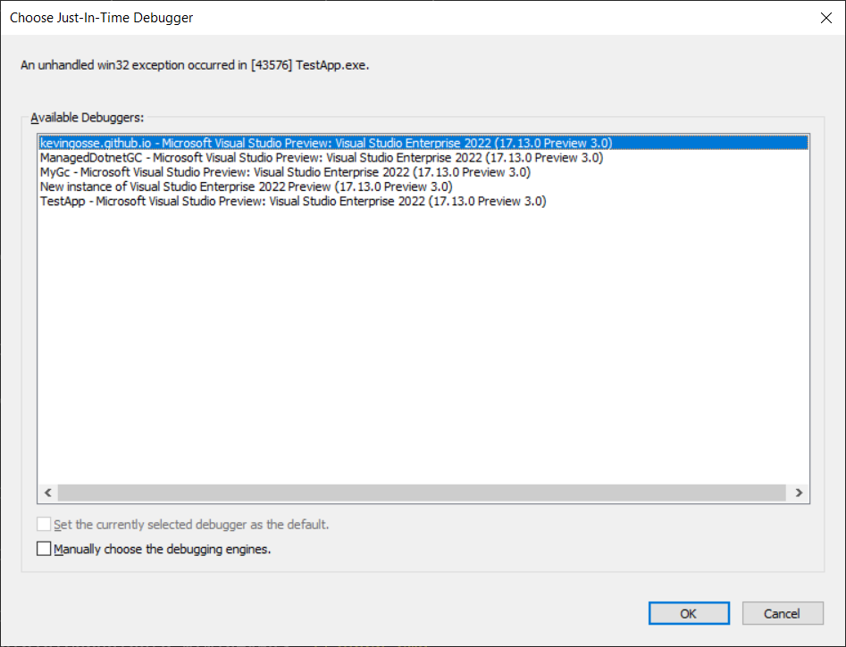
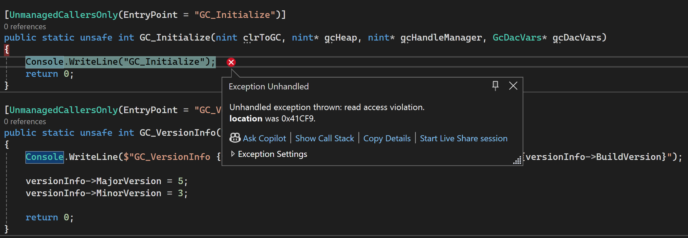

# 用 C# 写一个 .NET 垃圾回收器（一）

如果你读过我的文章，大概知道我很喜欢折腾 NativeAOT，尤其是用 C# 实现以前不可能做到的事情。我之前写过[简单的 profiler](https://minidump.net/writing-a-net-profiler-in-c-part-5/)，这次我们要更进一步——尝试用 C# 编写一个垃圾回收器（GC）。

当然，这不会生成任何可用于生产环境的东西。构建高性能且功能齐全的 GC 需要数百小时的工作量，而用托管语言来实现更是糟糕的选择（你能想象 GC 被自己的内部垃圾回收随机打断吗？）。不过，这仍然是个学习 .NET GC 内部机制的好借口。

你可能想问：为什么必须用 NativeAOT？和之前用 .NET 写 profiler 的情况类似，有两个原因使得“原生”.NET 无法实现：首先，GC 在进程初始化极早期就被加载，此时 CLR 尚未准备好运行托管代码；其次，GC 最终会依赖自身，导致“先有鸡还是先有蛋”的问题。NativeAOT 内置了自己的 CLR 且不与系统 CLR 交互，因此可以绕过这些限制。

## **独立 GC API**

.NET Core 2.1 开始支持加载外部 GC（称为 "standalone GC"）。你需要构建一个暴露两个方法的 DLL：

- `GC_Initialize`（初始化 GC）
- `GC_VersionInfo`（查询 GC 支持的 API 版本）

第一步是创建 .NET 9 库项目，并在 csproj 中添加 `<PublishAot>true</PublishAot>` 启用 NativeAOT。然后添加 `DllMain` 类（类名无关紧要）并声明这两个方法：

```c#
public class DllMain
{
    [UnmanagedCallersOnly(EntryPoint = "GC_Initialize")]
    public static unsafe uint GC_Initialize(IntPtr clrToGC, IntPtr* gcHeap, IntPtr* gcHandleManager, GcDacVars* gcDacVars)
    {
        Console.WriteLine("GC_Initialize");
        return 0x80004005; /* E_FAIL */
    }

    [UnmanagedCallersOnly(EntryPoint = "GC_VersionInfo")]
    public static unsafe void GC_VersionInfo(VersionInfo* versionInfo)
    {
        Console.WriteLine($"GC_VersionInfo {versionInfo->MajorVersion}.{versionInfo->MinorVersion}.{versionInfo->BuildVersion}");

        versionInfo->MajorVersion = 5;
        versionInfo->MinorVersion = 3;
    }

    [StructLayout(LayoutKind.Sequential)]
    public unsafe struct VersionInfo
    {
        public int MajorVersion;
        public int MinorVersion;
        public int BuildVersion;
        public byte* Name;
    }

    [StructLayout(LayoutKind.Sequential)]
    public readonly struct GcDacVars
    {
        public readonly byte Major_version_number;
        public readonly byte Minor_version_number;
        public readonly nint Generation_size;
        public readonly nint Total_generation_count;
    }
}
```

目前代码功能有限，仅通过控制台输出确认函数被调用。在 `GC_VersionInfo` 中需正确设置支持的 API 版本。由于 GC API 缺乏官方文档，必须通过查看 [CLR 源码确定正确的版本号](https://github.com/dotnet/runtime)。注意 `versionInfo` 参数初始包含 CLR 提供的 Execution Engine API 版本，这对编写支持多版本 .NET 的 GC 有用。

通过以下命令发布 DLL：

```c
dotnet publish -r win-x64
```

要将自定义 GC 加载到 .NET 应用中，需将 DLL 复制到应用目录，并设置环境变量 `DOTNET_GCName` 为 DLL 名称。也可使用 `DOTNET_GCPath` 指定完整路径。

```
set DOTNET_GCName=ManagedDotnetGC.dll
```

运行应用后立即崩溃：



虽然我们的 "GC" 远未完善，但至少应看到控制台输出的消息。

## **调试初始化过程**

附加调试器后，发现崩溃发生在 `GC_Initialize` 函数尝试写入控制台时。查看调用堆栈会发现异常：



```
ManagedDotnetGC.dll!S_P_CoreLib_System_Threading_Volatile__Read_12<System___Canon>()
ManagedDotnetGC.dll!System_Console_System_Console__get_Out()
ManagedDotnetGC.dll!System_Console_System_Console__WriteLine_12()
ManagedDotnetGC.dll!ManagedDotnetGC_ManagedDotnetGC_DllMain__GC_Initialize()
[Inline Frame] ManagedDotnetGC.dll!GCHeapUtilities::InitializeDefaultGC()
ManagedDotnetGC.dll!InitializeDefaultGC()
ManagedDotnetGC.dll!InitializeGC()
[Inline Frame] ManagedDotnetGC.dll!InitDLL(void * hPalInstance)
ManagedDotnetGC.dll!RhInitialize(bool isDll)
ManagedDotnetGC.dll!InitializeRuntime()
[Inline Frame] ManagedDotnetGC.dll!Thread::EnsureRuntimeInitialized()
[Inline Frame] ManagedDotnetGC.dll!Thread::ReversePInvokeAttachOrTrapThread(ReversePInvokeFrame *)
ManagedDotnetGC.dll!RhpReversePInvokeAttachOrTrapThread2(ReversePInvokeFrame * pFrame)
ManagedDotnetGC.dll!ManagedDotnetGC_ManagedDotnetGC_DllMain__GC_VersionInfo()
coreclr.dll!`anonymous namespace'::LoadAndInitializeGC(const wchar_t * standaloneGCName, const wchar_t * standaloneGCPath)
coreclr.dll!InitializeGarbageCollector()
coreclr.dll!EEStartupHelper()
coreclr.dll!EEStartup()
coreclr.dll!EnsureEEStarted()
coreclr.dll!CorHost2::Start()
coreclr.dll!coreclr_initialize(const char * exePath, const char * appDomainFriendlyName, int propertyCount, const char * * propertyKeys, const char * * propertyValues, void * * hostHandle, unsigned int * domainId)
hostpolicy.dll!coreclr_t::create(const std::wstring & libcoreclr_path, const char * exe_path, const char * app_domain_friendly_name, const coreclr_property_bag_t & properties, std::unique_ptr<coreclr_t,std::default_delete<coreclr_t>> & inst)
hostpolicy.dll!`anonymous namespace'::create_coreclr()
hostpolicy.dll!corehost_main(const int argc, const wchar_t * * argv)
hostfxr.dll!execute_app(const std::wstring & impl_dll_dir, corehost_init_t * init, const int argc, const wchar_t * * argv)
hostfxr.dll!`anonymous namespace'::read_config_and_execute(const std::wstring & host_command, const host_startup_info_t & host_info, const std::wstring & app_candidate, const std::unordered_map<enum known_options,std::vector<std::wstring,std::allocator<std::wstring>>,known_options_hash,std::equal_to<enum known_options>,std::allocator<std::pair<enum known_options const ,std::vector<std::wstring,std::allocator<std::wstring>>>>> & opts, int new_argc, const wchar_t * * new_argv, host_mode_t mode, const bool is_sdk_command, wchar_t * out_buffer, int buffer_size, int * required_buffer_size)
hostfxr.dll!fx_muxer_t::handle_exec_host_command(const std::wstring & host_command, const host_startup_info_t & host_info, const std::wstring & app_candidate, const std::unordered_map<enum known_options,std::vector<std::wstring,std::allocator<std::wstring>>,known_options_hash,std::equal_to<enum known_options>,std::allocator<std::pair<enum known_options const ,std::vector<std::wstring,std::allocator<std::wstring>>>>> & opts, int argc, const wchar_t * * argv, int argoff, host_mode_t mode, const bool is_sdk_command, wchar_t * result_buffer, int buffer_size, int * required_buffer_size)
hostfxr.dll!fx_muxer_t::execute(const std::wstring host_command, const int argc, const wchar_t * * argv, const host_startup_info_t & host_info, wchar_t * result_buffer, int buffer_size, int * required_buffer_size)
hostfxr.dll!hostfxr_main_startupinfo(const int argc, const wchar_t * * argv, const wchar_t * host_path, const wchar_t * dotnet_root, const wchar_t * app_path)
TestApp.exe!exe_start(const int argc, const wchar_t * * argv)
TestApp.exe!wmain(const int argc, const wchar_t * * argv)
[Inline Frame] TestApp.exe!invoke_main()
TestApp.exe!__scrt_common_main_seh()
kernel32.dll!BaseThreadInitThunk()
ntdll.dll!RtlUserThreadStart()
```

运行时正在调用 `GC_VersionInfo`，但崩溃却发生在 `GC_Initialize`。进一步观察发现，`GC_VersionInfo` 触发了 NativeAOT 运行时的初始化（`ManagedDotnetGC.dll!InitializeRuntime`），而后者又初始化了自带的 GC（`ManagedDotnetGC.dll!InitializeDefaultGC`）。这意外调用了我们的 `GC_Initialize` 函数。

最初猜想是 NativeAOT 运行时读取了 `DOTNET_GCName` 环境变量并试图使用我们的自定义 GC。但 NativeAOT 的[实验性 standalone GC](https://github.com/dotnet/runtime/pull/91038) 支持默认关闭（需特殊标志启用），因此不可能是崩溃原因。

深入调查发现问题与编译时的符号链接有关。[NativeAOT 运行时将 `GC_Initialize` 定义为外部符号：](https://github.com/dotnet/runtime/blob/main/src/coreclr/nativeaot/Runtime/gcheaputilities.cpp#L39-L46)

```
// GC entrypoints for the linked-in GC. These symbols are invoked
// directly if we are not using a standalone GC.
extern "C" HRESULT LOCALGC_CALLCONV GC_Initialize(
    /* In  */ IGCToCLR* clrToGC,
    /* Out */ IGCHeap** gcHeap,
    /* Out */ IGCHandleManager** gcHandleManager,
    /* Out */ GcDacVars* gcDacVars
);
```

由于我们也暴露了同名函数，链接器错误地链接了错误实现。通过编写简单的暴露 `GC_Initialize` 的控制台应用并发布运行，可复现同样的访问冲突。

```c#
internal class Program
{
    static void Main(string[] args)
    {
        Console.WriteLine("Hello, World!");
    }

    [UnmanagedCallersOnly(EntryPoint = "GC_Initialize")]
    public static int GC_Initialize()
    {
        return 0;
    }
}
```

如果我们使用 NativeAOT 发布并运行它，它会立即崩溃，并出现相同的访问违规错误，即使我们从未设置 `DOTNET_GCName` 环境变量，甚至没有尝试调用 `GC_Initialize` 函数。

不幸的是，我无法在 NativeAOT 编译层面找到解决方案，因此不得不寻找其他方法。

## **修复初始化：合理方案**

在我最初的尝试中，我使用了一个简单的变通方法来绕过 `GC_Initialize` 问题。由于在 NativeAOT 中导出一个同名函数会导致崩溃，解决方案就是简单地将其重命名。我将其重命名为 `Custom_GC_Initialize`，然后编写了一个小型的 C++ 封装器来调用这个重命名后的函数：

```c++
#include "pch.h"

#include <windows.h>
#include <stdlib.h>

typedef HRESULT(__stdcall* f_GC_Initialize)(void*, void*, void*, void*);
typedef HRESULT(__stdcall* f_GC_VersionInfo)(void*);

static f_GC_Initialize s_gcInitialize;
static f_GC_VersionInfo s_gcVersionInfo;

BOOL APIENTRY DllMain(HMODULE hModule,
	DWORD  ul_reason_for_call,
	LPVOID lpReserved
)
{
	if (ul_reason_for_call == DLL_PROCESS_ATTACH)
	{
		auto module = LoadLibraryA("ManagedDotnetGC.dll");

		if (module == 0)
		{
			return FALSE;
		}

		s_gcInitialize = (f_GC_Initialize)GetProcAddress(module, "Custom_GC_Initialize");
		s_gcVersionInfo = (f_GC_VersionInfo)GetProcAddress(module, "Custom_GC_VersionInfo");
	}

	return true;
}

extern "C" __declspec(dllexport) HRESULT GC_Initialize(
	void* clrToGC,
	void** gcHeap,
	void** gcHandleManager,
	void* gcDacVars
)
{
	return s_gcInitialize(clrToGC, gcHeap, gcHandleManager, gcDacVars);
}

extern "C" __declspec(dllexport) void GC_VersionInfo(void* result)
{
	s_gcVersionInfo(result);
}
```

这段代码是一个简单的 DLL，它会加载原始的 `ManagedDotnetGC.dll`，定位 `Custom_GC_Initialize` 和 `Custom_GC_VersionInfo` 函数，然后将它们暴露为 `GC_Initialize` 和 `GC_VersionInfo`。这意味着 .NET 应用程序必须使用这个加载器作为独立 GC，而加载器会将调用转发到实际的自定义 GC。

这个方法确实可行，而且实现得相当干净，但它让我感到有些不满意，因为我的目标是完全用 C# 编写一个自定义 GC。因此，我仔细审查了独立 GC 的加载代码，并发现了一个可以利用的缺陷。

## **修复初始化：巧妙方案**

通过启用 NativeAOT 的 standalone GC 支持，并设置环境变量优先级：

```c#
<PropertyGroup>
    <IlcStandaloneGCSupport>true</IlcStandaloneGCSupport>
</PropertyGroup>
```

这将使 NativeAOT 读取 `DOTNET_GCName`/`DOTNET_GCPath` 环境变量，并加载指定的 GC。幸运的是，标准 .NET GC 本身兼容独立 GC API，因此我们可以将环境变量设置为指向原始 GC（`DOTNET_GCName=clrgc.dll`）。

这样，NativeAOT 会在该 GC 上调用 `GC_Initialize`，避免崩溃。然而，环境变量是按进程级别设置的，这会导致测试应用程序也加载原始 GC，而不是我们的自定义 GC。因此，我们需要找到一种方法，让 NativeAOT 运行时加载原始 GC，而 .NET 运行时加载我们的自定义 GC。

在探索过程中，我发现了一个有趣的特性：.NET 运行时支持以 `DOTNET_` 或 `COMPlus_` 为前缀的环境变量，而 NativeAOT 仅支持 `DOTNET_`。因此，如果我们设置 `COMPlus_GCName=ManagedDotnetGC.dll`，那么只有 .NET 运行时会识别它，而 NativeAOT 运行时会忽略它。这使得我们可以尝试如下配置：

```sh
set COMPlus_GCName=ManagedDotnetGC.dll
set DOTNET_GCName=clrgc.dll
```

然而，`DOTNET_` 变量的优先级高于 `COMPlus_`，所以同时设置 `DOTNET_GCName` 和 `COMPlus_GCName` 时，.NET 运行时会忽略 `COMPlus_GCName`，这使得方案无效。因此，我需要一个额外的技巧。

最终的解决方案是利用 `GCPath` 的优先级高于 `GCName` 的特性。例如，如果设置：

```sh
set DOTNET_GCPath=gc1.dll
set DOTNET_GCName=gc2.dll
```

那么 .NET 运行时会加载 `gc1.dll`，并忽略 `gc2.dll`。结合这一点，我最终得到了以下方案：

```sh
set DOTNET_GCName=clrgc.dll
set COMPlus_GCPath=ManagedDotnetGC.dll
```

在这种配置下：

- .NET 运行时会忽略 `DOTNET_GCName`，因为 `GCPath`（即 `COMPlus_GCPath`）具有更高的优先级，从而加载我们的自定义 GC。
- NativeAOT 运行时会忽略 `COMPlus_GCPath`，因为它仅支持 `DOTNET_` 前缀，因此加载 `clrgc.dll` 作为标准 GC。

这样，我们就达成了预期目标：.NET 运行时使用我们的自定义 GC，而 NativeAOT 运行时使用标准 GC。

要使此方案生效，需要确保与自定义 GC 一起提供 `clrgc.dll`。该文件可以在 .NET 安装目录下的 `shared\Microsoft.NETCore.App\9.x.x` 目录中找到。

## **修复初始化：正确方案**

经 [Michal Strehovský](https://bsky.app/profile/migeel.sk) 指点，更优方案是重命名导出函数并通过 MSBuild 目标修改符号表。这个方法的核心思想与 C++ 封装器方案类似，即使用不同的名称导出函数。

```c#
[UnmanagedCallersOnly(EntryPoint = "_GC_Initialize")]
public static unsafe uint GC_Initialize(IntPtr clrToGC, IntPtr* gcHeap, IntPtr* gcHandleManager, GcDacVars* gcDacVars)
{
    Console.WriteLine("GC_Initialize");
    return 0x80004005; /* E_FAIL */
}

[UnmanagedCallersOnly(EntryPoint = "_GC_VersionInfo")]
public static unsafe void GC_VersionInfo(VersionInfo* versionInfo)
{
	Console.WriteLine($"GC_VersionInfo {versionInfo->MajorVersion}.
	{versionInfo->MinorVersion}.{versionInfo->BuildVersion}");

    versionInfo->MajorVersion = 5;
    versionInfo->MinorVersion = 3;
}
```

例如，我在这里给它们加了一个下划线作为前缀。然后，只需在 `.csproj` 文件中添加一个 `msbuild` 目标，在链接之前修改定义文件，将导出名称改回原始名称：

```c#
<UsingTask TaskName="RegexReplaceFile" TaskFactory="RoslynCodeTaskFactory" AssemblyFile="$(MSBuildToolsPath)\Microsoft.Build.Tasks.Core.dll">
    <ParameterGroup>
      <FilePath ParameterType="System.String" Required="true" />
    </ParameterGroup>
    <Task>
      <Using Namespace="System.IO" />
      <Using Namespace="System.Text.RegularExpressions" />
      <Code Type="Fragment" Language="cs">
        <![CDATA[
        var lines = File.ReadAllLines(FilePath);
        for (int i = 0; i < lines.Length; i++)
        {
            lines[i] = Regex.Replace(lines[i], @"_GC_(\w+)", "GC_$1=_GC_$1");
        }
        File.WriteAllLines(FilePath, lines);
        ]]>
      </Code>
    </Task>
  </UsingTask>

  <Target Name="TransformExportsFile" BeforeTargets="LinkNative">
    <Message Importance="high" Text="Transforming exports file: $(ExportsFile)" />
    <RegexReplaceFile FilePath="$(ExportsFile)" />
  </Target>
```

## 总结

在使用上述任一变通方案后，我们可以确认，当运行测试应用程序时，自定义 GC 能够正确加载。不过，由于我们尚未真正实现自定义 GC 的初始化，应用程序仍然无法启动——但这将是我们下一步要解决的问题。

本篇文章中的代码已上传至 [GitHub](https://github.com/kevingosse/ManagedDotnetGC/tree/Part1)，感兴趣的读者可以在那里获取完整示例。