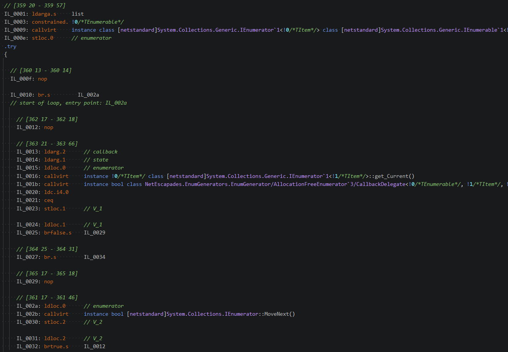

# 使用反射与动态方法，让对 IEnumerable 上的 foreach 实现零分配（allocation-free）

在这篇文章中，我会介绍一种技巧，用来减少对 IEnumerable 调用 foreach 时产生的分配（allocation）。这个技巧以前也被其他人[描述](https://www.macrosssoftware.com/2020/07/13/enumerator-performance-surprises/)和[使用](https://github.com/open-telemetry/opentelemetry-dotnet/blob/73bff75ef653f81fe6877299435b21131be36dc0/src/OpenTelemetry/Internal/EnumerationHelper.cs#L58)过，不过我最近在日常工作中（在 Datadog 负责 .NET SDK）优化代码时用到了它，于是决定更详细地解释一下。

## 背景：foreach 什么时候会分配

`foreach` 是 C# 中最常用的模式之一；它几乎无处不在。对 [dotnet/runtime](https://github.com/search?q=repo%3Adotnet%2Fruntime+%2F%28%3F-i%29foreach%2F+language%3AC%23&type=code&l=C%23) 仓库做一次快速、粗略的搜索，就能找到 3.9 千处实例！其中绝大多数是在枚举 .NET 基类库（BCL）里的内置类型，比如 List 和数组，但你也可以很容易地对自己的自定义类型使用 foreach。

有意思的是，大多数人对 foreach 的理解（或被教的方式）大概是：你需要实现 `IEnumerable`（或 `IEnumerable<T>`），然后就可以枚举集合。这没错，但这里其实有一个微妙的细节。严格来说，编译器使用的是模式匹配：它会寻找一个 `GetEnumerator()` 方法，该方法返回一个“类似 `Enumerator` 的类型”，这个类型需要有 `Current` 属性和 `MoveNext` 方法。这个模式要求与 `IEnumerable` 所定义的要求是一样的，那差别在哪里呢？

在深入之前，先看一个快速基准测试来展示差异会很有帮助。

### 创建一个用于比较 foreach 的基准测试

我先用 BenchmarkDotNet 的[模板](https://benchmarkdotnet.org/articles/guides/dotnet-new-templates.html)创建了一个新的项目，运行：

```bash
dotnet new benchmark
```

然后我把 Benchmarks 文件更新成下面这样。这个简单的基准测试会对一个 `List<T>` 实例调用 `foreach`，然后对同一个 `List<T>` 再跑一遍相同的 `foreach` 循环，不过这次把它存到一个 `IEnumerable<int>` 变量里：

```csharp
using System.Collections.Generic;
using System.Linq;
using BenchmarkDotNet.Attributes;

[MemoryDiagnoser]
public class Benchmarks
{
    private List<int> _list;
    private IEnumerable<int> _enumerable;

    [GlobalSetup]
    public void GlobalSetup()
    {
        _list = Enumerable.Range(0, 10_000).ToList();
        _enumerable = _list;
    }

    [Benchmark]
    public long List()
    {
        var value = 0;
        foreach (int i in _list)
        {
            value += i;
        }

        return value;
    }

    [Benchmark]
    public long IEnumerable()
    {
        var value = 0;
        foreach (int i in _enumerable)
        {
            value += i;
        }

        return value;
    }
}
```

你可能会觉得这两个基准测试会得到相同结果。毕竟它们是在同一个 `List<T>` 实例上跑相同的 `foreach` 循环。唯一的区别只是变量类型是 `List<T>` 还是 `IEnumerable<T>`，这不可能差很多吧？

如果我们运行基准测试（我在 .NET Framework 和 .NET 9 上都跑了），就会发现确实有差异：`IEnumerable<T>` 版本更慢，而且会分配内存：

| Method      | Runtime            |      Mean |     Error |    StdDev | Allocated |
| ----------- | ------------------ | --------: | --------: | --------: | --------: |
| List        | .NET Framework 4.8 |  8.245 us | 0.1582 us | 0.1480 us |         - |
| IEnumerable | .NET Framework 4.8 | 25.433 us | 0.4977 us | 0.6644 us |      40 B |
|             |                    |           |           |           |           |
| List        | .NET 9.0           |  2.951 us | 0.0587 us | 0.0861 us |         - |
| IEnumerable | .NET 9.0           |  8.032 us | 0.1520 us | 0.1422 us |      40 B |

那么问题来了：为什么？

### `foreach` 作为“降级后（lowered）”的 C#

一开始理解 `foreach` 的关键，是要明白 `foreach` 在“降级后”的 C# 里到底长什么样。这基本就是编译器在把 `foreach` 循环转换成 IL 之前，会先转换成的等价 C# 代码。如果我们把上面的 `EnumerateList()` 方法丢到 [sharplab.io](https://sharplab.io/#v2:CYLg1APgAgDABFAjAFgNwFgBQsGIHQAyAlgHYCOGmWUAzAgExwBCApiQMYAWAtgIYBOAawDOWAN5Y4UuAAd+RAG68ALizjFhygDyllAPjgB9ADZFNlSdNpxjAexIBzOAFESAV24t+KlhuUAKAEpLKQlMaQi4JX4o3mM3NQBeOBhKSOkAM1t+Fl4uOH9dOCJikiNTTWDw9LgwmsileLUwZKI0moBfLBDIqAB2WKb2qS7MDqA=) 上，会得到下面这样：

```csharp
private List<int> _list;

public long EnumerateList()
{
    int num = 0;
    List<int>.Enumerator enumerator = _list.GetEnumerator();
    try
    {
        while (enumerator.MoveNext())
        {
            int current = enumerator.Current;
            num += current;
        }
    }
    finally
    {
        ((IDisposable)enumerator).Dispose();
    }
    return num;
}
```

如你所见，在这个例子里，`GetEnumerator()` 方法返回的是一个 `List.Enumerator` 实例，它暴露了 `MoveNext()` 方法、`Current` 属性，并且实现了 `IDisposable`。把它和 `EnumerateIEnumerable()` 对比，会得到几乎相同的代码：

```csharp
private IEnumerable<int> _enumerable;

public long EnumerateIEnumerable()
{
    int num = 0;
    IEnumerator<int> enumerator = _enumerable.GetEnumerator();
    try
    {
        while (enumerator.MoveNext())
        {
            int current = enumerator.Current;
            num += current;
        }
    }
    finally
    {
        if (enumerator != null)
        {
            enumerator.Dispose();
        }
    }
    return num;
}
```

上面代码的主要区别是：`GetEnumerator()` 返回的是 `IEnumerator<int>` 实例，而不是具体的 `List<int>.Enumerator` 实例。我们看看 [List<int> 的枚举](https://github.com/dotnet/dotnet/blob/b0f34d51fccc69fd334253924abd8d6853fad7aa/src/runtime/src/libraries/System.Private.CoreLib/src/System/Collections/Generic/List.cs#L665)相关实现细节，会发现其实有 3 个不同实现，但最终都会委托到那个返回 `List<T>.Enumerator` 的 `GetEnumerator()` 方法。

```csharp
public class List<T>
{
    public Enumerator GetEnumerator() => new Enumerator(this);
    IEnumerator<T> IEnumerable<T>.GetEnumerator() => GetEnumerator();
    IEnumerator IEnumerable.GetEnumerator() => ((IEnumerable<T>)this).GetEnumerator();

    public struct Enumerator : IEnumerator<T>, IEnumerator
    {
        // 为简洁起见隐藏细节
    }
}
```

而且非常重要的一点是：`List<T>.Enumerator` 被定义成了 `struct`（结构体）类型。

### 结构体枚举器（Struct enumerators）

结构体枚举器正是导致分配差异的关键。通过返回一个可变的 `struct` 版本的 `Enumerator` 实现，而不是 `class`，`List<T>.Enumerator` 就可以在栈上分配，避免在堆上分配，从而避免给 GC 施加压力——前提是编译器能够直接调用 `GetEnumerator()` 方法……

但当我们对一个 `IEnumerable` 变量调用 `foreach` 时，为了满足接口契约，必须返回 `IEnumerator`（或 `IEnumerator<T>`）。做到这一点的唯一方式，就是把 `List<T>.Enumerator` 这个结构体进行[装箱（boxing）到堆上](https://learn.microsoft.com/en-us/dotnet/csharp/programming-guide/types/boxing-and-unboxing)。这正是我们在基准测试里看到 `IEnumerable` 变量会产生分配的原因。

总体来说，这个限制有点遗憾也挺烦人的。返回像 `IEnumerable<T>` 或 `ICollection<T>` 这样的基础接口类型而不是具体类型，是一种标准的封装方式：它允许以后演进实现而不破坏公共 API，并且通常（也确实应该）被鼓励。只是很可惜，这会带来分配。除非……你在用 .NET 10。

### .NET 10 的一个注意点：去抽象（deabstraction）

如果我在 .NET 10 上运行同样的基准测试，会得到一些有趣的结果：

| Method      | Runtime   |     Mean |     Error |    StdDev | Allocated |
| ----------- | --------- | -------: | --------: | --------: | --------: |
| List        | .NET 10.0 | 2.895 us | 0.0527 us | 0.0493 us |         - |
| IEnumerable | .NET 10.0 | 3.016 us | 0.0590 us | 0.0725 us |         - |

两个基准测试几乎一样。没有分配，执行时间也几乎相同！这是怎么回事？简短的答案是：.NET 10 引入了[一系列技术](https://devblogs.microsoft.com/dotnet/performance-improvements-in-net-10/#deabstraction)来让这种模式更快。有去虚拟化（devirtualization），运行时能看出它始终是 `List<T>`，于是直接调用结构体枚举器；还有对象栈分配（Object Stack Allocation），对于本来会分配到堆上的对象，如果编译器能证明它不会“逃逸（escape）”，就会把它分配到栈上。再加上一些针对 [`List<T>.Enumerator` 的额外修复工作](https://devblogs.microsoft.com/dotnet/performance-improvements-in-net-10/#collections)，就得到了上面这种令人愉悦的结果！

如果你在用 .NET 10，这当然很好。但在我做 Datadog .NET SDK 的工作里，我们的客户会跑在各种更旧的 .NET 版本上（包括 .NET Framework），而且我们经常处在应用的热路径上，所以需要尽可能高效。而那些 40 字节的分配累计起来也是很可观的！

## 已知返回类型时，避免 foreach 分配

如今，大多数由 BCL 或流行库暴露的集合类型都会使用相同的模式：基于栈的枚举器。但当集合以 `IEnumerable` 的形式暴露出来时，你就会失去这些性能收益。

避免这种退化的一种方式是（如果你知道某个 API 的返回具体类型），直接把它强转成那个类型，让编译器能够“找到”更好的 `GetEnumerator()` 方法：

```csharp
IEnumerable<int> someCollection = SomeApiThatReturnsAList();

// 如果我们知道 someCollection 总是返回 List<T>，就可以“帮”编译器一把
if(someCollection is List<int> list)
{
    // 编译器可以调用 `List<T>.GetEnumerator()`，在栈上分配，
    // 并避免装箱分配
    foreach(var value in list)
    {
    }
}
else
{
    // 可选：保留一个兜底分支以确保安全，以防我们的假设不成立
    // 或未来发生变化
    foreach(var value in someCollection)
    {
    }
}
```

这看起来有点笨拙，但确实能避免分配；当你追求效率时，每一字节都很重要！

### 当你无法引用返回类型时，避免 foreach 分配

上面这种方法在以下情况下既简单又好用：

1. 你知道某个 API 会返回什么类型。当然这可能改变（这也是用 `IEnumerable` 的意义之一！），所以你必须确保能处理这种情况。
2. 那个类型是 public 的，这样你才能引用它。

第二点对我们在 Datadog SDK 里经常是个问题，因为我们要对许多不同的库做插桩，无法在编译期引用它们。因此，如果我们想避免枚举器带来的分配，就需要别的办法。

比如 [Activity.TagObjects 属性](https://learn.microsoft.com/en-us/dotnet/api/system.diagnostics.activity.tagobjects?view=net-10.0)。这个 API 返回 `IEnumerable<KeyValuePair<string, object>>`，但具体类型是 [TagsLinkedList](https://github.com/dotnet/dotnet/blob/b0f34d51fccc69fd334253924abd8d6853fad7aa/src/runtime/src/libraries/System.Diagnostics.DiagnosticSource/src/System/Diagnostics/Activity.cs#L109)，它是一个 [internal 类型](https://github.com/dotnet/dotnet/blob/b0f34d51fccc69fd334253924abd8d6853fad7aa/src/runtime/src/libraries/System.Diagnostics.DiagnosticSource/src/System/Diagnostics/Activity.cs#L1632)，并且有一个结构体枚举器。我们不能用上面的 `is` 技巧，因为 `TagsLinkedList` 不是 public（[而且我们也不能用 `EnumerateTagObjects()` 方法](https://learn.microsoft.com/en-us/dotnet/api/system.diagnostics.activity.enumeratetagobjects?view=net-10.0)，因为它在我们支持的所有运行时里并不都可用）。那该怎么避免分配呢？

答案是使用我们在其他地方也用过的一种方式：利用 *Reflection.Emit* 的能力创建一个 `DynamicMethod`，在方法里显式使用结构体枚举器。

> 就像我在文章开头说的，这个方法并不新颖，之前也有人[描述](https://www.macrosssoftware.com/2020/07/13/enumerator-performance-surprises/)并[使用](https://github.com/open-telemetry/opentelemetry-dotnet/blob/73bff75ef653f81fe6877299435b21131be36dc0/src/OpenTelemetry/Internal/EnumerationHelper.cs#L58)过。我主要是借鉴了那些“前人工作”，并为了自己的用途做了一些调整，所以要为他们的辛苦工作点赞！

### 设计我们的 Reflection.Emit `DynamicMethod`

*Reflection.Emit* 指的是 *System.Reflection.Emit* 命名空间，它包含各种用来在应用程序中创建新的中间语言（IL）的方法。IL 指令是编译器在编译应用时输出的“汇编代码”。.NET 运行时的 JIT 会在应用运行时把这些 IL 指令转换成真正的机器汇编代码。

*Reflection.Emit* 主要被那些要“搞点野路子”的库和框架使用，或者被那些想尽可能榨取性能的场景使用，所以它绝对算是一个“高级”API。你如果没用过、或者觉得它很迷惑，也不用担心！

在下面的实现里，我们基本上会“手动”构造一个包含“降级后”的 `foreach` 循环的方法，并确保在对象上调用基于结构体的 `GetEnumerator()`。大概像这样：

```csharp
// 这基本就是我们要创建的方法
public static void AllocationFreeForEach(
    TagsLinkedList list, // 要枚举的对象
     ref SomeState state, // 回调可以使用的状态对象
      Func<SomeState, KeyValuePair<string, object>, bool> callback) // 要执行的回调
{
    // 我们要创建的是下面这段代码的 lowered 版本：
    // foreach(var item in list)
    // {
    //     if (!callback(ref state, item))
    //         break;
    // }
    using (TagsLinkedList.Enumerator enumerator = list.GetEnumerator())
    {
        while (enumerator.MoveNext())
        {
            if (!callback(ref state, enumerator.Current))
                break;
        }
    }
}
```

在构造 DynamicMethod 时我们必须创建上述代码的“降级后”版本，这意味着我们也需要把 using 块降级，因此实际更像下面这样：

```csharp
public static void AllocationFreeForEach(
    TagsLinkedList list,
     ref SomeState state,
      Func<SomeState, KeyValuePair<string, object>, bool> callback)
{
    TagsLinkedList.Enumerator enumerator = list.GetEnumerator();

    try
    {
        while (enumerator.MoveNext())
        {
            if (!callback(ref state, enumerator.Current))
                break;
        }

    }
    finally
    {
        enumerator.Dispose();
    }
}
```

这基本覆盖了我们想要发射（emit）的内容。现在剩下的就是生成我们的 DynamicMethod。

### 生成 DynamicMethod

我们将发射一个类似上面代码的方法，但会做成一个通用版本：可以用于多种不同的可枚举类型，以及多种不同的元素类型。

```csharp
internal static class AllocationFreeEnumerator<TEnumerable, TItem, TState>
    where TEnumerable : IEnumerable<TItem>
    where TState : struct
{
    // 使用反射获取我们需要调用的方法引用
    private static readonly MethodInfo GenericGetEnumeratorMethod = typeof(IEnumerable<TItem>).GetMethod("GetEnumerator")!;
    private static readonly MethodInfo GenericCurrentGetMethod = typeof(IEnumerator<TItem>).GetProperty("Current")!.GetMethod!;
    private static readonly MethodInfo MoveNextMethod = typeof(IEnumerator).GetMethod("MoveNext")!;
    private static readonly MethodInfo DisposeMethod = typeof(IDisposable).GetMethod("Dispose")!;

    // 这是我们要调用的方法
    public delegate void AllocationFreeForEachDelegate(TEnumerable instance, ref TState state, CallbackDelegate itemCallback);

    // 这是对每个元素都会调用的回调
    public delegate bool CallbackDelegate(ref TState state, TItem item);

    // 构建一个零分配的枚举器
    public static AllocationFreeForEachDelegate BuildAllocationFreeForEachDelegate(Type enumerableType)
    {
        var itemCallbackType = typeof(CallbackDelegate);

        // 尝试找到一个返回非接口类型的 GetEnumerator() 方法
        var getEnumeratorMethod = ResolveGetEnumeratorMethodForType(enumerableType);
        if (getEnumeratorMethod == null)
        {
            // 找不到返回非接口的 GetEnumerator() 方法，所以
            // 退回到分配模式，使用 IEnumerable<TItem>.GetEnumerator
            getEnumeratorMethod = GenericGetEnumeratorMethod;
        }

        var enumeratorType = getEnumeratorMethod.ReturnType;

        // 构建 DynamicMethod（我们的 AllocationFreeForEachDelegate）
        var dynamicMethod = new DynamicMethod(
            "AllocationFreeForEach",
            null,
            [typeof(TEnumerable), typeof(TState).MakeByRefType(), itemCallbackType],
            typeof(AllocationFreeForEachDelegate).Module,
            skipVisibility: true);

        var generator = dynamicMethod.GetILGenerator();

        // TagsLinkedList.Enumerator enumerator
        generator.DeclareLocal(enumeratorType);

        var beginLoopLabel = generator.DefineLabel();
        var processCurrentLabel = generator.DefineLabel();
        var returnLabel = generator.DefineLabel();
        var breakLoopLabel = generator.DefineLabel();

        // enumerator = arg0.GetEnumerator();
        generator.Emit(OpCodes.Ldarg_0);
        generator.Emit(OpCodes.Callvirt, getEnumeratorMethod);
        generator.Emit(OpCodes.Stloc_0);

        // try
        generator.BeginExceptionBlock();
        {
            // while()
            generator.Emit(OpCodes.Br_S, beginLoopLabel);

            generator.MarkLabel(processCurrentLabel);

            // bool shouldContinue = callback(arg1, enumerator.Current);
            generator.Emit(OpCodes.Ldarg_2);
            generator.Emit(OpCodes.Ldarg_1);
            generator.Emit(OpCodes.Ldloca_S, 0);
            generator.Emit(OpCodes.Constrained, enumeratorType);
            generator.Emit(OpCodes.Callvirt, GenericCurrentGetMethod);

            generator.Emit(OpCodes.Callvirt, itemCallbackType.GetMethod("Invoke")!);

            // if (!continue)
            //     break;
            generator.Emit(OpCodes.Brtrue_S, beginLoopLabel);
            generator.Emit(OpCodes.Leave_S, returnLabel);

            // if (enumerator.MoveNext())
            //    goto: start of while loop
            generator.MarkLabel(beginLoopLabel);
            generator.Emit(OpCodes.Ldloca_S, 0);
            generator.Emit(OpCodes.Constrained, enumeratorType);
            generator.Emit(OpCodes.Callvirt, MoveNextMethod);
            generator.Emit(OpCodes.Brtrue_S, processCurrentLabel);

            // close while loop
            generator.MarkLabel(breakLoopLabel);
            generator.Emit(OpCodes.Leave_S, returnLabel);
        }

        // finally
        generator.BeginFinallyBlock();
        {
            // enumerator.Dispose();
            if (typeof(IDisposable).IsAssignableFrom(enumeratorType))
            {
                generator.Emit(OpCodes.Ldloca_S, 0);
                generator.Emit(OpCodes.Constrained, enumeratorType);
                generator.Emit(OpCodes.Callvirt, DisposeMethod);
            }
        }

        generator.EndExceptionBlock();

        generator.MarkLabel(returnLabel);

        // return
        generator.Emit(OpCodes.Ret);

        return (AllocationFreeForEachDelegate)dynamicMethod.CreateDelegate(typeof(AllocationFreeForEachDelegate));
    }

    private static MethodInfo? ResolveGetEnumeratorMethodForType(Type type)
    {
        // 查找一个 `GetEnumerator()` 方法，它_不_返回
        // 接口类型。这并不_保证_它是结构体枚举器，
        // 但这是标准模式，因此能覆盖大多数情况
        var methods = type.GetMethods(BindingFlags.Instance | BindingFlags.Public | BindingFlags.NonPublic);

        foreach (var method in methods)
        {
            if (method.Name == "GetEnumerator" && !method.ReturnType.IsInterface)
            {
                return method;
            }
        }

        return null;
    }
}
```

这里代码很多，如果你不熟悉 IL，跟起来肯定会很困惑 😅 如果你正尝试写这种代码，我唯一的小建议是：使用一个 IL 生成器来展示你应该生成的 IL。我做这类东西时通常用 Rider 内置的那个：

Rider 的 IL 窗口输出



既然我们已经有了这个动态方法生成器，就可以把它拿来测试并检查结果了。

### 在 List 上对 DynamicMethod 做基准测试

为了测试它，我先把基准测试更新成 3 种场景：

一个 `List<T>` 存在 `List<T>` 变量里
一个 `List<int>` 存在 `IEnumerable<int>` 变量里
一个 `List<int>` 存在 `IEnumerable<int>` 变量里，但使用上面的 `DynamicMethod`

```csharp
using System;
using System.Collections;
using System.Collections.Generic;
using System.Linq;
using BenchmarkDotNet.Attributes;

[MemoryDiagnoser]
public class Benchmarks
{
    private List<int>? _list;
    private IEnumerable<int>? _listEnumerable;
    private AllocationFreeEnumerator<IEnumerable<int>, int, long>.AllocationFreeForEachDelegate _listEnumerator;

    [GlobalSetup]
    public void GlobalSetup()
    {
        _list = Enumerable.Range(0, 10_000).ToList();
        _listEnumerable = _list;
        _listEnumerator = AllocationFreeEnumerator<IEnumerable<int>, int, long>.BuildAllocationFreeForEachDelegate(_list.GetType());
    }

    [Benchmark]
    public long List()
    {
        long value = 0;
        foreach (int i in _list!)
        {
            value += i;
        }

        return value;
    }

    [Benchmark]
    public long IEnumerable()
    {
        long value = 0;
        foreach (int i in _listEnumerable!)
        {
            value += i;
        }

        return value;
    }

    [Benchmark]
    public long IEnumerableDynamicMethod()
    {
        long value = 0;
        _listEnumerator(_list!, ref value, static (ref state, i) =>
        {
            state += i;
            return true;
        });

        return value;
    }
}
```

在 .NET Framework 4.8 和 .NET 9 上跑出的结果有点“喜忧参半”：

| Method                   | Runtime            |      Mean |     Error |    StdDev | Allocated |
| ------------------------ | ------------------ | --------: | --------: | --------: | --------: |
| List                     | .NET 9.0           |  3.120 us | 0.0573 us | 0.0536 us |         - |
| IEnumerable              | .NET 9.0           |  7.554 us | 0.0935 us | 0.0828 us |      40 B |
| IEnumerableDynamicMethod | .NET 9.0           | 15.436 us | 0.1631 us | 0.1446 us |         - |
|                          |                    |           |           |           |           |
| List                     | .NET Framework 4.8 |  7.789 us | 0.0560 us | 0.0496 us |         - |
| IEnumerable              | .NET Framework 4.8 | 23.181 us | 0.1515 us | 0.1417 us |      40 B |
| IEnumerableDynamicMethod | .NET Framework 4.8 | 14.894 us | 0.1978 us | 0.1754 us |         - |

对 .NET Framework 来说，我们显然赢了：执行时间更短，而且现在零分配，这很好。

对 .NET 9 来说，我们确实实现了零分配，但执行时间却翻倍了，这有点遗憾；这很可能是因为 List 多年来在性能上做了大量优化，而我们的 DynamicMethod 方式可能在某种程度上“踩掉”了这些优化。这个性能损失是否值得，取决于你的瓶颈是什么。注意分配成本是固定的，不随列表大小变化；而这个场景的执行时间显然会随着列表大小近似线性增长。

对 .NET 10 来说（不太令人意外），我们的 `DynamicMethod` 方案比直接用 `IEnumerable<T>` 还糟：

| Method                   | Runtime   |      Mean |     Error |    StdDev | Allocated |
| ------------------------ | --------- | --------: | --------: | --------: | --------: |
| List                     | .NET 10.0 |  3.105 us | 0.0442 us | 0.0413 us |         - |
| IEnumerable              | .NET 10.0 |  3.162 us | 0.0365 us | 0.0341 us |         - |
| IEnumerableDynamicMethod | .NET 10.0 | 15.448 us | 0.2034 us | 0.1903 us |         - |

这正符合预期：考虑到这些年来的性能改进以及 `List<T>` 获得的关注。在 .NET 10 中，枚举 `IEnumerable<T>` 已经是零分配了，所以在这个场景没有理由使用它。

### 用自定义 `IEnumerable<T>` 对 `DynamicMethod` 做基准测试

我最初研究 `DynamicMethod` 方案的原因，是为了处理那些不是 BCL 内置的类型，所以我又看了一个自定义 `IEnumerable<T>` 实现的基准测试。下面这个链表实现非常基础，是 [Activity 内部使用的一个实现的高度精简版](https://github.com/dotnet/dotnet/blob/b0f34d51fccc69fd334253924abd8d6853fad7aa/src/runtime/src/libraries/System.Diagnostics.DiagnosticSource/src/System/Diagnostics/Activity.cs#L1632)。这些细节并不重要，我只是为了完整性把它贴出来：

```csharp
internal sealed class CustomLinkedList<T> : IEnumerable<T>
{
    private Node<T>? _first;
    private Node<T>? _last;

    public CustomLinkedList()
    {
    }

    public CustomLinkedList(T firstValue) => _last = _first = new Node<T>(firstValue);

    public CustomLinkedList(IEnumerator<T> e)
    {
        _last = _first = new Node<T>(e.Current);

        while (e.MoveNext())
        {
            _last.Next = new Node<T>(e.Current);
            _last = _last.Next;
        }
    }

    public Node<T>? First => _first;

    public void Add(T value)
    {
        Node<T> newNode = new Node<T>(value);
        if (_first is null)
        {
            _first = _last = newNode;
            return;
        }

        _last!.Next = newNode;
        _last = newNode;
    }

    public Enumerator<T> GetEnumerator() => new Enumerator<T>(_first);
    IEnumerator<T> IEnumerable<T>.GetEnumerator() => GetEnumerator();
    IEnumerator IEnumerable.GetEnumerator() => GetEnumerator();


    internal struct Enumerator<T> : IEnumerator<T>
    {
        private static readonly Node<T> s_Empty = new Node<T>(default!);

        private Node<T>? _nextNode;
        private Node<T> _currentNode;

        public Enumerator(Node<T>? head)
        {
            _nextNode = head;
            _currentNode = s_Empty;
        }

        public T Current => _currentNode.Value;

        object? IEnumerator.Current => Current;

        public bool MoveNext()
        {
            if (_nextNode == null)
            {
                _currentNode = s_Empty;
                return false;
            }

            _currentNode = _nextNode;
            _nextNode = _nextNode.Next;
            return true;
        }

        public void Reset() => throw new Exception();

        public void Dispose()
        {
        }
    }
    
    internal sealed partial class Node<T>
    {
        public Node(T value) => Value = value;
        public T Value;
        public Node<T>? Next;
    }
}
```

然后我把基准测试也更新成用 `CustomLinkedList` 来跑同一组测试：

```csharp
using System;
using System.Collections;
using System.Collections.Generic;
using System.Linq;
using BenchmarkDotNet.Attributes;

[MemoryDiagnoser]
public class Benchmarks
{
    private CustomLinkedList<int>? _linkedList;
    private IEnumerable<int>? _linkedListEnumerable;
    private AllocationFreeEnumerator<IEnumerable<int>, int, long>.AllocationFreeForEachDelegate _linkedListEnumerator;

    [GlobalSetup]
    public void GlobalSetup()
    {
        _linkedList = new();
        foreach (var i in Enumerable.Range(0, 10_000))
        {
            _linkedList.Add(i);
        }

        _linkedListEnumerable = _linkedList;
        _linkedListEnumerator =
            AllocationFreeEnumerator<IEnumerable<int>, int, long>.BuildAllocationFreeForEachDelegate(
                _linkedList.GetType());
    }

    [Benchmark]
    public long LinkedList()
    {
        long value = 0;
        foreach (int i in _linkedList!)
        {
            value += i;
        }

        return value;
    }

    [Benchmark]
    public long IEnumerableLinkedList()
    {
        long value = 0;
        foreach (int i in _linkedListEnumerable!)
        {
            value += i;
        }

        return value;
    }

    [Benchmark]
    public long IEnumerableLinkedListDynamicMethod()
    {
        long value = 0;
        _linkedListEnumerator(_linkedList!, ref value, static (ref state, i) =>
        {
            state += i;
            return true;
        });

        return value;
    }
}
```

这些 `CustomLinkedList<T>` 的基准测试结果和 `List<T>` 的很像，但有一个主要差别：在 .NET 9 上，`DynamicMethod` 方案现在也更快，同时还不分配，所以在这个场景就成了明显的赢家。.NET Framework 上的加速也非常可观：

| Method                             | Runtime            |      Mean |     Error |    StdDev | Allocated |
| ---------------------------------- | ------------------ | --------: | --------: | --------: | --------: |
| LinkedList                         | .NET 9.0           |  7.844 us | 0.1340 us | 0.1254 us |         - |
| IEnumerableLinkedList              | .NET 9.0           | 18.892 us | 0.3430 us | 0.3209 us |      32 B |
| IEnumerableLinkedListDynamicMethod | .NET 9.0           | 15.148 us | 0.2613 us | 0.2445 us |         - |
|                                    |                    |           |           |           |           |
| LinkedList                         | .NET Framework 4.8 |  7.914 us | 0.1295 us | 0.1212 us |         - |
| IEnumerableLinkedList              | .NET Framework 4.8 | 42.272 us | 0.8344 us | 0.9933 us |      32 B |
| IEnumerableLinkedListDynamicMethod | .NET Framework 4.8 | 13.480 us | 0.2430 us | 0.2273 us |         - |

和之前一样，在 .NET 10 上，`DynamicMethod` 的结果比普通的 `IEnumerable<T>` 更差。这其实相当令人印象深刻——.NET 10 设法让 `LinkedList` 和 `IEnumerableLinkedList` 这两个基准测试几乎无法区分。非常酷 😎

| Method                             | Runtime   |      Mean |     Error |    StdDev | Allocated |
| ---------------------------------- | --------- | --------: | --------: | --------: | --------: |
| LinkedList                         | .NET 10.0 |  7.944 us | 0.1570 us | 0.1542 us |         - |
| IEnumerableLinkedList              | .NET 10.0 |  7.798 us | 0.0745 us | 0.0622 us |         - |
| IEnumerableLinkedListDynamicMethod | .NET 10.0 | 14.990 us | 0.2606 us | 0.2559 us |         - |

所以结论就是：这是一种对集合类型进行零分配枚举的方法。当然，你是否应该这么做完全取决于具体上下文。如果枚举在热路径上、你又不在 .NET 10 上，并且这些分配在你的性能分析里确实出现了，那也许你就该考虑一下 😅

总结
在这篇文章的第一部分，我介绍了 `foreach` 循环如何以及何时会导致分配。我创建了一个简单基准测试来展示问题，展示了“降级后”的 C#，并说明分配来自对结构体枚举器的装箱。

在第二部分，我描述了当你无法简单地强转为已知类型时，如何通过 *Reflection.Emit* 创建一个 `DynamicMethod` 来避免分配。这是一个相当高级的技巧，但它展示了如何把枚举过程中的分配完全移除。

最后，我展示了该方法在基准测试中的表现。如果你在使用 .NET 10，那么你完全不需要 `DynamicMethod`，也无需担心 😀 在更早的运行时（包括 .NET Framework）上，`DynamicMethod` 方案能消除分配，并且在很多情况下还能提升执行时间，尤其是对“自定义”的集合类型而言。

你是否应该使用这种方法非常依赖场景。在大多数情况下，分配 40 字节并不是什么大事。但如果它确实对你造成问题，那么现在你工具箱里又多了一件工具！