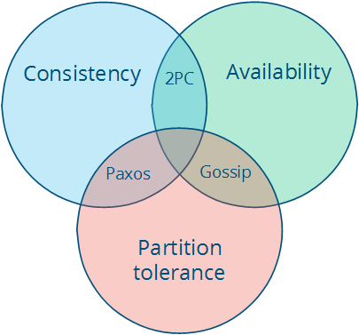

# 在抽象层次上的上下游

在这一章中，我们将在抽象层次上下串行，看一看一些不可能性结果(CAP 和 FLP)，然后为了性能的目的再次回到较低的层次。

如果你有任何编程经验，抽象层次的概念对你来说可能很熟悉。你总是在某种抽象层次上工作，通过某种 API 与较低层次的层进行交互，并可能为你的用户提供某种较高层次的 API 或用户界面。计算机网络的七层 [OSI 模型](https://en.wikipedia.org/wiki/OSI_model)就是一个很好的例子。

我断言，分布式编程在很大程度上就是在处理分布带来的后果。也就是说，存在着这样一种矛盾：节点有很多，但我们又希望系统“像单个系统一样工作”。这意味着要找到一个很好的抽象，在可能性、可理解性和性能之间达到平衡。

当我们说 X 比 Y 更抽象时，我们究竟是什么意思呢？首先，X 不会引入任何新的或根本不同于 Y 的东西。事实上，X 可能会删除 Y 的某些方面，或以一种使它们更易管理的方式呈现它们。其次，X 在某种程度上比 Y 更易于理解，前提是 X 从 Y 中删除的那些东西对于手头的问题并不重要。

就像 [Nietzsche](http://oregonstate.edu/instruct/phl201/modules/Philosophers/Nietzsche/Truth_and_Lie_in_an_Extra-Moral_Sense.htm) 写的：

> 每个概念都是通过我们将不等同的事物等同而起源的。没有一片叶子是完全相等的，而“叶子”这个概念是通过任意的抽象化，忘记各个差异而形成的；现在它引发了这样一种想法，即自然界可能还存在着“叶子”之外的某些东西 - 某种原始形式，所有的叶子都是围绕这种形式织就、描绘、复制、着色、卷曲和涂饰的，但由于手艺人的不谨慎，因此没有一个副本能够成为一个准确、可靠和忠实的原始形式的图像。

从根本上说，抽象是假的。每种情况都是独一无二的，每个节点也是独一无二的。但抽象却能让世界变得易于管理：更简单的问题陈述--脱离现实--更易于分析，只要我们没有忽略任何本质的东西，解决方案就能广泛应用。

事实上，如果我们保留的东西都是基本的，那么我们能得出的结果也将是广泛适用的。这就是不可能结果如此重要的原因：它们采用最简单的问题表述，并证明在某些限制或假设条件下不可能解决这个问题。

所有抽象都会忽略某些东西，以便将本质上独特的事物等同起来。关键在于舍弃掉所有非必要的东西。那么如何知道什么是必要的呢？事实上，你事先是无法确定的。

每当我们将系统的某些方面排除在系统规范之外时，就有可能引入错误源和/或性能问题。这就是为什么有时我们需要反其道而行之，有选择性地引入真实硬件的某些方面和真实世界的问题。重新引入一些特定的硬件特性（如物理顺序性）或其他物理特性，可能就足以获得性能足够好的系统。

有鉴于此，我们在使用分布式系统的同时，还能保留多少现实情况呢？系统模型是我们认为重要特征的具体化；在具体化之后，我们就可以看看一些不可能的结果和挑战了。

## 系统模型

分布式系统的一个关键特性是分布。更具体地说，分布式系统中的程序：

- 在独立节点上并发运行...
- 由网络连接，可能引入非确定性和信息丢失...
- 没有共享内存或共享时钟。

这意味着很多问题：

- 每个节点同时执行一个程序
- 知识是本地的：节点只能快速访问其本地状态，任何有关全局状态的信息都可能是过时的
- 节点可以独立发生故障并从故障中恢复
- 信息可能延迟或丢失（与节点故障无关；不易区分网络故障和节点故障）
- 节点间的时钟不同步（本地时间戳与全局实时顺序不一致，不易观察到）。

系统模型列举了与特定系统设计相关的许多假设。

> 系统模型：对实施分布式系统的环境和设施的一系列假设

系统模型对环境和设施的假设各不相同。这些假设包括

- 节点具有哪些能力，它们可能如何失效
- 通信链路如何运行以及可能出现的故障
- 整个系统的属性，如对时间和秩序的假设。

稳健的系统模型是一种假设最弱的模型：为这种系统编写的任何算法对不同环境都有很强的容错能力，因为它的假设非常少而且非常弱。

另一方面，我们可以通过强假设来创建一个易于推理的系统模型。例如，假设节点不会发生故障，就意味着我们的算法无需处理节点故障。然而，这样的系统模型是不现实的，因此很难应用到实践中。

让我们来详细了解节点、链路、时序的属性。

### 节点

节点是计算和存储的服务主机。它们具有

- 执行程序的能力
- 将数据存储到易失性存储器（故障时可能丢失）和稳定状态（故障后可读取）的能力
- 时钟（可能准确，也可能不准确）

节点执行确定性算法：本地计算、计算后的本地状态以及发送的信息由收到的信息和收到信息时的本地状态唯一决定。

有许多可能的故障模型可以描述节点可能发生故障的方式。在实践中，大多数系统都假设了崩溃-恢复故障模型：也就是说，节点只能通过崩溃发生故障，并（可能）在崩溃后的某个时间点恢复。

另一种方法是假设节点可以通过任意方式的不当行为发生故障。这就是所谓的[拜占庭容错](https://en.wikipedia.org/wiki/Byzantine_fault_tolerance)。拜占庭故障在现实世界的商业系统中很少被处理，因为能够抵御任意故障的算法运行成本更高，实现起来也更复杂。在此，我将不作讨论。

### 通信链路

通信链路将单个节点相互连接起来，并允许向任一方向发送信息。许多讨论分布式算法的书籍都假定，每对节点之间都有单独的链路，链路为信息提供 FIFO（先进先出）顺序，链路只能传递已发送的信息，而且已发送的信息可能会丢失。

有些算法假设网络是可靠的：信息不会丢失，也不会无限期延迟。这种假设在现实世界的某些情况下可能是合理的，但一般来说，最好还是认为网络是不可靠的，会出现信息丢失和延迟。

当网络出现故障，而节点本身仍可正常运行时，就会出现网络分区。发生这种情况时，信息可能会丢失或延迟，直到网络分区被修复。被分区的节点可能会被某些客户端访问，因此必须与崩溃的节点区别对待。下图展示了节点故障与网络分区的对比：

对通信链路做进一步的假设是很少见的。我们可以假设链路只在一个方向上工作，也可以为不同的链路引入不同的通信成本（如物理距离造成的延迟）。不过，除了长距离链接（广域网延迟）外，商业环境中很少涉及这些问题，因此我在此不做讨论；更详细的成本和拓扑模型可以在降低复杂性的同时实现更好的优化。

### 时序假设

物理分布的后果之一是，每个节点都以独特的方式体验世界。这是不可避免的，因为信息只能以光速传播。如果节点之间的距离不同，那么从一个节点发送到其他节点的任何信息都会在不同的时间到达其他节点，并且可能以不同的顺序到达。

时间假设是一种方便的速记法，用来描述我们对这一现实情况的考虑程度。主要有以下两种选择：

| 同步系统模型 | 进程同步执行；信息传输延迟有已知上限；每个进程都有准确的时钟 |
| ------------ | ------------------------------------------------------------ |
| 异步系统模型 | 没有时序假设--例如，进程以独立的速率执行；信息传输延迟不受约束；不存在有用的时钟 |

同步系统模型对时间和顺序施加了许多限制。它基本上假定节点具有相同的体验：即发送的消息总是在特定的最大传输延迟内被接收，而且进程以锁步（lock-step）方式执行。这是方便的，因为它允许你作为系统设计者对时间和顺序做出假设，而异步系统模型则不允许这样做。

异步是一种非假设：它只是假设你不能依赖时间（或“时间传感器”）。

在同步系统模型中解决问题更容易，因为关于执行速度、最大信息传输延迟和时钟精度的假设都有助于解决问题，因为你可以根据这些假设做出推断，并通过假设它们永远不会发生来排除不方便的故障情况。

当然，假设同步系统模型并不特别现实。现实世界的网络可能会出现故障，而且信息延迟也没有硬约束。现实世界中的系统充其量只是部分同步：它们偶尔会正常工作并提供一些上限，但有时也会出现消息无限期延迟和时钟不同步的情况。我不会在这里讨论同步系统的算法，但你可能会在许多其他入门书籍中遇到，因为它们在分析上更容易（但不现实）。

### 共识问题

在本文的其余部分，我们将改变系统模型的参数。接下来，我们将了解如何改变两个系统属性：

- 故障模型中是否包含网络分区，以及
- 同步与异步时序假设

通过讨论两个不可能结果（FLP 和 CAP），我们将了解这两个系统属性的变化对系统设计选择的影响。

当然，为了进行讨论，我们还需要引入一个要解决的问题。我要讨论的问题是[共识问题](https://en.wikipedia.org/wiki/Consensus_%28computer_science%29)。

如果几台计算机（或节点）在某个值上达成一致，那么它们就会达成共识。更正式的说法是

- 一致：每个正确的进程都必须就相同的值达成一致。
- 完整性：每个正确的进程最多决定一个值，如果它决定了某个值，那么它一定是由某个进程提出的。
- 终止：所有进程最终都会做出决定。
- 有效性：如果所有正确的进程都提出了相同的值 V，那么所有正确的进程都会决定 V。

共识问题是许多商业分布式系统的核心问题。毕竟，我们想要的是分布式系统的可靠性和性能，而无需处理分布式的后果（如节点间的分歧/分歧），解决了共识问题，就有可能解决一些相关的、更高级的问题，如原子广播和原子提交。

### 两个不可能结果

第一个不可能结果被称为 FLP 不可能结果，是一个与设计分布式算法的人特别相关的不可能结果。第二个不可能结果--CAP定理--是一个与实践者更相关的结果；实践者需要在不同的系统设计之间做出选择，但他们并不直接关注算法的设计。

## FLP 不可能结果

我将只简要概述 [FLP 不可能性结果](https://en.wikipedia.org/wiki/Consensus_%28computer_science%29#Solvability_results_for_some_agreement_problems)，尽管学术界认为它[更为重要](https://en.wikipedia.org/wiki/Dijkstra_Prize)。FLP 不可能性结果（以作者 Fischer、Lynch 和 Patterson 的名字命名）研究了异步系统模型下的共识问题（严格来说是协议问题，它是共识问题的一种非常弱的形式）。假设节点只能以崩溃的方式失败；网络是可靠的；异步系统模型的典型时序假设成立：例如，消息延迟不受约束。

在这些假设条件下，FLP 结果表明：“异步系统中的共识问题不存在（确定性）算法，即使消息永远不会丢失，最多有一个进程可能失败，而且只能通过崩溃（停止执行）来失败”。

这一结果意味着，在一个极小的系统模型下，没有办法以一种不能永远延迟的方式来解决共识问题。其论点是，如果存在这样一种算法，那么人们就可以设计出一种算法的执行方式，通过延迟信息传递（这在异步系统模型中是允许的），在任意长的时间内保持未决（“二价（bivalent）”）。因此，这样的算法是不可能存在的。

**这一不可能性结果非常重要，因为它突出表明，假设采用异步系统模型会导致一种权衡：当有关信息传递界限的保证不成立时，解决共识问题的算法必须放弃安全性或有效性。**

这一见解对设计算法的人来说尤为重要，因为它对我们已知在异步系统模型中可以解决的问题施加了一个硬约束。CAP 定理是一个与实践者更相关的相关定理：它的假设略有不同（是网络故障而不是节点故障），对实践者选择系统设计有更明确的影响。

## CAP 定理

CAP 定理最初是计算机科学家埃里克-布鲁尔（Eric Brewer）提出的一个猜想。它是一种流行且相当有用的方法，用于思考系统设计所做保证的权衡。[Gilbert](http://www.comp.nus.edu.sg/~gilbert/biblio.html) 和 [Lynch](https://en.wikipedia.org/wiki/Nancy_Lynch) 甚至对该定理进行了正式证明。不，[Nathan Marz](http://nathanmarz.com/)并没有推翻该定理，[尽管某个讨论网站](http://news.ycombinator.com/)是这么认为的。

该定理指出，在这三个属性中，

- 一致性：所有节点在同一时间看到相同的数据。
- 可用性：节点故障不会妨碍幸存者继续运行。
- 分区容忍性：尽管网络和/或节点故障导致信息丢失，系统仍能继续运行

只有两种情况可以同时满足。我们甚至可以将其绘制成一张漂亮的图表，从三个属性中挑选两个属性，就可以得到对应于不同交叉点的三类系统：

请注意，该定理说明中间部分（具有所有三个特性）是无法实现的。这样，我们就得到了三种不同的系统类型：

- CA（一致性+可用性）。例如完全严格的[法定人数协议](https://github.com/MarsonShine/MS.Microservice/blob/master/docs/patterns-of-distributed-systems/Quorum.md)，如[两阶段提交](https://github.com/MarsonShine/MS.Microservice/blob/master/docs/patterns-of-distributed-systems/Two-Phase-Commit.md)
- CP（一致性 + 分区容错）。例如 [Paxos](https://github.com/MarsonShine/MS.Microservice/blob/master/docs/patterns-of-distributed-systems/Paxos.md) 等少数分区不可用的多数法定人数协议。
- AP（可用性 + 分区容错）。例子包括使用冲突解决的协议，如 Dynamo。

CA 和 CP 系统设计都提供相同的一致性模型：强一致性。唯一不同的是，CA 系统不能容忍任何节点故障；而 CP 系统在非拜占庭故障模型中，在 2f+1 个节点的情况下，最多可容忍 f 个故障（换句话说，只要多数 f+1 保持正常，它就能容忍少数 f 个节点的故障）。原因很简单：

- CA 系统无法区分节点故障和网络故障，因此必须停止接受任何地方的写入，以避免引入分歧（多副本）。它无法分辨是远程节点宕机，还是仅仅是网络连接宕机：因此唯一安全的办法就是停止接受写入。
- CP 系统通过强制分区两侧的非对称行为来防止分歧（例如，保持单副本一致性）。它只保留多数分区，而要求少数分区变得不可用（例如停止接受写入），这样就保留了一定程度的可用性（多数分区），并仍能确保单拷贝一致性。

我将在[复制](replication.md)一章讨论 Paxos 时更详细地讨论这个问题。重要的是，CP 系统将网络分区纳入其故障模型，并使用 Paxos、Raft 或视图戳复制等算法区分多数分区和少数分区。CA 系统不具有分区意识，而且在历史上更为常见：它们通常使用两阶段提交算法，在传统的分布式关系数据库中很常见。

假设发生了分区，该定理就简化为可用性和一致性之间的二元选择。

我认为应该从 CAP 定理中得出四个结论：

首先，早期分布式关系数据库系统中使用的许多系统设计都没有考虑分区容错（例如，它们是 CA 设计）。分区容错是现代系统的一个重要特性，因为如果系统在地理上是分布式的（许多大型系统都是如此），网络分区的可能性就会大大增加。

其次，在网络分区期间，强一致性和高可用性之间存在矛盾。CAP 定理说明了强保证和分布式计算之间的权衡。

在某种意义上，承诺由不可预测网络连接的独立节点组成的分布式系统“表现得与非分布式系统无异”确实有些疯狂。

------

强一致性保证要求我们在分区期间放弃可用性。这是因为我们无法在分区两侧继续接受写入的同时，防止两个无法相互通信的副本之间出现分歧。

如何解决这个问题呢？通过加强假设（假设没有分区）或削弱保证。一致性可以与可用性（以及离线可访问性和低延迟等相关能力）进行权衡。如果将“一致性”定义为小于“所有节点在同一时间看到相同的数据”，那么我们就可以同时拥有可用性和某种（较弱的）一致性保证。

第三，强一致性与正常运行性能之间存在矛盾。

强一致性/单拷贝一致性要求节点就每次操作进行通信并达成一致。这会导致正常运行时的高延迟。

如果你能接受一种非传统的一致性模型，一种允许副本滞后或分歧的一致性模型，那么你就能减少正常运行时的延迟，并在出现分区时保持可用性。

当涉及的信息和节点较少时，操作可以更快地完成。但要做到这一点，唯一的办法就是放松保证：让一些节点的联系频率降低，这意味着节点可以包含旧数据。

这也使得异常情况有可能发生。你不再能保证获得最新的值。根据所做的保证类型，您可能会读取到比预期更早的值，甚至会丢失一些更新。

第四点--有点间接--如果我们不想在网络分区期间放弃可用性，那么我们就需要探索强一致性以外的一致性模型是否能满足我们的目的。

例如，即使用户数据被地理复制到多个数据中心，而这两个数据中心之间的链接暂时失灵，在很多情况下，我们仍希望允许用户使用网站/服务。这就意味着稍后要调和两套不同的数据，这既是技术上的挑战，也是业务上的风险。但通常情况下，技术挑战和业务风险都是可控的，因此最好是提供高可用性。

一致性和可用性其实并不是二元选择，除非你把自己限制在强一致性上。但强一致性只是一种一致性模型：在这种模型中，你必须放弃可用性，以防止数据的单个副本以上处于活动状态。正如布鲁尔自己所指出的，“三选二 ”的解释是有误导性的。

如果你想从这次讨论中得到一个启发，那就请记住这一点：“一致性”并不是一个单一、明确的属性。请记住：

> ACID 一致性  !=  CAP 一致性  != Oatmeal一致性
>
> 注意：
>
> Oatmeal一致性并非什么正式的术语，而是一个戏谑的说法。它指的是一种非常宽松的一致性模型，即数据在不同节点之间可能存在较大的不一致，就像燕麦粥中的燕麦粒分布不均一样。这种一致性模型通常被认为是不可接受的，因为它无法保证数据的正确性和可靠性。

相反，一致性模型是数据存储为使用它的程序提供的一种保证--任何保证。

> 一致性模型：程序员和系统之间的契约，其中系统保证如果程序员遵循某些特定规则，对数据存储的操作结果将是可预测的

CAP 中的 “C” 是“强一致性”，但“一致性”并不是“强一致性”的同义词。

让我们来看看其他一些一致性模型。

## 强一致性与其他一致性模式的比较

一致性模型可分为两类：强一致性模型和弱一致性模型：

- 强一致性模型（能够保持单一副本）
  - 可线性化的一致性
  - 顺序一致性
- 弱一致性模型
  - 以客户为中心的一致性模型
  - 因果一致性：现有最强模型
  - 最终一致性模型

强一致性模型保证更新的明显顺序和可见性等同于非复制系统。而弱一致性模型则没有这种保证。

请注意，这绝不是一份详尽的清单。同样，一致性模型只是程序员和系统之间的任意契约，因此几乎可以是任何东西。

### 强一致性模型

强一致性模型又可分为两种相似但略有不同的一致性模型：

- 可线性化一致性：在可线性化一致性下，所有操作似乎都以原子方式执行，其顺序与操作的全局实时排序一致。(Herlihy & Wing, 1991）
- 顺序一致性：在顺序一致性条件下，所有操作似乎都是按原子顺序执行的，这种顺序与单个节点上的顺序一致，并且在所有节点上都相同。(兰波特，1979 年）

主要区别在于，线性化一致性要求操作生效的顺序与操作的实际实时顺序一致。顺序一致性允许对操作重新排序，只要在每个节点上观察到的顺序保持一致即可。区分这两者的唯一方法就是观察进入系统的所有输入和时序；从客户端与节点交互的角度来看，两者是等价的。

这种区别似乎无关紧要，但值得注意的是，顺序一致性并不构成。

强一致性模型允许程序员将单个服务器替换为一组分布式节点，而不会遇到任何问题。

相比之下，所有其他一致性模型（相对于保证强一致性的系统）都会出现异常，因为它们的行为与非复制系统有所区别。但通常这些异常是可以接受的，要么是因为我们不在乎偶尔的问题，要么是因为我们编写了代码来处理发生的某些不一致。

请注意，实际上并没有任何通用的弱一致性模型分类，因为“不是强一致性模型”（例如“在某种程度上与非复制系统有所区别”）几乎可以是任何东西。

### 以客户为中心的一致性模型

以客户为中心的一致性模型是以某种方式涉及客户或会话概念的一致性模型。例如，以客户端为中心的一致性模型可以保证客户端永远不会看到数据项的旧版本。这通常是通过在客户端库中建立额外的缓存来实现的，这样，如果客户端移动到包含旧数据的副本节点，客户端库就会返回其缓存值，而不是副本中的旧值。

如果客户端所在的副本节点不包含最新版本的数据，客户端可能仍会看到旧版本的数据，但绝不会看到旧版本值再次出现的异常情况（例如，因为客户端连接到了不同的副本）。请注意，以客户端为中心的一致性模型有很多种。

### 最终一致性

最终一致性模型认为，如果停止更改值，那么在某段未定义的时间后，所有副本的值将一致。这意味着在此之前，各副本之间的结果会以某种未定义的方式不一致。由于它是微不足道的可满足性（仅有效性属性），因此在没有补充信息的情况下，它是无用的。

说某些东西最终是一致的，就好比说“人最终会死”。这是一个非常弱的约束，我们可能希望至少对两件事有一些更具体的描述：

首先，“最终”是多久？如果能有一个严格的下限，或者至少知道系统收敛到相同值一般需要多长时间，那将是非常有用的。

其次，复制如何就某个值达成一致？一个总是返回“42”的系统最终是一致的：所有副本都同意相同的值。但它并没有收敛到一个有用的值，因为它只是不断返回相同的固定值。相反，我们希望对方法有更好的认识。例如，一种决定方法是让时间戳最大的值总是胜出。

因此，当供应商说“最终一致性”时，他们指的是一些更精确的术语，比如“最终最后写入者获胜，同时读取最新观测值”的一致性。“怎么做？”很重要，因为一个糟糕的方法可能会导致写入丢失--例如，如果一个节点上的时钟设置错误并使用了时间戳。

我将在弱一致性模型的复制方法一章中更详细地探讨这两个问题。

## 拓展阅读

- [布鲁尔猜想与一致、可用、分区容忍网络服务的可行性](http://lpd.epfl.ch/sgilbert/pubs/BrewersConjecture-SigAct.pdf) -- Gilbert & Lynch, 2002 
- [有一个错误过程的分布式共识的不可能性](https://scholar.google.com/scholar?q=Impossibility+of+distributed+consensus+with+one+faulty+process)--Fischer、Lynch 和 Patterson，1985 年
- [关于 CAP 定理的观点](https://scholar.google.com/scholar?q=Perspectives+on+the+CAP+Theorem)--Gilbert & Lynch, 2012
- [十二年后的 CAP：“规则”是如何改变的](http://www.infoq.com/articles/cap-twelve-years-later-how-the-rules-have-changed) - Brewer，2012 年
- [统一共识比共识更难](https://scholar.google.com/scholar?q=Uniform+consensus+is+harder+than+consensus)--Charron-Bost 和 Schiper，2000 年
- [通过棒球解释复制数据一致性](http://pages.cs.wisc.edu/~remzi/Classes/739/Papers/Bart/ConsistencyAndBaseballReport.pdf)--Terry，2011 年
- [分布式事务之外的生活：一个叛徒的观点](https://scholar.google.com/scholar?q=Life+Beyond+Distributed+Transactions%3A+an+Apostate%27s+Opinion)--Helland，2007 年
- [如果数据太多，那么“足够好”就足够了](http://dl.acm.org/citation.cfm?id=1953140)--Helland，2011 年
- [流沙上的建设](https://scholar.google.com/scholar?q=Building+on+Quicksand)--Helland & Campbell，2009 年

