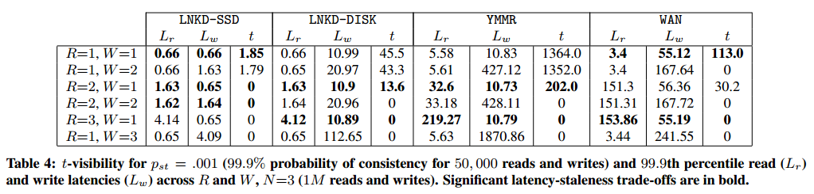

# 复制：弱一致性模型协议

既然我们已经了解了能够在越来越现实的故障情况下强制执行单副本一致性的协议，那么让我们把注意力转移到一旦我们放弃单副本一致性的要求后所出现的各种选择上。

总的来说，我们很难找到一个单一的维度来定义或描述允许副本出现分歧的协议。大多数此类协议都具有很高的可用性，关键问题在于，尽管在节点和/或网络发生故障时，副本可能会出现分歧，但最终用户是否认为这些保证、抽象和应用程序接口对他们的目的有用。

为什么弱一致性系统没有更受欢迎？

正如我在引言中所说，我认为分布式编程的大部分内容都是在处理分布式的两种后果所带来的影响：

- 信息以光速传播
- 独立事物的各自失败

对信息传播速度的限制所产生的影响是，节点以不同的、独特的方式体验世界。单个节点上的计算很容易，因为一切都按照可预测的全局总顺序进行。分布式系统上的计算则很困难，因为不存在全局总顺序。

长期以来（例如数十年的研究），我们通过引入全局总序来解决这个问题。我已经讨论过很多方法，通过在没有全局总序的地方创建有序（以容错的方式）来实现强一致性。

当然，问题在于执行顺序的成本很高。这在需要保持系统可用性的大型互联网系统中尤为明显。执行强一致性的系统并不像一个分布式系统：它表现得像一个单一系统，这对分区期间的可用性不利。

此外，对于每个操作，通常需要联系多数节点——而且通常不仅仅一次，而是两次（如你在2PC的讨论中所见）。在需要地理分布以为全球用户提供足够性能的系统中，这尤其痛苦。

因此，默认行为像单一系统可能并不可取。

或许我们想要的是一个系统，在其中我们可以编写不使用昂贵协调的代码，同时返回一个“可用”的值。与其拥有单一真相，我们将允许不同的副本彼此分歧——既为了保持效率，也为了容忍分区——然后尝试找到一种方式来处理这些分歧。

**最终一致性**表达了这个理念：节点在一段时间内可以彼此分歧，但最终它们会达成一致。

在提供最终一致性的系统中，有两种设计类型：

**具有概率性保证的最终一致性**。这种类型的系统可以在稍后的某个时间点检测到冲突的写操作，但不保证结果等同于某个正确的顺序执行。换句话说，冲突更新有时会导致用较旧的值覆盖较新的值，在正常操作（或分区期间）可能会出现一些异常。

近年来，提供单一副本一致性最具影响力的系统设计是亚马逊的 Dynamo，我将讨论它作为一种具有概率性保证的最终一致性系统的例子。

**具有强保证的最终一致性**。这种类型的系统保证结果收敛到某个正确顺序执行的公共值。换句话说，这样的系统不会产生任何异常结果；无需任何协调，你可以构建同一服务的副本，这些副本可以以任何模式通信并以任何顺序接收更新，只要它们都看到了相同的信息，它们最终会达成一致的结果。

CRDT（收敛复制数据类型）是一种数据类型，即使在网络延迟、分区和消息重排序的情况下也能保证收敛到同一值。它们是可以证明收敛的，但可以实现为CRDT的数据类型是有限的。

CALM（逻辑单调性一致性）猜想是同一原则的另一种表达：它将逻辑单调性等同于收敛。如果我们可以得出某物是逻辑单调的结论，那么无需协调运行也是安全的。汇流分析——特别是应用于Bloom编程语言时——可以用来指导程序员决定何时何地使用强一致性系统中的协调技术，以及何时在无需协调的情况下安全执行。

## 调节不同的操作顺序

不执行单拷贝一致性的系统是什么样的呢？让我们举几个例子来具体说明一下。

不强制执行单拷贝一致性的系统最明显的特征可能就是允许副本之间存在差异。这意味着没有严格定义的通信模式：副本可以彼此分离，但仍然可用并接受写入。

让我们设想一个由三个副本组成的系统，每个副本都与其他副本分开。例如，这些副本可能位于不同的数据中心，由于某种原因无法通信。在分区期间，每个副本都保持可用，接受来自某些客户端的读取和写入：

```
[Clients]   - > [A]

--- Partition ---

[Clients]   - > [B]

--- Partition ---

[Clients]   - > [C]
```

一段时间后，分区恢复，复制服务器交换信息。它们从不同的客户端接收到不同的更新，彼此产生了分歧，因此需要进行某种调节。我们希望所有副本的结果都趋于一致。

```
[A] \
    --> [merge]
[B] /     |
          |
[C] ----[merge]---> result
```

另一种思考弱一致性保证系统的方法是想象一组客户按一定顺序向两个副本发送信息。由于不存在强制执行单一总顺序的协调协议，因此信息在两个副本中的传递顺序可能不同：

```
[Clients]  --> [A]  1, 2, 3
[Clients]  --> [B]  2, 3, 1
```

从本质上讲，这就是我们需要协调协议的原因。例如，假设我们要连接一个字符串，信息 1、2 和 3 中的操作分别是

```
A: concat(concat(concat('', 'Hello '), 'World'), '!') = 'Hello World!'
B: concat(concat(concat('', 'World'), '!'), 'Hello ') = 'World!Hello '
```

这当然是不正确的。同样，我们希望出现的情况是，复制的结果趋于一致。

牢记这两个例子，让我们先看看亚马逊的 Dynamo，以建立一个基准，然后再讨论一些构建弱一致性保证系统的新方法，如 CRDT 和 CALM 定理。

## 亚马逊 Dynamo

亚马逊的 Dynamo 系统设计（2007年）可能是最著名的提供弱一致性保证但高可用性的系统。它是许多其他实际系统的基础，包括 LinkedIn 的 Voldemort、Facebook 的 Cassandra 和 Basho 的 Riak。

Dynamo 是一个最终一致性、高可用性的键值存储系统。键值存储就像一个大型哈希表：客户端可以通过`set(key, value)`设置值，并使用`get(key)`通过键检索它们。一个 Dynamo 集群由 N 个对等节点组成；每个节点负责存储一组键。

Dynamo 优先考虑可用性而非一致性；它不保证单拷贝一致性。相反，当值被写入时，副本之间可能会发生分歧；当读取键时，会有一个读取协调阶段，尝试在将值返回给客户端之前协调副本之间的差异。

对于亚马逊的许多功能来说，避免停机比确保数据完全一致更为重要，因为停机会导致业务损失和信誉受损。此外，如果数据不是特别重要，那么一个弱一致性系统可以以比传统关系型数据库（RDBMS）更低的成本提供更好的性能和更高的可用性。

由于 Dynamo 是一个完整的系统设计，除了核心的复制任务之外，还有许多不同的部分需要考虑。下图展示了一些任务，特别是如何将写入操作路由到一个节点并写入多个副本。

```
[ Client ]
    |
( Mapping keys to nodes )
    |
    V
[ Node A ]
    |     \
( Synchronous replication task: minimum durability )
    |        \
[ Node B]  [ Node C ]
    A
    |
( Conflict detection; asynchronous replication task:
  ensuring that partitioned / recovered nodes recover )
    |
    V
[ Node D]
```

在了解写入是如何被初始接受后，我们将了解冲突是如何被检测到的，以及异步复制同步任务。由于采用高可用性设计，节点可能会暂时不可用（宕机或分区），因此需要这项任务。复制同步任务可确保节点即使在发生故障后也能迅速赶上。

### 一致性哈希

无论是读取还是写入，首先需要做的是确定数据在系统中的存储位置。这需要某种类型的键到节点的映射。

在 Dynamo 中，键通过一种称为[一致性哈希](https://github.com/mixu/vnodehash)的哈希技术映射到节点（我不会详细讨论这种技术）。其主要思想是，通过客户端的简单计算，键可以映射到负责它的一组节点。这意味着客户端可以在不查询系统每个键的位置的情况下定位键；这节省了系统资源，因为哈希通常比执行远程过程调用更快。

### 部分法定人数

一旦我们知道键应该存储的位置，我们需要做一些工作来持久化该值。这是一项同步任务；我们会立即将值写入多个节点的原因是为了提供更高的持久性（例如，防止节点的即时故障）。

就像 Paxos 或 Raft 一样，Dynamo 使用法定人数来进行复制。然而，Dynamo 的法定人数是松散的（部分）法定人数，而不是严格的（多数）法定人数。

非正式地说，严格的法定人数系统是具有以下特性的法定人数系统：系统中任何两个法定人数（集合）之间存在重叠。要求多数人对更新进行投票并接受它，保证了只有一个历史被承认，因为每个多数法定人数必须在至少一个节点上重叠。例如，这就是 Paxos 所依赖的特性。

部分法定人数没有这种特性；这意味着不需要多数，并且法定人数的不同子集可能包含相同数据的不同版本。用户可以选择写入和读取的节点数：

- 用户可以选择写入成功所需的W-of-N节点数；
- 用户可以指定读取时要联系的节点数（R-of-N）。 

`W` 和 `R` 指定了写入或读取需要涉及的节点数。写入更多节点使写入稍微变慢，但增加了值不丢失的概率；从更多节点读取增加了读取值是最新的概率。

通常的建议是 `R + W > N`，因为这意味着读写法定人数在一个节点上重叠——从而减少返回陈旧值的可能性。一个典型的配置是 `N = 3`（例如，每个值有三个副本）；这意味着用户可以在以下之间选择：

```
 R = 1, W = 3;
 R = 2, W = 2 or
 R = 3, W = 1
```

更笼统地说，还是假设 `R + W > N`：

- `R = 1`，`W = N`：快速读取，慢速写入
- `R = N`，`W = 1`：写入快，读取慢
- `R = N/2` 和 `W = N/2 + 1`：对两者都有利

N 很少超过 3，因为保留这么多大量数据副本的成本很高！

正如我前面提到的，Dynamo 的论文启发了许多其他类似的设计。它们都使用了相同的基于部分法定人数的复制方法，只是 N、W 和 R 的默认值有所不同：

- Basho 的 Riak（默认 N = 3，R = 2，W = 2）
- Linkedin 的 Voldemort（N = 2 或 3，R = 1，W = 1 默认值）
- Apache 的 Cassandra（N = 3，R = 1，默认 W = 1）

还有一个细节：发送读取或写入请求时，是要求所有 N 个节点响应（Riak），还是只要求满足最小值的节点数响应（例如 R 或 W；Voldemort）。“send-to-all”的方法更快，对延迟不那么敏感（因为它只等待 N 个节点中最快的 R 或 W 节点），但效率也较低；而“send-to-minimum”的方法对延迟更敏感（因为与单个节点通信的延迟会延迟操作），但效率也更高（总体上信息/连接更少）。

当读写法定人数重叠时，例如（`R + W > N`）会发生什么情况？具体来说，人们经常声称这会产生“强一致性”。

### R + W > N 与“强一致性”相同？

不。

这并不是完全没有根据：`R + W > N` 的系统可以检测到读/写冲突，因为任何读法定人数和任何写法定人数都共享一个成员。例如，两个法定人数中至少有一个节点：

```
 1     2   N/2+1     N/2+2    N
[...] [R]  [R + W]   [W]    [...]
```

这保证了之前的写操作将在随后的读操作中被看到。然而，这仅在节点集 N 永不改变的情况下成立。因此，Dynamo 不符合这个条件，因为在 Dynamo 中，如果节点发生故障，集群成员可以变化。

Dynamo 设计为始终可写。它有一种机制处理节点故障，即在原服务器宕机时，将一个不同且无关的服务器添加到负责某些键的节点集合中。这意味着法定人数不再保证总是重叠。即使 `R = W = N` 也不合格，因为尽管法定人数大小等于 N，但这些法定人数中的节点在故障期间可能会变化。具体来说，在分区期间，如果无法达到足够数量的节点，Dynamo 将从无关但可访问的节点中添加新节点到法定人数中。

此外，Dynamo 处理分区的方式不同于强一致性模型的系统：也就是说，分区的两边都允许写操作，这意味着在至少某段时间内，系统并不像一个单一副本。因此，称 R + W > N 为“强一致性”是误导性的；这种保证仅仅是概率性的——这不是强一致性所指的。

### 冲突检测和读取修复

允许副本分歧的系统必须有一种方法最终调和两个不同的值。正如在部分法定人数方法中简要提到的，一种方法是在读取时检测冲突，然后应用一些冲突解决方法。那么，这是如何完成的呢？

一般来说，这是通过追踪数据的因果历史并补充一些元数据来完成的。客户端在从系统读取数据时必须保留元数据信息，并在写入数据库时返回元数据值。

我们已经遇到了一种实现方法：矢量时钟（vector clocks）可以用来表示一个值的历史。实际上，这就是最初的 Dynamo 设计用于检测冲突的方法。

然而，使用矢量时钟并不是唯一的选择。如果你查看许多实际系统的设计，你可以通过观察它们追踪的元数据了解很多关于它们工作原理的信息。

**无元数据**。当系统不追踪元数据，只返回值（例如，通过客户端 API），它实际上不能对并发写入做任何特殊处理。一个常见的规则是最后写入者胜出：换句话说，如果两个写入者同时写入，只有来自最慢写入者的值会被保留。

**时间戳**。通常，具有较高时间戳的值胜出。然而，如果时间不同步，许多奇怪的情况会发生，比如具有故障或快速时钟的系统中的旧数据覆盖较新的值。Facebook 的 Cassandra 是 Dynamo 的一个变体，使用时间戳而不是矢量时钟。

**版本号**。版本号可能避免一些与使用时间戳相关的问题。注意，当存在多重历史时，能够准确追踪因果关系的最小机制是矢量时钟，而不是版本号。

**矢量时钟**。使用矢量时钟，可以检测并发和过时的更新。然后进行读取修复成为可能，尽管在某些情况下（并发更改）我们需要询问客户端选择一个值。这是因为如果更改是并发的，并且我们对数据一无所知（如简单的键值存储），那么询问总比任意丢弃数据要好。

读取一个值时，客户端联系 N 个节点中的 R 个，询问它们关于某个键的最新值。它接收所有响应，丢弃那些严格较旧的值（使用矢量时钟值来检测）。如果只有一个唯一的矢量时钟+值对，它返回那个值。如果有多个并发编辑的矢量时钟+值对（例如，不可比较），那么所有这些值都会被返回。

如上所述，读取修复可能返回多个值。这意味着客户端/应用程序开发人员必须根据某些特定使用场景的标准偶尔处理这些情况。

此外，实际矢量时钟系统的一个关键组件是时钟不能无限增长——因此需要一个安全地进行垃圾收集的过程，以在容错性和存储要求之间取得平衡。

### 副本同步：Gossip 和 Merkle 树

考虑到 Dynamo 系统设计能容忍节点故障和网络分区，它需要一种方法来处理节点在分区后重新加入集群，或当一个故障节点被替换或部分恢复时。

副本同步用于在故障后使节点更新，以及定期同步副本之间的状态。

[Gossip](https://github.com/MarsonShine/MS.Microservice/blob/master/docs/patterns-of-distributed-systems/Gossip-Dissemination.md) 是一种用于同步副本的概率性技术。通信模式（例如，哪个节点联系哪个节点）不是预先确定的。相反，节点有某种概率 p 试图相互同步。每隔 t 秒，每个节点选择一个节点进行通信。这为使副本更新提供了一个超出同步任务（例如部分法定人数写入）的额外机制。

Gossip 可扩展，并且没有单点故障，但只能提供概率性保证。

为了使副本同步期间的信息交换高效，Dynamo 使用了一种称为 Merkle 树的技术，我不会详细讨论。其关键思想是数据存储可以在多个不同的粒度级别上进行哈希：表示整个内容的哈希、一半键的哈希、四分之一键的哈希，等等。

通过保持这种相当细粒度的哈希，节点可以比简单技术更高效地比较其数据存储内容。一旦节点确定哪些键具有不同的值，它们交换必要的信息以使副本更新。

### Dynamo 实践：概率性界限陈旧性（PBS）

这基本涵盖了 Dynamo 系统设计：

- 一致性哈希用于确定键的放置
- 部分法定人数用于读写操作
- 通过矢量时钟进行冲突检测和读取修复
- 使用 Gossip 进行副本同步

如何描述这样一个系统的行为？Bailis 等人（2012）的一篇相当新的论文描述了一种称为 [PBS（概率性界限陈旧性）](http://pbs.cs.berkeley.edu/)的方法，使用模拟和从实际系统收集的数据来描述这种系统的预期行为。

PBS 通过使用关于反熵（gossip）速率、网络延迟和本地处理延迟的信息来估计读操作的预期一致性水平，从而估计不一致的程度。它已在 Cassandra 中实现，其中时间信息被附带在其他消息上，并基于这种信息样本在蒙特卡洛模拟中计算估计值。

根据论文所述，在正常运行期间，最终一致数据存储通常更快，可以在几十或几百毫秒内读取一致状态。下表根据 LinkedIn（固态硬盘和 15k RPM 磁盘）和 Yammer 的经验计时数据，说明了在不同 R 和 W 设置下，99.9% 的一致读取概率所需的时间：



例如，在 Yammer 案例中，从 R=1、W=1 到 R=2、W=1，不一致窗口从 1352 毫秒减少到 202 毫秒，同时读取延迟（32.6 毫秒）仍低于最快的严格法定人数（R=3、W=1；219.27 毫秒）。

更多详情，请访问 [PBS 网站](http://pbs.cs.berkeley.edu/)和相关论文。

## 无序编程

让我们回顾一下我们希望解决的几种情况的例子。第一种情况是在分区后有三个不同的服务器；在分区恢复后，我们希望服务器的值趋于一致。亚马逊的 Dynamo 通过从 `N` 个节点中的 `R` 节点读取数据，然后执行读取调节，实现了这一目标。

在第二个例子中，我们考虑了一个更具体的操作：字符串连接。事实证明，目前还没有一种已知的技术，可以在不对操作强加顺序（例如不进行昂贵的协调）的情况下，将字符串连接解析为相同的值。不过，有些操作可以以任何顺序安全地进行，而简单的寄存器则无法做到这一点。正如 Pat Helland 写道

> 在简单的 READ/WRITE 语义无法实现换算的情况下，以操作为中心的工作可以实现换算（使用正确的操作和正确的语义）。

例如，考虑一个以两种不同方式执行 `debit` 和 `credit` 操作的简单会计系统：

- 使用寄存器进行读写操作
- 使用带有本地 `debit` 和 `credit` 操作的整数数据类型

后一种实现方式对数据类型的内部结构了解更多，因此，尽管操作被重新排序，它仍能保持操作的意图。借记或贷记操作可以以任何顺序进行，最终结果都是一样的：

```
100 + credit(10) + credit(20) = 130 and
100 + credit(20) + credit(10) = 130
```

但是，写入固定值不能按任何顺序进行：如果重新排序写入，其中一个写入将覆盖另一个：

```
100 + write(110) + write(130) = 130 but
100 + write(130) + write(110) = 110
```

让我们以本章开头的例子为例，但使用不同的操作。在这种情况下，客户端向两个节点发送消息，而这两个节点以不同的顺序查看操作：

```
[Clients]  --> [A]  1, 2, 3
[Clients]  --> [B]  2, 3, 1
```

假设我们要查找一组整数的最大值（例如 MAX()），而不是字符串连接。信息 1、2 和 3 分别是

```
1: { operation: max(previous, 3) }
2: { operation: max(previous, 5) }
3: { operation: max(previous, 7) }
```

那么，如果不进行协调，A 和 B 都会趋近于 7，例如

```
A: max(max(max(0, 3), 5), 7) = 7
B: max(max(max(0, 5), 7), 3) = 7
```

在这两种情况下，两个副本看到的更新顺序都不一样，但我们能够以一种无论顺序如何都能得到相同结果的方式合并结果。由于我们使用了合并程序 (`max`)，两种情况下的结果都趋于相同。

我们不可能编写一个适用于所有数据类型的合并过程。在 Dynamo 中，值是二进制 blob，因此能做的最好的办法就是将其公开，并要求应用程序处理每个冲突。

但是，如果我们知道数据的类型比较特殊，就可以处理这类冲突。CRDT 是一种数据结构，其设计目的是提供始终趋同的数据类型，只要它们能看到相同的操作集（以任何顺序）。

CRDTs：收敛复制数据类型

CRDTs（收敛复制数据类型）利用了特定数据类型上特定操作的交换性和结合性知识。

为了使一组操作在副本仅偶尔通信的环境中收敛到相同的值，这些操作需要对顺序无关且对（消息）重复/重新传递不敏感。因此，它们的操作需要是：

- **结合性**（Associative）：a + (b + c) = (a + b) + c，因此分组顺序无关紧要。
- **交换性**（Commutative）：a + b = b + a，因此应用顺序无关紧要。
- **幂等性**（Idempotent）：a + a = a，因此重复无关紧要。

事实证明，这些结构在数学中已经是已知的；它们被称为连接（join）或相交（meet）半格。

格是一个具有明显顶点（最小上界）和明显底点（最大下界）的偏序集。半格类似于格，但只有明显的顶点或底点。连接半格是具有明显顶点（最小上界）的半格，而相交半格是具有明显底点（最大下界）的半格。

任何可以表示为半格的数据类型都可以实现为保证收敛的数据结构。例如，计算一组值的max()将始终返回相同的结果，无论接收值的顺序如何，只要最终接收到所有值，因为max()操作是结合的、交换的和幂等的。

## CRDTs：收敛复制数据类型

CRDTs（convergent replicated datatypes, 收敛复制数据类型）利用了特定数据类型上特定操作的交换性和结合性知识。

为了使一组操作在副本仅偶尔通信的环境中收敛到相同的值，这些操作需要对顺序无关且对（消息）重复/重新传递不敏感。因此，它们的操作需要是：

- **结合性**（Associative）：`a + (b + c) = (a + b) + c`，因此分组顺序无关紧要。
- **交换性**（Commutative）：`a + b = b + a`，因此应用顺序无关紧要。
- **幂等性**（Idempotent）：`a + a = a`，因此重复无关紧要。

事实证明，这些结构在数学中已经是已知的；它们被称为连接（join）或相交（meet）[半格(semilattices)](https://en.wikipedia.org/wiki/Semilattice)。

[格(lattice)](https://en.wikipedia.org/wiki/Lattice_%28order%29)是一个具有明显顶点（最小上界）和明显底点（最大下界）的偏序集。半格类似于格，但只有明显的顶点或底点。连接半格是具有明显顶点（最小上界）的半格，而相交半格是具有明显底点（最大下界）的半格。

任何可以表示为半格的数据类型都可以实现为保证收敛的数据结构。例如，计算一组值的`max()`将始终返回相同的结果，无论接收值的顺序如何，只要最终接收到所有值，因为`max()`操作是结合的、交换的和幂等的。

例如，这里有两个格：一个是为集合绘制的格，合并运算符是 `union(items)`；另一个是为严格递增的整数计数器绘制的格，合并运算符是 `max(values)`：

```
   { a, b, c }              7
  /      |    \            /  \
{a, b} {b,c} {a,c}        5    7
  |  \  /  | /           /   |  \
  {a} {b} {c}            3   5   7
```

可以表示为半格的数据类型可以让副本以任何模式进行通信，并以任何顺序接收更新，只要它们最终看到相同的信息，它们最终会就最终结果达成一致。这是一个强大的特性，只要前提条件成立，就能得到保证。

然而，将一种数据类型表示为半格通常需要一定程度的解释。许多数据类型的操作实际上不是顺序无关的。例如，向集合中添加项是结合的、交换的和幂等的。然而，如果我们还允许从集合中移除项，那么我们需要某种方法来解决冲突操作，例如 `add(A)` 和 `remove(A)`。如果本地副本从未添加该元素，那么移除它意味着什么？这种解决方案必须以顺序无关的方式指定，并且有几种不同的选择，每种选择都有不同的权衡。

这意味着，几种常见的数据类型作为 CRDTs 有更为专业的实现，这些实现为了以顺序无关的方式解决冲突而做出了不同的权衡。与简单处理寄存器（例如，从系统的角度来看是不透明的值）的键值存储不同，使用 CRDTs 的人必须使用正确的数据类型以避免异常。

以下是一些指定为 CRDTs 的不同数据类型的示例：

- **计数器**
  - 增长型计数器（合并 = max(values); 负载 = 单个整数）
  - 正负计数器（由两个增长计数器组成，一个用于增量，一个用于减量）
- **寄存器**
  - 最后写入胜出寄存器（时间戳或版本号；合并 = max(ts); 负载 = 数据块 blob）
  - 多值寄存器（矢量时钟；合并 = 保留两者）
- **集合**
  - 增长型集合（合并 = union(items); 负载 = 集合；不允许移除）
  - 两阶段集合（由两个集合组成，一个用于添加，一个用于移除；元素可以添加一次并移除一次）
  - 唯一集合（两阶段集合的优化版本）
  - 最后写入胜出集合（合并 = max(ts); 负载 = 集合）
  - 正负集合（每个集合项有一个PN计数器）
  - 观察移除集合
- **图和文本序列**（参见论文）

为了确保无异常操作，您需要为您的特定应用找到正确的数据类型——例如，如果您知道您只会移除某个项一次，那么两阶段集合适用；如果您只会向集合中添加项而不移除它们，那么增长型集合适用。

并非所有数据结构都有已知的 CRDT 实现，但 [Shapiro 等人在最近的（2011年）综述论文](http://hal.inria.fr/docs/00/55/55/88/PDF/techreport.pdf)中对布尔值、计数器、集合、寄存器和图的 CRDT 实现进行了描述。

有趣的是，寄存器的实现与键值存储使用的实现直接对应：最后写入胜出寄存器使用时间戳或等效的东西，并简单地收敛到最大时间戳值；多值寄存器对应于 Dynamo 策略，即保留、暴露和协调并发更改。关于详细信息，我建议您查阅本章的进一步阅读部分中的论文。

## CALM 定理

CRDT 数据结构的基础在于认识到可以表示为半格的数据结构是收敛的。但编程不仅仅是状态演变，除非你只是实现一个数据存储。

显然，顺序无关性是任何收敛计算的重要属性：如果数据项接收的顺序会影响计算结果，那么在不保证顺序的情况下无法执行计算。

然而，许多编程模型中语句的顺序并不重要。例如，在 [MapReduce 模型](https://en.wikipedia.org/wiki/MapReduce)中，Map 和 Reduce 任务都被指定为无状态的元组处理任务，需要在数据集上运行。如何以及以何种顺序将数据路由到任务的具体决策没有明确指定，相反，批处理作业调度器负责调度任务在集群上运行。

类似地，在 SQL 中，人们指定查询，但不指定查询的执行方式。查询只是任务的声明性描述，查询优化器负责找出高效的执行查询方法（跨多个机器、数据库和表）。

当然，这些编程模型并不像通用编程语言那样宽松。MapReduce 任务需要能够表示为无状态的任务，在无环数据流程序中；SQL 语句可以执行相当复杂的计算，但有很多事情难以在其中表达。

然而，从这两个例子中应该清楚，有许多种数据处理任务可以用声明性语言表达，其中执行顺序没有明确指定。表达所需结果的编程模型，而将语句的确切顺序留给优化器决定，通常具有顺序无关的语义。这意味着此类程序可能可以在不协调的情况下执行，因为它们依赖于接收到的输入，但不一定依赖于接收输入的具体顺序。

关键点在于，此类程序在不协调的情况下可能是安全的。如果没有明确的规则来描述哪些操作在不协调的情况下是安全的，哪些不是，我们就无法在确定结果正确的情况下实现程序。

这就是 CALM 定理的内容。CALM 定理基于逻辑单调性与有用的最终一致性形式（例如，汇流/收敛）之间的联系。它指出，逻辑单调的程序保证最终一致。

因此，如果我们知道某个计算是逻辑单调的，那么我们也知道它在不协调的情况下执行是安全的。

为了更好地理解这一点，我们需要对比单调逻辑（或单调计算）与[非单调逻辑](http://plato.stanford.edu/entries/logic-nonmonotonic/)（或非单调计算）。

> 单调性
> 如果句子 φ 是一组前提 Γ 的结果，那么它也可以从延伸 Γ 的任意一组前提 Δ 中推断出来

大多数标准的逻辑框架是单调的：在诸如一阶逻辑等框架内做出的任何推论，一旦在演绎上是有效的，就不能被新信息所否定。而非单调逻辑则是一个系统，在该系统中这个性质不成立——换句话说，如果某些结论可以通过学习新知识而被否定，那么它就是非单调的。

在人工智能领域，非单调逻辑与[可废止推理](http://plato.stanford.edu/entries/reasoning-defeasible/)相关联——这种推理中，利用部分信息做出的断言可以被新知识所否定。例如，如果我们得知 Tweety 是一只鸟，我们会假设 Tweety 能飞；但如果我们后来得知 Tweety 是一只企鹅，那么我们就必须修正我们的结论。

单调性关乎前提（或关于世界的事实）与结论（或关于世界的断言）之间的关系。在单调逻辑内，我们知道我们的结果是不可撤销的：单调计算不需要重新计算或协调；答案会随着时间的推移变得更加准确。一旦我们知道 Tweety 是一只鸟（并且我们正在使用单调逻辑进行推理），我们可以安全地得出 Tweety 能飞的结论，并且我们学到的任何新知识都不能否定这个结论。

虽然任何产生面向人类结果的计算都可以解释为对世界的断言（例如，“foo”的值是“bar”），但在基于冯·诺依曼机编程模型的计算中确定计算是否单调是困难的，因为事实和断言之间的关系以及这些关系是否单调并不十分清楚。

然而，有许多编程模型可以确定单调性。特别是，[关系代数](https://en.wikipedia.org/wiki/Relational_algebra)（例如 SQL 的理论基础）和 [Datalog](https://en.wikipedia.org/wiki/Datalog) 提供了具有高度表达力的语言，这些语言具有良好的解释性。

基本的 Datalog 和关系代数（即使带有递归）是已知单调的。更具体地说，使用某些基本操作符表达的计算是已知单调的（选择、投影、自然连接、笛卡尔积、并集和不带否定的递归 Datalog），而使用更高级操作符（否定、集合差、除法、全称量化、聚合）会引入非单调性。

这意味着使用大量操作符（例如映射、过滤、连接、并集、交集）表达的计算在这些系统中是逻辑单调的；使用这些操作符的任何计算也是单调的，因此可以安全地在不协调的情况下运行。另一方面，使用否定和聚合的表达式在没有协调的情况下运行是不安全的。

重要的是要认识到非单调性与在分布式系统中执行代价高昂的操作之间的联系。具体来说，分布式聚合和协调协议都可以被认为是一种否定。如 Joe Hellerstein [所写](http://www.eecs.berkeley.edu/Pubs/TechRpts/2010/EECS-2010-90.pdf)：

> 在分布式环境中为了确定否定谓词的真实性，评估策略必须开始“数到0”以确定空性，并等待分布式计数过程确定结束。聚合是这个思想的推广。
>

> 这个想法也可以从另一个方向来看。协调协议本身就是聚合，因为它们需要投票：两阶段提交需要一致投票，Paxos 共识需要多数投票，而拜占庭协议需要 2/3 多数。等待需要计数。
>

因此，如果我们能够以一种可以测试单调性的方式表达我们的计算，那么我们就可以进行全程序静态分析，以检测程序的哪些部分是最终一致的并且可以在不协调的情况下安全运行（单调部分），哪些部分不是（非单调部分）。

注意，这需要一种不同类型的语言，因为对于传统编程语言来说，在其中推导这些结论是困难的，这些语言的核心是顺序、选择和迭代。这就是为什么设计 Bloom 语言的原因。

## 非单调性有什么好处？

单调性和非单调性之间的区别很有趣。例如，将两个数字相加是单调的，但在两个包含数字的节点上计算聚合则不是。区别在哪里？一个是计算（将两个数字相加），而另一个是断言（计算一个聚合）。

计算与断言有什么不同？让我们考虑查询“披萨是蔬菜吗？”。要回答这个问题，我们需要理解核心：在什么情况下可以接受推断某事是真的（或不是真的）？

有几种可接受的答案，每种答案对应我们关于所掌握的信息及我们应如何行动的不同假设——我们在不同的背景下接受不同的答案。

在日常推理中，我们做出所谓的[开放世界假设](https://en.wikipedia.org/wiki/Open_world_assumption)：我们假设我们不知道一切，因此不能从缺乏知识中得出结论。也就是说，任何句子可能是真的，假的或未知的。

```
                                OWA +             |  OWA +
                                Monotonic logic   |  Non-monotonic logic
Can derive P(true)      |   Can assert P(true)    |  Cannot assert P(true)
Can derive P(false)     |   Can assert P(false)   |  Cannot assert P(true)
Cannot derive P(true)   |   Unknown               |  Unknown
or P(false)
```

在做出开放世界假设时，我们只能安全地断言我们可以从已知中推导出的东西。我们关于世界的信息被假定是不完整的。

让我们先看看当我们知道我们的推理是单调的情况。在这种情况下，我们所拥有的任何（可能不完整的）知识都不能通过学习新知识而失效。因此，如果我们可以根据某些推理推断某个句子是真的，例如“含有两汤匙番茄酱的东西是蔬菜”和“披萨含有两汤匙番茄酱”，那么我们可以得出“披萨是蔬菜”的结论。如果我们可以推断某个句子是假的，也是同样的道理。

但是，如果我们无法推断任何东西——例如，我们所拥有的知识集包含客户信息，而不包含任何关于披萨或蔬菜的信息——那么在开放世界假设下，我们必须说我们无法得出任何结论。

对于非单调知识，现在我们知道的任何东西都可能失效。因此，即使我们可以根据当前知道的内容推断出真或假，我们也不能安全地得出任何结论。

然而，在数据库上下文中，以及在许多计算机科学应用中，我们更倾向于得出更明确的结论。这意味着假设所谓的封闭世界假设：任何不能被证明是真的东西都是假的。这意味着不需要明确声明假。在其他词中，我们拥有的事实数据库被假定为完整（最小），因此可以假设不在其中的任何东西是假的。

例如，在 CWA 下，如果我们的数据库没有从旧金山到赫尔辛基的航班记录，那么我们可以安全地得出结论说不存在这样的航班。

我们还需要一种方法来得出明确的断言：[逻辑界定](https://en.wikipedia.org/wiki/Circumscription_%28logic%29)。界定是一种形式化的推测规则。领域界定推测已知实体就是所有存在的实体。我们需要能够假设已知实体就是所有存在的实体，以便得出明确的结论。

```
                                CWA +             |  CWA +
                                Circumscription + |  Circumscription +
                                Monotonic logic   |  Non-monotonic logic
Can derive P(true)      |   Can assert P(true)    |  Can assert P(true)
Can derive P(false)     |   Can assert P(false)   |  Can assert P(false)
Cannot derive P(true)   |   Can assert P(false)   |  Can assert P(false)
or P(false)
```

特别地，非单调推理需要这种假设。只有在我们假设已经掌握了完整信息的情况下，我们才能做出自信的断言，因为额外的信息可能会使我们的断言失效。

这在实践中意味着什么？首先，单调逻辑一旦能推导出一个句子为真（或假），就可以得出明确的结论。其次，非单调逻辑需要一个额外的假设：已知的实体就是所有存在的实体。

那么，为什么两个表面上等价的操作会有所不同？为什么将两个数字相加是单调的，而在两个节点上计算聚合却不是？这是因为聚合不仅仅计算了一个和，还断言它已经看到了所有的值。保证这一点的唯一方法是跨节点进行协调，确保执行计算的节点确实看到了系统内的所有值。

因此，为了处理非单调性，需要使用分布式协调来确保在已知所有信息之后才做出断言，或者在断言时附带警告，即结论可能会在以后失效。

处理非单调性对于表达能力很重要。这归结为能够表达非单调的事情；例如，能够说某列的总和是 X 是很好的。系统必须检测到这种计算需要一个全局协调边界，以确保我们已经看到了所有的实体。

纯粹单调的系统是稀有的。似乎大多数应用即使在数据不完整的情况下也在封闭世界假设下运行，而我们人类对此也很满意。当一个数据库告诉你从旧金山到赫尔辛基没有直飞航班时，你可能会将其视为“根据这个数据库，没有直飞航班”，但你并不排除现实中可能存在这样的航班的可能性。

实际上，这个问题只有在副本可能分歧时才变得有趣（例如，在分区期间或由于正常操作期间的延迟）。然后需要更具体的考虑：答案是仅基于当前节点，还是基于整个系统。

此外，由于非单调性是由做出断言引起的，因此许多计算可能会进行很长时间，并且仅在将某些结果或断言传递给第三方系统或最终用户时才应用协调。显然，如果这些读写操作只是长时间运行计算的一部分，则系统中的每个读写操作都不必强制执行全序。

## Bloom 语言

[Bloom 语言](http://www.bloom-lang.net/)是一种为使用 CALM 定理而设计的语言。它是一种 Ruby DSL，其形式基础是一种名为 Dedalus 的时态逻辑编程语言。

在 Bloom 语言中，每个节点都有一个由集合和网格组成的数据库。程序以无序语句集的形式表达，这些语句集与集合（事实集）和网格（CRDT）交互。语句默认与顺序无关，但也可以编写非单调函数。

请访问 [Bloom 网站](http://www.bloom-lang.net/)和[教程](https://github.com/bloom-lang/bud/tree/master/docs)，了解有关 Bloom 的更多信息。

## 拓展阅读

### CALM 定理、汇合分析和 Bloom

[乔-海勒斯坦（Joe Hellerstein）在 @RICON 2012 上的演讲](https://vimeo.com/53904989)和[尼尔-康威（Neil Conway）在 @Basho 上的演讲](https://vimeo.com/45111940)都是很好的介绍。特别是关于布卢姆，请参阅[彼得-阿尔瓦罗（Peter Alvaro）在 @Microsoft 上的演讲](http://channel9.msdn.com/Events/Lang-NEXT/Lang-NEXT-2012/Bloom-Disorderly-Programming-for-a-Distributed-World)。

- [声明性要求：分布式逻辑中的经验与猜想](http://www.eecs.berkeley.edu/Pubs/TechRpts/2010/EECS-2010-90.pdf)--海勒斯坦，2010 年
- [Bloom 中的一致性分析：CALM 和集合方法](http://db.cs.berkeley.edu/papers/cidr11-bloom.pdf)--阿尔瓦罗等人，2011 年
- [分布式编程的逻辑与网格](http://db.cs.berkeley.edu/papers/UCB-lattice-tr.pdf)--Conway等人，2012年
- [Dedalus：时间和空间中的数据模型](http://db.cs.berkeley.edu/papers/datalog2011-dedalus.pdf)- Alvaro等人，2011年

### CRDTs

[Marc Shapiro 在微软的演讲](http://research.microsoft.com/apps/video/dl.aspx?id=153540)是了解 CRDT 的良好起点。

- [CRDTs：无并发控制的一致性](http://hal.archives-ouvertes.fr/docs/00/39/79/81/PDF/RR-6956.pdf)，Letitia 等人，2009 年
- [收敛和交换复制数据类型的综合研究](http://hal.inria.fr/docs/00/55/55/88/PDF/techreport.pdf)，Shapiro 等人，2011 年
- [优化的无冲突复制集](http://arxiv.org/pdf/1210.3368v1.pdf)--Bieniusa 等人，2012 年

### Dynamo；PBS；乐观复制

- [Dynamo：亚马逊的高可用键值存储](http://www.allthingsdistributed.com/files/amazon-dynamo-sosp2007.pdf) - DeCandia 等人，2007 年
- [PNUTS：雅虎的托管数据服务平台](https://scholar.google.com/scholar?q=PNUTS:+Yahoo!%27s+Hosted+Data+Serving+Platform)--Cooper 等人，2008 年
- [河口架构：支持移动用户之间的数据共享](https://scholar.google.com/scholar?q=The+Bayou+Architecture%3A+Support+for+Data+Sharing+among+Mobile+Users)--Demers 等，1994 年
- [实用部分法定人数的概率边界滞后性](http://pbs.cs.berkeley.edu/pbs-vldb2012.pdf)--Bailis 等人，2012 年
- [当今的最终一致性：限制、扩展及其他](https://queue.acm.org/detail.cfm?id=2462076)--Bailis 和 Ghodsi，2013 年
- [乐观复制](http://www.ysaito.com/survey.pdf)--Saito 和 Shapiro，2005 年