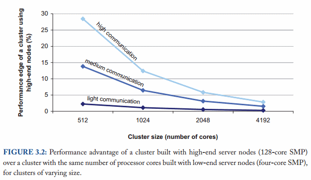
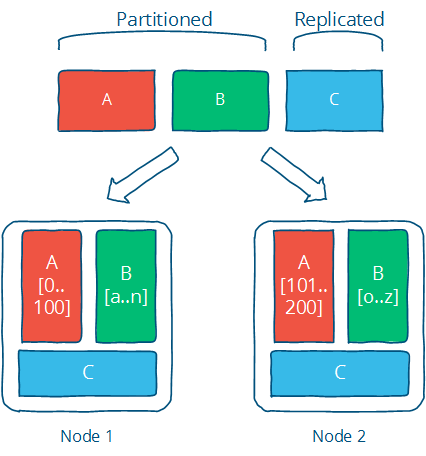

# 高层分布式系统

> 分布式编程是利用多台计算机解决同一问题的艺术。

任何计算机系统都需要完成两项基本任务：

- 存储
- 计算

分布式编程是用多台计算机解决在单台计算机上可以解决的同一问题的艺术--通常是因为该问题不再适合在单台计算机上解决。

没有任何事情真的要求你使用分布式系统。如果有无限的资金和无限的研发时间，我们就不需要分布式系统。所有的计算和存储都可以在一个神奇的盒子里完成--一个由你花钱请别人为你设计的速度惊人、可靠无比的单一系统。

然而，很少有人拥有无限的资源。因此，他们必须在现实世界的成本效益曲线上找到合适的位置。在小范围内，升级硬件是一个可行的策略。但是，随着问题规模的增大，你会发现要么能让你在单个节点上解决问题的硬件升级不存在，要么成本过高。这时，我欢迎你来到分布式系统的世界。

目前的现实情况是，只要能通过容错软件降低维护成本，中端商品硬件的价值最高。

计算主要受益于高端硬件，因为它们可以用内部内存访问取代缓慢的网络访问。在需要节点间大量通信的任务中，高端硬件的性能优势受到限制。



正如 [Barroso、Clidaras 和 Hölzle](http://www.morganclaypool.com/doi/abs/10.2200/S00516ED2V01Y201306CAC024) 所绘制的上图所示，假设所有节点的内存访问模式一致，高端硬件与商品硬件之间的性能差距会随着集群规模的扩大而缩小。

在理想情况下，增加一台新机器可以线性地提高系统的性能和容量。但这当然是不可能的，因为拥有独立的计算机会产生一些开销。数据需要复制，计算任务需要协调等等。这就是为什么值得研究分布式算法的原因--它们为特定问题提供了高效的解决方案，并指导我们了解哪些是可能的，正确实现的最低成本是多少，以及哪些是不可能的。

这篇文章的重点是分布式编程和系统在一个平凡但商业上相关的环境中:数据中心。例如,我不会讨论由于特殊网络配置或共享内存设置而产生的专门问题。此外,重点是探索系统设计空间,而不是优化任何特定的设计——后者是一个更专门的主题。

## 我们要实现的目标：可扩展性和其他好处

在我看来，一切都始于对大小的处理需求。

大多数事情在小范围内都是微不足道的，而一旦超过一定的大小、体积或其他物理限制，同样的问题就会变得难上加难。举起一块巧克力很容易，举起一座山却很难。数一个房间里有多少人容易，数一个国家有多少人就难了。

因此，一切都要从规模--**可扩展性**--开始。非正式地讲，在一个可扩展的系统中，当我们从小到大时，事情不应该变得越来越糟。这是另一个定义：

> [可扩展性](https://en.wikipedia.org/wiki/Scalability)：是指一个系统、网络或流程能够以适当的方式处理不断增长的工作量，或能够扩大以适应这种增长的能力。

这里增长的是什么？几乎可以用任何术语（人口数量、用电量等）来衡量增长。但有三件事特别值得关注：

- 规模可扩展性：增加节点应使系统的速度呈线性增长；数据集的增长不应增加延迟
- 地理可扩展性：应该可以使用多个数据中心来减少响应用户查询所需的时间，同时以某种合理的方式处理跨数据中心的延迟。
- 管理可扩展性：增加节点不应增加系统的管理成本（如管理员与机器之比）。

当然，在一个真实的系统中，增长是在多个不同的轴上同时发生的；每个指标都只是捕捉增长的某个方面。

可扩展系统是指随着规模的扩大，能够持续满足用户需求的系统。有两个特别相关的方面--性能和可用性--可以通过不同的方式来衡量。

## 性能（和延迟）

> [性能](https://en.wikipedia.org/wiki/Computer_performance)：是指计算机系统完成的有用工作与所用时间和资源相比的数量。

根据具体情况，这可能涉及实现以下一个或多个目标：

- 给定工作的响应时间短/延迟低
- 高吞吐量（处理工作的速度）
- 计算资源利用率低

在对上述任何结果进行优化时，都需要权衡利弊。例如，系统可以通过处理更大批量的工作来获得更高的吞吐量，从而减少运行开销。但这样做的代价是，由于批量处理，单个工作的响应时间会更长。

我发现，低延迟--实现较短的响应时间--是性能中最有趣的方面，因为它与物理限制（而非财务限制）有着密切联系。与性能的其他方面相比，利用财务资源解决延迟问题更为困难。

关于延迟，有很多非常具体的定义，但我非常喜欢这个词的词源所唤起的想法：

> 延迟表示潜伏的状态，延迟，指从某件事情开始到发生之间的一段时间。

潜伏(latent)的意思是：

> 潜伏，源自拉丁语 latens, latentis,lateo("隐藏")的现在分词。存在或出现但隐藏或不活跃的状态。

这个定义很酷，因为它强调了延迟实际上是指从事情发生到它产生影响或变得可见之间的时间。

例如，想象你感染了一种空气传播病毒，这种病毒会把人变成僵尸。潜伏期是指从你被感染到你变成僵尸之间的时间。这就是潜伏期：已经发生的事情被掩盖起来的时间。

让我们假设一下，我们的分布式系统只完成一项高级任务：给定一个查询，它获取系统中的所有数据并计算出一个结果。换句话说，将分布式系统看作是一个数据存储库，能够对其当前内容进行单次确定性计算（函数）：

```
result = query(all data in the system)
```

因此，对延迟而言，重要的不是旧数据的数量，而是新数据在系统中“生效”的速度。例如，延迟可以用写入到读者可见所需的时间来衡量。

基于这一定义的另一个关键点是，如果什么都没发生，就不存在“潜伏期”。数据不发生变化的系统不会（或不应该）存在延迟问题。

在分布式系统中，存在一个无法克服的最小延迟：光速限制了信息的传输速度，硬件组件每次操作都会产生最小延迟成本（例如内存和硬盘驱动器，但也包括 CPU）。

最小延迟对查询的影响程度取决于查询的性质和信息需要传输的物理距离。

## 可用性（和容错）

可拓展性系统第二个方面就是**可用性**。

> [可用性](https://en.wikipedia.org/wiki/High_availability)：系统处于运行状态的时间比例。如果用户无法访问系统，则称系统不可用。

分布式系统使我们能够实现单个系统难以实现的理想特性。例如，单台机器无法容忍任何故障，因为它要么故障，要么不故障。

**而分布式系统则可以利用一堆不可靠的组件，在它们的基础上构建一个可靠的系统。**

没有冗余的系统只能像其底层组件一样可用。有冗余的系统可以容忍部分故障，因此可用性更高。值得注意的是，“冗余”可以有不同的含义，这取决于你关注的是什么--组件、服务器、数据中心等等。

可用性公式如下：

```
可用性 = 正常运行时间/（正常运行时间 + 停机时间）。
```

从技术角度看，可用性主要是指容错性。由于发生故障的概率会随着组件数量的增加而增加，因此系统应能进行补偿，以免随着组件数量的增加而降低可靠性。

例如：

| 可用性   | 每年停机时间 |
| -------- | ------------ |
| 90%      | 超过1个月    |
| 99%      | 少于4天      |
| 99.9%    | 少于9小时    |
| 99.99%   | 少于1小时    |
| 99.999%  | ~5分钟       |
| 99.9999% | ~31秒        |

在某种意义上，可用性是一个比正常运行时间更宽泛的概念，因为服务的可用性也会受到影响，例如网络中断或拥有服务的公司倒闭（这是一个与容错无关的因素，但仍会影响系统的可用性）。但在不了解系统每个具体方面的情况下，我们能做的就是设计容错。

容错是什么意思？

> 容错性：一旦发生故障，系统还能以明确方式运行的能力

容错归根结底就是：确定你所期望的故障，然后设计出能够容错的系统或算法。你不可能容忍你没有考虑到的故障。

## 是什么阻碍了我们实现美好的愿望？

分布式系统受到两个物理因素的制约：

- 节点数量（随所需的存储和计算能力而增加）
- 节点之间的距离（信息最多以光速传播）

在这些限制条件下开展工作：

- 独立节点数量的增加会增加系统出现故障的概率（降低可用性并增加管理成本）
- 独立节点数量的增加可能会增加节点之间的通信需求（随着规模的扩大而降低性能）
- 地理距离的增加会增加远距离节点间通信的最小延迟（降低某些操作的性能）

除了这些由物理限制造成的趋势之外，还有系统设计方案的世界。

性能和可用性都是由系统的外部保证决定的。从高层次上讲，可以将保证视为系统的 SLA（服务水平协议）：如果我写入数据，在其他地方访问数据的速度如何？数据写入后，我如何保证数据的持久性？如果我要求系统运行计算，它能多快返回结果？当组件发生故障或停止运行时，会对系统产生什么影响？

还有一个标准没有明确提及，但隐含其中：可理解性。作出的保证有多容易理解？当然，什么是可理解性并没有简单的衡量标准。

我有点想把“可理解性 ”放在物理限制之下。毕竟，我们很难理解任何涉及到[比我们手指还多的活动物体的东西](https://en.wikipedia.org/wiki/Working_memory#Capacity)，这是人的硬件限制。这就是错误和异常之间的区别--错误是不正确的行为，而异常则是意想不到的行为。如果你更聪明，你就会预料到异常现象的发生。

## 抽象和模型

这就是抽象和模型发挥作用的地方。抽象可以去除现实世界中与解决问题无关的方面，从而使问题更易于管理。模型以精确的方式描述了分布式系统的关键属性。我将在下一章讨论多种模型，例如：

- 系统模型（异步/同步）
- 故障模型（崩溃-故障、分区、拜占庭）
- 一致性模型（强一致性、最终一致性）

一个好的抽象概念能使系统的工作更容易理解，同时还能捕捉到与特定目的相关的因素。

现实中存在许多节点，而我们又希望系统“像单一系统一样工作”，这两者之间存在矛盾。通常，我们最熟悉的模式（例如，在分布式系统上实现共享内存抽象）成本太高。

保证较弱的系统行动自由度更大，因此性能可能更高，但也可能难以推理。人们更擅长推理那些像单一系统而非节点集合一样运行的系统。

暴露系统内部的更多细节通常可以提高性能。例如，在列式存储中，用户可以（在一定程度上）推理键值对在系统中的位置，从而做出影响典型查询性能的决定。隐藏这类细节的系统更容易理解（因为它们更像单一单元，需要考虑的细节更少），而暴露更多现实世界细节的系统可能性能更高（因为它们更贴近现实）。

有几类故障使得编写像单一系统一样运行的分布式系统变得困难。**网络延迟**和**网络分区**（例如某些节点之间的网络完全失效）意味着系统有时需要做出艰难的选择，是保持可用性但失去一些无法执行的关键保证，还是在发生这些类型的故障时采取安全措施并拒绝客户端。

CAP 定理--我将在下一章讨论--捕捉到了其中的一些紧张关系。最终，理想的系统既能满足程序员的需求（清晰的语义），又能满足业务需求（可用性/一致性/延迟）。

## 设计技术：分区和复制

数据集在多个节点之间的分布方式非常重要。要进行任何计算，我们都需要找到数据，然后对其采取行动。

有两种基本技术可用于数据集。可以将数据分割到多个节点上（分区），以便进行更多并行处理。也可以在不同的节点上复制或缓存数据，以缩短客户端与服务器之间的距离，提高容错能力（复制）。

> 分而治之--我的意思是分割和复制。

下图说明了两者之间的区别：分区数据（下图中的 A 和 B）被划分为独立的数据集，而复制数据（下图中的 C）被复制到多个位置。



这是解决任何涉及分布式计算问题的一记重拳。当然，诀窍在于为您的具体实现选择正确的技术；有许多算法可以实现复制和分区，每种算法都有不同的局限性和优势，需要根据您的设计目标进行评估。

### 分区

分区是指将数据集划分为不同的独立小集；这用于减少数据集增长的影响，因为每个分区都是数据的一个子集。

- 分区可限制需要检查的数据量，并将相关数据定位在同一分区中，从而提高性能。
- 分区可以提高可用性，因为它允许分区独立失败，需要更多节点失败才会影响可用性。

分区在很大程度上也与特定应用有关，因此在不了解具体情况的情况下很难对其进行深入探讨。这就是为什么大多数文章（包括本文章）的重点是复制。

分区主要是根据你认为的主要访问模式来定义分区，并处理独立分区带来的限制（如跨分区访问效率低、增长率不同等）。

### 复制

复制是指在多台机器上复制相同的数据；这样可以让更多服务器参与计算。

请允许我不准确地引用霍默-辛普森（Homer J. Simpson）的话：

> 对于复制，这是造成生活中所有问题的原因，也是解决这些问题的办法。

复制--拷贝或重现某些东西--是我们消除延迟的主要方法。

- 复制可将额外的计算能力和带宽用于新的数据副本，从而提高性能
- 复制可以通过创建数据的额外副本来提高可用性，需要更多节点失败才会影响可用性。

复制是为了提供额外的带宽，并在重要的地方进行缓存。此外，复制还需要根据某种一致性模型，以某种方式保持一致性。

通过复制，我们可以实现可扩展性、性能和容错。害怕丧失可用性或降低性能？复制数据以避免瓶颈或单点故障。计算速度慢？在多个系统上复制计算。I/O 速度慢？将数据复制到本地缓存以减少延迟，或复制到多台机器上以提高吞吐量。

复制也是许多问题的根源，因为现在有独立的数据副本，必须在多台机器上保持同步--这意味着要确保复制遵循一致性模型。

一致性模型的选择至关重要：一个好的一致性模型能为程序员提供简洁的语义（换句话说，它所保证的属性易于推理），并能满足业务/设计目标，如高可用性或强一致性。

只有一种复制的一致性模型--强一致性--允许你在编程时假设底层数据没有被复制。其他一致性模型会向程序员暴露复制的一些内部信息。不过，较弱的一致性模型可以提供更低的延迟和更高的可用性，而且并不一定更难理解，只是不同而已。

## 拓展阅读

- [作为计算机的数据中心--仓库规模机器设计导论](http://www.morganclaypool.com/doi/pdf/10.2200/s00193ed1v01y200905cac006)--Barroso & Hölzle, 2008 年
- [分布式计算的谬误](https://en.wikipedia.org/wiki/Fallacies_of_Distributed_Computing)
- [年轻血液的分布式系统笔记](https://www.somethingsimilar.com/2013/01/14/notes-on-distributed-systems-for-young-bloods/)--霍奇斯，2013年