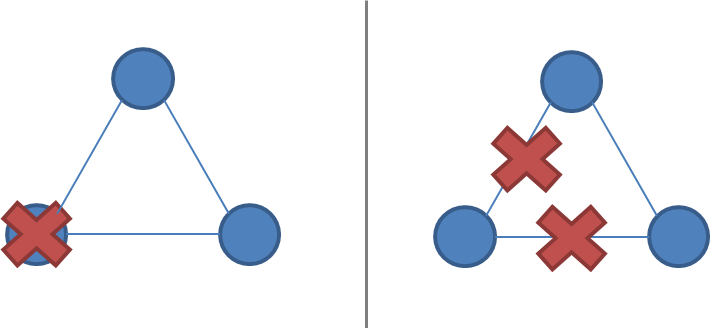

# 复制

复制问题是分布式系统中的众多问题之一。我选择将重点放在复制问题上，而不是其他问题上，如领导者选举、故障检测、互斥、共识和全局快照，因为这往往是人们最感兴趣的部分。例如，并行数据库的一种区分方式就是其复制功能。此外，复制还为领导者选举、故障检测、共识和原子广播等许多子问题提供了背景。

复制是一个群体通信问题。什么样的安排和通信模式能提供我们所期望的性能和可用性特征？面对网络分区和同时发生的节点故障，我们如何才能确保容错性、持久性和非发散性？

同样，复制的方法有很多种。我在这里采用的方法只是着眼于复制系统可能采用的高级模式。直观地了解这些有助于将讨论重点放在整体模式上，而不是涉及的具体信息传递上。我的目标是探索设计空间，而不是解释每种算法的具体细节。

首先，让我们定义一下复制的样子。我们假定有一些初始数据库，而客户发出的请求会改变数据库的状态。


安排和交流模式可分为几个阶段：

1. (请求）客户端向服务器发送请求
2. (同步）复制的同步部分进行
3. (响应）向客户端返回响应
4. (异步）复制的异步部分进行。

此模型大致基于这篇文章。请注意，任务各部分的消息交换模式取决于具体算法：我有意不讨论具体算法。

考虑到这些阶段，我们可以创建什么样的通信模式？我们选择的模式对性能和可用性有什么影响？

## 同步复制

第一种模式是同步复制（也称为主动复制、急切复制、推送复制或悲观复制）。让我们画出它的样子：


在这里，我们可以看到三个不同的阶段：首先，客户端发送请求。接下来是我们所说的复制的同步部分。这个术语指的是客户端被阻塞--等待系统的回复。

在同步阶段，第一台服务器会联系另外两台服务器，并等待收到所有其他服务器的回复。最后，它向客户机发送回复，告知结果（如成功或失败）。

所有这些看起来都很简单。在不讨论同步阶段算法细节的情况下，我们能对这种特定的通信模式安排说些什么呢？首先，请注意这是一种写 N - of - N 的方法：在返回响应之前，系统中的每个服务器都必须看到并确认该响应。

从性能的角度来看，这意味着系统的速度与系统中最慢的服务器速度一样快。系统对网络延迟的变化也非常敏感，因为它要求每个服务器在继续之前都要回复。

考虑到 N-of-N 方法，系统不能容忍任何服务器的丢失。当一台服务器丢失时，系统就无法再向所有节点写入数据，从而无法继续运行。系统也许可以提供对数据的只读访问，但在这种设计中，节点失效后是不允许修改的。

这种安排可以提供非常强的耐久性保证：客户端可以确定，在返回响应时，所有 N 个服务器都已接收、存储并确认了请求。要想丢失已接受的更新，就必须丢失所有 N 份副本，这已经是最好的保证了。

## 异步复制

让我们将其与第二种模式--异步复制（又称被动复制、拉动复制或懒惰复制）进行对比。正如你可能已经猜到的，这与同步复制正好相反：


在这种情况下，主服务器（/领导者/协调者）会立即向客户端发回响应。它最多只能将更新存储在本地，但不会同步进行任何重要工作，客户端也不会被迫等待服务器之间发生更多轮通信。

在稍后阶段，复制任务的异步部分开始执行。在此，主服务器使用某种通信模式联系其他服务器，其他服务器更新它们的数据副本。具体细节取决于所使用的算法。

在不涉及算法细节的情况下，我们能对这种具体流程说些什么呢？这是一种“写 1 - of - N”的方法：立即返回响应，稍后进行更新传播。

从性能角度看，这意味着系统运行速度很快：客户端无需花费额外时间等待系统内部人员完成工作。系统对网络延迟的容忍度也更高，因为内部延迟的波动不会给客户端带来额外的等待时间。

这种安排只能提供较弱的或概率性的持久性保证。如果不出意外，数据最终会复制到所有 N 台机器上。但是，如果包含数据的唯一服务器在复制之前丢失，数据就会永久丢失。

采用 1-of-N 方法，只要至少有一个节点正常运行，系统就能保持可用（至少理论上是这样，但实际上负载可能会过高）。这种纯粹的“懒惰”方法不提供任何耐久性或一致性保证；你可以被允许向系统写入数据，但不能保证在发生任何故障时你能读回写入的数据。

最后，值得注意的是，被动复制无法确保系统中的所有节点始终包含相同的状态。如果你接受在多个位置写入，却不要求这些节点同步同意，那么你将面临分歧的风险：从不同位置读取可能会返回不同的结果（尤其是在节点故障和恢复之后），而且全局约束（需要与每个人通信）也无法执行。

我还没有真正提到读取（而不是写入）过程中的通信模式，因为读取模式实际上与写入模式如出一辙：在读取过程中，你希望接触的节点越少越好。我们将在讨论 [quorum](https://github.com/MarsonShine/MS.Microservice/blob/master/docs/patterns-of-distributed-systems/Quorum.md) 时进一步讨论这个问题。

我们只讨论了两种基本安排，并没有涉及具体的算法。然而，我们已经能够弄清楚许多可能的通信模式，以及它们的性能、持久性保证和可用性特性。

## 主要复制方法概述

在讨论了同步复制和异步复制这两种基本复制方法后，让我们来看看主要的复制算法。

复制技术有很多很多不同的分类方法。我想介绍的第二个区别（继同步与异步之后）是同步与异步之间的区别：

- 防止分歧的复制方法（单副本系统）
- 可能出现分歧的复制方法（多主系统）

第一类方法具有“行为类似于单一系统”的特性。特别是，当出现部分故障时，系统会确保只有单个系统副本处于活动状态。此外，系统还能确保副本始终保持一致。这就是所谓的共识问题。

如果多个进程（或计算机）在某个值上达成一致，就能达成共识。更正式的说法是：

- 一致性：每个正确的进程都必须就相同的值达成一致。
- 完整性：每个正确的进程最多决定一个值，如果它决定了某个值，那么这个值一定是由某个进程提出的。
- 终止：所有进程最终都会做出决定。
- 有效性：如果所有正确的进程都提出了相同的值 V，那么所有正确的进程都会决定 V。

相互排斥、领导者选举、多播和原子广播都是更普遍的共识问题的实例。保持单副本一致性的复制系统需要以某种方式解决共识问题。

保持单副本一致性的复制算法包括

- 1n 消息（异步主/备份）
- 2n 条信息（同步主/备份）
- 4n 条信息（2阶段提交，Multi-Paxos）
- 6n 条信息（3阶段提交、重复领导者选举的 Paxos）

这些算法的容错能力（例如可容忍的故障类型）各不相同。我之所以简单地按照算法执行过程中交换的消息数量来分类，是因为我认为，试图找到“我们用增加的消息交换量买到了什么？”这个问题的答案是很有趣的。

下图改编自谷歌的 Ryan Barret，描述了不同选项的一些方面：


上图中的一致性、延迟、吞吐量、数据丢失和故障转移特性实际上可以追溯到两种不同的复制方法：同步复制（例如，在响应前等待）和异步复制。等待时，性能较差，但保证更强。当我们讨论分区（和延迟）容错时，2-PC 和法定人数系统之间的吞吐量差异就会显现出来。

在该图中，执行弱（/最终）一致性的算法被归为一类（“Gossip”）。不过，我将更详细地讨论弱一致性的复制方法--gossip 系统和（部分）法定人数系统。“事务” 一行实际上指的是全局谓词评估，弱一致性系统不支持全局谓词评估（尽管可以支持局部谓词评估）。

值得注意的是，执行弱一致性要求的系统采用的通用算法较少，而可选择性应用的技术较多。由于不执行单副本一致性的系统可以像由多个节点组成的分布式系统一样自由运行，因此需要解决的明显目标就比较少，更多的是关注提供一种方式，让人们能够理解他们所拥有系统的特性。

例如：

- 以客户端为中心的一致性模型试图在允许发散的同时提供更易懂的一致性保证。
- CRDT（收敛和换向复制数据类型）利用了某些基于状态和操作的数据类型的半格属性（关联性、换向性、幂等性）。
- 汇流分析（如布隆语言）利用计算的单调性信息，最大限度地利用无序性。
- PBS（probabilistically bounded staleness）使用模拟和从现实系统中收集的信息来描述部分法定人数系统的预期行为。

下面我将进一步讨论所有这些问题，首先，让我们来看看保持单副本一致性的复制算法。

## 主/备复制

主/备复制（也称为主副本复制、主从复制或日志运输）可能是最常用的复制方法，也是最基本的算法。所有更新都在主副本上进行，操作日志（或者说更改日志）通过网络传送到备份副本。有两种变体：

- 异步主/备份复制
- 同步主/备份复制

同步版本需要两条信息（“更新”+“确认收到”），而异步版本只需一条信息（“更新”）即可运行。

主/备复制非常常见。例如，MySQL 复制默认使用异步版本。MongoDB 也使用 P/B（还有一些用于故障转移的附加程序）。所有操作都在一台主服务器上执行，主服务器将这些操作序列化到本地日志中，然后异步复制到备份服务器上。

正如我们之前在异步复制的上下文中所讨论的，任何异步复制算法都只能提供微弱的耐用性保证。在 MySQL 复制中，这表现为复制滞后：异步备份总是比主服务器晚至少一个操作。如果主数据库发生故障，那么尚未发送到备份的更新就会丢失。

主/备份复制的同步变体可确保写入内容在返回客户端之前已存储在其他节点上，但代价是需要等待其他复制的响应。但值得注意的是，即使是这种变体，也只能提供微弱的保证。请考虑以下简单的故障情况：

- 主副本接收到写操作并将其发送给备份
- 备份持久化并 ACK 该写操作
- 然后主服务器在向客户端发送 ACK 之前发生故障

客户端现在认为提交失败了，但备份提交了；如果将备份提升为主用，则会出现错误。可能需要手动清理，以协调失败的主备份或不同的备份。

当然，我在这里做了简化。虽然所有的主/备份复制算法都遵循相同的一般消息传递模式，但它们在处理故障转移、副本长时间离线等问题上有所不同。不过，在这种方案中，主服务器不可能对不恰当的故障具有弹性。

基于日志发送/主/备份的方案的关键在于，它们只能提供尽力而为的保证（例如，如果节点在不恰当的时间发生故障，它们很容易丢失更新或更新不正确）。此外，P/B 方案还容易出现 “脑裂”（split-brain）现象，即由于临时网络问题导致故障切换到备份，从而使主用和备份同时处于活动状态。

为了防止不合时宜的故障导致一致性保证被违反，我们需要增加一轮消息传递，这就是两阶段提交协议（2PC）。

## 两阶段提交（2PC）

[两阶段提交（2PC）](https://github.com/MarsonShine/MS.Microservice/blob/master/docs/patterns-of-distributed-systems/Two-Phase-Commit.md)是许多经典关系数据库中使用的一种协议。例如，MySQL Cluster（不要与普通 MySQL 混淆）使用 2PC 提供同步复制。下图说明了信息流：

```
[ Coordinator ] -> OK to commit?     [ Peers ]
                <- Yes / No

[ Coordinator ] -> Commit / Rollback [ Peers ]
                <- ACK
```

在第一阶段（投票），协调者向所有参与者发送更新。每个参与者处理更新并投票决定是提交还是放弃。当投票决定提交时，参与者会将更新存储到一个临时区域（先写日志）。在第二阶段完成之前，更新被视为临时的。

在第二阶段（决定），协调人决定结果并通知每个参与者。如果所有参与者都投票决定提交，那么更新就会从临时区域被永久保存。

在提交被视为永久性之前设置第二阶段非常有用，因为它允许系统在节点出现故障时回滚更新。相比之下，在主节点/备份节点（“1PC”）中，没有回滚在某些节点上失败而在其他节点上成功的操作的步骤，因此副本可能会出现偏差。

2PC 容易出现阻塞，因为单个节点故障（参与者或协调者）会阻塞进程，直到该节点恢复。而在第二阶段，其他节点会被告知系统状态，因此恢复通常是可能的。请注意，2PC 假定每个节点稳定存储的数据永远不会丢失，也没有节点永远崩溃。如果稳定存储器中的数据在崩溃时损坏，数据仍有可能丢失。

节点故障期间的恢复程序细节相当复杂，我就不多说了。主要任务是确保向磁盘的写入是持久的（例如，刷新到磁盘而不是缓存），并确保做出正确的恢复决策（例如，了解一轮的结果，然后在本地重做或撤销更新）。

正如我们在有关 CAP 的章节中所了解到的，2PC 是一种 CA - 它不具有分区容忍性。2PC 解决的故障模型不包括网络分区；从节点故障中恢复的规定方法是等待网络分区愈合。如果一个协调器失效，也没有安全的方法来提升一个新的协调器；而是需要人工干预。2PC 对延迟也相当敏感，因为它是一种 N-N 写入方法，在这种方法中，只有最慢的节点确认后才能继续写入。

2PC 在性能和容错之间取得了很好的平衡，因此在关系数据库中很受欢迎。不过，较新的系统通常使用**分区容错共识算法**，因为这种算法可以从临时网络分区中自动恢复，并能更从容地处理节点间延迟的增加。

接下来让我们看看分区容错共识算法。

## 分区容错共识算法

在保持单副本一致性的容错算法方面，分区容错共识算法是我们所要研究的极限。还有一类容错算法：[可容忍任意（拜占庭）故障的算法](https://en.wikipedia.org/wiki/Byzantine_fault_tolerance)；其中包括恶意行为导致故障的节点。这类算法很少用于商业系统，因为它们的运行成本更高，实现起来也更复杂--因此我将不考虑它们。

说到分区容错共识算法，最著名的算法是 Paxos 算法。不过，该算法在实现和解释方面的难度是出了名的，因此我将重点介绍 Raft，这是一种最近（约 2013 年初）设计的算法，更易于教学和实现。让我们先来看看网络分区和分区容错共识算法的一般特点。

### 什么是网络分区

网络分区是指一个或多个节点的网络链接出现故障。节点本身继续保持活动状态，甚至还能接收来自网络分区一侧客户端的请求。正如我们之前在讨论 CAP 定理时了解到的，网络分区确实会发生，但并非所有系统都能从容应对。

网络分区之所以棘手，是因为在网络分区期间，无法区分远程节点故障和节点不可达。如果发生网络分区，但没有节点发生故障，那么系统就会被分为两个分区，同时处于活动状态。下面两张图说明了网络分区与节点故障的相似之处。

由 2 个节点组成的系统，故障与网络分区：


由 3 个节点组成的系统，存在故障与网络分区：



强制执行单副本一致性的系统必须有某种方法来打破对称性：否则，它就会分裂成两个独立的系统，而这两个系统可能会相互背离，无法再保持单副本的假象。

执行单副本一致性的系统的网络分区容忍度要求在网络分区期间，系统只有一个分区保持活动状态，因为在网络分区期间不可能防止分歧（如 CAP 定理）。

### 多数决定

这就是分区容忍共识算法依赖于多数表决的原因。要求多数节点（而不是所有节点（如 2PC 算法））同意更新，允许少数节点因网络分区而宕机、运行缓慢或无法访问。只要 N 个节点中的（N/2 + 1）个节点正常运行并可访问，系统就能继续运行。

分区容忍共识算法使用奇数节点（如 3、5 或 7）。如果只有两个节点，在故障发生后就不可能有明显的多数。例如，如果节点数为 3 个，那么系统可以抵御一个节点的故障；如果节点数为 5 个，那么系统可以抵御两个节点的故障。

当发生网络分区时，分区的行为是不对称的。一个分区将包含大部分节点。少数分区将停止处理操作，以防止在网络分区期间出现分歧，但多数分区仍可保持激活状态。这样可以确保只有一份系统状态副本处于活动状态。

多数分区之所以有用，还因为它们可以容忍分歧：如果出现扰动或故障，节点可能会以不同的方式投票。不过，由于只能有一个多数决定，暂时的分歧最多只能阻止协议继续进行（放弃有效性），但不能违反单副本一致性准则（安全属性）。

### 角色

有两种方法可以构建一个系统：所有节点可以承担相同的责任，或者节点可以承担独立、不同的角色。

用于复制的共识算法通常选择让每个节点承担不同的职责。有一个固定的领导者或主服务器是一种优化，能使系统更有效率，因为我们知道所有更新都必须通过该服务器。不是领导者的节点只需将其请求转发给领导者即可。

需要注意的是，拥有不同的角色并不妨碍系统从领导者（或任何其他角色）的故障中恢复。在正常运行期间，角色是固定的，但这并不意味着不能通过在故障后重新分配角色（如通过领导者选举阶段）来恢复故障。节点可以重复使用领导者选举的结果，直到发生节点故障和/或网络分区。

Paxos 和 Raft 都使用不同的节点角色。特别是，它们都有一个 Leader 节点（Paxos 中的“提议者（proposer）”），在正常运行期间负责协调。在正常运行期间，其他节点都是 Followers（Paxos 中为“接受者”或“投票者”）。

### 纪元（Epochs）

在 Paxos 和 Raft 中，正常运行的每个时期都称为一个纪元（Raft 中称为 “任期（Term）”）。在每个纪元中，只有一个节点被指定为领导者（[在日本](https://en.wikipedia.org/wiki/Japanese_era_name)也使用类似的系统，在皇室继承时，纪元名称会发生变化）。


选举成功后，同一领导者会一直坐标到纪元结束。如上图所示（摘自 Raft 论文），有些选举可能会失败，导致纪元立即结束。

纪元作为一个逻辑时钟，允许其他节点识别过时节点何时开始通信--被分区或停止运行的节点的纪元号将小于当前的纪元号，它们的命令将被忽略。

### 通过决斗更换领导者

在正常运行期间，分区容错共识算法相当简单。正如我们前面所看到的，如果我们不在乎容错，我们可以直接使用 2PC。实际上，大部分复杂性都来自于确保共识决策一旦做出，就不会丢失，并且协议能够处理因网络或节点故障而导致的领导者变更。

所有节点开始时都是跟随者；一个节点在开始时被选为领导者。在正常运行期间，领导者会保持心跳，以便跟随者检测领导者是否失效或被分割。

当节点检测到领导者已无响应（或在初始情况下，不存在领导者）时，它就会切换到中间状态（在 Raft 中称为“候选”），在这种状态下，它的 term/epoch 值会递增一个，并启动领导者选举，竞争成为新的领导者。

要当选领导者，节点必须获得多数选票。分配选票的一种方法是简单地按照先到先得的原则分配选票；这样，最终就会选出一位领导者。在两次尝试当选之间增加一个随机的等待时间，可以减少同时尝试当选的节点数量。

### 一个纪元内编号的提案

在每个纪元中，领导者每次提出一个值供投票表决。在每个纪元中，每个提案都有一个唯一的严格递增编号。追随者（投票者/接受者）接受他们收到的第一个特定提案编号的提案。

### 正常运行

在正常运行期间，所有提议都要经过领导者节点。当客户端提交建议（如更新操作）时，领导者会联系法定人数中的所有节点。如果没有竞争提案（基于跟随者的响应），领导者就会提出值。如果大多数追随者都接受该值，则认为该值已被接受。

由于有可能另一个节点也在试图充当领导者，因此我们需要确保一旦单个提议被接受，其值就永远不会改变。否则，已经被接受的提议可能会被竞争领导者撤销。兰波特（Lamport）指出了这一点：

> P2：如果一个具有 v 值的提案被选中，那么每个被选中的编号更高的提案都具有 v 值。

要确保这一属性成立，就要求追随者和提议者都受到算法的限制，不得改变已被多数人接受的值。请注意，“值永远不会改变”指的是协议单次执行（或运行/实例/决策）的值。一个典型的复制算法会运行多个算法执行，但大多数关于算法的讨论都集中在单次运行上，以保持简单。我们要防止决策历史被更改或覆盖。

为了执行这一特性，提议者必须先向追随者询问他们（编号最高的）已接受的提议和值。如果提议者发现已有提议，那么它就必须完成协议的执行，而不是提出自己的提议。兰波特是这样说的：

> P2b.如果选择了具有 v 值的提案，那么任何提案人发布的每一份编号更高的提案都具有 v 值。

更具体地说：

> P2c.对于任意的值 v 和编号 n，如果一个编号为 n 且值为 v 的提案被 [领导者] 提出，那么存在一个由多数 [追随者] 组成的集合 S，使得以下两种情况之一成立：
>
> (a) S 中的任何 [追随者] 都没有接受过编号小于 n 的任何提案，或者
>
> (b) 在 S 中所有编号小于 n 的已被 [追随者] 接受的提案中，v 是编号最高的提案的值。

这是 Paxos 算法及其衍生算法的核心。在协议的第二阶段才会选择要提议的值。提议者有时必须简单地重新传递之前做出的决定，以确保安全（如 P2c 中的条款 b），直到他们知道可以自由施加自己的提议值（如条款 a）。

如果之前有多个提议，则提议编号最高的提议值。只有在没有竞争提案的情况下，提议者才可尝试提出自己的提案值。

为确保在提议者向每个接受者询问其最新提议值之间不会出现竞争提议，提议者会要求追随者不要接受提议编号低于当前提议值的提议。

综上所述，使用 Paxos 做出决定需要两轮沟通：

```
[ Proposer ] -> Prepare(n)                                [ Followers ]
             <- Promise(n; 如果过去接受过以前的建议
             	之前的提议编号和之前的值)

[ Proposer ] -> AcceptRequest(n,						  [ Followers ]
				自己的值或与关注者报告的最高提案号相关联的值                           
                )
                <- Accepted(n, value)
```

在准备阶段，提议者可以了解任何竞争提案或先前的提案。第二阶段是提出新值或先前接受的值的阶段。在某些情况下，例如两个提议者同时活跃（决斗）；如果信息丢失；或者如果大多数节点失效，那么任何提议都不会被大多数人接受。但这种情况是可以接受的，因为关于提议哪个值的决策规则会趋向于一个单一的值（上一次尝试中提议数最高的值）。

事实上，根据 FLP 不可能性结果，这已经是我们能做到的最好结果了：当信息传递边界的保证不成立时，解决共识问题的算法要么放弃安全性，要么放弃有效性。Paxos 放弃了有效性：它可能不得不无限期地推迟决策，直到某个时间点上没有竞争的领导者，并且大多数节点都接受了某个提议。这比违反安全保证更可取。

当然，实现这种算法比听起来要难得多。即使是在专家手中，也会有许多小问题导致代码量相当大。这些问题包括

- 实际优化
  - 通过领导[租约](https://github.com/MarsonShine/MS.Microservice/blob/master/docs/patterns-of-distributed-systems/Lease.md)（而非心跳）避免重复领导者选举
  - 在领导者身份不变的稳定状态下，避免重复发送提议信息
- 确保追随者和提议者不会丢失稳定存储中的项，并确保存储在稳定存储中的结果不会受到微妙的损坏（如磁盘损坏）
- 使集群成员以安全的方式发生变化（例如，基本 Paxos 依赖于多数总是在一个节点相交这一事实，而如果成员可任意变化，这一事实就不成立了）
- 在发生崩溃、磁盘丢失或配置新节点后，以安全高效的方式更新新副本的程序
- 在一段合理的时间后对保证安全性所需的数据进行快照和垃圾回收的程序（例如，平衡存储要求和容错要求）

谷歌的 [Paxos Made Live](https://labs.google.com/papers/paxos_made_live.html) 论文详细介绍了其中的一些挑战。

## 分区容错共识算法：Paxos、Raft、ZAB

希望这能让你对分区容错共识算法的工作原理有所了解。我鼓励你阅读“拓展阅读”部分的论文，以了解不同算法的具体细节。

### Paxos

Paxos 是编写强一致性分区容错复制系统时最重要的算法之一。谷歌的许多系统都使用了该算法，包括 [BigTable](https://research.google.com/archive/bigtable.html)/[Megastore](https://research.google.com/pubs/pub36971.html) 使用的 [Chubby 锁管理器](https://research.google.com/archive/chubby.html)、谷歌文件系统以及 [Spanner](https://research.google.com/archive/spanner.html)。

Paxos 以希腊 Paxos 岛命名，最初由莱斯利-兰波特（Leslie Lamport）于 1998 年在一篇名为“兼职议会（The Part-Time Parliament）”的论文中提出。人们通常认为它很难实现，一些拥有丰富分布式系统专业知识的公司已经发表了一系列论文来解释更多实际细节（请参阅“拓展阅读”）。您不妨在[这里](http://research.microsoft.com/en-us/um/people/lamport/pubs/pubs.html#lamport-paxos)和[这里](http://research.microsoft.com/en-us/um/people/lamport/pubs/pubs.html#paxos-simple)阅读 Lamport 对此问题的评论。

这些问题主要与以下事实有关：Paxos 是以单轮共识决策的方式进行描述的，但实际的工作实施通常希望高效地运行多轮共识。这就导致在[核心协议上开发了许多扩展协议](https://en.wikipedia.org/wiki/Paxos_algorithm)，而任何有兴趣构建基于 Paxos 系统的人都还需要消化这些扩展协议。此外，还有一些额外的实际挑战，例如如何促进群组成员的变更。

### ZAB

ZAB - Zookeeper 原子广播协议用于 Apache Zookeeper。Zookeeper 是一个为分布式系统提供协调原语的系统，许多以 Hadoop 为中心的分布式系统（如 [HBase](http://hbase.apache.org/)、[Storm](http://storm-project.net/)、[Kafka](http://kafka.apache.org/)）都使用它来进行协调。Zookeeper 基本上是开源社区版本的 Chubby。从技术上讲，原子广播是一个不同于纯共识的问题，但它仍属于确保强一致性的分区容忍算法。

### Raft

Raft 是最近（2013 年）加入该算法系列的新算法。与 Paxos 相比，它的设计更易于教学，同时提供相同的保证。特别是，算法的不同部分被更清晰地分开，论文还描述了一种群成员变更机制。最近，[etcd](https://github.com/coreos/etcd) 在 ZooKeeper 的启发下采用了该算法。

## 强一致性的复制方法

在本章中，我们将介绍可执行强一致性的复制方法。从同步工作和异步工作的对比开始，我们逐步深入到可容忍日益复杂故障的算法。以下是每种算法的一些主要特点：

### 主/备份

- 单一、静态的主服务器
- 复制日志，从服务器不参与执行操作
- 复制延迟无限制
- 无分区容错
- 手动/临时故障切换，不容错，“热备份”

### 2PC

- 一致表决：提交或中止
- 静态主节点
- 2PC 无法在提交期间协调器和节点同时失效的情况下生存
- 不能容忍分区，对尾部延迟敏感

### Paxos

- 多数表决
- 动态主节点
- 作为协议的一部分，可承受 n/2-1 次同时故障
- 对尾部延迟不那么敏感

## 拓展阅读

### 主备和2PC

- Robbert van Renesse 和 Rachid Guerraoui，2010 年
- [数据库系统中的并发控制与恢复](http://research.microsoft.com/en-us/people/philbe/ccontrol.aspx)

### Paxos

- [The Part-Time Parliament](http://research.microsoft.com/users/lamport/pubs/lamport-paxos.pdf)--Leslie Lamport
- [简单的 Paxos](http://research.microsoft.com/users/lamport/pubs/paxos-simple.pdf)--Leslie Lamport，2001 年
- [活用 Paxos--工程视角](https://research.google.com/archive/paxos_made_live.html)--钱德拉等人
- [实用 Paxos](https://scholar.google.com/scholar?q=Paxos+Made+Practical)--Mazieres，2007 年
- [重新审视 Paxos 算法](http://groups.csail.mit.edu/tds/paxos.html)--Lynch 等人
- [如何利用共识构建高可用性系统](http://research.microsoft.com/lampson/58-Consensus/Acrobat.pdf)--Butler Lampson
- [重新配置状态机](http://research.microsoft.com/en-us/um/people/lamport/pubs/reconfiguration-tutorial.pdf) - Lamport 等人 - 更改集群成员资格
- [使用状态机方法实现容错服务：教程](http://citeseer.ist.psu.edu/viewdoc/summary?doi=10.1.1.20.4762)- Fred Schneider

### Raft 和 ZAB

- [寻找可理解的共识算法](https://ramcloud.stanford.edu/wiki/download/attachments/11370504/raft.pdf)，Diego Ongaro, John Ousterhout, 2013
- [Raft 讲座 - 用户研究](https://www.youtube.com/watch?v=YbZ3zDzDnrw)
- [一个简单的完全有序广播协议](http://labs.yahoo.com/publication/a-simple-totally-ordered-broadcast-protocol/) - Junqueira、Reed，2008 年
- [ZooKeeper 原子广播](http://labs.yahoo.com/publication/zab-high-performance-broadcast-for-primary-backup-systems/)--Reed，2011 年