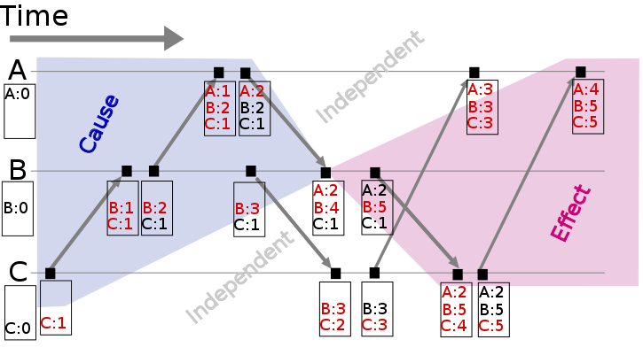

# 时序

什么是顺序？为什么它很重要

什么叫“什么是顺序”？

我的意思是，我们为什么如此执着于顺序？我们为什么关心 A 是否发生在 B 之前？为什么我们不关心其他属性，比如“颜色”？

好吧，我疯狂的朋友，让我们回到分布式系统的定义上来回答这个问题。

你可能还记得，我曾将分布式编程描述为一门艺术，即使用多台计算机解决在单台计算机上可以解决的相同问题。

事实上，这正是对顺序的痴迷的核心所在。任何一次只能做一件事的系统，都会产生一个总的操作顺序。就像人们通过一扇门一样，每个操作都有明确的前置和后继。这基本上就是我们一直努力维护的编程模型。

传统模式是：一个程序、一个进程、一个内存空间在一个 CPU 上运行。操作系统抽象掉了可能存在多个 CPU 和多个程序的事实，也抽象掉了计算机上的内存实际上是由许多程序共享的事实。我并不是说线程编程和面向事件编程不存在，只是它们是 “一个/一个/一个”模型之上的特殊抽象。程序的编写是为了以有序的方式执行：从顶层开始，然后向下执行。

顺序作为一种属性受到如此多的关注，是因为定义“正确性”的最简单方法就是说 “它能像在单台机器上一样运行”。这通常意味着：a）我们运行相同的操作；b）我们以相同的顺序运行这些操作--即使有多台机器。

分布式系统能保持顺序（为单个系统定义的顺序）的好处在于它们是通用的。你不需要关心操作是什么，因为它们的执行方式与单台机器上的完全一样。这一点非常好，因为你知道，无论操作是什么，你都可以使用同一个系统。

实际上，分布式程序运行在多个节点上，有多个 CPU 和多个操作流。你仍然可以分配一个总顺序，但这需要精确的时钟或某种形式的通信。你可以用一个完全精确的时钟为每个操作打上时间戳，然后用它来计算总顺序。或者你也可以使用某种通信系统来分配总顺序中的顺序号。

## 总有序和局部有序

分布式系统的自然状态是[局部顺序](https://en.wikipedia.org/wiki/Partially_ordered_set)。网络和独立节点都不保证相对顺序；但在每个节点上，你都能观察到局部顺序。

[总顺序](https://en.wikipedia.org/wiki/Total_order)是一种二元关系，它定义了某个集合中每个元素的顺序。

当两个不同元素中的一个大于另一个时，这两个元素就具有可比性。在部分有序集合中，有些元素对不具有可比性，因此部分有序并不指定每个项目的精确顺序。

总排序和部分排序都具有[传递性](https://en.wikipedia.org/wiki/Transitive_relation)和[反对称性](https://en.wikipedia.org/wiki/Antisymmetric_relation)。对于 X 中的所有 a、b 和 c，以下陈述在总排序和部分排序中都成立：

```
If a ≤ b and b ≤ a then a = b (antisymmetry);
If a ≤ b and b ≤ c then a ≤ c (transitivity);
```

但是，总有序就是[有序](https://en.wikipedia.org/wiki/Total_relation)的：

```
a ≤ b or b ≤ a (totality) for all a, b in X
```

而部分有序只有[反身性](https://en.wikipedia.org/wiki/Reflexive_relation)：

```
a ≤ a (reflexivity) for all a in X
```

请注意，总体性意味着反身性；因此，部分有序是总体有序的弱变体。对于部分有序中的某些元素来说，总体性属性并不成立--换句话说，某些元素并不具有可比性。

Git 分支就是部分顺序的一个例子。大家可能都知道，git 修订控制系统允许从一个基本分支（如主分支）创建多个分支。每个分支都代表了基于共同祖先的源代码修改历史：

```
[ branch A (1,2,0)]  [ master (3,0,0) ]  [ branch B (1,0,2) ]
[ branch A (1,1,0)]  [ master (2,0,0) ]  [ branch B (1,0,1) ]
                  \  [ master (1,0,0) ]  /
```

分支 A 和 B 来自一个共同的祖先，但它们之间并没有明确的顺序：它们代表了不同的历史，如果不进行额外的工作（合并），就无法还原成单一的线性历史。当然，你也可以将所有提交按任意顺序排列（例如，先按祖先排序，然后通过先 A 后 B 或先 B 后 A 的方式打破联系），但这样做会在不存在总顺序的情况下强加一个总顺序，从而丢失信息。

在一个由单个节点组成的系统中，总顺序是必然出现的：在单个程序中，指令以特定的、可观察到的顺序执行，信息以特定的、可观察到的顺序处理。我们已经开始依赖这种总体顺序--它使程序的执行具有可预测性。这种顺序可以在分布式系统中保持，但代价是：通信费用昂贵，时间同步困难且脆弱。

## 为什么是时间？

时间是顺序的源泉--它让我们定义操作的顺序--巧合的是，它也有人们能够理解的解释（一秒、一分钟、一天等等）。

从某种意义上说，时间就像其他整数计数器一样。只是因为它足够重要，所以大多数计算机都有一个专用的时间传感器，也称为时钟。它如此重要，以至于我们想出了如何利用一些不完美的物理系统（从蜡烛到铯原子）来合成同一个计数器的近似值。我所说的“合成”，是指我们可以通过某种物理特性，在物理上遥远的地方近似得到整数计数器的值，而无需直接进行通信。

时间戳实际上是一种速记值，用来表示从宇宙开始到当前时刻的世界状态--如果某件事发生在某个特定的时间戳，那么它就有可能受到在它之前发生的所有事情的影响。这种想法可以推广到因果时钟中，明确追踪原因（依赖关系），而不是简单地假设在时间戳之前发生的所有事情都是相关的。当然，通常的假设是，我们应该只关心特定系统的状态，而不是整个世界。

假设时间在任何地方都以相同的速度流逝--这是个很大的假设，我稍后再谈--那么在程序中使用时间和时间戳时，有几种有用的解释。这三种解释是

- 顺序
- 持续时间
- 解释（Interpretation）

**顺序**。当我说时间是顺序的源泉时，我的意思是：

- 我们可以为无序事件附加时间戳，使其有序化
- 我们可以使用时间戳来强制执行操作或信息传递的特定顺序（例如，如果操作不按顺序到达，则延迟该操作）。
- 我们可以使用时间戳的值来确定某件事情是否按时间顺序发生在其他事情之前

**解释**--时间是一个普遍可比的值。时间戳的绝对值可以解释为日期，这对人们很有用。如果从日志文件中获得停机时间的时间戳，就可以知道是上周六，当时有雷雨。

**持续时间**--以时间衡量的持续时间与现实世界有一定关系。算法一般不会在意时钟的绝对值或将其解释为日期，但它们可能会使用持续时间来做出一些判断。特别是，花费在等待上的时间可以提供一些线索，说明系统是被分割了，还是仅仅出现了高延迟。

就其本质而言，分布式系统的各组成部分并不能以可预测的方式运行。它们不能保证任何特定的顺序、前进速度或无延迟。每个节点都有一些本地顺序--因为执行是（大致）按顺序进行的--但这些本地顺序是相互独立的。

强加（或假设）顺序是减少可能执行和可能发生的空间的一种方法。当事情可能以任何顺序发生时，人类就很难对事情进行推理--要考虑的排列组合实在是太多了。

## 各地的时间进度是否相同？

我们每个人都根据自己的个人经验对时间有一个直观的概念。不幸的是，这种直观的时间概念让我们更容易想象出整体顺序，而不是局部顺序。我们更容易想象出事情一个接一个发生的顺序，而不是同时发生的顺序。推理单一顺序的信息比推理以不同顺序和不同延迟到达的信息更容易。

不过，在实施分布式系统时，我们要避免对时间和顺序做出强烈的假设，因为假设越强烈，系统就越容易受到“时间传感器”（或机载时钟）问题的影响。此外，强加顺序也是有代价的。我们能容忍的时间非确定性越多，就越能利用分布式计算的优势。

对于“时间是否在任何地方都以相同的速度流逝”这一问题，有三种常见的答案。它们是

- “全球时钟”：是
- “本地时钟”：不是，但是
- “没有时钟”：不是！

这些假设大致对应于我在第二章中提到的三种时序假设：同步系统模型有一个全局时钟，部分同步模型有一个本地时钟，而在异步系统模型中，根本不能使用时钟。让我们来详细了解一下这些假设。

### 采用“全局时钟”假设

全球时钟假设是，有一个精确度极高的全局时钟，每个人都可以使用这个时钟。这就是我们思考时间的方式，因为在人际交往中，时间上的微小差异并不重要。


全局时钟基本上是一个总顺序源（所有节点上每个操作的精确顺序，即使这些节点从未进行过通信）。

然而，这是一种理想化的世界观：在现实中，时钟同步只能达到有限的精确度。这受到以下因素的限制：商品计算机的时钟精度不够；使用 [NTP](https://en.wikipedia.org/wiki/Network_Time_Protocol) 等时钟同步协议时的延迟；以及[时空性质](https://en.wikipedia.org/wiki/Time_dilation)的根本原因。

假设分布式节点上的时钟完全同步，意味着假设时钟以相同的值开始，并且永远不会偏移。这是一个很好的假设，因为你可以随意使用时间戳来确定全局总顺序（受时钟漂移而非延迟的约束），但这是一个非同小可的操作挑战，也是异常的潜在来源。在许多不同的情况下，一个简单的故障，如用户不小心更改了一台机器的本地时间，或一台过时的机器加入集群，或同步时钟以略微不同的速率漂移等，都可能导致难以追踪的异常。

尽管如此，现实世界中还是有一些系统做出了这样的假设。Facebook 的 [Cassandra](https://en.wikipedia.org/wiki/Apache_Cassandra) 就是一个假设时钟同步的系统。它使用时间戳来解决写入之间的冲突--时间戳较新的写入获胜。这意味着，如果时钟漂移，新数据可能会被忽略或被旧数据覆盖；同样，这也是一个操作上的挑战（据我所知，人们也非常清楚这一点）。另一个有趣的例子是谷歌的 [Spanner](https://research.google.com/archive/spanner.html)：这篇论文介绍了他们的 TrueTime API，它可以同步时间，也可以估计最坏情况下的时钟漂移。

### 采用“本地时钟”假设

第二种假设可能更合理，即每台机器都有自己的时钟，但没有全局时钟。这意味着无法使用本地时钟来确定远程时间戳是发生在本地时间戳之前还是之后；换句话说，无法对来自两台不同机器的时间戳进行有意义的比较。


本地时钟假设更贴近现实世界。它指定了部分顺序：每个系统上的事件都是有序的，但仅凭一个时钟无法在不同系统间对事件进行排序。

不过，你可以使用时间戳对单台机器上的事件进行排序；只要注意不让时钟跳动，你也可以在单台机器上使用超时。当然，在由终端用户控制的机器上，这样做的假设可能过高：例如，用户在使用操作系统的日期控件查找日期时，可能会不小心将日期改成不同的值。

### 采用“没有时钟”假设

最后是逻辑时间的概念。在这里，我们根本不使用时钟，而是以其他方式追踪因果关系。请记住，时间戳只是世界到那一刻的状态的简写--因此，我们可以使用计数器和通信来确定某件事情是发生在之前、之后还是与其他事情同时发生。

这样，我们就能确定不同机器之间事件发生的先后顺序，但无法确定时间间隔，也无法使用超时（因为我们假设不存在“时间传感器”）。这只是部分排序：在单个系统上，可以使用计数器排序事件，无需通信，但在不同系统间排序事件则需要信息交换。

分布式系统中被引用最多的论文之一，就是 Lamport 关于[时间、时钟和事件排序的论文](http://research.microsoft.com/users/lamport/pubs/time-clocks.pdf)。矢量时钟是对这一概念的概括（我将对此进行更详细的介绍），是一种无需使用时钟就能跟踪因果关系的方法。Cassandra 的表兄弟 Riak（Basho）和 Voldemort（Linkedin）都使用了矢量时钟，而不是假设节点可以访问精确度极高的全局时钟。这使得这些系统可以避免前面提到的时钟精度问题。

在不使用时钟的情况下，事件在远程机器上排序的最大精度会受到通信延迟的限制。

> 关于 Lamport 时钟了解更多，可详见：[兰伯特时钟](https://github.com/MarsonShine/MS.Microservice/blob/master/docs/patterns-of-distributed-systems/Lamport-Clock.md)

## 分布式系统中如何使用时间？

时间的好处是什么？

- 时间可以定义整个系统的顺序（无需通信）
- 时间可定义算法的边界条件

事件的顺序在分布式系统中非常重要，因为分布式系统的许多特性都是根据操作/事件的顺序定义的：

- 正确性取决于（对）正确的事件排序（达成一致），例如分布式数据库中的可序列化性
- 当发生资源争夺时，顺序可用作打破平局的因素，例如，如果一个小部件有两个订单，则执行第一个订单并取消第二个订单

全局时钟允许在两台不同机器上进行操作，而无需两台机器直接通信。如果没有全局时钟，我们就需要通过通信来确定顺序。

时间还可用于定义算法的边界条件--特别是区分“高延迟”和“服务器或网络链接中断”。这是一个非常重要的用例；在现实世界的大多数系统中，超时都被用来判断远程机器是否发生故障，或者它是否只是遇到了高网络延迟。做出这种判断的算法称为故障探测器；我将很快讨论它们。

## 矢量时钟（因果顺序的时间）

前面，我们讨论了关于分布式系统中时间进程的不同假设。假设我们无法实现精确的时钟同步，或者我们的目标是我们的系统不应对时间同步问题敏感，那么我们该如何排序呢？

兰波特时钟和矢量时钟是物理时钟的替代品，它们依靠计数器和通信来确定分布式系统中的事件顺序。这些时钟提供的计数器在不同节点之间具有可比性。

[Lamport 时钟](https://github.com/MarsonShine/MS.Microservice/blob/master/docs/patterns-of-distributed-systems/Lamport-Clock.md)非常简单。每个进程使用以下规则维护一个计数器：

- 每当一个进程执行工作时，计数器就会递增
- 每当一个进程发送信息时，将计数器包含在内
- 收到消息时，将计数器设置为 max（local_counter，received_counter）+ 1

用代码表示：

```js
function LamportClock() {
  this.value = 1;
}

LamportClock.prototype.get = function() {
  return this.value;
}

LamportClock.prototype.increment = function() {
  this.value++;
}

LamportClock.prototype.merge = function(other) {
  this.value = Math.max(this.value, other.value) + 1;
}
```

Lamport 时钟允许在不同系统间比较计数器，但有一个注意事项：Lamport 时钟定义了部分顺序。如果 timestamp(a) < timestamp(b)：

- a 可能发生在 b 之前
- a 可能无法与 b 进行比较

这就是所谓的时钟一致性条件：如果一个事件发生在另一个事件之前，那么该事件的逻辑时钟就会在其他事件之前。如果 a 和 b 来自相同的因果历史，例如，两个时间戳值是在同一个进程中产生的；或者 b 是对 a 中发送的信息的响应，那么我们就知道 a 发生在 b 之前。

直观地说，这是因为一个 Lamport 时钟只能携带一个时间线/历史的信息；因此，如果比较从未相互通信的系统中的 Lamport 时间戳，可能会导致并发事件看起来是有序的，而实际上并非如此。

试想一下，一个系统在经过一段初始时期后会分成两个独立的子系统，而这两个子系统之间永远不会相互通信。

对于每个独立系统中的所有事件，如果 a 发生在 b 之前，那么 ts(a) < ts(b)；但是，如果你从不同的独立系统中选取两个事件（例如，没有因果关系的事件），那么你就无法对它们的相对顺序做出任何有意义的说明。虽然系统的每个部分都为事件分配了时间戳，但这些时间戳之间没有任何关系。两个事件看起来可能是有序的，即使它们之间并无关联。

然而--这仍然是一个有用的特性--从单台机器的角度来看，任何以 ts(a) 发送的信息都会收到以 ts(b) 发送的响应，而这个响应要大于 ts(a)。

矢量时钟是 Lamport 时总的扩展，它维护着一个由 N 个逻辑时钟组成的数组 [ t1、t2、......] - 每个节点一个。每个节点在每次内部事件发生时，都会将自己在矢量中的逻辑时钟递增一个，而不是递增一个公共计数器。因此，更新规则如下：

- 每当进程执行工作时，就递增向量中节点的逻辑时钟值
- 每当有进程发送信息时，就包含逻辑时钟的整个向量
- 收到信息时
  - 将矢量中的每个元素更新为 max（local，received）
  - 递增矢量中代表当前节点的逻辑时钟值

再次用代码表示：

```javascript
function VectorClock(value) {
  // expressed as a hash keyed by node id: e.g. { node1: 1, node2: 3 }
  this.value = value || {};
}

VectorClock.prototype.get = function() {
  return this.value;
};

VectorClock.prototype.increment = function(nodeId) {
  if(typeof this.value[nodeId] == 'undefined') {
    this.value[nodeId] = 1;
  } else {
    this.value[nodeId]++;
  }
};

VectorClock.prototype.merge = function(other) {
  var result = {}, last,
      a = this.value,
      b = other.value;
  // This filters out duplicate keys in the hash
  (Object.keys(a)
    .concat(b))
    .sort()
    .filter(function(key) {
      var isDuplicate = (key == last);
      last = key;
      return !isDuplicate;
    }).forEach(function(key) {
      result[key] = Math.max(a[key] || 0, b[key] || 0);
    });
  this.value = result;
};
```

该插图（来源）显示了一个矢量时钟：



三个节点（A、B、C）分别跟踪矢量时钟。当事件发生时，它们会以矢量时钟的当前值作为时间戳。通过查看矢量时钟，如 { A: 2, B: 4, C: 1 }，我们可以准确识别（可能）影响该事件的信息。

矢量时钟的问题主要在于每个节点需要一个条目，这意味着对于大型系统来说，矢量时钟可能会变得非常庞大。为了减小矢量时钟的大小，人们已经采用了多种技术（通过执行周期性垃圾回收，或通过限制大小来降低精确度）。

我们已经了解了如何在没有物理时钟的情况下追踪有序和因果关系。现在，让我们来看看如何利用时间长度来截断。

## 故障探测器（截断时间）

如前所述，等待时间的长短可以提供一些线索，说明系统是被分割了，还是仅仅出现了高延迟。在这种情况下，我们不需要假定全局时钟具有完美的准确性，只要有一个足够可靠的本地时钟就足够了。

在一个节点上运行的程序如何判断远程节点发生了故障？在缺乏准确信息的情况下，我们可以推断，在经过一定的合理时间后，无响应的远程节点已经失效。

但什么是“合理时间”呢？这取决于本地节点和远程节点之间的延迟时间。与其明确指定具有特定值的算法（这在某些情况下难免会出错），不如使用一个合适的抽象概念。

故障探测器就是一种抽象出精确时序假设的方法。故障探测器使用心跳消息和计时器来实现。进程交换心跳信息。如果在超时之前没有收到消息响应，那么进程就会怀疑另一个进程。

基于超时的故障探测器有可能过于激进（宣布节点故障）或过于保守（需要很长时间才能检测到崩溃）。故障探测器需要多精确才能使用？

[Chandra 等人](https://www.google.com/search?q=Unreliable%20Failure%20Detectors%20for%20Reliable%20Distributed%20Systems)（1996 年）在解决共识问题的背景下讨论了故障探测器--这是一个特别相关的问题，因为它是大多数复制问题的基础，在这些问题中，复制需要在有延迟和网络分区的环境中达成共识。

他们利用完整性和准确性这两个特性来描述故障探测器：

| 强完整性 | 每个崩溃的流程最终都会被每个正确的流程所检测 |      |      |
| -------- | -------------------------------------------- | ---- | ---- |
| 弱完整性 | 每个崩溃的进程最终都会被某些正确的进程检测   |      |      |
| 强准确性 | 从未怀疑过任何正确进程                       |      |      |
| 弱准确性 | 从未怀疑过某个正确进程                       |      |      |

完整性比准确性更容易实现；事实上，所有重要的故障探测器都能实现这一点--你所需要做的就是不要永远等待怀疑对象。Chandra 等人指出，具有弱完整性的故障探测器可以转变为具有强完整性的故障探测器（通过广播可疑进程的信息），从而让我们专注于准确性特性的频谱。

要避免错误地怀疑非故障进程是很难的，除非你能假设消息延迟有一个硬性最大值。这一假设可以在同步系统模型中实现--因此故障探测器在这样的系统中可以非常准确。在不对消息延迟施加硬约束的系统模型中，故障检测最多只能做到最终准确。

Chandra 等人的研究表明，即使是非常弱的故障探测器--最终弱故障探测器⋄W（最终弱准确性+弱完整性）--也能用来解决共识问题。下图（摘自论文）说明了系统模型与问题可解性之间的关系：


如上所述，在异步系统中，如果没有故障探测器，某些问题是无法解决的。这是因为，如果没有故障探测器（或对时间界限的强假设，如同步系统模型），就无法判断远程节点是崩溃了，还是仅仅遇到了高延迟。这种区别对于任何追求单拷贝一致性的系统都很重要：故障节点可以忽略，因为它们不会导致分歧，但分区节点却不能被安全地忽略。

如何实现故障探测器？从概念上讲，简单的故障探测器并不复杂，只需在超时时检测故障即可。最有趣的部分与如何判断远程节点是否发生故障有关。

理想情况下，我们希望故障探测器能够根据不断变化的网络条件进行调整，并避免硬编码超时值。例如，Cassandra 使用应计故障探测器，这种故障探测器输出的是怀疑级别（介于 0 和 1 之间的值），而不是二进制的“上”或“下”判断。这允许使用故障探测器的应用程序自行决定在准确检测和早期检测之间进行权衡。

## 时间、顺序和性能

刚才，我提到必须为排序支付一些开销。我是什么意思呢？

如果你正在编写一个分布式系统，那么你可能拥有不止一台计算机。自然的（也是现实的）世界观是部分有序，而不是全部有序。你可以将部分有序转化为总有序，但这需要通信、等待，并施加限制，限制了多少台计算机在任何特定时间点都能完成工作。

所有时钟都只是近似值，受到网络延迟（逻辑时间）或物理学的限制。即使是一个简单的整数计数器，在多个节点之间保持同步也是一项挑战。

虽然时间和顺序经常被放在一起讨论，但时间本身并不是一个有用的属性。算法其实并不关心时间，它们关心的是更抽象的属性：

- 事件的因果顺序
- 故障检测（如信息传递上限的近似值）
- 一致性快照（例如，在某个时间点检查系统状态的能力；此处不作讨论）

强制执行总有序是可能的，但代价高昂。它要求你以普通（最低）速度进行操作。通常情况下，确保事件以某种确定的顺序传送的最简单方法是指定一个（瓶颈）节点，所有操作都通过该节点进行。

时间/顺序/同步性真的有必要吗？这取决于具体情况。在某些用例中，我们希望每个中间操作都能将系统从一个一致的状态转移到另一个一致的状态。例如，在许多情况下，我们希望数据库的响应能代表所有可用信息，我们希望避免处理系统返回不一致结果时可能出现的问题。

但在其他情况下，我们可能并不需要那么多时间/顺序/同步。例如，如果你正在运行一个长时间运行的计算，并且直到最后才真正关心系统的运行情况，那么只要你能保证答案是正确的，你就不需要太多的同步。

当只有一小部分情况对最终结果有实际影响时，同步往往被当作一种钝器应用于所有操作。什么情况下需要顺序来保证正确性？我将在最后一章讨论的 CALM 定理提供了一个答案。

在其他情况下，给出一个仅代表最佳已知估计的答案是可以接受的，也就是说，该答案仅基于系统中包含的全部信息的一个子集。特别是在网络分区期间，人们可能需要在只能访问部分系统的情况下回答查询。在其他用例中，终端用户无法真正区分可以廉价获得的相对较新的答案和保证正确但计算成本高昂的答案。例如，某个用户的 Twitter 粉丝数是 X 还是 X+1？或者电影 A、B 和 C 是某个查询的绝对最佳答案吗？做一个成本较低、基本正确的“尽力而为”是可以接受的。

在接下来的两章中，我们将研究容错强一致性系统的复制问题--这些系统在提供强大保证的同时，对故障的恢复能力也越来越强。这些系统为第一种情况提供了解决方案：当你需要保证正确性并愿意为此付费时。然后，我们将讨论具有弱一致性保证的系统，这些系统可以在出现分区时保持可用，但只能给你一个“尽力而为”的答案。

## 拓展阅读

### Lamport 时钟，矢量时钟

- [分布式系统中的时间、时钟和事件排序](http://research.microsoft.com/users/lamport/pubs/time-clocks.pdf)--莱斯利-兰波特，1978年

### 故障探测

- [不可靠的故障探测器和可靠的分布式系统](https://scholar.google.com/scholar?q=Unreliable+Failure+Detectors+for+Reliable+Distributed+Systems) - Chandra、Toueg
- [延迟和带宽最小化的最佳故障检测器](http://www.cs.cornell.edu/people/egs/sqrt-s/doc/TR2006-2025.pdf)，So & Sirer，2007 年
- [故障检测器抽象](https://scholar.google.com/scholar?q=The+failure+detector+abstraction)，Freiling、Guerraoui 和 Kuznetsov，2011 年

### 快照

- [分布式系统的一致全局状态：基本概念和机制](https://scholar.google.com/scholar?q=Consistent+global+states+of+distributed+systems%3A+Fundamental+concepts+and+mechanisms)，Ozalp Babaogly 和 Keith Marzullo，1993 年
- [分布式快照：确定分布式系统的全局状态](https://scholar.google.com/scholar?q=Distributed+snapshots%3A+Determining+global+states+of+distributed+systems)，K. Mani Chandy 和 Leslie Lamport，1985 年

### 因果关系

- [在分布式计算中检测因果关系：寻找圣杯](http://www.vs.inf.ethz.ch/publ/papers/holygrail.pdf)--Schwarz & Mattern，1994 年
- [理解因果和完全有序通信的局限性](https://scholar.google.com/scholar?q=Understanding+the+limitations+of+causally+and+totally+ordered+communication)--Cheriton 和 Skeen，1993 年

