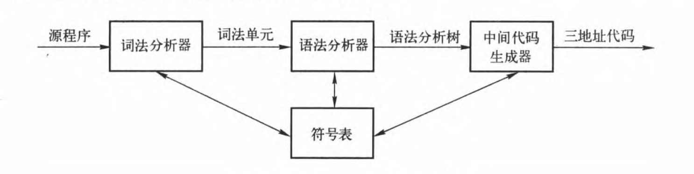
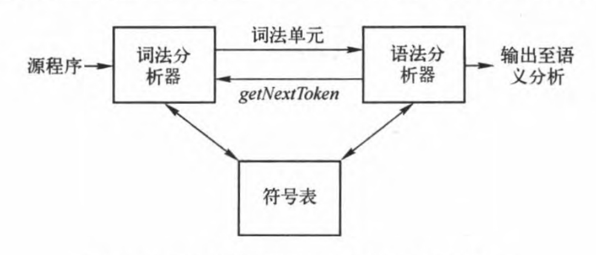
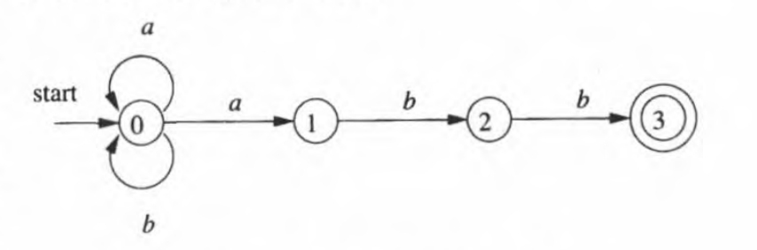
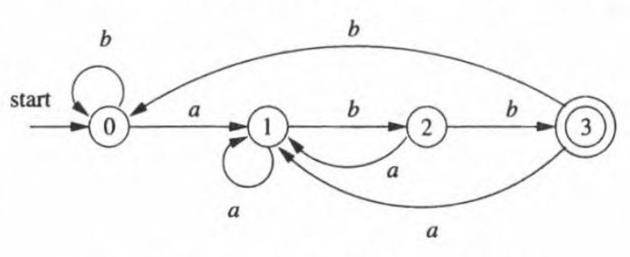

# 编译原理

一个编译器前端的模型如下图：



## 词法分析

词法分析是编译的第一阶段。**词法分析器**的主要任务是读入源程序的输入字符、将它们组成**词素**，生成并输出一个**词法单元**序列，每个词法单元对应于一个词素。这个词法单元序列被输出到**语法分析器**进行语法分析。

词法分析器通常还要和**符号表**进行交互。当词法分析器发现了 一个标识符的词素时，它要将这个词素添加到符号表中。在某些情况下，词法分析器会从符号表中读取有关标识符种类的信息，以确定向语法分析器传送哪个词法单元。



再词法分析过程中，我们需要知道以下三个术语：

- **词法单元（Tokens）**：由一个词法单元名和一个可选的属性值组成；主要的词法单元包括标识符、字符串、格式说明符、标点符号等。
- **模式（Patterns）**：是描述词法单元的规则或正则表达式。
- **词素（Lexemes）**：是源程序中实际匹配模式的具体示例。

以具体的例子进一步说明：

请分别标出 `printf("Total= % d\n",score)` 中的词法单元、模式和词素。

| 词素 (Lexeme)     | 词法单元 (Token)             | 模式 (Pattern)           |
| ----------------- | ---------------------------- | ------------------------ |
| `print`           | 标识符 (Identifier)          | `[a-zA-Z_][a-zA-Z0-9_]*` |
| `(`               | 左圆括号 (Left Parenthesis)  | `\(`                     |
| `"Total = %d \n"` | 字符串 (String Literal)      | `"[^"]*"`                |
| `,`               | 逗号 (Comma)                 | `,`                      |
| `score`           | 标识符 (Identifier)          | `[a-zA-Z_][a-zA-Z0-9_]*` |
| `)`               | 右圆括号 (Right Parenthesis) | `\)`                     |

### LEX 程序

词法分析器生成工具 Lex，也叫 Flex。它支持使用正则表达式来描述各个词法单元的模式，由此给出一个词法分析器的规约。Lex 工具的输入表示方法称为 Lex 语言(Lex language)，而工具本身则称为 Lex 编译器(Lex compiler) 。在它的核心部分,  Lex 编译器将输入的模式转换成一个状态转换图，并生成相应的实现代码，

一个典型的 Lex 程序结构如下：

```
%{
/* C 代码 */
%}

/* 定义部分 */
%%

/* 规则部分 */
%%

/* 用户代码部分 */
```

#### 1. 定义部分（申明部分）

位于 `%{` 和 `%}` 之间，用于包含需要的 C 代码或宏定义。这些代码会被直接包含在生成的词法分析器的 C 文件中，通常用于包含头文件、定义常量和声明全局变量。

```
%{
#include <stdio.h>
%}

```

#### 2. 规则部分

规则部分包含一系列模式和相应的动作。每一行定义一个规则，模式部分是正则表达式，用于匹配输入文本中的模式；动作部分是 C 代码，当模式匹配时执行相应的动作。

```
[ \t\n]+    { printf(" "); }
[^ \t\n]+   { printf("%s", yytext); }
```

#### 3. 用户代码部分（辅助函数）

用户代码部分包含主函数以及其他用户定义的函数。这部分代码在规则部分之后，通常用于实现程序的入口和其他必要的逻辑。

一个完整的 LEX 程序示例：

```
%{
	/*  definitions of manifest constants
	LT, LE, EQ, NE, GT, GE,
	IF, THEN, ELSE, ID, NUMBER, RELOP */
%}

/* regular definitions */
delim [ \t\n]
ws {delim}+
letter [A-Za-z]
digit [0-9]
id {letter}({letter}|{digit})*
number {digit}+(\.{digit}+)?(E[+-]?{digit}+)?

%%

{ws}		{/*  no action and no return */}
if			{return(IF);}
then		{return(THEN);}
else 		{return(ELSE);}
{id}		{yylval = (int) installlDO; return(ID);}
{number}	{yylval = (int) installNumO; return(NUMBER);}
"<"			{yylval = LT; return(RELOP);}
"<="		{yylval = LE; return(RELOP);}
"="			{yylval = EQ; return(RELOP);}
"<>"		{yylval = NE; return(RELOP);}
">"			{yylval = GT; return(RELOP);}
">="		{yylval = GE; return(RELOP);}

%%

int installlD() {/* function to install the lexeme, whose first character is pointed to by yytext, and whose length is yyleng, into the symbol table and return a pointer thereto */
}

int installNumO {/* similar to installlD, but puts numer-ictal constants into a separate table */
}
```

### NFA -> DFA

**NFA（Nondeterministic Finite Automaton，非确定有限状态自动机）**到 **DFA（Deterministic Finite Automaton，确定有限状态自动机）**的转换是编译原理中一个重要的过程，称为**子集构造法（subset construction method）**。这个过程涉及将一个可能具有多条转移路径的非确定性自动机转换为一个在任何状态下最多只有一条转移路径的确定性自动机。

1. **确定初始状态**。DFA 的初始状态是 NFA 初始状态的 ε-闭包（ε-closure）。ε-闭包是从某个状态出发通过零个或多个 ε 转移可以到达的所有状态的集合。
2. **构造状态转移表**。对于 DFA 的每个状态（NFA 状态的集合），计算它们在输入符号下的转移，并将这些转移添加到 DFA 的状态转换表中。
3. **处理接受状态**。DFA 的接受状态是那些包含 NFA 接受状态的状态集合。

举个例子：

假设有一个 NFA 接受正则表达式 `(a|b)*abb`，其状态转移图如下:



根据上面的状态转换图我们可以得出一个 NFA 转换表：

| 状态 | a     | b    | c    |
| ---- | ----- | ---- | ---- |
| 0    | {0,1} | {0}  | Ø    |
| 1    | Ø     | {2}  | Ø    |
| 2    | Ø     | {3}  | Ø    |
| 3    | Ø     | Ø    | Ø    |

(状态 0 经过 a 得到状态 0 和 1；状态 1 经过 b 得到状态 2；状态 2 经过 b 得到状态 3)

其中 `0` 是起始状态，`3` 是接受状态。要将这个 NFA 转换为 DFA ，我们使用子集构造法:

1. DFA 的起始状态是 NFA 起始状态 0 的 ε-closure,即 `{q0}`。
2. 对于 DFA 中的每个状态 S,对于每个输入符号 a，计算 `U = ε-closure(δ(S,a))`，其中 `δ(S,a)` 是从 S 出发经过 a 能到达的 NFA 状态集合。如果 U 不在 DFA 中，就将它加入 DFA。
3. 重复步骤 2,直到不能产生新的 DFA 状态为止。
4. DFA 的接受状态是包含 NFA 接受状态的 DFA 状态。

最后根据 NFA 转移表就能得到 DFA 状态图：



### 正则表达式构建 DFA

1. **构建正则表达式的抽象语法树**。

   首先将正则表达式转换为抽象语法树的形式。抽象语法树的每个节点对应正则表达式中的一个运算符(如连接、并、闭包等)或单个字符。

2. 通过抽象语法树计算四大函数（nullable、firstpos、lastops、followpos）。

   - nullable(n) 对于一个抽象语法树结点 n 为真当且仅当此结点代表的子表达式的语言中包含空串 ε。也就是说，这个子表达式可以“生成空串”或者本身就是空串。
   - firstpos(n) 定义了以结点"为根的子树中的位置集合。这些位置对应于以 n 为根的子表达式的语言中某个串的第一个符号。
   - lastpos(n) 定义了以结点"为根的子树中的位置集合。这些位置对应于以 n 为根的子表达式的语言中某个串的最后一个符号。
   - followpos(p) 是从位置 p 出发，经过其他位置后可能达到的 NFA 状态集合。followpos(p) = firstpos(i) ⋃(lastpos(j)

3. 构造出 D 的状态集 Dstates 和 D 的转换函数 Dtran。D 的状态就是T 中的位置集合。每个状态最初都是“未标记的”，当我们开始考虑某个状态的离开转换时,  该状态变成“已标记的”。D 的开始状态是 `firstpos(n0)，其中结点 n0 是 T 的根结点。这个 DFA 的接受状态集合是那些包含了和结束标记#对应的位置的状态。 

#### 计算 followpos

1. 如果 n 是一个连接结点，且其左右子结点分别为 C1、C2，那么对于 `lastpos(c1)`中的每个位置 i，`firstpos(C2)` 中的所有位置都在 `followpos(i)` 中。
2. 如果 n 是 star 结点，并且 i 是 `lastpos(n)` 中的一个位置，那么 `firstpos(n)` 中的所有位置都在 `followpos (i)` 中。

## 语法分析

语法分析一些代表性的文法：

E 表示一组以+号分隔的项所组成的表达式；

T 表示由一组以 * 号分隔的因子所组成的项；

F表示因子，它可能是括号括起的表达式，也可能是标识符；

```
E—>E + T | T

T —>T *F  | F

F—>(E) | id
```

无左递归版本：

```
E—> TE'
E'—>+ TE'|ε
T—> FT'
T'—>* FT'|ε
F—>(E)|id
```

下面的文法以相同的方式处理 + 和 *，可以处理语法分析过程中处理二义性的技术：

```
E—>E + E|E*E|(E)|id
```

### 上下文无关法

一个上下文无关文法（简称文法）由终结符号、非终结符号、一个开始符号和一组产生式组成。

```
stmt ——> if(expr) stmt else stmt
```

上述产生式中，各部分如下：

- **终结符号**：if、else、(、) 
- **非终结符号**：stmt、expr
- 开始符号：stmt

### 文法二义性

如果一个文法可以为某个句子生成多颗语法分析树，那么它就是**二义性（ambiguous）**的。也就是说，二义性文法就是对同一个句子有多个最左推导或多个最右推导的文法。

例如：许句子id + id * id具有两个最左推导：

```
E => E + E
  => id + E
  => id + E * E
  => id + id * E
  => id + id * id
```
```
E => E + E
  => E + E * E
  => id + E * E
  => id + id * E
  => id + id * id
```

### FIRST 集合

FIRST 集合是指一个符号串能够推导出的所有符号串中处于串首的终结符号组成的集合。对于一个非终结符号 *A*，FIRST(A) 是从 *A* 推导出的所有字符串的第一个终结符号的集合。

1. **直接收取**：对于形如 *U*→*a*… 的产生式（其中 *a* 是终结符），将 *a* 加入到 FIRST(U) 中。
2. **反复传送**：对于形如 *U*→*P*… 的产生式（其中 *P* 是非终结符），将 FIRST(P) 中的所有元素传送到 FIRST(U) 中。
3. **处理空串**：如果 *P* 能够推导出空串 *ϵ*，则继续处理 *P* 后面的符号，直到找到一个非空的终结符或到达产生式的末尾。

#### 示例

对于文法：

```
S → ABc
A → a | ε
B → b | ε
```

- FIRST(A) = {a, ε}
- FIRST(B) = {b, ε}
- FIRST(S) = {a, b, c}

### FOLLOW 集合

FOLLOW 集合是指在文法的所有句子中，可能出现在由非终结符 *A* 生成的部分之后的终结符的集合。特别地，输入结束标记（通常用 # 表示）也会包含在 FOLLOW 集合中。

1. **初始设置**：将输入结束标记 # 加入到开始符号的 FOLLOW 集合中。
2. **直接收取**：对于形如 …*Ua*… 的产生式（其中 *a* 是终结符），将 *a* 加入到 FOLLOW(U) 中。
3. **传递 FOLLOW 集合**：对于形如 *P*→…*U* 的产生式（其中 *U* 是非终结符），将 FOLLOW(P) 中的所有元素传送到 FOLLOW(U) 中。
4. **处理空串**：对于形如 *P*→…*UB*… 的产生式，如果 *B* 能够推导出空串 *ϵ*，则将 FOLLOW(P) 中的所有元素传送到 FOLLOW(U) 中，并将 FIRST(B) 中除 *ϵ* 外的所有元素加入到 FOLLOW(U) 中。

#### 示例

对于文法：

```
S → ABc
A → a | ε
B → b | ε
```

- FOLLOW(S) = {#}
- FOLLOW(A) = {b, c}
- FOLLOW(B) = {c}

这些集合能帮助编译器构建预测分析表，从而实现高效的语法分析。