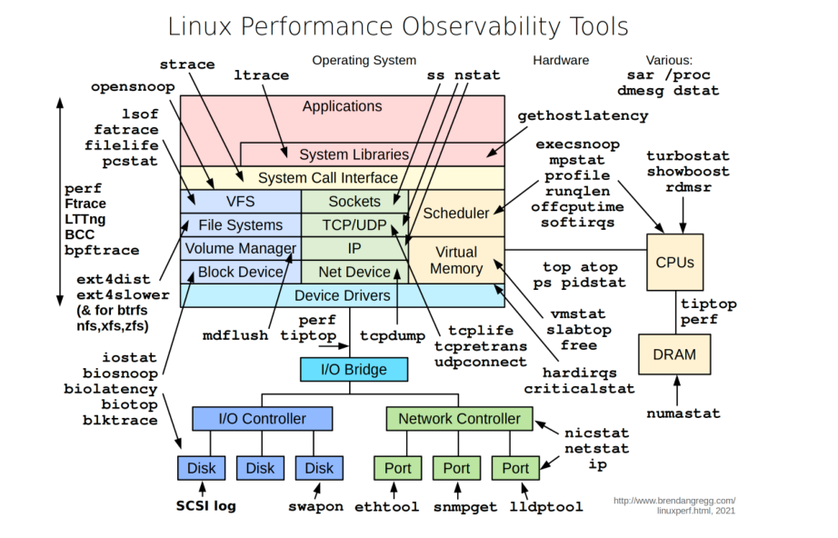

# 如何诊断一个正在进行中的神秘过程多少 CPU，内存，IO 等等?

下面的图表说明了 Linux 系统中的有用工具。

- `vmstat`: 报告有关进程、内存、分页、块IO、陷阱和CPU活动的信息。
- `iostat`: 报表系统的CPU和输入输出统计信息。
- `netstat`: 显示IP、TCP、UDP 和 ICMP 相关的统计数据。
- `lsof`: 列出当前系统的打开文件。
- `pidstat`: 监视所有或所有用户对系统资源的使用指定进程，包括 CPU、内存、设备IO、任务切换、线程等。

