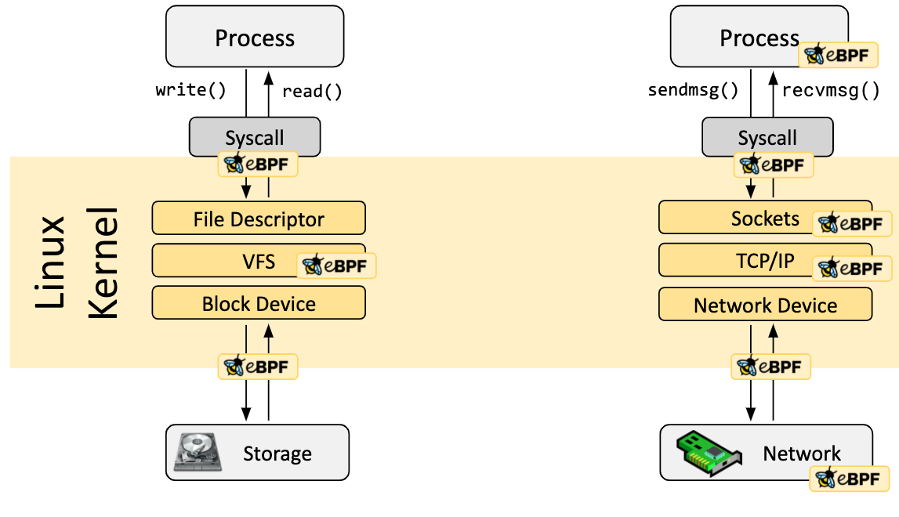

# Linux eBPF 文档

## 什么是 eBPF？

eBPF（它不再是任何东西的缩写）是一种革命性的技术，起源于 Linux 内核，可以在操作系统内核等特权环境下运行沙盒程序。**它可以用来安全有效地扩展内核的功能，而不需要改变内核的源代码或加载内核模块**。

> 在 eBPF 概念刚出来时是作为 *Extended Berkeley Packet Filter*的缩写的

从历史上看，由于内核具有监督和控制整个系统的特权，所以操作系统一直是实现可观察性、安全性和网络功能的理想场所。同时，由于操作系统内核的核心作用以及对稳定性和安全性的高要求，它很难演化了。因此，与在操作系统之外实现的功能相比，操作系统层面的创新率历来都比较低。

eBPF 从根本上改变了这个公式。通过允许在操作系统内运行沙盒程序，应用程序开发人员可以运行 eBPF 程序，在运行期间向操作系统添加额外的功能。然后，操作系统保证安全和执行效率，就像在即时编译（JIT）编译器和验证引擎的帮助下进行本地编译一样。这造就了一些基于 eBPF 的项目，涵盖了一系列广泛的用例，包括下一代网络、可观测性和安全功能。

今天，eBPF 被广泛用于推动各种用例。在现代数据中心和云原生环境中提供高性能的网络和负载平衡，以低开销提取细粒度的安全可观测性数据，帮助应用程序开发人员跟踪应用程序，为性能故障排除提供洞察力，预防应用程序和容器运行时的安全执行，等等。可能性是无穷的，而eBPF所释放的创新才刚刚开始。

### 什么是 eBPF.io?

[eBPF.io](https://ebpf.io/) 是一个供大家学习和合作的地方，eBPF 是一个开放的社区，每个人都可以参与和分享。无论你是想阅读 eBPF 的第一篇介绍，寻找进一步的阅读材料，还是想成为 eBPF 主要项目的贡献者的第一步，[eBPF.io](https://ebpf.io/) 都将帮助你一路走下去。

### 蜜蜂叫什么？

蜜蜂是 eBPF 的官方标志，最初由 Vadim Shchekoldin 创造。在第一届 eBPF 峰会上，经过投票，蜜蜂被命名为 eBee。(关于该标志可接受的使用细节，请参见 Linux 基金会[品牌指南](https://linuxfoundation.org/brand-guidelines/))。

## eBPF 简介

以下各章是对 eBPF 的快速介绍。如果你想了解更多关于 eBPF 的信息，请参阅 [eBPF & XDP](https://cilium.readthedocs.io/en/stable/bpf/) 参考指南。无论你是一个希望建立一个 eBPF 程序的开发者，还是对一个使用 eBPF 的解决方案感兴趣，了解基本概念和架构是很有用的。

### Hook 概述

eBPF 程序是事件驱动的，当内核或应用程序通过某个钩子点（hook point）时就会运行。预先定义的钩子包括系统调用、函数进入/退出、内核跟踪点、网络事件和其他一些事件。

如果一个预定义的钩子在一个特定的需求下不存在，它可以创建一个内核探针（kprobe）或用户探针（uprobe）来附加 eBPF 程序到内核或用户应用程序的几乎任何地方。

### eBPF 程序是如何编写的？

在大多数情况下，eBPF 不是直接使用，而是通过 [Cilium](https://ebpf.io/projects/#cilium)、[bcc](https://ebpf.io/projects/#bcc) 或 [bpftrace](https://ebpf.io/projects/#bpftrace) 等项目间接使用，这些项目在 eBPF 之上提供了一个抽象，不需要直接编写程序，而是提供指定基于意图的定义（intent-based definitions）的能力，而这些是是用 eBPF 实现的。

如果没有更高层次的抽象，程序就需要直接编写。Linux 内核希望 eBPF 程序以字节码的形式加载。虽然也可以直接编写字节码，但更常见的开发实践是利用 [LLVM](https://llvm.org/) 等编译器套件将伪 C 代码编译成 eBPF 字节码。

### 加载器和验证架构

当所需的钩子被确定后，eBPF 程序可以使用 bpf 系统调用（bpf syscall）加载到 Linux 内核中。这通常是使用一个可用的 eBPF 库完成的。下一节将介绍可用的开发工具链。

当程序被加载到 Linux 内核时，在被连接到请求的钩子之前，它要经过两个步骤：

### 验证（Verification）

验证步骤确保 eBPF 程序可以安全运行。它验证程序满足几个条件，例如:

- 加载 eBPF 程序的进程拥有所需的能力（特权）。除非是非特权的 eBPF 被启用，否则只有特权进程可以加载 eBPF 程序。
- 该程序不会崩溃或以其他方式损害系统。
- 该程序总是运行到结束（即该程序不会永远处于循环状态，阻碍进一步的处理）。

### 即时编译（JIT Compilation）

**即时编译（JIT）步骤将程序的通用字节码翻译成机器特定指令集，以优化程序的执行速度**。这使得 eBPF 程序可以像本地编译的内核代码或作为内核模块加载的代码一样有效地运行。

### Maps

eBPF 程序另一个重要方面是**分享收集的信息**和**存储状态**的能力。为此，eBPF 程序可以利用 eBPF maps 的概念，在广泛的数据结构中存储和检索数据。eBPF maps 可以从 eBPF 程序以及用户空间的应用程序通过系统调用访问。

下面是一个支持的 maps 类型的不完整列表，让人们了解数据结构的多样性。对于各种 maps 类型，既有共享的，也有按 per-CPU 变化（a per-CPU variation is available）。

- 哈希表、数组
- LRU (最近使用最少的)
- 环形缓冲区
- 堆栈跟踪
- LPM (最长前缀匹配)

> per-CPU variables:
>
> Linux 内核中的 per-CPU 变量实际上是一个数组，每个处理器都有一个变量的实例。每个处理器使用它自己的变量副本；这可以在不加锁的情况下完成，也不用担心缓存线跳动(cache line bouncing)的问题。例如，一些板块分配器维护 per-CPU 的空闲对象和/或页面列表；这些允许快速分配和取消分配，而不需要锁定以排除任何其他的 CPU。如果没有这些 per-CPU 列表，随着处理器数量的增加，内存分配的扩展性会很差。
>
> 具体详见：https://lwn.net/Articles/452884/

### Helper 调用

eBPF 程序不能随意调用内核函数。如果允许这样做，则将使 eBPF 程序与特定的内核版本绑定，并使程序的兼容性变得复杂。相反，eBPF 程序可以调用辅助函数，这是内核提供的一个著名的和稳定的 API。

可用的 helper 调用的集合是不断发展的。下面是现有的 helper 调用的例子：

- 产生随机数
- 获取当前时间和日期
- eBPF map 访问
- 获取进程/组上下文
- 操作网络数据包和转发逻辑

### 尾部和函数调用（Tail&Function Calls）

eBPF 程序可以使用尾部调用和函数调用的概念进行组合。函数调用允许在一个 eBPF 程序中定义和调用函数。尾部调用可以调用和执行另一个 eBPF 程序并替换执行环境，类似于 `execve()` 系统调用对常规进程的操作。

### eBPF 安全

有了巨大的力量，也必须有巨大的责任。

eBPF 是一个令人难以置信的强大技术，是现在运行在许多关键的软件基础设施组件的核心。在 eBPF 的开发过程中，当 eBPF 被考虑纳入 Linux 内核时，eBPF 的安全性是最关键的方面。eBPF 的安全性通过几个层次得到保证：

#### 要求的特权（Required Privileges）

除非非特权 eBPF 被启用，否则所有打算将 eBPF 程序加载到 Linux 内核的进程必须运行在特权模式（root）或需要 CAP_BPF 能力。这意味着不受信任的程序不能加载 eBPF 程序。

如果非特权 eBPF 被启用，非特权进程可以加载某些 eBPF 程序，但功能集减少，对内核的访问也受到限制。

#### 校验

如果一个进程被允许加载一个 eBPF 程序，所有的程序仍然通过 eBPF 校验。eBPF 校验确保程序本身的安全。这意味着，如：

- 程序被验证，以确保它们总是运行完成，例如，eBPF 程序可能永远不会阻塞或处于循环中。eBPF 程序可能包含所谓的有界循环，但只有当验证器能够确保循环包含一个退出条件，并保证成为真实时，程序才会被接受。
- 程序不得使用任何未初始化的变量或访问超出边界的内存。
- 程序必须符合系统的大小要求。不可能加载任意大的 eBPF 程序。
- 程序必须有一个有限的复杂性。验证器将评估所有可能的执行路径，并且必须能够在配置的复杂度上限的范围内完成分析。

#### 强化（Hardening）

在成功完成校验后，eBPF 程序根据程序是否从特权或非特权进程中加载，运行一个强化过程。这个步骤包括：

- 程序执行保护。持有 eBPF 程序的内核内存被保护并成为只读。如果由于任何原因，无论是内核错误还是恶意操作，eBPF 程序试图被修改，内核将崩溃，而不是允许它继续执行被破坏/操纵的程序。
- 针对 Spectre 的缓解措施。根据推测，CPU 可能会错误地预测分支，并留下可观测到的副作用，这些副作用可以通过侧面渠道提取。举几个例子：eBPF 程序屏蔽了内存访问，以便将瞬时指令下的访问重定向到受控区域，验证器还遵循仅在推测执行下才能访问的程序路径，并且 JIT 编译器在尾部调用不能转换为直接调用的情况下发出 Retpolines。
- 常量盲法（Constant blinding）：代码中的所有常量都被屏蔽，以防止 JIT 喷射攻击（JIT spraying attacks）。这可以防止攻击者将可执行代码作为常量注入，在另一个内核错误存在的情况下，可以让攻击者跳入 eBPF 程序的内存部分执行代码。

#### 抽象运行时上下文

eBPF 程序不能随意直接访问内核内存。对程序上下文之外的数据和数据结构的访问必须通过 eBPF helper 进行。这保证了数据访问的一致性，并使任何此类访问受制于 eBPF 程序的权限，例如，一个运行中的 eBPF 程序被允许修改某些数据结构的数据，如果修改可以保证安全。一个 eBPF 程序不能随意修改内核中的数据结构。

## 为什么 eBPF

### 可编程性的力量

让我们从一个比喻开始。你还记得 GeoCities 吗？20年前，网页几乎都是用静态标记语言（HTML）编写的。一个网页基本上是一个文档，有一个应用程序（浏览器）能够显示它。今天再看网页，网页已经成为完整的应用程序，基于网络的技术已经取代了绝大部分用需要编译的语言编写的应用程序。是什么促成了这种演变？

简短的回答是 JavaScript 的引入带来的可编程性。它开启了一场巨大的革命，使浏览器发展成为几乎独立的操作系统。

为什么会发生这种演变？程序员不再受运行特定浏览器版本的用户的约束。与其说服标准机构需要一个新的HTML标签，不如提供必要的构建模块，将底层浏览器的创新步伐与运行在上面的应用程序解耦。这当然有点过于简单，因为 HTM L确实随着时间的推移而发展，并为成功做出了贡献，但 HTML 本身的发展并不充分。

在把这个例子应用于 eBPF 之前，让我们先看看在引入 JavaScript 时至关重要的几个关键方面：

- **安全**：不受信任的代码在用户的浏览器中运行。这是通过沙箱 JavaScript 程序和抽象访问浏览器数据来解决的。
- **持续交付**：程序逻辑的演变必须是可能的，而不需要不断地传输新的浏览器版本。这一点通过提供足以构建任意逻辑的正确的低级构建模块得到了解决。
- **性能**：可编程性必须以最小的开销提供。引入即时(JIT)编译器解决了这个问题。

对于上述所有情况，基于同样的原因，可以在 eBPF 中找到精确的对应部件。

### eBPF 对 Linux 内核的影响

现在让我们回到 eBPF。为了理解 eBPF 对 Linux 内核的可编程性影响，它有助于对 Linux 内核的体系结构以及它如何与应用程序和硬件交互有一个高层次的理解。

Linux 内核的主要目的是对硬件或虚拟硬件进行抽象，并提供一个一致的 API（系统调用），允许应用程序运行和共享资源。为了实现这一目的，我们维护了一系列的子系统和层来分配这些责任。考虑到用户的不同需求，每个子系统通常允许某种程度的配置。如果不能配置所需的行为，就需要改变内核，从历史上看，就有两种选择。

| 原生支持                                               | 内核模块                                                     |
| ------------------------------------------------------ | ------------------------------------------------------------ |
| 1. 更改内核源代码，并使Linux内核社区相信需要进行更改。 | 1. 写一个内核模块 2. 定期修复它，因为每个内核版本都可能破坏它 |
| 2. 等待几年的时间，新的内核版本才会成为商品。          | 3. 由于缺乏安全边界，有可能破坏您的 Linux 内核的风险         |

有了eBPF，就有了一个新的选项，它允许重新编程 Linux 内核的行为，而不需要更改内核源代码或加载内核模块。在很多方面，这与 JavaScript 和其他脚本语言解锁系统进化的方式非常相似，这些系统的改变变得非常困难或昂贵。

## 开发工具链

存在一些开发工具链来帮助 eBPF 项目的开发和管理。它们都能满足用户的不同需求：

### bcc

[BCC](https://github.com/iovisor/bcc) 是一个框架，使用户能够编写嵌入 eBPF 程序的 python 程序。该框架主要针对涉及应用程序和系统剖析/跟踪的用例，其中一个 eBPF 程序被用来收集统计数据或生成事件，在用户空间的对应程序收集数据并以人类可读的形式显示。运行 python 程序将生成 eBPF 字节码并将其加载到内核中。

### bpftrace

[bpftrace](https://github.com/iovisor/bpftrace) 是Linux eBPF 的高级跟踪语言，在最近的 Linux内核（4.x）中可用。bpftrace 使用 [LLVM](https://llvm.org/) 作为后端，将脚本编译为 eBPF 字节码，并利用 BCC 与 Linux eBPF 子系统以及现有的 Linux 跟踪功能进行交互：内核动态跟踪（kprobes），用户级动态跟踪（uprobes）和跟踪点。bpftrace 语言的灵感来自于 awk、C 和前辈的追踪器，如 DTrace 和 SystemTap。

### eBPF Go 库

eBPF Go 库提供了一个通用的 eBPF 库，它解耦了获得 eBPF 字节码的过程和 eBPF 程序的加载和管理。eBPF 程序通常是通过编写高级语言创建的，然后使用 clang/LLVM 编译器编译为 eBPF 字节码。

### libbpf C/C++ 库

libbpf 库是一个基于C/C++的通用 eBPF 库，它有助于将从 clang/LLVM 编译器生成的 eBPF 对象文件解耦到内核中，并通过为应用程序提供易于使用的库 API 来抽象出与 BPF 系统调用的互动。

## 原文地址

https://ebpf.io/what-is-ebpf/#documentation